# 制作你自己的烧结零件

> 原文：<https://learn.sparkfun.com/tutorials/make-your-own-fritzing-parts>

## 什么是 Fritzing？

[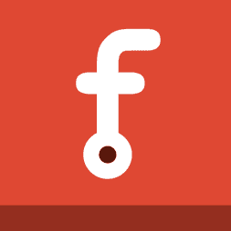](https://cdn.sparkfun.com/assets/5/3/4/3/1/52b1e48a757b7f28448b4567.png)

Fritzing 是一个伟大的开源工具，任何人都可以用来教授、分享和原型制作他们的电子项目！它允许您设计一个原理图，从而设计一个部件，然后可以将其添加到非常专业的布线图中。你甚至可以设计自己的印刷电路板，并让他们根据你设计的文件[制作](http://fab.fritzing.org/fritzing-fab)。在 SparkFun，我们在教室、我们的连接指南和任何其他需要展示如何将我们的电路板连接到其他硬件的地方使用 Fritzing。

*Fritzing example of the [INA169](https://learn.sparkfun.com/tutorials/ina169-breakout-board-hookup-guide) connected to an Arduino*

Fritzing 最棒的一点是，您可以为您的项目制作自己的 Fritzing 部件，并与社区共享！本教程将从头开始介绍如何在 Fritzing(新)零件编辑器中制作定制的 Fritzing 零件。

### 你需要定制烧结零件吗？

Fritzing 带有大量已经安装了该软件的电子零件。SparkFun 还有一个 [Fritzing Github repo](https://github.com/sparkfun/Fritzing_Parts) ,用于存放我们已经创建但尚未在 Fritzing 中使用的部件。在创建你自己的零件之前，仔细检查它是否存在于这两个地方，或者是否另一个 Fritzing 用户已经在 [Fritzing 论坛](http://fritzing.org/forum/)上制作了你需要的零件。如果零件已经做好了，会节省你很多时间！然而，如果你确定你需要的零件已经不在 Fritzing land 了，请继续读下去！

### 推荐阅读

本教程假设您已经熟悉 Adobe Illustrator 和/或 Inscape。使用这些程序超出了本教程的范围。如果你需要更多关于如何使用这些程序的信息，他们各自的网站应该有很多关于如何开始使用矢量图形的教程和指南。如果失败了，还有谷歌。

在阅读本教程之前，您可能还想看看其他相关教程:

*   [PCB 基础知识](https://learn.sparkfun.com/tutorials/pcb-basics)
*   [集成电路](https://learn.sparkfun.com/tutorials/integrated-circuits)
*   [连接器基础知识](https://learn.sparkfun.com/tutorials/connector-basics)
*   [使用 GitHub](https://learn.sparkfun.com/tutorials/using-github)
*   [如何使用试验板](https://learn.sparkfun.com/tutorials/how-to-use-a-breadboard)
*   [如何阅读原理图](https://learn.sparkfun.com/tutorials/how-to-read-a-schematic)

## 下载并安装

您将需要下载并安装以下软件，以便跟进并制作您自己的定制熔结零件。

**请注意:**如果你只需要制作一个基本的 ic，Fritzing (New) Parts Editor 可以让你轻松制作定制的 IC，你不会需要下载一个矢量图形编辑器。您仍然可以继续学习，因为本教程将在 Fritzing (New)器件编辑器中构建一个自定义 IC。

### 烧结

前往 [Fritzing](http://fritzing.org/download/) 网站的下载页面，为您的操作系统下载最新的 Fritzing 版本。找到你想在硬盘上放 Fritzing 应用程序的地方，并在那个位置解压 Fritzing 文件夹。

### 矢量图形编辑器

有很多不同类型的矢量图形编辑器。我们在 SparkFun 使用的矢量图形编辑器是 Adobe Illustrator 和 Inkscape。选一个你最熟悉最舒服的。如果你没有矢量图形编辑器，Inkscape 是一个很好的开源选择，而且是免费的。

#### Inkscape

转到 [Inkscape](http://inkscape.org/en/download/) 下载页面，为您的计算机下载合适的官方发布包。

Windows 用户:双击可执行文件。按照 Inkscape 安装向导进行操作。

Mac OS X 用户:跟随 Inkscape 网站上的最新指示。

#### Adobe Illustrator 中

Adobe Illustrator 不是免费的，但是如果你已经有了 Adobe [Creative Cloud](http://www.adobe.com/products/illustrator.html) 你可以下载它。您也可以购买 Illustrator 月度会员资格。

**请注意:**我们与 Adobe 没有任何关系，我们只是在推广 Illustrator，因为它是一款非常棒的软件，能够很好地满足我们在本教程中的需求。

### 其他下载

#### 烧结字体和模板

Fritzing 使用 IC 的 [OCR-A](http://en.wikipedia.org/wiki/OCR-A_font) 字体。对于所有其他部分，你可以使用 OCR-A 和 [Droid Sans 字体](http://en.wikipedia.org/wiki/Droid_sans)。Fritzing 网站上有字体和模板可供下载。你需要下载 Fritzing 的图形标准来遵循本教程。去他们的[模板下载页面](http://fritzing.org/fritzings-graphic-standards/download-fonts-and-templates)，下载 Fritzing 的图形标准文件夹。下载他们的 zip 文件后，您需要确保解压缩文件夹，并将其放在您计算机上的任何地方。您需要在计算机上安装这些字体。

#### SparkFun Fritzing 示例模板

本教程将大量引用 SparkFun Fritzing 示例模板。如果您正在为 SparkFun 板制作熔块零件或想要一个起点，请从 [SparkFun 熔块零件 Github repo](https://github.com/sparkfun/Fritzing_Parts/tree/master/templates) 下载这组示例模板。SparkFun Fritzing 模板将有本教程的例子，SparkFun T5403 气压计突破 SVG，文件进行比较和工作。

## 试验板视图

当 Fritzing 开始时，你应该在欢迎视图中。你会想去试验板视图。

[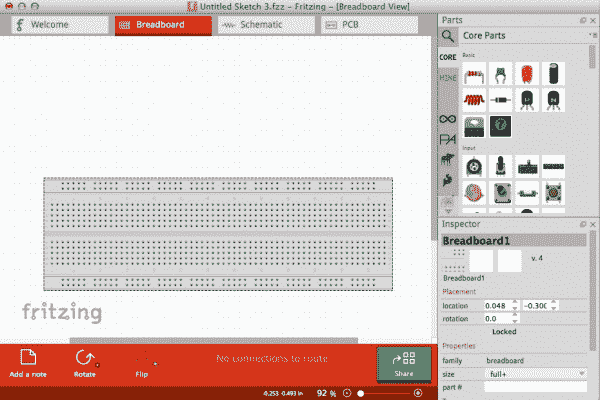](https://cdn.sparkfun.com/assets/8/2/a/8/e/52e8057bce395ff20b8b4567.jpg)

在试验板视图中，您需要完成两个主要步骤。首先，创建您的试验板 SVG，并上传它。Fritzing 更喜欢使用 [SVG](http://en.wikipedia.org/wiki/Scalable_Vector_Graphics) 格式，所以当你放大和缩小时，你的图像看起来很棒！第二，你需要改变连接器引脚。

**请注意:**如果你只是在制作一个基本的 ic，你可以跳到本教程的编辑试验板视图部分。

### 烧结图形标准

在 Fritzing 网站上，有大量的[图形标准](http://fritzing.org/fritzings-graphic-standards/)可以遵循。这是一个伟大的想法，遵循图形标准的方式，你的零件匹配其他烧结零件。

### 模板

在制作你的零件时，建议从一个模板开始。有一个图像的一部分，以参考，所以，当制作您的 SVG 文件，这一进程将会更快。

**提示:**如果您正在为在 EAGLE 中制作的电路板制作定制的烧结零件，您可以下载一个将电路板转换为 SVG 的 ULP。这样你可以有一个精确的鹰板 SVG 作为参考。你可以在 [Cadsoft 网站](http://www.cadsoftusa.com/downloads/ulps?language=en)上找到 EAGLE ULPs。

是时候为试验板视图制作图形了！

## 创建新零件

在本教程中，我们将为 SparkFun T5403 气压计突破创建一个烧结零件。

[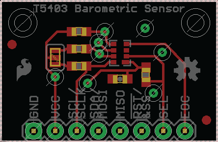](https://cdn.sparkfun.com/assets/0/2/e/b/0/52b20bacce395f82688b456a.png)*EAGLE image of the SparkFun T5403 Barometer Breakout*

打开 Fritzing 应用程序。您应该会在程序顶部看到欢迎、试验板、原理图和 PCB 标签。单击试验板按钮，确保您处于试验板视图中。

#### 检查预制零件

如果您只是在 Fritzing 中更新电路板，首先检查是否有与您试图创建的 Fritzing 零件密切相关的零件。您可以在搜索栏中键入部件的名称。

*The search bar can be found at the top of the Parts window*

您也可以在 Fritzing 零件窗口的不同部分寻找相似的零件。

[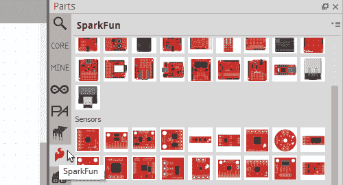](https://cdn.sparkfun.com/assets/3/e/3/7/2/52b20f06ce395f03228b456a.png)*Look for the SparkFun flame to see a huge section of SparkFun Fritzing parts*

#### 使用集成电路作为起点

如果没有像你要做的那种零件，使用 IC 作为基础是一个很好的开始。点击零件窗口中的**核心**选项卡。向下滚动，直到看到 ICs。在“ICs(集成电路)”部分，单击集成电路图标并将其拖到试验板窗口上。

[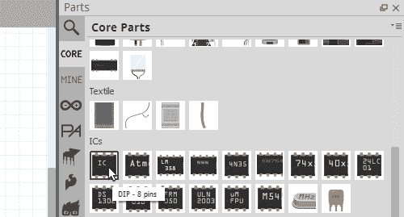](https://cdn.sparkfun.com/assets/4/b/e/9/5/52b214aece395f237a8b4568.png)*Custom ICs are simple, since Fritzing lets you change the number of pins and the IC package*

#### 更改集成电路的名称

在右侧的**检查器**窗口中查找 **IC** 属性。将 IC 的名称更改为您的器件名称。然后，在引脚部分更改电路板或器件所需的引脚数。对于 SparkFun T5403 气压计突破，我们需要 8 针。在试验板视图中，您会看到 IC 更改为您的器件名称。

### Fritzing(新)零件编辑器

右键单击试验板窗口中的 IC，并选择编辑(新器件编辑器)。应该会弹出 Fritzing(新)部件编辑器。

[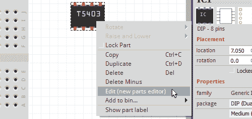](https://cdn.sparkfun.com/assets/3/a/b/2/5/52b214aece395f967c8b4569.png)

Fritzing(新)零件编辑器有 6 个主要部分，您需要在其中进行更改。这些是:

*   试验板
*   图解的
*   印刷电路板
*   图标
*   [计]元数据
*   连接器

真的没有你需要遵守的命令。在制作了几个不同的定制部分后，你可能会在一个视图中先于其他视图开始。在本教程中，我们将沿着列表往下走。

**作者注:**我发现，对于有大量引脚的电路板，从连接器视图开始会节省一点时间，因为您可以更快地在列表中命名连接器引脚。

在继续之前，最好先保存为新零件。如果您在制作定制零件时需要随时停止，您可以在将来重新开始。转到*文件*。然后，选择*另存为新零件*。

[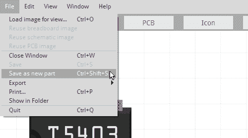](https://cdn.sparkfun.com/assets/7/1/6/8/1/52b21b8ece395f78708b4567.png)

如果需要，您可以选择命名前缀。

* * *

让我们继续看试验板视图！

## 定制试验板服务

### 创建文件

打开矢量图形编辑器，创建一个新文件。文件的图像大小应该与您的纸板大小相同。SparkFun T5403 气压计突破尺寸为 1 英寸 x 0.650 英寸。您需要用一个好的命名约定保存文件，因为在创建 Fritzing 零件时，您最终需要 3 个不同的 svg 文件。

**Illustrator 用户:**进入文件- >另存为，另存为 SVG，点击保存即可保存。

在这个例子中，试验板 SVG 被命名为:*SFE _ t 5403 _ 气压计 _ 分线点 _ 试验板. svg*

### 使用模板作为参考

要比较不同的层和组，您可以打开 Fritzing bread board view graphic _ Template . SVG 文件，该文件位于您之前下载的 Fritzing Fonts and Template 文件夹中。您也可以从 spark fun Fritzing Parts Github repo 打开 spark fun t 5403 Barometer Breakout bread board SVG 模板文件示例。

通过示例模板，您可以看到如何组织各层。对于 SparkFun T5403 气压计突破，有一个“试验板”组。在试验板组内部，它将具有部件组、铜层、丝网印刷组和板路径。

### 制作自定义试验板图形的技巧

现在，您可以创建自定义部件的试验板图形。这里有一些有用的提示！

#### 遵循烧结图形标准

以下是试验板图像的一些主要颜色标准:

为了符合烧结图形标准，你会想要使铜接触铜/镀锡颜色。

*HEX: 9A916C, RGB: 154 145 108*

如果你的棋盘上有腿，那就用灰色。

*HEX: 8C8C8C, RGB: 140 140 140*

SparkFun Red 是:

*HEX: E62C2E, RGB: 230 44 46*

#### 保持简单

Fritzing 的伟大之处在于，你可以根据自己的意愿让你的电路板变得简单或复杂。因为 SparkFun 总是试图通过修改和拥有大量电路板来使我们的产品更好，所以我们可以更容易更快地在电路板上不包含某些细节，如迹线或每个组件。这样，如果电路板发生新的变化，比如电阻值发生变化，我们就不必在烧结部分更换电阻。更专注于重要的组件，如集成电路，可能是一个更好的方式来花时间。它仍然会看起来很好，但更少的工作！

#### 使用已经存在的组件

如果你的电路板上需要一个已经在烧结的 SMD LED，那就去用吧！这将节省您的时间，并保持所有烧结部分具有相同的外观和感觉。如果你用其他人可以使用的组件创建了一个定制板，你可以在 Fritzing 站点上共享它们，这样其他人也可以使用！确保在您使用的矢量图形编辑器中很好地组织元件图形，以便在未来的主板上使用时很容易找到这些部件。

#### 命名铜组中的连接器引脚

命名你的连接器将会节省大量的时间。对于 SparkFun T5403 气压计分线示例，在铜线组下，每个连接器都被命名为连接器#pad。

*Example in Illustrator. If you are using Inkscape, you will still want to make sure the connectors are appropriately named.*

#### 使用 ORC-A 或 Droid Sans 字体。

坚持使用 Fritzing 字体，以保持所有 Fritzing 部分看起来一样。建议标准字体大小为 5pt。然而，有些时候你将没有空间容纳更小的主板。你不会想要低于 3 磅，因为如果不放大的话会变得难以看清。在 Fritzing 网站上，他们提到使用黑色作为字体颜色。无论你的丝印颜色是什么，看起来都会更好。在本例中，我们使用白色，因为这是分线板的丝网印刷色，在红色背景下更容易阅读。

#### 创建一个复合路径，使纸板开口透明

**Illustrator 用户:**按照你的 PCB 大小创建一个路径。对于 SparkFun T5403 气压计突破，您可以使用矩形工具制作一个 1 英寸 x 0.650 英寸的矩形。然后，在你的板上有开口的地方做路径。例如，您可以使用矩形工具下的椭圆工具，在有支架和连接器引脚开口的地方制作完美的圆。选择所有开孔层和底部 PCB 层。

*Make sure the bottom PCB layer is selected*

接下来，转到**对象**->-**复合路径**->-**制作**。你现在应该有一个复合路径，你将能够通过 Fritzing 中的开口看到。

*Final breadboard graphic***Inkscape Users:** For those using Inkscape, you will still create a rectangle using the rectangle tool. Set a color for the **Fill:** while leaving the **Stroke:** as *Unset*. Select the layers for the rectangle and board in the "**Objects**" tab with the `Ctrl` key. Next, go to **Path** -> **Difference**. The two layers will combine into one layer with the see through holes. You should see the same effect as if you were designing the board in Fritzing. For more information, check out the [Inkscape tutorial using the Boolean operations](https://inkscape.org/en/doc/tutorials/advanced/tutorial-advanced.html).

### 救援

一旦你完成创建你的定制板，确保再次保存为 SVG！现在，您可以继续编辑试验板视图。

## 试验板视图-零件编辑器

### loadimage

创建自定义试验板图像后，您将需要在 Fritzing (New) Parts Editor 中加载试验板 SVG。首先，返回 Fritzing (New) Parts 编辑器，单击试验板按钮进入试验板视图。转到文件->加载图像进行查看。

[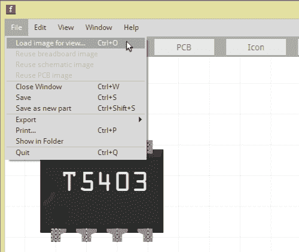](https://cdn.sparkfun.com/assets/e/4/2/5/7/52b232c7ce395ff9678b456a.png)

接下来，您将选择刚刚创建的试验板 SVG 并点击 Open。图形现在应该在 Fritzing(新)零件编辑器中。

### 连接器

在主熔结应用程序中工作时，用彩色电线连接不同的熔结零件，以显示零件之间的连接方式。为了让 Fritzing 知道连接器引脚在电路板或零件上的位置，您需要告诉 Fritzing 这些连接器在哪里。

#### 连接器引脚的名称和描述

对于试验板视图，连接器窗口将位于 Fritzing (New)部件编辑器的右侧。选择一个接点以更改接点的名称并添加描述。

*Choose any of the connector pins to edit*

#### 选择连接器插针的图形

单击连接器引脚名称右侧的选择图形按钮。然后，单击连接器引脚的图形。这将设置锚点。锚点是导线连接到该连接器的位置。默认情况下，终点将显示在所选图形的中间。如果您想要移动终端点，您可以点击终端点并保持移动。您也可以通过单击连接器窗口中的“中心”、“W”、“N”、“S”或“E”来更改端点。

[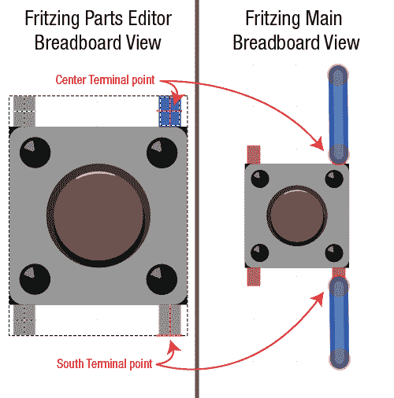](https://cdn.sparkfun.com/assets/f/b/8/4/6/52b26429ce395fee6b8b4569.png)*You can see the difference in the placement of the wire when you change the Terminal point*

#### 更改连接器类型

在连接器窗口中更改连接器的类型。您可以选择公、母或垫。对于 SparkFun T5403 气压计分线点，所有连接器引脚都是母的。

在下图中，您可以看到将连接器类型设置为公与母的区别。

[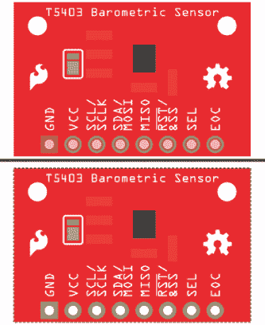](https://cdn.sparkfun.com/assets/0/c/d/3/8/52b26993ce395f61148b4569.png)*Top board has the connector type set at male. Bottom board has the connector type correctly set at female.*

### 对所有连接器引脚重复上述步骤

名称，选择适当的图形，并更改所有连接器插针的连接器类型。您也可以在“连接器”窗口中设置内部连接。

## 示意图

### 自定义原理图 SVG

返回 Illustrator、Inkscape 或您正在使用的矢量图形编辑器。在下载的字体和模板文件夹中打开 Fritzing 的 SchematicViewGraphic _ template . SVG。您也可以从 spark fun Fritzing Parts Github repo 中打开示例 SparkFun T5403 气压计分解示意图 SVG 模板文件。

当编辑原理图以匹配您的电路板时，您需要确保显示每个连接器引脚。您可能希望更改接点标签以匹配连接器接点名称。根据您的零件，您可能需要调整模板原理图的大小。确保主要零件符号正方形和外部销边缘之间有 0.1 英寸的空间。

[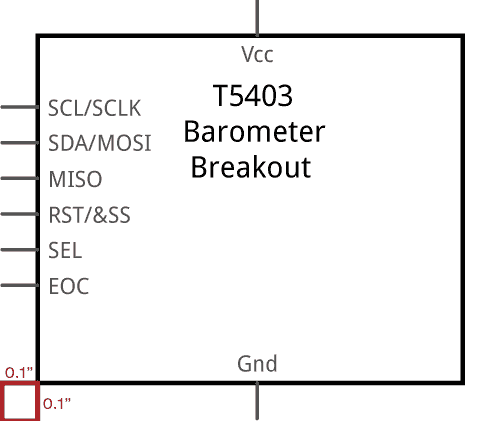](https://cdn.sparkfun.com/assets/5/c/a/3/6/52b270a3ce395ffd0e8b4567.png)*Make sure to delete the 0.1" dimension helper box, so it doesn't show up in the final Fritzing schematic graphic*

#### 拯救 SVG

你会想确保保存为一个新的 SVG。请记住，要有一个命名约定，以便于区分为 Fritzing 部件创建的其他 SVG 文件。

### 在零件编辑器中编辑图解视图

#### SVG 负载

返回零件编辑器，点击原理图按钮，进入原理图视图。转到文件->加载图像进行查看。接下来，您将选择刚刚创建的原理图 SVG，并单击 Open。零件现在应该在 Fritzing(新)零件编辑器中。

#### 设置连接器引脚

如果您查看右侧的连接器窗口，您会注意到您的管脚名称已经在那里了。当您在试验板、原理图、PCB 或连接器视图中更改连接器引脚的名称和描述时，器件编辑器将自动更改其他视图的连接器引脚的名称和描述。此外，连接器类型(公、母或垫)将保持不变。

就像在试验板视图中一样，您仍然需要为每个引脚选择一个图形。点击“选择图形”按钮，为该引脚选择合适的图形。对于示意图，您可能需要更改端点，以便连接线在最远的点连接。

最简单的方法是确保连接器插针的图形仍处于选中状态，并在连接器窗口中更改端子点。对于 GND 图形，通过单击“S”将终点移动到南端。

### 对所有连接器重复上述步骤

更新完所有连接器引脚后，您可以继续在 PCB 视图中进行编辑。

## PCB 视图

### 制作定制 PCB SVG

返回 Illustrator、Inkscape 或您正在使用的矢量图形编辑器。当制作一个定制的 PCB SVG 时，你需要的主要图像组是铜(它将包含你所有的连接器焊盘)和丝网印刷。

#### 创建 PCB 图形

您可以在创建 PCB SVG 时重新开始，修改您的自定义试验板 SVG，或者在下载的字体和模板文件夹中编辑 Fritzing 的 PCBViewGraphic_Template.svg。对于这个例子，自定义试验板 SVG 被修改，文件被保存为一个新的 SVG，名为 SFE _ t 5403 _ 气压计 _Breakout_PCB.svg

#### 确保有两个铜组

设置图层时，确保有两个铜组。所有的连接器层都应该在铜组中。当你这样做时，Fritzing 将知道元件在 PCB 的两侧都有铜连接器。

[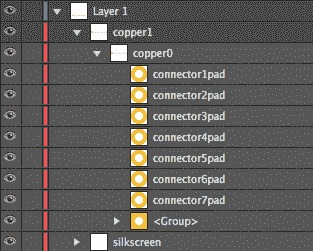](https://cdn.sparkfun.com/assets/learn_tutorials/1/4/4/PCB_screenshot_layer.png)*Illustrator example of having two copper groups*

#### 确保连接器引脚的间距准确

PCB 连接器引脚必须与您的电路板精确匹配，引脚之间要有适当的间距，这一点很重要。Fritzing 提供 [PCB 制造服务](http://fab.fritzing.org/fritzing-fab)。如果您或其他 Fritzing 用户希望将该服务用于您的定制部件，您将需要确保您的 PCB 视图是准确的。

#### 图形标准

PCB 视图连接器引脚不是铜/镀锡绿色，而是“铜”色:

*Hex: F7BD13 RGB: 247 189 19*

定制试验板 SVG 的主要变化是主要组是铜和丝网印刷。丝印还是会是白色的。

*Final PCB Graphic*

### 在器件编辑器中编辑 PCB 视图

返回器件编辑器，点击 PCB 按钮进入 PCB 视图。转到文件->加载图像进行查看。接下来，您将选择刚刚创建的 PCB SVG，并单击 Open。零件现在应该在 Fritzing(新)零件编辑器中。

#### 更新连接器引脚

为每个连接器引脚选择适当的图形，就像您在试验板和示意图中所做的那样。

## 图标视图

### 重复使用过去的图形

进入 Fritzing (New)零件编辑器，点击图标按钮进入图标视图。图标视图的伟大之处在于，你可以重复使用你的试验板、原理图或 PCB SVG 作为图标图像，所以没有必要制作新的图像！你所要做的就是进入文件，选择你想要重复使用的图片。对于 SparkFun T5403 气压计突破，图标视图重用试验板图像。试验板图像应该会显示出来。

*伟大的斯科特！*您现在已经完成了图标视图！

## [计]元数据

### 前往元数据视图

转到部件编辑器，并单击元数据按钮进入元数据视图。元数据是您添加零件所有重要信息的地方！

#### 元数据视图中的不同部分

**标题:**漂亮不言自明。这将是你角色的名字。

**日期:**日期条目在 Fritzing 中被锁定。日期应显示您创建零件的日期。如果您稍后更新零件，日期将更改为上次更新的当前日期。

**作者:**你会想把你的名字写在这里，所以，如果你把你的部分分享给 Fritzing 社区，他们知道是谁制作了这个部分。

**描述:**描述应包括任何与电路板相关的重要内容，如工作电压。

**标签:**标签显示在示意图中，便于辨别你选择了哪个部分。对于 SparkFun T5403 气压计突破，标签更改为零件。原因是，因为零件相当小，而且 SparkFun T5403 气压计突破名称已经在示意图本身上。你想给你的零件贴什么标签取决于你自己！

**URL:** 考虑张贴零件的 URL，这样任何人都可以获得关于您的零件的更多信息。

**系列:**如果您有不同颜色、芯片封装等的零件，您会希望它们属于同一系列。例如，如果您有一个不同颜色的通孔 LED，同一 LED 的所有不同颜色将属于同一系列。

**变量:**当创建一个全新的零件时，您希望确保变量为 1。当您将来进行修订时，如果它在同一个系列中，它会将下一个修订更改为变体 2。

**属性:**放置零件号、引脚间距等重要细节的地方。

**标签:**使用更容易找到的标签，用尽可能少的话来描述你的部分。

[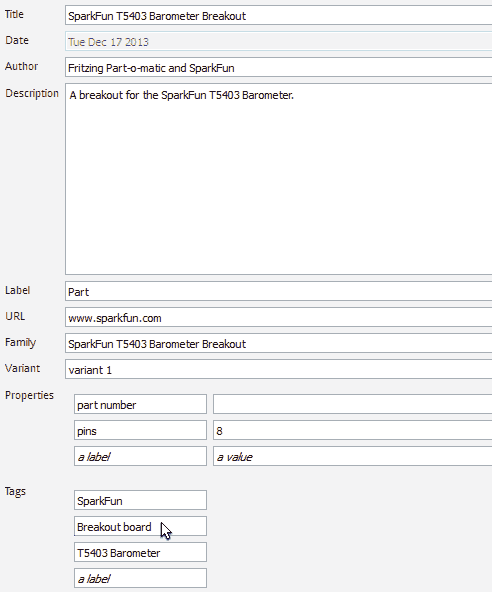](https://cdn.sparkfun.com/assets/b/7/4/5/f/52b27eb0ce395fff168b4569.png)*Feel that the info is a little lacking? You can update this content again later when you have more to write.*

## 连接器视图

### 转到连接器视图

转到部件编辑器，并单击连接器按钮进入连接器视图。在连接器视图中，您可以执行以下操作:

*   更改连接器的数量
*   设置连接器类型
*   将连接器引脚设置为通孔或 SMD
*   名称连接器引脚
*   添加连接器引脚描述

您不需要在 Connectors 视图中做任何更改，因为您已经在其他视图中填写了所有信息。如果你需要做任何最后的改变，现在你可以。请记住，如果您在这里更改连接器数量，您需要返回并更新试验板、原理图和 PCB 视图。

### 救援

现在你可以拯救你的角色了！转到文件>保存

继续导出零件！

## 导出新零件

### 烧结应用中的质量检查

是时候在主烧结应用程序中检查您的新烧结零件了。当您之前在 Fritzing (New) Parts Editor 中保存为新零件时，该零件会自动显示在 Fritzing 主应用程序的 MINE 选项卡中的 My Parts 标签下。

在导出新的自定义零件之前，您需要检查每个视图是否看起来都不错。确保您在主 Fritzing 应用程序中，而不是 Fritzing(新)零件编辑器中。点击顶部的试验板按钮，进入试验板视图。在右侧的“零件”窗口中，确保您位于“矿山”标签中。你应该看看你的新角色。在试验板视图中单击并拖动电路板。

仔细检查针脚名称是否正确，工作是否正常。在原理图和 PCB 视图中进行同样的操作。完成质量检查后，您可以导出零件。

### 出口零件

在“我的零件”窗口中右键单击新零件的图标，然后选择“导出零件”。省省你的油炸部分吧。

[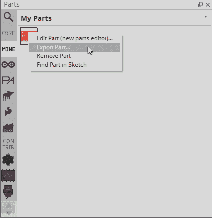](https://cdn.sparkfun.com/assets/f/8/a/4/a/52b284dece395fdd738b4567.png)*Congratulations, you made your own Fritzing Part!*

## 资源和更进一步

记得查看 Fritzing 软件或 [Fritzing 论坛](http://fritzing.org/forum/)看看零件是否已经制成。或者您可以查看我们回购中的 SparkFun 零件库。此外，查看 Fritzing 创建定制零件的登录页面，了解其他人如何在 Fritzing 中创建零件、图形标准、模板、命名约定和格式化文件的方法。

*   Fritzing.org
    *   [创建定制零件](http://fritzing.org/learning/tutorials/creating-custom-parts/)
    *   [Fritzing 论坛](http://fritzing.org/forum/)
        *   [教程和操作方法](https://forum.fritzing.org/c/ttutorials/24)
    *   黑客日
        *   [提示和技巧](https://hackaday.io/project/27257/logs?sort=oldest)
        *   [在所有产品中创建 PCB:在烧结中创建定制零件](https://hackaday.com/2017/01/06/creating-a-pcb-in-everything-creating-a-custom-part-in-fritzing/)
*   [GitHub Repo](https://github.com/sparkfun/Fritzing_Parts) -不包括在 Fritzing 软件库中的 SparkFun 零件库

### 有助于烧结

现在你已经完成了你的部分，你可以连接其他的烧结部分。您可以在 Fritzing 网站上分享您的部分或项目教程。还有很多方法可以为 Fritzing 社区做贡献！查看 Fritzing [支持我们](http://fritzing.org/support-us/)页面，了解更多支持 Fritzing 的方式。

### 大批量烧结零件？

如果你是一个使用 EAGLE 的开发人员，或者是一个投入大量时间制作 Fritzing 部件的人，Fritzing 团队已经开源了一个工具包来制作 EAGLE 的 SVG 文件。brd 文件。强烈建议您检查是否正在创建准备用于 Fritzing 的 SVG 板文件批次。他们有将 Eagle 转换成 Fritzing 的源代码。

*   [GitHub Repo-eagle 2 fritzing](https://github.com/fritzing/eagle2fritzing)

### 进一步阅读

在 SparkFun，我们在学习教程中大量使用 Fritzing。查看我们如何在不同的教程中使用 Fritzing 来展示如何将不同的部分连接在一起。以下是一些在连接部分使用 Fritzing 的教程:

*   [INA169 分线板连接导轨](https://learn.sparkfun.com/tutorials/ina169-breakout-board-hookup-guide/hookup-example)
*   [倾斜旋转连接导轨](https://learn.sparkfun.com/tutorials/tilt-a-whirl-hookup-guide/hardware-hookup)

如果您想了解更多关于使用其他软件设计自己的 PCB 的信息，请访问以下教程:

*   [安装和设置 EAGLE](https://learn.sparkfun.com/tutorials/how-to-install-and-setup-eagle)
*   [使用 EAGLE:示意图](https://learn.sparkfun.com/tutorials/using-eagle-schematic)
*   [使用 EAGLE:电路板布局](https://learn.sparkfun.com/tutorials/using-eagle-board-layout)

寻找更多关于 Fritzing 的信息？看看这些相关的博客帖子:

 [### 油炸食品。

July 25, 2011](https://www.sparkfun.com/news/663 "July 25, 2011: Fritzing - now with SparkFun parts!")[Favorited Favorite](# "Add to favorites") 2 [### 公开讨论:出故障

March 13, 2019](https://www.sparkfun.com/news/2888 "March 13, 2019: Let's talk about Fritzing and its uses, pitfalls and potential replacements.")[Favorited Favorite](# "Add to favorites") 2 [### 今日英语:升级闪电探测器

September 5, 2019](https://www.sparkfun.com/news/3086 "September 5, 2019: The trail-ready lightning detector has been out in the wild getting some good use. As summer nears its end, it is a great time to take the project back to the drawing board and figure out what should be upgraded, what should be added and what can be removed – just in time for some fall outdoor adventures!")[Favorited Favorite](# "Add to favorites") 3

对于零件的矢量图像，尝试电子图形资源，这样您就不必从头开始制作零件。

 [### 电子图形资源

#### 2014 年 2 月 6 日](https://learn.sparkfun.com/resources/37) Illustrator file with a variety of electronics images and icons. Made by Adam Meyer of bildr.org.[Favorited Favorite](# "Add to favorites") 4