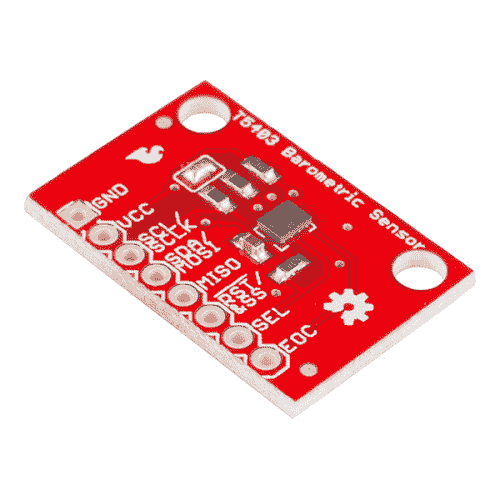
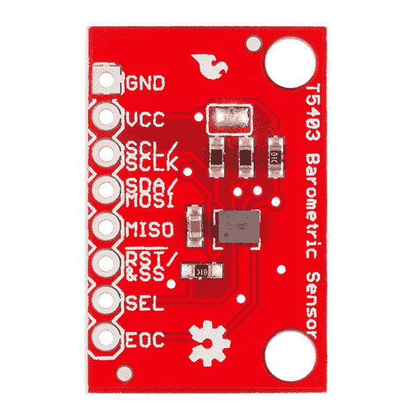
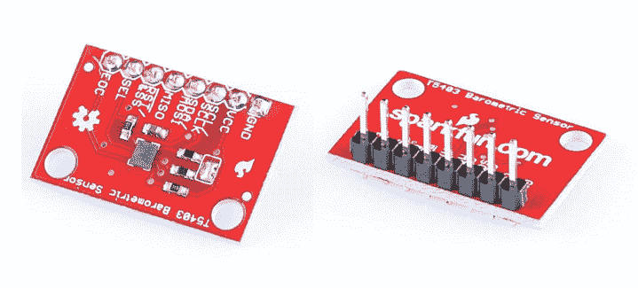
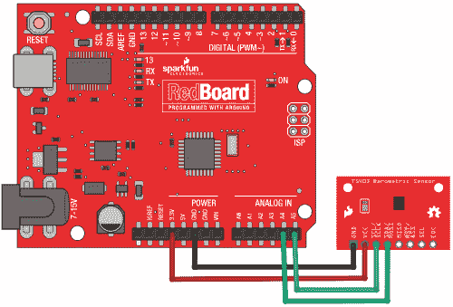
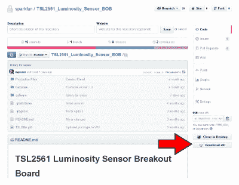
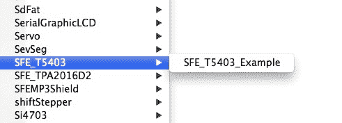
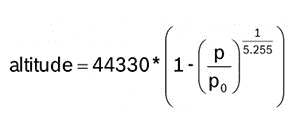

# T5403 大气压力传感器连接指南

> 原文：<https://learn.sparkfun.com/tutorials/t5403-barometric-pressure-sensor-hookup-guide>

## 介绍

[T5403](https://www.sparkfun.com/products/12039) 是一个带有 I ² C(“导线”)接口的气压传感器。气压传感器测量周围空气的绝对压力。这种压力随着天气和高度而变化。根据您对数据的理解，您可以监控天气变化、测量海拔或任何其他需要精确压力读数的任务。

 

### [SparkFun 气压传感器分接头- T5403](https://www.sparkfun.com/products/retired/12039)

[Retired](https://learn.sparkfun.com/static/bubbles/ "Retired") SEN-12039

这是 T5403 分线板，一个完全校准的气压传感器，带有 I2C 接口。T5403 传感器测量…

1 **Retired**[Favorited Favorite](# "Add to favorites") 5[Wish List](# "Add to wish list")

[https://www.youtube.com/embed//?autohide=1&border=0&wmode=opaque&enablejsapi=1](https://www.youtube.com/embed//?autohide=1&border=0&wmode=opaque&enablejsapi=1)

### 本教程涵盖的内容

我们将向您展示如何将该传感器连接到 Arduino 微控制器，并使用附带的软件库从传感器中获取测量值。我们还将向您展示如何解读监测天气和显示高度变化的读数。

### 推荐阅读

这部分很好用。但在你开始之前，我们推荐以下背景知识:

 [### 如何焊接:通孔焊接](https://learn.sparkfun.com/tutorials/how-to-solder-through-hole-soldering) This tutorial covers everything you need to know about through-hole soldering.[Favorited Favorite](# "Add to favorites") 70 [### 使用导线](https://learn.sparkfun.com/tutorials/working-with-wire) How to strip, crimp, and work with wire.[Favorited Favorite](# "Add to favorites") 50 [### 什么是 Arduino？](https://learn.sparkfun.com/tutorials/what-is-an-arduino) What is this 'Arduino' thing anyway? This tutorials dives into what an Arduino is and along with Arduino projects and widgets.[Favorited Favorite](# "Add to favorites") 50 [### 逻辑电平](https://learn.sparkfun.com/tutorials/logic-levels) Learn the difference between 3.3V and 5V devices and logic levels.[Favorited Favorite](# "Add to favorites") 82 [### I2C](https://learn.sparkfun.com/tutorials/i2c) An introduction to I2C, one of the main embedded communications protocols in use today.[Favorited Favorite](# "Add to favorites") 128

## 连接硬件

在本例中，我们将使用 I2C 接口与 T5403 通信。虽然有 SPI 连接，但目前不支持。

### 连接名称

T5403 分线板断开 IC 的八个连接。我们习惯上称这些连接为“引脚”，因为它们来自集成电路上的引脚，但它们实际上是你可以焊接[导线](https://www.sparkfun.com/products/11367)或[插头引脚](https://www.sparkfun.com/products/116)的孔。

我们会将主板上八个引脚中的四个连接到您的 Arduino。你需要的四个管脚分别标为 **GND** 、 **VCC** 、 **SCL** 和 **SDA** 。

### 将接头连接到电路板

您可以使用任何您喜欢的方法来连接到电路板。对于这个例子，我们将焊接一个八针长的[凸-凸排线](https://www.sparkfun.com/products/116)，并使用[凸-凹跳线](https://www.sparkfun.com/products/9385)将 T5403 连接到您的 Arduino。

将一个 8 引脚长的凸-凸接头焊接到电路板上。你可以把它焊接到任何一边。底部对试验板更有用，顶部对跳线更有用。

*Note that the T5403 is sensitive to moisture. When you're done soldering, do not clean off the flux by rinsing the board in water or other fluids.*

### 将主板连接到 Arduino

焊接完成后，将 VCC、GND、SCL 和 SDA 引脚连接到 Arduino。不同的 Arduino 型号对 I ² C 接口使用不同的管脚；使用下面的图表来确定在哪里插入所有的东西。

重要提示:仅将电源引脚(VCC 和 GND) **连接到 3.3V 电源。更高的电压会永久损坏器件。注意，因为 I ² C 使用[开漏驱动器](https://learn.sparkfun.com/tutorials/i2c/i2c-at-the-hardware-level)，所以将 I ² C 引脚(DA 和 CL)连接到 5V 微处理器上的 I ² C 端口是安全的。**

| T5403 标签 | 引脚功能 | Arduino 连接 |
| **GND** | 地面 | **GND** |
| **VCC** | 3.3V 电源 | **3.3V** |
| **SDA** | I ² C 数据 | 任何标有 SDA 的引脚，或:

&#124; Uno，Redboard，Pro/Pro Mini &#124; **A4** &#124;
&#124; Mega，Due &#124; **20** &#124;
&#124; Leonardo，Pro Micro &#124; **2** &#124;

 |
| **SCL** | I ² C 时钟 | 任意销标 SCL，或:

&#124; Uno，Redboard，Pro/Pro Mini &#124; A5 &#124;
&#124; Mega，Due &#124; **21** &#124;
&#124; Leonardo，Pro Micro &#124; **3** &#124;

 |
| **味噌** | 无支持的 | **不支持** |
| **复位/ & SS** | 设备重置 | **任何 I/O 逻辑“低”复位** |
| **选择** | I2C/SPI 模式选择 | **SPI 模式的任何 I/O 逻辑“低”(不支持)** |
| **EOC** | 转换结束中断 | **当测量完成时，任何 I/O 或中断使能引脚输出“高”** |

一旦您将 T5403 连接到 Arduino，我们就可以开始使用该软件了。

## 安装 Arduino 库

库是面向单一目的的软件功能的集合，例如与特定设备通信。Arduino 附带了许多内置库，可以帮助您执行高级任务。我们已经编写了一个名为 SFE_T5403 的 Arduino 库，它允许您轻松地与 T5403 传感器对话。这个库没有包含在 Arduino 软件中，但是不用担心，安装新的库很容易。

如果您想将 T5403 连接到 Arduino 以外的微控制器，那么在编写自己的代码时，[库](https://github.com/sparkfun/SparkFun_T5403_Barometric_Sensor_Arduino_Library/tree/V_1.0)中的 C++源代码和[数据表](https://cdn.sparkfun.com/assets/learn_tutorials/2/0/5/T5400_1.pdf)中的信息可能会有所帮助。

**1。安装 Arduino IDE**

如果您还没有安装 Arduino IDE(集成开发环境)，请从[http://arduino.cc/en/Main/Software](http://arduino.cc/en/Main/Software)下载适用于您的系统(Windows、Mac、Linux)的版本，并按照该网站上的说明进行安装。

如果你需要安装 IDE 的帮助，请查看我们的教程。

**2。安装 SFE_T5403 库**

用户安装的库位于您个人 Arduino sketch 文件夹中的“libraries”文件夹中。在 Windows 系统上，您的个人草图文件夹位于“我的文档/Arduino”中。在 Mac 电脑上是“~/Documents/Arduino”。在 Linux 上通常是“~/Arduino/sketchbook”。**找到您的个人 Arduino sketch 文件夹并打开它，这样您就可以将新文件拖入其中**。

现在**从这个链接下载最新的 T5403 软件存档**:[https://github . com/spark fun/spark fun _ t 5403 _ 气压 _ 传感器 _ Arduino _ 库/存档/V_1.0.zip](https://github.com/sparkfun/SparkFun_T5403_Barometric_Sensor_Arduino_Library/archive/V_1.0.zip) 。您可以将文件保存到系统中，稍后再打开，也可以直接打开。

(请注意，您可以找到。任何 Github 库的 zip 文件，方法是在主页上寻找“下载 ZIP”按钮:)

打开。您刚刚下载的 zip 文件。(在大多数系统上，您应该能够双击它来显示包含的文件。)打开名为“T5403 _ 气压 _Breakout-master”的文件夹，然后是“软件”，然后是“Arduino”。您现在应该会看到一个名为“libraries”的文件夹。**将“库”文件夹从。zip 文件夹到您的个人 Arduino sketch 文件夹**。如果您得到一个警告，说那里已经有一个 libraries 文件夹，那也没关系。这只是意味着你已经安装了一些库，这太好了！只是告诉你的系统继续并覆盖它们，这听起来很吓人，但只会将新库添加到现有的文件夹中。

就是这样！现在重启 Arduino IDE，你应该准备好了。

如果这些说明有任何不清楚的地方，你可以在我们的[安装 arduino 库](https://learn.sparkfun.com/tutorials/installing-an-arduino-library)教程中找到更详细的说明。

## 运行示例草图

### 运行示例草图

您刚刚安装的库包括一个显示 T5403 基本操作的示例草图。这是为编写您自己的代码而设计的起点。

安装完库后，运行 Arduino IDE，打开以下菜单项:文件/Examples/SFE _ t 5403/SFE _ t 5403 _ example。

(如果您没有看到此菜单项，您可能没有正确安装库，或者没有重新启动 Arduino IDE。再次查看[库安装页面](https://learn.sparkfun.com/tutorials/t5403-barometric-pressure-sensor-hookup/installing-the-arduino-library),看看您是否遗漏了任何步骤。)

当示例打开时，将其上传到您的 Arduino(记得选择正确的板卡类型和串行端口)，并将[串行监视器](https://learn.sparkfun.com/tutorials/terminal-basics)打开到 9600 波特。您应该看到一些诊断信息(如果它找不到设备，请仔细检查您的硬件连接),然后是测量读数。关于解读这些读数的更多信息，请参见下一页“测量天气和海拔”。

### 写你自己的草图

示例草图中的注释和代码应该可以帮助您开始编写自己的草图。在许多情况下，您应该能够将示例代码复制并粘贴到您自己的草图中。

## 测量天气和高度

T5403 设计用于精确测量大气压力。大气压力随着天气和高度而变化；您可以使用该传感器测量这两个值。方法如下:

### 什么是大气压？

压力的定义是“压”在一个区域上的力。压力的常用单位是磅每平方英寸(psi)。一磅，压在一平方英寸上，等于一磅/平方英寸。[国际单位](https://learn.sparkfun.com/tutorials/metric-prefixes-and-si-units/si-units)为牛顿每平方米，称为[帕斯卡(Pa)](http://en.wikipedia.org/wiki/Pascals) 。

在许多情况下都可以测量压力(重力、拉力等)。)，但现在我们感兴趣的是**大气压力**，它是你周围的空气对一切事物施加的力。大气中气体的重量产生了大气压力。人们通常不会注意到空气有什么重量，但是如果你从海平面到大气层顶部取一个一英寸宽的空气柱，它的重量大约是 14.7 磅。(1 厘米宽的空气柱重约 1 公斤。)这个重量压在柱子上，产生大气压力，我们可以用 T5403 等传感器测量。

因为这一英寸宽的空气柱重约 14.7 磅，并且压在一平方英寸上，所以平均海平面压力约为每平方英寸 14.7 磅(psi)，或 101325 帕斯卡。每上升 1000 英尺(或 300 米)，这将下降约 4%。你升得越高，你看到的压力就越小，因为到大气层顶部的柱子要短得多，因此重量也就轻得多。知道这一点很有用，因为通过测量压力和做一些数学计算，你可以确定你的高度。

**趣闻:**12500 英尺(3810 米)的气压只有海平面气压的一半。换句话说，大气层的一半质量在 12500 英尺以下，12500 英尺的空气密度是海平面的一半。难怪你在上面呼吸困难。

T5403 以[百帕](http://en.wikipedia.org/wiki/Pascals)为单位输出绝对压力。这相当于 100 帕斯卡。一帕斯卡是一个很小的压力，大约相当于一张纸放在桌子上所产生的压力。你会经常看到以百帕(1 百帕= 100 帕)或千帕(1 千帕= 1000 帕)为单位的测量值。我们提供的 Arduino 库以 hPa 为单位输出值，恰好等于一个[毫巴(毫巴)](http://en.wikipedia.org/wiki/Bar_%28unit%29)。

以下是对其他[压力单位](http://en.wikipedia.org/wiki/Pressure_units#Units)的一些转换:

1 百帕= 100 帕= 1 毫巴= 0.001 巴

1 百帕= 0.75006168 托

1 百帕= 0.01450377 磅/平方英寸(磅/平方英寸)

1 百帕= 0.02953337 英寸汞柱

1 百帕= 0.00098692 大气压(标准大气压)

### 温度效应

因为温度影响气体的密度，密度影响气体的质量，质量影响压力(咻)，大气压会随着温度发生剧烈变化。飞行员知道这是“密度高度”，这使得在寒冷的日子里比在炎热的日子里更容易起飞，因为空气更稠密，空气动力学效应更大。

为了补偿温度，T5403 包括一个相当好的温度传感器以及一个压力传感器。要读取压力，首先要读取温度读数，然后将其与原始压力读数相结合，得出最终的温度补偿压力测量值。(别担心，Arduino 库让这一切变得非常容易。)

### 测量绝对压力

正如我们刚刚提到的，如果您的应用需要测量绝对压力，您所要做的就是获得温度读数，然后执行压力读数(详情请参见[示例草图](https://github.com/sparkfun/SparkFun_T5403_Barometric_Sensor_Arduino_Library/blob/V_1.0/examples/SFE_T5403_example.ino))。最终压力读数的单位为 hPa = mbar。如果您愿意，可以使用上述换算系数将其转换为不同的单位。

注意，大气的绝对压力会随着你的高度和当前的天气模式而变化，这两者都是可以测量的有用的东西。

### 天气观测

地球上任何给定位置(或任何有大气的地方)的大气压力都不是恒定的。地球自转、地轴倾斜和许多其他因素之间的复杂相互作用导致较高和较低压力的移动区域，这反过来导致我们每天看到的天气变化。通过观察气压的变化，你可以预测天气的短期变化。例如，压力下降通常意味着潮湿的天气或暴风雨即将来临(低压系统正在移动)。压力上升通常意味着晴朗的天气即将来临(一个高压系统正在通过)。

但是请记住，大气压力也随着高度而变化。丹佛(海拔 5280 ')的绝对气压将永远低于旧金山(海拔 52 ')的绝对气压。如果气象站仅仅报告了它们的绝对压力，就很难直接比较一个地点和另一个地点的压力测量值(大规模的天气预报依赖于尽可能多的气象站的测量值)。

为了解决这个问题，气象站总是从他们报告的压力读数中消除海拔的影响，通过数学方法加上等效的固定压力，使其看起来好像是在海平面上读取的。当你这样做时，旧金山比丹佛高的读数总是因为天气模式，而不是因为海拔。

为此，草图中有一个函数叫做`seaLevel(P,A)`。这需要以百帕为单位的绝对压力(P)和以米为单位的测站当前海拔高度(A ),并从压力中去除海拔高度的影响。您可以使用此功能的输出直接将您的天气读数与世界上其他气象站的数据进行比较。

要了解更多信息，这里有一篇关于平均海平面气压的维基百科文章。

### 确定高度

由于压力随着海拔高度而变化，您可以使用压力传感器来测量海拔高度(有一些注意事项)。

海平面上大气的平均压力是 1013.25 百帕(或毫巴)。当你向太空的真空爬升时，这个值会下降到零。因为这个下降的曲线很好理解，你可以用这个等式计算两个压力测量值(p 和 p [0] )之间的高度差:

有两种方法可以利用这一点。

1.  如果你用海平面气压(1013.25 百帕)作为基线气压(p [0] )，方程的输出就是你当前的海拔高度。

2.  或者，如果你在你的当前位置取一个单一的压力读数，并以此作为你的基线(p [0] ，所有随后的压力读数将导致相对于基线的*相对*高度变化。爬上楼梯，你应该看到高度从零到 3 或 4 米。下到地下室，你会看到-3 或-4 米。在示例草图中有一个名为`altitude(P,P0)`的示例函数，用于计算相对高度变化。如果你给它 p [0] 的海平面气压(1013.25 百帕)，和你当地的气压 p，它会给你你的海拔高度。如果你对 p [0] 使用本地压力测量，随后的 p 压力读数将给出你相对于基线的高度变化。

现在需要注意的是:

**准确度:**这个准确度如何？T5403s 最高分辨率下的理论噪声水平为 0.25 米(约 10 英寸)，但实际上我们看到的噪声约为 1 米(40 英寸)。您可以通过获取大量读数并进行平均来提高准确度，尽管这将降低您的采样速率和响应时间。

天气:你还应该记住，天气引起的气压变化会影响你的高度读数。如果你在需要的时候带上一个“新鲜的”p [0] ，而不要因为天气变化而依赖它长时间保持准确，那么你将获得最佳的准确度。

**最大高度:**t 5403 无法一直测量到真空(或太空)。它宣传的下限约为 300 百帕(或毫巴)，相当于海拔约 3000 米或 30，000 英尺。人们已经将这些飞行到更高的高度，并获得了有用的结果，但这不能保证或可能是准确的。(你可以考虑使用 [GPS](https://learn.sparkfun.com/tutorials/gps-basics) 进行高海拔测量)。

**最低海拔:**同样，这种传感器也不适合大压力。宣传的上限是 1100 hPa=mbar(或 16 psi)，这是海平面以下约 500 英尺(这是在空气中 T5403 不能潜入水中)。这种传感器不是潜水或压缩气体测量的好选择。

## 提示和技巧

### 需要注意的事项

**给它正确的电压:**t 5403 将在 1.7v 至 3.6v 的电压下运行。我们建议在 3.3V 下运行。**切勿将“+”接头连接到高于 3.6V 的电压！**。请注意，将 SCA 和 SDL 引脚连接到 5V Arduino 上的 I ² C 端口是安全的，因为 T5403 板上的上拉电阻会将电压保持在 3.6V 以下

**给它空气:**记住 T5403 需要接触环境空气来测量它的压力，所以不要把它放在密封的盒子里。提供一个小通风孔就足够了。

另一方面，暴露在快速流动的空气或风中会导致瞬间的压力变化，这会影响你的读数。保护设备免受强气流的影响。

**保持凉爽:**因为需要准确的温度读数来测量压力，所以尽量不要将设备暴露在温度快速变化的环境中，并使其远离附近的热部件和其他热源。

**保持干燥:**t 5403 对湿气很敏感。不要将其浸没或让其接触液态水。

### 更换焊接跳线

焊料跳线是印刷电路板上间隔紧密的焊盘，被焊料滴覆盖以建立电气连接。T5403 分线板有一个这样的跳线；您可以移除这些焊盘上的焊料，以断开连接并改变电路板的功能。

**为了去除跳线**上的焊料，用[焊芯](https://www.sparkfun.com/products/9327)覆盖，并用烙铁小心加热。焊料熔化后，会被灯芯吸收。在焊料冷却之前移除灯芯，这样它就不会粘在焊盘上。如果你没有在第一遍中得到所有的焊料，用一段干净的焊料芯再试一次。当你完成后，你应该可以看到垫之间的连接断开。进行此操作时，注意不要使电路板过热(如果有问题，让它冷却下来)，否则铜垫可能会从电路板上脱落。

#### 禁用 I ² C 上拉电阻(SJ1)

T5403 通过称为[“I²C】](https://learn.sparkfun.com/tutorials/i2c)(内部集成电路)的通信标准与主机微控制器通信。I ² C 使用两根线，通常标记为 SCL(串行时钟)和 SDA(串行数据)。为了正常工作，I ² C 在每条线路上都需要一个上拉电阻。T5403 板包括这些电阻。默认情况下，它们是启用的，但您可以通过清除焊料跳线来禁用它们。

I ² C 允许您将多个设备连接到相同的两条线路(统称为总线)。上拉电阻允许总线工作，但是每条总线应该只有**一组**上拉电阻。

**如果你只有一个 I ² C 设备(如 T5403 分线板)连接到你的微控制器，则该板已经设置正确。你不需要改变什么。**

然而，如果您希望将多个器件连接到总线，则应确保总线上只有一组上拉电阻使能。为此，除一个电阻外，禁用所有上拉电阻。(使能的电阻住在哪里并不重要；他们可能在车上的任何地方。)

**要禁用 I ² C 上拉电阻**，从跳线上移除**所有**焊料。这件套头衫有三个衬垫:确保将所有衬垫相互分开。请记住，您需要确保在 I ² C 总线的某处启用另一组上拉电阻。

**注意**不要在没有上拉电阻的情况下操作 I ² C 总线，因为 Arduino 中的内部弱上拉电阻会将总线拉至 5V，这可能会损坏 T5403。

#### 使用 EOC 引脚

转换结束(EOC)引脚用于在 T5403 完成测量时发出信号。从设备读取测量值需要等待一段时间。这个时间随着测量类型和所需的精度而变化。示例代码使用数据手册中规定的预设延迟。

## 资源和更进一步

库中包含的[示例草图](https://github.com/sparkfun/SparkFun_T5403_Barometric_Sensor_Arduino_Library/blob/V_1.0/examples/SFE_T5403_example.ino)应该可以帮助您为 T5403 编写自己的代码。代码被注释以帮助你理解它在做什么。在许多情况下，您应该能够将示例代码复制并粘贴到您自己的草图中。您可能还想参考[数据表](https://cdn.sparkfun.com/assets/learn_tutorials/2/0/5/T5400_1.pdf)和[应用笔记](https://github.com/sparkfun/T5403_Barometric_Breakout/blob/master/T5400-ApplicationNote.pdf?raw=true)以了解传感器内部工作的更多信息。

*   [示意图](http://cdn.sparkfun.com/datasheets/Sensors/Weather/T5403_Barometer_BreakoutUD.pdf)
*   [老鹰档案](http://cdn.sparkfun.com/datasheets/Sensors/Weather/T5403_Barometer_Breakout.zip)
*   [数据表](http://cdn.sparkfun.com/datasheets/Sensors/Weather/T5400.pdf)
*   开源代码库
    *   [产品回购](https://github.com/sparkfun/SparkFun_T5403_Barometric_Breakout/tree/V_H1.0_L1.0.1) -设计文件&示例代码
    *   [图书馆](https://github.com/sparkfun/SparkFun_T5403_Barometric_Sensor_Arduino_Library/tree/V_1.0.1)
*   [产品视频](https://www.sparkfun.com/videos#all/sYSxy4lUOEo/9)

延伸阅读和专题:

*   [BMP180 气压传感器连接](https://learn.sparkfun.com/tutorials/bmp180-barometric-pressure-sensor-hookup-)
*   [如何为项目提供动力](https://learn.sparkfun.com/tutorials/how-to-power-a-project)
*   [制作雪茄盒](https://learn.sparkfun.com/tutorials/creating-a-humidor-control-box)

* * *

如果您有任何问题，我们的技术支持部门可以提供帮助。请不要犹豫与我们联系。我们也喜欢听你的项目！