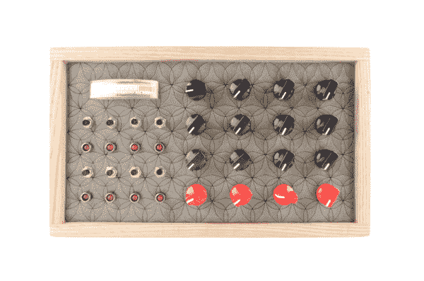

# 构建 arduino 步进序列器

> 原文：<https://learn.sparkfun.com/tutorials/build-an-auduino-step-sequencer>

## “你把 Arduino 拼错了”

现在的孩子，听着他们的电子音乐...我说的对吗？在我年轻的时候，合成器占据了整个房间。现在你可以在你的电脑手机上下载一个，午饭前就可以开始配音了。

好吧，我算是那些孩子中的一员。我听不够“哔哔”和“滴滴答答”。所以，当我偶然发现 Auduino 项目，一个为 Arduino 设计的谷物合成器时，我很兴奋能把它组装起来。我做到了！感觉棒极了！但是这并不是本教程的内容，因为在 Auduino 站点上已经有了大量有据可查的构建。不，今天我们将借助 Arduino Mega 和一点代码修改，把 Auduino 带到下一个层次。

最初的 Auduino 是一个简单的颗粒合成器:你旋转旋钮，它就会发出声音。不要误解我，你可以花几个小时做那件事...只是没有太多的成分在里面。我们将把这个基本合成器变成一个步进音序器，允许我们编程 8 种不同的声音，并重复播放它们。

在我们开始改变之前，让我们确保当你下载 Auduino 时，我们了解它是什么样子的。

### 推荐阅读

这个项目建立在其他一些概念和技能的基础上。随意阅读你不熟悉的内容。

*   什么是 Arduinio？
*   [如何焊接通孔](https://learn.sparkfun.com/tutorials/how-to-solder-through-hole-soldering)
*   [按钮和开关](https://learn.sparkfun.com/tutorials/button-and-switch-basics)
*   [脉宽调制 PWM](https://learn.sparkfun.com/tutorials/pulse-width-modulation)

### 我用过的零件