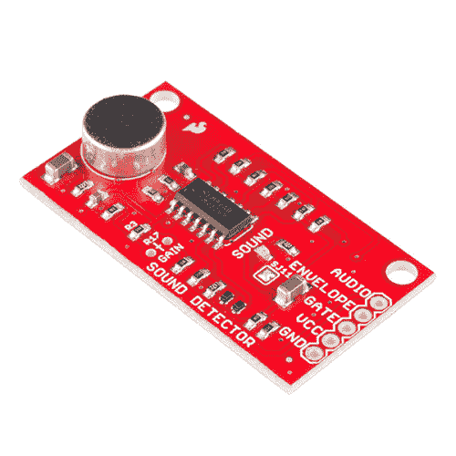
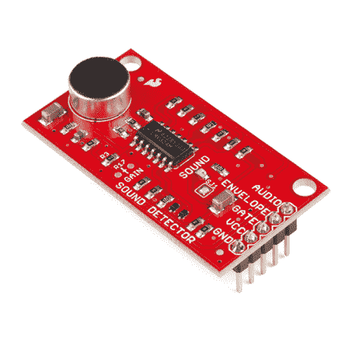
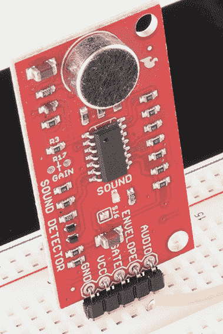
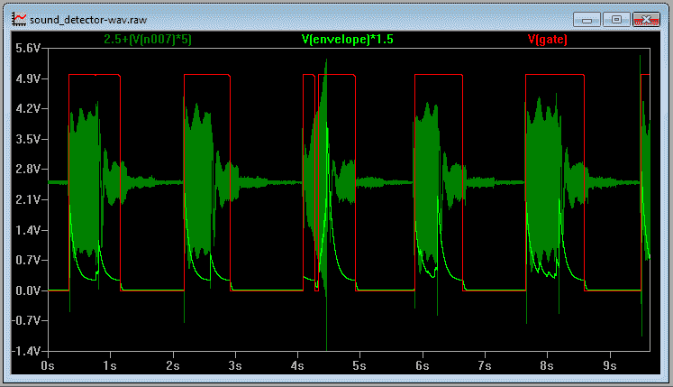
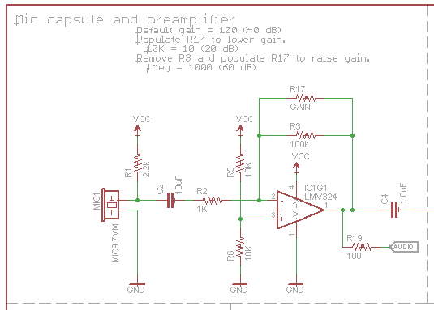
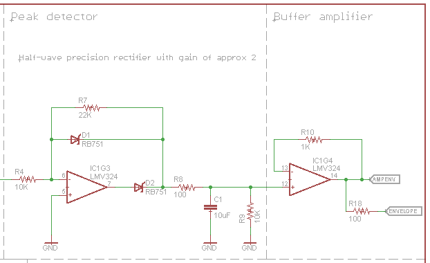
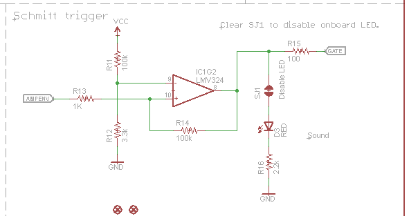
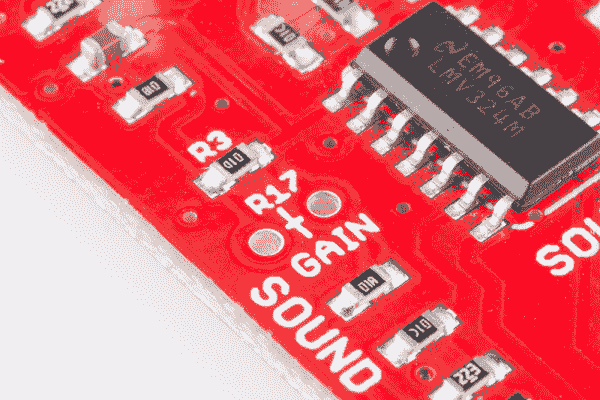
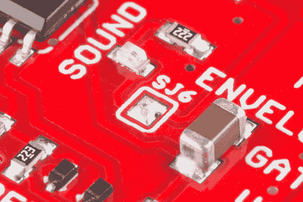

# 声音检测器连接指南

> 原文：<https://learn.sparkfun.com/tutorials/sound-detector-hookup-guide>

## 介绍

[声音检测器](https://www.sparkfun.com/products/12642)是一个小电路板，结合了麦克风和一些处理电路。它不仅提供音频输出，还提供声音存在的二进制指示，以及声音振幅的模拟表示。

[](https://www.sparkfun.com/products/12642) 

将**添加到您的[购物车](https://www.sparkfun.com/cart)中！**

 **### [火花声探测器](https://www.sparkfun.com/products/12642)

[In stock](https://learn.sparkfun.com/static/bubbles/ "in stock") SEN-12642

SparkFun 声音检测器是一款小巧易用的音频检测板，有三种不同的输出。声音检测…

$11.9519[Favorited Favorite](# "Add to favorites") 70[Wish List](# "Add to wish list")****[](https://www.sparkfun.com/products/14262) 

将**添加到您的[购物车](https://www.sparkfun.com/cart)中！**

 **### [【spark fun 声音探测器(带表头)](https://www.sparkfun.com/products/14262)

[In stock](https://learn.sparkfun.com/static/bubbles/ "in stock") SEN-14262

SparkFun 声音检测器是一个非常简单易用的小型音频检测板，有三种不同的输出。声音检测…

$13.256[Favorited Favorite](# "Add to favorites") 11[Wish List](# "Add to wish list")**** ****### 本教程涵盖的内容

本教程将指导你如何连接和使用声音探测器。它将研究电路的工作原理，解释如何从声音检测器获得最佳性能的一些细节，然后展示两个不同的项目，演示如何使用它。

### 推荐阅读

*   [如何使用试验板](https://learn.sparkfun.com/tutorials/how-to-use-a-breadboard)
*   [模拟与数字](https://learn.sparkfun.com/tutorials/analog-vs-digital)
*   维基百科上关于[的文章听起来](http://en.wikipedia.org/wiki/Sound)。

## 快速启动

要开始使用声音检测器，只需将其连接到电源。

(声音检测器→电源)

*   GND →供应地。
*   VCC →电源电压在 3.5 和 5.5 伏之间。5 伏是理想的。

在一个安静的房间里，给电路板通电，然后对着麦克风说话。您应该会看到板上的红色 LED 对您的声音做出响应而闪烁。

[](https://cdn.sparkfun.com/assets/learn_tutorials/2/0/7/LED-on.jpg)

由于有 3 路输出，电路板本身更加灵活。要探索这种灵活性，请继续阅读。

## 仔细看

### 三个输出？

声音检测器有 3 个独立的输出。用图表最容易看出每个人在做什么。下图说明了声音检测器如何响应一系列声音脉冲。

[](https://cdn.sparkfun.com/assets/learn_tutorials/2/0/7/waves.png)*Sample Sound Detector Output*

这显示了输出电压随时间的变化。

*   深绿色轨迹是声音检测器的音频输出。直接来自麦克风的音频电压出现在该输出端。
*   浅绿色轨迹是包络输出。这个模拟电压跟踪声音的振幅。特别有趣的是，注意到第三个脉冲随着它的前进而明显变大。
*   最后，红线是门输出。当环境安静时，该输出为低电平；当检测到声音时，该输出为高电平。

### 它是如何工作的

检查完输出后，让我们快速浏览一下原理图，了解每个阶段的工作原理。

#### 第一阶段的

电路的第一部分是驻极体麦克风炭精盒。这部分电路借用了[驻极体麦克风分线板](https://www.sparkfun.com/products/9964)。

[](https://cdn.sparkfun.com/assets/learn_tutorials/2/0/7/schem1.png)*Microphone and Preamplifier*

膜盒通过 R1 由电源电压偏置，它输出一个交流电压，该电压的 DC 偏移约为电源电压的 1/2。

胶囊的输出是一个非常小的电压，因此胶囊的信号被 IC1G1 放大，ic1g 1 是一个运算放大器级。默认情况下，前置放大器的算术增益为 100 (20 dB)，可以通过填充 R17 来调整增益(我们将在下一页的[中详细讨论)。](https://learn.sparkfun.com/tutorials/sound-detector-hookup-guide/configuration)

`audio`输出是 DC 耦合的，处于电源电压的一半，因此它可以直接连接到微控制器的 [ADC](https://learn.sparkfun.com/tutorials/analog-to-digital-conversion) 。在绝对安静的条件下，理想情况下，它可以读取 1/2 满量程，或者 10 位转换器上的 512。

#### 第二级

电路的第二级是一个包络跟随器。

[](https://cdn.sparkfun.com/assets/learn_tutorials/2/0/7/schem2.png)Envelope Follower

IC1G3 构成一个基于运算放大器的精密整流器。这个阶段实现了等式

```
if(Vin > 0) 
    Vout = 0;
else
    Vout = Vin * -2.2 
```

运算放大器反转并放大信号。当它的输出摆动高，D2 打开，并充电 C1。当运算放大器输出为高电平或不摆动时，D2 关闭，C1 通过 R9 放电。因此，C1 跟踪输入信号的峰值。

IC1G4 是一个缓冲放大器，因此 envelope 引脚上的外部负载不会改变 C1 的充电/放电行为。

这导致信号跟踪输入信号的峰值幅度。声音越大，包络引脚上的电压越高。与音频引脚一样，包络可以连接到微控制器的 ADC。

#### 第三阶段

最后一级对包络信号进行阈值切换。

[](https://cdn.sparkfun.com/assets/learn_tutorials/2/0/7/schem3.png)*Schmitt Trigger*

施密特触发器监控包络信号，并在超过阈值时切换输出。施密特触发器是一种比较器，当输出切换时，它会调整其阈值电压，需要更高的电压来打开而不是关闭。这使得它可以忽略输入信号中的一些纹波，如包络跟随器级输出中的纹波。

施密特触发器的输出位于 Gate 引脚上。你可以把它连接到数字输入端。我们将用它来触发[软件示例](https://learn.sparkfun.com/tutorials/sound-detector-hookup-guide/software-example)中的中断。

### 输出

三路输出信号均出现在电路板边缘的. 1 "接头上。它们是同时活跃的。如果在特定应用中不使用，只需断开该引脚即可。

## 配置

#### 胶囊的护理和喂养

声音检测器的核心是驻极体话筒振膜，没有它，我们无法将声能转化为电能。为了成功应用这些胶囊，我们需要了解它们的一些特性。

胶囊内部是隔膜，它实际上是一个小电容器的一个极板。该电容与外部偏置电阻形成一个分压器。振动膜响应声音而移动，电容随着极板的靠近或远离而变化，从而导致分压器发生变化。由于电容对负载很敏感，它内部用一个 JFET ( [结场效应晶体管](http://en.wikipedia.org/wiki/JFET))进行缓冲。

由于所涉及的机械和电子公差，一些胶囊比其他胶囊更敏感。此外，JFET 对电源上的噪声相当敏感。部署声音检测器时，需要考虑这两个因素。

##### 电源

声音检测器是一个模拟电路，因此，它对电源上的噪声比大多数数字电路更敏感。由于膜盒实际上是一个横跨电源轨的分压器，它会将电源线上的任何噪声转录到膜盒输出上。链中的下一个电路是高增益放大器，因此电源上的任何噪声都会被放大。因此，与许多电路相比，声音检测器可能需要更仔细的电源配置。

在对各种电源进行测试时，发现了很大程度的可变性——有些电源的噪声比其他电源低。其中一个在电源输出端表现出高达 30 mV 的纹波，因此检波器相当敏感和不稳定。您可以使用示波器或电压表检查电源的清洁程度，将其设置为交流电压(或交流毫伏，如果提供的话)范围。真正干净的电源将显示 0.000 伏交流电压。根据测试中使用的电源，超过约 10 mV 的纹波会有问题。

用 9V 外部电源为我的 Arduino 供电，使板载调节器能够工作，Arduino 的 5V 输出足够干净。然而，从 PC 上 USB 端口的 5V 电源供电时，调节器被绕过，结果有点不太可用，并且不同 PC 上的不同端口之间差异很大。一个通电的 USB 集线器可能会比 PC 上的端口提供更干净的电源。

如果所有其他方法都失败了，三节串联的 1.5V 电池就构成了一个漂亮、干净的 4.5V 电源。

##### 振幅校准

声音检测器设置为中等灵敏度——直接对着麦克风说话，或者在附近拍手应该会引起 gate 输出。如果你发现它在特定的应用中效果不好，你可以改变电路或多或少的敏感。

增益通过改变前置放大器级的反馈电阻来设置。电阻标记在 PCB 上的丝网印刷中。

[](https://cdn.sparkfun.com/assets/learn_tutorials/2/0/7/Sound_Detector_Hookup_Guide-01.jpg)*Resistor Closeup*

R3 是一个表贴器件，默认情况下电阻为 100K。R17 是通孔电阻的未占用位置。

##### 降低增益

很可能你会发现探测器太敏感了。在为这篇文章测试董事会时，隔壁办公室嘈杂的空调和音乐足以引发它。为了降低电路板的灵敏度，可以通过将 R17 与 R3 并联来降低前置放大器的增益。

| **R3 值** | **R17 值** | **算术增益** | **增益(分贝)** |
| 100K | - | One hundred | Forty |
| 100K | 100K | Fifty | Thirty-three |
| 100K | 47K | Thirty-two | Thirty |
| 100K | 22K | Eighteen | Twenty-five |
| 100K | 10K | nine | Nineteen |
| 100K | 4.7K | four | Thirteen |
| 100K | 2.2K | Two | six |

##### 提高增益

如果您想使声音检测器更灵敏，以便它被更安静的声音激活，您可以删除 R3，并填充 R17。

| **R17 值** | **算术增益** | **增益(分贝)** |
| 100K | One hundred | Forty |
| 22 万 | Two hundred and twenty | Forty-six |
| 47 万 | Four hundred and seventy | Fifty-three |
| 1 毫克 | One thousand | Sixty |

* * *

#### 熄灯

在某些应用中，板载 LED 可能会分散注意力或不合需要。要禁用它，只需使用焊料吸盘或吸液芯从 LED 附近的跳线上移除焊料滴。

[](https://cdn.sparkfun.com/assets/learn_tutorials/2/0/7/Sound_Detector_Hookup_Guide-02.jpg)

#### 物理因素

声音探测器上的驻极体膜盒对机械振动和风噪声也很敏感。

声音检测器将拾取操作噪音。用弹性材料安装它可以帮助吸收振动——将它放在一块开孔泡沫上有助于抑制通过测试工作台传导的振动。其他弹性安装策略包括使用橡皮筋悬挂，或使用 4 号机器螺丝和热缩管建造减震器。

当气流进入太空舱时会产生风噪声。例如，有风的日子，或者经常伴随着音节“p”、“b”和“t”的尖锐呼气。这种胶囊有一层薄薄的织物覆盖物，但可能不足以防止更强的冲击波。你可以用开孔泡沫或合成毛皮制作一个更坚固的挡风玻璃(就像当吊杆麦克风意外进入电影场景时偷偷进入框架的覆盖物)。

## 软件示例

既然我们已经了解了如何配置开发板，让我们把它挂在 Arduino 上，看看它能做什么。

### 材料

除了[声音探测器](https://www.sparkfun.com/products/12642)，你还需要以下部件。****