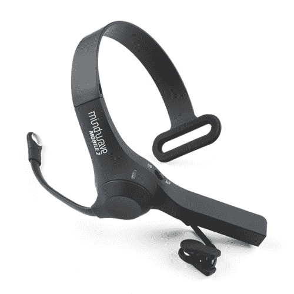
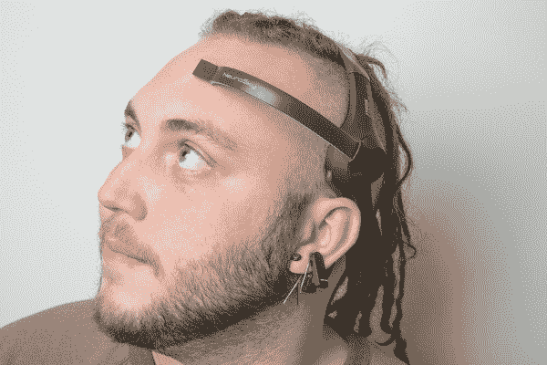

# 黑客在住宅-黑客思维波移动

> 原文：<https://learn.sparkfun.com/tutorials/hackers-in-residence---hacking-mindwave-mobile>

## 介绍

**Note:** Brought to you by Hacker in Residence, Sophi Kravitz!

[](https://www.sparkfun.com/news/1299 "October 29, 2013: We're excited to introduce you to our latest hackers-in-residence: Sophi Kravitz and Shane Clements!") [### 常驻黑客:Sophi Kravitz & Shane Clements

October 29, 2013](https://www.sparkfun.com/news/1299 "October 29, 2013: We're excited to introduce you to our latest hackers-in-residence: Sophi Kravitz and Shane Clements!")[Favorited Favorite](# "Add to favorites") 0

你有没有想过仅仅通过思考就能控制一些东西？你很幸运。 [MindWave](http://store.neurosky.com/products/mindwave-1) 可以让你将身体中流动的电子信号转化为微控制器可以理解的数字信号。还有 [MindWave Mobile](http://store.neurosky.com/products/mindwave-mobile) ，它被设计成与你的移动设备接口。

[](https://www.sparkfun.com/products/14758) 

### [neuro sky mind wave Mobile 2](https://www.sparkfun.com/products/14758)

[Out of stock](https://learn.sparkfun.com/static/bubbles/ "out of stock") SEN-14758

NeuroSky 的 MindWave Mobile 2 是一款脑电图耳机，可以通过 Bluetoot 安全地测量和传输功率谱数据

[Favorited Favorite](# "Add to favorites") 33[Wish List](# "Add to wish list")

本教程将作为一半拆卸/审查和一半项目。在我们探索了 MindWave 手机的内部工作原理后，我们将改变思路，专注于破解它。

[](https://cdn.sparkfun.com/assets/e/c/e/5/4/52cda9afce395f610c8b456a.jpg)

### 本教程涵盖的内容

本教程将介绍:

*   什么是 MindWave Mobile？
*   配置 RN42 蓝牙模块
*   将 MindWave Mobile 与 RN42 配对
*   你会从思维波中看到什么数据？这是什么意思？
*   使用提供的源代码对 Arduino 进行编程，以查看 MindWave 数据
*   使用处理来绘制数字数据中的特定值
*   意念波之后的下一步

### 推荐阅读

本教程建立在一些以前讨论过的主题之上。如果您不熟悉提到的概念，请访问下面的任何链接。

[](https://learn.sparkfun.com/tutorials/serial-communication) [### 串行通信](https://learn.sparkfun.com/tutorials/serial-communication) Asynchronous serial communication concepts: packets, signal levels, baud rates, UARTs and more 100[](https://learn.sparkfun.com/tutorials/what-is-an-arduino) [### 什么是 Arduino？](https://learn.sparkfun.com/tutorials/what-is-an-arduino) What is this 'Arduino' thing anyway? This tutorials dives into what an Arduino is and along with Arduino projects and widgets.[Favorited Favorite](# "Add to favorites") 50[](https://learn.sparkfun.com/tutorials/what-is-electricity) [### 什么是电？](https://learn.sparkfun.com/tutorials/what-is-electricity) We can see electricity in action on our computers, lighting our houses, as lightning strikes in thunderstorms, but what is it? This is not an easy question, but this tutorial will shed some light on it 83[](https://learn.sparkfun.com/tutorials/connecting-arduino-to-processing) [### 将 Arduino 连接到处理](https://learn.sparkfun.com/tutorials/connecting-arduino-to-processing) Send serial data from Arduino to Processing and back - even at the same time 35[](https://learn.sparkfun.com/tutorials/terminal-basics) [### 串行终端基础知识](https://learn.sparkfun.com/tutorials/terminal-basics) This tutorial will show you how to communicate with your serial devices using a variety of terminal emulator applications.[Favorited Favorite](# "Add to favorites") 46[](https://learn.sparkfun.com/tutorials/bluetooth-basics) [### 蓝牙基础知识](https://learn.sparkfun.com/tutorials/bluetooth-basics) An overview of the Bluetooth wireless technology.[Favorited Favorite](# "Add to favorites") 42[](https://learn.sparkfun.com/tutorials/using-the-bluesmirf) [### 使用 BlueSMiRF](https://learn.sparkfun.com/tutorials/using-the-bluesmirf) How to get started using the BlueSMiRF and Bluetooth Mate Silvers.[Favorited Favorite](# "Add to favorites") 11

### 建议观看

[https://www.youtube.com/embed/NI_dba8-ess/?autohide=1&border=0&wmode=opaque&enablejsapi=1](https://www.youtube.com/embed/NI_dba8-ess/?autohide=1&border=0&wmode=opaque&enablejsapi=1)

[https://www.youtube.com/embed/G2C44uJmmlA/?autohide=1&border=0&wmode=opaque&enablejsapi=1](https://www.youtube.com/embed/G2C44uJmmlA/?autohide=1&border=0&wmode=opaque&enablejsapi=1)

[https://www.youtube.com/embed/WeQaNRgiwXQ/?autohide=1&border=0&wmode=opaque&enablejsapi=1](https://www.youtube.com/embed/WeQaNRgiwXQ/?autohide=1&border=0&wmode=opaque&enablejsapi=1)

## 什么是 MindWave Mobile？

[](https://cdn.sparkfun.com/assets/9/f/e/0/3/52cda964ce395f401b8b456b.jpg)*The MindWave Mobile from [NeuroSky](http://neurosky.com/)*

要了解 MindWave 和 MindWave Mobile，我们必须首先了解什么是 EEG 传感器。德国精神病学家汉斯·伯杰于 1924 年首次记录了人类大脑的电场。伯杰给这个录音起了个名字[脑电图](http://en.wikipedia.org/wiki/Electroencephalography)。简单地说，脑电图是通过将电极放置在受试者的头皮上，然后读取电信号进行分析。快进到今天，你已经将所有这些技术打包到一个紧凑的外形中，这就是 MindWave 和 MindWave Mobile。

### 项目范围

在头皮上测量时，EEG 的振幅约为 100 V，在大脑表面测量时，振幅约为 1-2 mV。该信号的带宽从低于 1 赫兹到大约 50 赫兹。

由于脑波信号的振幅和低频，我很好奇一个相对便宜(～100 美元)的传感器测量大脑信号的效果如何。

在这个项目中，模拟脑电波进入处理 ASIC 芯片，并具有通过蓝牙通信的数字值。我只访问了数字数据。在模拟脑波进入处理 ASIC 之前查看它们当然是可能的，但这将更加困难，需要一个原理图和专门的示波器探头。

之所以选择 Mindwave Mobile，是因为它使用蓝牙，更容易与微控制器或其他硬件连接。请注意，Neurosky 有多种思维模式。

[](https://cdn.sparkfun.com/assets/e/1/3/9/d/52cda965ce395f260c8b4567.jpg)*SFE Creative Technologist, [Nick Poole](https://www.sparkfun.com/users/207060), sporting the MindWave. The electrode rests on the forehead, above the eyebrow, and the reference clips onto the ear.*

## 拆开它

图为 MindWave 耳机。尼克·普尔拆开了其中一个，所以耳机的内部也在这里。

[](https://cdn.sparkfun.com/assets/0/d/d/9/e/52cda965ce395f02198b4567.jpg)

这是内部电路的特写。你可能认识悬挂在顶部的 MSP430。

[](https://cdn.sparkfun.com/assets/e/d/e/a/0/52cda967ce395f400c8b4568.jpg)

还有，背面....

[](https://cdn.sparkfun.com/assets/1/d/c/3/4/52cda968ce395f0e558b4567.jpg)

在两块电路板之间是一个专用集成电路。Neurosky 上的 ASIC 计算注意力和冥想的值。它还处理五种类型的脑电波(稍后会有更多介绍)，并为每一种发出无单位值。这个单位也测量吊环。

[](https://cdn.sparkfun.com/assets/c/2/a/f/8/52cda964ce395f77648b456b.jpg)

## 收集材料

为了与思维波对接，你需要一些硬件和软件。

### 五金器具

为了与 MindWave 接口，选择了 [RN-42 蓝牙](https://www.sparkfun.com/products/10253)模块。对于这个项目，我创建了一个定制的 PCB，然而，你也可以使用一个 [BlueSMiRF](https://www.sparkfun.com/products/12577) 或一个[蓝牙伴侣](https://www.sparkfun.com/products/12576)。蓝牙模块将连接到一个 [Arduino Uno](https://www.sparkfun.com/products/11021) 以读取无线传输的数据。

[](https://cdn.sparkfun.com/assets/learn_tutorials/2/5/bluesmirf.jpg)*The [BlueSMiRF Silver](https://www.sparkfun.com/products/12577) module from SparkFun.*

一旦你决定了你将使用的硬件，连接所有的东西。同样，蓝牙基础知识和 BlueSMiRF 教程应该广泛地介绍如何做到这一点。

### 软件

你需要一些程序来读取和配置 RN42 蓝牙模块的数据。

*   [X-CTU](http://www.digi.com/support/kbase/kbaseresultdetl?id=2125) 、 [CoolTerm](http://freeware.the-meiers.org/) ，或您选择的其他串行终端程序。
*   [RS232 端口记录器](http://www.eltima.com/products/rs232-data-logger/)

如果你不熟悉串行终端仿真器，请查看我们的[教程](https://learn.sparkfun.com/tutorials/terminal-basics)。

### 固件

这是这个项目的 Arduino 端的固件。如果你正在跟随，你将会想要上传这个到你正在使用的任何一个 Arduino 板。

```
language:c
///////////////////////////////////////////////////////////////
// Arduino Bluetooth Interface with Mindwave
// Sophi Kravitz edit 11-4
// Shane Clements edit 11-5
//////////////////////////////////////////////////////////////////////// 
#include <SoftwareSerial.h>     // library for software serial
SoftwareSerial mySerial(5, 6);  // RX, TX
int LED = 8;                    // yellow one
int LED1 = 7;                   //white one
int BAUDRATE = 57600;

// checksum variables
byte payloadChecksum = 0;
byte CalculatedChecksum;
byte checksum = 0;              //data type byte stores an 8-bit unsigned number, from 0 to 255
int payloadLength = 0;
byte payloadData[64] = {0};
byte poorQuality = 0;
byte attention = 0;
byte meditation = 0;

// system variables
long lastReceivedPacket = 0;
boolean bigPacket = false;
boolean brainwave = false;
void setup() {
  pinMode(LED, OUTPUT);
  pinMode(LED1, OUTPUT);
  digitalWrite(LED, HIGH);   // hello sequence
  delay(100);
  digitalWrite(LED, LOW);
  delay(100);
  Serial.begin(57600);       // Bluetooth
  delay(500);
  mySerial.begin(4800);      // software serial
  delay(500);
  mySerial.print("Communicating... ");
  mySerial.println();
}
byte ReadOneByte() {
   int ByteRead;
  // Wait until there is data
  while(!Serial.available());
  //Get the number of bytes (characters) available for reading from the serial port.
  //This is data that's already arrived and stored in the serial receive buffer (which holds 64 bytes)
  ByteRead = Serial.read();
  return ByteRead; // read incoming serial data
  }

unsigned int delta_wave = 0;
unsigned int theta_wave = 0;
unsigned int low_alpha_wave = 0;
unsigned int high_alpha_wave = 0;
unsigned int low_beta_wave = 0;
unsigned int high_beta_wave = 0;
unsigned int low_gamma_wave = 0;
unsigned int mid_gamma_wave = 0;

void read_waves(int i) {
  delta_wave = read_3byte_int(i);
  i+=3;
  theta_wave = read_3byte_int(i);
  i+=3;
  low_alpha_wave = read_3byte_int(i);
  i+=3;
  high_alpha_wave = read_3byte_int(i);
  i+=3;
  low_beta_wave = read_3byte_int(i);
  i+=3;
  high_beta_wave = read_3byte_int(i);
  i+=3;
  low_gamma_wave = read_3byte_int(i);
  i+=3;
  mid_gamma_wave = read_3byte_int(i);
}

int read_3byte_int(int i) {
  return ((payloadData[i] << 16) + (payloadData[i+1] << 8) + payloadData[i+2]);
}

void loop() {
  // Look for sync bytes
  // Byte order: 0xAA, 0xAA, payloadLength, payloadData,
  // Checksum (sum all the bytes of payload, take lowest 8 bits, then bit inverse on lowest
if(ReadOneByte() == 0xAA) {
if(ReadOneByte() == 0xAA) {
payloadLength = ReadOneByte();
if(payloadLength > 169) //Payload length can not be greater than 169
return;
payloadChecksum = 0;
      for(int i = 0; i < payloadLength; i++) {      //loop until payload length is complete
        payloadData[i] = ReadOneByte();             //Read payload
        payloadChecksum += payloadData[i];
      }
      checksum = ReadOneByte();                     //Read checksum byte from stream
      payloadChecksum = 255 - payloadChecksum;      //Take one’s compliment of generated checksum
      if(checksum == payloadChecksum) {
        poorQuality = 200;
        attention = 0;
        meditation = 0;
 }
     brainwave = false;
     for(int i = 0; i < payloadLength; i++) { // Parse the payload
          switch (payloadData[i]) {
          case 02:
            i++;
            poorQuality = payloadData[i];
            bigPacket = true;
            break;
          case 04:
            i++;
            attention = payloadData[i];
            break;
          case 05:
            i++;
            meditation = payloadData[i];
            break;
          case 0x80:
            i = i + 3;
            break;
          case 0x83:                         // ASIC EEG POWER INT
            i++;
            brainwave = true;
            byte vlen = payloadData[i];
            //mySerial.print(vlen, DEC);
            //mySerial.println();
            read_waves(i+1);
            i += vlen; // i = i + vlen
            break;
          }                                 // switch
        }                                   // for loop

        if(bigPacket) {
          if(poorQuality == 0){
          }
          else{                             // do nothing
           }
         }

            if(brainwave && attention > 0 && attention < 100) {
            mySerial.print("Attention value is: ");
            mySerial.print(attention, DEC);
            mySerial.println();
            mySerial.print("Delta value is: ");
            mySerial.print(delta_wave, DEC);
            mySerial.println();
            mySerial.print("Theta value is: ");
            mySerial.print(theta_wave, DEC);
      mySerial.println();
            mySerial.print("Low Alpha value is: ");
            mySerial.print(low_alpha_wave, DEC);
            mySerial.println();
            mySerial.print("High Alpha value is: ");
            mySerial.print(high_alpha_wave, DEC);
            mySerial.println();            
            mySerial.print("Alertness value1 is: ");
            mySerial.print(low_beta_wave, DEC);
            mySerial.println();
            mySerial.print("Alertness value2 is: ");
            mySerial.print(high_beta_wave, DEC);
            mySerial.println();           
            mySerial.print(low_gamma_wave, DEC);
            mySerial.println();
            mySerial.print(mid_gamma_wave, DEC);
            mySerial.println();
         }

          if(attention > 40){
            digitalWrite(LED1, HIGH);
          }
          else
            digitalWrite(LED1, LOW);
        } 
        }
      } 
```

这是处理代码，它解释来自 MindWave 到 Arduino 的数据，然后为您提供该数据的可视化表示。

```
language:java
//Processing code to graph Attention values
//Comment out all of the lines after “if(brainwave && attention > 0 && attention < 100) {“
//Except for   
//mySerial.print(attention, DEC);
// mySerial.println();
//This will print out ONLY an Attention value and a new line afterwards

// Graphing sketch by Tom Igoe
// Sophi Kravitz edit 11/8

 import processing.serial.*; 
 Serial myPort;        // The serial port
 int xPos = 1;         // horizontal position of the graph 
 void setup () {
 // set the window size:
 size(400, 300);   
String portName = Serial.list()[1];         //[1]  println(Serial.list()) to find the ports 
 myPort = new Serial(this, "COM16", 4800);  // make sure the Baud rate matches the Arduino code
 myPort.bufferUntil('\n');                  // Wait for newline character:
 background(0);                             // set inital background color: 0 = black, 255 = white
 }

void draw () {                              // everything happens in the serialEvent()
 }

 void serialEvent (Serial myPort) {
 String inString = myPort.readStringUntil('\n');

   if (inString != null) {                  // trim whitespace:
   inString = trim(inString);               // convert to an int and map to the screen height:
   float inByte = float(inString); 
   inByte = map(inByte, 0, 100, 0, height); // take number from 0 to 100, and map it to 0 to height
   stroke(5,34,255);                        // draw the line:
   line(xPos, height, xPos, height - inByte);

   if (xPos >= width) {                     // at the edge of the screen, go back to the beginning:
   xPos = 0;
   background(0); 
   } 
   else { 
   xPos++;                                  // increment the horizontal position:
   }
 }
 } 
```

## 配置蓝牙模块

RN42 模块可以配置为以各种不同的方式运行。如果您从未配置过 RN 蓝牙模块，请阅读我们的 [BlueSMiRF 连接指南](https://learn.sparkfun.com/tutorials/using-the-bluesmirf)。

您可以使用任何想要的串行终端来配置蓝牙模块。对于这个项目，我用我的 Android 手机和一个名为 [S2 蓝牙终端](https://play.google.com/store/apps/details?id=jp.side2.apps.btterm&hl=en)的应用程序来配置 RN42。配置过程如下:

* *注:* *如果您使用的是 S2 终端程序，您需要输入 ASCII 码，并在每个命令后加上回车。此外，通电后您只有 60 秒的时间来输入第一个命令。

1.  要将 RN42 置于命令模式，请键入$$$(无回车)。如果成功，您将看到“CMD”。
2.  类型:`D` +回车。您将看到 RN42 的当前配置。

    [](https://cdn.sparkfun.com/assets/learn_tutorials/2/5/phone1.jpg)
3.  类型:`SP,0000` +回车。这将使密码从“1234”变为“0000”。如果处理得当，你会看到“AOK”。

4.  类型:`SM, 3` +回车。这将把 RN42 配置为自动连接模式。一旦模块通电，它将立即寻求连接(配对)。如果处理得当，你会看到“AOK”。
5.  类型:`SR,MAC ADDRESS` +回车。插入您从 MindWave Mobile 复制的 12 位地址。去找 AOK。如果您看不到 AOK，您必须重新键入 MAC 地址命令。
6.  现在键入:`SU,57.6` +回车。这将把波特率从 115200 更改为 57600。

    [](https://cdn.sparkfun.com/assets/learn_tutorials/2/5/phone2.jpg)
7.  键入`D` +回车。仔细检查存储的地址是否是您在步骤 5 中输入的 Mac 地址，以及它是否配置为自动，而不是从属。

8.  键入:`---`(三个减号)+回车然后你应该看到结束。

    [](https://cdn.sparkfun.com/assets/learn_tutorials/2/5/phone3.jpg)

打开思维波。蓝光闪烁片刻，然后它将与您的硬件配对。你会知道 Mindwave 手机是配对的，因为 Mindwave 手机上的蓝光是稳定的。如果是稳定的红色，则电池没电(AAA，持续 8 小时左右)。

## 破译思维波数据

使用一个 [FTDI basic](https://www.sparkfun.com/products/9873) ，我能够通过我的 USB 端口查看来自 Arudino 的数据。我用 X-CTU 来读取数据。收集材料部分提到的 Arduino 代码主要是 Mindwave Mobile 示例代码和 Shane Clements 按摩的组合。代码被设置为打印 Mindwave 手机上所有可用的数字数据。数据通过软件串行端口传输，可在 X-CTU 屏幕上轻松读取。

您可以看到δ波、θ波、α波、低β波、高β波和γ波的无单位值。Mindwave 的 ASIC 还提供了注意力和冥想的计算值。介于 20 和 100 之间的注意力指数是正常的，高于 40 的指数意味着你正在集中注意力。

我能够通过从 100 倒计数到 1 来获得注意力值的可重复值。我们在科罗拉多州的博尔德举办了一次黑客晚宴，其他一些人也能够通过从 100 倒数到 1 来提高注意力值。

有趣的是，测量和报告的 5 种脑电波来自大脑的不同部分。它们还具有极低的振幅和频率。

[](http://commons.wikimedia.org/wiki/File%3ABrain-anatomy.jpg "By User:Primalchaos (Image:Human_brain_NIH.jpg) [Public domain], via Wikimedia Commons")

*   [伽马波](http://en.wikipedia.org/wiki/Gamma_wave)是频率在 40 Hz 左右的振荡波，虽然它们可以高达 100 Hz，低至 24 Hz。这些源自丘脑(深埋在大脑中央)，负责保持高度注意力和集中的状态。
*   [β波](http://en.wikipedia.org/wiki/Beta_wave)在 12 到 30 Hz 之间，是与正常清醒意识相关的状态。这些信号是从大脑皮层的运动皮层发出的，大脑皮层是大脑最外层的组织。贝塔波分为三段:低贝塔波(12.5-16 Hz，“贝塔 1 次方”)；贝塔波(16.5–20 赫兹，“贝塔 2 次方”)；以及高β波(20.5-28 Hz，“β3 次方”)。
*   [α波](http://en.wikipedia.org/wiki/Alpha_wave)起源于枕叶，频率为 8-12Hz。当你醒着但非常困倦或放松时，这些症状最明显。
*   [θ波](http://en.wikipedia.org/wiki/Theta_wave)是位于海马体的振荡波，与做梦有关。它们在 4-7Hz 范围内。
*   [δ波](http://en.wikipedia.org/wiki/Delta_wave)与非常深的无梦睡眠周期有关，是高振幅波，频率为 0 到 3Hz。这些波从丘脑和大脑皮层发出。

当并排看时，这些波之间的差异更容易理解。

[](https://cdn.sparkfun.com/assets/learn_tutorials/2/5/Brain-Waves-Graph.jpg)

如果您使用的 Arduino 带有上传的采集材料部分的代码，您应该能够看到这些值在 X-CTU 或您选择的串行终端程序中打印出来。

[](https://cdn.sparkfun.com/assets/learn_tutorials/2/5/printout.jpg)

与 Arduino 代码位于同一部分的处理代码可以使用并修改，以绘制 Arduino 的不同值。

[](https://cdn.sparkfun.com/assets/learn_tutorials/2/5/scrnsht.jpg)*The attention value being graphed on Processing.*

## 资源和更进一步

当我观察经过处理的注意力值时，使用 MindWave Mobile 得到了最好的结果。很容易看出，当我(或任何人)从 100 倒数到 1 时，注意力值上升了。

真正想看的深度脑波值，比如伽马，贝塔等。，到处都是，很难看到这些价值观的一致性。事实上，当装置在头上和不在头上时，脑波值的变化是一样的！

Mindwave Mobile 附带的 Android 应用程序根本无法工作，我在几部手机上试过，但没有成功。Neurosky 支持人员认为，可能是我的 Android 操作系统不兼容。

总的来说，我不认为使用 Neurosky Mindwave 产品会产生任何有用的数据。期待尝试 Neurosky 的下一个改版，真的很期待尝试 [OpenBCI](http://www.openbci.com/) ！

如需更多拆卸，请查看 SparkFun 的其他产品:

*   [巢式恒温器拆卸](https://learn.sparkfun.com/tutorials/nest-thermostat-teardown-)
*   [巢穴保护拆除](https://learn.sparkfun.com/tutorials/nest-protect-teardown)
*   [LEAP Motion 拆卸](https://learn.sparkfun.com/tutorials/leap-motion-teardown)
*   [谷歌眼镜拆卸(SFE 赞助)](http://www.catwig.com/google-glass-teardown/)

要了解有关无线技术的更多信息，请访问:

*   [RN-52 音频蓝牙连接指南](https://learn.sparkfun.com/tutorials/rn-52-bluetooth-hookup-guide)
*   [BC127 音频蓝牙连接指南](https://learn.sparkfun.com/tutorials/understanding-the-bc127-bluetooth-module)
*   [拆卸和连接元手表](https://learn.sparkfun.com/tutorials/metawatch-teardown-and-arduino-hookup)
*   [wify Shield 连接指南](https://learn.sparkfun.com/tutorials/wifly-shield-hookup-guide)
*   [带电动 Imp 的无线 Arduino 编程](https://learn.sparkfun.com/tutorials/wireless-arduino-programming-with-electric-imp)

如需更多生物识别教程，请查看:

*   [AD8232 心率监护仪](https://learn.sparkfun.com/tutorials/ad8232-heart-rate-monitor-hookup-guide)
*   [Misfit Shine 拆卸](https://learn.sparkfun.com/tutorials/teardown-misfit-shine)

或者看看下面的一些博客帖子来寻找灵感:

[](https://www.sparkfun.com/news/1438 "March 28, 2014: This week we're tackling mind control. Check out our list of new products.") [### 新品星期五:没有勺子

March 28, 2014](https://www.sparkfun.com/news/1438 "March 28, 2014: This week we're tackling mind control. Check out our list of new products.")[Favorited Favorite](# "Add to favorites") 0[](https://www.sparkfun.com/news/2589 "January 25, 2018: Using the Mind Wave Mobile+, Mort and I created a mind-controlled IoT...solution (?) with sockets, of course!") [### 莫特和玛丽介绍:精神控制的电灯开关

January 25, 2018](https://www.sparkfun.com/news/2589 "January 25, 2018: Using the Mind Wave Mobile+, Mort and I created a mind-controlled IoT...solution (?) with sockets, of course!")[Favorited Favorite](# "Add to favorites") 2