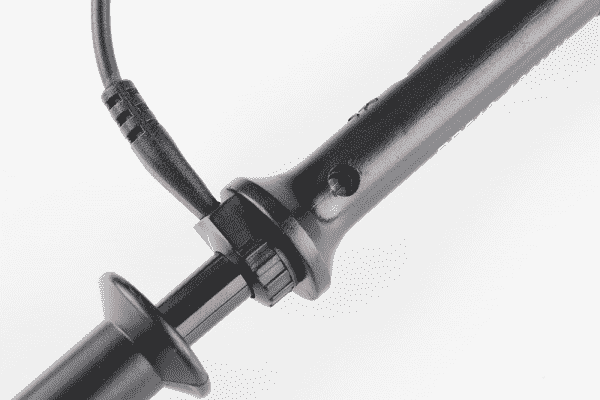
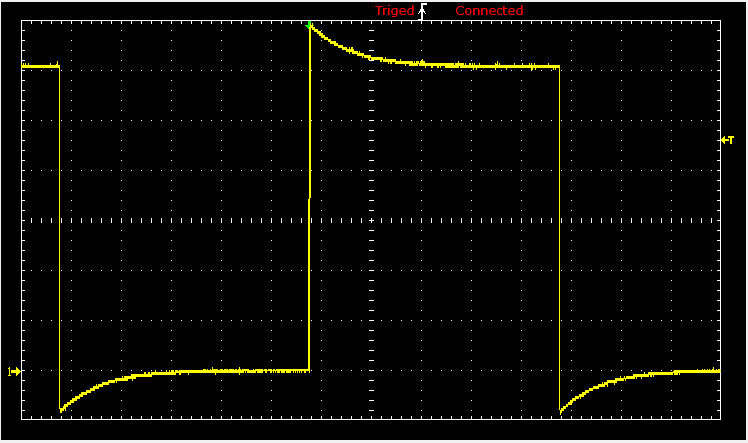
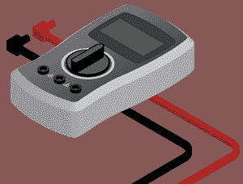

# 如何使用示波器

> 原文：<https://learn.sparkfun.com/tutorials/how-to-use-an-oscilloscope>

## 介绍

你有没有发现自己在排除电路故障时，需要比简单的[万用表](https://learn.sparkfun.com/tutorials/how-to-use-a-multimeter)所能提供的更多的信息？如果您需要揭示频率、噪声、振幅或任何其他可能随时间变化的特征等信息，您需要一台示波器！

o 型示波器是任何电气工程师实验室的重要工具。它们可以让你*看到随着时间变化的*电信号，这对于诊断为什么你的 [555 定时器](https://www.sparkfun.com/products/9273)电路没有正确闪烁，或者为什么你的[噪音发生器](https://www.sparkfun.com/products/9206)没有达到最大烦恼水平至关重要。

### 本教程涵盖的内容

本教程旨在介绍示波器的概念、术语和控制系统。它分为以下几个部分:

*   示波器基础知识 -介绍示波器到底是什么，它们测量什么，以及我们为什么使用它们。
*   [示波器词典](https://learn.sparkfun.com/tutorials/how-to-use-an-oscilloscope/oscilloscope-lexicon) -涵盖一些更常见的示波器特征的词汇表。
*   [O 型示波器的剖析](https://learn.sparkfun.com/tutorials/how-to-use-an-oscilloscope/anatomy-of-an-o-scope) -示波器上最关键系统的概述-屏幕、水平和垂直控制、触发器和探头。
*   [使用示波器](https://learn.sparkfun.com/tutorials/how-to-use-an-oscilloscope/using-an-oscilloscope) -给第一次使用示波器的人的提示和技巧。

我们将使用 [Gratten GA1102CAL](https://www.sparkfun.com/products/11766) -一种方便的中级数字示波器-作为我们范围讨论的基础。其他 o-scope 可能看起来不同，但是它们应该都共享一组相似的控制和接口机制。

### 推荐阅读

在继续本教程之前，您应该熟悉下面的概念。如果你想了解更多，请查看教程！

*   [电压、电流、电阻和欧姆定律](https://learn.sparkfun.com/tutorials/voltage-current-resistance-and-ohms-law)
*   [如何使用万用表](https://learn.sparkfun.com/tutorials/how-to-use-a-multimeter)
*   [模拟与数字](https://learn.sparkfun.com/tutorials/analog-vs-digital)
*   [交流电与直流电(DC)](https://learn.sparkfun.com/tutorials/alternating-current-ac-vs-direct-current-dc)

### 录像

[https://www.youtube.com/embed/u4zyptPLlJI?ecver=2](https://www.youtube.com/embed/u4zyptPLlJI?ecver=2)

* * *

## O 型示波器的基础知识

示波器的主要用途是**绘制随时间变化的电信号**。大多数示波器产生一个二维图形，x 轴上的**时间**和 y 轴上的**电压**。

*An example of an oscilloscope display. A signal (the yellow sine wave in this case) is graphed on a horizontal time axis and a vertical voltage axis.*

示波器屏幕周围的控件允许您**调整图表的比例**，包括垂直和水平方向——允许您放大和缩小信号。还有一些控制来设置示波器上的**触发器**，这有助于聚焦和稳定显示。

### 示波器能测量什么

除了这些基本特性之外，许多示波器还具有测量工具，有助于快速量化频率、幅度和其他波形特征。一般来说，示波器可以测量基于时间和基于电压的特性:

*   **定时特性**:
    *   **频率和周期** -频率定义为波形每秒重复的次数。周期是它的倒数(每个重复波形花费的秒数)。示波器可以测量的最大频率各不相同，但通常在数百兆赫(1E6 Hz)的范围内。
    *   **占空比** -波形为正或负的周期百分比(有正和负占空比)。[占空比](https://learn.sparkfun.com/tutorials/pulse-width-modulation/duty-cycle)是一个比率，它告诉你一个信号在每个周期“打开”多长时间与“关闭”多长时间。
    *   **上升和下降时间** -信号不能瞬间从 0V 变为 5V，它们必须平稳上升。一个波从低点到高点的持续时间被称为上升时间，下降时间则相反。考虑电路对信号的响应速度时，这些特性非常重要。
*   **电压特性**:
    *   **振幅** -振幅是信号大小的量度。有多种幅度测量方法，包括峰峰值幅度，它测量信号高电压点和低电压点之间的绝对差值。另一方面，峰值幅度仅衡量信号超过 0V 时的高低。
    *   **最大和最小电压** -示波器可以准确地告诉你信号的电压有多高和多低。
    *   **平均电压** -示波器可以计算信号的平均值，也可以告诉你信号的最小和最大电压的平均值。

### 何时使用 O 型内窥镜

o-scope 在各种故障排除和研究情况下非常有用，包括:

*   确定信号的**频率和幅度**，这对于调试电路的输入、输出或内部系统至关重要。由此，您可以判断电路中的某个组件是否出现了故障。
*   确定电路中有多少噪声。
*   识别波形的**形状**-正弦、方形、三角形、锯齿形、复杂形等。
*   量化两个不同信号之间的相位差。

* * *

## 示波器词典

学习如何使用示波器意味着要了解整个术语词典。在这一页上，我们将介绍一些重要的 o-scope 流行语，你应该在打开它之前熟悉它们。

### 主要示波器规格

有些瞄准镜比其他的好。这些特征有助于定义您对示波器性能的预期:

*   **带宽** -示波器最常用于测量具有规定频率的波形。然而，没有一个示波器是完美的:它们都能以多快的速度看到信号的变化。示波器的带宽规定了它能可靠测量的**频率范围**。
*   **数字与模拟** -与大多数电子产品一样，o 型示波器可以是模拟的，也可以是数字的。模拟示波器使用电子束将输入电压直接映射到显示器上。数字示波器包含微控制器，微控制器通过[模数转换器](https://learn.sparkfun.com/tutorials/analog-to-digital-conversion)对输入信号进行采样，并将读数映射到显示器上。一般来说，模拟示波器更老，带宽更低，功能更少，但它们的响应速度可能更快(看起来也更酷)。
*   **通道数量** -许多示波器可以一次读取多个信号，同时将它们显示在屏幕上。示波器读取的每个信号都被送入一个单独的通道。两到四个通道的示波器非常常见。
*   **采样率** -这个特性是数字示波器独有的，它定义了每秒读取信号的次数。对于具有多个通道的作用域，如果使用多个通道，该值可能会减小。
*   **上升时间** -示波器指定的上升时间定义了它能测量的最快上升脉冲。示波器的上升时间与带宽密切相关。可以计算为`Rise Time` = `0.35` / `Bandwidth`。
*   **最大输入电压** -每件电子产品在高压下都有其极限。示波器都应额定最大输入电压。如果你的信号超过这个电压，示波器很有可能会损坏。
*   **分辨率** -示波器的分辨率代表其测量输入电压的精度。该值可以随着垂直刻度的调整而改变。
*   **垂直灵敏度** -该值代表垂直电压刻度的最小和最大值。该值以伏特每格列出。
*   **时基** -时基通常表示水平时间轴上的灵敏度范围。该值以秒/分度列出。
*   **输入阻抗** -当信号频率变得非常高时，即使是一个很小的阻抗(电阻、电容或电感)添加到电路中也会影响信号。每个示波器都会给它正在读取的电路增加一定的阻抗，称为输入阻抗。输入阻抗通常表示为大阻性阻抗(>1mω)与小电容(||)并联(pF 范围内)。测量甚高频信号时，输入阻抗的影响更加明显，您使用的探头可能需要帮助补偿。

以 [GA1102CAL](https://www.sparkfun.com/products/11766) 为例，以下是您可能期望的中档示波器的规格:

| 特性 | 价值 |
| 带宽 | 100 兆赫 |
| 采样率 | 1 GSa/s(每秒 1E9 个样本) |
| 上升时间 | < 3.5 纳秒 |
| 频道计数 | Two |
| 最大输入电压 | 400 伏 |
| 解决 | 8 位 |
| 垂直灵敏度 | 2mV/div - 5V/div |
| 时基 | 2 纳秒/格-50 秒/格 |
| 输入阻抗 | 1mω3% &#124; &#124; 16pF 3pF |

了解了这些特征，你应该能够挑选出最适合你的需求的示波器。但是你仍然必须知道如何使用它...进入下一页！

* * *

## 解剖 O 型内窥镜

虽然没有一个作用域是完全相同的，但它们应该都有一些相似之处，使它们的功能相似。在这一页中，我们将讨论几个比较常见的示波器系统:显示、[水平](#horizontal)、[垂直](#vertical)、[触发](#trigger)和[输入](#inputs)。

<map id="oScope" name="oScope"></map>

### 该显示器

示波器没有任何用处，除非它能显示你试图测试的信息，这使得显示器成为示波器上更重要的部分之一。

每一个示波器显示屏都应该用被称为**分区**的水平线和垂直线纵横交错。这些划分的比例随着水平和垂直系统而改变。垂直系统的测量单位是“伏特/分”，水平系统的测量单位是“秒/分”。一般来说，示波器大约有 8-10 个垂直(电压)分区和 10-14 个水平(秒)分区。

老式示波器(尤其是模拟示波器)通常采用简单的单色显示器，尽管电波的强度可能会有所不同。更现代的示波器以多色液晶显示屏为特色，这对于一次显示多个波形有很大的帮助。

许多示波器显示器位于一组大约五个按钮的旁边——在显示器的侧面或下面。这些按钮可用于导航菜单和控制示波器的设置。

### 垂直系统

示波器的**垂直**部分控制显示器上的**电压刻度**。传统上，该部分有两个旋钮，允许您单独控制垂直位置和伏特/格。

更关键的**伏特每格**旋钮允许你设置屏幕上的垂直刻度。顺时针旋转旋钮将减小刻度，逆时针旋转将增大刻度。更小的刻度——屏幕上每个刻度的电压更低——意味着波形更“放大”。

例如，GA1102 上的显示器有 8 个垂直刻度，伏特/格旋钮可以在 2mV/格和 5V/格之间选择刻度。因此，一直放大到 2mV/div，显示器可以显示从上到下 16mV 的波形。完全“缩小”后，示波器可以显示超过 40V 的波形。(探头，我们将在下面讨论，可以进一步增加这个范围。)

**位置**旋钮控制屏幕上波形的垂直偏移。顺时针旋转旋钮，波形将向下移动，逆时针旋转将在显示屏上向上移动。您可以使用位置旋钮将波形的一部分偏移到屏幕之外。

结合使用位置和伏特/格旋钮，您可以放大波形中您最关心的一小部分。如果您有一个 5V 方波，但只关心它在边沿上振荡的程度，您可以使用两个旋钮放大上升沿。

### 横向系统

示波器的水平部分控制屏幕上的**时间刻度**。像垂直系统一样，水平控制有两个旋钮:位置和秒/格。

**秒每格(s/div)** 旋钮旋转增加或减少水平刻度。如果顺时针旋转 s/div 旋钮，每个刻度代表的秒数将会减少——您将会“放大”时间刻度。逆时针旋转以增加时间刻度，并在屏幕上显示更长的时间。

再次以 GA1102 为例，显示器有 14 个水平分区，每个分区可以显示 2nS 到 50s 之间的任何内容。所以在水平刻度上一直放大，示波器可以显示 28nS 的波形，在放大后可以显示 700 秒内变化的信号。

**位置**旋钮可以将您的波形移动到显示屏的右边或左边，调整水平**偏移**。

使用水平系统，您可以调整想要查看的波形的周期数。您可以缩小并显示信号的多个波峰和波谷:

或者你可以放大，用位置旋钮显示波浪的一小部分:

### 触发系统

触发部分专用于**稳定**和聚焦示波器。触发器告诉示波器“触发”信号的哪些部分并开始测量。如果你的波形是**周期**，可以操纵触发器来保持显示**静止**和不变。触发不良的波会产生诱发癫痫发作的扫波，如下所示:

示波器的触发部分通常由电平旋钮和一组用于选择触发源和类型的按钮组成。可以旋转**电平旋钮**来将触发器设置到特定的电压点。

一系列按钮和屏幕菜单构成了触发系统的其余部分。它们的主要目的是选择触发源和模式。有多种**触发器类型**，它们控制触发器的激活方式:

*   **边沿**触发器是触发器的最基本形式。当信号电压超过一定水平时，它将启动示波器开始测量。边沿触发可以设置为在上升沿或下降沿(或两者)捕捉。
*   一个**脉冲**触发器告诉示波器键入指定的电压“脉冲”。您可以指定脉冲的持续时间和方向。例如，它可以是 0V - > 5V - > 0V 的微小波动，也可以是从 5V 到 0V 再回到 5V 的几秒钟的下降。
*   可以设置一个**斜率**触发器，在指定时间内以正斜率或负斜率触发示波器。
*   更复杂的触发器集中在携带视频数据的标准化波形上，如 **NTSC** 或 **PAL** 。这些波在每一帧开始时使用一种独特的同步模式。

你通常也可以选择一个**触发模式**，它实际上告诉示波器你对你的触发器有多强烈的感觉。在自动触发模式下，即使没有触发，示波器也可以尝试绘制波形。**正常模式**只有看到指定的触发器才会画出你的波。并且**单模式**寻找你指定的触发器，当它看到它时，它将画出你的波形然后停止。

### 探针

示波器只有在你能真正把它和信号连接起来时才是好的，为此你需要探针。探头是单输入设备，将信号从电路传送到示波器。它们有一个锋利的尖端，可以探测到电路中的某一点。尖端还可以配备钩子、镊子或夹子，以便更容易锁定电路。每个探针还包括一个**接地夹**，它应该安全地固定在被测电路的公共接地点。

虽然探头可能看起来像是简单的器件，只是锁定电路并将信号传输到示波器，但实际上探头的设计和选择涉及很多因素。

理想情况下，探头应该是隐形的——它不应该对被测信号有任何影响。不幸的是，长导线都有固有电感、电容和电阻，因此，无论如何，它们都会影响示波器读数(尤其是在高频时)。

有各种各样的探头类型，其中最常见的是大多数示波器都包括的**被动探头**。大多数“库存”被动探头都是**衰减型**。衰减探针有一个有意内置的大电阻，由一个小的[电容器](https://learn.sparkfun.com/tutorials/capacitors)分流，这有助于最小化长电缆对电路负载的影响。与示波器的**输入阻抗**串联，这个衰减探头将在您的信号和示波器输入之间产生一个[分压器](https://learn.sparkfun.com/tutorials/voltage-dividers)。

大多数探头都有一个 9mω[电阻](https://learn.sparkfun.com/tutorials/resistors)用于衰减，当与示波器上的标准 1mω输入阻抗结合时，会产生一个 1/10 分压器。这些探针俗称 **10X 减毒探针**。许多探头包括一个在 10X 和 1X(无衰减)之间选择的开关。

衰减探头有助于提高高频下的精度，但它们也会**降低信号的振幅**。如果您试图测量非常低的电压信号，您可能需要使用 1X 探头。您可能还需要在您的示波器上选择一个设置，告诉它您正在使用衰减探头，尽管许多示波器可以自动检测到这一点。

除了被动衰减探头，还有各种其他探头。**有源探头**是电动探头(它们需要单独的电源)，可以放大你的信号，甚至在信号到达你的示波器之前对其进行预处理。虽然大多数探头设计用于测量电压，但也有设计用于测量交流或 DC 电流的探头。**电流探头**是独一无二的，因为它们经常夹在电线周围，从来没有真正接触电路。

* * *

## 使用示波器

信号的无限多样性意味着你永远不会以同样的方式操作示波器两次。但有些步骤你可以指望每次测试电路时都能执行。在这一页，我们将展示一个示例信号，以及测量它所需的步骤。

### 探头选择和设置

首先，你需要*选择*一个探头。对于大多数信号，你的示波器附带的简单的**无源探头**将会工作得非常好。

接下来，在将其连接到您的示波器之前，**在您的探头上设置衰减**。10X 是最常见的衰减系数，通常是最全面的选择。如果你试图测量一个非常低的电压信号，你可能需要使用 1X。

### 连接探头并打开示波器

将探头连接到示波器的第一个通道，并打开它。请耐心等待，有些示波器的启动时间和一台旧电脑一样长。

当示波器启动时，你应该看到波形的刻度、刻度和一条嘈杂的扁平线。

屏幕还应显示先前设置的时间和每格电压值。暂时忽略这些刻度，进行这些调整，将你的范围放入标准设置中:

*   打开的**通道 1，关闭通道 2。**
*   将通道 1 设置为 **DC 联轴器**。
*   将**触发源**设置为通道 1 -无外部源或备用通道触发。
*   将**触发类型**设置为上升沿，将**触发模式**设置为自动(与单次相反)。
*   确保示波器上的**示波器探头衰减**与探头上的设置相匹配(例如 1X、10X)。

要帮助进行这些调整，请查阅您的示波器用户手册(例如，[这里是 GA1102CAL 手册](http://cdn.sparkfun.com/datasheets/Tools/ADS1000%20User%20Manual(1.3).pdf))。

### 测试探针

让我们把那个频道接到一个有意义的信号上。大多数示波器都有一个内置的频率发生器,它可以发出一个可靠的设定频率的波——在 GA1102CAL 上，前面板的右下角有一个 1kHz 的方波输出。频率发生器输出有两个单独的导体，一个用于信号，一个用于接地。将探头的**接地夹**接地，将**探头尖端**连接到信号输出。

一旦你连接了探头的两个部分，你应该会看到一个信号开始在你的屏幕上跳动。尝试摆弄**水平和垂直系统旋钮**来操纵屏幕周围的波形。顺时针旋转标度旋钮将“放大”波形，逆时针旋转将缩小波形。您也可以使用位置旋钮来进一步定位波形。

如果你的波形仍然不稳定，试着旋转**触发位置**旋钮。**确保触发器不高于你波形的最高峰值**。默认情况下，触发类型应该设置为 edge，这对于像这样的方波通常是一个不错的选择。

试着充分摆弄这些旋钮，在屏幕上显示你的波的单个周期。

或者试着缩小时间刻度来显示几十个方块。

### 补偿衰减的探针

如果您的探头设置为 10X，并且您没有如上所示的完美方波，您可能需要**补偿您的探头**。大多数探头都有一个凹进的螺钉头，你可以旋转它来调整探头的分流电容。

试着用一把旋转这个微调器，看看波形会发生什么变化。

调节探头手柄上的微调帽，直到得到一个**直边**方波。只有在探头衰减(例如 10 倍)的情况下才有必要进行补偿，在这种情况下，补偿是至关重要的(尤其是在您不知道谁最后使用了您的示波器的情况下！).

### 探测、触发和扩展技巧

一旦你补偿了你的探头，是时候测量一个真实的信号了！去找信号源([频率发生器？](https://www.sparkfun.com/products/11394)、[恐怖-敏？](https://www.sparkfun.com/products/9206))又回来了。

探测信号的第一个关键是找到一个稳固、可靠的接地点。将接地夹扣在已知的接地上，有时你可能需要用一根小电线连接接地夹和电路的接地点。然后将探针尖端连接到待测信号上。探针尖端有多种形式——弹簧夹、细尖、挂钩等。-试着找一个不需要你一直拿着它的地方。

**⚡ Heads up!** Be careful where you place your ground clip when probing a **non-isolated circuit** (eg. not battery powered or using an isolated power supply). When probing a circuit that is grounded to mains earth, make sure to connect your ground clip to the side of the circuit **connected to mains earth**. This is almost always the negative/ground side of the circuit but can sometimes be another point. If the point the ground clip is connected to has a potential voltage difference you will create a direct short and can damage your circuit, your oscilloscope and possibly yourself! For extra safety when testing mains connected circuits, connect it to power through an [isolation transformer](https://en.wikipedia.org/wiki/Isolation_transformer).

一旦您的信号出现在屏幕上，您可能希望从调整水平和垂直刻度开始，至少调整到信号的“大致范围”内。如果探测 5V 1kHz 方波，您可能希望伏特/格在 0.5-1V 左右，并将秒/格设置为 100 s 左右(14 个格将显示大约一个半周期)。

如果您的部分波形在屏幕上上升或下降，您可以调整**垂直位置**将其向上或向下移动。如果您的信号是纯 DC 信号，您可能需要调整显示器底部附近的 0V 电平。

一旦你有了大概的范围，你的波形可能需要一些触发。**边沿触发**——当示波器看到电压上升(或下降)超过设定值时，试图开始扫描——是最容易使用的类型。使用边沿触发器，尝试将触发电平设置为波形上的某个点，该点在每个周期只出现一次**上升沿。**

现在只需**缩放、定位、触发并重复**直到你看到你所需要的。

### 测量两次，切割一次

随着信号范围的确定、触发和缩放，就到了测量瞬变、周期和其他波形属性的时候了。有些示波器比其他的有更多的测量工具，但它们至少都有刻度，从中你至少可以估计振幅和频率。

许多示波器支持各种自动测量工具，它们甚至可以持续显示最相关的信息，如频率。为了最大限度地利用您的范围，您需要探索它支持的所有**测量函数**。大多数示波器会自动计算频率、振幅、占空比、平均电压和各种其他波形特征。

*Using the scope's measure tools to find V[PP], V[Max], frequency, period, and duty cycle.*

许多示波器提供的第三种测量工具是**光标**。光标是屏幕上可移动的标记，可以放在时间轴或电压轴上。游标通常成对出现，因此您可以测量其中一个与另一个之间的差异。

*Measuring the ringing of a square wave with cursors.*

一旦你测量了你想要的量，你就可以开始调整你的电路并测量更多的量了！有些示波器还支持**保存**、**打印**或**存储**一个波形，这样你就可以回忆起你观测该信号的美好时光。

要了解您的示波器能做什么，请查阅它的用户手册！

* * *

## 购买示波器

既然您已经了解了这个方便工具的所有特性和优点，那么是时候将示波器放在您的工作台上了。

### 我们的建议:

 

将**添加到您的[购物车](https://www.sparkfun.com/cart)中！**

### [数字模拟发现 2](https://www.sparkfun.com/products/13929)

[Only 2 left!](https://learn.sparkfun.com/static/bubbles/ "only 2 left!") TOL-13929

Digilent Analog Discovery 2 是一款 USB 示波器和多功能仪器，允许用户测量、控制和分析

$426.9514[Favorited Favorite](# "Add to favorites") 54[Wish List](# "Add to wish list")**** 

### 数字存储示波器- 70MHz (TBS1072C)

[Retired](https://learn.sparkfun.com/static/bubbles/ "Retired") TOL-17199

Tektronix TBS1000C 数字存储示波器是为教育机构、嵌入式设计工程师和管理人员设计的

**Retired** 

### 台式示波器- 1 GHz，4 通道。带 US 电源线

[Retired](https://learn.sparkfun.com/static/bubbles/ "Retired") TOL-20065

InfiniiVision 3000G X 系列示波器是高性能示波器，具有各种集成的模拟和数字测量功能

**Retired** 

### 台式示波器- 100 兆赫，双通道。带 US 电源线

[Retired](https://learn.sparkfun.com/static/bubbles/ "Retired") TOL-20073

InfiniiVision 3000G X 系列示波器是高性能示波器，具有各种集成的模拟和数字测量功能

**Retired******[View all options](https://www.sparkfun.com/search/results?term=oscilloscope)

## 有兴趣学习更多基础主题吗？

查看我们的 **[工程要点](https://www.sparkfun.com/engineering_essentials)** 页面，了解电气工程相关基础主题的完整列表。

带我去那里！

## 资源和更进一步

使用本教程中讨论的工具，您应该准备好开始自己的信号范围。如果你仍然不确定你的范围的某些部分是做什么用的，首先查阅你的**用户手册**。这里还有一些我们推荐查阅的资源:

*   [示波器的 XYZs](http://ecee.colorado.edu/~mcclurel/txyzscopes.pdf)(PDF)——示波器的深度介绍。
*   [如何使用示波器](https://www.youtube.com/watch?v=tzndcBJu-Ns)(YouTube)——示波器制造商(Tektronix)的精彩 o-scope 解释。
*   [GA1102CAL 用户手册](http://cdn.sparkfun.com/datasheets/Tools/ADS1000%20User%20Manual(1.3).pdf)——阿腾 [GA1102CAL](https://www.sparkfun.com/products/11766) 100MHz 示波器用户手册。虽然它特定于那个作用域，但它仍然提供了类似作用域的能力以及它们如何工作的一个很好的概述。

### 更进一步

现在你已经是一个熟练的示波器了，你打算调试什么电路？需要一些灵感吗？这里有一些相关的教程，我们建议接下来看看！

*   [利用 EAGLE 进行 PCB 设计](https://learn.sparkfun.com/tutorials/how-to-install-and-setup-eagle) -如果你正处于需要在信号层面排除电路故障的阶段，也许你已经准备好进入 PCB 设计阶段了。我们的 EAGLE 系列教程介绍了如何使用免费软件来设计自己的电路板。
*   [再造经典电子套件](https://learn.sparkfun.com/tutorials/recreating-classic-electronics-kits) -如果你正在寻找一种用示波器来排除故障的电路，为什么不制作自己的 50 合 1 电子套件呢？
*   [脉宽调制](https://learn.sparkfun.com/tutorials/pulse-width-modulation) - PWM 信号是调光 led 和驱动伺服电机的基础。了解这些信号类型，然后用你的新技能来观察它们！

或者查看这些教程，使用示波器检查信号。

 [### MCP4725 数模转换器连接指南](https://learn.sparkfun.com/tutorials/mcp4725-digital-to-analog-converter-hookup-guide) This is a quick hookup to help you get started with the MCP4725 DAC breakout board. This device allows you to send analog signal from a digital source, like the I2C interface on the Arduino microcontroller.[Favorited Favorite](# "Add to favorites") 2 [### MIDI 屏蔽连接指南](https://learn.sparkfun.com/tutorials/midi-shield-hookup-guide) How to assemble the SparkFun MIDI Shield, plus several example projects.[Favorited Favorite](# "Add to favorites") 7 [### Stepoko:由 grbl 连接指南提供支持](https://learn.sparkfun.com/tutorials/stepoko-powered-by-grbl-hookup-guide) Hardware guide for the Stepoko[Favorited Favorite](# "Add to favorites") 3 [### Boss 警报](https://learn.sparkfun.com/tutorials/boss-alarm) Build a Boss Alarm that alerts you of anyone walking into your office and automatically changes your computer screen.[Favorited Favorite](# "Add to favorites") 19 [### 压电振动传感器连接指南](https://learn.sparkfun.com/tutorials/piezo-vibration-sensor-hookup-guide) How to combine a piezo sensor, high-value resistor, and an Arduino to create a vibration sensor.[Favorited Favorite](# "Add to favorites") 14 [### 原型踏板组件和理论指南](https://learn.sparkfun.com/tutorials/proto-pedal-assembly-and-theory-guide) Getting started with the SparkFun Proto Pedal. We'll assemble the board, then discuss some of the details of the circuit.[Favorited Favorite](# "Add to favorites") 8 [### 原型踏板示例:模拟均衡器项目](https://learn.sparkfun.com/tutorials/proto-pedal-example-analog-equalizer-project) Building a gyrator-based analog equalizer using the Proto Pedal.[Favorited Favorite](# "Add to favorites") 5 [### InGenius 和 OutSmarts 突破连接指南](https://learn.sparkfun.com/tutorials/that-ingenius-and-outsmarts-breakout-hookup-guide) Learn about the benefits of balanced signal transmission, and how to apply the THAT InGenius and OutSmarts breakouts.[Favorited Favorite](# "Add to favorites") 5 [### SparkFun 时钟发生器 5P49V60 (Qwiic)连接指南](https://learn.sparkfun.com/tutorials/sparkfun-clock-generator-5p49v60-qwiic-hookup-guide) The SparkFun Clock Generator 5P49V60 (Qwiic) breakout board offers a wide range of customizable frequencies in a wide range of different signal types using a single reference clock. This hookup guide will go over all of the many available functions and gives the hardware rundown on what exactly is on this board.[Favorited Favorite](# "Add to favorites") 2

或者看看这篇博客文章。

 [### Enginursday:修复 ESP32 东西 Plus

February 27, 2020](https://www.sparkfun.com/news/3243 "February 27, 2020: In this Enginursday post, we talk about a fixing a problem the ESP32 Thing Plus had.")[Favorited Favorite](# "Add to favorites") 1**