# 8 针 SOIC 至 DIP 适配器连接指南

> 原文：<https://learn.sparkfun.com/tutorials/8-pin-soic-to-dip-adapter-hookup-guide>

## 介绍

SparkFun [8 针 SOIC 到 DIP 适配器](https://www.sparkfun.com/products/13655)是一个小 PCB，让你适应 [SOIC 封装](https://en.wikipedia.org/wiki/Small_Outline_Integrated_Circuit)到 DIP 足迹。当升级后的 IC 仅在 SOIC 封装中可用时，这对于修改和升级使用 8 引脚 DIP ICs 的器件非常有用。你也可以用它来制作原型，使 SOIC 封装与无焊试验板兼容。

[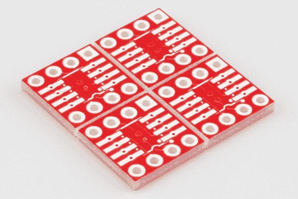](https://cdn.sparkfun.com/assets/learn_tutorials/4/0/1/array-iso.jpg)

这种适配器的更新版本是一个小型印刷电路板阵列——如果你要适配一个芯片，你很可能要适配多个芯片。PCB 很容易断裂，形成四块独立的电路板。

棋盘上的 SOIC 土地格局也较之前有所改善。焊盘非常长，以便容纳窄和宽封装。SOIC 平台用电镀通孔固定，以防止返工时提升。对于 IC 周围没有额外间隙的情况，SOIC 也完全包含在 DIP 轮廓内。

[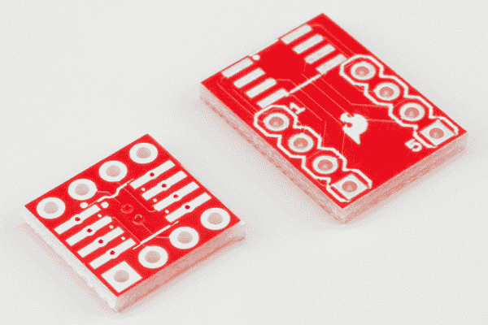](https://cdn.sparkfun.com/assets/learn_tutorials/4/0/1/comparison.jpg)

### 推荐阅读

如果你对某个话题不熟悉，可以看看下面的链接。

*   [PCB 基础知识](https://learn.sparkfun.com/tutorials/pcb-basics)
*   [集成电路](https://learn.sparkfun.com/tutorials/integrated-circuits)
*   [SMD 封装外形创建教程](https://learn.sparkfun.com/tutorials/designing-pcbs-smd-footprints)
*   [如何使用试验板](https://learn.sparkfun.com/tutorials/how-to-use-a-breadboard)
*   [贴片焊接](https://www.sparkfun.com/tutorials/107)

## 装配

组装适配器相当简单，但是有几个技巧可以使它变得更容易。

### 材料

要构建一个适配器，您需要以下组件。

*   一个 SOIC-8 集成电路来适应。
*   从 [8 针 SOIC 到 DIP 适配器板](https://www.sparkfun.com/products/13655)。
*   有的[破开公头](https://www.sparkfun.com/products/116)。
*   一些焊料，要么[含铅](https://www.sparkfun.com/products/9161)要么[无铅](https://www.sparkfun.com/products/9325)。

### 工具

还推荐使用以下工具。

*   一个带有[尖端](https://www.sparkfun.com/products/10721)的[烙铁](https://www.sparkfun.com/products/11704)。
*   放大镜或[放大镜](https://www.sparkfun.com/products/9316)。
*   [交叉锁紧](https://www.sparkfun.com/products/12572)镊子。
*   一个[无焊试验板](https://www.sparkfun.com/products/12043)，用作装配夹具。

### 构建适配器

#### 将木板分开

板的阵列在制造时被划线。如果你顺着刻痕弯下去，木板很容易断裂。

[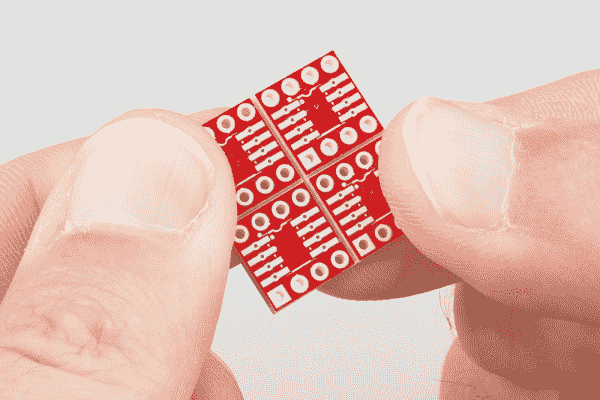](https://cdn.sparkfun.com/assets/learn_tutorials/4/0/1/snapping.jpg)

#### 准备焊接

最简单的方法是在安装接头之前将 IC 焊接到位，这样就不必在突出的引脚周围工作。

如果这是你第一次焊接表面贴装集成电路，耐心和稳定的手是良好焊点的关键。

*   整洁很重要——你要放上足够的焊料将引脚连接到焊盘，但不要太多，以免相邻的引脚意外桥接。
*   动作要快——如果你把热烙铁放在电路板上太久，就有可能烧掉电路板上的走线和焊盘。当你把焊料涂在烙铁上时，你希望烙铁处于焊料几乎立即流动的温度。有点违反直觉的是，较热的熨斗比较冷的熨斗损害更小——让熨斗处于较热的温度可以让你工作得更快，减少潜在的损害。

#### 将 IC 焊接到位

首先，加热 PCB 上的一个角焊盘(又称焊盘)。

[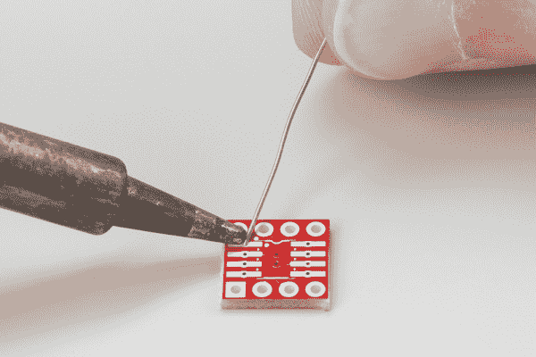](https://cdn.sparkfun.com/assets/learn_tutorials/4/0/1/first-pad.jpg)

一旦它热了，在它上面流一点焊料。

集成电路的引脚 1 通常在集成电路体上有一个小凹痕，或者芯片的那一端有一个凹口。将这些标记与丝网印刷中的相应标记对齐。丝网印刷实际上有三个标记，IC 一端的一个凹口，IC 轮廓内的一个点，IC 外的一个点(IC 焊接后仍可见)。

[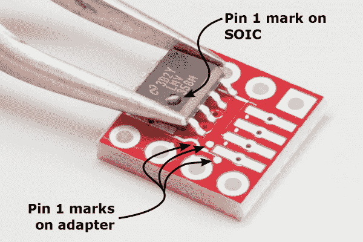](https://cdn.sparkfun.com/assets/learn_tutorials/4/0/1/SOIC-pin-1.png)

用镊子夹住 IC，将其定位在封装上方。重新加热上一步的焊料滴，使 IC 引线附着在上面。在焊料冷却之前，将 IC 向下压平。

[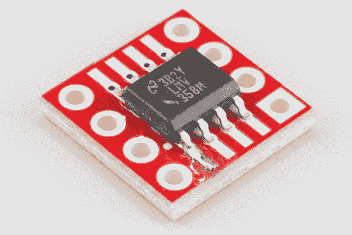](https://cdn.sparkfun.com/assets/learn_tutorials/4/0/1/chip-one-leg.jpg)

此时，它不必是完美的焊脚，但 IC 应平放在电路板上，所有引脚应与 PCB 焊盘对齐。如果对准不好，或者第一个引脚是反方向的，重新加热焊料，并调整位置。焊接更多焊盘后，这个问题变得更加难以解决。

芯片正确对齐后，你就可以绕着芯片焊接每一根引线。如果您使用烙铁的尖端同时加热 IC 引线和 PCB 焊盘，然后流一点点焊料将它们连接起来，效果最佳。

[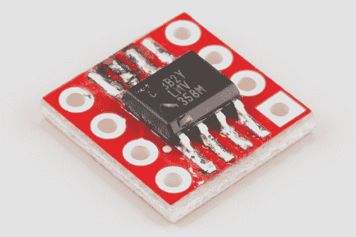](https://cdn.sparkfun.com/assets/learn_tutorials/4/0/1/chip-no-pins.jpg)

当你回到第一条引线时，你可以重新加热接头，多流一点焊料，并确保留下一个整齐的圆角。

#### 焊接接头引脚

IC 就位后，现在可以焊接接头引脚了。如果你有一个夹具，可以在焊接时固定住针脚，那就更容易了。原来，一个无焊试验板有一堆正确排列的孔！

首先，从头部断开 4 针部分。将它们插入试验板，相隔两排。

[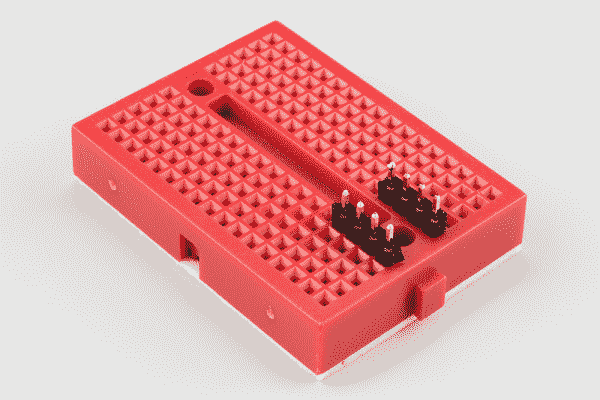](https://cdn.sparkfun.com/assets/learn_tutorials/4/0/1/pins-in-breadboard.jpg)

将 PCB 安装在接头上。注意保持针脚上下对齐。

[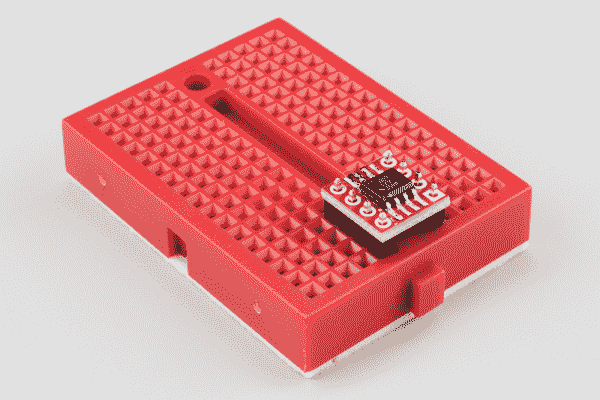](https://cdn.sparkfun.com/assets/learn_tutorials/4/0/1/pcb-stet-on-pins.jpg)

沿着 PCB 走，从电路板顶部焊接每个引脚。完成后，它应该看起来像下面的板子。

[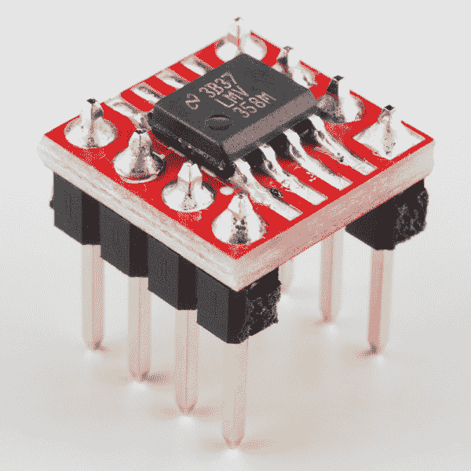](https://cdn.sparkfun.com/assets/learn_tutorials/4/0/1/assembled.jpg)

#### 去焊药

一旦你完成焊接，看看焊点。如果它们表面或周围有一层黄色或棕色的涂层，则电路板上有助焊剂残留物(在放大镜下，它可能看起来像烧焦的糖)。焊剂是酸性的，会导致长期可靠性的问题，所以最好将其清除。

你必须检查你的焊料的文档，以获得正确的清洗方法。有些助焊剂是水溶性的，而有些则需要异丙醇或丙酮等溶剂。

#### 核实

在我们开始应用 SOIC 转双列直插式适配器板之前，让我们花点时间仔细检查一下我们的工作。

快速目视检查有助于发现焊桥或流动不正常的焊点。这也是最后一次检查的好时机，以确保 SOIC 的第一针方向正确。

[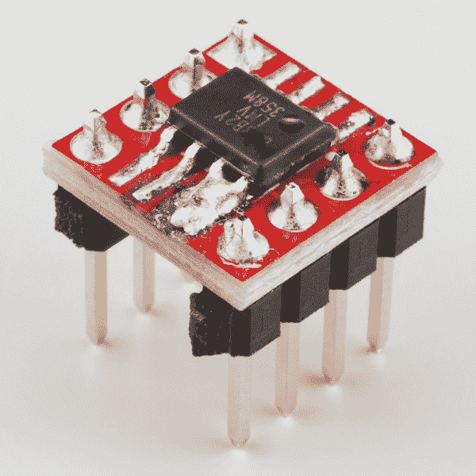](https://cdn.sparkfun.com/assets/learn_tutorials/4/0/1/solder-blob.jpg)

为了增加一点信心，你也可以在[导通模式](https://learn.sparkfun.com/tutorials/how-to-use-a-multimeter?_ga=1.108769729.273388466.1418147030#continuity)下使用[万用表](https://learn.sparkfun.com/tutorials/how-to-use-a-multimeter?_ga=1.108769729.273388466.1418147030)，来验证 SOIC 的脚是否连接到管脚。

## 使用适配器

### 适配器方向

DIP 封装的引脚相对于 SOIC 的引脚旋转 90°。我们在[装配](https://learn.sparkfun.com/tutorials/8-pin-soic-to-dip-adapter-hookup-guide/assembly)部分覆盖了 SOIC 的 pin-1 标记。

DIP 封装的引脚 1 有两种标记方式。

首先，引脚 1 的焊盘是方形的，其他的是圆形的。

[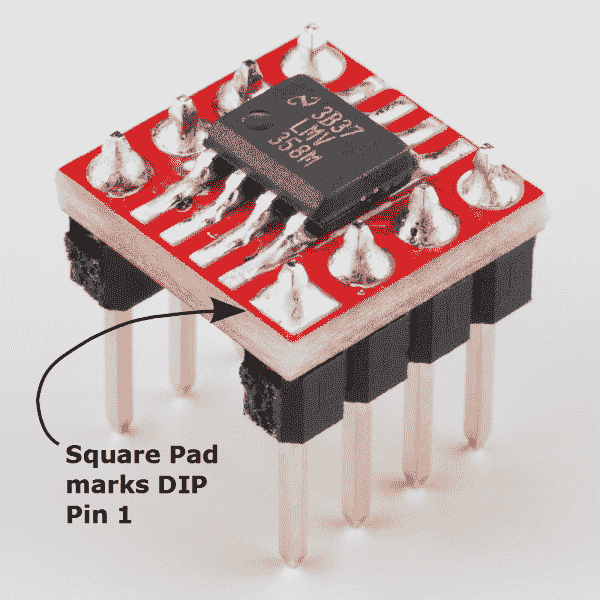](https://cdn.sparkfun.com/assets/learn_tutorials/4/0/1/DIP-pin-1_2.png)

第二，引脚 1 和 8 标在电路板底部丝网印刷的图例中。

[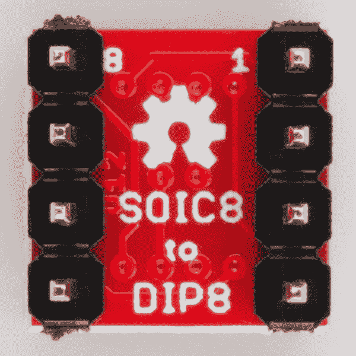](https://cdn.sparkfun.com/assets/learn_tutorials/4/0/1/DIP-8-1-marks.jpg)

### 个案研究

#### 在试验板上

当你想用只有 SOIC 才有的芯片制作试验板原型时，这个适配器很有用。它允许芯片适当地适合试验板的行。

[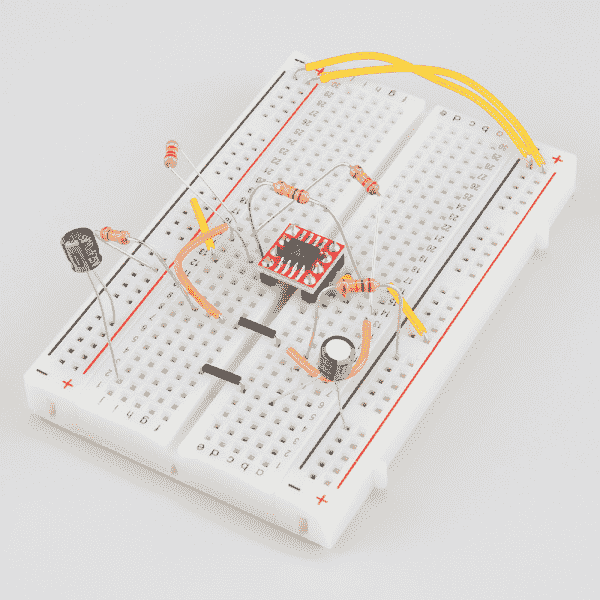](https://cdn.sparkfun.com/assets/learn_tutorials/4/0/1/opamp-oscillator.jpg)*Dual-opamp Oscillator On Breadboard*

#### 升级旧设备

SIOC 转双列直插式适配器的另一个常见用途是升级或改造现有设备。

曾经，这是一种更新 PC 主板上 BIOS 的方法，尽管最近 DIP-8 eprom 不太流行，表面贴装存储器更为常见，通常无需从主板上移除即可重新编程。

芯片替代在高保真和专业音频爱好者中也是一种常见的做法，有时被称为*芯片滚动*或 *POOGE* -ing ( *P* 渐进式 *O* 优化*O*f*G*eneric*E*设备)。许多这类器件都采用 DIP-8 封装，内置单通道或双通道运算放大器。对于旧器件来说，安装新的运算放大器是一种简单、廉价的升级方式，因为新的运算放大器具有更低的失真、更低的固有噪声和更低的 DC 偏移。有时，这些较新的放大器仅提供表面贴装封装，如德州仪器 [OPA1641/1642](http://www.ti.com/product/opa1642) 。

[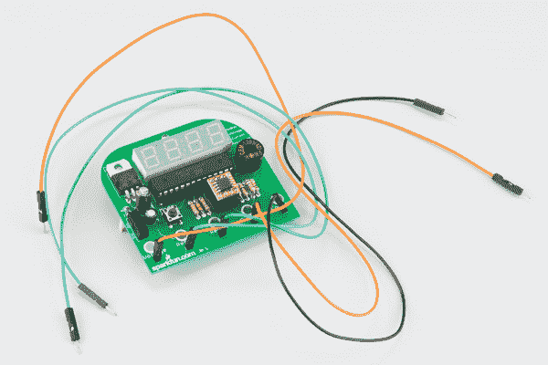](https://cdn.sparkfun.com/assets/learn_tutorials/4/0/1/jims.jpg)

当进行这种修改时，有几件事情需要注意。

*   首先，注意原厂设备的插座中是否有 IC。如果是这样，应该很容易移除旧芯片，并安装适配器。
*   如果没有插座，旧 IC 直接焊接到电路板上，拆卸旧 IC 时要小心，以防损坏 PCB。把旧集成电路的脚切掉，然后一个一个地拆下来可能更容易。
*   如果没有插座，你可以考虑安装一个作为升级的一部分。
*   最后，在开始之前，请注意 IC 的方向，这样您就可以确保正确地放入替换元件。

## 资源和更进一步

### 资源

该板是现已退役的 [8 针 SOIC 双列直插式适配器](https://www.sparkfun.com/products/retired/494)的重新设计。

如果你正在调试基于 SOIC-8 的设计，你可能会发现 [SOIC-8 测试剪辑](https://www.sparkfun.com/products/13153)很有用。

我们还提供许多其它表贴通孔转换板:

*   [20 针 SOIC 到 DIP 适配器](https://www.sparkfun.com/products/495)
*   [28 针 SOIC 到 DIP 适配器](https://www.sparkfun.com/products/496)
*   [SOT23 至 DIP 适配器](https://www.sparkfun.com/products/717)
*   [8 针 SSOP 到 DIP 适配器](https://www.sparkfun.com/products/497)
*   [16 针 SSOP 到 DIP 适配器](https://www.sparkfun.com/products/498)
*   [20 针 SSOP 到 DIP 适配器](https://www.sparkfun.com/products/499)
*   [28 针 SSOP 到 DIP 适配器](https://www.sparkfun.com/products/500)

### 更进一步

*   [POOGE 编年史](http://www.amazon.com/Audio-Electronics-Pooge-Chronicles/dp/1882580141) (POOGE =通用设备的渐进优化)