# 游标屏蔽连接导轨

> 原文：<https://learn.sparkfun.com/tutorials/vernier-shield-hookup-guide>

## 介绍

作为一名前高中物理老师，我在教室里用游标传感器教授几乎每一个单元。Vernier 拥有丰富的传感器套件、易于使用的软件以及对其所有产品的出色支持。

我在物理课上使用 Vernier 取得了巨大成功，但我一直在寻找一种解决方案，使我能够在其他教室中使用这些相同的传感器，因为我无法直接使用装有 LoggerPro 软件或 Vernier LabPro 硬件的计算机。

这段旅程的一部分让我开发了这个[低成本的 photogate 定时器项目](https://learn.sparkfun.com/tutorials/vernier-photogate)。我在 SparkFun 开始之前就有了这个想法，而且，一旦到了这里，我就能够开始这个项目来开发一个 [Arduino 屏蔽](http://arduino.cc/en/Main/ArduinoShields)，它将允许我们快速地将任何游标探针连接到 Arduino。

#### 游标 LabPro

[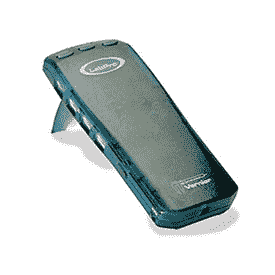](https://cdn.sparkfun.com/assets/7/7/2/b/d/52ea9f11ce395f41408b4567.jpg)

<https://cdn.sparkfun.com/assets/6/a/1/d/f/52eac5a9ce395fa83d8b456b.mp3>

<https://cdn.sparkfun.com/assets/a/0/1/d/d/52eac57cce395ff33d8b4567.ogg>

 Your browser does not support this audio format.Vernier LabPro Startup Beep

这个绿盒子是很多科学教室里的经典。当它插在电脑上时，它会发出一种非常悦耳的、立即可识别的声音。

除了 [LabPro](http://www.vernier.com/products/interfaces/labpro/) 之外，Vernier 还有各种其他接口，包括:

*   [LabQuest](http://www.vernier.com/products/interfaces/labq/)
*   [实验室问题 2](http://www.vernier.com/products/interfaces/labq2/)
*   [LabQuest Mini](http://www.vernier.com/products/interfaces/lq-mini/)
*   [走！链接](http://www.vernier.com/products/interfaces/go-link/)

这些界面是课堂数据收集和自动化的绝佳解决方案。它们易于使用，并直接与 Vernier 的 [LoggerPro](http://www.vernier.com/products/software/lp/) 软件平台集成。随着教室中低成本微控制器的普及，我们希望为教师提供一种替代方案，利用他们现有的传感器、活动和来自 Vernier 的带有 [Arduino](http://www.arduino.cc) 的材料。

我们开发了这个 [Arduino Shield](https://www.sparkfun.com/products/11897) 来将你最喜欢的[游标传感器](http://www.vernier.com/products/sensors/)连接到任何 [Arduino Uno](https://www.sparkfun.com/products/11224) 或 [Arduino Uno 兼容](https://www.sparkfun.com/products/11575)设备。

[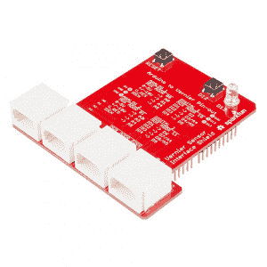](https://cdn.sparkfun.com/assets/7/3/5/e/c/52e81e6cce395fec7f8b4567.jpg)

### 你需要什么:

*   [游标接口屏蔽](https://www.sparkfun.com/products/11897)
*   [Arduino Uno](https://www.sparkfun.com/products/11224) 或 [Arduino Uno 兼容板](https://www.sparkfun.com/products/11575)。
*   [安装在您机器上的 Arduino 软件](http://www.arduino.cc/download)。
*   几个[游标传感器](http://www.vernier.com/products/sensors/)可以随意摆弄。

### 推荐阅读

*   [Arduino 是什么？](https://learn.sparkfun.com/tutorials/what-is-an-arduino)
*   [安装 Arduino IDE](https://learn.sparkfun.com/tutorials/installing-arduino-ide)
*   [什么是盾牌？](https://learn.sparkfun.com/tutorials/arduino-shields-v2)
*   [游标探针软件入门](http://www.vernier.com/getting-started/)

## 关于游标

[](https://cdn.sparkfun.com/assets/5/9/0/9/4/52eab180ce395fdc268b456b.png)

[Vernier Software and Technology](http://www.vernier.com/)在为全球教育工作者收集和分析数据方面一直处于领先地位。由 David 和 Christine Vernier 于 1981 年创立，他们是第一批设计并推广在 K-12 教室实验室实验中使用计算机、传感器和数据收集的公司之一。

他们目前有超过 70 个完全校准的[传感器](http://www.vernier.com/products/sensors/)和 5 个不同的数据收集[接口](http://www.vernier.com/products/interfaces/)，这是他们目录的一部分。我们非常幸运能与 Vernier 合作开发这款 Arduino 盾牌。它允许教师将 Arduino 平台的强大功能和多功能性与 Vernier 生产和支持的大量经过校准、课堂测试和加固的传感器相结合。

## 游标屏蔽引脚排列和配置

Vernier 使用“标准”[英国电信连接器](http://en.wikipedia.org/wiki/British_telephone_sockets#Plugs)标准化了他们所有的传感器。这些连接器各有 6 根电线将传感器连接到游标数据采集[接口](http://www.vernier.com/products/interfaces/)。我们设计了 shield，以最大限度地提高灵活性和易用性，将最多两个模拟(BTA)和两个数字(BTD)游标传感器集成到一个 Arduino 中。完整的传感器引脚可以在 Vernier 的网站[这里](http://www.vernier.com/support/sensor-pinouts/)找到。

### 英国电信模拟(BTA)-右手边

[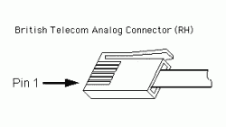](https://cdn.sparkfun.com/assets/8/b/9/f/d/52efead4ce395f041e8b4568.gif)

教室中使用的大量传感器属于“模拟”传感器类别。点击此处了解更多关于模拟和数字的区别。

BTA 连接器的引脚定义如下:

T52

| **PIN #** | **引脚名称** | **说明** |
| 1 | 模拟传感器输出
(-10V 至+10V) | 配合若干游标[电压探头](http://www.vernier.com/products/sensors/voltage-probes/)使用。这是通过标度和移位运算放大器电路连接的，因此 Arduino 可以在 0 - 5V 的标度上读取它。 |
| 2 | GND | 地。 |
| 3 | Vres | 电阻参考。15K 上拉电阻将此引脚连接到 5V，用作引脚 6 和 GND 之间的分压器。 |
| 4* | 自动下降 | 大多数传感器都有一个独特的电阻连接在此引脚和 GND 之间。Vernier 用这个来识别传感器。(并非所有传感器都支持) |
| 5 | 电源 | 5 VDC |
| 6 | 模拟传感器输出
(0V 至-5V) | 大多数模拟传感器的主传感器输出，包括光、温度、力、压力、pH 值等... |

[http://www.vernier.com/support/sensor-pinouts/](http://www.vernier.com/support/sensor-pinouts/)

为了扩展游标设备的使用，他们还提供了一些[电压探针](http://www.vernier.com/products/sensors/voltage-probes/)，允许在+/- 6V、+/- 10V 和+/- 30V 之间进行直接电压测量。在每个探头上，信号分别连接到 BTA 接头的触针 1 和和 GND。

### 英国电信数字公司(BTD)-左手

[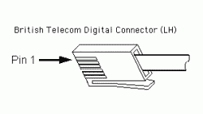](https://cdn.sparkfun.com/assets/6/8/b/5/0/52efead3ce395fa8518b4568.gif)

数字传感器是返回开启(5V)或关闭(0V)信号的任何器件。常见的数字传感器包括:运动检测器、光电门、辐射监测器和旋转运动传感器。

这些传感器都有某种独特的引脚定义。下表概述了用于游标数字连接器的引脚分配。

```
Note that the connector is slightly different compared to the analog sensors. This is called a left-handed British Telecom connector and has the tab on the opposite side. The BTA and BTD connectors will not plug into the same socket. 
```

| PIN # | 系统默认值 | 运动
探测器 | 光电门 | 辐射
监视器 | 旋转
运动 |
| one | IO1 | 回声 | 投入 | 数数 | CCWcount |
| Two | IO2 | 初始化 |  |  | 账户 |
| three | IO3 | 自动凹痕 | 自动凹痕 | 自动凹痕 | 自动凹痕 |
| four | 压水反应堆 | 压水反应堆 | 压水反应堆 | 压水反应堆 | 压水反应堆 |
| five | GND | GND | GND | GND | GND |
| six | IO4 |  |  |  | X4res |

### Arduino 屏蔽引脚分配

为了最大限度地提高使用所有游标传感器的灵活性，我们在屏蔽上做了以下引脚分配。许多游标传感器使用 I2C 来识别和校准数据。我们使用一个[复用器](http://playground.arduino.cc/learning/4051)在所有四个连接器之间“共享”(复用)引脚 A4 和 A5。多路复用器由引脚 10 (LSB)和引脚 11 (MSB)控制。更多信息参见[复用](https://learn.sparkfun.com/tutorials/vernier-shield-quick-start-guide/multiplexer)部分。

### 模拟端口的引脚分配

|  | 模拟 1 | 模拟 2 | 描述 |
| 多路复用控制地址 | 00 | 01 | 引脚 10 (LSB)和 11 (MSB)控制 A4 和 A5 的多路复用器。 |
| 模拟信号
(0-5V) | A0 | 主动脉第二声 | 大多数模拟传感器都会与此引脚接口。模拟 1 使用 A0，模拟 2 使用 A2。 |
| 模拟信号
(-10V - +10V) | 一流的 | A3 号 | 该屏蔽具有内置电路，可将引脚 A1 和 A3 的输入电压从-10V 至+10V 缩放和转换至 0V 至 5V 范围。 |
| V_res | A4* | A4* | 电阻参考。15K 上拉电阻将此引脚连接到 5V，用作引脚 6 和 GND 之间的分压器。 |
| 自体观念 | A5* | A5* | 一个 10K 上拉电阻将这些引脚连接到 5V。此引脚上测得的压降唯一识别传感器。 |

### 数字端口的引脚分配

|  | 数字 1 | 数字 2 | 描述 |
| 多路复用控制地址 | Ten | Eleven | 引脚 10 (LSB)和 11 (MSB)控制 A4 和 A5 的多路复用器。 |
| IO1
(BTD 引脚 1) | Two | six | 用于光电门、运动检测器回波、辐射计数和逆时针旋转运动计数的信号引脚。 |
| IO2
(BTD 引脚 2) | 3 / A4 纸* | 7 / A4 纸* | 运动检测器的触发引脚和传感器 ID 的 I2C 数据(SDA) |
| IO3
(BTD 引脚 3) | 4 / A5* | 8 / A5* | 传感器 ID 的 I2C 时钟(SCL) |
| IO4
(BTD 引脚 6) | five | nine | 用于旋转运动传感器，以提高灵敏度。 |

*引脚 A4 和 A5 由所有四个连接器共享。为了正确访问 BTA 和 BTD 连接器引脚，您需要连接模拟多路复用器电路。

### 辅助引脚和连接

除了游标 BTA 和 BTD 连接器的内部布线和路由，我们还在引脚 13 上放置了一个指示灯 LED，在引脚 12 上放置了一个通用按钮，在屏蔽上放置了一个复位按钮。

[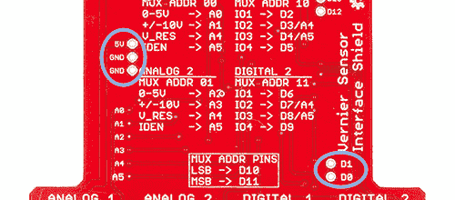](https://cdn.sparkfun.com/assets/2/0/2/3/2/52f56dd7ce395ff9508b456a.jpg)

我们还暴露了电源和接地过孔以及引脚 0 (RX)和 1 (TX)，用于添加串行通信外设，如[串行使能 LCD](https://www.sparkfun.com/products/9396) 或[串行 7 段显示器](https://www.sparkfun.com/products/11442)。

## 多路器

Vernier 使用多种方法来识别哪些传感器连接到接口。大多数传感器使用放置在其中一个引脚上的[电阻器](https://learn.sparkfun.com/tutorials/vernier-shield-quick-start-guide/vernier-sensor-identification)，但是它们中的一些传感器使用 I2C 来识别传感器和存储校准数据。游标屏蔽使用模拟[多路复用器](http://playground.arduino.cc/learning/4051)将引脚 A4 (SDA)和 A5 (SCL)共享/路由到四个连接器中的每一个。

引脚 10 (LSB)和 11 (MSB)用于控制多路复用器。下面的代码片段说明了一种切换连接器 A4 和 A5 所连接到的连接器的方法。

```
language:c
const int muxLSB = 10;
const int muxMSB = 11;

void setup()
{
  pinMode(muxLSB, OUTPUT);
  pinMode(muxMSB, OUTPUT);
}
void setMux(int connectorNum)
{ 
// void setMux(int connectorNum)
// connectorNum is a number from 0 to 3 which
// identifies which connector to switch the MUX to.
// Where if connector num is equal to:
//    0 --> Analog 1
//    1 --> Analog 2
//    2 --> Digital 1
//    3 --> Digital 2

  switch (connectorNum)
  {
  case 1: // ANALOG 2 - MUX ADDR 01
    digitalWrite(muxMSB, LOW);
    digitalWrite(muxLSB, HIGH);
    break;
  case 2: // DIGITAL 1 - MUX ADDR 10 
    digitalWrite(muxMSB, HIGH);
    digitalWrite(muxLSB, LOW);
    break;
  case 3: // DIGITAL 2 - MUX ADDR 11
    digitalWrite(muxMSB, HIGH);
    digitalWrite(muxLSB, HIGH);
    break;
  default: // ANALOG 1 - MUX ADDR 00
    digitalWrite(muxMSB, LOW);
    digitalWrite(muxLSB, LOW);
  }
} 
```

一般来说，你不需要访问这些线路，除非你是通过 I2C 接口游标传感器。

## 游标传感器标识

Vernier 开发了一种非常聪明的方法，使用一个简单的无源电阻来识别连接到其接口的传感器。许多游标传感器可以通过放置在 AutoIDENT 引脚和 GND 之间的特定电阻进行唯一识别。

我们在屏蔽上集成了一个 10k 欧姆的上拉电阻，这样我们就可以利用简单的分压器计算直接测量自生电阻。

[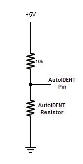](https://cdn.sparkfun.com/assets/f/c/7/0/e/52f526b3ce395f00158b4568.jpg)Voltage divider circuit

### 游标传感器的标称电阻和电压值

我们收集了 Vernier 使用的流行传感器及其相应的唯一识别电阻值的列表。这些是标称值，可能在+/- 5%的范围内变化。

#### 模拟传感器

[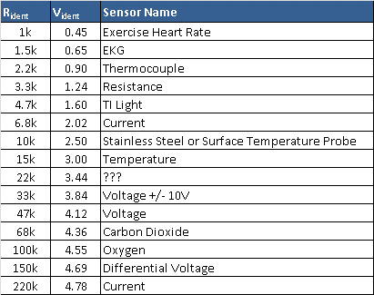](https://cdn.sparkfun.com/assets/1/f/c/a/3/52f52d71ce395f7a6e8b4567.jpg)

#### 数字传感器

[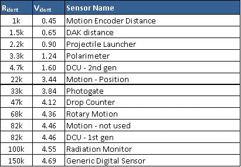](https://cdn.sparkfun.com/assets/4/3/c/5/1/52f52d77ce395f5d5c8b4567.jpg)

您会注意到这里没有列出 70 个传感器。对于所有新的传感器，Vernier 在 I2C 接口上实现了标准化，以查询和交流 SensorID 和校准数据。下一节将解释该代码的一个示例。

## 示例 1 - AutoID Arduino

Vernier 的团队帮助我们创建了几个简单的 Arduino 草图，可以自动查询 Arduino 的模拟或数字端口，并报告传感器标识和标准校准数据。

Vernier 已经在 [github](https://github.com/VernierSoftwareTechnology/arduino) 上创建了大量的实例。将这些草图上传到你的 arduino 设备，并打开[串行监视器](http://arduinobasics.blogspot.com/search/label/Serial%20Monitor)来查看返回到你电脑的数据。

### AutoID 模拟传感器

该草图旨在自动查询连接到游标屏蔽上两个模拟端口的传感器。在 AutoID 之后，它将传感器信息打印到串行监视器上，并开始将(校准的)数据记录到屏幕上。该脚本中写入了 Vernier 传感器使用的默认校准常数。

这很可能是你大多数传感器需要的唯一 Arduino 草图。

正如所写的，数据每秒收集一次。改变变量*读数之间的时间*的值，以改变数据收集的速率。

将`VernierAnalogAutoID`草图上传到您的 Arduino。

```
language:c
    /*
VernierAnalogAutoID (v 2013.12)
Reads the information to AutoID a Vernier BTA sensor with digital AutoID,
and resistor ID sensors including Vernier Stainless Steel Temperature Probe (TMP-BTA). 
It should read the +/-10 volt Voltage Probe correctly also.
This version does all tests for resistorID sensors first, then
turns on the I2C clock and tests for digital autoID sensors.)

Note that this sketch handles multiple pages of sensor calibrations.

When used with the SparkFun Vernier Interface Shield, this program will AutoID
two different sensors on BTA1 and BTA2\. With homemade, breadboard
connections, it will work with only one sensor.

After the AutoID:
Assuming Vernier analog (BTA) Sensors are connected to the BTA connectors,
this sketch displays the time and sensor readings on the Serial Monitor.
As written, the readings will be displayed every second. 
Change the variable TimeBetweenReadings to change the rate.
 See www.vernier.com/arduino for more information.
*/

//#define PLX_DAQ         // uncomment this line if using PLX_DAQ for data collection.
#include <Wire.h>
#include "vernierShield.h"

unsigned int BAUD_RATE = 9600;  // set data rate for Serial monitor to be the fastest possible.

int dataRate = 60;        // set # of samples per second.
int duration = 15000;      // set the data collection duration in milliseconds
                          // default value is set to 5 seconds or 5000 milliseconds
char delimiter = '\t';

// Variables used in the code for calculations
unsigned long timeRef;    // reference for starting time
unsigned long timeInterval;

unsigned long ReadingNumber; // index for data counter

void setup()
{
  pinMode(ledPin, OUTPUT);
  pinMode(buttonPin, INPUT_PULLUP);
  pinMode(muxlsb, OUTPUT);  // multiplexer pins for AutoID
  pinMode(muxmsb, OUTPUT);  // multiplexer pins for AutoID

  timeInterval = 1000 / dataRate;

#ifdef PLX_DAQ
  {
    delimiter = ',';
    BAUD_RATE = 56000;  // max speed for PLX_DAQ that matches with Arduino's data rates
  }
#endif
  Serial.begin(BAUD_RATE);
  digitalWrite(ledPin, LOW);

  device = 0x50;     // I2C Address for sensors - used for calibration data
  Serial.println("");

  // Read BTA1 Sensor
  digitalWrite(muxlsb, LOW); //set multiplexer for BTA1
  digitalWrite(muxmsb, LOW);
  BTAResistorSensorID(0);

  // Read BTA2 Sensor
  digitalWrite(muxlsb, HIGH); //set multiplexer for BTA2
  digitalWrite(muxmsb, LOW);
  BTAResistorSensorID(1);

  Wire.begin(); //start I2C communication

  // Read BTA1 Sensor
  digitalWrite(muxlsb, LOW); //set multiplexer for BTA1
  digitalWrite(muxmsb, LOW);
  if (SensorNumber[0] == 0) DigitalSensorID(0); // if no resistorID, check for digital ID

  // Read BTA2 Sensor
  digitalWrite(muxlsb, HIGH); //set multiplexer for BTA2
  digitalWrite(muxmsb, LOW);
  if (SensorNumber[1] == 0) DigitalSensorID(1); // if no resistorID, check for digital ID

  PrintSensorInfo(0);// this line can be commented out if you do not need all this info!!!
  PrintSensorInfo(1);// this line can be commented out if you do not need all this info

  PrintHeaderInfo();
  ReadingNumber = 0;
  timeRef = millis();

}

void loop()
{
  int Count[2]; //reading from 0 to 5 volt input
  int AltCount[2] ;//reading from -10 to +10V input
  float Voltage[2];
  float SensorReading[2];
  unsigned long currTime;

  currTime = millis();
  if ((currTime - timeRef) <= (duration))     // controls the duration of the data collection
  {
    if (currTime >= ReadingNumber * timeInterval + timeRef) // controls so only runs once per timeInterval
    {
      digitalWrite(ledPin, HIGH); //turn on LED
#ifdef PLX_DAQ
      {
        Serial.print("DATA,");
      }
#endif

      Serial.print((currTime - timeRef) / 1000.0, 3);
      for (int Channel = 0; Channel <= 1; Channel++)
      {
        Serial.print(delimiter); //tab character
        if (Name[Channel] == "Voltage +/- 10V")
        {
          AltCount[0] = analogRead(A1); //read both +/- 110 volt lines
          AltCount[1] = analogRead(A3);
          // convert from count to raw voltage if using 10 volt range:
          Voltage[Channel] = AltCount[Channel] / 1023.0 * 5.0 ;
        }
        else
        {
          Count[0] = analogRead(A0); //read both analog lines
          Count[1] = analogRead(A2);
          // convert from count to raw voltage on 0 to 5 range:
          Voltage[Channel] = Count[Channel] / 1023.0 * 5.0;
        }
        SensorReading[Channel] = Intercept[Channel] + Voltage[Channel] * Slope[Channel];
        //special calibration for thermistor temperture probe:
        if (SensorNumber[Channel] == 10) SensorReading[Channel] = Thermistor(Count[Channel]);
        Serial.print(SensorReading[Channel], 3);
      } // end of going through the channels

      Serial.println(" ");
      digitalWrite(ledPin, LOW);// LED on D13 flashes once per readng
      ReadingNumber++;
    }
  }
  else
  {
    digitalWrite(ledPin, LOW);

    PrintHeaderInfo();
    // reset counters and timeRef
    digitalWrite(ledPin, HIGH);
    ReadingNumber = 0;
    timeRef = millis();
  }
} // end

void BTAResistorSensorID(int Channel)
{
  Name[Channel] = ""; // clear name string
  ShortName[Channel] = ""; // clear name string
  SensorNumber[Channel] = 0;
  delay (10);
  int CountID = analogRead(A5);
  VoltageID[Channel] = CountID / 1023.0 * VCC;// convert from count to voltage
  if (VoltageID[Channel] > 0.86 & VoltageID[Channel] < 0.95) SensorNumber[Channel] = 1;
  if (VoltageID[Channel] > 3.80 & VoltageID[Channel] < 3.88) SensorNumber[Channel] = 2; // Voltage +/-10 V
  if (VoltageID[Channel] > 1.92 & VoltageID[Channel] < 2.13) SensorNumber[Channel] = 3;
  if (VoltageID[Channel] > 1.18 & VoltageID[Channel] < 1.30) SensorNumber[Channel] = 4;
  if (VoltageID[Channel] > 3.27 & VoltageID[Channel] < 3.68) SensorNumber[Channel] = 5;
  if (VoltageID[Channel] > 4.64 & VoltageID[Channel] < 4.73) SensorNumber[Channel] = 8; //Differential Voltage
  if (VoltageID[Channel] > 4.73 & VoltageID[Channel] < 4.83) SensorNumber[Channel] = 9; //Current
  if (VoltageID[Channel] > 2.38 & VoltageID[Channel] < 2.63) SensorNumber[Channel] = 10; //Stainless Steel or Surface Temperature Probe
  if (VoltageID[Channel] > 2.85 & VoltageID[Channel] < 3.15) SensorNumber[Channel] = 11;
  if (VoltageID[Channel] > 1.52 & VoltageID[Channel] < 1.68) SensorNumber[Channel] = 12; //TILT
  if (VoltageID[Channel] > 0.43 & VoltageID[Channel] < 0.48) SensorNumber[Channel] = 13;
  if (VoltageID[Channel] > 4.08 & VoltageID[Channel] < 4.16) SensorNumber[Channel] = 14;
  if (VoltageID[Channel] > 0.62 & VoltageID[Channel] < 0.68) SensorNumber[Channel] = 15;
  if (VoltageID[Channel] > 4.32 & VoltageID[Channel] < 4.40) SensorNumber[Channel] = 17;
  if (VoltageID[Channel] > 4.50 & VoltageID[Channel] < 4.59) SensorNumber[Channel] = 18; //Oxygen

  switch (SensorNumber[Channel])
  {
    case 1:
      Name[Channel] = "Thermocouple" ;
      Units[Channel] = "Deg C " ;
      ShortName[Channel] = "TC";
      Slope[Channel] = -2.45455;
      Intercept[Channel] = 6.2115;
      Page[Channel] = 1;; //calibration storage p (1,2, or 3)
      CalEquationType[Channel] = 1;
      break;
    case 2:
      Name[Channel] = "Voltage +/- 10V" ;  //!!! do not change this name or you will mess up the code of the loop
      Units[Channel] = "V" ;
      ShortName[Channel] = "Voltage10";
      Slope[Channel] = 4; //note correction for Sparkfun circuit done in calculation of Voltage!!
      Intercept[Channel] = -10;
      Page[Channel] = 1;; //calibration storage page
      CalEquationType[Channel] = 1;
      break;
    case 3:
      Name[Channel] = "Current" ;
      Units[Channel] = "Amps" ;
      ShortName[Channel] = "Current";
      Slope[Channel] = -2.665;
      Intercept[Channel] = 6.325;
      Page[Channel] = 1;; //calibration storage page
      CalEquationType[Channel] = 1;
      break;
    case 4:
      Name[Channel] = "Resistance" ;
      Units[Channel] = "Ohms" ;
      ShortName[Channel] = "Diff V";
      Slope[Channel] = -2.5;
      Intercept[Channel] = 6.25;
      Page[Channel] = 1;; //calibration storage page
      CalEquationType[Channel] = 1;
      break;
    case 8:
      Name[Channel] = "Diff Voltage" ;
      Units[Channel] = "V" ;
      ShortName[Channel] = "Diff V";
      Slope[Channel] = -2.5;
      Intercept[Channel] = 6.25;
      Page[Channel] = 1;; //calibration storage page
      CalEquationType[Channel] = 1;
      break;
    case 9:
      Name[Channel] = "Current" ;
      Units[Channel] = "Amp" ;
      ShortName[Channel] = "I";
      Slope[Channel] = 1;
      Intercept[Channel] = 0;
      Page[Channel] = 1;; //calibration storage page
      CalEquationType[Channel] = 1;
      break;
    case 10:
      Name[Channel] = "Temperature" ;
      Units[Channel] = "Deg C" ;
      ShortName[Channel] = "Temp";
      Slope[Channel] = 1;
      Intercept[Channel] = 0;
      Page[Channel] = 1;; //calibration storage page
      CalEquationType[Channel] = 1;
      break;
    case 11:
      Name[Channel] = "Temperature" ;
      Units[Channel] = "Deg C" ;
      ShortName[Channel] = "Temp";
      Slope[Channel] = 1;
      Intercept[Channel] = 0;
      Page[Channel] = 1;; //calibration storage page
      CalEquationType[Channel] = 1;
      break;
    case 12:
      Name[Channel] = "TI Light" ;
      Units[Channel] = "relative" ;
      ShortName[Channel] = "TI Light";
      Slope[Channel] = 1;
      Intercept[Channel] = 0;
      Page[Channel] = 1;; //calibration storage page
      CalEquationType[Channel] = 1;
      break;
    case 13:
      Name[Channel] = "Exercise Heart Rate" ;
      Units[Channel] = "V" ;
      ShortName[Channel] = "Ex HR";
      Slope[Channel] = 1;
      Intercept[Channel] = 0;
      Page[Channel] = 1;; //calibration storage page
      CalEquationType[Channel] = 1;
      break;
    case 14:
      Name[Channel] = "Voltage" ;
      Units[Channel] = "V" ;
      ShortName[Channel] = "Volts";
      Slope[Channel] = 1;
      Intercept[Channel] = 0;
      Page[Channel] = 1;; //calibration storage page
      CalEquationType[Channel] = 1;
      break;
    case 15:
      Name[Channel] = "EKG" ;
      Units[Channel] = "V" ;
      ShortName[Channel] = "EKG";
      Slope[Channel] = 1;
      Intercept[Channel] = 0;
      Page[Channel] = 1;; //calibration storage page
      CalEquationType[Channel] = 1;
      break;
    case 17:
      Name[Channel] = "Carbon Dioxide" ;
      Units[Channel] = "ppm" ;
      ShortName[Channel] = "CO2";
      Slope[Channel] = 1;
      Intercept[Channel] = 0;
      Page[Channel] = 1;; //calibration storage page
      CalEquationType[Channel] = 1;
      break;
    case 18:
      Name[Channel] = "Oxygen" ;
      Units[Channel] = "%" ;
      ShortName[Channel] = "O2";
      Slope[Channel] = 1;
      Intercept[Channel] = 0;
      Page[Channel] = 1;; //calibration storage page
      CalEquationType[Channel] = 1;
      break;
    default:
      Name[Channel] = "nothing on BTA" ;
      SensorNumber[Channel] = 0; //
      Units[Channel] = "" ;
      ShortName[Channel] = "";
      Slope[Channel] = 1;
      Intercept[Channel] = 0;
      Page[Channel] = 1;; //calibration storage page
      CalEquationType[Channel] = 1;
      break;
  } // end of switch case
} //end of BTA resistor check

void DigitalSensorID(int Channel)
{
  int i;
  int x;
  // check for digital ID sensor:
  for (i = 0; i < 128; i++) // clear our digital ID sensor data
  {
    sensordata[i] = 0;
  }
  //Now check for Digital AutoID sensor:
  Wire.begin(); // join i2c bus (address optional for master) !!!
  //Reading device first time... ;
  Wire.beginTransmission(device);  // Now we're going to read it back
  Wire.write(0x0);                 // Sending address 0, so it knows where we'll want
  Wire.endTransmission();          // to read from
  x = Wire.requestFrom(device, 32); // Start new transmission and keep reading for 128 bytes
  i = 1;
  Serial.print("Wire Request In: ");
  Serial.println(x);
  while (x > 1)
  {
    x = Wire.available();
    char c = Wire.read();    // Read a byte and write it out to the Serial port
    sensordata [i] = c;
    i++;
  }
  //Reading device second time... ;
  Wire.beginTransmission(device); // Now we're going to read it back
  Wire.write(0x20);               // Sending address 0, so it knows where we'll want
  Wire.endTransmission();       // to read from
  x = Wire.requestFrom(device, 32);  // Start new transmission and keep reading for 128 bytes
  i = 1;
  while (x > 1)
  {
    x = Wire.available();
    char c = Wire.read();    // Read a byte and write it out to the Serial port
    sensordata [i + 32] = c;
    i++;
  }
  //Reading device third time... ;
  Wire.beginTransmission(device); // Now we're going to read it back
  Wire.write(0x40);               // Sending address 0, so it knows where we'll want
  Wire.endTransmission();         // to read from
  x = Wire.requestFrom(device, 32); // Start new transmission and keep reading for 128 bytes
  i = 1;
  while (x > 1)
  {
    x = Wire.available();
    char c = Wire.read();    // Read a byte and write it out to the Serial port
    sensordata [i + 64] = c;
    i++;
  }
  //Reading device a forth time... ;
  Wire.beginTransmission(device); // Now we're going to read it back
  Wire.write(0x60);               // Sending address 0, so it knows where we'll want
  Wire.endTransmission();       // to read from
  x = Wire.requestFrom(device, 32);  // Start new transmission and keep reading for 128 bytes
  i = 1;
  while (x > 1)
  {
    x = Wire.available();
    char c = Wire.read();    // Read a byte and write it out to the Serial port
    sensordata [i + 96] = c;
    i++;
  }
  //      Print out array:  // remove *'s to get this display for diagnostics

#ifdef DEBUG

  Serial.println("array: ");
  for (i = 1; i <= 128; i++)
  {
    Serial.print (i);
    Serial.print ("\t ");
    Serial.print(sensordata[i], DEC);
    Serial.print ("\t ");
    Serial.println(char(sensordata[i]));
  }
#endif

  //******************************************************************
  //Determine sensor number:
  //  VoltageID[Channel]=-1;// indicated resistor ID not used
  SensorNumber[Channel] = sensordata[2];

  //Determine the sensor name:
  Name[Channel] = "";
  for (i = 0; i < 20; i++)
  {
    char c =  sensordata[i + 9]; // 9 byte offset
    Name[Channel] += c;
  }
  Name[Channel] += '\0';    //add terminating character

  //Determine the short name:
  ShortName[Channel] = "";
  for (i = 0; i < 12; i++)
  {
    char c =  sensordata[i + 29]; // 29 byte offset
    ShortName[Channel] += c;
  }
  ShortName[Channel] += '\0';    //add terminating character

  //Determine the calibration equation type:
  CalEquationType[Channel] = sensordata[57];

  //Determines the  calibration page:
  Page[Channel] = sensordata[70];

  // the code below uses the calibration page set:
  // Intercept starts at 71 for page 1, 90 for p2, and 109 for p3

  //Determines intercept:
  for (i = 0; i < 4; i++)
  {
    floatbyte[i] = sensordata[i + 71 + (Page[Channel]) * 19];
  }
  float j = *(float*) &floatbyte;
  Intercept[Channel] = j;

  //Determines slope:
  // slope starts at 75 for page 1, 94 for p2, and 113 for p3
  for (i = 0; i < 4; i++)
  {
    floatbyte[i] = sensordata[i + 75 + (Page[Channel]) * 19];
  }
  float y = *(float*) &floatbyte;
  Slope[Channel] = y;

  //Determines the units:
  // the cryptic code in the next line just uses the
  // correct bytes, depending on the page selected.
  // units start at 83 for page 1, 102 for p2, and 121 for p3
  for (i = 0; i < 7; i++)
  {
    char c =  sensordata[83 + i + (Page[Channel]) * 19];
    Units[Channel] += c;
  }
  Units[Channel] += '\0';    //add terminating character
} //end of checking for digital ID sensor

void PrintHeaderInfo()
{
  Serial.println();
  Serial.println("**************************************************");
  Serial.println("*   Push the D12 button to start collection.     *");
  Serial.println("*      Use reset button to reset / stop          *");
  Serial.println("**************************************************");
  while (digitalRead(buttonPin) == HIGH)
  {
    // holding loop until the button goes low.
  }
  Serial.println("Vernier Format 2");
  Serial.println("Sensor Readings taken using Ardunio");
  Serial.println("Data Set");

#ifdef PLX_DAQ
  {
    Serial.println("CLEARDATA");
    Serial.print("LABEL,");
  }
#endif

  Serial.print("Time");
  for (int chan = 0; chan <= 1; chan++)
  {
    Serial.print(delimiter); //tab character
    //print sensor name:
    Serial.print (ShortName[chan]);
  }
  Serial.println("");

  Serial.print("seconds");

  for (int chan = 0; chan <= 1; chan++)
  {
    Serial.print("\t"); //tab character
    //print sensor name:
    Serial.print (Units[chan]);
  }
  Serial.println ("");
}

void PrintSensorInfo(int Channel)
{ // print out information about sensor:
  //(This code is commented out, but add it for more feedback)
  Serial.println(" ");
  Serial.print("BTA Connector ");
  Serial.println(Channel);
  Serial.print("sensor ID number: ");
  Serial.println(SensorNumber[Channel]);
  Serial.print("ID voltage level: ");
  Serial.println(VoltageID[Channel]);
  Serial.print("sensor name: ");
  Serial.println (Name[Channel]);
  Serial.print("sensor short name: ");
  Serial.println (ShortName[Channel]);
  Serial.print("calibration page: ");
  Serial.println(Page[Channel]);
  Serial.print("calibration equation type: ");
  Serial.println(CalEquationType[Channel]);
  Serial.print("intercept: ");
  Serial.println (Intercept[Channel]);
  Serial.print("slope ");
  Serial. println(Slope[Channel]);
  Serial.print("units: ");
  Serial.println (Units[Channel]);
}// end of PrintSensorInfo

float Thermistor(int Raw) //This function calculates temperature from ADC count
{
  /* Inputs ADC count from Thermistor and outputs Temperature in Celsius
  *  requires: include <math.h>
  * There is a huge amount of information on the web about using thermistors with the Arduino.
  * Here we are concerned about using the Vernier Stainless Steel Temperature Probe TMP-BTA and the
  * Vernier Surface Temperature Probe STS-BTA, but the general principles are easy to extend to other
  * thermistors.
  * This version utilizes the Steinhart-Hart Thermistor Equation:
  *    Temperature in Kelvin = 1 / {A + B[ln(R)] + C[ln(R)]3}
  *   for the themistor in the Vernier TMP-BTA probe:
  *    A =0.00102119 , B = 0.000222468 and C = 1.33342E-7
  *    Using these values should get agreement within 1 degree C to the same probe used with one
  *    of the Vernier interfaces
  *
  * Schematic:
  *   [Ground] -- [thermistor] -------- | -- [15,000 ohm bridge resistor] --[Vcc (5v)]
  *                                     |
  *                                Analog Pin 0
  *

  For the circuit above:
  * Resistance = ( Count*RawADC /(1024-Count))
   */
  long Resistance;
  float Resistor = 15000; //bridge resistor
  // the measured resistance of your particular bridge resistor in
  //the Vernier BTA-ELV this is a precision 15K resisitor
  float Temp;  // Dual-Purpose variable to save space.
  Resistance = ( Resistor * Raw / (1024 - Raw));
  Temp = log(Resistance); // Saving the Log(resistance) so not to calculate  it 4 times later
  Temp = 1 / (0.00102119 + (0.000222468 * Temp) + (0.000000133342 * Temp * Temp * Temp));
  Temp = Temp - 273.15;  // Convert Kelvin to Celsius
  return Temp;                                      // Return the Temperature
} 
```

一旦您的代码被上传，在 IDE 中打开[串行终端](https://learn.sparkfun.com/tutorials/terminal-basics)并查看输出。

### AutoID 数字传感器

该草图查询连接到游标保护罩的数字传感器，并将信息打印到串行监视器。因为每个数字传感器都是唯一的，所以该草图不会记录数据或打印结果。但是，它会建议使用游标 Arduino 草图的名称。你可以在 Vernier [github 库](https://github.com/VernierSoftwareTechnology/arduino)上找到这些。

将`VernierDigitalAutoID`草图上传到您的 Arduino。

```
language:c
    /*
VernierDigitalAutoID (v 2013.12)
Reads the information to AutoID a Vernier BTD sensor with resistor ID.

When used with the SparkFun Vernier Interface Shield, this program will AutoID
two different sensors on BTD1 and BTD2\. With homemade, breadboard
connections, it will work with only one sensor.

After the AutoID, assuming Vernier analog (BTD) Sensors are connected to the BTD connectors,
this sketch displays the name of the sensor and the units. This sketch does not read data 
because there are several different types of readings that can be done with digital sensors
(distance measurements, radiation counts, photogate timing, etc). Instead, this sketch
will name the Vernier Arduino sketch to use to read that sensor. For example, if you connect
a Motion Detector, it will suggest the VernierMotionDetector program.

 See www.vernier.com/arduino for more information.
*/
int ReadingNumber;
int Channel; //BTA (Channel 1 or 2) or BTD connector (Channel 3 or 4)
float VoltageID[5];
int led =13;
int SensorNumber[5]; //integer indicating sensor number'
String Name[5];
String ShortName[5];
String Units[5];
float Intercept[5];
float Slope[5];
int Page[5];
int (CalEquationType[5]);
float VCC= 5.00;// "5 volt" power supply voltage used in resistor ID section
void setup()
 {
    int muxlsb = 10; //low byte of multiplexer
    int muxmsb = 11; //high byte of multiplexer
    Serial.begin(9600);
    pinMode(led, OUTPUT); //LED on SparkFun Vernier Shield
    digitalWrite(led, LOW);   
    pinMode(muxlsb, OUTPUT); 
    pinMode(muxmsb, OUTPUT); 
    Serial.println(""); 
    //Read BTD1 Sensor:
    digitalWrite(muxlsb, LOW); //set multiplexer for BTD1   
    digitalWrite(muxmsb, HIGH);    
    Channel=3;
    BTDResistorSensorID(Channel);
    PrintSensorInfo();// this line can be commented out if you do not need all this info !!! 
    //Read BTD2 Sensor
    digitalWrite(muxlsb, HIGH); //set multiplexer for BTD2   
    digitalWrite(muxmsb, HIGH);  
    Channel=4;  
    BTDResistorSensorID(Channel);
    PrintSensorInfo();// this line can be commented out if you do not need all this info !!!
  }

void loop()
  {
  }

void BTDResistorSensorID(int Channel)
   {
      Name[Channel]="";// clear name string
      ShortName[Channel]="";// clear name string
      SensorNumber[Channel] = 0;
      delay (10);
      int CountID = analogRead(A5);
      VoltageID[Channel] = CountID / 1024.0 * VCC;// convert from count to voltage 
      if (VoltageID[Channel]>3.27 & VoltageID[Channel]<3.61) SensorNumber[Channel] = 2; //Motion Detector
      if (VoltageID[Channel]>4.45 & VoltageID[Channel]<4.46) SensorNumber[Channel] = 3; //motion not used
      if (VoltageID[Channel]>3.80 & VoltageID[Channel]<3.88) SensorNumber[Channel] = 4;  //photogate
      if (VoltageID[Channel]>4.08 & VoltageID[Channel]<4.16) SensorNumber[Channel] = 5; //Drop Counter
      if (VoltageID[Channel]>4.32 & VoltageID[Channel]<4.40) SensorNumber[Channel] = 6; //rotary
      if (VoltageID[Channel]>4.50 & VoltageID[Channel]<4.59) SensorNumber[Channel] = 7;//Radiation Monitor
      if (VoltageID[Channel]>4.45 & VoltageID[Channel]<4.46) SensorNumber[Channel] = 8; //DCU - 1st generation
      if (VoltageID[Channel]>1.52 & VoltageID[Channel]<1.68) SensorNumber[Channel] = 9; //DCU - 2nd generation
      if (VoltageID[Channel]>1.18 & VoltageID[Channel]<1.30) SensorNumber[Channel] = 10; //Polarimeter
      if (VoltageID[Channel]>0.86 & VoltageID[Channel]<0.95) SensorNumber[Channel] = 11;   //Projectile Launcher
      if (VoltageID[Channel]>0.62 & VoltageID[Channel]<0.68) SensorNumber[Channel] = 12; //Linear Translator for DAK
      if (VoltageID[Channel]>0.43 & VoltageID[Channel]<0.48) SensorNumber[Channel] = 13; //Motion Encoder
      if (VoltageID[Channel]>4.64 & VoltageID[Channel]<4.73) SensorNumber[Channel] = 14; // possible digital sensor
      switch (SensorNumber[Channel]) 
         {
            case 2:
                  Name[Channel] = "Motion - Position" ;  
                  Units[Channel] = "Use VernierMotionDetector" ;  
                  ShortName[Channel] = "Position";
                  Slope[Channel]=1;
                  Intercept[Channel]=0;
                  Page[Channel] = 1;; //calibration storage page
                  CalEquationType[Channel]=1;
            break;
            case 3:
                  Name[Channel] = "Motion -NU" ;  
                  Units[Channel] = "not used" ;  
                  ShortName[Channel] = "Motion -NU";
                  Slope[Channel]=1;
                  Intercept[Channel]=0;
                  Page[Channel] = 1;; //calibration storage page 
                  CalEquationType[Channel]=1;
            break;
            case 4:
                  Name[Channel] = "Photogate" ;  
                  Units[Channel] = "Use VernierPhotogate" ;  
                  ShortName[Channel] = "PG";
                  Slope[Channel]=1;
                  Intercept[Channel]=0;
                  Page[Channel] = 1;; //calibration storage page 
                  CalEquationType[Channel]=1;
            break;
            case 5:
                  Name[Channel] = "Drop Counter" ;  
                  Units[Channel] = "Use VernierCount" ;  
                  ShortName[Channel] = "Drop Count";
                  Slope[Channel]=1;
                  Intercept[Channel]=0;
                  Page[Channel] = 1;; //calibration storage page
                  CalEquationType[Channel]=1;
            break;
            case 6:
                  Name[Channel] = "Rotary Motion" ;  
                  Units[Channel] = "Use VernierRotary" ;  
                  ShortName[Channel] = "Rotary";
                  Slope[Channel]=1;
                  Intercept[Channel]=0;
                  Page[Channel] = 1;; //calibration storage page
                  CalEquationType[Channel]=1;
            break; 
            case 7:
                  Name[Channel] = "Radiation Monitor" ;  
                  Units[Channel] = "Use Count" ;  
                  ShortName[Channel] = "VernierRadiation";
                  Slope[Channel]=1;
                  Intercept[Channel]=0;
                  Page[Channel] = 1;; //calibration storage page
                  CalEquationType[Channel]=1;
            break;
            case 8:
                  Name[Channel] = "DCU - 1st gen" ;  
                  Units[Channel] = "Use VernierDCU" ;  
                  ShortName[Channel] = "DCU -1";
                  Slope[Channel]=1;
                  Intercept[Channel]=0;
                  Page[Channel] = 1;; //calibration storage page
                  CalEquationType[Channel]=1;
            break;
            case 9:
                  Name[Channel] = "DCU - 2nd gen" ;  
                  Units[Channel] = "Use VernierDCU" ;  
                  ShortName[Channel] = "DCU-2";
                  Slope[Channel]=1;
                  Intercept[Channel]=0;
                  Page[Channel] = 1;; //calibration storage page
                  CalEquationType[Channel]=1;
            break;
            case 10:
                  Name[Channel] = "Polarimeter" ;  
                  Units[Channel] = "-----" ;  
                  ShortName[Channel] = "Polarimeter";
                  Slope[Channel]=1;
                  Intercept[Channel]=0;
                  Page[Channel] = 1;; //calibration storage page
                  CalEquationType[Channel]=1;
            break;
            case 11:
                  Name[Channel] = "Projectile Launcher" ;  
                  Units[Channel] = "Use VernierPhotogate" ;  
                  ShortName[Channel] = "Proj Time";
                  Slope[Channel]=1;
                  Intercept[Channel]=0;
                  Page[Channel] = 1;; //calibration storage page
                  CalEquationType[Channel]=1;
            break;
            case 12:
                  Name[Channel] = "DAK distance" ;  
                  Units[Channel] = "Use VernierRotary" ;  
                  ShortName[Channel] = "DAK d";
                  Slope[Channel]=1;
                  Intercept[Channel]=0;
                  Page[Channel] = 1;; //calibration storage page 
                  CalEquationType[Channel]=1;
            break;
            case 13:
                  Name[Channel] = "Motion Encoder Dist" ;  
                  Units[Channel] = "Use VernierRotary" ;  
                  ShortName[Channel] = "ME Dist";
                  Slope[Channel]=1;
                  Intercept[Channel]=0;
                  Page[Channel] = 1;; //calibration storage page 
                  CalEquationType[Channel]=1;
            break;
            case 14:
                  Name[Channel] = "Digital Sensor" ;  
                  Units[Channel] = "read digital ID" ;  
                  ShortName[Channel] = "D&";
                  Slope[Channel]=1;
                  Intercept[Channel]=0;
                  Page[Channel] = 1;; //calibration storage page 
                  CalEquationType[Channel]=1;          
             break;
             default: 
                  Name[Channel] = "nothing on BTD" ;  
                  SensorNumber[Channel] = 0; //
                  Units[Channel] = "" ;  
                  ShortName[Channel] = "";
                  Slope[Channel]=1;
                  Intercept[Channel]=0;
                  Page[Channel] = 1;; //calibration storage page
                  CalEquationType[Channel]=1;
             break;      
         } // end of switch case
    } // end of BTD resistor check

void PrintSensorInfo()
 {// print out information about sensor
   Serial.println(" "); 
   Serial.print("BTD connector ");
   Serial.println(Channel-2);
   Serial.print("sensor ID number: "); 
   Serial.println(SensorNumber[Channel]);
   Serial.print("ID voltage level: "); 
   Serial.println(VoltageID[Channel]);
   Serial.print("sensor name: ");  
   Serial.println (Name[Channel]);
   Serial.print("sensor short name: ");  
   Serial.println (ShortName[Channel]); 
   Serial.print("calibration page: ");  
   Serial.println(Page[Channel]);
   Serial.print("calibration equation type: ");  
   Serial.println(CalEquationType[Channel]);
   Serial.print("intercept: ");
   Serial.println (Intercept[Channel]);
   Serial.print("slope ");
   Serial. println(Slope[Channel]); 
   Serial.print("Program to use: ");  
   Serial.println (Units[Channel]);
   }// end of PrintSensorInfo 
```

## 示例 2 -光电门定时器

[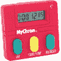](https://cdn.sparkfun.com/assets/5/2/2/6/9/52f800e4ce395f306b8b4567.jpg)

在许多教室里，标准的秒表或计时器被用来测量移动物体所用的时间，例如捕鼠器赛车、滚动的[动力推车](http://www.vernier.com/products/accessories/cart-s/)或下落的网球。

这些小秒表非常适合最简单的活动，但对于许多调查和实验来说，[人类反应时间](http://www.humanbenchmark.com/tests/reactiontime/)和课堂干扰往往会带来太多的误差和不确定性，无法收集可重复的结果，让学生从数据中得出清晰的结论。

集成光电门定时器是教师可以使用的最简单和低成本的工具之一。一个[光电门](http://www.vernier.com/products/sensors/vpg-btd/)仅仅是一个红外 [LED](https://learn.sparkfun.com/tutorials/light-emitting-diodes-leds) 和接收器对。当光栅未被阻挡时，光栅通常在 DIO0 上产生一个高信号。当物体通过门时，信号为低，直到门再次被打开。

将此与一个非常快速的计时器相结合，我们可以获得非常可靠和精确的计时结果。

[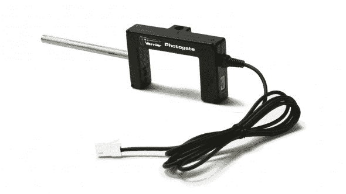](https://cdn.sparkfun.com/assets/8/4/1/a/c/52f5406bce395fde788b456b.jpg)

Arduino UNO 的时钟频率为 16 MHz。考虑到开销事件和额外需要的时钟周期等，Arduino 能够以优于+/- 1 uS 的精度计时结果。

这个代码示例是中断驱动的，并使用 [micros()](http://arduino.cc/en/Reference/Micros) arduino 命令返回自程序开始以来的微秒数。这个数字存储在一个[无符号长型](http://arduino.cc/en/Reference/UnsignedLong)变量中。这使程序在计数器结束之前有大约 1 小时 11 分钟的最大时间限制。一般来说，我们希望捕捉弹球、玩具车或扑克牌通过大门的时间。

这个草图简单地向串行监视器输出一个事件条目，包括事件号、光电门状态(阻塞或未阻塞)以及程序启动后的时间。

```
language:c
    /*
 VernierPhotogateTimer (v 2013.12.09)
 Monitors a Vernier Photogate connected to BTD connector. 

 This sketch lists the time in microseconds since the program started running.

 To ensure the greatest accuracy, this code is written using interrupts.
 For more information about using interrupts, see: 
 http://playground.arduino.cc/Code/Interrupts

 For more details around using Arduino with Vernier see 
 www.vernier.com/arduino. 

 Modified by: B. Huang, SparkFun Electronics
 December 9, 2013

 This version incorporates a "circular" buffer of 150 elements and stores all events 
 (blocking and unblocking) of the photogate to an precision of 1 us. In addition, 
 the data is streamed to the Serial buffer and can be captured, copied, exported, 
 and analyzed in your favorite analysis tool -- Graphical Analysis, LoggerPro, Excel,
 Google Sheets, Matlab, etc...

 */
#include <SoftwareSerial.h>

// mode variable definitions
#define GATE_MODE 1
#define PULSE_MODE 2
#define PENDULUM_MODE 3

#define bufferSize 150  // Sets the size of the circular buffer for storing interrupt data events. Increasing this may cause erratic behavior of the code.
#define DELIM '\t'   // this is the data delimitter. Default setting is a tab character ("\t") 

const int baudRate = 9600;  // Baud rate for serial communications. Increase this for high data rate applications (i.e. smart pulley)

unsigned int refreshRate = 250;  // sets # of milliseconds between refreshes of LED Display

const int buttonPin = 12;   // default buttonPin on Vernier Shield
const int ledPin = 13;    // re-purposed pin 13 to tie to the Serial 7 Segment
const int photogatePin = 2; // default pin if plugged into Digital 1 on SparkFun Vernier Shield 

/* The following variables are all used and modified by the code. These should not be changed or re-named. */
int mode = 1; // sets the default mode of operation
// Mode 1 -- Gate, Mode 2 -- Pulse, Mode 3 -- Pendulum 

int lastState; 
int currTimeDigits;
unsigned long currTime; 
unsigned long timerOffset = 0; 
unsigned int displayIndex; // the current item that has been displayed to the Serial Monitor from the data buffer.
unsigned int count;  // tracks the total # of data entries 

char tempString[4];   // String buffer to store for sending to the serial 7 segment display

/* These variables are all accessed and modified by the interrupt handler "PhotogateEvent" 
Variables used by the Interrupt handler must be defined as volatile. */
volatile int photogate = HIGH;
volatile int start = 0;  // 1 == start, 0 == stop
volatile unsigned int numBlocks;
volatile unsigned long startTime;  //Time in us
volatile unsigned long stopTime;  //Time in us
volatile byte dataIndex;
volatile byte displayCount;  // stores the number of items in data Buffer to be displayed
volatile byte state[bufferSize];
volatile unsigned long time_us[bufferSize]; // Time in us

void setup() 
{
  attachInterrupt(0, photogateEvent, CHANGE); // photogate_event
  pinMode(buttonPin, INPUT_PULLUP);
  pinMode(ledPin, OUTPUT);
  Serial.begin(9600);           // set up Serial library at 9600 bps
  displayHeader();
};// end of setup

void loop ()
{ 
  // check for button press to change modes
  if (digitalRead(12) == LOW)
  {
    resetCount();

    while((digitalRead(buttonPin) == LOW)); // hold until button is released
    delay(10); // for de-bouncing
    displayHeader();
  } // if button is pressed

  if (displayCount > 0)  // only display to Serial monitor if an interrupt has added data to the data buffer.
  {
    count++;
    Serial.print(count);
    Serial.print(DELIM); //tab character
    Serial.print(state[displayIndex]);
    Serial.print(DELIM); //tab character
    Serial.print((time_us[displayIndex] - timerOffset) / 1E6, 6);  // at least 6 sig figs

    Serial.println();

    displayIndex++;
    if(displayIndex >= bufferSize)
    {
      displayIndex = 0;
    }
    displayCount--; // deduct one
  }
} // end of loop

void resetCount()
{
  dataIndex = 0;
  displayIndex = 0;
  count = 0;
  numBlocks = 0;
  start = 0;
  Serial.println();
  Serial.println("*****Reset*****");
  Serial.println();
  timerOffset = micros();

}

/*************************************************
 * photogateEvent()
 * 
 * Interrupt service routine. Handles capturing 
 * the time and saving this to memory when the 
 * photogate issues an interrupt on pin 2.
 * 
 * As it is currently written, the photogate 
 * will only work on Digital Port 1.
 *************************************************/
void photogateEvent()
{ 
  time_us[dataIndex] = micros();

  photogate = digitalRead(photogatePin);

  if (photogate == 1)  
  {
    state[dataIndex] = 0;  // reverses the result so that 1 = blocked, 0 = open
    digitalWrite(ledPin, LOW);  // turns the indicator LED off
  }
  else 
  {
    state[dataIndex] = 1;                  // normal operation is 1 = open and 0 = blocked
    digitalWrite(ledPin, HIGH);   // turns the indicator LED on
  }
  displayCount++;  // add one to "to be displayed" buffer

  dataIndex++;
  if(dataIndex >= bufferSize)
  {
    dataIndex = 0;
  }
}

/*************************************************
 * displayHeader()
 *
 * Presents the data header to Serial Monitor
 * This data is tab delimitted and can be copied 
 * and pasted directly into Excel or spreadsheet
 * / graphing program. 
 *************************************************/
void displayHeader()
{
  Serial.println("Vernier Format 2");
  Serial.println();
  Serial.print("Event");
  Serial.print(DELIM);
  Serial.print("Blocked");
  Serial.print(DELIM);
  Serial.print("Time       ");    
  Serial.println();

// Units
  Serial.print("#");
  Serial.print(DELIM);
  Serial.print("(n/a)");
  Serial.print(DELIM);
  Serial.print("(s)         ");    
  Serial.println();

  Serial.println("--------------------------");  
} 
```

### 数据输出格式

数据是用制表符分隔的，你可以简单地将它复制粘贴到你喜欢的数据分析程序中，如 LoggerPro、Matlab、Google Sheets 或 Excel。

```
Vernier Format 2

Event    Blocked    Time       
#   (n/a)   (s)         
--------------------------
1   1   1.885308
2   0   1.903900
3   1   1.908432
4   0   1.927056
5   1   1.945756
6   0   1.964332
7   1   1.980148
8   0   1.996724 
```

### 传感器校准和验证-下降栅栏

倒下的栅栏是许多物理课上使用的经典活动。它扩展并结合了[平均速度](http://hyperphysics.phy-astr.gsu.edu/hbase/vel2.html)到[瞬时速度](http://www.physicsclassroom.com/mmedia/kinema/trip.cfm)的概念，探索匀加速和重力加速度的本质。

尖桩栅栏只不过是一块透明的塑料，上面有间隔 5 厘米(中心到中心)的不透明栅栏。

[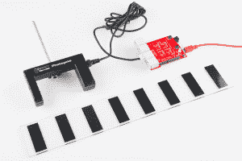](https://cdn.sparkfun.com/assets/8/e/f/d/b/52f55c0dce395fbf2d8b4569.jpg)

在地球表面附近扔下一个尖桩栅栏，应该会以 9.8 米/秒/秒的速度匀速加速，我用这个来验证和检查计时的准确性。我使用了上面的示例代码，并通过 photogate 设置了一个栅栏，下面是它返回的数据:

```
Vernier Format 2

Event   Blocked    Time       
#   (n/a)   (s)         
--------------------------
1   1   5.520980
2   0   5.542184
3   1   5.570784
4   0   5.584924
5   1   5.605876
6   0   5.617208
7   1   5.635028
8   0   5.644568
9   1   5.659904
10  0   5.668612
11  1   5.682448
12  0   5.690280
13  1   5.702860
14  0   5.710160
15  1   5.721872
16  0   5.728644 
```

很明显，加速度是 9.8 米/秒，对吗？

好吧，你是对的。它就像泥浆一样清澈。这只是一堆数字，但如果你仔细观察，你会发现事件之间的时间似乎越来越短。啊，哈！它在加速！这是个好兆头。

未经处理的原始数据很难理解，所以我创建了一个示例[工作表](https://docs.google.com/a/sparkfun.com/spreadsheet/ccc?key=0Ap4yDj7uEDKhdG1WT095R1dQWGRrNFRucnJNVGF0b0E&usp=drive_web#gid=0)，它可以在任何类中使用。该工作表计算阻塞事件之间的平均速度。

[https://docs.google.com/spreadsheet/pub?key=0Ap4yDj7uEDKhdG1WT095R1dQWGRrNFRucnJNVGF0b0E&single=true&gid=0&output=html&widget=true](https://docs.google.com/spreadsheet/pub?key=0Ap4yDj7uEDKhdG1WT095R1dQWGRrNFRucnJNVGF0b0E&single=true&gid=0&output=html&widget=true)

使用工作表，我绘制了速度与时间的关系，并找到了斜率。

| 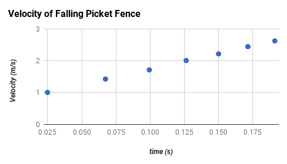 | 数据统计
斜率:9.78799 米/秒
截距:0.758978 米/秒
 |

对不对？嗯，我尽量避免在科学上做出正确或错误的判断。这只是简单的数据，我能说的是，它*似乎*与我们对宇宙的现有假设和观察一致。

### 你能用 photogates 做的其他事情？

查看[游标光电门定时器项目教程](https://learn.sparkfun.com/tutorials/vernier-photogate/introduction)。

## 示例 3 -运动检测器

Vernier 的[运动检测器](http://www.vernier.com/products/sensors/motion-detectors/md-btd/)传感器是教室里最常用的传感器之一。它使用了一种类似于老式自动聚焦宝丽来相机中使用的[超声波传感器。](https://cdn.sparkfun.com/assets/f/3/8/5/e/52f8e66dce395f1f638b4567.pdf)

结合绘图实用程序，它允许学生立即看到位置如何随时间变化，以及该图形的斜率如何与速度和加速度等量相关。

[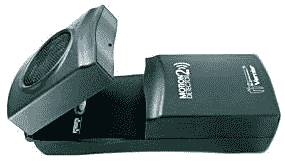](https://cdn.sparkfun.com/assets/c/8/0/0/7/52f8c890ce395f22248b4567.jpg)

运动探测器使用[回声定位](http://en.wikipedia.org/wiki/Acoustic_location)或声纳来确定传感器前方物体的距离。它的工作原理是发射一个超声波脉冲，然后监听物体反射的脉冲回波。游标运动检测器为此使用两个引脚:

```
Init (Pin 2 on the BTD connector)
Echo (Pin 1 on the BTD connector) 
```

在游标屏蔽上，我们将这些引脚连接到:

|  | 数字 1 | 数字 2 |  |
| **初始化** | four | eight | 发送超声波脉冲的触发引脚。 |
| **回声** | three | seven | 监听此引脚的回声返回/反射。 |

使用 Arduino 函数 [micros](http://arduino.cc/en/reference/micros) ，我们可以捕捉到 1 us 精度的回声时间。如果我们假设声音以大约 340 米/秒的速度传播，这意味着往返精度优于 1 毫米。

因为我们知道声音在均匀介质中以恒定速度传播，所以我们可以使用简单的运动学来确定反射声音传播的距离。在我们的代码中，我们假设声速名义上为 340 米/秒。如果您愿意考虑温度差异，hyperphysics 有一个很棒的[工具](http://hyperphysics.phy-astr.gsu.edu/hbase/sound/souspe.html)来计算和调整温度差异。

[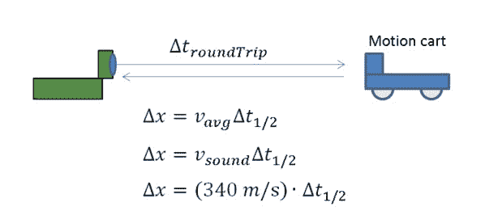](https://cdn.sparkfun.com/assets/b/8/e/c/d/52f920efce395fba148b456a.jpg)

### 代码示例

以下代码示例改编自 Vernier [github 库](https://github.com/VernierSoftwareTechnology/arduino)。该草图将以每秒 20 个样本的数据速率记录 5 秒钟。代码开头声明了两个变量来控制这两个参数。

将此文件上传到 Arduino 后，打开一个串行监视器并按下按钮(D12)开始数据收集。数据将显示在串行监视器上。您可以将其复制粘贴到 Excel、Matlab 或 LoggerPro 中进行分析。或者，你使用类似 [SerialChart](https://code.google.com/p/serialchart/) 、 [MakerPlot](http://www.makerplot.com/) 的串行绘图程序，或者在[加工](http://www.processing.org)中编写自己的程序。

```
language:c
    /* 
 VernierMotionDetector.ino
===========================
 Modified from Vernier example code: VernierMotionDetector (v 2013.11)
 Takes data from a Vernier Motion Detector connected to BTD connector on 
 SparkFun Vernier Interface Shield.

 This sketch measures the time taken for the ultrasound to return (in microseconds)
 and then calculates the corresponding distance (based on the speed of ultrasound
 in air) and displays the distance (in cm) on the Serial Monitor. 

 The data is displayed to the serial monitor as a tab delimitted format. Change the 
 delimiter variable to a comma ',' for Comma-Separated-Value (CSV) format.

 Here is how the Vernier Motion Detector works:
 - when the INIT pin (Arduino Pin 3 or 7) is pulled high, this triggers the 
 ultrasound pulse
 - program then starts timing but then delays 0.882 ms (blanking time),
 0.882 ms is the time it takes ultrasound to travel 15 cm twice (round trip))
 assuming a speed of 340 m/s
 - the program then monitors ECHO pin (Arduino Pin 2 or 6), waiting for it to '
 go high. This happens when an echo is detected.

 Modifications by B. Huang (Feb 2014)
 -------------------------
 Removed the use of delays in the loop() function. Uses a timeRef variable
 Added a variable called dataRate. dataRate describes the # of samples per second.
 Added a variable called duration. duration sets the time duration for data collection 

 See www.vernier.com/arduino for more information.
 */
#define speedOfSound 340 // speed of sound in m/s

int dataRate = 20;        // set # of samples per second.
int duration = 5000;      // set the data collection duration in milliseconds
                          // default value is set to 5 seconds or 5000 milliseconds
const char delimiter = '\t';

const int triggerPin = 3; // trigger (INIT) pin -> pin 3 for Dig 1, pin 7 for Dig 2
const int echoPin = 2;    // echo pin -----------> pin 2 for Dig 1, pin 6 for Dig 2
const int buttonPin = 12; // button pin on Vernier Shield. Use this to start data collection
const int ledPin = 13;    // led pin on Vernier Shield

// Variables used in the code for calculations
unsigned long currTime;    // reference for starting time
unsigned long timeRef;    // reference for starting time
unsigned long echoTime;   // time it take echo to return
unsigned int timeOut;     // used to calculate the "time-out" if an echo is not detected
float distance;           // distance in meters

unsigned long timeInterval;
unsigned long ndx;        // index for data counter

void setup() 
{
  // initialize the Ping pin as an output:
  pinMode(triggerPin, OUTPUT);
  pinMode(ledPin, OUTPUT);
  pinMode(echoPin, INPUT); //this is the pin that goes high when an echo is received
  pinMode(buttonPin, INPUT_PULLUP);

  timeInterval = 1000000 / dataRate;
  timeOut = 12000000/speedOfSound; // calculation of roundtrip timeOut 6 meters * 2 at 340 m/s

  Serial.begin(9600);   // initialize serial communication at 9600 bits per second:
  Serial.println();
  Serial.println("**************************************************");
  Serial.println("Hit the D12 button to start collection");
  Serial.println("Use reset button to reset / stop data collection.");
  Serial.println("**************************************************");
  while(digitalRead(buttonPin) == HIGH)
  {
    // holding loop until the button goes low.
  }
  Serial.println("Vernier Format 2");
  Serial.println("Motion Detector Readings taken using Ardunio");
  Serial.println("Data Set");
  Serial.print("Time");
  Serial.print("\t"); //tab character
  Serial.println ("Distance"); //change to match sensor
  Serial.print("seconds");
  Serial.print("\t"); // tab character
  Serial.println ("meters"); //change to match sensor
  timeRef = micros();  
  digitalWrite(ledPin, HIGH); // turn on LED 13 when taking data.
}

void loop() 
{
  if ((micros() - timeRef)/1000 <= (duration))     // controls the duration of the data collection
  {
    if ((micros()) >= ndx*timeInterval + timeRef)  // controls so only runs once per timeInterval
    {
      ndx++;
      sendPulse();

      while ((digitalRead(echoPin) == LOW) && ((micros() - currTime) < timeOut))  // waits for the echo or 35.29 ms time-out. 
      {
        // empty holding loop -- holds until an echo is heard or 35.29 ms passes
        // 35.29 ms is the time for an echo to bounce from a distance of 6 meters away
      }

      echoTime = (micros() - currTime) / 2;
      /* The speed of sound is 340 m/s.
       The ultrasound travels out and back, so to find the distance of the
       object we take half of the distance traveled.*/

      distance = (float) (speedOfSound * echoTime) / (1000000) ; // x = v_avg * t
      // factor of 1000000 converts from micros to seconds

      Serial.print((currTime - timeRef) / 1E6, 3);  // prints time
      Serial.print(delimiter);                  // delimitter character
      Serial.println(distance, 3);              // prints distance with 3 decimal places
    }
  }
  else
  {
    digitalWrite(ledPin, LOW);
    while(digitalRead(buttonPin) == HIGH)
    {
      // holding loop until the button goes low.
    }
    // reset counters and timeRef
    digitalWrite(ledPin, HIGH);
    ndx = 0;
    timeRef = micros();
  }
}

void sendPulse()
// function to trigger the ultrasonic transducer. A high signal on the triggerPin sends an ultrasonic pulse
{
  digitalWrite(triggerPin, LOW);
  //delayMicroseconds(4000);      // Vernier has a 4 ms delay in their code. This interferes with the timing
                                  // removing this line of code does not appear to affect the performance.
  digitalWrite(triggerPin, HIGH); // start the ultrasound. Occurs on rising edge of the INIT pin.
  currTime = micros(); //note time
  delayMicroseconds(882);         // delay during the blanking time
} 
```

## 示例 4 -温度探针

[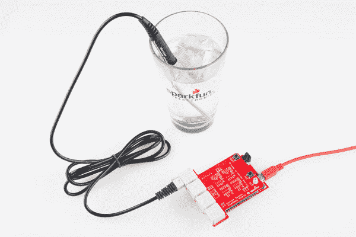](https://cdn.sparkfun.com/assets/1/0/3/8/5/52f57b2cce395f3a1a8b4567.jpg)

测量温度是一个几乎跨越科学和工程各个领域的量(也许除了计算机科学)。Vernier 出售一种很棒的[不锈钢温度探头](http://www.vernier.com/products/sensors/temperature-sensors/tmp-bta)，其精度范围为-40 摄氏度至+135 摄氏度。根据他们的网站，该传感器在损坏之前可以承受高达 150 摄氏度的温度。对我们美国人来说，这大约是华氏 300 度。在烤箱里用作肉类温度计不太安全，但它涵盖了大多数科学解释的相当广泛的范围。

探头有一个叫做[热敏电阻](https://www.sparkfun.com/products/250)的装置，其电阻随温度变化。游标探头使用 20kω[NTC(负温度系数)热敏电阻](http://en.wikipedia.org/wiki/Thermistor#NTC)。随着温度的升高，电阻下降。

电阻与温度的关系是非线性的，相当复杂，但可以用施泰因哈特-哈特方程近似计算:

[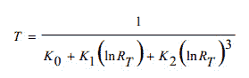](https://cdn.sparkfun.com/assets/9/2/c/c/b/52f57bc3ce395f50178b456a.jpg)

其中，R [T] 为热敏电阻的阻值，k0、k1、k2 为器件的唯一常数。对于游标传感器:

```
k0 = 1.02119E-3
k1 = 2.22468E-4 
k2 = 1.33342E-7 
```

您可以编写自己的函数，将模拟读数从 Arduino 转换为电阻。

示意图:

[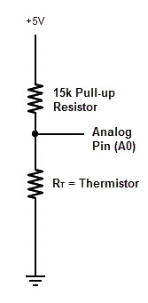](https://cdn.sparkfun.com/assets/9/6/6/0/5/52f81bebce395f3a508b456b.jpg)

游标接口屏蔽在 V [res] 上有一个 15k 的上拉电阻。我们可以确定热敏电阻的电阻，因为这是一个简单的分压电路:

[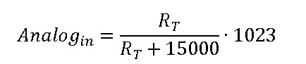](https://cdn.sparkfun.com/assets/c/d/a/d/d/52f81f3ace395f85548b4567.jpg)

这是功和代数的推导:

[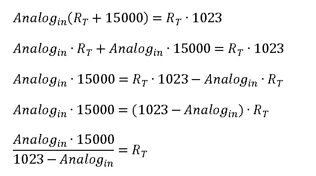](https://cdn.sparkfun.com/assets/2/d/3/b/e/52f81f9dce395f2a568b4568.jpg)

### 示例代码

以下示例将收集数据并将其显示到串行监视器上。将这个示例草图上传到 Arduino 后，打开一个串行监视器来查看数据。

这个示例代码将以每秒 2 个样本的速率进行测量。修改变量 *dataRate* 以调整采样速度。

这段代码有一个名为 *resistance()* 的函数，它将原始模拟读数转换为热敏电阻的电阻值，还有一个名为*steinhartharthart()*的函数，它应用施泰因哈特-哈特方程并返回以摄氏度为单位的温度。

```
language:c
    /*
VernierThermistor (v 2013.11)
 Reads the temperature from a Vernier Stainless Steel Temperature Probe (TMP-BTA)
 or Surface Temperature Sensor (STS-BTA) connected to the BTA connector. 
 As written, the readings will be displayed every half second. Change the variable 
 TimeBetweenReadings to change the rate.

 We use the Steinhart-Hart equation (in the function Thermistor) to determine temperature 
 from the raw A/D converter reading. Because of the use of log functions, in the Steinhart-Hart 
 equation, this sketch requires the math.h library. 

 See www.vernier.com/engineering/stem/sensors/temperature-sensor/
 for more information on how thermistors are read.

 Modifications by B. Huang (Feb 2014)
 -------------------------
 Removed the use of delays in the loop() function. Uses a timeRef variable
 Added a variable called dataRate. dataRate describes the # of samples per second.
 Added separate functions for calculating the resistance of the thermistor and then applying the
 Steinhart-hart equation.

 See www.vernier.com/arduino for more information.
 */

float dataRate = 2;             // set # of samples per second.
const char delimiter = '\t';  // delimitter character

const int ThermistorPIN = A0; // A0 for Analog1 and A2 for Analog 2
float Temp;
int rawAnalogReading;

// Variables used in the code for calculations
unsigned long timeRef;    // reference for starting time

unsigned long timeInterval;
unsigned long ndx;        // index for data counter
unsigned long thermistor;

void setup() 
{
  Serial.begin(9600);
  Serial.println("Vernier Format 2");
  Serial.println("Temperature Readings taken using Ardunio");
  Serial.println("Data Set");
  Serial.print("Time");
  Serial.print("\t"); //tab character
  Serial.println ("Temperature"); 
  Serial.print("seconds");
  Serial.print("\t"); // tab character
  Serial.println ("degrees C"); 
  timeInterval = 1000 / dataRate;  // calculates the timeInterval based on # of samples per second.
  timeRef = millis();
}

void loop() 
{
  if ((millis()) >= ndx*timeInterval + timeRef)  // controls so only runs once per timeInterval
  {
    ndx++;  
    //the print below does the division first to avoid overflows
    Serial.print((float)(millis() - timeRef) / 1000, 2); 
    rawAnalogReading = analogRead(ThermistorPIN);  // reads raw analog value from Arduino
    thermistor = resistance(rawAnalogReading);     // converts raw analog value to a resistance
    Temp = steinharthart(thermistor);              // Applies the Steinhart-hart equation

    Serial.print(delimiter); //tab character
    Serial.println(Temp,1);   // display temperature to one digit                                
  }
}
unsigned long resistance(unsigned long rawAnalogInput)
/* function to convert the raw Analog Input reading to a resistance value    
 * Schematic:
 *   [Ground] -- [thermistor] -------- | -- [15,000 ohm bridge resistor] --[Vcc (5v)]
 *                                     |
 *                                Analog Pin 0
 *
 * For the circuit above:
 * Resistance = ((rawAnalogInput*15000) /(1023 - rawAnalogInput))
 */
{
  unsigned long temp;  // temporary variable to store calculations in
  temp = (rawAnalogInput * 15000) / (1023 - rawAnalogInput);
  return temp; // returns the value calculated to the calling function.
}

float steinharthart(unsigned long resistance)
// function users steinhart-hart equation to return a temperature in degrees celsius. 
/* Inputs ADC count from Thermistor and outputs Temperature in Celsius
 * There is a huge amount of information on the web about using thermistors with the Arduino.
 * Here we are concerned about using the Vernier Stainless Steel Temperature Probe TMP-BTA and the 
 * Vernier Surface Temperature Probe STS-BTA, but the general principles are easy to extend to other
 * thermistors.
 * This version utilizes the Steinhart-Hart Thermistor Equation:
 *    Temperature in Kelvin = 1 / {A + B[ln(R)] + C[ln(R)]^3}
 *   for the themistor in the Vernier TMP-BTA probe:
 *    A =0.00102119 , B = 0.000222468 and C = 1.33342E-7
 *    Using these values should get agreement within 1 degree C to the same probe used with one
 *    of the Vernier interfaces
 * 
 */
{
  float temp; // temporary variable to store calculations in
  float logRes = log(resistance); 
  // calculating logirithms is time consuming for a microcontroller - so we just
  // do this once and store it to a variable.
  float k0 = 0.00102119;
  float k1 = 0.000222468;
  float k2 = 0.000000133342; 

  temp = 1 / (k0 + k1 * logRes + k2 * logRes*logRes*logRes);
  temp = temp - 273.15;  // convert from Kelvin to Celsius 
  return temp;
} 
```

有关热敏电阻的更多信息，请查看 Vernier 关于进行[温度测量](http://www.vernier.com/engineering/arduino/analog-sensors/thermistors/)的资源

## 连接外部显示器

添加外部显示器大大增强了独立于计算机的游标传感器的接口能力。Arduino 可以由几节 AA 电池供电，添加 LCD 显示器将允许您向用户提供即时反馈。

### 你需要什么

*   [凸形分离集管](https://www.sparkfun.com/products/116)
*   [母接头脱离头](https://www.sparkfun.com/products/115)
*   [串口液晶](https://www.sparkfun.com/products/9396)或[串口七段](https://www.sparkfun.com/products/11442)
*   连接钢丝- [6 "米/英尺](https://www.sparkfun.com/products/9140)或 [12 "米/英尺](https://www.sparkfun.com/products/9385)

### 推荐阅读/有用资源

*   [串行 LCD 快速入门指南](https://www.sparkfun.com/tutorials/246)
*   [串行 7 段显示器连接导轨](https://learn.sparkfun.com/tutorials/using-the-serial-7-segment-display/introduction)
*   [什么是串行通信？](https://learn.sparkfun.com/tutorials/serial-communication)

### 入门指南

你需要焊接在公脱离头，以访问引脚 D0 和 D1。这些将用于向您的串行显示设备传输/发送数据。您还需要将接头添加到电源引脚(5V 和 GND)。不过，我们建议使用母头。暴露电源和 GND 会产生短路的风险。值得庆幸的是，Arduino 有一个 [PTC 可复位保险丝](http://en.wikipedia.org/wiki/Resettable_fuse)，可以保护你的电脑和 Arduino 免受这种影响，但还是应该避免使用。

示例代码将根据您使用的串行设备而有所不同。您需要将电源(5V)、GND 和游标屏蔽上的传输(引脚 1)连接到您的串行显示设备。记住:TX 线应该接到串行设备的 RX 线上。

[串行 LCD 快速入门](https://www.sparkfun.com/tutorials/246)

## 将数据存储到 SD 卡

[](https://cdn.sparkfun.com/assets/2/6/4/2/a/SD_Card_Shield.jpg)

### 你需要什么

*   [凸形分离集管](https://www.sparkfun.com/products/116)
*   [microSD 卡盾](https://www.sparkfun.com/products/9802)
*   [microSD 卡](https://www.sparkfun.com/products/11609)
*   [Arduino 可堆叠插头屏蔽引脚](https://www.sparkfun.com/products/10007)

### 推荐阅读/有用资源

*   [microSD Shield 快速入门指南](https://www.sparkfun.com/tutorials/172)
*   [安装 Arduino 库](https://learn.sparkfun.com/tutorials/installing-an-arduino-library)

给你的游标保护增加一个 SD 卡接口非常简单。使用一组可堆叠的[头]((https://www.sparkfun.com/products/10007))将 SD 卡护罩放在游标护罩下方。

把这个代码上传到你的盾牌上。如果您使用 SparkFun microSD 卡盾，它会将传感器的原始电压值记录到 microSD 卡中。如果您使用自己的 SD 卡 shield 实现，请仔细检查 chipselect 的引脚分配。在 SparkFun microSD 卡盾上，chipselect 在 8 号针上。

此代码示例将从任何提供 0 到 5V 电压的模拟游标传感器读取原始电压电平(这占了大多数传感器)。按下按钮(D12)将在变量*持续时间*定义的时间段内开始数据收集。数据被记录到名为“datalog.txt”的文件中，并显示在串行监视器上。

将`VernierSDStore`草图上传到您的 Arduino。

```
language:c
    /* 
VernierShieldSDStore (v 2014.02)
Takes data from a Vernier Motion Detector connected to BTA connector.

The data is displayed to the serial monitor and saved to a file called datalog.txt

Data is currently displayed and stored as raw voltage levels from 0 to 5V. Currently working 
integrate the AutoIDAnalog.ino code into this code so that data is automatically
calibrated. 

Only the 5V analog signal is currently being used, but you can change the code to

See www.vernier.com/arduino for more information.
*/

#include <SD.h>      // includes the Arduino SD Library 

// pin configurations for SparkFun Vernier Shield
// A1 = Analog 1
// A2 = Analog 2
#define A1_5V 0      
#define A1_10V 1
#define A2_5V 2
#define A2_10V 3

char * filename = "datalog.txt";  /* sets the filename for data - change this 
 if you want to use a different file name 
 data will be concatenated onto the existing
 file if it exists */
float dataRate = 20.0;     // # of samples per second.
int duration = 5000;       // set the data collection duration in milliseconds
// default value is set to 5 seconds or 5000 milliseconds

unsigned long timeRef;      // reference for starting time
unsigned long timeInterval;
unsigned long elapsedTime;
unsigned long ndx = 0;

const int buttonPin = 12;   // digital button on Vernier Shield - used to start data collect
const int ledPin = 13;      // LED pin on Vernier Shield

/* Global Variable declarations for SD Card Shield */
const int chipSelect = 8;
File dataFile;

// variables used with VernierAnalogAutoID
//
int muxLSB = 10; //low byte of multiplexer
int muxMSB = 11; //high byte of multiplexer

int SensorRaw[2];
float SensorVoltage[2];
float VCC = 5.0;

void setup() 
{
  // initialize serial communication at 9600 bits per second:
  Serial.begin(9600);

  // set the timeInterval based on dataRate
  timeInterval = 1E3 / dataRate;

  // initialize the buttonPin as an INPUT with a pull-up resistor
  pinMode(buttonPin, INPUT_PULLUP);
  pinMode(muxLSB, OUTPUT);
  pinMode(muxMSB, OUTPUT);

  Serial.println("*************************************************");
  Serial.println("Push button (D12) to start data collection.");
  Serial.println("Use reset button to reset / stop data collection.");
  Serial.println("*************************************************");

  while(digitalRead(buttonPin) == HIGH)
  {
    // holding loop until the button goes low.
  }

  /***********************
   * / Setup SD Card
  /***********************/
  pinMode(chipSelect, OUTPUT);

  Serial.print("Initializing SD card...");

  // see if the card is present and can be initialized:
  if (!SD.begin(chipSelect)) 
  {
    Serial.println("Card failed, or not present");
    // don't do anything more:
    return;
  }
  Serial.println("card initialized.");

  Serial.println();

  /***********************
   * / Print data header
  /***********************/
  Serial.println(" ");    
  Serial.println("Vernier Format 2");
  Serial.println("Raw Readings taken using Ardunio");
  Serial.println("Data Set");
  Serial.print("Time");

  Serial.print("\t"); //tab character
  Serial.print ("Chan1");
  Serial.print("\t"); //tab character
  Serial.print("Chan2");

  Serial.println("");      
  Serial.print("seconds");

  Serial.print("\t"); //tab character
  Serial.print ("V");
  Serial.print("\t"); //tab character
  Serial.print ("V");
  Serial.println();

  /*************************
   * / Print header to SD Card
  /*************************/

  dataFile = SD.open(filename, FILE_WRITE);
  if (dataFile) // if it opens sucessfully
  {
    dataFile.println("Vernier Format 2");
    dataFile.println("Raw Readings taken using Ardunio");
    dataFile.println("Data Set");
    dataFile.print("Time");
    // query the channel numbers

    // print sensor name -- data will be displayed in raw and voltage
    dataFile.print("\t"); //tab character
    dataFile.print("Chan1");
    dataFile.print("\t"); //tab character
    dataFile.print("Chan2");
    dataFile.println();      

    // display the units
    dataFile.print("seconds");

    dataFile.print("\t");      
    dataFile.print("V");
    dataFile.print("\t");      
    dataFile.print("V");

    dataFile.close(); // close the datafile
  }
  else  // if(datafile) -- error opening SD card
  {
    Serial.println("error opening file.");
    Serial.println();
  }

  digitalWrite(ledPin, HIGH);
  timeRef = millis();  
  ndx = 0;   // datapoint index
} // end setup

void loop() 
{
  unsigned long currTime = millis();  // record current Time
  if ((currTime - timeRef) <= (duration))     // controls the duration of the data collection
  {
    if (currTime >= ndx*timeInterval + timeRef)  // controls so only runs once per timeInterval
    {
      ndx++;
      digitalWrite(ledPin, LOW); // blink the LED off to show data being taken.

      // Read in sensor values
      SensorRaw[0] = analogRead(A1_5V);
      SensorRaw[1] = analogRead(A2_5V);

      // Convert to voltage values
      SensorVoltage[0] = SensorRaw[0]*VCC/1023.0;
      SensorVoltage[1] = SensorRaw[1]*VCC/1023.0;
/* // uncomment these lines of code to use the +/- 10V sensors
      SensorRaw[0] = analogRead(A1_10V);
      SensorRaw[1] = analogRead(A2_10V);

      // Convert to voltage values (20V range, -10V offset)
      SensorVoltage[0] = SensorRaw[0]*20.0/1023.0 - 10.0;
      SensorVoltage[1] = SensorRaw[1]*20.0/1023.0 - 10.0;

*/

      dataFile = SD.open(filename, FILE_WRITE);
      // if the file is available, write to it:
      if (dataFile)
      {
        dataFile.print((currTime - timeRef)/ 1E3, 3);  // 4 decimal places
        dataFile.print("\t");
        dataFile.println(SensorVoltage[0]);
        dataFile.print("\t");
        dataFile.println(SensorVoltage[1]);
        dataFile.close();
      }

      // if the file isn't open, pop up an error:
      else
      {
        Serial.println("Error opening file.");
      } 
      // Serial print to the serial monitor
      Serial.print((currTime - timeRef) / 1E3, 3);
      Serial.print("\t"); // tab character
      Serial.print(SensorVoltage[0]);
      Serial.print("\t");
      Serial.print(SensorVoltage[1]);
      Serial.println();  

      digitalWrite(ledPin, HIGH); // turn the LED back on to show data collection 
      // duration is still running.
    }
  }
  else  // duration is complete -- wait and reset if button is pressed
  {
    digitalWrite(ledPin, LOW);    // turn off LED to show data collection is done.
    while(digitalRead(buttonPin) == HIGH)
    {
      // holding loop until the button goes low.
    }
    // reset counters and timeRef
    digitalWrite(ledPin, HIGH);
    ndx = 0;
    timeRef = millis();

  }
} // end of loop 
```

## 资源和更进一步

我们希望这些例子能让你继续深入了解数据收集和校准的细节。Vernier 在这次合作中帮了很大的忙。他们的网站上也有丰富的资源:

*   [http://www.vernier.com/arduino](http://www.vernier.com/arduino)
*   [Vernier Arduino github 库](https://github.com/VernierSoftwareTechnology/arduino)

如果您想分享您使用游标传感器和 Arduino 所做的工作，或者您对您的主板有任何疑问或问题，请发送电子邮件至 education@sparkfun.com。