# USB 型插座连接指南

> 原文：<https://learn.sparkfun.com/tutorials/usb-type-a-female-breakout-hookup-guide>

## 介绍

如果您有一个可以充当 USB 主机的微控制器，那么您将需要一种方法来插入 USB 电缆和设备。[USB A 型母分接头](https://www.sparkfun.com/products/12700)在一端接受一个[A 型 USB 插头](http://en.wikipedia.org/wiki/USB#Host_and_Device_interface_receptacles)，并将 4 条 USB 线分接到一个标准的 0.100 英寸接头。

[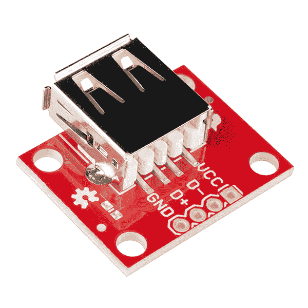](https://cdn.sparkfun.com/assets/2/a/5/8/3/52f29ce3ce395f99108b4568.jpg)*USB Type A Female Breakout*

注意:本教程使用的是 [mbed](http://mbed.org/) [LPC1768](https://www.sparkfun.com/products/9564) ，因为它有一个内置的 USB 主机。然而，分线板可以用于任何具有 USB 主机的平台。

### 本教程涵盖的内容

在本教程中，我们将使用 [mbed LPB1768](https://www.sparkfun.com/products/9564) 和[USB A 型插座](https://www.sparkfun.com/products/12700)来创建一个简单的电路，接受 USB 键盘并将按键打印到串行控制台。

### 所需材料

*   [USB A 型母分接头](https://www.sparkfun.com/products/12700)
*   [LPC1768](https://www.sparkfun.com/products/9564)
*   [凸形 PTH 接头](https://www.sparkfun.com/products/116)
*   2 个 15kΩ电阻(如果没有，则使用[10kω电阻](https://www.sparkfun.com/products/8374)
*   5x [跳线](https://www.sparkfun.com/products/11026)从试验板连接到 Arduino。
*   将所有东西连接在一起的试验板。
*   USB 键盘

### 推荐阅读

*   [如何焊接](https://learn.sparkfun.com/tutorials/how-to-solder-through-hole-soldering)
*   [如何使用试验板](https://learn.sparkfun.com/tutorials/how-to-use-a-breadboard)
*   [LPC 1768 入门](https://mbed.org/handbook/mbed-NXP-LPC1768-Getting-Started)

## 主板概述

该板是 USB 线的简单分支。

[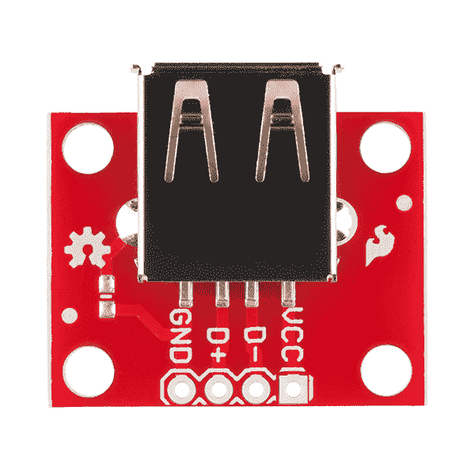](https://cdn.sparkfun.com/assets/5/d/2/2/6/52f29ce3ce395f960b8b4567.jpg)*USB Type A Female Breakout front*

**GND** 应连接到主机电路的地。

**D+** 和 **D-** 是 USB 的差分线对。它们应分别连接到主机电路的 D+和 D-。此外，每个 D+和 D-上需要一个 15kΩ下拉电阻。

**VCC** 需要连接到 5V 电源(可能来自主机电路，如果有的话)。

## 连接示例

### 装配

为了连接 USB 分线板，[将](https://learn.sparkfun.com/tutorials/how-to-solder-through-hole-soldering)[的](https://www.sparkfun.com/products/116)分线接头焊接到板上的 4 个接头孔。

[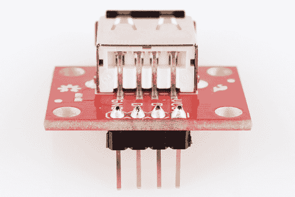](https://cdn.sparkfun.com/assets/7/7/5/e/1/52f29ce5ce395f640a8b456d.jpg)*PTH headers on the USB breakout board*

### 连接 USB 分线板

[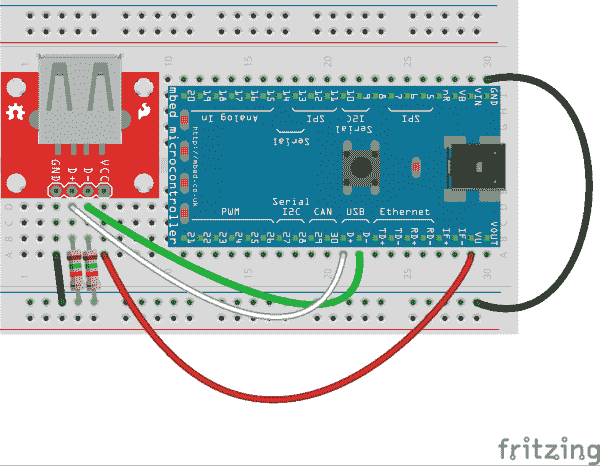](https://cdn.sparkfun.com/assets/1/3/c/e/d/52f3c319ce395f904a8b4569.png)*Basic hookup using an mbed LPC1768 and a breadboard*

对于 LPC1768，使用跳线进行以下连接:

(USB 分线点→ LPC1768)

*   VCC → VU
*   D- → D-
*   D+ → D+
*   GND → GND

此外，在 D+和 D-线上增加 2 个 15kΩ下拉电阻。将一个电阻从 D+连接到 GND，将另一个电阻从 D-连接到 GND。

[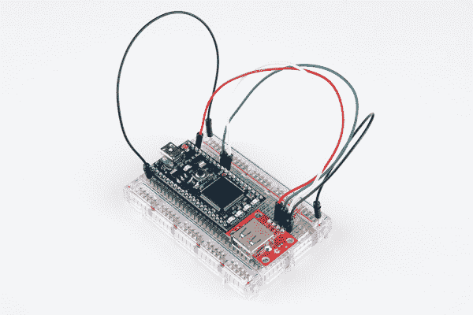](https://cdn.sparkfun.com/assets/a/c/7/6/6/52f29ce5ce395fa50a8b456b.jpg)*USB Type A Female Breakout added to the mbed LPC1768*

## 示例代码

在这个例子中，我们将使用 mbed 在线编辑器和编译器。首先，导航到[mbed.org](mbed.org)，并登录或创建一个个人资料。

[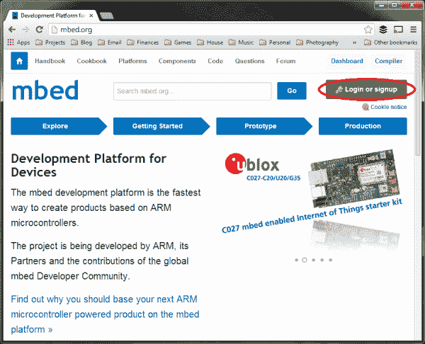](https://cdn.sparkfun.com/assets/4/8/f/d/a/52f1291bce395f7c248b4567.png)

登录后，进入[手册主页](http://mbed.org/handbook/Homepage)，其中包含所有官方 mbed 库。

[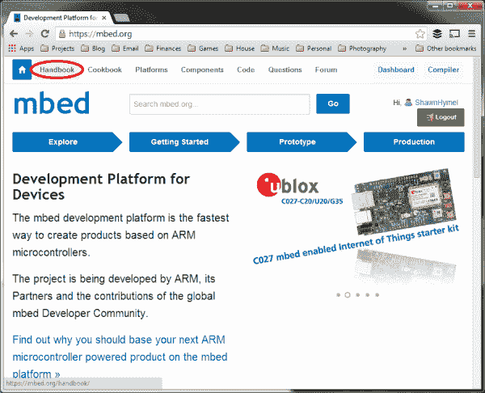](https://cdn.sparkfun.com/assets/4/d/1/f/9/52f1291ace395f46228b4568.png)

向下滚动，在“通信接口”下找到 [USB 主机键盘库](http://mbed.org/handbook/USBHostKeyboard)

[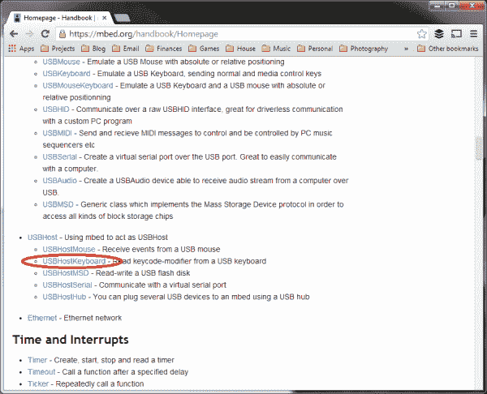](https://cdn.sparkfun.com/assets/0/7/e/2/c/52f12910ce395fac208b4568.png)

单击“导入程序”按钮，将库和示例程序加载到在线编译器中。

[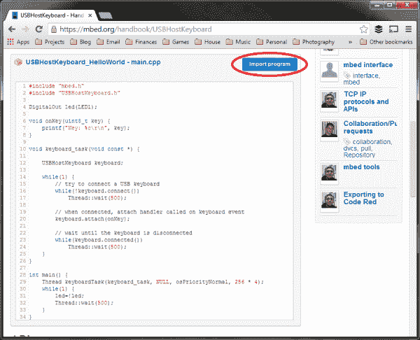](https://cdn.sparkfun.com/assets/1/5/3/0/7/52f12914ce395f88218b4567.png)

确保您从“导入为:”中选择了“程序”，因为我们希望使用示例程序(如果您计划使用库编写自己的程序，请选择“库”)。

[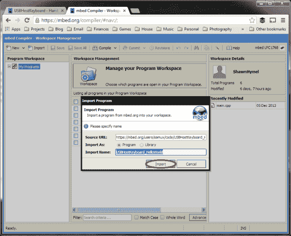](https://cdn.sparkfun.com/assets/9/0/b/b/3/52f128fece395fae208b4567.png)

在“程序工作区”中，选择“USBHostKeyboard_HelloWorld”文件夹，然后单击顶部的“编译”。这将自动编译程序并下载一个二进制文件(。bin 文件)复制到您的计算机上。

[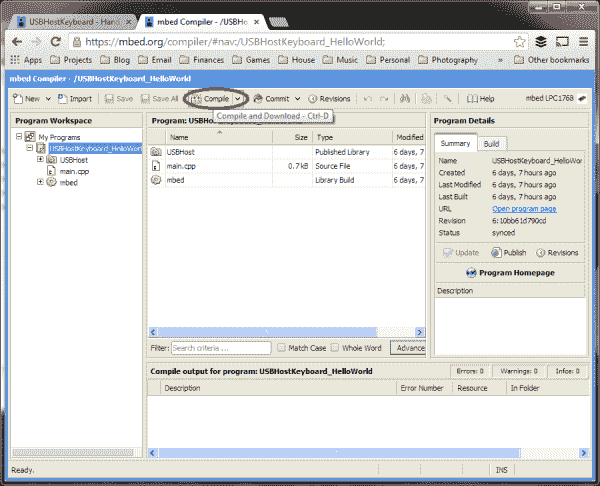](https://cdn.sparkfun.com/assets/d/9/d/5/8/52f1291ace395f2c218b4567.png)

使用 USB 电缆将 mbed 微控制器插入您的计算机。mbed 应作为 USB 大容量存储设备进行枚举。如果您使用的是 Windows，看起来就像您插入了一个 u 盘。

找到下载编译好的。bin 文件，并将其复制到 mbed 设备的根目录。

[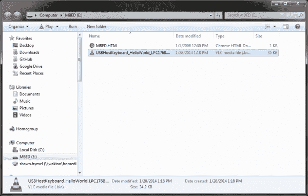](https://cdn.sparkfun.com/assets/0/4/c/9/8/52f12910ce395fc4228b4567.png)

按下 mbed 系统上的重置按钮。这将重新启动 mbed 并加载。要立即执行的 bin 文件。

除了作为大容量存储设备进行枚举之外，mbed 还具有内置的 COM 端口。如果您使用的是 Windows，请打开设备管理器并找到 mbed 串行端口的 COM 号。

[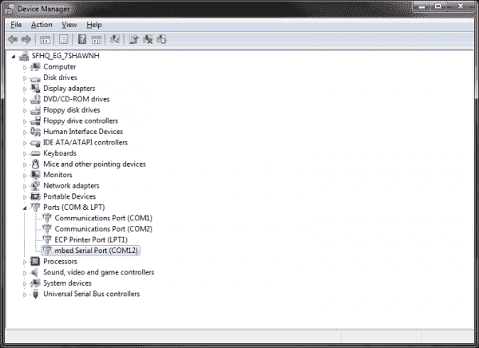](https://cdn.sparkfun.com/assets/2/f/b/4/f/52f128fece395fa7218b4567.png)

启动您选择的串行程序(在本例中，我将使用 [PuTTY](http://www.chiark.greenend.org.uk/~sgtatham/putty/download.html) ),并选择对应于 mbed 设备的 COM 端口。使用 9600 波特，然后点按“打开”

[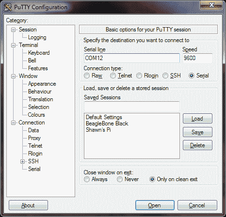](https://cdn.sparkfun.com/assets/3/a/1/0/9/52f128efce395fad208b4568.png)

一旦建立了与 mbed 的串行连接，您将看到一个空白控制台。

[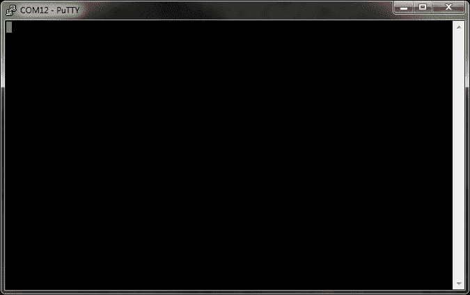](https://cdn.sparkfun.com/assets/4/6/8/2/b/52f128fece395f1d238b4567.png)

将 USB 键盘插入 USB A 型母分线板。

[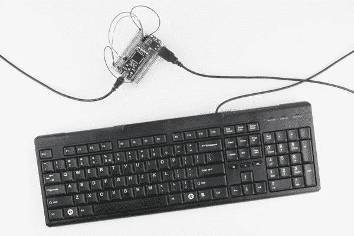](https://cdn.sparkfun.com/assets/d/4/1/2/e/52f29ce5ce395f070b8b456a.jpg)

串行控制台应该显示正在枚举的键盘。您可以键入，并且击键将出现在控制台中。如果拔下键盘，您应该会看到一条“断开连接”的消息。

**重要提示**:本示例程序只支持字母和数字。此外，该程序无法识别多次击键(例如，如果您按住“1”，按“2”，放开“2”，然后放开“1”，您将看到打印的“111”)。

[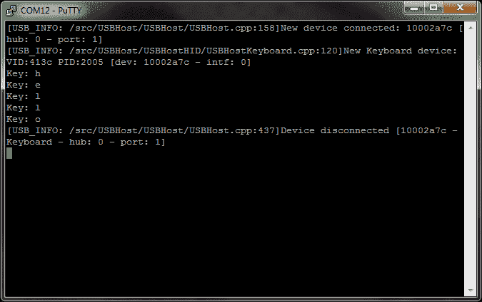](https://cdn.sparkfun.com/assets/1/5/7/0/5/52f1291bce395f6e238b4567.png)

## 资源和更进一步

假设您的微控制器可以支持 USB 主机，USB A 型插座是向您的微控制器添加 USB 设备的好方法。有关一些想法，请参见 mbed 手册中关于 [USB 主机库](http://mbed.org/handbook/USBHost)的部分:

*   [USB 主机鼠标](http://mbed.org/handbook/USBHostMouse)向您的项目添加 USB 鼠标
*   [USB 主机键盘](http://mbed.org/handbook/USBHostKeyboard)(是的，我知道我们刚刚讨论过这个)
*   [USB 主机 MSD](http://mbed.org/handbook/USBHostMSD) 读取/写入 USB 闪存驱动器
*   [USB 主机串行](http://mbed.org/handbook/USBHostSerial)通过 USB 线进行串行通信
*   [USB 主机集线器](http://mbed.org/handbook/USBHostHub)让 mbed 充当 USB 集线器

### 资源

*   [分线板示意图](https://github.com/sparkfun/USB_Type_A_Female_Breakout/blob/master/Hardware/USB_Type_A_Female_Breakout.pdf?raw=true)
*   [GitHub 库](https://github.com/sparkfun/USB_Type_A_Female_Breakout)