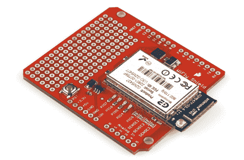
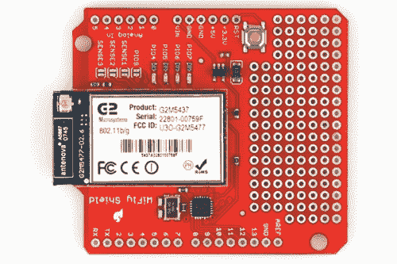
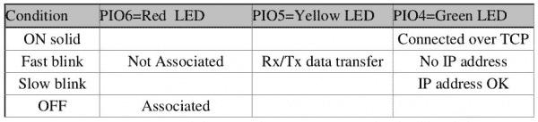
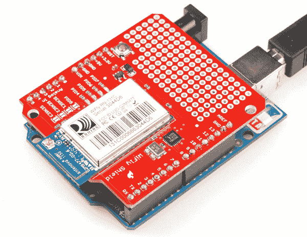
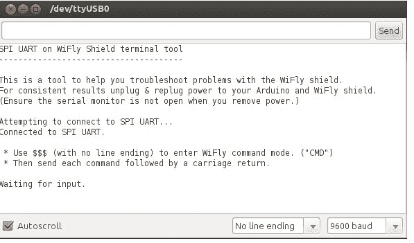
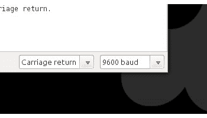
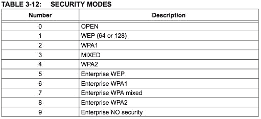
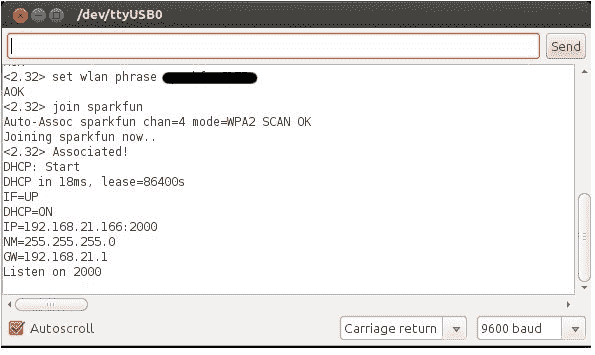
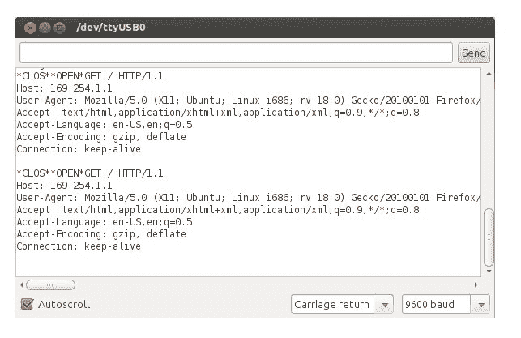

# WiFly 屏蔽连接指南

> 原文：<https://learn.sparkfun.com/tutorials/wifly-shield-hookup-guide>

## 介绍

[WiFly Shield](https://www.sparkfun.com/products/9954) 允许您轻松地将 Arduino 连接到无线网络，提供数据，充当客户端，为您的物联网设备创建点对点网络，并从您的网络获取数据和时间等数据。该连接指南将向您展示如何开始，如何配置 WiFly 模块，以及如何使用 WiFly Shield 设置一些简单的草图。

[](https://cdn.sparkfun.com/assets/9/2/a/d/8/52015a3f757b7f031f7b5446.jpg)

### 本教程涵盖的内容

本指南将向您展示:

*   如何将 WiFly 盾连接到 Arduino
*   如何通过终端与 wifi 盾通信
*   如何将 WiFi 连接到 WiFi 网络
*   网络上的简单通信
*   如何创建简单的服务器
*   如何更新 WiFly 模块上的固件

本教程中使用的所有功能和命令都可以在 RN131 文档中找到:

*   [RN131 产品页面](http://www.microchip.com/wwwproducts/Devices.aspx?dDocName=en558369)
*   [RN131 参考指南](http://ww1.microchip.com/downloads/en/DeviceDoc/50002230A.pdf)
*   [RN131 数据表]( [链接正文](http://ww1.microchip.com/downloads/en/DeviceDoc/rn-131-ds-v3.2r.pdf)
*   [SC16IS750 SPI 至 UART 桥数据表](//cdn.sparkfun.com/assets/c/f/6/9/7/511552e6ce395fbe3f000004.pdf)

### 推荐阅读

如果您是电子或无线通信的新手，您可能还想先了解一下其他概念:

*   [安装 Arduino 库](https://learn.sparkfun.com/tutorials/installing-an-arduino-library)
*   [什么是盾牌？](https://learn.sparkfun.com/tutorials/arduino-shields)
*   [串行通信](https://learn.sparkfun.com/tutorials/serial-communication)
*   [SPI 通信](https://learn.sparkfun.com/tutorials/serial-peripheral-interface-spi)
*   [串行终端基础知识](https://learn.sparkfun.com/tutorials/terminal-basics)
*   [如何焊接](https://learn.sparkfun.com/tutorials/how-to-solder-through-hole-soldering)

您还应该对简单的网络术语有基本的了解，例如:

*   [802.11](http://en.wikipedia.org/wiki/IEEE_802.11)
*   [TCP/IP](http://en.wikipedia.org/wiki/Internet_protocol_suite)
*   [FTP](http://en.wikipedia.org/wiki/Ftp)
*   [远程登录](http://en.wikipedia.org/wiki/Telnet)
*   [宋承宪](http://en.wikipedia.org/wiki/Secure_Shell)
*   [HTTP](http://en.wikipedia.org/wiki/Http)
*   [DNS](http://en.wikipedia.org/wiki/Dns)
*   [DHCP](http://en.wikipedia.org/wiki/Dhcp)
*   [无线局域网](http://en.wikipedia.org/wiki/Wlan)

## 硬件概述

[](https://cdn.sparkfun.com/assets/5/c/1/f/1/52015b36757b7f541c5f5dbd.jpg)

[妻子护罩](https://www.sparkfun.com/products/9954)由两个主要部件组成:

*   一个 [SC16IS750 SPI 至 UART 桥接芯片](http://www.sparkfun.com/datasheets/Components/SMD/SC16IS740_750_760.pdf)
*   一个 RN-131C 无线模块

WiFly 模块通过其 UART 与 SC16IS750 桥接芯片通信，后者又通过 SPI 与 Arduino 通信。

[](//cdn.sparkfun.com/assets/d/c/6/f/2/51154f35ce395f6540000004.png)

这使得 wifi 模块能够在不使用 Arduino 的 UART 的情况下与 Arduino 高速通信，因此 Arduino 仍然可以与串行终端通信。从 WiFly 到 Arduino 的任何通信(反之亦然)都必须通过 SC16IS50 发送。

WiFly 模块通过其 I/O 引脚连接到四个指示灯 led。根据模块的状态，这些指示灯将以不同的频率闪烁。它们可以向用户提供大量关于模块状态的信息，而无需用户将设备连接到串行终端。有关 led 行为的更多信息，请参见 [RN-131 参考指南](http://ww1.microchip.com/downloads/en/DeviceDoc/50002230A.pdf)。

[](//cdn.sparkfun.com/assets/3/a/4/a/b/511524c9ce395f2240000002.jpg)

WiFly 模块也连接到四个跳线。跳线 PIO9 是一种特殊的跳线，用于将模块置于临时模式。如果您想以特别的方式从计算机直接与 wifi 通信，用焊料短接 PIO9 跳线。

最后，WiFly 有一个小的原型制作区域，可以连接你想要的任何其他组件。你可以添加额外的发光二极管，传感器，电机，或其他位，使您的项目活起来。

### 无线分线板

你也可以使用本教程中的信息来使用[wifi GSX 突破](https://www.sparkfun.com/products/10050)。然而，由于分线板不包括 SPI-to-UART IC，您将不得不使用[独立转换芯片](https://www.sparkfun.com/products/9981)或通过 UART 直接与 WiFly 模块通信。请记住，如果您使用 Arduino 的 UART 与模块通信，您将无法向终端窗口发回响应，除非您使用单独的 UART(Arduino mega 有几个 UART，或者您可以在 Uno 上使用软件串行库)。

## 将 WiFly 屏蔽连接到 Arduino

### 你需要什么

要安装 WiFly Shield 并联网，您需要以下物品:

*   [妻子的盾牌](https://www.sparkfun.com/products/9954)
*   [Arduino UNO](https://www.sparkfun.com/products/11021?) 或[类似的 Arduino 兼容板卡](https://learn.sparkfun.com/tutorials/arduino-comparison-guide)
*   [可堆叠接头](https://www.sparkfun.com/products/10007)或其他方式将屏蔽连接到 Arduino
*   [USB A-to-B 电缆](https://www.sparkfun.com/products/512)或 Arduino 板需要的任何 USB 电缆
*   一台电脑
*   WiFi 接入点

### 装配

将 WiFly Shield 连接到 Arduino 非常简单。焊接接头，并将屏蔽层连接到 Arduino 板上。你可以使用[公接头](https://www.sparkfun.com/products/116)或[可堆叠接头](https://www.sparkfun.com/search/results?term=stackable+headers&what=products)，这取决于你打算如何使用你的妻子。有关如何将接头连接到 WiFly shield 的详细说明，请参见 [Arduino Shields 教程](https://learn.sparkfun.com/tutorials/arduino-shields/installing-headers-preparation)。

[](https://cdn.sparkfun.com/assets/2/3/c/5/1/5201615a757b7f3f2066205b.jpg)*WiFly Shield with standard [strait male headers](https://www.sparkfun.com/products/116).*

接下来，通过 USB 电缆将 Arduino 连接到电脑。WiFly shield 上的一些 led 现在应该在闪烁。您应该看到黄色指示灯快速闪烁，绿色指示灯缓慢闪烁。这表示 WiFly 对新连接开放。

## WiFly 库和终端草图

### WiFly 屏蔽库

为了帮助 WiFly shield 的使用，一些作者已经贡献了一个 WiFly 库。它已经经历了几次迭代，尽管它并不完美，但它允许最终用户轻松地启动并运行 WiFly。

与 WiFly Shield 的交互将通过 Arduino 串行监视器或您选择的终端程序来完成。为了做到这一点，我们需要一个来自 WiFly Shield github 页面的名为 SpiUartTerminal 的示例草图。使用以下步骤在 Arduino 环境中安装库和草图。

1.  从 [WiFly Shield github 页面](https://github.com/sparkfun/WiFly-Shield)下载库代码作为 zip 文件。
2.  将下载的文件解压缩到.../arduino/库/文件夹
3.  将解压后的文件夹重命名为“WiFly”。必须这样做，因为 Arduino 环境不接受带破折号的库文件夹名称。
4.  启动 Arduino IDE(如果已打开，则重新启动)。

### 终端草图

安装完库后，导航到示例草图

文件->示例-> wify shield-> spiuarterminal

将草图加载到 Arduino IDE 中。该草图允许用户通过 Arduino 串行监视器或任何其他终端仿真器直接与 WiFly Shield 通信。

将草图上传到 Arduino 板上，并打开 Arduino 串行监视器(或您选择的终端仿真器)。确保波特率设置为 9600，8-N-1-无。

[](//cdn.sparkfun.com/assets/b/f/e/d/8/51152676ce395f633f000002.jpg)

Arduino 现在应该会打印出一个信息菜单，上面有如何使用草图的说明。我们现在准备好配置 WiFly 以连接到网络。

请注意，当你使用你的妻子之盾时，你将需要大量使用这个草图。每当本教程提到与 WiFly 模块对话时，假设它是指使用这个草图来这样做。

### 解决纷争

*   如果您在使用 WiFly Shield 时遇到问题，请确保您使用的是 GitHub 最新版本的库。Arduino IDE 在不断发展，有时最新版本可能无法与现有的库兼容。如果您无法让 WiFly shield 与最新版本的 Arduino IDE 一起工作，您可能需要恢复到旧版本的 IDE。如果您使用的是 Arduino 0023 或更早版本，您将需要使用该库的[Arduino 1.0 之前的版本](https://cdn.sparkfun.com/assets/5/0/a/5/0/52f00ca8ce395f82558b4568.zip)。

*   如果在使用终端草图时，您看到的数据看起来基本正确，但在某些地方却很混乱，那么问题很可能与没有将正确的库与正确的 IDE 版本相匹配有关。

## 连接到网络

WiFly 模块通过其 UART 发送命令进行配置。为此，用户必须首先将模块置于命令模式。有关配置命令的完整列表，请参见 [RN-131 参考指南](http://ww1.microchip.com/downloads/en/DeviceDoc/50002230A.pdf)。

首先，通过键入以下命令将模块置于命令模式

```
$$$ 
```

进入 Arduino 串行监视器并按 enter。(当您键入$$$时，请确保串行监视器设置为**“无行尾”**)。模块将以字母“CMD”响应，表示其处于命令模式。从现在开始，我们发送的命令必须以回车结束，所以在波特率菜单旁边的下拉菜单中，选择**“回车”**。这将确保串行监视器在您在“发送”框中键入每个命令后发送一个回车。

[](//cdn.sparkfun.com/assets/4/0/c/b/c/51152752ce395fbb4f000000.jpg)

接下来，我们需要扫描 wifi 网络。为此，请键入以下命令

```
scan 
```

如果您已经知道无线网络的凭据，可以跳过此步骤。wifi 模块将扫描任何网络，并将结果打印到终端。我们关心标有“SSID”和“Sec”的列。它们分别是接入点的名称和接入点的安全协议。我们需要他们配置 wifi 来连接到接入点。

此时，我们需要告诉妻子使用什么安全协议。安全协议的设定值在第 65 页的 [RN131 参考指南](http://ww1.microchip.com/downloads/en/DeviceDoc/50002230A.pdf)中列出。

[](https://cdn.sparkfun.com/assets/3/5/e/8/d/52f13d15ce395ff8328b4567.jpg)

找到与接入点安全协议相对应的值。然后，在串行监视器中，发送命令

```
set wlan auth <value> 
```

其中\ <value>是对应于接入点安全协议的编号。这告诉 WiFly 在连接时使用该安全协议。</value>

如果你的接入点使用安全协议，你需要告诉妻子你的密码。为此，发送命令

```
set wlan phrase <passphrase> 
```

其中\ <passphrase>是连接到接入点的密码。</passphrase>

现在我们的模块应该配置好了，可以连接到接入点了。通过发送命令告诉它加入

```
join <ssid> 
```

其中\ <ssid>是您在扫描过程中找到的接入点的名称。WiFly 模块现在应该可以连接并打印出您的连接信息，比如 IP 地址。</ssid>

[](//cdn.sparkfun.com/assets/8/1/3/d/7/51152c34ce395f573d000004.jpg)

恭喜，您现在可以从 Arduino 联网了！

### 自动连接到网络

如果您希望 wifi 模块在开机时自动连接到网络，请遵循以上说明。除了使用 join 命令，您还可以存储 SSID，并告诉模块在默认情况下连接到该 SSID。

请使用以下命令来完成此操作

```
set wlan ssid <ssid> 
```

其中\ <ssid>是您想要自动连接的接入点的名称。然后使用命令</ssid>

```
set wlan join 1 
```

这告诉模块尝试并自动连接到存储在存储器中的 SSID。

最后一件事是将这些设置保存在 WiFly 的配置文件中。我们将在配置文件和固件升级部分更深入地讨论这一点，但是现在，只需要知道这是 WiFly 存储其所有设置的地方。为此，只需键入

```
save 
```

现在，每当你打开你的妻子，它应该连接到网络，而不必发出任何命令。要加入刚刚存储在内存中的网络而不重置 Arduino，只需发出不带参数的`join`命令。

### 静态 IP

如果你想让你的妻子有一个静态的 IP 地址，而不是通过 DHCP 分配，你必须首先关闭 DHCP，然后设置你想要的 IP 地址(如果还没有设置的话)。使用端子草图，进入命令模式。发出以下命令关闭 DHCP:

```
set ip dhcp 0 
```

接下来，您可以使用以下命令分配所需的 IP 地址:

```
set ip address <address> 
```

### 解决纷争

*   如果您已经在 DHCP 开启的情况下使用了 WiFly shield，则 wifi 的内存中可能已经存储了一个 IP 地址。您可以将此 IP 地址作为静态 IP 地址，并且您知道它将是可用的。

*   如果您上传了 WiFly 库附带的任何默认示例草图，您可能会覆盖刚刚配置的设置。如果使用带有静态 IP 的示例草图，请在 Setup()函数中注释掉以下行。

    如果(！WiFly.join(ssid，passphrase)) { while (1) { //失败时挂起。} }

这将防止草图覆盖您的设置。

此外，查看本教程的[配置文件](https://learn.sparkfun.com/tutorials/wifly-shield-hookup-guide/configuration-files-and-upgrading-the-firmware)部分，了解如何保存和加载不同的设置配置文件，以防意外覆盖您的设置。

*   如果您计划使用 80 以外的端口，您可能还需要在任何示例草图中更改这条线。

    WiFlyServer 服务器(80)；

## 与网络通信

既然 wifi 已经连接上了，我们想和网络交流一下。但是怎么做呢？我们送什么？我们把它送到哪里？wifi 将传输它发送的任何东西，成功联网的诀窍是知道数据要去哪里以及如何打包。

当 WiFly 连接到接入点时，它通过*端口*进行通信。端口就像子地址，它们指示发送或接收的信息类型，以便设备知道如何使用发送的数据。例如，当试图访问一个网站时，浏览器在端口 80 上通信，这是 HTTP 端口(因此大多数 URL 的开头是“http://”)。服务器在端口 80 上“监听”,当浏览器请求进来时，它在端口 80 上发回请求的信息。有数千个端口号，每个都有不同的标准化协议。

默认情况下，WiFly 在端口 2000 上传输和侦听。我们可以通过发送命令来更改端口

```
set ip local <port> 
```

其中\ <port>是妻子将监听的端口。为了监听来自浏览器的 HTTP 请求，我们发送命令</port>

```
set ip local 80 
```

现在，任何与 wifi 连接到同一个接入点的电脑都可以通过浏览器查询 wifi。只需打开浏览器并尝试导航到

```
http://<IP of WiFly> 
```

当 WiFly 加入网络时，它的 IP 地址总是被打印出来，你可以通过发送命令找到它

```
get ip 
```

当设备处于命令模式时。

当 WiFly 收到浏览器的请求时，它会将收到的数据打印到终端。例如:

[](//cdn.sparkfun.com/assets/5/d/1/d/b/51154351ce395fe23f000001.jpg)

浏览器现在正在等待数据，WiFly 可以将传感器值、网页或任何其他数据直接发送回浏览器！在这种情况下，浏览器正在等待网页。如果 wifi 以 HTML 格式的页面响应，浏览器将显示它。下一节将向您展示如何做到这一点。

## 设置简单的服务器

在这个例子中，您将使用 WiFly 模块创建一个简单的服务器。功能很简单，但是您可以利用从这个例子中学到的知识来创建更复杂的项目。

### 所需材料

如果你一直在跟随，你应该已经有一个妻子盾附在一个 Arduino 上。对于这个例子，你需要的其他物品只有一个 [RGB LED](https://www.sparkfun.com/products/105) 和三个 [330 &欧姆；电阻器](https://www.sparkfun.com/products/8377)。您还需要一些电线或其他方式将 LED 连接到 wifi 保护罩。