# 了解 BC127 蓝牙模块

> 原文：<https://learn.sparkfun.com/tutorials/understanding-the-bc127-bluetooth-module>

## 介绍

[BlueCreation 的 BC127 蓝牙模块](http://www.bluecreation.com/product_info.php?products_id=38)是一款功能极其强大且易于使用的双模蓝牙收音机。它支持多种经典模式模式，可用于蓝牙 4.0 数据模式。本教程将向您介绍 BC127 模块的基本功能，SparkFun 的两个 BC127 支持板支持的功能和特性，以及我们为支持 BC127 而开发的库。

[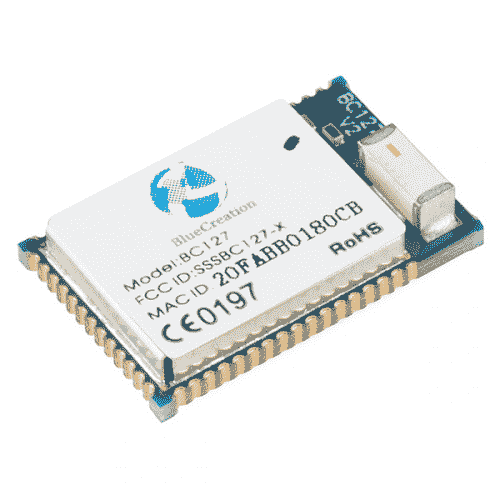](https://www.sparkfun.com/products/retired/12819) 

### [蓝牙贴片模块- BC127](https://www.sparkfun.com/products/retired/12819)

[Retired](https://learn.sparkfun.com/static/bubbles/ "Retired") WRL-12819

这是 BC127，一款高度灵活、低功耗、小尺寸蓝牙 4.0 版认证音频模块。每个模块…

3 **Retired**[Favorited Favorite](# "Add to favorites") 8[Wish List](# "Add to wish list")

### BC127 转接

对于主要对 BC127 本身感兴趣的用户，我们创建了一个 [BC127 分线板](https://www.sparkfun.com/products/11927)，它提供了对 BC127 模块上所有引脚的基本访问，以及一个与 FTDI 基本板具有相同引脚排列的六引脚串行接头，允许它连接到 Arduino Pro、Pro Mini 和 LilyPad 等板。它还包括电压调节、串行数据电平转换电路，并支持内置电池充电电路。

[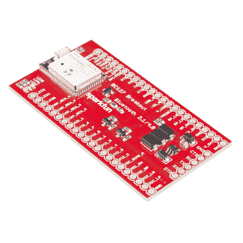](https://www.sparkfun.com/products/retired/11927) 

### [SparkFun 蓝牙音响突围- BC127](https://www.sparkfun.com/products/retired/11927)

[Retired](https://learn.sparkfun.com/static/bubbles/ "Retired") WRL-11927

这是 BC127 蓝牙模块的分线点。BC127 是一款高度灵活、低功耗、小尺寸的蓝牙版本

5 **Retired**[Favorited Favorite](# "Add to favorites") 5[Wish List](# "Add to wish list")

### 普鲁普图斯 jamboree

对于有更实际项目想法的用户，我们开发了 [PurpleTooth Jamboree](https://www.sparkfun.com/products/11924) (以下简称“PTJ”)。PTJ 是一个更全功能的板，旨在通过 A2DP、HFP 和 AVRCP 蓝牙经典模式提供音频桥支持。它包括电路，用于将单端音频输入和麦克风转换为模块的平衡输入，并将模块的平衡音频输出转换为适合线路输入和耳机的放大单端信号。它还包括用于配对和向远程设备发送音频命令的按钮、电池充电电路以及用于连接 FTDI 基本板或 Arduino Pro、Pro Mini 和 LilyPad 等板的六引脚串行接头。

[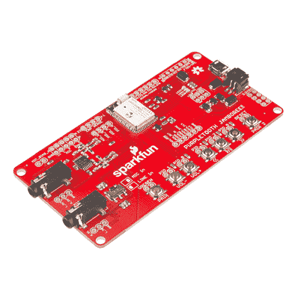](https://www.sparkfun.com/products/retired/11924) 

### [spark fun Purpletooth Jamboree-BC 127 开发板](https://www.sparkfun.com/products/retired/11924)

[Retired](https://learn.sparkfun.com/static/bubbles/ "Retired") WRL-11924

这是 PurpleTooth Jamboree 全功能板，旨在通过 A2DP、HFP 和

8 **Retired**[Favorited Favorite](# "Add to favorites") 7[Wish List](# "Add to wish list")

### 推荐阅读

在继续学习之前，请确保您已经熟悉了这些教程中涉及的概念:

[](https://learn.sparkfun.com/tutorials/installing-an-arduino-library) [### 安装 Arduino 库](https://learn.sparkfun.com/tutorials/installing-an-arduino-library) How do I install a custom Arduino library? It's easy! This tutorial will go over how to install an Arduino library using the Arduino Library Manager. For libraries not linked with the Arduino IDE, we will also go over manually installing an Arduino library.[Favorited Favorite](# "Add to favorites") 22[](https://learn.sparkfun.com/tutorials/terminal-basics) [### 串行终端基础知识](https://learn.sparkfun.com/tutorials/terminal-basics) This tutorial will show you how to communicate with your serial devices using a variety of terminal emulator applications.[Favorited Favorite](# "Add to favorites") 46[](https://learn.sparkfun.com/tutorials/bluetooth-basics) [### 蓝牙基础知识](https://learn.sparkfun.com/tutorials/bluetooth-basics) An overview of the Bluetooth wireless technology.[Favorited Favorite](# "Add to favorites") 42

## BC127 基础知识

在本页，我们将为理解 BC127 模块的功能奠定基础。我们讨论的所有内容都在 [BC127 模块数据手册](http://cdn.sparkfun.com/datasheets/Wireless/Bluetooth/Melody_5.0_Manual-RevD-RC10-Release.pdf)中，但我们将缩减数据手册中的内容，使其更容易理解。

如果您计划将 BC127 与我们提供的 Arduino 库一起使用，您可能仍然会发现通读此页面很有用。虽然这个库抽象掉了大部分底层的东西，但是知道发生了什么仍然是有帮助的，尤其是当你发现这个库不支持你想使用的功能的时候。

### 操作模式

BC127 有两种操作模式:命令模式和数据模式。在命令模式下，从串行端口传入的任何数据都被视为命令，并将由模块的命令解释程序进行相应的解析。在数据模式下，如果模块使用串行端口协议连接到另一个设备，则通过串行端口到达的任何数据都将通过蓝牙链路直接输出。

#### 命令模式

在命令模式下，本地接收并附加了回车符(通常表示为“\r”或 0x0D 十六进制)的数据将被解析为命令。注意，解析器只期望**和**回车；如果发送命令的设备附加了回车符*和*换行符(例如，使用 println()语句的 Arduino)，解析器将会遇到麻烦。如果换行符在回车符之前，解析器可能根本不接受这个命令。如果先出现回车，解析器将把换行符解释为另一个命令字符串的开始，这可能导致模块出现意外的错误消息。

在本指南的其余部分，我将认为命令末尾的回车是隐式的。此外，虽然理论上命令是不区分大小写的，但命令总是以全大写字母表示，我建议您总是发送全大写的命令字符串，因为这有时会有所不同。

最后，解析器对空白不太敏感。在命令字符串中的意外位置插入空格会导致错误。稍后，当我们开始讨论具体的命令时，会有更多的内容。

#### 数据模式

要进入数据模式，只需输入命令“ENTER_DATA”。无论是否作为 SPP 设备连接，模块都将以“OK”(稍后会有更多响应)、*做出响应。*从那时起，数据将通过 SPP 连接透明地传递出去(如果有一个可用的话)。如果没有，它将被简单地忽略——当连接可用时，它不会被缓冲以供以后传递。

要退出数据模式，必须发送一个由四个美元符号组成的字符串(" $$$ ")。为了将此解释为退出数据模式的命令，而不是要传递的数据，在第一个$之前和第四个$之后必须有一个间隔。该间隙的长度可以由用户设置，但默认情况下，两端都是 400 毫秒。如果没有该间隙，字符串将被视为数据。

还要注意，数据模式**不支持**BLE 连接，尽管 SPP 数据传输和 BLE 数据传输表面上相似。这是 BC127 上固件的一个限制，将来可能会改变。

### 命令、响应和配置参数

要在命令模式下与 BC127 交互，您需要了解三件事:它将接受的特定命令、模块对这些命令的响应以及用户可以控制的各种配置参数。

#### 命令

我们将在这里讨论一些更有用的命令。对于每一个，我们将提供语法、预期的响应以及对命令动作的讨论。提醒——仅用回车结束命令字符串！多余的换行符会导致错误。

[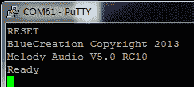](https://cdn.sparkfun.com/assets/f/5/c/a/4/527befdd757b7ffa148b456b.png)

`RESET` -将模块重置为其当前存储的默认设置。您可以在上面的截图中看到预期的响应。请注意，这不会*而不是*恢复出厂默认设置。

`RESTORE` -将模块重置为出厂默认设置。完成时返回`OK`。这种恢复只是暂时的，在`RESET`后，模块将恢复到当前存储的设置。

`WRITE` -将当前设置存储在非易失性存储器中，用于下次复位或上电时的配置。完成时返回`OK`。许多设置需要重新启动模块才能生效；如果您在发出`RESET`命令之前没有将当前设置`WRITE`到非易失性存储器，它们将会丢失并且更改不会生效。

发出`RESTORE`、`WRITE`、`RESET`将使模块恢复出厂默认设置，这可能是使用 BC127 启动任何程序的好方法，提供一个已知的良好起点。

`GET`和`SET` -这两个命令允许访问我们将在下面深入研究的配置参数；一般来说，`SET`命令会引起`OK`响应，`GET`会使模块以当前值响应。

#### 反应

任何命令都将导致模块发出响应。这将采用完全由 ASCII 字符组成的字符串的形式，以**和**结束，按此顺序是一个新行(' n '或 0x0A)和一个回车(' r '或 0x0D)。与命令一样，每当我提到响应时，我都会假设这些是隐式的。

所有响应字符串中的所有字符都是大写，除非响应字符串以某种方式表示接收到的数据。

两个最常见的回答是“OK”和“ERROR”。接收到这两种情况中的任何一种都表明自从最后一次回车以来输入的字符已经被解析并且输入缓冲区是空的。对于需要一些时间来执行的命令(例如，扫描本地广告 BLE 设备)，许多其他命令不能被提交，并且如果在接收到表示扩展命令结束的“OK”响应之前提交，将导致“错误”响应。

下面是模块可以发送的一些响应，以响应远程单元采取的动作；这些自然是对我们上面提到的本地发出的命令的响应的补充。

`CLOSE_OK SPP` -远程连接关闭了给定的配置文件。注意 SPP 只是一个例子；该参数可以是任何类型的连接，并且在远程设备关闭所有连接的情况下，您将会收到每个连接的配置文件的一条消息。这也可能意味着远程设备已移出范围或已关闭。

`PAIR_PENDING` -远程设备试图连接到模块。

`PAIR_OKAY` -在`PAIR_OKAY`消息后立即报告地址的远程设备已成功与 BC127 配对。随后是一条或多条`OPEN_OK`消息，详细说明所建立的连接类型。

`AVRCP_STOP`、`AVRCP_PLAY`、`AVRCP_PAUSE`、`AVRCP_FORWARD`、`AVRCP_BACKWARD` -远程 AVRCP 装置已经执行了该命令。并非所有设备都会在执行命令时返回所有这些消息。

#### 配置参数

除了上面列出的命令，还有许多配置参数可以使用`SET`和`GET`命令进行设置或回读。一般设定值的格式是`SET PARAM=VALUE1 VALUE2 VALUE3`；参数总是至少有一个参数，也可能有几个。输入多个参数时，用空格将后续参数与第一个参数隔开。参数名、等号和第一个值之间不能有空格；该区域中的空白会导致错误。

通过输入`CONFIG`命令，可以回读*所有*配置参数的当前状态；这里将不涉及这些值中的许多。

## BC127 配置文件

BC127 支持几种不同的“模式”，即蓝牙标准中指定的连接类型。这些配置文件决定了设备的功能以及设备如何响应输入。

### 一般连接信息

当连接设备是 Bluetooth Classic 或 Bluetooth 4.0(也称为 Bluetooth 低能耗或 BLE)时，设备之间的连接管理方式会有所不同。

* * *

#### 经典模式

以下是对经典模式连接控制有用的**命令**:

[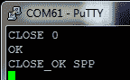](https://cdn.sparkfun.com/assets/c/f/3/c/3/527c135c757b7f8a548b4567.png)

`CLOSE`断开`STATUS`返回的某个链接。将与`STATUS`或`ALL`返回的链接 ID 对应的单个数字作为参数传递，断开所有连接。请注意，可以断开单个配置文件连接，但仍然连接到具有其他配置文件的设备。还要注意，只要传递的参数是有效的，这个命令将返回`OK`，不管是否有与那个链接 id 的连接。

正如您在上面看到的，这个命令有两个响应:`OK`，它表示命令在本地被成功接收(即没有输入错误)和`CLOSE_OK SPP`，它告诉您远程设备被成功断开。如果没有链接 ID 为 0 的连接，就不会出现`CLOSE_OK`消息。

`DISCOVERABLE mode`使设备可被范围内的其他 Bluetooth Classic 设备发现(`ON`)。连接完成后，设备会自动切换到`OFF`；执行`DISCOVERABLE ON`将断开任何现有连接。

[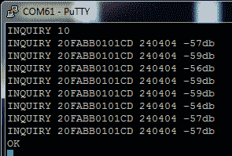](https://cdn.sparkfun.com/assets/1/0/c/2/f/527bf34e757b7f6c158b4567.png)

`INQUIRY`查找可被发现的本地 Bluetooth Classic 设备。需要一个介于 1 和 48 之间的整数参数；该值决定了查询将持续的时间长度；超时将等于 1.28 秒乘以传递的值。

回应如上图。`INQUIRY`字符串表示发现了一个设备。其后是 12 个十六进制数字，它们是设备的地址，然后是另外 6 个十六进制数字，表示[设备的能力](http://www.ampedrftech.com/cod.htm)。这个六位数的值，即设备值的类别，通常超出了本文档的范围。最后，您会看到一个信号强度指示器。任何高于-70db 的信号都可能足以产生良好的连接。

一旦接收到`OK`响应字符串，查询过程就完成了。

`LIST`打印当前与该模块配对的所有设备的列表，无论它们是否连接。BC127 在此列表中最多可以存储 8 个设备。即使没有执行`WRITE`*，该列表中的设备在复位或电源循环*后仍然存在**

*[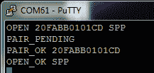](https://cdn.sparkfun.com/assets/7/a/1/8/0/527bf64c757b7f63188b456b.png)

`OPEN`在给定类型的给定地址建立与设备的连接。以上示例显示了串行端口协议类型与地址为 20FABB0101CD 的设备的连接。请注意，地址和连接类型中的所有字母必须全部大写！

对此的反应各不相同。成功的连接将返回上述消息:`PAIR_PENDING`表示找到了设备，`PAIR_OK`后跟地址表示配对过程成功完成，`OPEN_OK`表示与指定配置文件的连接成功。如果命令语法中有错误(例如，没有足够的字符用于有效的蓝牙地址，或无效的配置文件类型)，响应将是`ERROR`。如果在该地址找不到设备，您将收到`OPEN_ERROR`。如果设备不接受指定配置文件的连接，您将收到`PAIR_OK`消息，但您将看到连接的`OPEN_ERROR`消息。

可用的连接类型有 A2DP、AVRCP、MAP、HFP、PBAP、SPP 和 ble。我们将在本教程的后面讨论这些连接类型(通常称为“配置文件”)。

`RSSI`返回当前链接的信号强度。

[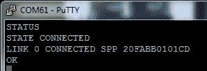](https://cdn.sparkfun.com/assets/8/d/7/4/0/527bf8d8757b7f57158b456a.png)

`STATUS`返回关于模块当前状态的信息。正如您在上面看到的，响应的第一行是`STATE`，后面是一些信息。这里的选项有`CONNECTED`、`DISCOVERABLE`、`CONNECTABLE`或`ADVERTISING`。`DISCOVERABLE`和`CONNECTABLE`可以同时返回。

如果模块是`CONNECTED`，链接列表将跟随`STATE`响应。每个链接都有一个参考 ID、状态、配置文件类型和连接设备的地址。在上面的例子中，我们有一个连接:链路 ID 0 通过串行端口配置文件连接到地址为 20FABB0101CD 的设备。

`UNPAIR`清除配对设备列表。然而，这并不影响远程设备对其配对对象的理解。

这些是对传统连接有用的**参数**。要更改或查看它们，使用上一页详述的`SET`和`GET`命令。

`AUTOCONN=value`控制配对设备在复位或加电时的自动连接。当值为`0`时，BC127 在启动时不会尝试连接到任何之前配对的设备。当值为`1`时，BC127 将尝试每个配对的设备(如`LIST`命令所报告的；尝试连接每个设备的次数在`MAX_REC`参数中设置。当值为`2`时，BC127 将在启动时尝试连接到地址存储在参数`REMOTE_ADDR`中的设备。要改变该值，需要一个`WRITE` `RESET`周期。

`CLASSIC_ROLE=value`决定了设备的作用:`0`为汇，`1`为源。当为了音频目的将 BC127 设备连接在一起时，这变得很重要；它决定哪个设备发送音频，哪个设备接收音频。

`DISCOVERABLE=value timeout`设置启动时的设备模式。**这是不同于** `DISCOVERABLE` **的命令！**同名命令控制模块的即时可发现性；这将设置启动时的默认状态。

`0`使设备在启动时不被发现。`1`使设备在启动时可被发现，但*仅在*无法自动连接到其配对的设备时才被发现。`2`使其立即可被发现，并完全覆盖自动连接设置。timeout 的值决定了在进入节能模式之前它将保持在可发现模式的时间，以毫秒为单位。将该值设置为 0 表示无限期等待。

`LOCAL_ADDR=value`将模块地址打印到串口。任何改变这一点的尝试都会产生错误。

`MAX_REC=value`设置自动连接时尝试重新连接配对设备列表中每个配对设备的次数。默认为 2 次。

`REMOTE_ADDR=value`提供启动时尝试重新连接的单个地址(假设`AUTOCONN=2`)。BC127 将尝试连接`MAX_REC`次。

`RSSI_THRESH=value`为模块作为可靠连接接受的信号强度设置下限。默认值为-75db。

* * *

#### 蓝牙 4.0 模式

许多相同的设置和命令可以应用于蓝牙 4.0 连接；以下是 BLE 特有的**命令**:

`ADVERTISING value`可以通过`ON`或`OFF`来启动和停止 BLE 广告。`BLE_ROLE`值必须为 1 才能工作；我们稍后再讨论。

[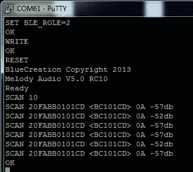](https://cdn.sparkfun.com/assets/1/1/0/5/a/527c0fa2757b7f890d8b4571.png)

`SCAN`相当于蓝牙 4.0 设备的`INQUIRY`。注意，在执行`SCAN`之前，必须通过将参数`BLE_ROLE`设置为 2，将该值写入非易失性存储器，并重置设备，将模块制成蓝牙 4.0 中央设备。

响应与`INQUIRY`非常相似；响应的第一个字段是地址，第二个字段是设备的“简称”，第三个字段给出关于设备的信息(0A 表示通用双模式设备；02 将是单模设备)，第四个是接收信号强度。

`SEND BLE data`通过 BLE 链路传输数据。**BLE 连接目前不支持数据模式；数据只能在命令模式下通过** `SEND` **命令发送和接收。**

只有一个**参数**仅与蓝牙 4.0 连接相关联:

`BLE_ROLE=value`设置 BC127 将用作的设备类型。`SCAN`只有在`BLE_ROLE=2`的情况下才能进行；`ADVERTISING`只有在`BLE_ROLE=1`的情况下才会起作用。通过将该参数设置为 0，可以禁用 BLE。

当我们讨论单个连接协议时，我们将根据每个协议的需要添加更多信息。

* * *

#### 串行端口协议

过去对蓝牙设备的大部分修补都集中在 SPP——串行端口协议上。在这种模式下，设备模拟物理串行端口，通过以太网传递数据(可能还有握手信号),就像是物理的有线连接一样。

有几个**命令**与 SPP 连接相关联:

`$$$$`将使处于数据模式的 BC127 退出数据模式并返回命令模式。然而，为了实现这一点，在第一个字符之前和最后一个字符之后必须有一个保护时间；该保护时间在参数`CMD_TO`中设置，将在参数部分讨论。

`ENTER_DATA`将把设备置于数据模式；任何进入串行端口的串行数据都将透明地转发到远程设备。

`SEND SPP string`将通过串行连接发送字符串(或命令末尾回车之前的任何其他数据)。这允许在不进入数据模式的情况下发送数据。如果接收到数据且模块不处于数据模式，数据将被加上`RECV SPP`。

有相当多的**参数**可以设置，以便通过串行与 BC127 进行非常灵活的连接:

`BAUD=value`设置输入和输出串行数据的波特率。有效值为 9600、19200、38400、57600、115200、230400、460800 和 921200。当设置为工厂默认值时，模块默认为 9600。

`CMD_TO=value`控制检测`$$$$`命令退出数据模式的保护时间。在`$$$$`之前和之后的串行数据中应该有一个 20ms *的值中断，以便识别；不遵守此保护时间将导致发送一串四美元符号，而不是导致设备退出数据模式。

`ENABLE_SPP=value`允许用户有选择地禁用 SPP 上的连接。默认为`ON`；任何状态的改变都需要一个`WRITE`T3 才能生效。

`FLOW_CTRL=value`启用和禁用 BC127 上的硬件流量控制引脚。需要`WRITE` `RESET`才能生效。

`PARITY=value`启用和禁用串行数据的奇偶校验位，其中`1`为无奇偶校验(默认)，`2`为偶数奇偶校验，`3`为奇数奇偶校验。

`SPP_TRANSPARENT=value`确定新的 SPP 连接是否立即激活数据模式。`OFF`默认情况下，需要`WRITE`和`RESET`才能使任何更改生效。

* * *

#### AVRCP 和 A2DP 协议

A2DP 代表高级音频分发配置文件；AVRCP 是音频/视频遥控器配置文件。这两者有着错综复杂的联系；如果 A2DP 连接没有打开，就不能打开 AVRCP 连接。但是，您只能打开一个 A2DP 连接。

A2DP 是一种双通道音频流协议，它将数据从源传输到接收器。信号源可以是手机、媒体播放器或另一个 BC127(或类似)模块上的音频输入。AVRCP 允许 BC127 向远程设备发送命令，这将导致远程设备播放、暂停、停止、前进或倒退回放；一些远程设备将通过 AVRCP 协议将轨道元数据传输回 BC127。

BC127 还支持免提协议(HFP)；我们稍后将讨论这一点，但是现在要注意，通过 HFP 连接的传入呼叫将覆盖 A2DP 连接上的数据。

下面是让 A2DP 和 AVRCP 正常工作需要知道的**命令**:

`MUSIC instruction`通过 AVRCP 链路向 A2DP 源设备发送命令。指令的有效选项有`PLAY`、`PAUSE`、`STOP`、`FORWARD`和`BACKWARD`。

`VOLUME flag`有不同的选项，取决于设备是接收器还是源(由下面讨论的`CLASSIC_ROLE`参数定义)。如果设备是接收器，本地音量将发生变化，但不会发生远程音量变化。如果设备是源，远程设备的音量将会改变。标志的有效值为`UP`、`DOWN`和`A2DP`；`A2DP`将报告为 A2DP 扬声器设置的音量。

如果标志被格式化为`A2DP=value`，将如上所述将音量设置为 0 到 15 之间的值。

这些是管理 A2DP/AVRCP 连接的**参数**:

`AUDIO=value`路由来自各种源/接收器的 A2DP 音频流。选项包括模拟 0(默认)、PCM 主机 1、PCM 从机 2、I2S 主机 3、I2S 从机 4 和 SPDIF 5。`WRITE` `RESET`要求经过修改。

`BPS=value`为 I2S 和 PCM 编解码器设置每个样本的位数。PCM 的有效值为 8、13 和 16，I2S 的有效值为 16 和 24。`WRITE` `RESET`要求经过修改。

`CLASSIC_ROLE=value`允许用户将设备设置为信号源(1)或接收器(0)。当试图在两个 BC127 模块之间建立连接时，这一点很重要，因为它决定了哪个模块期望发送音频数据和命令，哪个模块期望接收音频数据和命令。稍后，我们将在一个示例中介绍这一点。`WRITE` `RESET`要求经过修改。

`ENABLE_A2DP=value`和`ENABLE_AVRCP=value`允许用户选择性地启用和禁用 A2DP 和 AVRCP 上的连接。`WRITE`变身后所需的`RESET`。

`I2S=value`控制 I2S 系统的各种参数，详见 BC127 手册第 15 页。`WRITE` `RESET`要求经过修改。

`INPUT_GAIN=value`控制设备模拟输入的增益水平。支持 0 到 15 之间的值；默认值报告为 16，但实际上是 15。

在下一页，我们将浏览 BC127 与几个不同音频源的接口示例。

* * *

#### HFP 和 PBAP 议定书

HFP(免提协议)和 PBAP(电话簿访问协议)被实现来支持到蜂窝电话的连接。它们是相关的，因为支持其中一个的大多数设备都支持两个，但不像 AVRCP 和 A2DP 那样密切相关。

HFP 允许您使用 BC127 模块拨打和接听电话。如果存在 A2DP 链路以及 HFP 链路，则当接收到呼叫时，HFP 链路将覆盖 A2DP 数据流。

以下是访问 HFP 和 PBAP 功能的**命令**列表:

`ANSWER`通过 HFP 链路接听来电。

在 HFP 链路上发起呼叫；如果连接两个 BC127 模块，这将创建一个双向 HFP 链接(即对讲机)。

`END`挂断正在进行的呼叫。

`PULL_PBOOK option`开始检索电话的电话簿、通话清单或其中的某个子集。如果没有通过选项，或者通过了选项`PHONEBOOK`，将下载电话簿。对于通话清单，选项有`OUTGOING`、`INCOMING`、`MISSED`或`COMBINED`。列表中每个项目的响应采用以下格式:

```
PBAP_PB NAME: name
PBAP_PB TEL: number 
```

一旦所有请求的数据都已交付，将发送消息`PBAP_PB OK`。

`PULL_ABORT`停止正在下载的通讯录；在活动电话簿拉取过程中，无法关闭 PBAP 配置文件连接。

`REJECT`将导致来电被拒绝。

`TOGGLE_VR`将在手机上激活语音识别拨号。

`TRANSFER_CALL`将音频发送回手机。这可能会导致手机断开蓝牙连接；这因手机型号而异。

`VOLUME flag`允许控制扬声器音量。标志值`UP`和`DOWN`控制扬声器音量；`HFP`将返回当前 HFP 扬声器的音量。`MIC_MUTE`报告麦克风的静音状态。

如果标志采用`flag=value`的形式，HFP 音量可以独立于 A2DP 流进行调整，并且`MIC_MUTE=ON`将使麦克风静音。

还有一些**参数**控制 HFP 和 PBAP 的连接:

`ENABLE_HFP=value`和`ENABLE_PBAP=value`可以是`ON`或`OFF`来允许或不允许 HFP 和 PBAP 的连接。`WRITE` `RESET`要求经过修改。

`FORCE_ANALOG_MIC=value`即使选择了数字音频接口，也在 HFP 强制使用模拟输入。`WRITE` `RESET`要求经过修改。

* * *

#### 接下来:用法示例！

现在，我们将探索如何将 BC127 模块连接到各种目标，包括手机、另一个 BC127 模块和作为串行端口的通用蓝牙模块。

## 用法示例

在这里，我们将探索三种使用案例:将 BC127 连接到手机或其他媒体播放器设备，将音频从一个 BC127 流式传输到另一个，以及使用 SPP 协议将 BC127 连接到另一个设备并在两者之间传输数据。

### BC127 作为媒体控制器和音频输出

当与媒体播放设备(我将使用我的手机)和 A2DP 和 AVRCP 模式连接时，BC127 可用作音乐或其他音频信号的输出和控制设备。

[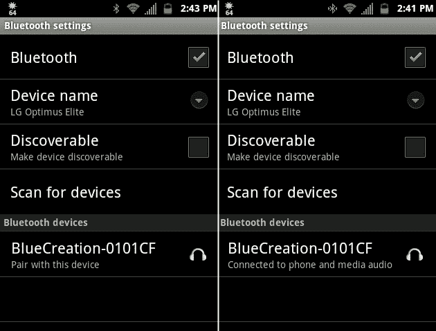](https://cdn.sparkfun.com/assets/6/4/2/f/5/527d5c7b757b7fb0548b456d.png)

我首先将手机与 BC127 配对。上面你可以看到我手机的几张截图，显示了我扫描设备时看到的内容，以及我成功连接到 BC127 时显示的内容。

[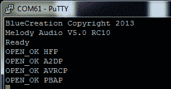](https://cdn.sparkfun.com/assets/8/7/8/7/9/527d5cd6757b7ff43a8b456c.png)

这是 BC127 在配对过程中的串行输出。

您可以看到它报告了一个具有四个配置文件的新连接:免提配置文件(HFP)、高级音频分配配置文件(A2DP)、音频/视频远程控制配置文件(AVRCP)和电话簿访问配置文件(PBAP)。此时，我可以从 BC127 向手机发回命令，以开始、停止和暂停曲目，或者在曲目列表中前进或后退。此外，当在电话端开始或停止播放时，BC127 将接收消息。下面是我在手机上开始播放，暂停播放，然后通过串行终端取消暂停播放的例子:

[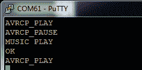](https://cdn.sparkfun.com/assets/0/6/6/4/b/527d5e37757b7fb7548b4572.png)

您会注意到,`MUSIC PLAY`命令生成了两个响应:一个来自 BC127 的`OK`,表示命令已被成功接收并执行，另一个来自手机的 echo `AVRCP_PLAY`响应，表示它成功满足了请求。这个回应可能需要一些时间才能到达 BC127 模块，但是这个命令在电话上执行得非常快。

除了各种音乐控制命令(完整列表见上一页)，BC127 的各种 PIO 引脚可用于控制播放。这些信号为高电平有效；将引脚拉至模块的电源电压以发送信号。

以下是各种引脚执行的功能列表:

*   PIO_0 -本地音量调高
*   PIO_1 -本地音量降低
*   PIO_2 -播放/暂停播放
*   PIO_4 -向后跟踪
*   PIO_5 -轨道前进

Purpletooth Jamboree 板包括引脚(和可焊接接头)来访问所有这些功能。

重要提示:如果您通过 HFP 连接到电话时接到电话，将会中断您的 A2DP 数据流。如果您没有将麦克风连接到 BC127，您可能无法与来电者互动。您可以禁用 BC127 上的 HFP 来防止这种情况；音频输出仍然会暂停，但音频流不会被传输到模块，所以你可以使用手机本身的扬声器和麦克风。

### 从一个 BC127 向另一个发送音频

BC127 的另一个重要用途是设备到设备音频。您可以使用此功能将蓝牙流添加到任何具有音频输出的设备；例如，您可以在房间内将音频从 PC 传输到立体声放大器，而无需使用线缆。

该过程类似于与手机配对，如上所述，但要求您预先配置您的 BC127 模块之一作为源-它们在装运时配置为接收器。

有两种方法可以做到这一点:输入引脚或编程。对于输入引脚，只需将 VREGEN 引脚拉高一秒钟(或者按下 Purpletooth Jamboree 板上的 VRECEN/PAIR 按钮)。这将更改必要的设置，重置电路板，并连接到信号最强的 BC127 模块。下面是正在进行此过程的两个模块的屏幕截图(源设备在左侧):

[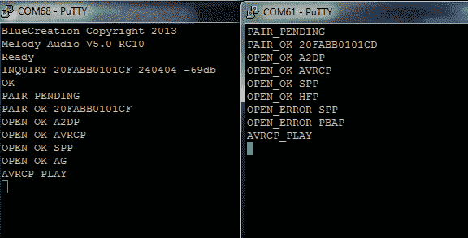](https://cdn.sparkfun.com/assets/a/5/8/b/8/5281303c757b7ff6638b4567.png)

你会知道模块已经开始配对过程，因为发光二极管将暂时关闭。

另请注意，只有发送了 AVRCP_PLAY 命令，音频流才会开始。在这种情况下，它是通过按下 Jamboree 板上的播放按钮发送的；向任一模块发送一个`MUSIC PLAY`命令也是完全可以接受的。

通过编程，您需要执行以下步骤:

1.  为了获得最佳效果，在两个模块上做一个`RESTORE` `WRITE` `RESET`循环，这样我们就知道它们的设置是什么了。你不需要**让**来做这件事，特别是如果你对你所改变的任何设置的含义感到满意的话，但是这个过程的其余部分假设模块是出厂默认的。
2.  在源设备(有音频输入的设备)上，运行`SET CLASSIC_ROLE=1`。这使得设备成为主设备。**这真的很重要——如果你跳过这一步，连接将会工作，你不会得到任何错误，但音频将不会工作。**
3.  如果您希望源设备自动连接到接收器，请运行`SET AUTOCONN=1`。如果你不这样做，你需要告诉它重新连接，每次你重置它，我们的电源周期。
4.  `WRITE`和`RESET`使这些改变持续并生效。
5.  连接到另一个 BC127 模块(我正在连接到 20 fabb 0101 cf):' op incubming fabb 0101 cf a2dp`。
6.  在源设备上发出`MUSIC PLAY`命令。如果您想要从接收器远程访问开始回放，您需要打开从源到接收器的 AVRCP 配置文件连接(`OPEN 20FABB0101CF AVRCP`)。

这是两台设备的屏幕截图，从出厂默认设置开始，连接在一起:

[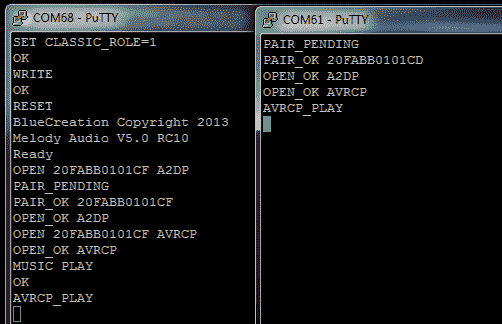](https://cdn.sparkfun.com/assets/d/1/1/2/8/52813bd2757b7fc8578b4569.png)

### BC127 SPP 连接

我将演示的最后一个用例是将 BC127 作为串行设备连接并传输数据。这是两台 BC127 设备连接的屏幕截图:

[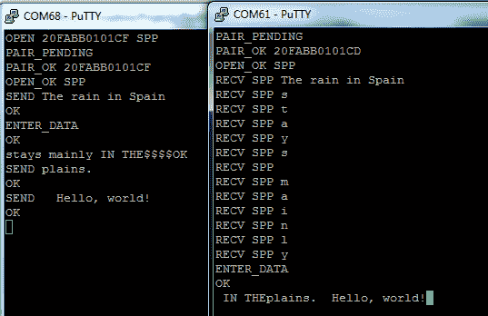](https://cdn.sparkfun.com/assets/a/0/d/c/9/528140c6757b7f9e578b4568.png)

以下是复制该演示所需执行的步骤:

1.  为了获得最佳效果，在两个模块上做一个`RESTORE` `WRITE` `RESET`循环，这样我们就知道它们的设置是什么了。你不需要**让**来做这件事，特别是如果你对你所改变的任何设置的含义感到满意的话，但是这个过程的其余部分假设模块是出厂默认的。
2.  与音频传输不同，这里没有源设备和接收设备。它们都被认为是端点。这意味着您可以从任何一端启动连接。要连接，`OPEN 20FABB0101CF SPP`。
3.  此时，您可以通过在数据前面加上`SEND`来发送数据。试试`SEND The rain in Spain`。数据在回车上发送(即回车键)；这意味着您不能发送 CR 字符，除非您处于数据模式。
4.  要进入数据模式，使用`ENTER_DATA`命令。您现在可以看到，数据(“主要停留”)直接通过链路传输，但它是在右侧设备上被逐段接收的。在我将该设备置于数据模式后，您可以更自然地看到数据传入(“in”)。
5.  要退出数据模式，你需要在字符流中留下一个短的间隙(默认为 400 毫秒)，然后输入`$$$$`，再允许一个短的间隙(同样为 400 毫秒)。这将退出数据模式。请注意，即使我发送数据(“平原。”)在命令模式下，接收设备保持数据模式，只接收我发送的数据。还要注意，`SEND`后面的第一个空格不传输，后面的空格是(“Hello，world！”).

## Arduino 图书馆

为了使 BC127 模块易于使用，我们创建了一个库，用于 Arduino 和 Arduino 兼容板。我们在 1.0.5 版下进行了广泛的测试；我们不能保证广泛的向后兼容性，但它应该可以在大多数 1.0 以后的版本中工作。

你可以从我们的 GitHub 库下载 Arduino 库；该库可用于 BC127 分线板和 PurpleTooth Jamboree 板。

[SparkFun BC127 Arduino Library](https://github.com/sparkfun/SparkFun_BC127_Bluetooth_Module_Arduino_Library/archive/master.zip)

### 一般概念

BC127 库假定您已经将 BC127 连接到硬件或软件串行端口。该库应该支持所有基于 Atmega 的 Arduino 板，并且应该与该板通常支持的任何硬件或软件串行端口一起工作。

要创建 BC127 库的实例，允许您通过库的命令与 BC127 交互，您需要包含 BC127 库并调用该库的类构造函数，如下所示:

```
language:c
#include <bc127.h>
BC127 BC127Module(&serialPortName); 
```

当然，你可以把“BC127Module”改成你觉得最舒服的名字。“serialPortName”应该替换为设备所连接的串行端口的名称；例如，要将其连接到 Uno 或类似设备上的主硬件串行端口，您的构造函数应该如下所示:

```
language:c
#include <bc127.h>
BC127 BC127Module(&Serial); 
```

如果您想使用软件串行端口，您需要几个其他步骤:首先，您需要包含软件串行库，并且您需要一个软件串行对象的构造函数:

```
language:c
include <bc127.h>
#include <SoftwareSerial.h>

SoftwareSerial swPort(3,2); // RX pin, TX pin
BC127 BC127Module(&swPort); 
```

您仍然需要在您的`setup()`函数中执行一个`.begin()`语句来设置相关串口的波特率；当然，速度**必须**与通过 BC127 模块中的`BAUD`参数设置的速度相匹配。默认情况下，在这里的所有例子中，该值将是 9600 波特。

### 向模块发送命令

BC127 库处理数据的方式与大多数库略有不同。通常，当您调用一个函数时，该函数的返回值表示感兴趣的数据。BC127 数据的复杂性使得这一前景很难实现；为了处理这种情况，以及命令出错的不同方式，BC127 对象的每个命令都返回一个特殊值，称为 opResult。

BC127 命令功能有 7 种可能的响应；它们有便于参考的名称，但也可以称为整数值:

*   **REMOTE_ERROR (-5)** -最有可能的情况是，指定的地址没有远程设备，或者远程设备完全没有响应。
*   **CONNECT_ERROR (-4)** -远程设备响应，但由于远程设备端的限制，操作失败。
*   **INVALID_PARAM (-3)** -本地 BC127 模块不喜欢它刚收到的命令的某些部分；也许是印刷错误？
*   **TIMEOUT_ERROR (-2)** -您刚刚发送的命令有一个超时参数，BC127 未能在分配的时间内完成操作。大多数命令都会超时。
*   **MODULE _ ERROR(-1)**-BC 127 不喜欢刚刚发生的事情。
*   **DEFAULT_ERR (0)** -你应该永远不会看到这个。
*   **成功(1)** -命令成功完成。

当我们继续学习库中的命令时，我将指出每个函数可能的响应及其含义。

在我们继续之前，我们应该讨论一下这个模块的三个通用命令:`restore()`、`reset()`和`writeConfig()`。

```
language:c
BC127Module.restore(); 
```

该命令将模块重置为出厂默认设置。**当前设置的所有**参数将被重置为默认值，所有存储的配对地址将被清除。但是，这种恢复只会持续到下一次复位或上电周期。

```
language:c
BC127Module.writeConfig(); 
```

将设备的当前配置写入非易失性存储器；复位后，模块的设置将恢复到当前状态。

```
language:c
BC127Module.reset(); 
```

重置模块，加载已设置在其非易失性存储器中的参数。还会关闭所有活动的连接。

对设置的大多数更改要求在设置更改后按此顺序发送这三个命令，以使更改生效；我们将注意后面的每个命令是否都是这种情况。

这三者都可以返回“超时错误”或“成功”。“TIMEOUT_ERROR”可能意味着模块未通电、未正确连接或波特率设置错误。

```
language:c
BC127Module.connectState(); 
```

此命令允许您检查模块当前是否连接到任何设备。它不报告存在哪种类型的连接，只报告连接是否处于活动状态。

它将返回“成功”或“连接错误”。需要几百毫秒才能完成。

请注意，由于缓冲区的限制，这将导致软件串行缓冲区溢出。它被设计来优雅地处理这个问题，但是溢出标志仍然会被设置。

```
language:c
BC127Module.addressQuery(String address); 
```

这将检索当前连接模块的地址，并将其粘贴到字符串对象`address`中。有助于识别您当前使用的模块。

“TIMEOUT_ERROR”可能意味着模块未通电、未正确连接或波特率设置错误。

### 建立和管理连接

显然，我们需要连接到其他设备，以使该设备发生任何有用的事情。以下是连接到其他目标的命令。

```
language:c
BC127Module.inquiry(int timeout); 
```

此命令会扫描本地电波以查找可发现的 Bluetooth Classic 设备，并创建一个最多包含五个设备的列表。“超时”参数是以秒为单位的超时乘以 1.3；也就是说，传递“1”将导致函数超时 1.3 秒。

它返回找到的模块数量(从 0 到 5)或“TIMEOUT_ERROR”。“TIMEOUT_ERROR”可能意味着模块未通电、未正确连接或波特率设置错误。

```
language:c
BC127Module.getAddress(char index, String address); 
```

取出`inquiry()`返回的列表中`index`处的地址，放入 String 对象中。

可以返回“SUCCESS”或“INVALID _ PARAM”；“INVALID_PARAM”可能意味着您试图索引列表的末尾，或者在列表实际上为空时访问列表。

```
language:c
BC127Module.connect(char index, connType connection);
BC127Module.connect(String address, connType connection); 
```

这是实际的连接命令。它有两个版本:第一个简单地尝试连接到一个通过`inquiry()`调用发现的设备，第二个尝试通过地址连接。

`connType`是另一种 BC127 型；在这种情况下，您的选项是“SPP”、“BLE”、“A2DP”、“AVRCP”、“PBAP”和“HFP”。

对于第一种情况,“INVALID_PARAM”结果表明您试图连接到一个不存在的索引。对于第二种情况，它表明您发送了一个字符数不正确的地址。

对于他们两个，您可以预期看到这些响应:

*   **"MODULE_ERROR"** -地址无效(可能不是全部大写，或者不是十六进制数字的字符)。
*   **"CONNECT_ERROR"** -很有可能，范围内没有具有该地址的设备。
*   **"REMOTE_ERROR"** -我们找到了一个具有该地址的设备，但它出于某种原因拒绝了我们的连接(可能它不支持我们请求的连接类型？).
*   **“成功”** -你已连接并准备好摇滚。

### 使用 SPP 连接

SPP 连接有一些相关的命令。

```
language:c
BC127Module.setBaudRate(baudRates newSpeed); 
```

该命令改变模块的波特率。您选择要传递的参数有“s9600bps”、“s19200bps”、“s38400bps”、“s57600bps”和“s115200bps”。

这里返回值有点复杂。更改会立即生效——不需要重置——因此您的串行端口不会正确设置以接收确认。但是，您可以从返回值中获得一些有用的信息。如果你得到“成功”，这意味着你刚刚设置了与当前设置相同的值。“MODULE_ERROR”表示命令有问题，“INVALID_PARAM”表示您传递了一个错误的值。如果一切按计划进行，您可以预期一个“TIMEOUT_ERROR”。

默认情况下，SPP 连接不会在数据模式下启动。为进入和退出数据模式提供了两个命令:

```
language:c
BC127Module.enterDataMode();
BC127Module.exitDataMode(); 
```

`exitDataMode()`自动提供字符串前后的保护延迟，所以你不必担心。预计两者都将返回“成功”或“超时错误”。

一旦进入数据模式，远程设备发送和接收的数据字符串将是简单的字符串，您可以将其视为有线连接。对于使用构造函数绑定到模块的端口，使用标准串行端口操作来读写数据。

### 使用 A2DP/AVRCP 连接

我们还提供了一些使用 A2DP/AVRCP 连接的命令。

```
language:c
BC127Module.musicCommands(audioCmds command); 
```

此功能允许您向模块发送驱动音频控制的命令。参数选项有“播放”、“暂停”、“前进”、“后退”和“停止”来控制音轨，以及“向上”和“向下”来增加或减少音量。

对于音频应用来说，控制模块的接收器和源设置非常重要；要将音频从一个模块传输到另一个模块，您需要启用源模式，要从另一个源接收音频，您需要确保该模块处于接收模式。

```
language:c
BC127Module.setClassicSink();
BC127Module.setClassicSource(); 
```

这两个命令非常简单明了；但是，请注意，在更改此设置后，必须执行一个`writeConfig()` / `reset()`循环。

### 其他命令和参数

为了方便高级用户，我们还包括了三个额外的功能，允许您在数据表中发送任何命令，并更改或检索任何参数设置。

```
language:c
BC127Module.stdCmd(String command);
BC127Module.stdGetParam(String command, String *param);
BC127Module.stdSetParam(String command, String param); 
```

用法简单；对于`stdCmd()`,只需按照数据表中的格式发送字符串。这里不使用简单的串行打印语句的优点是`stdCmd()`将为您处理错误报告。

对于另外两个参数，“command”应该是感兴趣的参数的名称，“param”将是等号后面的所有内容。

## 示例:SPP 连接

在这一页，我们将提供一个连接两块电路板的 Arduino 草图示例，每块电路板都有一个按钮和一个 LED，按下任何一个按钮都会点亮两个 LED。

为了简单起见，我们将这样写，以便两个处理器的代码和硬件是相同的。

#### 硬件

我会保持简单:

*   两款 spark fun[Arduino Pro mini](https://www.sparkfun.com/products/11113)
*   两块 [BC127 分线板](https://www.sparkfun.com/products/11927)
*   两个[按钮](https://www.sparkfun.com/products/97)
*   两个 10k [线性电位计](https://www.sparkfun.com/products/9288)
*   四个[红色发光二极管](https://www.sparkfun.com/products/9590)(带 [330 欧姆限流电阻](https://www.sparkfun.com/products/8377))。

正如我上面所说，两块板的连接和代码是相同的。

这里有一个 Fritzing 图显示连接的一半设置；做两个这样的:

[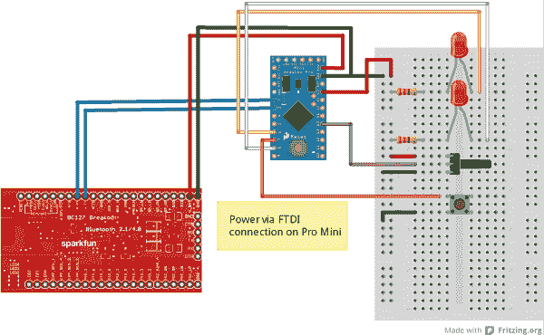](https://cdn.sparkfun.com/assets/c/4/6/8/f/528ce2f7757b7f6e3b8b4567.png)

#### 代码

**注意:**此示例假设您在桌面上使用的是最新版本的 Arduino IDE。如果这是你第一次使用 Arduino，请回顾我们关于[安装 Arduino IDE 的教程。](https://learn.sparkfun.com/tutorials/installing-arduino-ide)如果您之前没有安装 Arduino 库，请查看我们的[安装指南。](https://learn.sparkfun.com/tutorials/installing-an-arduino-library)

你需要知道的一切都在评论里。

```
language:c
// Include the two libraries we need to use this; I'm using a software serial port
//  because time-sharing the hardware port with uploading code is a pain.
#include <bc127.h>
#include <SoftwareSerial.h>

// Create a software serial port.
SoftwareSerial swPort(3,2);  // RX, TX
// Create a BC127 and attach the software serial port to it.
BC127 BTModu(&swPort);

// Aliases for the input and output pins we're going to use.
#define POTPIN    A0
#define PWMLED    6
#define BUTTONPIN 7
#define DIGLED    8

void setup()
{
  // Serial port configuration. The software port should be at 9600 baud, as that
  //  is the default speed for the BC127.
  Serial.begin(9600);
  swPort.begin(9600);

  // Blast the existing settings of the BC127 module, so I know that the module is
  //  set to factory defaults.
  BTModu.exitDataMode(); // Just in case...do this or other commands won't take.
  BTModu.restore();
  BTModu.writeConfig();
  BTModu.reset();

  // Configure the inputs and outputs.
  pinMode(BUTTONPIN, INPUT_PULLUP);
  pinMode(DIGLED, OUTPUT);

  String buffer;  // We'll use this for capturing data from the module. I'm using
                  //  a String to make it easy to parse.

  // NB- we can assume that at this point our soft serial buffer is empty; that's
  //  all handled by the restore/write/reset cycle at the top. For other programs,
  //  your mileage may vary on this point, so it might not be a bad idea to purge
  //  the buffer before you start reading in from it.

  // Okay, first tricky bit. Since we've got the same code on both boards, we need
  //  some way to pair them. We want to wait here until the board is paired; what
  //  we'll do is wait for the button to be pressed, and then initiate pairing. We
  //  will also monitor traffic coming in from the BC127 and watch for the string
  //  "OPEN_OK SPP\n\r"; if we see that, we can bail, since we know the module
  //  is now connected. We *could* use the connectionState() function, *but* that
  //  function has such a long latency (it takes about 500ms to get a definitive
  //  answer from the module) that the chance of missing a button press is really
  //  pretty high- you'd have to hold the button for 500ms to be sure to catch it.
  while (1)
  {
    // We're going to do two things in this loop: check for a connection message,
    //  indicating that we were connected to by a remote device, and check for the
    //  button press and try to connect when we see that. Here's the connection
    //  message polling part.

    // We need to buffer our incoming serial data...
    if (swPort.available() > 0) buffer.concat((char)swPort.read());

    // ...then, we need to check if it's a full line from the serial port, and
    //  check its contents if it is.
    if (buffer.endsWith("\r"))
    {
      // If the buffer has a serial port connection message, we can break out of
      //  the while loop after entering data mode.
      if (buffer.startsWith("OPEN_OK SPP")) 
      {
        BTModu.enterDataMode();
        Serial.println("Connected!");
        break;  // Exit the while loop.
      }
      buffer = "";  // Otherwise, clear the buffer and go back to waiting.
    }
    //////////////////////////////////////////////////////////////////////////////
    // Okay, this next bit is the push button polling section. Note that once the
    //  button has been pressed, it's quite a long time (10+ seconds) before we
    //  return to what we were doing above.
    if (digitalRead(BUTTONPIN) == LOW)
    {
      Serial.println("Attempting to connect...");
      if (BC127Connect() == BC127::SUCCESS) 
      {
        Serial.println("Connection succeeded!");
        break;
      }
      else Serial.println("Connection failed. Back to waiting!");
    }
  }
}

// Ideally, I'd have made this a static variable and put it inside loop(), but that
//  causes Arduino to have a little hissy-fit, so I'll make it a global instead.
String inBuffer = "";

// If we've gotten to loop(), we can assume that we're connected to the remote
//  device. We're going to pass a packet back and forth that looks like this:
//     xy\r
//  x  - 8-bit value for the brightness of the dimmable LED.
//  y  - 0x00 or 0x01 for whether the remote button is pressed or not.
//  \r - end of string value. \r is not a valid data byte, so it makes a good
//       check on complete packet receipt.
void loop()
{ 
  // These are the variables we need to get this job done. By making them static,
  //  they only get initialized once and persist through loop calls.

  static byte outBuffer[3];
  static int ledVal = 0;
  static boolean buttonVal = false;
  static unsigned long lastLoop = millis();

  // This first bit is where we handle the receipt of characters from the remote
  //  device. We'll handle our data collection and sending later.

  // Add to the buffer one character at a time...
  if (swPort.available() > 0) inBuffer.concat((char)swPort.read());
  // ...then check to see if we've received an end-of-packet character...
  if (inBuffer.endsWith("\r"))
  {
    // ... and parse the packet if we have.
    ledVal = (int)inBuffer[0]; // This is a pre-linearized value from the pot on the
                               //  other board.
    digitalWrite(DIGLED, (int)inBuffer[1] ? LOW : HIGH); // This is the other board's
              //  button state. We want to invert it, of course, so a received 1
              //  (indicating the other button is high/unpressed) results in a low
              //  for this board's LED. 
    inBuffer = "";  // Clear the buffer.
  }

  analogWrite(PWMLED, ledVal);

  // Our standard "loop without delay" method.
  if (lastLoop + 50 < millis())
  {
    lastLoop = millis();
    outBuffer[0] = (byte)(linearizeLED(analogRead(POTPIN)));
    outBuffer[1] = (boolean)digitalRead(BUTTONPIN);
    outBuffer[2] = '\r';
    swPort.write(outBuffer[0]);
    swPort.write(outBuffer[1]);
    swPort.write(outBuffer[2]);
  }
}

// Sweet little function that takes a potentiometer's input and turns it into a
//  PWM values that will appear, to a user, to be a linear brightness increase
//  across the range of the potentiometer.
int linearizeLED(int potVal)
{
  int PWMArray[] = {0, 1, 2, 3, 5, 7, 9, 12, 16, 20, 25, 31, 38, 46, 54, 64, 75, 87,
                      100, 114, 130, 147, 165, 185, 207, 230, 255};
  byte index = map(potVal, 0, 1024, 0, 26);
  return PWMArray[index];
}

// Useful function which identifies a local BC127 module and connects to it.
int BC127Connect()
{
  int connectionResult = BC127::REMOTE_ERROR; // Our return value. Assume failure.
  BTModu.inquiry(10);   // Spend 13 seconds seeking local devices.
  String address;   // Buffer for addresses we've found.
  // This loop will scan through the addresses found (there will be a maximum of
  //  five) and identify any BC127 modules (their addresses all start with "20FABB").
  for (byte i = 0; i < 5; i++)
  {
    // If there IS an address at index i...
    if (BTModu.getAddress(i, address))
    {
      // ...check to see if it's a BC127 and if it IS...
      if (address.startsWith("20FABB"))
      {
        // ...attempt to connect to it...
        connectionResult = BTModu.connect(address, BC127::SPP);
        break; // ...and quit looking at the rest of the addresses.
      }
    }
  }
  // Okay, hopefully, by now we've found and connected to a BC127\. If not, return
  //  an error...
  if (connectionResult != BC127::SUCCESS) return connectionResult;
  // ...but, if so, we want to try to enter data mode.
  else connectionResult = BTModu.enterDataMode();
  return connectionResult;
} 
```

## 示例:音频桥

本例针对一对 BC127 模块，其中一个模块设置为接收器，另一个模块设置为发送器。发射器模块将自动与接收器配对，并从其输入端开始传输音频。

皮特在他的办公室里用这个把音频从他的电脑发送到房间另一边的立体声系统。

有一点需要注意，如果你自己实现的话:其中一个设备需要一些时间(大约 2 分钟)来注意到遥控器已经消失，重置并重试连接。那真的不能操之过急；这是 BC127 模块的固有特性。一种可能的解决方法是与 SPP 连接配对，如果您错过了心跳信号，则进行重置；我将把它留给读者作为练习。毕竟，乐趣在于黑客攻击！

### 硬件

硬件在两端是相同的:一个 Arduino Pro Mini 3.3V 连接到一个 Purpletooh Jamboree。这是一个显示其工作原理的熔块图:

[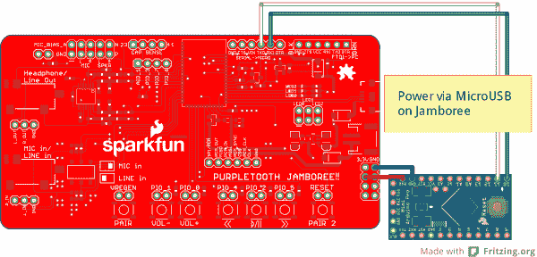](https://cdn.sparkfun.com/assets/9/2/9/9/7/528d06de757b7fa43a8b4569.png)

在这里，权力是个微妙的东西。为了获得最佳效果，您可能希望使用板载 microUSB 连接器和信号源外部的某种电源为发射器供电；比如手机充电器或者壁瘤。如果您使用它来传输来自 PC 的信号，从板载 USB 供电会建立接地环路，这将导致信号中出现明显的嗡嗡声或嘶嘶声。

### 接收器

**注意:**此示例假设您在桌面上使用的是最新版本的 Arduino IDE。如果这是你第一次使用 Arduino，请回顾我们关于[安装 Arduino IDE 的教程。](https://learn.sparkfun.com/tutorials/installing-arduino-ide)如果您之前没有安装 Arduino 库，请查看我们的[安装指南。](https://learn.sparkfun.com/tutorials/installing-an-arduino-library)

接收器端使用 Pro Mini 监控连接，并在连接断开时重启模块。原因很简单:当配对的模块失去连接时，它只想恢复与配对设备的连接。但是，如果配对的设备丢失了它的配对信息，连接就不能恢复，直到接收器复位。因此，专业迷你。

我们还需要通过链路发出 AVRCP“PLAY”命令，以启动音频流。Pro Mini 也能处理这个问题。

代码注释给出了所有关于如何做的细节。代码如下:

```
language:c
// Include the two libraries we need to use this; I'm using a software serial port
//  because time-sharing the hardware port with uploading code is a pain.
#include <bc127.h>
#include <SoftwareSerial.h>

// Create a software serial port.
SoftwareSerial swPort(11,10);  // RX, TX
// Create a BC127 and attach the software serial port to it.
BC127 BTModu(&swPort);

void setup()
{
  // Serial port configuration. The software port should be at 9600 baud, as that
  //  is the default speed for the BC127.
  Serial.begin(9600);
  swPort.begin(9600);
}

// buffer *should* be a static within loop(), but Arduino freaks out about that,
//  so I'm making it a global. Le sigh.
String buffer = "";

void loop()
{
  // resetFlag tracks the state of the module. When true, the module is reset and
  //  ready to receive a connection. When false, the module either has an active
  //  connection or has lost its connection; checking connectionState() will verify
  //  which of those conditions we're in.
  static boolean resetFlag = false;

  // This is where we determine the state of the module. If resetFlag is false, and
  //  we have a CONNECT_ERROR, we need to restart the module to clear its pairing
  //  list so it can accept another connection.
  if (BTModu.connectionState() == BC127::CONNECT_ERROR  && !resetFlag)
  {  
    Serial.println("Connection lost! Resetting...");
    // Blast the existing settings of the BC127 module, so I know that the module is
    //  set to factory defaults...
    BTModu.restore();

    // ...but, before I restart, I need to set the device to be a SINK, so it will
    //  enable its audio output and dump the audio to the output.
    BTModu.setClassicSink();

    // Write, reset, to commit and effect the change to a source.
    BTModu.writeConfig();
    // Repeat the connection process if we've lost our connection.
    BTModu.reset();
    // Change the resetFlag, so we know we've restored the module to a usable state.
    resetFlag = true;
  }
  // If we ARE connected, we'll issue the "PLAY" command. Note that issuing this when
  //  we are already playing doesn't hurt anything.
  else BTModu.musicCommands(BC127::PLAY);

  // We want to look for a connection to be made to the module; once a connection
  //  has been made, we can clear the resetFlag.
  if (BTModu.connectionState() == BC127::SUCCESS) resetFlag = false;
} 
```

### 发射机

**注意:**此示例假设您在桌面上使用的是最新版本的 Arduino IDE。如果这是你第一次使用 Arduino，请回顾我们关于[安装 Arduino IDE 的教程。](https://learn.sparkfun.com/tutorials/installing-arduino-ide)如果您之前没有安装 Arduino 库，请查看我们的[安装指南。](https://learn.sparkfun.com/tutorials/installing-an-arduino-library)

与接收器一样，我们希望观察连接中的故障，然后重新连接。

查看代码:

```
language:c
// Include the two libraries we need to use this; I'm using a software serial port
//  because time-sharing the hardware port with uploading code is a pain.
#include <bc127.h>
#include <SoftwareSerial.h>

// Create a software serial port.
SoftwareSerial swPort(11,10);  // RX, TX
// Create a BC127 and attach the software serial port to it.
BC127 BTModu(&swPort);

String address = "20FABB0101CF"; // Remote module's address. If I were an optimist,
                                 //  I'd scan for BC127 modules and treat any one I
                                 //  found as the remote. Let's hard code for safety.

void setup()
{
  // Serial port configuration. The software port should be at 9600 baud, as that
  //  is the default speed for the BC127.
  Serial.begin(9600);
  swPort.begin(9600);
}

void loop()
{
  // Loop doesn't have to do much...just monitor the connection and try and restore
  //  it if it's lost.
  if (BTModu.connectionState() == BC127::CONNECT_ERROR)
  {
    // Blast the existing settings of the BC127 module, so I know that the module is
    //  set to factory defaults...
    BTModu.restore();

    // ...but, before I restart, I need to set the device to be a SOURCE, so it will
    //  enable its audio input and forward the data to the remote.
    BTModu.setClassicSource();

    // Write, reset, to commit and effect the change to a source.
    BTModu.writeConfig();
    BTModu.reset();

    // Now, attempt to connect. There are timeouts on these operations, so we won't
    //  sit forever.
    BTModu.connect(address, BC127::A2DP);
    BTModu.connect(address, BC127::AVRCP);
    // If we DID connect, we want to use the "PLAY" command to start the devices
    //  streaming audio. If we didn't, well, who cares? No harm in a spurious "PLAY".
    BTModu.musicCommands(BC127::PLAY);
  }
} 
```

## 资源和更进一步

有关 BC127 模块的更多信息，请查看以下文档:

*   SparkFun 蓝牙音频突破- BC127
    *   [示意图](http://cdn.sparkfun.com/datasheets/Wireless/Bluetooth/BC127_Breakout.pdf)
    *   [老鹰档案](http://cdn.sparkfun.com/datasheets/Wireless/Bluetooth/BC127_Breakout.zip)
    *   [GitHub Repo:硬件](https://github.com/sparkfun/BC127_Breakout_Board)
*   spark fun purple tooth Jamboree-BC 127 开发板
    *   [示意图](https://cdn.sparkfun.com/datasheets/Wireless/Bluetooth/Purpletooth_Jamboree1.pdf)
    *   [老鹰档案](http://cdn.sparkfun.com/datasheets/Wireless/Bluetooth/Purpletooth_Jamboree.zip)
    *   [GitHub Repo:硬件](https://github.com/sparkfun/Purpletooth_Jamboree)
*   [模块数据表](https://cdn.sparkfun.com/datasheets/Wireless/Bluetooth/DataSheet-BC127.10.pdf)
*   [Melody v5.0 手册](http://cdn.sparkfun.com/datasheets/Wireless/Bluetooth/Melody_5.0_Manual-RevD-RC10-Release.pdf) -这是我们出售的 BC127 模块附带的固件命令和行为的完整参考
*   这是一个预发布且不受支持的固件版本，我们和 BlueCreation 都不会提供支持。如果你更新你的模块固件到这个(我们将**而不是**告诉你如何做)，你只能靠自己了！
*   [GitHub 代码报告:Arduino 库](https://github.com/sparkfun/SparkFun_BC127_Bluetooth_Module_Arduino_Library)

有关更多教程操作，请查看以下相关链接:

[](https://learn.sparkfun.com/tutorials/rn-52-bluetooth-hookup-guide) [### RN-52 蓝牙连接指南](https://learn.sparkfun.com/tutorials/rn-52-bluetooth-hookup-guide) A hookup guide to get you started with the RN-52 Audio Bluetooth Module Breakout Board.[Favorited Favorite](# "Add to favorites") 16[](https://learn.sparkfun.com/tutorials/metawatch-teardown-and-arduino-hookup) [### MetaWatch 拆卸和 Arduino 连接](https://learn.sparkfun.com/tutorials/metawatch-teardown-and-arduino-hookup) Tearing down the nifty Bluetooth-enabled MetaWatch. Then building an Arduino sketch to control it.[Favorited Favorite](# "Add to favorites") 4[](https://learn.sparkfun.com/tutorials/using-the-bluesmirf) [### 使用 BlueSMiRF](https://learn.sparkfun.com/tutorials/using-the-bluesmirf) How to get started using the BlueSMiRF and Bluetooth Mate Silvers.[Favorited Favorite](# "Add to favorites") 11[](https://learn.sparkfun.com/tutorials/interactive-hanging-led-array) [### 交互式悬挂 LED 阵列](https://learn.sparkfun.com/tutorials/interactive-hanging-led-array) Learn how we converted 72 lightbulbs into an interactive LED array for our conference room.[Favorited Favorite](# "Add to favorites") 16[](https://learn.sparkfun.com/tutorials/noisy-cricket-stereo-amplifier---15w-hookup-guide) [### 嘈杂的板球立体声放大器- 1.5W 连接指南](https://learn.sparkfun.com/tutorials/noisy-cricket-stereo-amplifier---15w-hookup-guide) A hookup guide for the Noisy Cricket Stereo Amplifier - 1.5W.[Favorited Favorite](# "Add to favorites") 2*