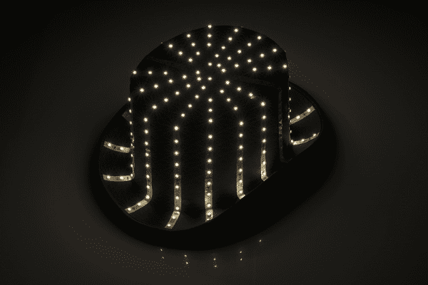
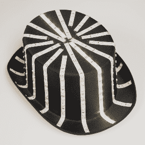
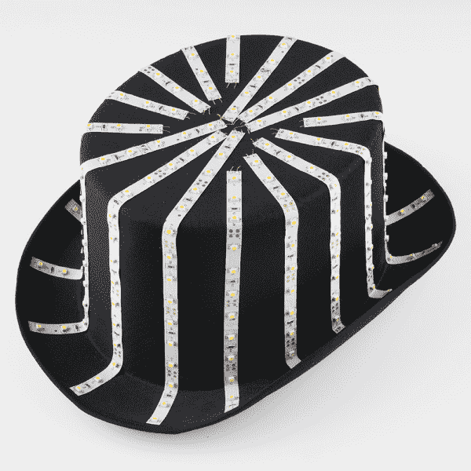
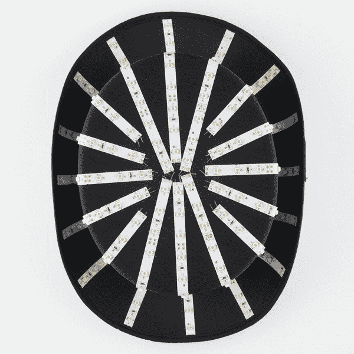
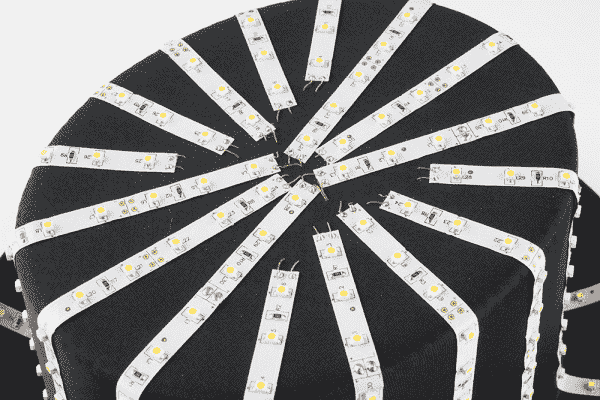
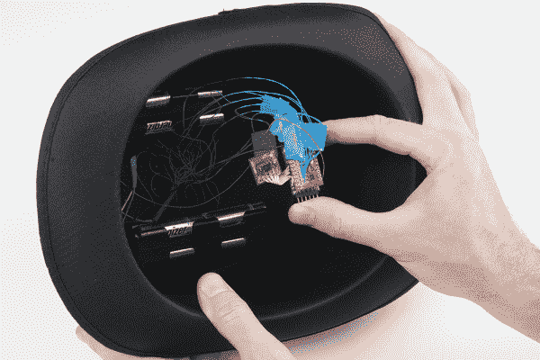
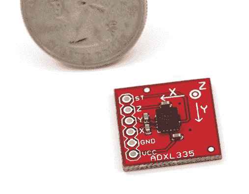
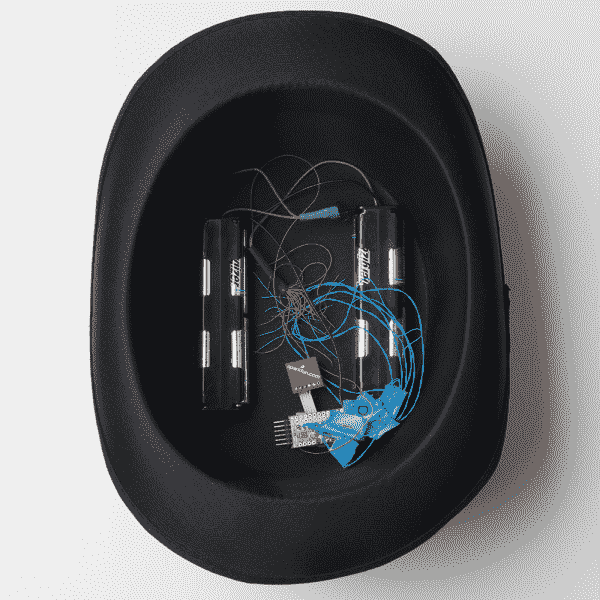
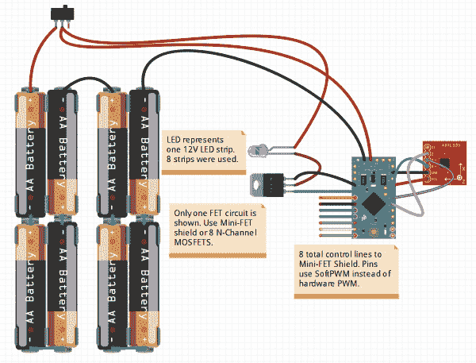

# 闪烁的顶部

> [https://learn . spark fun . com/tutorials/das-flashing-top-hat](https://learn.sparkfun.com/tutorials/das-blinken-top-hat)

## 背景

[](https://cdn.sparkfun.com/assets/b/8/2/c/6/52c0a2a0ce395f0d1d8b4567.jpg)

这顶布林肯礼帽是由 T2 的戴安娜·英格和 T4 的大卫·克劳森在他们的订婚派对上送给内森和艾丽西娅的礼物。当帽子倾斜时，它会随着旋转效果而发光。Das blinken 礼帽结合了白色 LED 灯条、一个小 [Arduino Pro Mini](https://www.sparkfun.com/products/11114) 和一个[加速度计](https://www.sparkfun.com/products/9269)以获得相当漂亮的效果。

[](https://cdn.sparkfun.com/assets/7/5/4/8/7/52c2f047ce395fb14a8b4568.gif)

### 推荐阅读

您可能想知道的事情:

*   [电池技术](https://learn.sparkfun.com/tutorials/battery-technologies)
*   [Arduino 是什么？](https://learn.sparkfun.com/tutorials/what-is-an-arduino)
*   [发光二极管](https://learn.sparkfun.com/tutorials/light-emitting-diodes-leds)
*   [脉宽调制/ PWM](https://learn.sparkfun.com/tutorials/pulse-width-modulation)
*   [MMA8452Q 加速度计连接指南](https://learn.sparkfun.com/tutorials/mma8452q-accelerometer-breakout-hookup-guide)
*   [如何戴礼帽](http://uncyclopedia.wikia.com/wiki/Top_Hat)

## 五金器具

使用的零件:

*   [Arduino Pro Mini](https://www.sparkfun.com/products/11114)
*   [Mini FET Shield](https://www.sparkfun.com/products/9627)
*   [ADXL335 三轴加速度计](https://www.sparkfun.com/products/9269)
*   [长方形 AA 电池座](https://www.sparkfun.com/products/551)
*   [电源开关](https://www.sparkfun.com/products/102)
*   [绕线](https://www.sparkfun.com/products/8187)
*   [12V 条形发光二极管](http://www.amazon.com/s/ref=nb_sb_noss?field-keywords=12v+white+led+ribbon)

### 发光二极管

[](https://cdn.sparkfun.com/assets/1/c/e/b/9/52c0a2a5ce395f9b1b8b4567.jpg)

照明来自普通的白色 LED 灯。它们由 12V 驱动，亮度极高！

[](https://cdn.sparkfun.com/assets/6/5/f/a/4/52c0a2a4ce395f2f788b4568.jpg)

总共有 16 条，非常巧妙的并行布线，因此 Arduino Pro Mini shield 只需处理 8 个通道。

[](https://cdn.sparkfun.com/assets/1/1/3/6/1/52c0a2a5ce395f501c8b4567.jpg)

每条带子都有一个自粘衬背，将带子牢固地(在极端的头部动作中)固定在礼帽上。+和-连接由 30AWG [细绕线](https://www.sparkfun.com/products/8031)制成，并穿过织物。

### Arduino Pro 迷你+驱动程序

[](https://cdn.sparkfun.com/assets/b/9/e/d/d/52c0a2a2ce395fa14f8b4568.jpg)

Arduino Pro Mini 3.3V/8MHz 是完美的尺寸，具有足够的计算能力来读取加速度计并控制 8 个通道的 led。它使用的能量只是发光二极管的一小部分，并且可以用 [FTDI Basic](https://www.sparkfun.com/products/9873) 重新编程以获得其他漂亮的照明效果。

每条灯带有 15 个发光二极管，这意味着当照明时，每条灯带将使用大约(15 * 20)300 毫安。这远远超过了 ATmega328 的处理能力(大约最大 20mA ),因此[微型 FET 屏蔽](https://www.sparkfun.com/products/9627)非常方便。这种屏蔽允许低电压 Arduino(在礼帽的情况下为 3.3Vs)控制更大的负载(在 LED 条的情况下为 12V 和 300mA)。迷你 FET 屏蔽上的 8 个通道每个都可以处理 2 安培，因此 MOSFETs 甚至不会变热。如前所述，有 16 个 LED 灯条，但它们是并联的，所以我们只需要控制 8 个通道就可以获得非常酷的效果。

### 加速计

[](https://www.sparkfun.com/products/9269)

这款帽子使用的是 [ADXL335](https://www.sparkfun.com/products/9269) ，这是一款经典的老爷车，具有易于读取的三轴模拟输出。但任何固态加速度计，如 [ADXL345](https://www.sparkfun.com/products/9836) 、 [MMA7361](https://www.sparkfun.com/products/9652) 或 [MMA8452Q](https://www.sparkfun.com/products/10955) ，都应该工作正常。

ADXL335 很老了(在电子领域，3 年已经过时了)，但读取模拟电压并使用 Arduino 将其转换为 10 位整数非常容易。真正的诀窍是做基本的数学计算，找出大礼帽是如何移动的。一般来说，我们取三个向量(X、Y 和 Z)并将它们组合成一个向量。

### 电池电量

[](https://cdn.sparkfun.com/assets/a/a/f/f/5/52c0a2a4ce395fcf1f8b4567.jpg)

因为 LED 灯以 12V 运行，所以帽子在两个[电池座](https://www.sparkfun.com/products/551)中使用了 8 个 AAs 来分配重量。当电池是新的时，我们有 1.5V * 8 = 12V 的标称电压。led 使用大量的电力，因此锂电池被用来最大限度地延长运行时间。实际上，这种帽子依靠一组电池可以运行几十个小时，所以也可以使用 T2 的碱金属 T3。内嵌的[滑动开关](https://www.sparkfun.com/products/102)可以在夜晚结束时轻松切断帽子的电源。

### 接线图

[](https://cdn.sparkfun.com/assets/learn_tutorials/1/6/3/Top_Hat_Wiring_Diagram.jpg)

这显示了帽子是如何连接的。开/关开关为 Arduino Pro Mini 和 LED 灯供电。MiniFET 上有 8 个独立控制的 MOSFETs。您可以使用屏蔽或使用 8 个分立 MOSFETs(用于为*真正的*大家伙供电)。加速度计连接到模拟输入端。

## 向量数学

如果你像我一样离开学校，远离牛顿物理学，需要一秒钟来记住如何将三个加速度矢量合二为一。出于我们的目的，我们只关心帽子的运动(运动幅度)，而不是方向:

**A²+B²+C²= Z²**

或者在代码中:

`float magnitude = sqrt((aX * aX) + (aY * aY) + (aZ * aZ)); //Combine all vectors`

下面是实际代码的样子:

```
language:c
float avgMag = 0;
for(int x = 0 ; x < 8 ; x++)
{
    aX = analogRead(accelX);
    aY = analogRead(accelY);
    aZ = analogRead(accelZ);

    float magnitude = sqrt((aX * aX) + (aY * aY) + (aZ * aZ)); //Combine all vectors 
    avgMag += magnitude;
}
avgMag /= 8; 
```

我们取 8 个读数，将它们平均在一起以减少噪音。这工作得很好。现在我们只需要决定如何处理这个幅度读数。

为了实现 *das blinken top hat* 的目的，我们需要让 led 在检测到加速度或运动时快速旋转，然后在运动减弱时开始减慢旋转。为此，我们使用指数增长方程来有机地增加通道变化之间的时间(代码中的 tBCC)。

**LED 变化之间的时间延迟= A * x^t**

这是一个基本的指数增长方程。基于常数 **A** 和增长率 **x** ，LED 变化之间的时间将随时间呈指数增长。当加速度计停止检测运动时，我知道我希望 LED 灯条在 3 或 4 秒内减速，我只需确定 A 和 x。

我通过编程让帽子旋转一圈来确定常数 **A** ,并观察在我的眼睛无法辨别差异之前旋转可以使用多小的延迟。10-20 毫秒之间的一个步骤到下一个 LED 灯带看起来非常可怕。任何少于 10 毫秒的东西都会变得模糊不清。

为了确定增长率 **x** ，我使用了一个电子表格，发现增长率为 1.00086 会导致延迟在 3.5 秒内增加到 500 毫秒以上。点击查看谷歌电子表格[查看计算结果。](https://docs.google.com/spreadsheet/ccc?key=0AveJQJuJ_zBMdFRlYkhTV2xkc2lWVHVOZUlYVVZEeHc&usp=sharing)

```
language:c
long currentTime = millis() - startTime;
timeBetweenChannelChange = shortestDelay * pow(growthRate, currentTime); //Exponentially grow the delay between changes 
```

在上面的等式中，我们计算当前时间，然后使用两个常数计算新的 tBCC。这个值(timeBetweenChannelChange)以毫秒为单位，将随时间呈指数增长，直到它大于我们的 maxTimeBetween (3.5 秒)。一旦 tBCC 大于最大时间，帽子将完全停止旋转。

经过一点测试和一些小的调整，旋转灯光效果看起来相当不错。

### 软 PWM

我有过一些[服装](https://www.sparkfun.com/tutorials/205)和 [LED 片](https://www.sparkfun.com/tutorials/47)，那里的 LED 太亮了，亮得刺眼。这也发生在大礼帽上——光线是如此强烈，令人敬畏，以至于接近癫痫舞会。为了解决这个问题，我想通过对 8 个通道进行[脉宽调制](https://learn.sparkfun.com/tutorials/pulse-width-modulation)来降低亮度。如果我们降低 PWM 比率，那么 LED 灯条应该不那么亮，我们延长了电池寿命，并且我们蒙蔽了不那么无害的旁观者。问题是 Arduino Pro Mini 只有 6 个 PWM 通道，不足以运行所有 8 个通道。幸运的是，有一个软件解决方案来拯救！

SoftPWM 是由来自[流氓机器人](http://www.roguerobotics.com)的 Brett Hagman 编写的一个库。这个非常棒的库允许我们将任何引脚转换成 PWM 引脚。它并不完美(看起来伺服支持可能有限)，但它对控制 led 非常有效！

```
language:c
SoftPWMSetPercent(chan0, brightLevel); 
```

这个简单的功能允许我们将给定的 LED 灯条设置在 0(关闭)和 99(全亮度)之间的亮度水平。通过测试，我发现 9%的亮度水平(没错，就这么多)仍然足够亮，但并不明显。

最初的计划是在 Pro Mini 上焊接一个 [trimpot](https://www.sparkfun.com/products/9806) ，这样亮度就可以随时调整。这成了一个小问题(试图在运行时检测 trimpot 的变化变得很棘手)，所以，相反，我测试了一些亮度水平，然后永久设置它。从那以后，我就把这个上限定在了 9%。

### Das 是固件

有两个示例草图可以让你了解如何创建不同的灯光效果。戴夫写的原始代码提供了大量的物理引擎与能源系统相结合的照明效果。我写了一个不太有趣的草图，用一个简单的指数增长公式来控制光的旋转。

*   [基本旋转示例](https://cdn.sparkfun.com/assets/learn_tutorials/1/6/3/TopHat_Basic.zip)
*   [Dave 的代码有很多示例效果](https://cdn.sparkfun.com/assets/learn_tutorials/1/6/3/TopHat_Original.zip)
*   你也可以点击查看 [TopHat 回购](https://github.com/sparkfun/TopHat)

### 成功！

[](https://cdn.sparkfun.com/assets/3/6/e/7/3/52cb1596ce395fdb5a8b456c.jpg)

达斯布林肯大礼帽是一个神奇的礼物，赢得了观众的喝彩，点亮了派对。这是惊人的强大和一吨的乐趣炫耀。

谢谢戴安娜和戴夫！

## 资源和更进一步

感谢阅读本项目教程。如果你想了解更多关于 LED 相关项目和产品的信息，请查看以下精彩的 SparkFun 教程:

*   [灯](https://learn.sparkfun.com/tutorials/light)
*   [红外通信](https://learn.sparkfun.com/tutorials/ir-communication)
*   [RGB 面板连接指南](https://learn.sparkfun.com/tutorials/rgb-panel-hookup-guide)
*   [LED 显示屏驱动器连接指南](https://learn.sparkfun.com/tutorials/dotbar-display-driver-hookup-guide)
*   [交互式悬挂 LED 阵列](https://learn.sparkfun.com/tutorials/interactive-hanging-led-array)