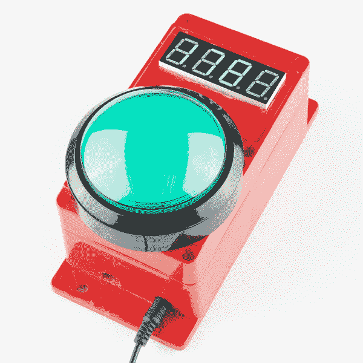
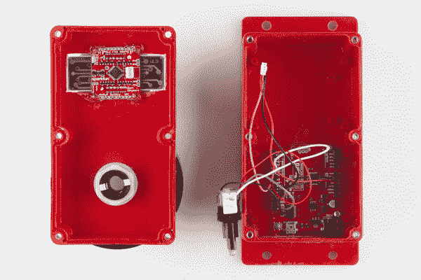
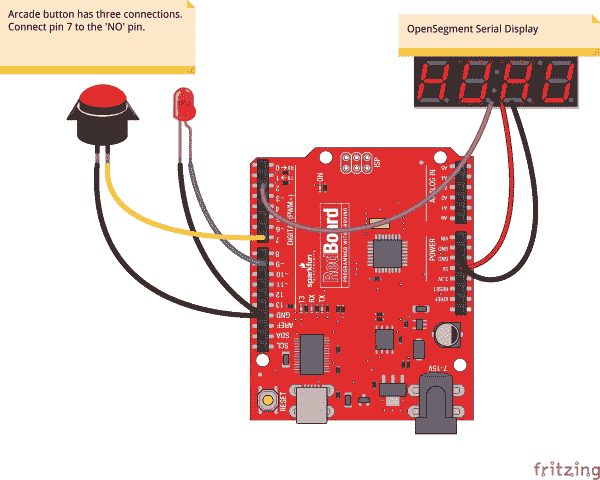
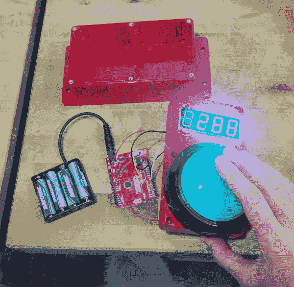
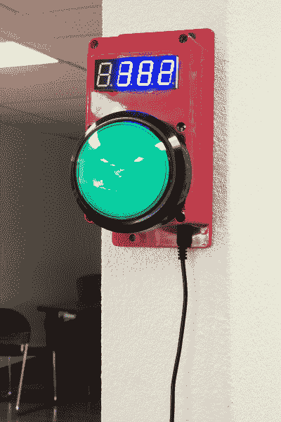

# 反应速度测量器

> 原文：<https://learn.sparkfun.com/tutorials/reaction-timer>

## 推它！

[心理计时法](http://en.wikipedia.org/wiki/Mental_chronometry)是研究人类对不同输入的反应速度。信号从你的眼睛传到你的大脑，再传到你的四肢做出反应需要几百毫秒。反应计时器是演示这种时间延迟的一个很好的项目。这也是朋友之间的一个有趣的游戏！

[](https://cdn.sparkfun.com/assets/8/5/7/6/0/52c0ab60ce395f73218b4569.jpg)*It took 178ms to hit the button!*

反应计时器的原理很简单:当用户看到灯亮了，就按下按钮！微控制器非常适合这一点，因为它可以非常精确地计时毫秒。

### 所需材料

以下是该项目中使用的零件列表:

*   [红纸板](https://www.sparkfun.com/products/11575)
*   [大圆顶按钮-红色](https://www.sparkfun.com/products/9181)
*   [OpenSegment 串行显示-20 毫米(蓝色)](https://www.sparkfun.com/products/11647)
*   [JST 3 电线组件](https://www.sparkfun.com/products/9915)
*   [外壳-带法兰(红色)](https://www.sparkfun.com/products/11366)
*   [5V 墙壁适配器](https://www.sparkfun.com/products/8269)

[所有这些零件的愿望清单](http://sfe.io/w81757)

### 推荐阅读

本教程假设你对 Arduino 和串行通信有所了解。如果你有点生疏，可以考虑看看这些教程:

*   [Arduino 是什么？](https://learn.sparkfun.com/tutorials/what-is-an-arduino)
*   [串行通信](https://learn.sparkfun.com/tutorials/serial-communication)
*   [开关基础知识](https://learn.sparkfun.com/tutorials/switch-basics)
*   [为项目供电](https://learn.sparkfun.com/tutorials/how-to-power-a-project)
*   [OpenSegment 连接指南](https://learn.sparkfun.com/tutorials/using-opensegment)

## 五金器具

[](https://cdn.sparkfun.com/assets/9/d/2/1/5/52c0ab5fce395fdb7f8b4567.jpg)*Guts of the Reaction Timer*

硬件真的很简单。红板连接到一个大的[圆顶按钮](https://www.sparkfun.com/products/9181)和一个 [OpenSegment](https://www.sparkfun.com/products/11647) 四位数显示器。OpenSegment 有一个用于 [3 针 JST](https://www.sparkfun.com/products/9915) 的点，这使得它很容易在飞行中连接。查看 OpenSegment 教程的本页了解更多信息。

[](https://cdn.sparkfun.com/assets/learn_tutorials/1/7/6/Reaction_Timer_bb.jpg)

RedBoard 有以下连接:

*   OpenSegment 上的引脚 2 -> RX 引脚
*   引脚 9 ->大圆顶按钮内 LED 的阳极
*   街机开关的插脚 7 常开(标为 NO)闸刀

一个输入(按钮)和两个输出(按钮上的 LED 和时间显示)就是你所需要的！我们使用跳线，并简单地将它们插入 RedBoard。

[](https://cdn.sparkfun.com/assets/8/6/7/8/7/52cb20b7ce395fee778b4567.jpg)*288ms is pretty slow!*

这个结实的红色外壳用来承受无休止的按钮敲击。为圆顶按钮切一个孔非常简单，dremel 旋转工具很容易为 [7 段显示器](https://www.sparkfun.com/products/11647)切槽。边缘不是很干净，但这是一个快速的项目。如果你想变得花哨，一个印刷图形/边框组合将提供说明，并给予大量的抛光。

在指向下的表面钻了几个孔，以允许 USB 电缆和电源线。红纸板被热粘在适当的位置，显示器被热粘在插槽中，跳线提供必要的连接。如果这个计时器被安装在 SparkFun 之外，我们会焊接并拧紧所有东西，但这个计时器已经经受了相当多的滥用！

[](https://cdn.sparkfun.com/assets/7/7/4/c/2/52c0ab60ce395f4f738b456e.jpg)*The final install*

该装置可以用一个电池组运行几天，但是，由于我们在工作时将计时器永久安装在 kegerators 附近，一个 [5V 墙壁适配器](https://www.sparkfun.com/products/8269)提供了我们需要的所有电力。

## 固件

运行反应计时器的代码非常简单。我们只是点亮一盏灯，然后等待用户按下按钮。下载并安装示例草图。

[Reaction Timer Sketch Download](https://github.com/sparkfun/Reaction_Timer/archive/master.zip)

计时器计算(慢，慢)人做出反应需要多少毫秒。而且，因为我们不想让人类作弊，我们在开灯前随机选择一段时间。

**注意:**此示例假设您在桌面上使用的是最新版本的 Arduino IDE。如果这是你第一次使用 Arduino，请回顾我们关于[安装 Arduino IDE 的教程。](https://learn.sparkfun.com/tutorials/installing-arduino-ide)

If you have not previously installed an Arduino library, please check out our [installation guide.](https://learn.sparkfun.com/tutorials/installing-an-arduino-library)

```
language:c
/*
 Reaction Timer for the World of Wonder Childrens museum in Lafayette, CO
 By: Nathan Seidle (SparkFun Electronics)
 Date: May 6th, 2013
 This code is public domain but you buy me a beer if you use this and we meet someday (Beerware license).

 How to play:
 The button will be pulsing with light. Pressing the button will cause the light to turn off and the game will begin.
 After a few seconds of darkness, the light will light up and the user must press the button as fast as they can.
 Their reaction time is displayed on a 7 segment display.

 If the user presses the button before it is illuminated the display will show '-Err' to indicate error.

 */

#include <SoftwareSerial.h>
SoftwareSerial segmentDisplay(3, 2); //RX, TX to the OpenSegment display

int LED = 9;
int button = 7;

long timeDiff; //Global variable keeps track of your score
int idleLoops = 0;

String gameTime; //Contains the last game time
int gamesPlayed; //Contains the total number of games played for the life of the device

//These functions allow the LED to be really bright when on, and
//just barely on when the game is in idle mode
#define LEDON() analogWrite(LED, 255)
#define LEDLOW() analogWrite(LED, 10)
#define LEDOFF() analogWrite(LED, 0)

void setup()
{
    Serial.begin(115200);

    pinMode(LED, OUTPUT);
    LEDOFF(); //Turn off LED

    pinMode(button, INPUT_PULLUP);

    randomSeed(analogRead(A1)); //Get noise to seed the random number generator

    segmentDisplay.begin(9600); //Talk to the Serial7Segment at 9600 bps
    segmentDisplay.write('v'); //Reset the display - this forces the cursor to return to the beginning of the display

    scrollTitle();
}

void loop()
{
    if(digitalRead(button) == LOW)
    {
        Serial.println("Playing");
        playGame();
        idleLoops = 0;
    }

    pulseTheButton(); //If no one is playing, pulse LED to intice them. Function takes 6 seconds to complete.

    idleLoops++;
    if(idleLoops > 9) //Play a screen saver every 60 seconds.
    {
        scrollTitle(); //Screen saver = display title
        idleLoops = 0;
    }
}

void playGame()
{
    segmentDisplay.write('v'); //Reset the display

    delay(25); //Debounce the button a bit

    while(digitalRead(button) == LOW) ; //Wait for user to stop hitting button

    LEDLOW(); //Turn LED on low to indicate the beginning of the game

    //Get random number of milliseconds
    long lightTime = random(2000, 3500); //From 2 to 3.5 seconds

    long zeroTime = millis();

    while(millis() - zeroTime < lightTime) //Wait for random amount of time to go by
    {
        //If the user hits the button in this time then error out (cheater!)
        if(digitalRead(button) == LOW)
        {
            segmentDisplay.write('v'); //Reset the display
            segmentDisplay.print("-Err");
            Serial.println("Err!");
            blinkButton();
            return;
        }
    }

    //Begin game
    Serial.println("Go!");
    LEDON();
    long beginTime = millis(); //Record this as the beginning of the test

    //Wait for user to hit the button
    while(digitalRead(button) == HIGH)
    {
        //Check to see if the user fails to respond in 10 seconds
        timeDiff = millis() - beginTime;
        if(timeDiff > 9999)
        {
            timeDiff = 9999;
            segmentDisplay.write('v'); //Reset the display
            segmentDisplay.print(timeDiff);
            blinkButton();
            return;
        }
    }

    gameTime = String(timeDiff);

    //Right adjust the time
    if(timeDiff < 10)
        gameTime = "   " + gameTime;
    else if(timeDiff < 100)
        gameTime = "  " + gameTime;
    else if(timeDiff < 1000)
        gameTime = " " + gameTime;

    segmentDisplay.write('v'); //Reset the display
    segmentDisplay.print(gameTime); //Display the game time

    Serial.print("Reaction time:");
    Serial.println(gameTime);

    blinkButton(); //Blink the LED to indicate the end of the game

    //Record that we have played this game
    gamesPlayed++;
    Serial.print("This time played:");
    Serial.println(gamesPlayed);

    //After the game is complete, the display will show the gameTime for awhile
}

//If there is no game going on, pulse the LED on/off
//If the user ever presses the button then return immediately
//This function takes approximately 6 seconds to complete
void pulseTheButton(void)
{
    //Fade LED on
    for(int fadeValue = 0 ; fadeValue <= 255; fadeValue += 5)
    {
        if(digitalRead(button) == LOW) return;

        analogWrite(LED, fadeValue);
        delay(30);
    }

    //Fade LED off
    for(int fadeValue = 255 ; fadeValue >= 0; fadeValue -= 5)
    {
        if(digitalRead(button) == LOW) return;

        analogWrite(LED, fadeValue);
        delay(30);
    }

    //Turn LED off for awhile
    for(int x = 0 ; x < 100 ; x++)
    {
        if(digitalRead(button) == LOW) return;

        analogWrite(LED, 0);
        delay(30);
    }
}

//Quickly blinks to button indicating the end of a game
void blinkButton()
{
    for(int x = 0 ; x < 7 ; x++)
    {
        LEDON();
        delay(60);
        LEDOFF();
        delay(60);
    }
}

//Quickly scrolls the title across the display
void scrollTitle()
{
    String titleStr = String("    reaction speed    ");

    for(int x = 0 ; x < titleStr.length() - 4 ; x++)
    {
        String tempStr = titleStr.substring(x, x + 4); //Chop out four letters from the string

        segmentDisplay.write('v'); //Reset the display
        segmentDisplay.print(tempStr); //Display this substring

        for(int y = 0 ; y < 25 ; y++)
        {
            if(digitalRead(button) == LOW) return; //If the button is pressed, bail!
            delay(10);
        }
    }

    segmentDisplay.write('v'); //Reset the display
    segmentDisplay.print(gameTime); //Display the last game time
} 
```

将该代码加载到 RedBoard 上，[以 115200bps 的速度打开终端](https://learn.sparkfun.com/tutorials/terminal-basics)。您应该会看到一系列调试语句，如“游戏已玩”和“Err！”。

## 资源和更进一步

这个项目提供了一个真正快速和可靠的例子，说明人类对视觉刺激做出反应需要多长时间。我们发现，在早上喝咖啡后，办公室周围的平均时间约为 160 毫秒。希望你能找到这个项目的一部分，用在你自己的计时器或游戏中。

您可能还想结帐:

*   [反应计时器海报](https://cdn.sparkfun.com/assets/learn_tutorials/1/7/6/big_reaction_timer_03.compressed.pdf)
*   参见 [github repo](https://github.com/sparkfun/Reaction_Timer) 上的完整反应计时器代码
*   比尔·波特用图形做了一个奇妙的儿童博物馆展览！查看他非常酷的[反应时间挑战展示](http://www.billporter.info/?p=1375)
*   [骰子战书](https://learn.sparkfun.com/tutorials/dungeons-and-dragons-dice-gauntlet)
*   [使用 OpenSegment](https://learn.sparkfun.com/tutorials/using-opensegment)
*   [开关基础知识](https://learn.sparkfun.com/tutorials/switch-basics)
*   [连接器基础知识](https://learn.sparkfun.com/tutorials/connector-basics)
*   [电池技术](https://learn.sparkfun.com/tutorials/battery-technologies)