# Nest Protect 拆除

> 原文：<https://learn.sparkfun.com/tutorials/nest-protect-teardown>

## “安全不应该让人讨厌”

...Nest Protect 烟雾和一氧化碳探测器的标语也是如此。这个聪明的小装置取代了你现有的烟雾探测器，保证了你的安全和信息的灵通。为了实现这一点，Nest Protect 可以连接到您的家庭 WiFi 连接以及您拥有的任何其他 Nest 设备，如烟雾探测器或恒温器。它不仅大规模连接，而且比你的旧烟雾探测器更了解周围的环境:环境光，运动，湿度和温度都被监控并用于评估危险。

[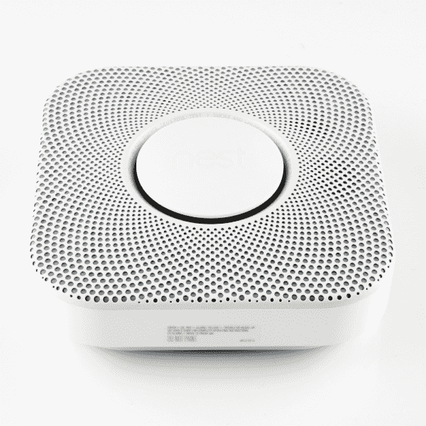](https://cdn.sparkfun.com/assets/f/1/5/8/9/52cd7919ce395fc93e8b456b.jpg)

对于一个简单的烟雾探测器来说，这听起来可能太自动化了(在某些情况下，它很可能是)，但是，无论你是否想要在你的房子里有一个，你都必须承认 Nest Protect 是一个令人印象深刻的硬件，我们迫不及待地想了解它是如何工作的！

## 闯入

将设备翻转过来，你会注意到有一些有趣的东西很突出。首先，我从未拥有过带 USB 接口的烟雾报警器。此外，似乎没有任何隐藏的螺丝，可能是因为你实际上必须移除这个后盖才能更换电池。所以第一步是拧下螺丝，取下盖子。

[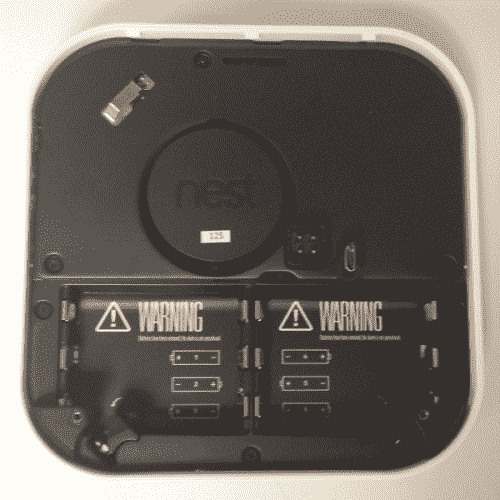](https://cdn.sparkfun.com/assets/e/1/1/a/1/52cdc94cce395fbe4c8b4569.jpg)

弹出盖子，并删除电池显示某种 4 位连接器以及光学烟雾传感器的检测室。你还可以看到一个手指开关，根据后盖，它会擦除所有设置。然而更重要的是，有更多的螺丝钉！在这一点上，我必须表达我的喜悦，Nest 已经选择不使用一些愚蠢的防篡改紧固件或隐藏在保修贴纸下的所有螺钉。

[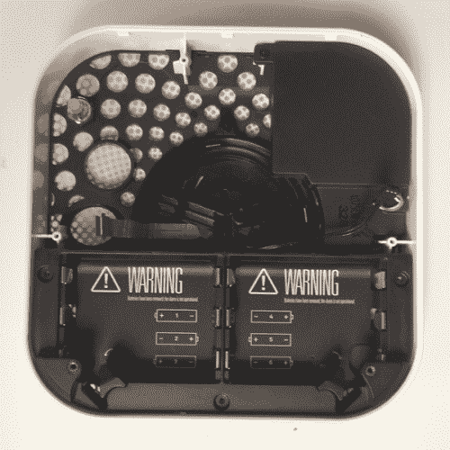](https://cdn.sparkfun.com/assets/0/4/7/a/3/52cdca98ce395fcc4f8b4567.jpg)

也就是说，在我将主板从机箱中撬出来之前，拉这些螺钉实际上并没有什么帮助。这是所有行动的地方，所以我们将回到它后，我们已经剥离了所有其他案件。随着主板的方式，电池座仍然不会让步，除非首先删除扬声器。扬声器用一个螺丝连接到外壳上，通过一个易碎的小 2 位连接器连接到主板上。

[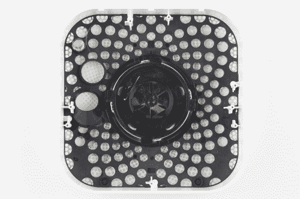](https://cdn.sparkfun.com/assets/5/2/8/8/9/52f43f3fce395fcc238b4568.jpg)

卸下扬声器后，电池盒会弹出，只留下外壳前面的 Nest 按钮。这需要一些撬力，但按钮前面的塑料盖最终还是脱落了，这不仅是一个有吸引力的设计特征，而且还是一个[菲涅耳透镜](http://en.wikipedia.org/wiki/Fresnel_lens)！它可能对可见光不透明，但它非常适合底层 PIR 传感器。

[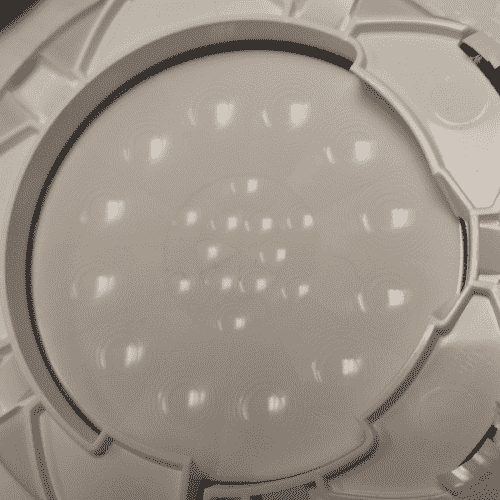](https://cdn.sparkfun.com/assets/8/f/d/0/b/52cdca98ce395f974a8b456b.jpg)

容纳 PIR 传感器以及 RGB LEDs 和“Nest”按钮开关的柔性板粘在塑料外壳上，但轻轻一撬就能打开。

[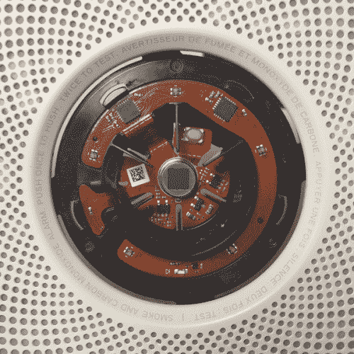](https://cdn.sparkfun.com/assets/8/2/4/4/e/52cdca98ce395f0b448b4568.jpg)

好了，现在我们已经把各部分分开了，让我们看看我们在处理什么:

[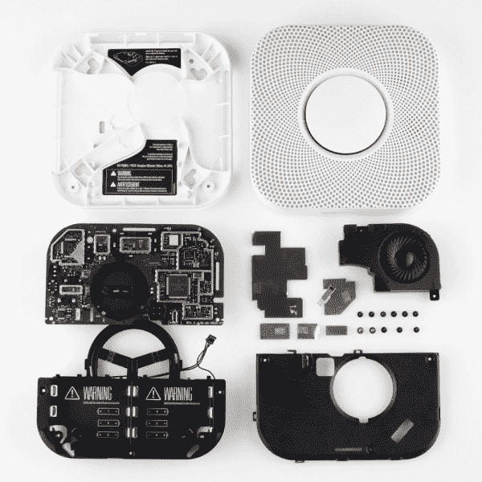](https://cdn.sparkfun.com/assets/8/8/d/8/d/52cd791bce395f673f8b4567.jpg)

看哪！鸟巢用它赤裸裸的荣耀保护着！现在我们进去了，让我们仔细看看建筑...

## 巧妙的圈地技巧

在查看电子器件之前，让我们先来欣赏一下这个外壳的巧妙设计。我把它分成了几个我欣赏的功能，它们对设备的形式和功能都有贡献。

### 通风设备

当烟雾探测器只发出哔哔声时，将所有东西打包成一个相当标准的尺寸已经够难的了。这台成熟的电脑必须和你的旧烟雾探测器放在同一个空间里，并且仍然允许烟雾进入里面电子小发明的致密砖块后面。这是通过结合 PCB 和外壳布局实现的。首先，为了节省空间，Nest Protect 使用了定制的光电烟雾探测器，它是通过 PCB 上的一个孔构建的。这使得传感器的电气部分位于电路板的“传感器侧”,而检测室位于天花板侧。通过构建电路板，他们还节省了一些垂直空间，从而使设备保持纤薄。

您会注意到的另一件事是，该设备的天花板侧沿周边通风，一系列挡板模制在背板中，将空气引入检测室，而不允许安装凸片干扰气流。毕竟，烟雾探测器只有在烟雾能够进入的情况下才会起作用。

### 隐形传感器

尽管装有传感器，但 Nest Protect 在某种程度上避免了看起来像某种先进的间谍无人机。事实上，看看 Protect 的表面，你想知道它到底是如何工作的是情有可原的。它看起来有点像内部通话扬声器，中间有一个页面按钮，但在友好的穿孔外观背后是一小群需要看透外部世界的组件。

PCB 嵌入 Protect 前面板的方式非常巧妙。就在烤架后面有一个塑料挡板，将输入引导到所有的传感器。夹在格栅和挡板之间的是一个细网，可以防止灰尘进入电路，但允许一氧化碳进入检测器，声音从扬声器中发出。

塑料传感器挡板耦合到一对超声波传感器，大概是为了避免外壳内部的奇怪回声干扰它们的操作。还有一个光导管，可以将设备外部的环境光直接聚焦到板上的光传感器上。这个挡板还支持我所说的“按钮蜘蛛”，这是一部分漂浮在细塑料腿上的塑料，允许你按下中央按钮，同时减轻开关本身的一些机械压力。实际上，那有它自己的一段...

### 纽扣蜘蛛

虽然从技术上来说，这是一块与挡板相同的塑料，但它展示了自己的一些聪明之处。通过将 LED 环连接到实际的塑料按钮件上，这一部分对 Protect 的 [HAL9000 式](http://en.wikipedia.org/wiki/HAL_9000)外观有着重要的贡献。“Nest”按钮卡在蜘蛛的正面，后面是 LED 环形电子设备。一个鳍状物系统被模制在里面，以防止按钮在你按下时变形(尽管似乎故意留了一点点弹性，因为它使按钮感觉更友好)。这些鳍片还将 flexPCB 锁定在适当的位置，使其无法旋转，并从将其固定在蜘蛛网上的粘性胶水中释放出来。最后，蜘蛛的内表面具有将开关保持在按钮背面的特征。哦，是的，蜘蛛还有一个特点，它保持了 PIR 传感器和一个很酷的部件之间的适当间距，我给了它一个德语复合词:Die Objektivtaste。

### “死亡目标”

或英语中的“Lensbutton”(也是一个虚构的词)，是从设备前面可以看到的按钮盖。这种橡胶塑料圆盘使按钮开关更具吸引力，显示设备的品牌名称，并且是设计的视觉焦点。讽刺的是，除了作为视觉焦点，它还是一个镜头。我知道，你在想，“那不是镜头！我看不透！，“而且你说得对，你大概不能。不过后面的 PIR 传感器就没有这个麻烦了。从设备上取下镜头按钮并翻转它，会显示出塑料中模制的菲涅耳透镜配置。真的，看着你自己在里面的倒影，真是千变万化。你会从其他 PIR/镜头模块中认出这种配置和乳白色，比如这个！

### 酷酷的扬声器

我真的很想找到这些扬声器模块的来源。它只是一个小塑料盒里的塑料扬声器，而且很棒！它听起来比实际要大得多(塑料外壳的一个功能)，但这也与声音和语音效果可能是根据这个公认有点塑料声音的扬声器的频率响应定制的这一事实有很大关系。让这成为一个教训:任何扬声器的 50%是你放进去的盒子！

### 定制光电探测器

正如我之前提到的，Protect 中的光电烟雾探测器似乎是他们为这个单元设计的，而不是现成的设备。它由两个塑料部件组成:其中一个装有发射器/探测器对，另一个充当光学室。这些设备的工作原理是将一束光投射到一个小室中，并通过一个探测器。当没有烟时，光会直接通过，但当有烟时，它会将一部分光散射到探测器中。作为一种安全器件，这种器件需要满足严格的标准，人们可能会购买一种他们知道可以编码的单芯片器件，并将其融入设计中。自己设计以节省空间？干得好。

## 传感器寻宝游戏

现在，我们回到主板，寻找人们可能会在这样的设备中期望的所有传感器。不管怎样，巢穴保护需要知道以下信息:

*   房间里有烟吗？(显然)
*   房间里有一氧化碳吗？(显然)
*   有人站在我下面吗？(“路径灯”功能)
*   有人在向我招手吗？(“抬头”功能)
*   灯亮着吗？(“夜间承诺”功能)

该产品的亚马逊清单实际上有一个传感器包装的总结，它声称 Protect 拥有以下传感器:

*   光电烟雾传感器
*   一氧化碳传感器
*   热传感器
*   三个活动传感器(有点模糊，但还好)
*   环境传感器(你知道，感知环境)

所以总而言之，我们应该找到足够多的嵌入式设备来实现上述功能。这至少需要一个控制器来处理所有数据。哦，对了，至少有一台收音机可以上网。

适当的屏蔽对 Nest 的好人很重要...很显然。这块板上有这么多小盾，他们还不如用箔纸把它包起来。使用一个小的平头螺丝刀，我像打开一个小小的符合 FCC 标准的圣诞礼物一样打开了所有的屏蔽。就像圣诞节的早晨一样，这是一次积极的整体体验，夹杂着困惑和喜悦。请看:

[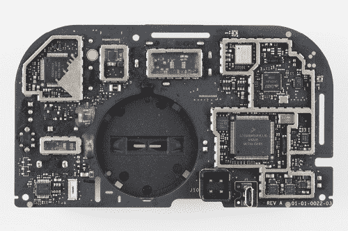](https://cdn.sparkfun.com/assets/a/c/2/0/e/52f43f45ce395f8e448b4567.jpg)

### 控制器和无线电 IC

让我们从电路板上最大的封装开始，然后逆时针旋转:

[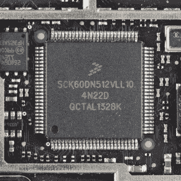](https://cdn.sparkfun.com/assets/6/c/2/e/c/52f44b04ce395f5c7a8b4567.jpg)*You're up first, big guy.*

如果我不得不猜测，纯粹基于针的数量，这是大脑的操作。谷歌告诉我，我们在这里看到的是一款 [Freescale Kinetis K60](https://cdn.sparkfun.com/assets/c/c/8/e/d/52a8c005757b7f4b738b456c.pdf) ，这是一款基于 ARM Cortex 的 32 位 MCU，拥有一系列外设，包括 USB 和以太网。零件号显示闪存大小为 512K，但他们似乎在旁边增加了一块独立内存。

[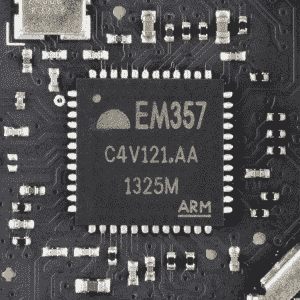](https://cdn.sparkfun.com/assets/3/d/4/3/1/52f44b06ce395f440c8b4567.jpg)*I see a crystal and an antenna. This is a radio.*

电路板一角的两个微型 rf 连接器暗示存在两个独立的无线电，EM357 是其中的一半。 [EM357](https://cdn.sparkfun.com/assets/5/7/7/1/b/52a8c007757b7f75218b4569.pdf) 是一款 ZigBee 无线电 SoC，采用 32 位 ARM Cortex 处理器、2.4GHz 收发器和一系列 GPIO。等等，我以为这个东西应该连接到我的无线网络，那么这个 ZigBee 无线电是干什么用的？如果你还记得我们的 [Nest 恒温器拆卸](https://www.sparkfun.com/tutorials/334)，你可能还记得内特在那个产品中发现了一个 ZigBee 无线电，所以我们期待看到这个。ZigBee 不仅允许 Nest 产品相互对话，而且为它们与未来的家庭自动化产品通信敞开了大门。除了作为一个流行的公共波段标准，ZigBee 与 WiFi 共存也没有问题。这提醒了我...

[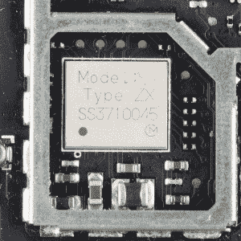](https://cdn.sparkfun.com/assets/b/5/f/3/3/52f44b04ce395f347d8b4567.jpg)*Moar Radio*

啊，是的，无线收音机！我们现在看到的是 [muRata Type ZX WiFi 模块](http://www.murata-ws.com/products/spec_sheet.php?type=Type%20ZX%202.4GHz%20Wi-Fi%20802.11b/g/n&record=30)，一个内置 Broadcom 芯片组、晶体、射频滤波器和无源器件的 b/g/n WiFi 模块。考虑到它最长的边只有 7 毫米，还不错。除非你是 MuRata 的直接客户，否则看起来没有数据表可用，所以这就是我们所知道的全部内容。

[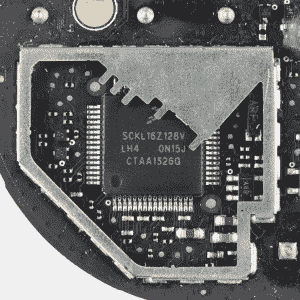](https://cdn.sparkfun.com/assets/8/e/7/d/6/52f44b03ce395f09778b4568.jpg)*You aren't trying to hide from me are you?*

对于那些正在计算的人来说，这是我们在拆卸过程中遇到的第三个 ARM Cortex 内核。这次它被埋在另一个飞思卡尔 MCU 中，具体来说就是[飞思卡尔 K16](https://cdn.sparkfun.com/assets/9/7/d/1/6/52a8c006757b7f692f8b4568.pdf) 。我不敢妄加猜测这个 MCU 的工作是什么。它位于压电报警器和关键传感器附近，因此它可能处理与“便利”功能分开的关键安全功能。

### 传感器

但是等等，这东西上不是应该有一堆传感器吗？他们都藏在哪里？是时候把这东西翻过来看看另一面了。从一氧化碳检测管开始，这次顺时针方向移动:

[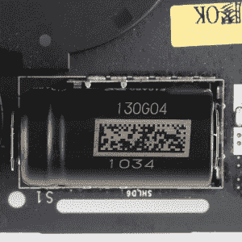](https://cdn.sparkfun.com/assets/9/3/f/5/a/52f44b04ce395f3a2b8b4568.jpg)*This thing could save your life?*

这是一个看起来很无聊的组件，它可以警告你一个看不见的威胁...不，不是忍者，是一氧化碳中毒！移除屏蔽后发现，这个组件是一个[费加罗 TGS-5342 一氧化碳传感器](https://cdn.sparkfun.com/assets/8/4/3/e/f/52a8c005757b7f292e8b456c.pdf)，一个来自日本费加罗工程公司的电化学探测器。我不会切开它来确认，但这东西可能充满了硫酸！很酷吧。原来，电化学一氧化碳探测器实际上是以一氧化碳为燃料的燃料电池。一氧化碳在一端被氧化成二氧化碳，氧气在另一端被消耗，于是产生了电流。产生的电流量与电池中 CO 的浓度成比例，这使得它不仅能够发出一氧化碳存在的信号，而且能够对其进行量化。

[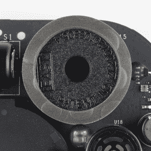](https://cdn.sparkfun.com/assets/e/4/6/f/f/52f44b03ce395fb0778b4568.jpg)*Loud things come in small packages*

这是你的标准，普通的压电警报器。这些东西声音很大，很吵，会伤到耳朵。它们也是商品的一部分，这个没有什么特别的。我不得不搜索设备上的专利号，只是为了找到一些基本的规格，但你可以在任何地方买到这些。

[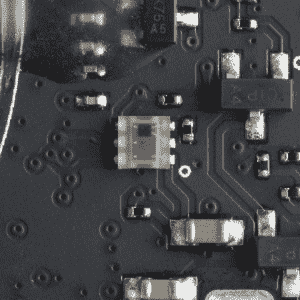](https://cdn.sparkfun.com/assets/3/a/1/b/5/52f44b01ce395fa23d8b4567.jpg)*I know what it is but I don't think there's a part number on it...*

就像试图从模糊的银行监控录像中辨认出一名劫匪一样，试图追踪这种光传感器的制造商是一个漫长而艰难的过程，而且运气不好。我不能给你这个部分的任何规格，除了说它很小，似乎有 6 个引脚，可能是也可能不是彩色光探测器。

[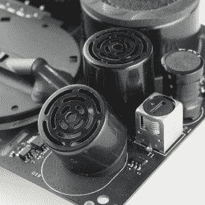](https://cdn.sparkfun.com/assets/2/b/f/5/9/52f44b00ce395fcc798b4569.jpg)*These guys look [familiar](https://www.sparkfun.com/products/8502)*

啊，是的，超声波传感器的形状。我想这些家伙是用来确定你是否在向这个单位挥手的，因为 PIR 传感器可能不太适用。奇怪的是，两者兼而有之。我不能确定是谁做的，所以我不确定光束的宽度应该是多少。安全地说，它与“路径灯”或“抬头”功能有关。如果他们想要升级固件和增加交互性，这是一个方便的设备。

[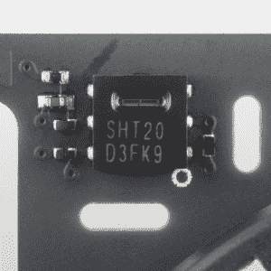](https://cdn.sparkfun.com/assets/f/0/7/5/7/52f44afece395f82758b4567.jpg)*These guys also look [familiar](https://www.sparkfun.com/products/8227)*

这不是我们的老朋友 SHT20 吗。我们为同一系列的另一款设备提供分线板。我们喜欢这些，它们无处不在。小巧、便宜、可靠。我不确定温度和湿度数据是否有助于确定威胁的存在，校准其他传感器，或者当你为恒温器制作外围设备时，它是否只是一个好数据。通过控制您的 HVAC 的同一台计算机可以访问您房子中几个房间的温度和湿度？这可以允许一些很酷的功能。

[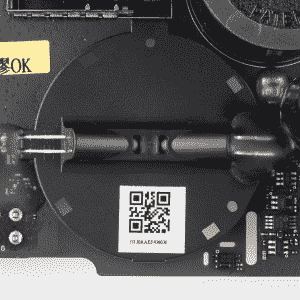](https://cdn.sparkfun.com/assets/0/3/5/c/c/52f44b04ce395f847a8b456a.jpg)*Oooooh. Ahhhhh.*

这就是我之前说的光电感烟探测器。因为这是一个定制器件，所以没有可用的数据手册，很难识别他们使用的发射器/检测器对。我在这里只提到它是传感器封装的一部分，但恐怕它是电路板上少数几个过着非常私密生活的元件之一。

[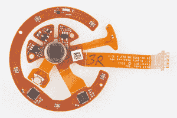](https://cdn.sparkfun.com/assets/f/6/0/6/0/52f44affce395f3c0a8b4569.jpg)*I'm afraid I can't do that.*

就像盯着一台冷漠无情的机器的眼睛，除了这台冷漠无情的机器能把你的家人从火灾中拯救出来。PIR sesnsor 没有任何识别标记，但赢得了最巧妙安装设备奖。干得好，皮尔，真的干得好。

## 数据表综述

这是我整理的数据手册和产品页面列表，如果您想了解更多有关 Protect 的信息，请参考。不是每个设备都有识别标记，即使这样，其中一些也没有很好的记录。不过，这些应该涵盖了大多数更奇特的部分:

*   [飞思卡尔 Kinetis K60](https://cdn.sparkfun.com/assets/c/c/8/e/d/52a8c005757b7f4b738b456c.pdf)
*   [飞思卡尔 K16](https://cdn.sparkfun.com/assets/9/7/d/1/6/52a8c006757b7f692f8b4568.pdf)
*   [EM357 ZigBee SoC](https://cdn.sparkfun.com/assets/5/7/7/1/b/52a8c007757b7f75218b4569.pdf)
*   [费加罗 TGS-5342 一氧化碳传感器](https://cdn.sparkfun.com/assets/8/4/3/e/f/52a8c005757b7f292e8b456c.pdf)
*   [村田式 ZX WiFi 模组](http://www.murata-ws.com/products/spec_sheet.php?type=Type%20ZX%202.4GHz%20Wi-Fi%20802.11b/g/n&record=30)
*   [被动红外传感器](http://epled-2008.en.made-in-china.com/product/DbZEXIchQCVw/China-Passive-Infared-PIR-Sensor.html)

我希望你喜欢这次拆卸。这是计算机变得如此廉价的又一个好例子。这个烟雾探测器的处理能力无疑是让我们登陆月球的计算机的数千倍...而且考虑到我在家不关电烙铁的习惯，这可能是一件好事。

## 资源和更进一步

更多拆卸的好处，看看这些其他 SparkFun 拆卸:

*   [Nest 恒温器拆卸](https://learn.sparkfun.com/tutorials/nest-thermostat-teardown-) -查看 SFE Nest 拆卸原图。
*   [LEAP Motion 拆卸](https://learn.sparkfun.com/tutorials/leap-motion-teardown)
*   [谷歌眼镜拆卸(SFE 赞助)](http://www.catwig.com/google-glass-teardown/)