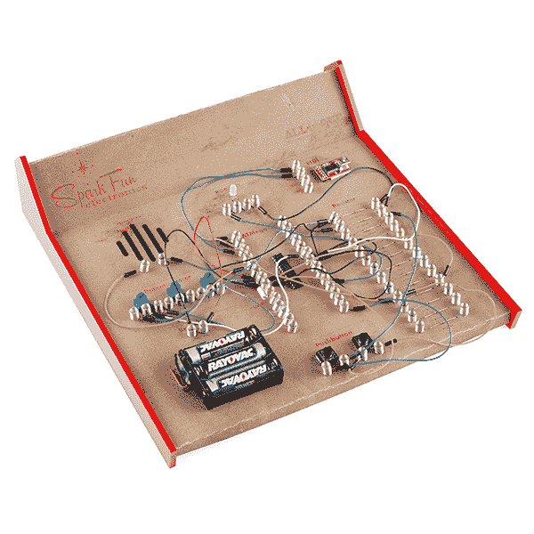
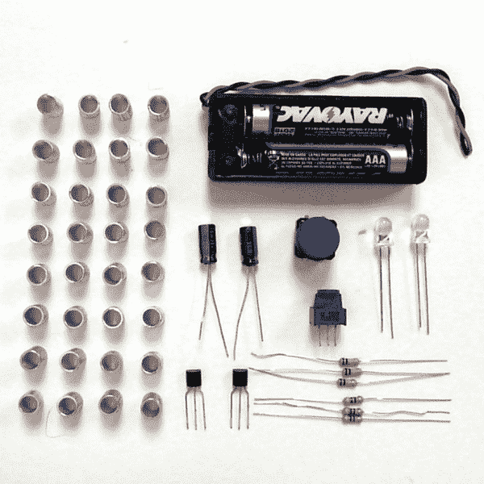

# 再造经典电子套件

> 原文：<https://learn.sparkfun.com/tutorials/recreating-classic-electronics-kits>

## 太空时代的科学乐趣！

你记得这些吗？曾几何时，这些电子套件承诺“一次完成 1000 个实验！”而且很少失败。很久以前，他们教了我如何构建电路的基础知识。

纸板“一体化”电子套件的显著特点是弹簧连接器。通过弯曲弹簧，在线圈之间插入一根跳线，然后松开，电路就接通了。弹簧的压力将与跳线建立电连接，您可以在任何一个弹簧上放置多根电线。电路板上的每个元件都被拆分成一组弹簧连接器，这使得年轻的发明家无需焊接或绕线即可设计和构建电路。

我们最近在 SparkFun 总部怀旧起来，开始销售那些弹簧连接器。好吧，它碰巧抓住了我，我正沉迷于纸板模型，所以没过多久我就做了一个闪闪发光的复古电子套件。完成后，我意识到这仍然是一个玩电路的好方法，因为它们的布局方式真的会引起实验。“我想知道如果我把这些东西串联起来会怎么样”试试看！反正只要几秒钟！

因此，为了保存历史和分享魔力，以下是你如何打造自己的一体式跳板套件的方法。我们将组装一个简化的工具包，比你上面看到的部件少，但它应该给你设计自己的所需的所有知识。为你自己或为你生命中的年轻发明家建造它！

### 推荐阅读

在开始这个项目之前，请确保您已经很好地理解了下面提到的概念。

*   [什么是电路？](https://learn.sparkfun.com/tutorials/what-is-a-circuit) -要建立自己的回路，你首先需要知道什么是回路。
*   [VIR 和欧姆定律](https://learn.sparkfun.com/tutorials/voltage-current-resistance-and-ohms-law) -使用欧姆定律帮助你计算 led 的电阻值等等。
*   [如何使用万用表](https://learn.sparkfun.com/tutorials/how-to-use-a-multimeter) -万用表上的连续性设置是确保弹簧连接良好的一个好方法。
*   [极性](https://learn.sparkfun.com/tutorials/polarity) -确保那些极性部分以正确的方式前进。
*   [用金属丝工作](https://learn.sparkfun.com/tutorials/working-with-wire) -你需要用金属丝来连接弹簧。
*   [连接器基础知识](https://learn.sparkfun.com/tutorials/connector-basics) -了解可以添加到套件中的连接器。
*   [如何焊接](https://learn.sparkfun.com/tutorials/how-to-solder-through-hole-soldering) -建造这个项目不需要焊接。然而，焊接连接会增加套件的耐用性和使用寿命。

## 收集零件

你需要做的第一件事是收集所有你想放在工具包里的组件。我已经选择了足够的零件来制造一个基于晶体管的 LED 闪光灯。在设计您的套件时，请广泛考虑，并添加足够的部件来完成广泛的实验。

除了电子元件，你还需要制作材料。成套工具的主体将由硬纸板制成。你可以在任何艺术用品店买到硬纸板。厚度并不重要:它只需要足够厚以保持其形状，但不要厚到难以将弹簧放入其中。你还需要一些材料来制作两边的腿。丙烯酸，木材，苯乙烯，纸板，任何坚硬的东西都可以。使用任何你能使用的设备。最后，你需要一些热胶水来融合两者。哦，也许用什么东西来切割，业余爱好刀是完美的。我作弊(像往常一样)用了激光切割机。

这是一份材料清单: