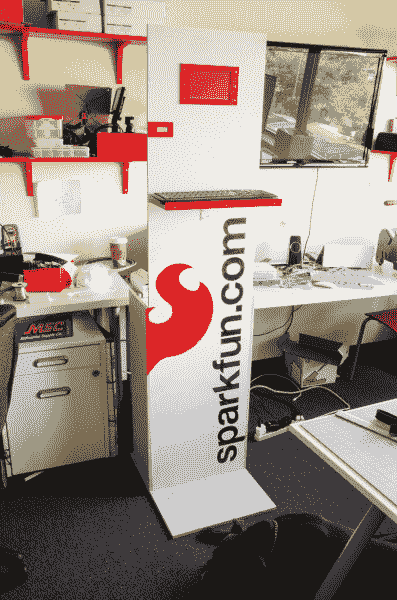
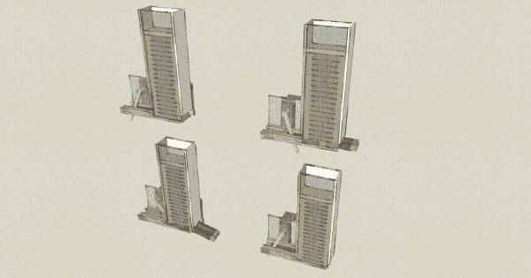
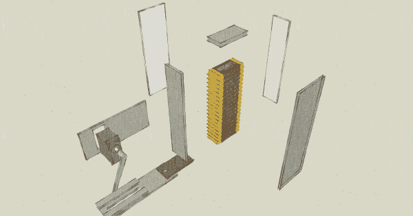
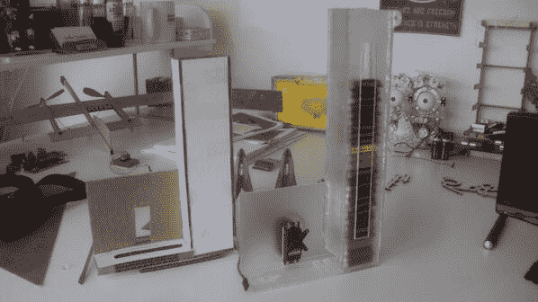
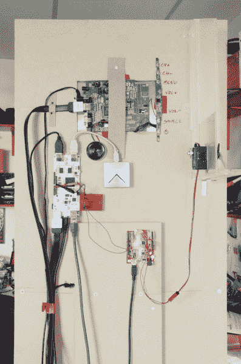

# pcDuino 众包信息亭

> 原文：<https://learn.sparkfun.com/tutorials/pcduino-crowdsource-kiosk>

## “将工作 4 糖果”

[](https://cdn.sparkfun.com/assets/8/0/f/d/f/5230a151757b7f3b2d8b4567.jpg)

当我负责构建一个展示 [pcDuino 开发板](https://www.sparkfun.com/products/11712)的项目时，一开始我被难住了。这块小小的主板功能如此强大，就像是让你做一个如何使用台式电脑的演示。我知道使 pcDuino 与众不同的特性是它与硬件接口的简易性，我也想加入某种软件接口。我认为建造一台自动售货机是最好的。但是用钱支付很无聊，如果我能让人们用工作来支付呢？

于是 pcDuino 众包亭诞生了。只需走到机器前，完成一些弹出的表格，你就会得到一口美味巧克力的奖励！这个构建有几个主要组件，所以我将带您了解每一部分。Crowdsource Kiosk 最棒的一点是，你可以为任何需要完成的任务编写程序，只要你有足够的巧克力(和足够多的巧克力上瘾者)，你就一定会得到结果！

### 推荐阅读

在开始学习本项目教程之前，如果您还不熟悉下面的概念，您可能想熟悉一下。

*   [开始使用 pcDuino](https://learn.sparkfun.com/tutorials/pcduino-hookup-guide)
*   [对 pcDuino 进行编程](https://learn.sparkfun.com/tutorials/programming-the-pcduino)

## 巧克力自动售货机

我开始这个项目是通过设计一个重力进料漏斗，可以一次分配一个好时的迷你。我选择好时的迷你酒吧，因为它们很小，大小相对统一。

每当我设计一个硬件的时候，我都是从 SketchUp 开始的。这是我画的画:

[](https://cdn.sparkfun.com/assets/f/8/d/9/a/522235aa757b7f19678b4567.jpg)*This drawing shows the dispenser stepping through one ejection cycle.*[](https://cdn.sparkfun.com/assets/3/c/b/3/6/522235aa757b7fc27f8b4569.jpg)*Here's an exploded view, this helped me when building the physical object.*
A servo driven solution seemed to be the most robust approach. My design incorporates a card-shaped pusher moving inside a channel to eject the bottom chocolate bar on the stack. As the servo sweeps counter-clockwise, the push-card slides a chocolate bar through an opening in the front of the hopper. When the servo sweeps clockwise, the card returns to its home position behind the hopper, and the stack of chocolate is allowed to fall in the hopper, thus resetting the mechanism.

这看起来很简单，但是在我投入任何材料之前，我用纸板做了一个原型。在从纸板转换到更坚硬的材料(在这种情况下:丙烯酸)时有一些小问题，但它工作得很好！这是我的纸板原型和我最终的丙烯酸部件并排的照片:

[](https://cdn.sparkfun.com/assets/f/a/9/5/7/52223918757b7fb6668b4567.jpg)*The acrylic mechanism turned out larger because the material is thicker and also in order to increase capacity. Note the mounting tabs on the final mechanism!*

基于伺服的机制非常可靠。不幸的是，由于操作系统的限制，pcDuino 伺服库就不一样了。为了补救这种情况，我决定把 pcDuino 的伺服脉冲的负担去掉，并在我的分配器中加入了一个 SparkFun RedBoard。RedBoard 上的代码非常简单:只要某个特定引脚被拉低，它就会向一个方向扫描伺服系统，延迟几毫秒，然后将伺服系统返回到其起始位置。所有 pcDuino 现在需要做的就是拉下那个红纸板针来分发巧克力！

在我们进入 pcDuino 方面的事情之前，让我们谈谈这整个事情将如何封闭...

## 亭子

我从机场信息亭这样的地方获得了围栏的灵感。现代信息亭本质上只是隐藏了所有重要信息的独立计算机。使用 pcDuino 作为我的电脑给了我很大的自由来设计这个东西，因为它足够小，很容易隐藏。对于显示器，我选择了我们的 [7" LCD 显示器](https://www.sparkfun.com/products/11612),因为它很容易连接到 pcDuino，而且非常轻便。

我选择中密度纤维板作为我的材料，因为它便宜，也因为它提供了一个光滑的表面。我在当地的五金店买了一张 4x8 '的 MDF，然后把它拖回了商店。我只需要一个直立的面板来安装显示器，一个键盘架和一个足够坚固的底座来防止它翻倒。我选择了最简单的形状，一个倒置的“T”形，用一些支架来保持它的刚性。

所有的东西都是用螺丝钉和胶水组装的。一个角钢被用来悬挂键盘架，并给它一些加固。丙烯酸挡板被切割成显示器和巧克力分配器。我拆开显示器，把液晶显示屏拉出来，这样我就可以把它平齐地安装在信息亭的前面。

[](https://cdn.sparkfun.com/assets/b/9/0/8/3/5230a151757b7f252d8b4567.jpg)

一旦所有东西都沿着电路板背面安装好，就需要通电了。因为我不想占用房间里的所有插座，所以我把电源板扔了进去。毕竟，Redboard、pcDuino 和 LCD 显示器都有单独的插头。

由于它将生活在办公室的(半)受控环境中，我决定信息亭的背面不需要保护罩来防止篡改。不过，我确实用了一些方便的泡沫双面胶带来固定键盘。

最后，所有的东西都涂上了一层白漆，还有一个闪闪发光的模板。中密度纤维板不喜欢吸收油漆，它会直接吸收油漆，所以用乙烯包装之类的东西来层压它可能更有意义。没人有时间做这个，所以我就不停地往上面扔颜料。

## 界面:学习 Python

完成构建的硬件部分后，我继续处理软件部分。kiosk 的 GUI 需要满足一些基本标准:

*   易于导航
*   能够将表单保存到文件中
*   难以退出
*   难以破解(形成注入攻击等。)
*   跨平台(所以我可以在我的 Windows 机器上开发)

我需要一种语言或工具，使这个 GUI(相对)组装起来不费力。从那以后，我再也没有做过任何非 Arduino 编程...嗯...基础？所以，现在是我学习一门新语言的时候了，我知道我需要的就是这门语言:Python。

为什么是 Python？因为 Python 无所不能。嗯，好吧，不是什么东西，但它是一种非常好的语言，可以用来“敲打”一个快速的应用程序。还有一个巨大的库集合可用于将 Python 与各种东西挂钩。更不用说它是跨平台的，所以我可以在我的 Windows 机器上进行所有的开发，并在 pcDuino 上加载相同的脚本，没有任何问题。

有时候，学习一门新的编程语言的最好方法就是全身心地投入到你的项目中。找到一些你认为你会需要的库，打开所有的示例代码，并开始把它拆开。如果你从头到尾阅读一个脚本，用谷歌查找任何你不理解的东西，你最终会对语法和方法有一个工作理解。从那以后，一切都是老一套:编写、运行、出错、调试。虽然如果你只是从 C 语言转移到 Python，它更像是:写，运行，'真的，这工作，嗯？'

我首先使用 easyGUI，这是一个名副其实的 python 库，它可以插入 TkInter(Tk GUI 工具包的 Python 绑定),使显示和导航简单表单变得非常容易。没有 easyGUI，你可以做我做的所有事情，但不会那么容易...图像使用者界面...(我在哪里？)

从 Python 中控制 pcDuino GPIO 也非常容易。本质上，你只是打开一个文件，改变一个值，这真的很简单。我从一个示例中复制/粘贴了一些代码，它将一些定义放在脚本的顶部，允许您使用 HIGH、LOW、INPUT、OUTPUT 等，而不必记住每个值代表什么。

我将继续把我的代码分块贴在下面(不一定按照书写顺序，而是按照功能顺序)，然后试着解释每一部分，以方便不熟悉 Python 的人。我应该提醒任何熟悉*的人，我通常用 C 语言编码，所以我的 Python 不是很好...Pythonic 式的？不过，它确实有用。*

好的，我们首先要做一些设置:

```
language:python
import easygui as eg
import time, os

# patch rootWindowPosition
eg.rootWindowPosition = "+180+20" 
```

这对 Arduino 程序员来说应该不会太可怕。只是导入一些库，就像你使用“include”一样。我已经解释了 easyGUI 库，但是时间库只是给了我在代码中添加延迟的能力。

一个补丁的丑陋之处是我从一段设置 GUI 窗口位置的示例代码中偷出来的。我在使用窗口管理器时遇到了麻烦，不管所有的东西是否都在屏幕上，我都只能把它放在它想放的地方。顺便说一下，在 Python 中,#表示注释的开始。

接下来要做的是准备好 GPIO！

```
language:python
GPIO_MODE_PATH= os.path.normpath('/sys/devices/virtual/misc/gpio/mode/')
GPIO_PIN_PATH=os.path.normpath('/sys/devices/virtual/misc/gpio/pin/')
GPIO_FILENAME="gpio"

pinMode = []
pinData = []

HIGH = "1"
LOW =  "0"
INPUT = "0"
OUTPUT = "1"
INPUT_PU = "8"

for i in range(0,18):
    pinMode.append(os.path.join(GPIO_MODE_PATH, 'gpio'+str(i)))
    pinData.append(os.path.join(GPIO_PIN_PATH, 'gpio'+str(i)))

for pin in pinMode:
    file = open(pin, 'r+')  ## open the file in r/w mode
    file.write(OUTPUT)      ## set the mode of the pin
    file.close()            ## IMPORTANT- must close file to make changes!

for pin in pinData:
    file = open(pin, 'r+')
    file.write(LOW)
    file.close() 
```

所有这些都是从一个示例脚本中窃取的。它基本上告诉 Python GPIO 控制 pin 文件保存在 pcDuino 的什么地方。然后，它定义高电平和输入等术语，然后使用一系列“for”循环将 GPIO 引脚设置为已知状态。

如果你是一个 Arduino 程序员，那么你现在可能已经注意到了一些疯狂的事情:没有任何分号！还是花括号！这个世界疯了吗？？嗯，是的，但不是因为缺少标点符号。Python 是靠缩进来支配的。代码块通过缩进级别来分隔。

好了，我们都完成设置了。让我们在屏幕上看到一些东西:

```
language:python
while(1):

    mainTurk()

def mainTurk():
    x = str(eg.buttonbox("", title="Chocolate Turk", image="screen1.jpg", choices = ["Gimme Candy!", "Why?"]))

    if x == "Why?":
        msg = "Chocolate Turk is a Mechanical Turk problem-solver that rewards people with chocolate! \n \n It was built using the pcDuino as a demonstration of the device's capabilities. The control software and interface were programmed in Python with help from the EasyGUI and PIL libraries. \n \n A tutorial on how this project was completed will be made available on the SparkFun Learn site. \n \n Why not give MarComm a hand in advertising? There's chocolate in it for you ;) \n \n Imagined and Executed by: Nick P. \n \n"
        title = "About Chocolate Turk"
    choices = ["Return","Kill Program"]
        killer = eg.buttonbox(msg, title, choices=choices)    

        if killer == "Kill Program":
        sys.exit()
    else:
        pass
    else:
        chocoturk() 
```

“哇，哇，哇...什么？”我知道，如果你是一个 Arduino 程序员，这一开始看起来会很混乱。别担心，我们会解决的。首先，我启动 while(1)循环，这样 kiosk 程序就会一遍又一遍地运行。下一行是对 eg.buttonbox 的调用(如果你记得我们将 easyGUI 作为“eg”导入的话)，这是 easyGUI 中的一个方法，它创建了一个带有一些按钮的对话框。这是一行压缩代码，所以看起来有点奇怪，但是有一点可以帮助你弄清楚发生了什么:x 将保存被按下的按钮的值。如果你想知道 x 是从哪里来的，它不是！我们刚编出来的！没错，在 Python 中你不需要声明一个变量，你只需要开始使用它，Python 就会知道你想用它做什么。

接下来，我用函数调用“eg.buttonbox”的值的字符串版本填充 x。这个函数有几个参数:窗口的标题、我想要显示的图像的名称以及我想要可用的选项。当这个字符串执行时，一个名为“巧克力土耳其人”的窗口弹出，显示从 screen1.jpg 检索的图像和两个标签为“给我糖果！”以及“为什么？”。单击其中一个按钮后，该函数将选择返回给 str()，str 将其“字符串化”并填充到 x 中。

下一步是测试 x，如果 x 等于“为什么？”(换句话说，如果“为什么？”按钮被按下)然后我弹出一个解释该项目的屏幕。为了给你一个扩展的例子，我忽略了把这些都写在一行。你可以看到，在调用 eg.buttonbox 之前，我实际上填充了每个变量，我称返回变量为“killer ”,因为这是程序中唯一杀死它的地方。单击窗口上的“x”甚至不能做到这一点，因为我没有编写任何东西来处理它。这是一件好事，我不希望人们退出我的 kiosk 上的 GUI。

后面的 else 语句只是处理如果你按下“给我糖果！”当然，它会转储到下一个函数中，如下所示:

```
language:python
def chocoturk():
    msg     = "Pick a product that you feel pretty familiar with:"
    title   = "Pick a card"
    choices = ["pcDuino", "IOIO-OTG", "SparkFun Inventors Kit for Arduino with Retail Case", "Makey Makey - Standard Kit", "LilyPad Arduino Simple Board", "Raspberry Pi - Model B", "9 Degrees of Freedom - Razor IMU", "RedBoard - Programmed with Arduino", "XBee Explorer USB", "EasyDriver Stepper Motor Driver"]
    choic   = eg.choicebox(msg, title, choices)

    if choic == None:
        return

    image   = "%s.jpg" % choic
    msg     = "Wanna write an ad for the %s?" % choic
    choices = ["Let's Do it!","Wait, go back!"]
    reply   = eg.buttonbox(msg,image=image,choices=choices)

    if reply == "Wait, go back!":
        return 
    else:
    val=["","","",""]
        composer(choic, val)

    return 
```

我需要用户做的第一件事是选择我们最畅销的产品之一，所以我将它们排列在 easyGUI 所谓的选择框中。用户选择产品后，我有机会变得聪明一点。我用产品名称作为文件名保存了每个产品的图片。所以当我去为下一个窗口检索图片时，我只是砰地一声”。jpg "放到答案的末尾，从 choicebox 放到 buttonbox 的 image 参数中。

我还给用户一个机会，如果他们想的话，可以通过返回函数来改变他们的想法。如果他们确认他们想继续，那么我进入下一个功能，作曲家功能。

```
language:python
def composer(product, retainVal):
    msg         = "Write the AdWords copy for the %s \n \n Formatting: \n \n -Headline \n Limited to 25 characters. Links to the product page. \n \n -Description \n You get 2 lines of 35 characters each to describe a SparkFun product to a targeted shopper using Google search \n \n -Keywords: \n What 5 search terms or phrases when typed into Google, should return your ad? (comma-separated) \n \n" % product
    title       = "AdWords Composer"
    fieldNames  = ["Headline","Description Line 1","Description Line 2","Keywords"]
    fieldValues = [retainVal[0], retainVal[1], retainVal[2], retainVal[3]]
    fieldValues = eg.multenterbox(msg, title, fieldNames, fieldValues)

    if fieldValues == None:
        return

    if len(fieldValues[0]) > 25:
        eg.msgbox("You've got too many characters in your Headline. Pare it down.")
        composer(product, fieldValues)
    if len(fieldValues[1]) > 35:
        eg.msgbox("You've got too many characters in your Description (Line 1). Pare it down.")
        composer(product, fieldValues)
    if len(fieldValues[2]) > 35:
        eg.msgbox("You've got too many characters in your Description (Line 2). Pare it down.")
        composer(product, fieldValues)

    composereview(fieldValues, product)

    return 
```

作曲功能非常简单。我只需要用户输入一些文本，这是他们得到奖励的任务。如果你到现在还没弄明白，在 msg 的论证中有详细说明:*我们试图让我们营销部门以外的人来写广告文案。*由于理论上这些广告将以 AdWords 广告的形式出现，它们需要符合特定的格式。我添加了一些 if 语句，在奖励用户之前检查每个字段的字符长度。如果一个字段中有太多字符，我会让用户知道是哪一个，并把它们返回给表单。最后，如果他们成功地填写了表格，我会给他们一个机会来回顾他们在产品图片旁边写的内容:

```
language:python
def composereview(adcopy, prod):
    image   = "%s.jpg" % prod
    msg     = "Here's what you wrote about the %s: \n \n %s \n %s \n %s \n \n With the keywords: \n \n %s" % (prod, adcopy[0], adcopy[1], adcopy[2], adcopy[3])
    choices = ["Gimme Chocolate NAO!","Let me try again..."]
    reply   = eg.buttonbox(msg,image=image,choices=choices)

    if reply == "Let me try again...":
        composer(prod, adcopy)
    else:
        f = open('AdWordsDump.txt', 'a')
        f.write(prod)
        f.write('\n')
        f.write(adcopy[0])
        f.write('\n')     
        f.write(adcopy[1])
        f.write('\n')     
        f.write(adcopy[2])
        f.write('\n')     
        f.write(adcopy[3])
        f.write('\n')
        f.write('\n')
        f.close()
        givethemthechocolate() 
```

“撰写评论”是一个简单的表单，我用撰写者传递的答案和一张产品图片填充，使用与产品选择窗口中相同的名称技巧。如果用户决定他们喜欢他们写的东西，我会把它保存到一个大的。txt 文件，我在其中存储了从 kiosk 收集的所有信息。哦，是的，我把它们转储到最后一个函数中:

```
language:python
def givethemthechocolate():

    file = open(pinData[6], 'r+')
    file.write(HIGH)
    time.sleep(1)
    file = open(pinData[6], 'r+')
    file.write(LOW)
    file.close()
    image   = "thanks.jpg"
    msg     = ""
    choices = ["Finish"]
    eg.buttonbox(msg,image=image,choices=choices)

    mainTurk() 
```

在这个函数中，我简单地向糖果分发器发送一个高脉冲，交出那颗甜甜的糖果。我还向用户展示了一个感谢图片，并返回到主屏幕。

## 田间试验

信息亭被战略性地放置在大楼的高流量区域:休息室。如果运气好的话，一部分来喝冰冻饮料的人也会有心情吃巧克力。我找到了一个开放的插座，将信息亭靠墙放置，启动我的 Python 脚本，然后走开。

我决定低调上市，让人们去发现它。这被证明是完美的，因为有足够多的人对它进行了修改，让我发现了需要调整的地方。首先，屏保在 5 分钟后启动，让人以为它已经关闭了。在纠正了这个问题之后，我开始注意到屏幕会留在 composer 形式。他们离糖果那么近，发生了什么？我四处打听了一下，结果发现发生了两种情况之一:要么他们在表单中输入了太多字符，得到了一条错误消息，然后返回到 composer，发现他们的工作被删除了；要么他们实际上是在糖果屏幕上，得到了他们的糖果，然后莫名其妙地被转回到 composer。

弄清楚发生了什么花了一些时间，老实说，我不确定我已经完全弄清楚了。当人们对程序流程没有和你一样的自上而下的观点时，他们能走多远是令人惊讶的。有些失败模式是你永远也想不出来的，躲在那条路上。通常，测试一个东西的最好方法就是让人们去玩它。

我做了一些软件上的调整，然后又把它放了出来。这一次，事情似乎进展得很顺利，所以我发出了一封群发邮件，通知人们这个报亭正等着分发美味的奖品，以换取短暂的工作。我确实从这个练习中得到了一些广告文案，但是我也得到了许多垃圾，甚至一些巧妙利用企图的证据...

## 结果

当信息亭在休息室里放置了大约两个星期后，我决定结束实验，把机器推回我的办公室，卸载文本文件并看一看。事实证明，并不是每个人都适合广告业...我在这里收集了一些更有趣的回答，以 AdWords 格式，供您欣赏:

首先，我们有一个不耐烦的志愿者，他似乎专注于巧克力奖励，使他/她无法真正完成广告:

> 树莓派-B 型 >树莓派是 da 炸弹>给我糖果>我能有糖果吗？>  

下一个广告开头写得相当好，虽然有点奇怪。然而，在 3 号线发生了一个有趣的转折，当它的神奇双能启动时:一个翻译糟糕的中国广告的形状:

> pcDuino
> 
> pcDuino 运行 Linux！
> 
> 它又聪明又漂亮！
> 
> Linux 让你快乐生活！
> 
> www.sparkfun.com/fakead

这里我们有另一个广告，它朝着正确的方向起飞，然后往南飞，可以这么说:

> pcDuino
> 
> 支持 Linux 和 Android 的单板计算机
> 
> 腹股沟非常好
> 
> www.sparkfun.com/fakead

下一个广告特别奇怪，因为作者似乎把这当成了取笑我的机会。令人费解的部分？这从未发生过，我真的不知道这个故事(可疑的可能性)从何而来:

>RedBoard——用 Arduino >编程尼克 P 是个笨蛋！他把自己锁在自己的车里。这很有趣。>  

我不得不承认，我有点喜欢这个去了哪里。在我从机器上收集的所有条目中，这是我最有可能运行的条目。在最后一行，从一个感叹号到两个感叹号，最后是三个感叹号，这是一种有条不紊的安慰。也就是说，你不太可能在野外看到这个广告:

> 用于 Arduino 的 SparkFun 发明家套件与零售案例 >计划您的邪恶帝国现在>建立！程序！！控制！！！>  

最后，我们自己的 Chris Taylor(或者我应该叫他鲍比·布茨？)决定在我的输入表单中添加一些 SQL。幸运的是，我的程序技术含量实在太低，根本不值得关注。没有 SQL 数据库可以使用，只有一个简单的 txt 文件吸收来自表单的任何内容:

>pcDuino>SELECT * FROM【姓名】>SELECT * FROM】>SELECT * FROM【日期】> SELECT * FROM *

因此...事实证明，你可以让人们在技术上为糖果工作。不幸的是，真的没有办法控制你将得到的反馈的质量。那么亭子现在会怎么样呢？它会坐在我的办公室里收集灰尘吗？当然不会！也许我会想出一个办法让它分发其他食物，然后把它送回休息室去收集黄色笑话。或者我会把它变成一个绿色信息亭来展示可持续发展数据。无论发生什么，这次我学到了一些东西，应该可以帮助我保持运作。希望你已经学到了一些东西，可以帮助你利用你朋友对糖果的热爱。