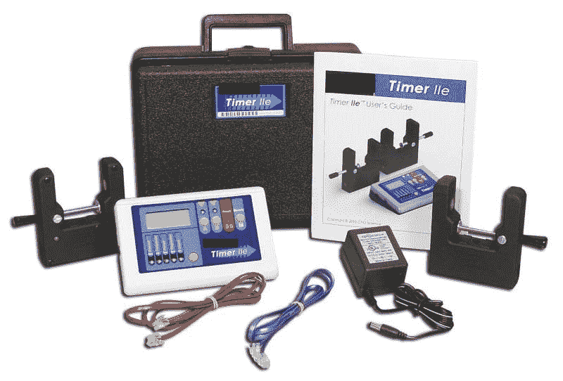

# 游标光电门

> 原文：<https://learn.sparkfun.com/tutorials/vernier-photogate>

## 介绍

在本项目教程中，我们将向您展示如何创建一个便宜但精确的光电门(类似于下图)，用于课堂应用，特别是物理实验。

这个项目开始于我为我的教室合著的[资助](http://www.aps.org/programs/education/highschool/teachers/pair.cfm)的一部分。这项名为*物理和教学资源* (PAIR)的资助旨在帮助支持需要内容或材料资源的物理教师。该基金将一名任课教师与一名物理专业人员配对，为课堂开发新的材料和资源。我想将 Arduino 与 LCD 屏幕集成在一起，创建一个像这样的手持 photogate 计时器:

这些智能定时器价格昂贵(每个 200-300 美元)，它们需要电源适配器，并且用户界面不可定制。凭借 Arduino 平台的灵活性和低成本，我们开始开发一种独特的解决方案，可以集成到高中一年级的[物理优先](http://en.wikipedia.org/wiki/Physics_First)计划中。我们学校可以使用大量的游标硬件和光电门，但这些设备的使用仅限于物理实验室，在那里我们有计算机来进行数据收集和分析。

我在寻找一种简单的便携式设备来连接这些传感器。使用 Arduino 似乎是一个非常直接的解决方案。

### 所需材料

如果您想跟随并构建您自己的 photogate 计时器，您将需要以下物品: