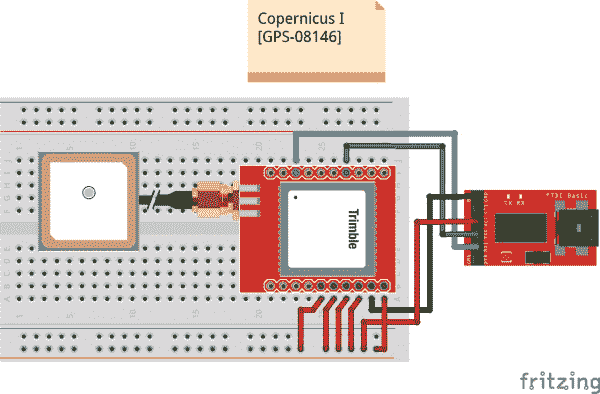
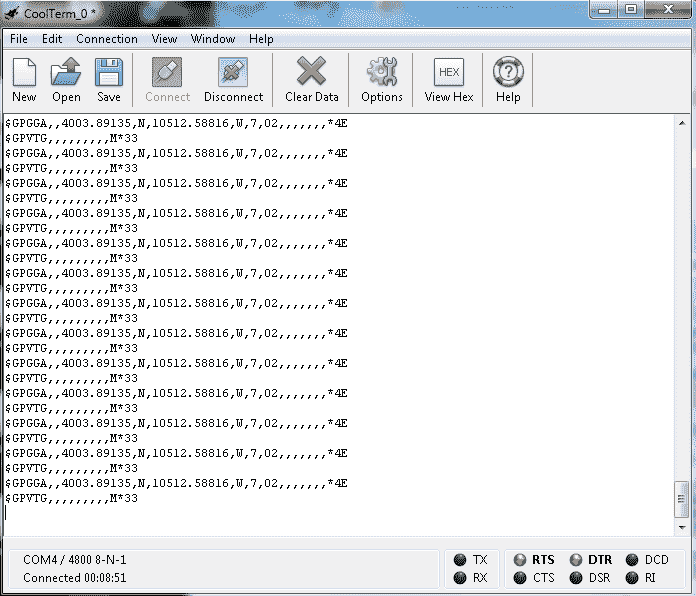

# 哥白尼 II 连接指南

> 原文：<https://learn.sparkfun.com/tutorials/copernicus-ii-hookup-guide>

## 哥白尼 II 概述

哥白尼 II GPS 模块是来自 Trimble 的 12 通道接收器。它的尺寸很小，非常适合需要精确 GPS 控制的应用。DIP 模块板提供一个易于连接的接口，使您可以轻松地将其嵌入到您的项目中。

该模块在 1 Hz 时支持 NMEA、TSIP 和 TAIP 协议。该板还设计用于与 SMA 天线接口。

 

将**添加到您的[购物车](https://www.sparkfun.com/cart)中！**

 **### [【spark fun GPS 模块-哥白尼 II DIP (12 通道)](https://www.sparkfun.com/products/11858)

[Only 1 left!](https://learn.sparkfun.com/static/bubbles/ "only 1 left!") GPS-11858

[哥白尼 II](http://www . spark fun . com/products/10922)是 Trimble 的一个很棒的 GPS 模块，但是 SMD 模块禁止…

$81.503[Favorited Favorite](# "Add to favorites") 12[Wish List](# "Add to wish list")** **该模块在 3.3V 下运行，在 3.0V 下功耗约为 40mA。对于 TSIP 协议，该模块的默认波特率为 38400 bps，而对于 NMEA 协议，默认波特率为 4800 bps。这些设置是可配置的。该模块永久设置为 8 个数据位、无奇偶校验、1 个停止位和无流量控制。

### 推荐阅读

如果您以前没有使用过 GPS，或者不熟悉串行通信，在继续学习本模块之前，您可能需要阅读以下教程。

 [### 如何焊接:通孔焊接](https://learn.sparkfun.com/tutorials/how-to-solder-through-hole-soldering) This tutorial covers everything you need to know about through-hole soldering.[Favorited Favorite](# "Add to favorites") 70 [### 串行通信](https://learn.sparkfun.com/tutorials/serial-communication) Asynchronous serial communication concepts: packets, signal levels, baud rates, UARTs and more 100 [### GPS 基础知识](https://learn.sparkfun.com/tutorials/gps-basics) The Global Positioning System (GPS) is an engineering marvel that we all have access to for a relatively low cost and no subscription fee. With the correct hardware and minimal effort, you can determine your position and time almost anywhere on the globe.[Favorited Favorite](# "Add to favorites") 31 [### 如何使用试验板](https://learn.sparkfun.com/tutorials/how-to-use-a-breadboard) Welcome to the wonderful world of breadboards. Here we will learn what a breadboard is and how to use one to build your very first circuit.[Favorited Favorite](# "Add to favorites") 79

## 硬件连接

要开始与哥白尼 II 通信，你需要连接模块上的四个引脚:VCC、GND、TX-B 和 RX-B

对于我们的例子，我们将使用 [3.3V FTDI 基本板](https://www.sparkfun.com/products/9873)将模块连接到计算机上的终端窗口，并将使用嵌入 SMA 的 [GPS 天线。](https://www.sparkfun.com/products/177)

### 连接:

哥白尼 II → 3.3V FTDI Basic

*   VCC → 3.3V
*   GND → GND
*   TX-B → RXI
*   RX-B → TXO

根据数据手册中的[引脚描述，看看下面的 Fritzing 图，图中显示了 Copernicus II 和 FTDI Basic 之间的连接。在某些情况下，用户需要将 R2 连接到 Vcc 才能操作，但这不是必需的。](https://cdn.sparkfun.com/datasheets/Sensors/GPS/63530-10_Rev-B_Manual_Copernicus-II.pdf)

**Heads up!** If you have the [**old** Copernicus I](https://www.sparkfun.com/products/retired/8146), the pinout and hookup is different. You old SKU for the part is GPS-8146 and can be distinguished with a "*58052-00*" printed on the IC. The Copernicus II should have "*68340-00*" printed on the IC.Check out the [old datasheet on page 23 for the Copernicus I](http://www.sparkfun.com/datasheets/GPS/Copernicus_Manual.pdf) for more information. [Users reported](https://www.sparkfun.com/products/retired/8146#comment-4eaad84b757b7fd351005f43) needing to connect XRST, BOOT, R2 and XSTANDY to VCC in order for the module to operate.

## 与模块对话

一旦你连接了你的板，打开你最喜欢的串行终端程序，连接到你的 FTDI Basic 的适当的 COM 端口。连接设置应该是 4800 bps、8 个数据位、无奇偶校验、1 个停止位和无流量控制。

如果您的模块连接正确并且有锁，您应该会看到类似这样的滚动输出。

*Copernicus II output in CoolTerm terminal window*

在 GPGGA 输出中可以看到，模块读取的位置是 4003.89135 N 和 10512.58816 W，恰好是 SparkFun 的总部。该模块目前也只能看到 2 颗卫星，输出的位置数据来自闪存中存储的最后一个值(由 GPS 质量指示器 7 显示)。缺乏额外数据是因为在 SparkFun 这样的大型建筑内测试，信号会时强时弱，因此如果在窗户附近或视野开阔的室外测试，实际上应该会从模块中获得更多数据。

### 与微控制器对话

如果你想用哥白尼将 GPS 添加到你的 Arduino 项目中，我们建议你看看[微型 GPS 库](https://github.com/mikalhart/TinyGPS)。这个库非常适合解析出你想在项目中使用的数据，比如时间、高度、位置等。网上有很多关于这个库的资源。快速搜索应该会产生大量的例子。如果你需要复习如何安装 Arduino 库，可以在[这里](https://learn.sparkfun.com/tutorials/installing-an-arduino-library)找到说明。

## 资源和更进一步

既然您已经连接了您的模块并可以从中收集 gps 数据，那么是时候开始将该模块集成到您的项目中了。考虑在自主机器人中添加 gps 导航，或者为您的汽车创建一个数据记录器，以跟踪不同地区的汽油使用情况。让我们知道你想出了什么样的酷项目，并给我们留下你对教程的任何反馈。查看以下文件以获取更多资源。

### 资源

*   [分线板示意图(PDF)](https://cdn.sparkfun.com/assets/4/5/a/b/1/52c1a208ce395f14778b456a.pdf)
*   [分线板鹰文件(ZIP)](https://cdn.sparkfun.com/assets/6/3/c/c/e/526ac4be757b7f7f0b8b456b.zip)
*   [哥白尼二号数据表](https://cdn.sparkfun.com/datasheets/Sensors/GPS/63530-10_Rev-B_Manual_Copernicus-II.pdf)
*   [GPSStudio 用户指南](http://cdn.sparkfun.com/datasheets/GPS/GPSStudioUG_1B_August2011.pdf)
*   [SparkFun GPS 追踪教程](http://www.sparkfun.com/tutorials/68)
*   迈克尔·辛普森的 GPS 教程
*   [天宝工作室&支持工具](http://cdn.sparkfun.com/datasheets/GPS/TrimbleStudio_V1-64-00.zip)
*   [GitHub](https://github.com/sparkfun/Copernicus_II_DIP_Module) -设计文件和存档库

你的下一个项目需要一些灵感吗？查看一些相关教程:

 [### GPS 基础知识](https://learn.sparkfun.com/tutorials/gps-basics) The Global Positioning System (GPS) is an engineering marvel that we all have access to for a relatively low cost and no subscription fee. With the correct hardware and minimal effort, you can determine your position and time almost anywhere on the globe.[Favorited Favorite](# "Add to favorites") 31 [### SparkFun GPS 突破(ZOE-M8Q 和 SAM-M8Q)连接指南](https://learn.sparkfun.com/tutorials/sparkfun-gps-breakout-zoe-m8q-and-sam-m8q-hookup-guide) The SparkFun ZOE-M8Q and SAM-M8Q are two similarly powerful GPS units but with different project applications. We'll compare both chips before getting each up and running.[Favorited Favorite](# "Add to favorites") 1 [### 如何升级 u-blox GNSS 接收机的固件](https://learn.sparkfun.com/tutorials/how-to-upgrade-firmware-of-a-u-blox-gnss-receiver) A few steps and you'll upgrade to the latest features on a u-blox GNSS receiver.[Favorited Favorite](# "Add to favorites") 1 [### SparkFun RTK 刻面 L 波段连接指南](https://learn.sparkfun.com/tutorials/sparkfun-rtk-facet-l-band-hookup-guide) Setup the RTK Facet L-Band in minutes to begin gathering millimeter level geospatial coordinates.[Favorited Favorite](# "Add to favorites") 0**