# RGB 面板连接指南

> 原文：<https://learn.sparkfun.com/tutorials/rgb-panel-hookup-guide>

## 介绍

你想给你的项目增加一批颜色吗？这些*巨大的* RGB [LED](https://www.sparkfun.com/leds) 面板是一个很棒的起点。你可以用它们制作动画、游戏或其他各种有趣的展示。根据制造商的不同，这些面板可以有不同的尺寸、LED 间距和扫描速率。以下是 SparkFun 目前在目录中提供的产品:

*   1024 像素(总共 3072 个 led！) [32x32 像素](https://www.sparkfun.com/products/14646)面板，扫描速率为 1:16，尺寸为 7.5 英寸 x7.5 英寸
*   2048 像素(总共 6144 个 led！) [32x64 像素](https://www.sparkfun.com/products/14718)面板，扫描速率为 1:16，尺寸为 5x10 英寸

[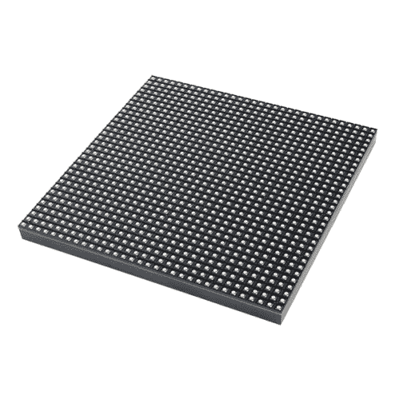](https://www.sparkfun.com/products/14646) 

将**添加到您的[购物车](https://www.sparkfun.com/cart)中！**

### [RGB LED 矩阵面板- 32x32](https://www.sparkfun.com/products/14646)

[In stock](https://learn.sparkfun.com/static/bubbles/ "in stock") COM-14646

这些 32x32 RGB LED 面板是开始为项目增添色彩的绝佳选择！您可以创建动画，游戏，或使用…

$48.50[Favorited Favorite](# "Add to favorites") 24[Wish List](# "Add to wish list")****[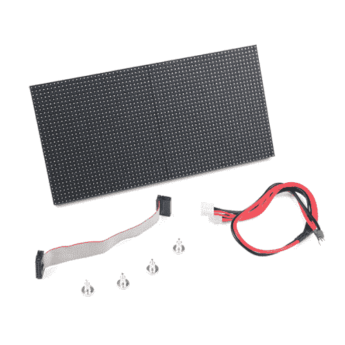](https://www.sparkfun.com/products/14718) 

将**添加到您的[购物车](https://www.sparkfun.com/cart)中！**

### [RGB LED 矩阵面板- 32x64](https://www.sparkfun.com/products/14718)

[In stock](https://learn.sparkfun.com/static/bubbles/ "in stock") COM-14718

这些 32x64 RGB LED 面板是为项目增添色彩的绝佳起点！您可以创建动画，游戏，或使用…

$53.50 $37.451[Favorited Favorite](# "Add to favorites") 15[Wish List](# "Add to wish list")**********Warning:** Due to the limitations of the Arduino library used in this tutorial, a 64x64 RGB LED matrix panel will **not** work with a standard Arduino (Arduino Uno with Atmega328P, etc). You will need a Teensy, Raspberry Pi, FPGA, or a development board that has a higher processing speed and memory. Try looking at the [Resources and Going Further](https://learn.sparkfun.com/tutorials/rgb-panel-hookup-guide#resources--going-further) at the end of this tutorial for more information on alternatives to drive the 64x64 panels.

[](https://www.sparkfun.com/products/14824) 

将**添加到您的[购物车](https://www.sparkfun.com/cart)中！**

### [RGB LED 矩阵面板- 64x64](https://www.sparkfun.com/products/14824)

[Only 7 left!](https://learn.sparkfun.com/static/bubbles/ "only 7 left!") COM-14824

这些 64x64 RGB LED 面板是为项目增添色彩的绝佳起点！您可以创建动画，游戏，或使用…

$85.95 $73.063[Favorited Favorite](# "Add to favorites") 13[Wish List](# "Add to wish list")******Note:** The 16x32 version has been retired from our catalog, but we are keeping the information in the tutorial for reference.

[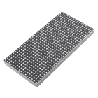](https://www.sparkfun.com/products/retired/12583) 

### [RGB LED 面板- 16x32](https://www.sparkfun.com/products/retired/12583)

[Retired](https://learn.sparkfun.com/static/bubbles/ "Retired") COM-12583

你想为你的项目增添色彩吗？这些大型 32x16 RGB LED 面板是一个绝佳的起点。你可以…

1 **Retired**[Favorited Favorite](# "Add to favorites") 7[Wish List](# "Add to wish list")

在本教程中，我们将向您展示这些面板究竟是如何操作的。我们将深入探讨硬件连接，并研究如何最好地为它们供电。然后我们会做一个演示草图并用 Arduino 控制它们。

[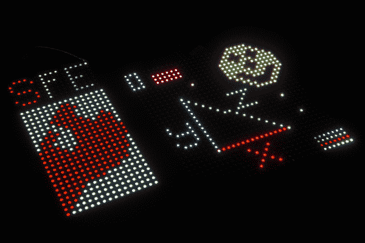](https://cdn.sparkfun.com/assets/5/3/7/d/f/52a9fe69757b7f96408b456a.jpg)*A 16x32 RGB LED panel to the left, and a 32x32 panel to the right.*

### 所需材料

在任一尺寸面板上，您还需要:

*   至少一个 [Arduino Uno](https://www.sparkfun.com/products/11021) (或者[可比的基于 ATmega328 的 Arduino](https://www.sparkfun.com/products/11575) )。这些面板确实将 Arduino 发挥到了极限。如果你有一台 [Arduino Mega 2560](https://www.sparkfun.com/products/11061) ，你可能想把它拿出来。任何尺寸高于 32x32 的面板都需要 Arduino Mega 2560 或更快的微控制器。
*   两包[公对公跳线](https://www.sparkfun.com/products/8431)。从面板到 Arduino 大约需要 16 根电线。
*   一个 **5V 电源**。你需要能产生大量电流的东西。一个简单的 [5V (1A)墙壁适配器](https://www.sparkfun.com/products/11456)确实有用，至少在短期内是这样，但你可能想升级到更高容量的电源，比如 [12V/5V (2A)](https://www.sparkfun.com/products/11296) 或 [5V/2A](https://www.sparkfun.com/products/12889) 墙壁适配器。
*   你还需要一些方法将你的电源连接到面板上。该配线架包括一个 4 针极化连接器和用于其电源的扁平端接电缆。查看下一页，寻找电源和电缆。

### 推荐阅读

在阅读本教程之前，我们建议您先通读这些教程:

[](https://learn.sparkfun.com/tutorials/how-to-power-a-project) [### 如何为项目提供动力](https://learn.sparkfun.com/tutorials/how-to-power-a-project) A tutorial to help figure out the power requirements of your project.[Favorited Favorite](# "Add to favorites") 67[](https://learn.sparkfun.com/tutorials/working-with-wire) [### 使用导线](https://learn.sparkfun.com/tutorials/working-with-wire) How to strip, crimp, and work with wire.[Favorited Favorite](# "Add to favorites") 50[](https://learn.sparkfun.com/tutorials/what-is-an-arduino) [### 什么是 Arduino？](https://learn.sparkfun.com/tutorials/what-is-an-arduino) What is this 'Arduino' thing anyway? This tutorials dives into what an Arduino is and along with Arduino projects and widgets.[Favorited Favorite](# "Add to favorites") 50[](https://learn.sparkfun.com/tutorials/shift-registers) [### 移位寄存器](https://learn.sparkfun.com/tutorials/shift-registers) An introduction to shift registers and potential uses.[Favorited Favorite](# "Add to favorites") 45[](https://learn.sparkfun.com/tutorials/light-emitting-diodes-leds) [### 发光二极管](https://learn.sparkfun.com/tutorials/light-emitting-diodes-leds) Learn the basics about LEDs as well as some more advanced topics to help you calculate requirements for projects containing many LEDs.[Favorited Favorite](# "Add to favorites") 67[](https://learn.sparkfun.com/tutorials/12v5v-power-supply-hookup-guide) [### 12V/5V 电源连接指南](https://learn.sparkfun.com/tutorials/12v5v-power-supply-hookup-guide) In this tutorial, we will replace the 12V/5V (2A) power supply's molex connector with two male barrel jacks adapters.[Favorited Favorite](# "Add to favorites") 5

## 给面板供电

### 电源连接器

**Warning!** **Don't use the 5V supply from your Arduino**. Those are only spec'ed to supply about 800mA, and the Arduino's already eating into that capacity a bit.

这些面板需要一个**调节的 3.3-5V** 电源。并且该电源需要能够提供大量的电流- **在最坏的情况下达到 2A**(所有像素亮、热、白)。对于 32x64 来说，其中一个面板在没有散热器的情况下拉动了大约*~ 3.36 a-3.43 a*-**，因此大约达到了 4A 最差情况**。应使用 4 针(2 针用于 VCC，2 针用于 GND)、0.15 英寸间距的极化连接器为面板供电。根据制造商的不同，电源连接器的颜色和位置可能会有所不同。

[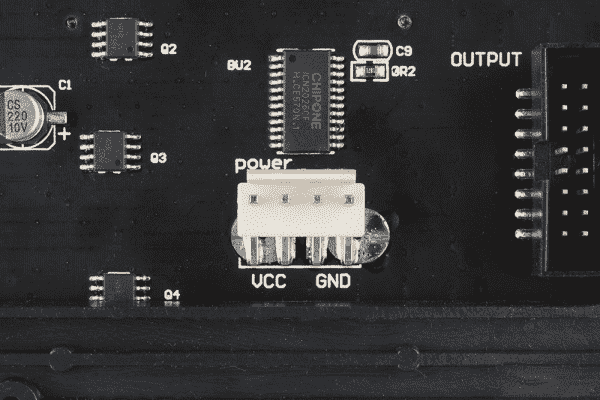](https://cdn.sparkfun.com/assets/6/f/d/9/9/52a9fe69757b7fbe5d8b4567.jpg)

### 电力电缆

面板包括一根专用的电源线。这是一个 0.15 英寸间距的 4 针极化连接器。包含的电缆端接一个阴极化连接器和一对扁平端子。

[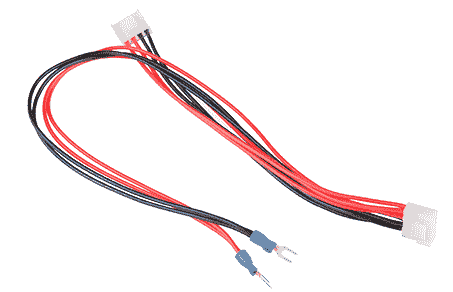](https://cdn.sparkfun.com/assets/f/3/0/f/9/52aa025d757b7f7f3c8b456a.png)

这里有一些我们用来给面板供电的方法。如果您使用不同的电压为 Arduino 供电，请确保连接 GND 以获得相同的参考电压。

#### 长期:12V/5V 电源分线板

这是我们推荐的套餐:

1.  一个 [12V/5V 2A 电源](https://www.sparkfun.com/products/15664)，应该足够维持显示器运行。(只是不要把 12V 的输出接到它上面！).*注意:如果你使用的是老式的 12V/5V 电源，你将需要三叉 [IEC C13 电缆](https://www.sparkfun.com/products/11299)来连接交流电源。*
2.  [分线板](https://www.sparkfun.com/products/15035)焊接有 [Molex 连接器](https://www.sparkfun.com/products/15700)和 [5mm 螺丝端子](https://www.sparkfun.com/products/8432)。*注意:面板 GND 引脚的铲形连接器可以连接到螺丝端子的两个 GND 引脚。只要确保不要将其连接到 12V 或 5V 端。*
3.  [剥去两根电线](https://learn.sparkfun.com/tutorials/working-with-wire#how-to-strip-a-wire)，用[螺丝刀](https://www.sparkfun.com/products/9146)将[公 DC 筒式插孔适配器](https://www.sparkfun.com/products/10287)连接到 Arduino 的 VIN 筒式插孔。*注意:大多数 Arduinos 应该有一个电压调节器，可以处理 7-12V 之间的输入，只是确保在通电前检查开发板上的规格。*

您的最终连接应该看起来类似于下面的连接特写，LED 面板的叉形铲形连接器和电线插入螺丝端子。

[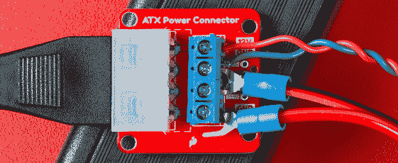](https://cdn.sparkfun.com/assets/learn_tutorials/1/6/6/ATX_Power_Connections.jpg)

#### 长期:12V/5V 电源拼接线

您也可以使用以下组合来接合电线:

1.  一个 [12V/5V 2A 电源](https://www.sparkfun.com/products/15664)，应该足够维持显示器运行。(只是不要把 12V 的输出接到它上面！).*注意:如果你使用的是旧的 12/5V 电源，你将需要三叉 [IEC C13 电缆](https://www.sparkfun.com/products/11299)来连接交流电源。*
2.  一个 [4 针 Molex 连接器，带引线](https://www.sparkfun.com/products/11298)，用于将电源连接至面板。

[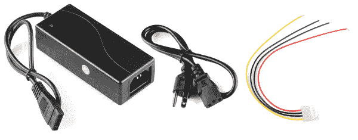](https://cdn.sparkfun.com/assets/2/8/0/4/4/52aa044c757b7fbe418b456d.png)*The ingredients for our power supply and cable.*

首先，我们将 spade 连接器从面板电源电缆上剪断。然后[剥离](https://learn.sparkfun.com/tutorials/working-with-wire/how-to-strip-a-wire)新未端接的端头。

然后我们[通过将**红色电线连接在一起**将](https://learn.sparkfun.com/tutorials/working-with-wire)Molex 尾纤拼接到 LED 面板的电源线上。对黑色电线进行同样的操作(确保使用 Molex 引线上红色电线旁边的黑色电线)。确保你连接的是 5V 和 GND 引脚，而不是**的**12V 引脚。在连接到 RGB 矩阵面板之前，[用万用表](https://learn.sparkfun.com/tutorials/how-to-use-a-multimeter)测试连接。

[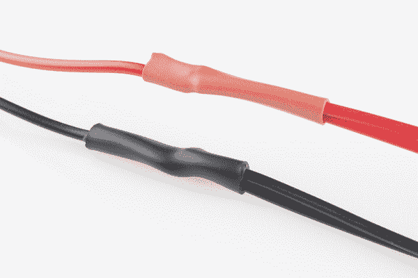](https://cdn.sparkfun.com/assets/d/a/1/6/2/52a9fe66757b7f772f8b4567.jpg)*Spliced Wires*

最后，用[热缩](https://www.sparkfun.com/products/9353)或[电工胶带](https://www.sparkfun.com/products/10689)覆盖拼接处，瞧！那是一根漂亮的电源线。

[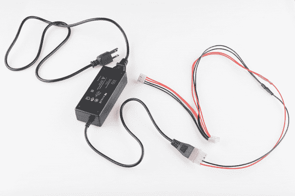](https://cdn.sparkfun.com/assets/b/e/a/7/e/52a9fe68757b7f473e8b4567.jpg)*Finished panel power supply cable.*

这是面板和固态电源之间的一个漂亮、坚固的接口。如果你正在寻找更容易，但不太可靠的东西，检查下面的选项。

#### 长期:平均井开关电源

对于那些想要将面板推到极限的人(例如，将 32x64 面板上的像素设置为最大容量的全白)，请结合:

1.  一个 [5VDC/20A 表示好的开关电源-](https://www.sparkfun.com/products/14098) 对你的面板来说绰绰有余。
2.  墙壁适配器电缆([北美](https://www.sparkfun.com/products/14092)或[欧洲](https://www.sparkfun.com/products/14093)标准)取决于您所在的国家。

[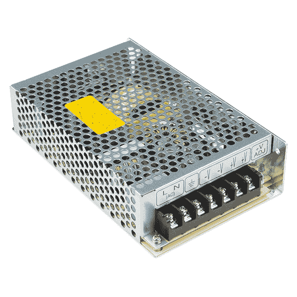](https://cdn.sparkfun.com/assets/learn_tutorials/1/6/6/14098-01_Meanwell_5V_20A_PowerSupply.jpg)

#### 短期:桶形千斤顶

拿一个 5V 的墙上适配器。两者都已经过测试，可以与面板一起工作。至少在短期内是这样。

*   [5V/2A 墙壁适配器](https://www.sparkfun.com/products/12889)
*   [USB 5V/1A 墙壁适配器](https://www.sparkfun.com/products/11456)(带 [USB 筒式插孔适配器](https://www.sparkfun.com/products/8639)

将电源与一个[母筒形千斤顶适配器](https://www.sparkfun.com/products/10288)和[螺丝刀](https://www.sparkfun.com/products/9146)一起使用，以在铁锹和筒形千斤顶之间获得一个快速和肮脏的连接。

[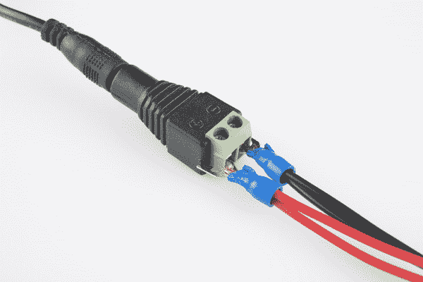](https://cdn.sparkfun.com/assets/d/3/1/8/7/52a9fe68757b7f74598b4567.jpg)

最终的连接应该如下图所示。

[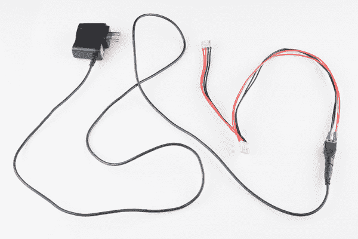](https://cdn.sparkfun.com/assets/a/a/7/a/5/52a9fe67757b7f71118b4567.jpg)

## 硬件连接

在我们进入代码部分之前，有相当多的连接工作要做。RGB 面板有一对 16 针(2x8) IDC 连接器，我们需要连接其中的大多数引脚。方便的是，两个面板都有标记的连接器引脚(未标记的引脚接地)。当我们连接到面板上时，确保使用标有 ***输入*** 的连接器。根据制造商的不同，标签可能略有不同。

[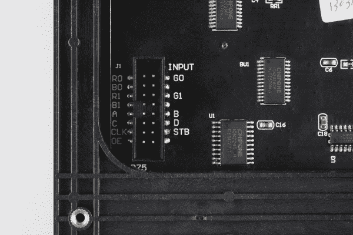](https://cdn.sparkfun.com/assets/7/1/b/2/2/52a9fe69757b7f9a1f8b4567.jpg)*Connector labels on a 32x32 panel. 16x32 has the same layout, except that D is a no connect (NC) instead. 32x64 has the same layout but no labels.***Note to 16x32 Panel Users:** The 32x16 panel has the exact same pinout as the 32x32, except there is no "D" pin. Instead of "D", that pin (12 on the connector) is a no connect (NC), you can leave it alone.**Labels on 32x64 and 16x32 Panel Users:** On top of that, some panels do not have labels on the connector pins -- instead there is an **arrow (◄) indicating pin 1**, in the top-left corner of the connector (it's obscured by the frame, but visible if you peek in at the right angle). That pin 1 arrow indicator points to the "R0" pin, and the pinout follows that of the 32x32 panel from there. We have also seen panels come with their pins label **G1, G2, R1, R2, B1 & B2** instead of **G0, G1, R0, R1, B0 & B1**. The wiring will be the same for both cases by connecting to the connector on the left.

[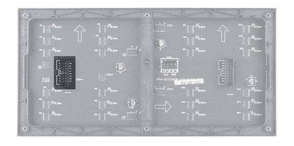](https://cdn.sparkfun.com/assets/learn_tutorials/1/6/6/14718-RGB_LED_Matrix_Panel_-_32x64-03_noLabels.jpg)

### 连接表

以下是 LED 面板连接器和 Arduino 之间的引脚连接:

| 面板引脚标签 | 电缆连接器引脚# | Arduino Uno (Atmega328P)
引脚 | Arduino Mega 2560
引脚 | 笔记 |
| R0 | one | Two | Twenty-four | 红色数据
*(第 1-16 列)* |
| 静止状态 | Two | three | Twenty-five | 绿色数据
*(第 1-16 列)* |
| B0 | three | four | Twenty-six | 蓝色数据
*(第 1-16 列)* |
| GND | four | GND | 地面 |
| R1 | five | five | Twenty-seven | 红色数据
*(第 17-32 列)* |
| G1 | six | six | Twenty-eight | 绿色数据
*(第 17-32 列)* |
| B1 | seven | seven | Twenty-nine | 蓝色数据
*(第 17-32 列)* |
| GND | eight | GND | 地面 |
| A | nine | A0 | 多路分解输入 A0 |
| B | Ten | 一流的 | 多路分解输入 A1 |
| C | Eleven | 主动脉第二声 | 多路分解输入 A2 |
| D | Twelve | A3 号 | E3 E1 的 Demux 输入*(仅 32x32 面板)* |
| CLK | Thirteen | Eleven | LED 驱动时钟 |
| 机顶盒(Set-Top-Box) | Fourteen | Ten | LED 驱动器闩锁 |
| 古英语 | Fifteen | nine | LED 驱动器输出使能 |
| GND | Sixteen | GND | 地面 |

对于一步一步的方法，请遵循下面的步骤。我们使用[凸对凸高级跳线](https://www.sparkfun.com/products/8431)在随附的带状电缆和我们的 Arduino 之间布线。

### 连接数据引脚:R0、B0、G0、R1、G1 和 B1

这些 LED 驱动器(移位寄存器)数据引脚在 Arduino 库中是硬编码的，不能移动。如上表所列，R0、G0、B0、R1、G1 和 B1 分别到 Arduino Uno 的**引脚 2 到 7** 。如果您将面板连接到 Arduino Mega，这些引脚应该分别连接到**引脚 24-29** 。

为便于参考，在连接针脚时，试着向下看顶部有红线的 IDC 连接器。电缆连接器的引脚 1 相对于右上方。如果您非常仔细地观察模塑件，您可能还会看到箭头(▽)指向该销。另外，请注意极性标签位于电缆两端的右侧。

[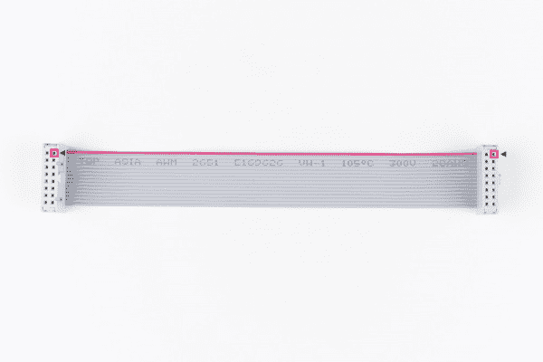](https://cdn.sparkfun.com/assets/learn_tutorials/1/6/6/RGB_LED_Panel_Matrix_Tutorial_IDC_ConnectorPolarity.jpg)*IDC Connector Highlighted w/ Arrow Pointing to Pin 1***Tip:** The **odd** numbered pins will be along the right side with the polarity marker and the tab. The pin holes on the left will be even numbered. Depending on the manufacturer, you may have received a black connector instead of a grey.

一旦决定连接哪一侧，通过连接 R0 的红线开始连接引脚 1。然后，通过连接 G0 的绿色导线连接引脚 2。使用 B0 的蓝线连接针脚 3 后，继续根据连接表连接针脚。

[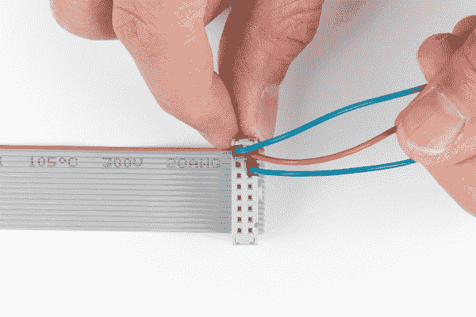](https://cdn.sparkfun.com/assets/learn_tutorials/1/6/6/RGB_LED_Panel_Matrix_Tutorial_IDC_Polarity_Wiring.jpg)

为了有助于跟踪您正在连接到哪一侧，请随意用记号笔标记您的连接。

[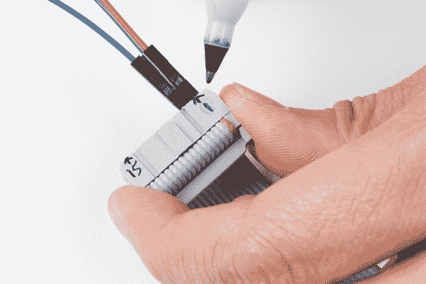](https://cdn.sparkfun.com/assets/learn_tutorials/1/6/6/RGB_LED_Panel_Matrix_Tutorial_IDC_Connector_Label.jpg)

### 连接时钟引脚

这是最后一个对其去向有一些限制的引脚——它必须连接到 Arduino 的**端口 B** 引脚之一。这意味着它必须是 *8，9，10，11，12，或 13* 。示例代码将其定义为连接表中的**引脚 11** 。请务必检查时钟的 pin 定义，因为它可能会随您使用的代码而变化。

### 连接到 A、B、32x32 用户的 D)、OE 和 STB 引脚

这五个(或者六个，如果你用的是 32x32 矩阵)管脚可以插在 Arduino 上任何有空间的地方。虽然，可能没有太多的空间了...我们选择将 A、B 和 C 分别插在**引脚 A0、A1 和 A2** 中。OE 连接到**引脚 9** 。机顶盒到**第 10 针**。并且，如果您使用的是 32x32 矩阵，D 会按照连接表中的说明到达 **A3** 。

如果您的应用程序需要，可以随意交换。请确保在示例代码中也进行了切换。

### 连接到接地引脚

最后，但肯定不是最不重要的(嗯，也许，如果我们谈论的是潜力)是地面。连接器上有三个未标记的针脚，它们都应接地。

如果你没有插入任何其他东西，你的 Arduino 上应该有三个接地针。不过，如果你在努力寻找接地针，你应该只需要把其中一个接地针插到你的 Arduino 上就可以了。Woo [彩色编码](http://en.wikipedia.org/wiki/Color_code)电线！

[](https://cdn.sparkfun.com/assets/b/f/d/0/3/52a9fe69757b7faa4c8b4567.jpg)

### 力量

将 LED 面板连接到 Arduino 后，将 5V 电源添加到面板的电源连接器。别忘了给你的 Arduino 加电！

| [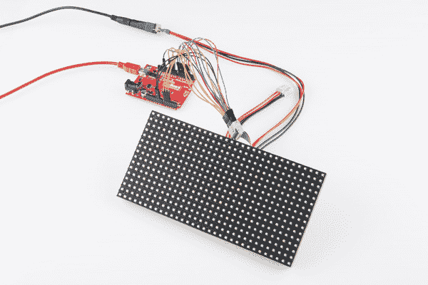](https://cdn.sparkfun.com/assets/9/9/0/2/8/52a9fe69757b7fa6618b4569.jpg) | [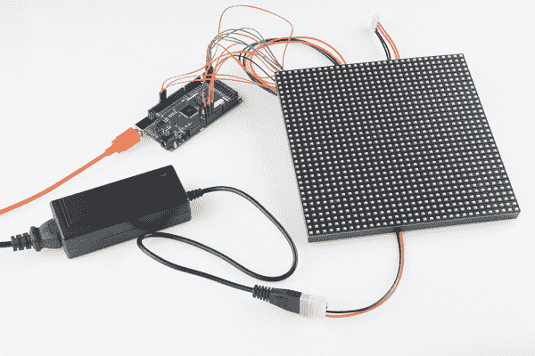](https://cdn.sparkfun.com/assets/0/7/9/d/2/52a9fe6a757b7f96498b4567.jpg) |
| *16x32 完全连接到红板* | *32x32 完全连接到 Arduino Mega 2560* |

### 连接到 32x64 RGB LED 面板

对于任何连接到 32x64 RGB 面板的人来说，您将需要使用 Arduino Mega 2560。否则，由于库和 Arduino Uno 的限制，面板将无法按预期显示。

要将两个 32x32 RGB 矩阵以菊花链形式连接在一起，请将另一根 IDC 电缆从第一个配线架的输出端连接到第二个配线架的输入端。然后将第二个 4 针极化连接器连接到输入电源连接器。修改 *test_shapes_32x64.ino* 后，显示将输出为 32x64 矩阵，如下图所示。

[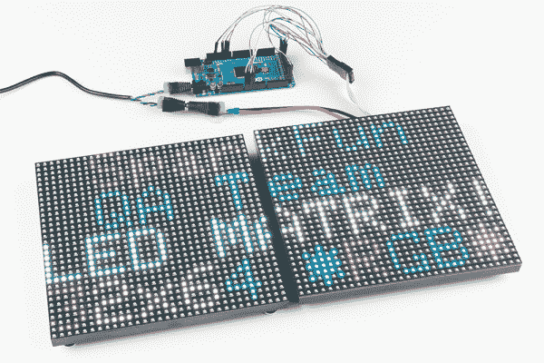](https://cdn.sparkfun.com/assets/learn_tutorials/1/6/6/RGB_LED_Panel_Matrix_Tutorial_Two_32x32_Pitch5_ArduinoMega.jpg)**Heads up!** When daisy chaining the RGB LED matix panels, make sure that they have the same scan rate!

这是一个间距为 4 毫米的 32x64 矩阵的示例。

[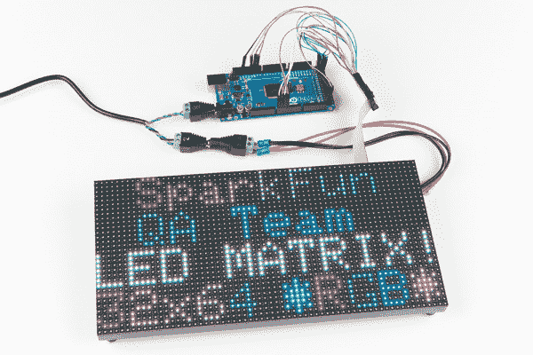](https://cdn.sparkfun.com/assets/learn_tutorials/1/6/6/RGB_LED_Panel_Matrix_Tutorial_32x64_Pitch4_ArduinoMega.jpg)

当使用高于 32x64 的数组时，另一个带有 Teensy 3.0+、FPGA 或 Raspberry Pi 的库将是更好的选择。您可能需要进行电平转换，将 3.3V 转换为 5V，以便 RGB LED 面板识别 I/O 信号。要了解更多信息，请查看[参考资料中的链接，并进一步查看](https://learn.sparkfun.com/tutorials/rgb-panel-hookup-guide/all#resources--going-further)。

### 定制屏蔽适配器

如果你有一个原型屏蔽，试着做一个定制的屏蔽适配器来实现更安全的连接。这里有一个使用 [XBee shield](https://www.sparkfun.com/products/12847) 原型制作区域的例子，该区域专门用于 RGB LED 面板的连接。遵循上述步骤，但是[将连接](https://learn.sparkfun.com/tutorials/how-to-solder-through-hole-soldering)焊接在一起。

[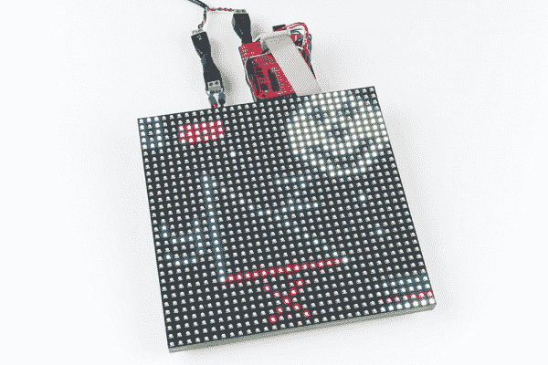](https://cdn.sparkfun.com/assets/learn_tutorials/1/6/6/RGB_LED_Panel_Matrix_Tutorial_32x32_Pitch5_Etch_a_Sketch_Custom_ProtoShield.jpg)

### 磁性底座

根据供应商的不同，您可能会收到一套磁性底座。将其添加到面板的安装孔中，以便贴在冰箱或金属墙上！它们也是很好的对峙手段。只要确保固定和绝缘你的电线，以防止任何短路，如果面板后面有金属。

[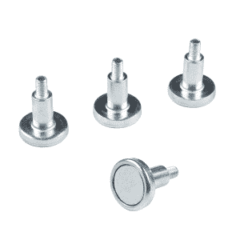](https://cdn.sparkfun.com/assets/learn_tutorials/1/6/6/12584-RGB_LED_Panel_magnetic_mounts.jpg)

## Arduino 库安装

**注意:**此示例假设您在桌面上使用的是最新版本的 Arduino IDE。如果这是你第一次使用 Arduino，请回顾我们关于[安装 Arduino IDE 的教程。](https://learn.sparkfun.com/tutorials/installing-arduino-ide)如果您之前没有安装 Arduino 库，请查看我们的[安装指南。](https://learn.sparkfun.com/tutorials/installing-an-arduino-library)

**Compatibility:** The 16x32 works at a 1:8 scan rate. The 32x32 and 32x64 examples work with a 1:16 scan rate. Depending on the manufacturer, there may be different scan rates for the the LED Matrix Panels. Using different scan rates with the example code may cause unexpected behaviors.

我们的示例代码将利用 Adafruit 最优秀的 **RGBMatrixPanel** 库，这也需要他们的 **AdafruitGFXLibrary** 。您可以通过 Arduino 库管理器搜索这些名称来获得这些库。或者你可以通过从 GitHub 仓库中抓取它们两个[ [RGBMatrixPanel](https://github.com/adafruit/RGB-matrix-Panel) 和[adafrugfxlibrary](https://github.com/adafruit/Adafruit-GFX-Library)来手动安装它们。

为了方便起见，我们将这些库与教程中使用的串行 paint 示例代码打包在一起:

[Serial Paint Example Code (ZIP)](https://cdn.sparkfun.com/assets/learn_tutorials/1/6/6/Libraries_Examples_RGB_Matrix_LED_Panels.zip)

### 图书馆示例

RGBMatrixPanel 库包括许多有趣的例子来帮助展示如何使用这个库。他们太棒了。在 Arduino 的**文件 _ > *示例* > _RGBMatrixPanel** 菜单下查看。(一定要看看 *Plasma_16x32 或者 Plasma_32x32* 的例子！).确保根据您的硬件连接调整代码。在本教程中，我们将时钟引脚物理连接到 11。因此，您需要调整定义的 CLK 引脚

```
language:c
// If your 32x32 matrix has the SINGLE HEADER input,
// use this pinout:
#define CLK 8  // MUST be on PORTB! (Use pin 11 on Mega)
#define OE  9
#define LAT 10
#define A   A0
#define B   A1
#define C   A2
#define D   A3 
```

收件人:

```
language:c
// If your 32x32 matrix has the SINGLE HEADER input,
// use this pinout:
#define CLK 11  // MUST be on PORTB! (Use pin 11 on Mega) <---CHANGE!
#define OE  9
#define LAT 10
#define A   A0
#define B   A1
#define C   A2
#define D   A3 
```

**32x32 Examples for 32x64:** You can also use the "**..._32x32.ino**" examples in the **RGBmatrixPanel** library by adjusting the code for the 32x64 RGB matrix panels (i.e. **colorwheel_32x32**, **plasma_32x32**, etc). Just add the number "`64`" as a parameter when creating an instance of the RGBmatrixPanel class:

`RGBmatrixPanel matrix(A, B, C, D, CLK, LAT, OE, false, **64**);`

## 示例代码

**Heads up!** This Arduino library and example used in this tutorial has been tested for 16x32 (w/ 1:8 scan rate), 32x32 (w/ 1:16 scan rate), and 32x64 (w/ 1:16 scan rate) panels. When using a larger matrix (such as the 64x64 RGB LED matrix panel), you will need a development board that has a higher processing speed and memory due to the limitations of the library used in this tutorial. Try looking at the [Resources and Going Further](https://learn.sparkfun.com/tutorials/rgb-panel-hookup-guide#resources--going-further) at the end of this tutorial for more information on alternatives to drive a larger matrix.

### 系列油漆

我们想写另一个有趣的草图，提供一个交互式的方法来探索面板和 Arduino 库。我们想出的是一个系列控制的绘画程序。有了这个草图，你可以使用串行监视器(或者更好的是，[另一个终端程序](https://learn.sparkfun.com/tutorials/terminal-basics))来控制光标并在矩阵上绘图。

如果您还没有，请使用下面的链接下载并解压缩包含在压缩库中的草图。

[Serial Paint Example Code (ZIP)](https://cdn.sparkfun.com/assets/learn_tutorials/1/6/6/Libraries_Examples_RGB_Matrix_LED_Panels.zip)

#### 选择您的 LED 矩阵尺寸

上传之前，请确保草图已设置为与您的面板配合使用，其中显示:

```
language:c
/* - One of these should be commented out!
   - Also, make sure to adjust the saved image in the <bitmap.h> file.*/

/* ========== For 32x64 LED panels: ==========
  You MUST use an Arduino Mega2560 with 32x64 size RGB Panel */
//RGBmatrixPanel matrix(A, B, C, D, CLK, LAT, OE, false, 64); // 32x64

/* ========== For 32x32 LED panels: ========== */
RGBmatrixPanel matrix(A, B, C, D, CLK, LAT, OE, false); // 32x32

/* ==========  For 32x16 LED panels: ========== */
//RGBmatrixPanel matrix(A, B, C, CLK, LAT, OE, false); // 32x16 
```

默认情况下，串行绘制示例使用 32x32。如果您使用 32x64，请确保通过删除“`//`”来取消对下面一行的注释

```
language:c
//RGBmatrixPanel matrix(A, B, C, D, CLK, LAT, OE, false, 64); // 32x64 
```

然后通过在行首添加一个“`//`”来注释掉下面的行。

```
language:c
RGBmatrixPanel matrix(A, B, C, D, CLK, LAT, OE, false); // 32x32 
```

#### 选择保存的位图图像

确保也取消注释/注释掉 ***bitmap.h*** 文件中的`bmp[]`数组，根据各自的大小删除并添加“`/*`”和“`*/`”。

#### 上传！

一旦你把代码调整到你的屏幕上，把它上传到 Arduino！上传后，面板的左上角应该会有一个像素在闪烁。看起来不多，但这是个好迹象。

### 使用草图

要控制程序，打开你的串行终端到 **9600 bps** 。尝试通过串行监视器点击发送`l`(小写‘L’)，这将加载演示位图。可以发`E`(大写)来擦屏。

这个草图的想法是:四处移动光标来绘制像素、形状或文本。以下是草图提供的命令(区分大小写):

*   **动作** : `w`、`a`、`s`、`d`(上、下、左、右)
*   **绘制像素** : `Spacebar`
*   **擦除像素** : `e`
*   **擦除屏幕** : `E`
*   **用活动颜色填充屏幕**:`f`
*   **颜色控制:**
    *   **红色值上升**:`R`(0[关]和 7[最亮]之间的值)
    *   **红色值下降** : `r`
    *   **绿色上/下** : `G` / `g`
    *   **蓝色上/下** : `B` / `b`
    *   **复制颜色** : `z`(在光标下复制一种颜色)
*   **外形图:**
    *   **线**:按`v`放置起点。然后将光标移动到终点，再次按下`v`**。**
    ***   **矩形**:按`x`或`X`放置第一个角。然后将光标移动到您想要对角的位置。然后按下`x`打开**空的**盒，或者按下`X`打开**满的**盒。*   **圆**:按`c`或`C`放置圆的*圆心*。然后移动你的光标到你想要的圆的外边。然后按下`c`进行**空**圆或`C`进行**满**圆。**
***   **文本**:按`t`进入文本模式。现在**收到的任何字符**都会显示在面板上。它会从一行绕到下一行，但不会从下到上。按下```(1 的标签上方/左侧)退出文本模式。*   **打印**:按`p`将你的一组图形打印到串口终端。你可以复制它，并把它放回你的草图中，如果你想再次加载它。*   **加载**:按`l`从草图加载一个预定义的数组。该草图包括一个演示阵列，它是通过 print 命令创建的。按照这个例子来加载您自己的绘图！**

 **试试素描吧！看能不能做出下一张很棒的 ~~[Lite-Brite](https://cdn.sparkfun.com/assets/0/d/6/d/6/52a8a998757b7f4b638b456c.jpg)~~ LED 面板图。如果你做了什么好东西，请与我们分享！不要笑。我一次画一个像素 SFE 火焰！以下是我们的创作:

| [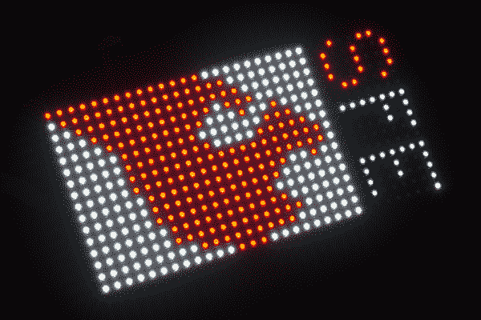](https://cdn.sparkfun.com/assets/2/f/e/e/3/52a9fe69757b7f1a038b4568.jpg) | [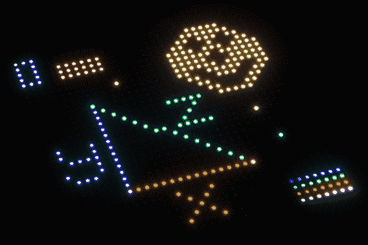](https://cdn.sparkfun.com/assets/e/c/3/0/9/52a9fe68757b7fc95d8b4567.jpg) |
| *16x 32 面板上的一张图纸。* | *32x 32 面板上的示例图。* |

尝试修改代码以改变颜色，并使用电位计和按钮在矩阵中移动。您可以在我们的[产品展示区](http://www.youtube.com/watch?v=2KZR3rwEHg8&feature=youtu.be&t=3m18s)看到它的实际效果:

[https://www.youtube.com/embed/2KZR3rwEHg8/?autohide=1&border=0&wmode=opaque&enablejsapi=1](https://www.youtube.com/embed/2KZR3rwEHg8/?autohide=1&border=0&wmode=opaque&enablejsapi=1)

## 资源和更进一步

现在你知道如何利用这些漂亮的 RGB LED 矩阵，你打算用它们创建什么样的漂亮项目呢？如果您需要，这里还有一些资源:

*   [雷氏逻辑逆向工程页面](http://www.rayslogic.com/propeller/Programming/AdafruitRGB/AdafruitRGB.htm)
*   吉卜赛人休息
    *   [Adafruit 的 RGBMatrixPanel 库](https://github.com/adafruit/RGB-matrix-Panel) -本教程使用的 Arduino 示例库。
    *   [RPi RGB LED 矩阵](https://github.com/hzeller/rpi-rgb-led-matrix) -另一个使用树莓 Pi 的例子。
    *   [SmartMatrix](https://github.com/pixelmatix/SmartMatrix) -另一个使用智能 LED 保护罩的例子。
*   SFE 产品展示
    *   [蚀刻草图](https://www.youtube.com/watch?time_continue=131&v=2KZR3rwEHg8)-16x 32 和 32x32 面板的演示
    *   [RGB LED 矩阵面板](https://youtu.be/uWds5Q4xcN0)-32x 64 面板演示
    *   [GitHub Gist 产品演示](https://gist.github.com/bboyho/fb709b9062368ce7421a42fb681df50b)-32x 64 产品展示的演示代码

* * *

### 青少年智能盾牌

寻找更快的处理器和更多的内存来驱动 RGB LED 矩阵？试着看一下青少年的盾牌。

[](https://learn.sparkfun.com/tutorials/getting-started-with-the-smartled-shield-for-teensy) [### 面向青少年的 SmartLED 盾入门

#### 2018 年 11 月 9 日](https://learn.sparkfun.com/tutorials/getting-started-with-the-smartled-shield-for-teensy) In this tutorial, we will connect different RGB LED matrix panels to PixelMatix's SmartLED shield and Teensy.[Favorited Favorite](# "Add to favorites") 8

尝试使用手势传感器和 SmartLED 盾制作一个 32x32 RGB LED 矩阵的悬停 pong 游戏。示例代码可以在 GitHub repo [HoverPong](https://github.com/ShawnHymel/HoverPong) 中找到。

[https://www.youtube.com/embed/lvr1SKRGgqc?t=1m49s/?autohide=1&border=0&wmode=opaque&enablejsapi=1](https://www.youtube.com/embed/lvr1SKRGgqc?t=1m49s/?autohide=1&border=0&wmode=opaque&enablejsapi=1)

* * *

你的下一个项目需要一些灵感吗？查看一些相关教程:

[](https://learn.sparkfun.com/tutorials/rgb-panel-jumbotron) [### RGB 平板大屏幕](https://learn.sparkfun.com/tutorials/rgb-panel-jumbotron) This tutorial will show you how to combine a webcam, a 32x32 RGB LED panel, and a Teensy 3.1 to stream video from the webcam, pixelate it, and display it on the LED panel - LIVE.[Favorited Favorite](# "Add to favorites") 7[](https://learn.sparkfun.com/tutorials/hackers-in-residence-the-sound-visualizer) [### 黑客住宅:声音可视化](https://learn.sparkfun.com/tutorials/hackers-in-residence-the-sound-visualizer) A fun project that uses a Raspberry Pi and a custom Java app to create your own sound visualizer using a RGB LED matrix.[Favorited Favorite](# "Add to favorites") 2[](https://learn.sparkfun.com/tutorials/hackers-in-residence-the-sound-visualizer-pt-2) [### 黑客在住宅:声音可视化 Pt。2](https://learn.sparkfun.com/tutorials/hackers-in-residence-the-sound-visualizer-pt-2) An addition to a previous project, this time using a PC and a custom Java app to create your own music visualizer using a RGB LED matrix.[Favorited Favorite](# "Add to favorites") 7[](https://learn.sparkfun.com/tutorials/live-spotify-album-art-display) [### 现场 Spotify 专辑图片展示](https://learn.sparkfun.com/tutorials/live-spotify-album-art-display) Learn how to turn our 64x64 RGB LED Matrix Panel into a display for your current Spotify album art using an ESP32\.[Favorited Favorite](# "Add to favorites") 14

如果你正在寻找更多的灵感或学习更多的东西，看看这些教程:

[](https://learn.sparkfun.com/tutorials/light) [### 光](https://learn.sparkfun.com/tutorials/light) Light is a useful tool for the electrical engineer. Understanding how light relates to electronics is a fundamental skill for many projects.[Favorited Favorite](# "Add to favorites") 24[](https://learn.sparkfun.com/tutorials/serial-graphic-lcd-hookup) [### 串行图形 LCD 连接](https://learn.sparkfun.com/tutorials/serial-graphic-lcd-hookup) Learn how to use the Serial Graphic LCD.[Favorited Favorite](# "Add to favorites") 11[](https://learn.sparkfun.com/tutorials/led-light-bar-hookup) [### LED 灯条连接](https://learn.sparkfun.com/tutorials/led-light-bar-hookup) A quick overview of SparkFun's LED light bars, and some examples to show how to hook them up.[Favorited Favorite](# "Add to favorites") 10[](https://learn.sparkfun.com/tutorials/graphic-lcd-hookup-guide) [### 图形 LCD 连接指南](https://learn.sparkfun.com/tutorials/graphic-lcd-hookup-guide) How to add some flashy graphics to your project with a 84x48 monochrome graphic LCD.[Favorited Favorite](# "Add to favorites") 10[](https://learn.sparkfun.com/tutorials/sparkfun-led-array-8x7-hookup-guide) [### SparkFun LED 阵列(8x7)连接指南](https://learn.sparkfun.com/tutorials/sparkfun-led-array-8x7-hookup-guide) Getting started with the Charlieplexed 8x7 LED array.[Favorited Favorite](# "Add to favorites") 6[](https://learn.sparkfun.com/tutorials/marquee-party-bag) [### 跑马灯派对包](https://learn.sparkfun.com/tutorials/marquee-party-bag) This tutorial provides everything you need to know to make your own Marquee Party Bag 6Or check out this blog post for ideas. Remember, since the 1:8 scan rate 32x32 RGB LED Panel is a SparkX product, support is limited. There is a useful modified Arduino library specifically for a panel with 1:8 scan rate.

[](https://www.sparkfun.com/news/2650 "March 29, 2018: When SparkFun got a shipment of 1:8 scan rate panels, it fell on me to make them work with the wrong library.") [### 关于 RGB 矩阵面板你不想知道的一切

March 29, 2018](https://www.sparkfun.com/news/2650 "March 29, 2018: When SparkFun got a shipment of 1:8 scan rate panels, it fell on me to make them work with the wrong library.")[Favorited Favorite](# "Add to favorites") 4********