# 电机并选择正确的电机

> 原文：<https://learn.sparkfun.com/tutorials/motors-and-selecting-the-right-one>

## 介绍

在任何给定的时刻，你身边至少有一两种类型的马达。从你手机里的[振动马达](http://en.wikipedia.org/wiki/Vibrating_alert)，到你最爱的[游戏系统里的风扇和光驱](http://en.wikipedia.org/wiki/Dreamcast)，马达无处不在。电机为我们的设备提供了一种与我们和环境互动的方式。电机的应用多种多样，其设计和操作也各不相同。

[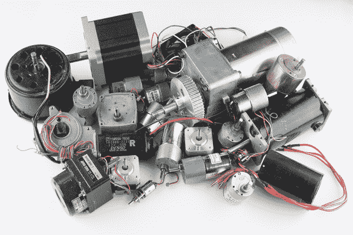](https://cdn.sparkfun.com/assets/4/c/6/4/7/52a22672757b7f511d8b456b.jpg)

### 你将学到什么

在本教程中，我们将介绍一些基本的电机类型和用途:

*   DC 电刷电机公司
*   无刷电机
*   步进电机
*   线性电机

### 推荐阅读

*   [什么是电](https://learn.sparkfun.com/tutorials/what-is-electricity)
*   [什么是电路？](https://learn.sparkfun.com/tutorials/what-is-a-circuit)
*   [电压、电流、电阻和欧姆定律](https://learn.sparkfun.com/tutorials/voltage-current-resistance-and-ohms-law)

## 是什么使发动机运转的？

最模糊最简单的答案就是磁性！好，现在让我们把这个简单的力变成一辆超级汽车！

[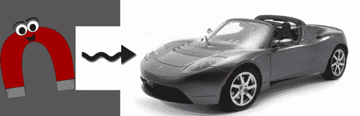](https://cdn.sparkfun.com/assets/3/2/0/0/6/52656c76757b7f347c8b4572.png)

为了简单起见，我们需要通过[思维实验](http://en.wikipedia.org/wiki/Thought_experiment)的镜头来看一些概念。一些自由将被采取，但是如果你想下来和肮脏的细节，你可以咨询[格里菲斯博士](http://www.amazon.com/Introduction-Electrodynamics-Edition-David-Griffiths/dp/013805326X)。在我们的思想实验中，我们将陈述磁场是由移动的电子*即电流*产生的。虽然这创造了一个经典模型供我们使用，但当我们达到原子水平时，事情就分解了。为了更好地理解磁性的原子层次，格里菲斯在另一本[书中解释道...](http://www.amazon.com/Introduction-Quantum-Mechanics-2nd-Edition/dp/0131118927)

### 电磁

为了创造一个磁铁或磁场，我们必须看看它们是如何产生的。电流和磁场之间的关系遵循[右手定则](http://en.wikipedia.org/wiki/Right-hand_rule)。当电流通过导线时，当手指缠绕导线时，会在导线周围形成一个磁场。这是对[安培尔力定律](http://en.wikipedia.org/wiki/Amp%C3%A8re%27s_force_law)的简化，因为它作用于载流导线。现在，如果你把同样的导线放在预先存在的磁场中，你可以产生一个力。这个力被称为[洛伦兹力](http://en.wikipedia.org/wiki/Lorentz_force#Force_on_a_current-carrying_wire)。

[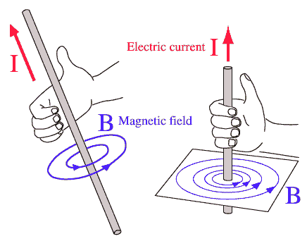](https://cdn.sparkfun.com/assets/6/0/a/1/e/5229074f757b7fbd568b456a.gif)*The right-hand rule shows the direction of the magnetic field in relation to the current path.**(Credit: [HyperPhysics](http://hyperphysics.phy-astr.gsu.edu/hbase/hframe.html))*

如果电流增加，磁场强度就会增强。不过，要利用磁场做些有用的事情，需要惊人的电流量。此外，输送电流的导线会携带相同的磁场强度，因此会产生不受控制的磁场。通过将金属丝弯曲成一个环，可以产生一个定向的集中磁场。

[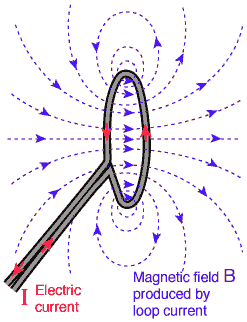](https://cdn.sparkfun.com/assets/c/f/9/3/7/52290a54757b7f4f568b456b.gif)*The field has not changed. By bending the wire into a loop, field directions are simply aligned.**(Credit: [HyperPhysics](http://hyperphysics.phy-astr.gsu.edu/hbase/hframe.html))*

### 电磁铁

通过将电线绕成圈并通上电流，就产生了电磁铁。如果一圈电线可以集中磁场，你可以用更多的电线做什么？多几个**百个**怎么样！电路中的回路越多，给定电流下的磁场就越强。如果是这样的话，为什么我们看不到**成千上万**，如果不是* *百万**，电动机和电磁铁中的绕组？电线越长，电阻越大。[欧姆定律(V = I*R)](https://learn.sparkfun.com/tutorials/voltage-current-resistance-and-ohms-law) 说要维持同样的电流，电阻增加，电压必须增加。在某些情况下，使用更高的电压是有意义的；在其他情况下，一些使用电阻较小的较大导线。使用更大的线成本更高，并且通常更难操作。这些都是设计电机时必须考虑的因素。

[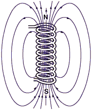](https://cdn.sparkfun.com/assets/c/b/f/b/3/5229074f757b7f66568b456e.gif)*An energized electromagnet producing a magnetic field.**(Credit: [HyperPhysics](http://hyperphysics.phy-astr.gsu.edu/hbase/hframe.html))*

#### 实验时间

要创建自己的电磁铁，只需找到一个螺栓(或其他圆钢物体)、一些[磁线](https://www.sparkfun.com/products/11363) (30-22 规格也可以)和一个[电池](https://www.sparkfun.com/products/10218)。

*Note: Lithium Batteries are **NOT** recomended for this experiment.*[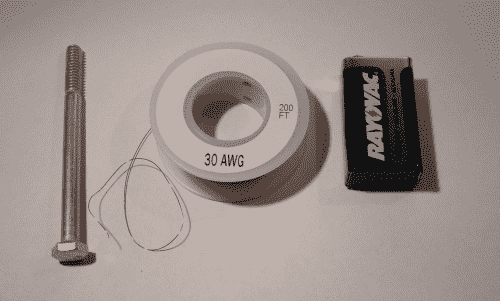](https://cdn.sparkfun.com/assets/1/a/3/4/6/522a2758757b7f7e018b4567.JPG)

在钢上缠绕 75-100 圈钢丝。使用钢中心进一步集中磁场，增加其有效强度。我们将在下一节讨论为什么会发生这种情况。

[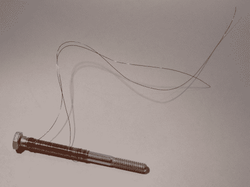](https://cdn.sparkfun.com/assets/d/9/c/e/2/522a2758757b7f5a568b456c.JPG)[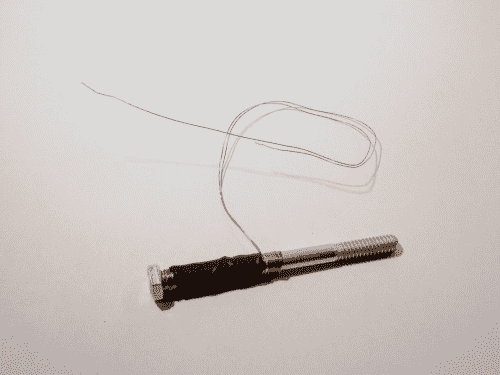](https://cdn.sparkfun.com/assets/f/a/7/9/6/522a4e27757b7fac118b4567.JPG)*A bit of heat shrink or tape can help keep the coils on the steel center.*

现在，用砂纸去除电线末端的绝缘层，将每根电线连接到电池的每个端子上。恭喜你！你已经制造出了发动机的第一个部件！为了测试你的电磁铁的强度，试着拿起回形针或其他小的钢铁物体。

[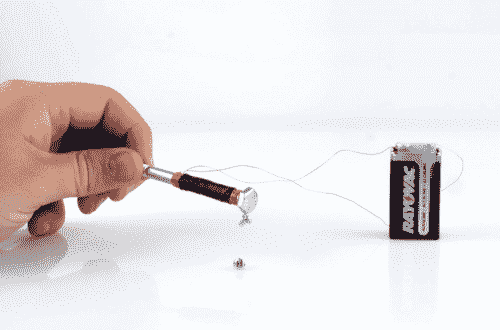](https://cdn.sparkfun.com/assets/3/a/6/9/f/522a4ab9757b7f98118b4568.jpg)*It's not magic, it's SCIENCE!!!*

## 铁磁性

回顾我们思想实验的开始，磁场可能只由一个电流产生。把电流定义为电子的流动，电子绕着一个原子转应该会产生电流，从而产生磁场！如果每个原子都有电子，那么一切都有磁性吗？是啊！所有物质，[包括青蛙](https://www.youtube.com/watch?v=2VlWonYfN3A)，在给予足够的能量时，都可以表现出磁性。但并不是所有的磁力都是同等产生的。我能用折射磁铁而不是青蛙捡起螺丝的原因是[铁磁性](http://en.wikipedia.org/wiki/Ferromagnetism)和[顺磁性](http://en.wikipedia.org/wiki/Paramagnetism)之间的差异。区分这两者(以及更多类型)的方法是通过研究[量子力学](http://en.wikipedia.org/wiki/Quantum_mechanics)。

铁磁性将是我们的焦点，因为它是最强的现象，也是我们最有经验的现象。此外，为了让我们不必在量子水平上理解这一点，我们将接受铁磁材料的原子倾向于将它们的磁场与其邻居对齐。尽管它们趋向于对齐，但材料的不一致性和其他因素如晶体结构会产生[磁畴](http://en.wikipedia.org/wiki/Magnetic_domain)。

[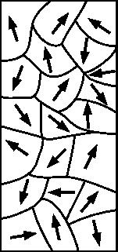](https://cdn.sparkfun.com/assets/5/f/f/8/4/523a3271757b7fe91e8b4568.png)

当磁畴以随机顺序排列时，相邻的磁场相互抵消，产生非磁化材料。一旦存在强外场，就有可能重新排列这些畴。通过排列这些领域，整体磁场增强，创造一个磁铁！

[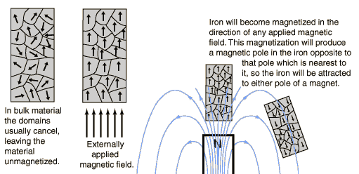](https://cdn.sparkfun.com/assets/f/6/0/5/b/523a1855757b7f696f8b4567.gif)*(Credit: [HyperPhysics](http://hyperphysics.phy-astr.gsu.edu/hbase/hframe.html))*

根据磁场的强度，这种重新排列可以是永久性的。这很好，因为我们将在下一部分需要这些。

## 永久磁铁

永磁体的行为与电磁体相同。唯一的区别是，它们是永久的。

[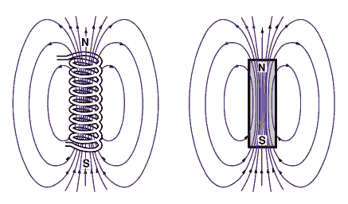](https://cdn.sparkfun.com/assets/e/2/e/4/b/5229074f757b7f4b568b456d.gif)

在所有的图中，箭头将从北极指向南极。另一个惯例是用红色代表北方，蓝色代表南方。要确定磁铁的极性，你可以使用指南针。由于异性相吸，指针将指向磁体南极的北极。

你可以用电磁铁做同样的实验来确定极性。

[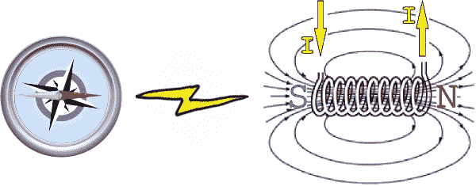](https://cdn.sparkfun.com/assets/learn_tutorials/1/2/6/compassElectromagnet-Corrected.jpg)

如果你颠倒电流的方向，你就能看到电磁铁如何颠倒磁极。

[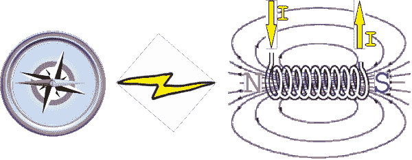](https://cdn.sparkfun.com/assets/4/5/1/4/a/52a224c7757b7f85328b4568.png)

这是制造电机的一个关键原则！现在，让我们看看一些不同的电机，以及它们如何使用磁铁和电磁铁。

## DC 刷电机-经典

[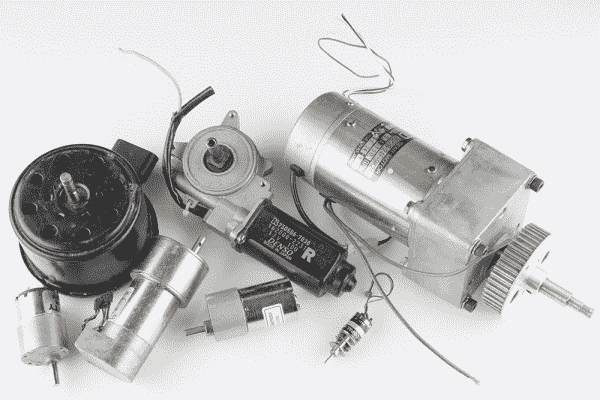](https://cdn.sparkfun.com/assets/1/c/4/1/7/52a0cce7757b7fdf2c8b4568.jpg)

DC 有刷电机是当今使用的最简单的电机之一。你可以在任何地方找到这些马达。它们存在于家用电器、玩具和汽车中。由于构造和控制简单，这些电机是专业人士和爱好者的首选解决方案。

## 有刷电机的剖析

[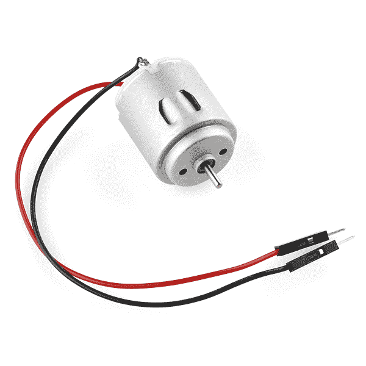](https://cdn.sparkfun.com/assets/a/1/6/0/2/524dcee9757b7f00478b4567.jpg)

为了更好地理解一个人是如何工作的，让我们从拆除一个简单的[业余爱好马达](https://www.sparkfun.com/products/10171)开始。如您所见，它们结构简单，由几个关键组件组成。

[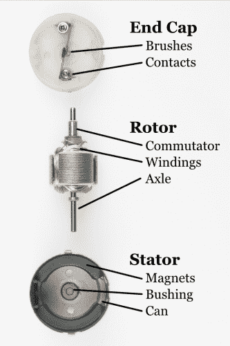](https://cdn.sparkfun.com/assets/9/3/c/2/4/BrushMotorAnatomy_1.png)

*   电刷-通过换向器将电力从触点传递到电枢
*   触点-从控制器向刷子供电
*   换向器-当电枢旋转时，向相应的一组绕组供电
*   绕组-将电能转化为驱动车轴的磁场
*   轴-将电机的机械功率传递给用户应用
*   磁铁-为绕组提供磁场，使其相互吸引和排斥
*   衬套-最大限度地减少车轴的摩擦
*   Can -为电机提供机械外壳

## 操作理论

当绕组通电时，它们会被电机周围的磁铁吸引。这使电机旋转，直到电刷与一组新的换向器触点接触。这种新的接触使一组新的绕组通电，并再次开始这一过程。要反转电机的方向，只需反转电机触点上的极性。有刷电机内部的火花是由电刷跳到下一个触点产生的。线圈的每根导线都连接到两个最近的换向器触点上。

[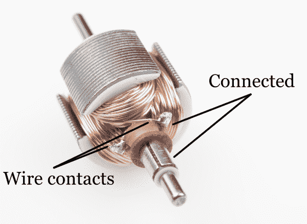](https://cdn.sparkfun.com/assets/a/d/9/c/9/525eb3ce757b7f28278b4569.png)

奇数个绕组总是用来防止电机被锁定在稳定状态。更大的电机也使用更多组绕组来帮助消除“齿槽效应”，从而在低转速下提供平稳控制。用手转动电机轴可以演示齿槽效应。在磁铁最靠近外露定子的地方，你会感觉到运动中的“颠簸”。齿槽效应可以通过设计中的一些技巧来消除，但最普遍的方法是一起移除定子。这些类型的电机被称为[无铁芯或无铁芯电机](http://en.wikipedia.org/wiki/Electric_motor#Ironless_or_coreless_rotor_motor)。

## 赞成的意见

*   易于控制
*   低转速下的出色扭矩
*   廉价和大规模生产

## 骗局

*   随着时间的推移，刷子会磨损
*   电刷电弧会产生电磁噪音
*   通常由于电刷发热而限制速度

## 无刷电机-功率更大！

[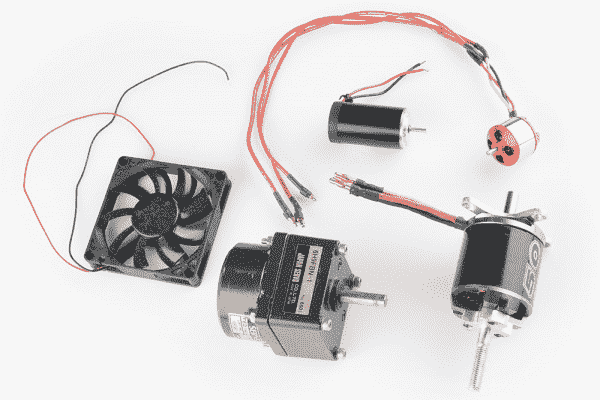](https://cdn.sparkfun.com/assets/3/7/d/a/b/52a0cce6757b7f17488b456b.jpg)

无刷电机正在接管！好吧，也许这有点言过其实了。然而，无刷电机已经开始主导飞机和地面车辆之间的业余爱好市场。在微控制器变得足够便宜和强大之前，控制这些电机一直是一个障碍。人们仍在努力开发速度更快、效率更高的控制器，以释放它们惊人的潜力。没有电刷故障，这些电机提供更多的权力，可以做到这一点。大多数高端电器和车辆正在转向无刷系统。一个显著的例子是[特斯拉 Model S](http://en.wikipedia.org/wiki/Tesla_Model_S) 。

## 无刷电机的剖析

[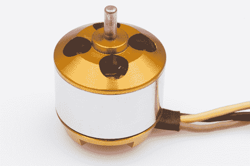](https://cdn.sparkfun.com/assets/6/3/5/8/9/525ee353757b7f8d2d8b4568.jpg)

为了更好地理解一个是如何工作的，让我们从拆除一个简单的无刷电机开始。这些通常可以在遥控飞机和直升机上找到。

[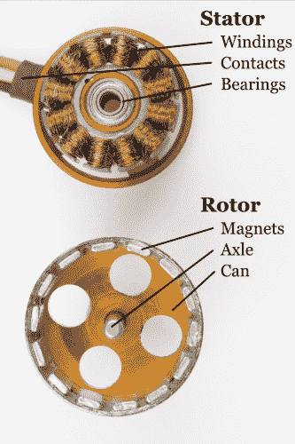](https://cdn.sparkfun.com/assets/0/b/0/0/9/BrushlessMotorAnatomy.png)

*   绕组-将电能转化为驱动转子的磁场
*   触点-从控制器向绕组供电
*   轴承-最大限度地减少轴的摩擦
*   磁铁-为绕组提供磁场以吸引和排斥
*   轴-将电机的机械功率传递给用户应用

## 操作理论

[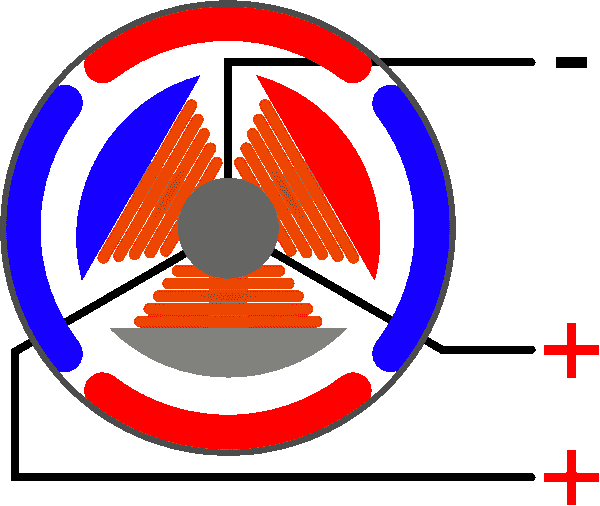](https://cdn.sparkfun.com/assets/f/5/b/e/b/525ee354757b7fc92d8b456c.gif)

无刷电机的结构非常简单。唯一移动的部分是转子，它包含磁铁。事情变得复杂的地方是编排激励绕组的顺序。每个绕组的极性由电流方向控制。动画演示了控制器将遵循的简单模式。交流电改变极性，使每个绕组产生“推/拉”效应。诀窍是保持这种模式与转子的速度同步。有两种(广泛使用的)方法可以实现这一点。大多数业余爱好控制器测量未通电绕组上产生的电压([反向 EMI](http://en.wikipedia.org/wiki/Counter-electromotive_force) )。这种方法在高速运行时非常可靠。随着电机转速降低，产生的电压变得更加难以测量，从而导致更多误差。较新的业余爱好控制器和许多工业控制器利用[霍尔效应传感器](http://en.wikipedia.org/wiki/Hall_effect_sensor)直接测量磁铁位置。这是控制计算机风扇的主要方法。

[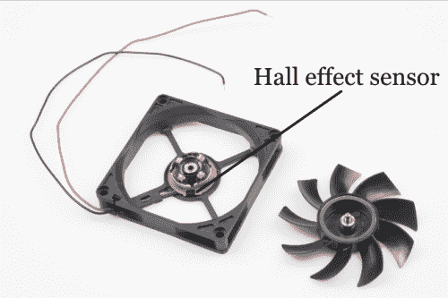](https://cdn.sparkfun.com/assets/8/1/c/7/8/5260259e757b7f9d538b456d.png)

## 赞成的意见

*   可靠的
*   高速的
*   高效的
*   大量生产，容易找到

## 骗局

*   没有专门的控制器很难控制
*   需要低启动负载
*   在驱动应用中通常需要专门的齿轮箱

## 步进电机-简单精确

[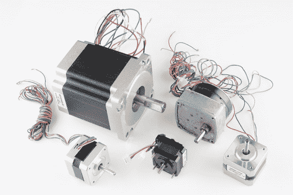](https://cdn.sparkfun.com/assets/b/f/a/9/d/52a0cce7757b7f1a458b4569.jpg)

步进电机是位置控制的好电机。它们可以在桌面打印机、绘图仪、3d 打印机、CNC 铣床以及任何需要精确位置控制的设备中找到。步进电机是无刷电机的一个特殊部分。它们专为高保持扭矩而制造。这种高保持扭矩使用户能够逐步“步进”到下一个位置。这导致了不需要编码器的简单定位系统。这使得步进电机控制器非常容易建立和使用。

## 步进电机的剖析

[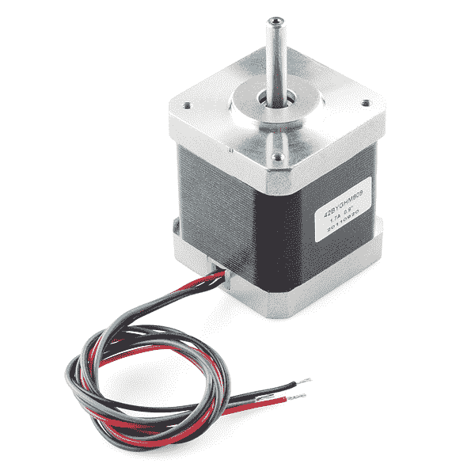](https://cdn.sparkfun.com/assets/f/a/6/9/8/525f0431757b7fa85b8b456a.jpg)

为了更好地理解它是如何工作的，让我们从拆除一个简单的步进电机开始。如您所见，这些电机是为包含一些关键部件的直接驱动负载而制造的。

*   轴-将电机的机械功率传递给用户应用
*   轴承-最大限度地减少轴的摩擦
*   磁铁-为绕组提供磁场以吸引和排斥
*   极点-通过聚焦磁场增加步距的分辨率
*   绕组-将电能转化为驱动车轴的磁场
*   触点-从控制器向绕组供电

## 操作理论

[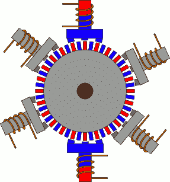](https://cdn.sparkfun.com/assets/b/3/0/5/f/52a27243757b7f7f398b456a.gif)*(Credit: [PCB heaven](http://www.pcbheaven.com/wikipages/How_Stepper_Motors_Work/?p=1))*

步进电机的行为与无刷电机完全相同，只是步进尺寸小得多。唯一移动的部分是转子，它包含磁铁。事情变得复杂的地方是编排激励绕组的顺序。每个绕组的极性由电流方向控制。动画演示了控制器将遵循的简单模式。交流电改变极性，使每个绕组产生“推/拉”效应。一个显著的区别是步进机的磁体结构是如何不同的。很难让一组磁铁在小范围内表现良好。也很贵。为了解决这个问题，大多数步进电机采用叠板方法将磁极导向“齿”。

[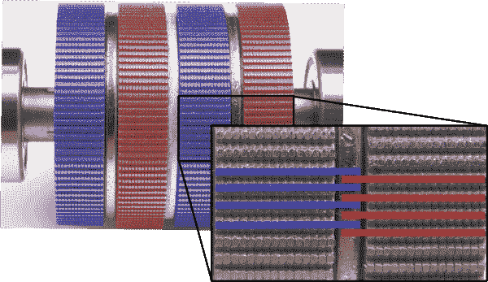](https://cdn.sparkfun.com/assets/b/6/b/4/3/52a24ada757b7f2b268b4567.png)

在无刷电机中，反电动势用于测量速度。步进器依靠每个绕组的短行程来“保证”它及时到达所需的点。在高速行驶中，这会导致失速，此时转子无法跟上顺序。有一些方法可以解决这个问题，但它们依赖于对电机绕组和电感之间关系的更高理解。

## 赞成的意见

*   出色的位置精度
*   高保持扭矩
*   高可靠性
*   大多数踏步机都有标准尺寸

## 骗局

*   小步距离限制了最高速度
*   有可能“跳过”高负荷的步骤
*   不断汲取最大电流

## 直线电机-未来！！！

[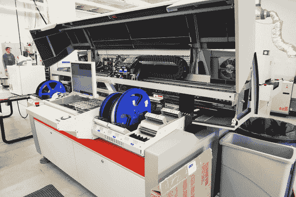](https://cdn.sparkfun.com/assets/d/7/4/6/5/52a2268f757b7fc26b8b4568.jpg "This machine can place over 1000 chips per minute!")

未来是线性的！在高速取放机中，速度就是一切。速度带来摩擦，摩擦带来维护，维护带来停工期，停工期带来生产力损失。通过去除将旋转运动转化为直线运动所需的部件，该系统变得更轻、更高效。直线电机易于维护，并且只有一个运动部件，非常可靠。我有没有提到他们非常快？！这就是我们在生产中使用的[取放机](https://learn.sparkfun.com/tutorials/electronics-assembly/pick-and-place)，它的速度快得令人难以置信！这台机器还装有这样一个冲头，上面有一个心脏起搏器的警告。这里有一整排高功率的[稀土磁体](http://en.wikipedia.org/wiki/Rare-earth_magnet)。

[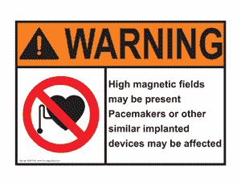](https://cdn.sparkfun.com/assets/0/b/4/2/3/52a7c28f757b7fad038b456e.gif)

## 线性马达的剖析

为了更好地理解其工作原理，让我们看看楼下的取放机。

*   运动模块-包含电磁铁和控制器。
*   磁铁-为线圈提供磁场吸引和排斥
*   线性轴承-保持电机与磁铁对齐，是唯一的运动部件。

[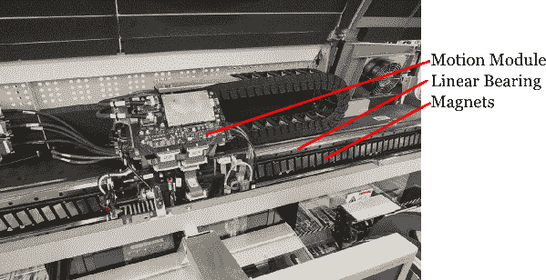](https://cdn.sparkfun.com/assets/5/4/e/b/d/52a68053757b7fa8348b456b.png "Note the massive amount of magnets")

## 操作理论

线性电机的机械结构与无刷电机几乎相同。唯一的区别是，如果你把一个无刷电机展开成一条直线，你就有了一个直线电机。运动模块是唯一的移动部件。事情变得复杂的地方是编排激励线圈的顺序。每个线圈的极性由电流方向控制。动画演示了控制器将遵循的简单模式。交流电改变极性，使每个线圈产生“推/拉”效应。在直线电机中，通常有一个编码器或一些先进的定位系统来跟踪运动模块的位置。为了达到高位置精度，控制器比传统系统中的任何控制器都要复杂得多。[微步进](http://en.wikipedia.org/wiki/Stepper_motor#Microstepping)是一种“节流”磁体的方法，以提供平稳而精确的运动。为了实现这一点，线性电机需要一个高度专业化的控制器为每个电机进行调整。随着控制器技术的改进，我们很可能会看到这些电机的价格下降。也许有一天，我们的 3D 打印机将在几秒钟内打印，而不是几个小时！

## 赞成的意见

*   可靠的
*   高速的
*   高效的
*   不需要旋转到线性的转换

## 骗局

*   昂贵的
*   需要自定义控制器
*   专为每个系统打造
*   我提到贵了吗？

## 资源和更进一步

因此，我们看了一些不同类型的电机以及它们的使用方法。选择电机需要您首先确定应用要求。有了这些要求，你就可以看看每种电机类型的优缺点了。但更重要的是，寻找每个电机的额定值。每个电机都有输入功率和输出功率值。你可以计算一个系统的负载需求，但是有时候试一试就足够简单了！为了给自己一个集成电机的良好开端，请看以下几页:

*   [齿轮比](http://science.howstuffworks.com/transport/engines-equipment/gear-ratio.htm)
*   [轴承](http://en.wikipedia.org/wiki/Bearing_(mechanical))
*   [链传动](http://en.wikipedia.org/wiki/Chain_drive)
*   [脉宽调制](https://learn.sparkfun.com/tutorials/pulse-width-modulation)
*   [用于电机控制的 H 桥](http://en.wikipedia.org/wiki/H_bridge)
*   [Ardumoto 快速入门指南](https://www.sparkfun.com/tutorials/195)

最后，这里是一个学习一切物理学相关知识的好地方。

*   [超物理学](http://hyperphysics.phy-astr.gsu.edu/hbase/hframe.html)