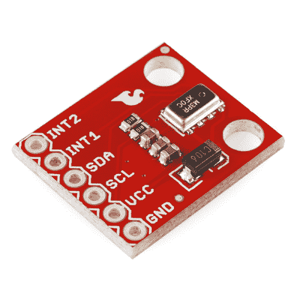
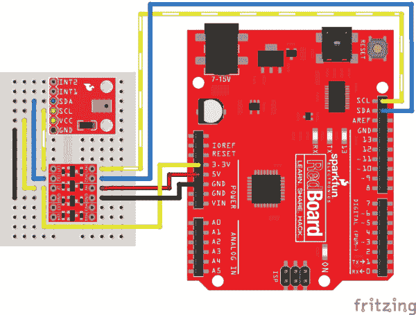
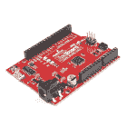
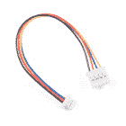
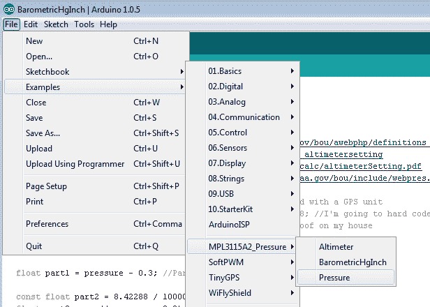
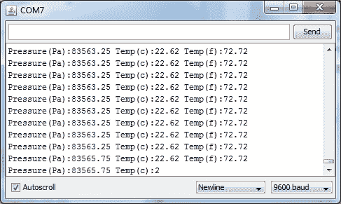
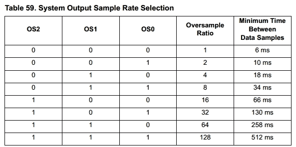
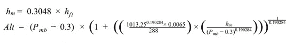

# MPL3115A2 压力传感器连接指南

> 原文：<https://learn.sparkfun.com/tutorials/mpl3115a2-pressure-sensor-hookup-guide>

## MPL3115A2 概述

MPL3115A2 是一款低成本、低功耗、高精度的气压传感器。使用该传感器来检测大气压力(天气变化)或高度(无人机控制器等)的变化。该传感器*非常*灵敏，能够检测到仅 0.05 千帕的变化，这相当于海拔 0.3 米的变化。

 

将**添加到您的[购物车](https://www.sparkfun.com/cart)中！**

### [SparkFun 高度/压力传感器分接头- MPL3115A2](https://www.sparkfun.com/products/11084)

[In stock](https://learn.sparkfun.com/static/bubbles/ "in stock") SEN-11084

人生有起有落，为什么不去衡量它们呢？MPL3115A2 是一款 MEMS 压力传感器，可为 w…

$16.5015[Favorited Favorite](# "Add to favorites") 55[Wish List](# "Add to wish list")** **[https://www.youtube.com/embed/tyN0M3ISyFY/?autohide=1&border=0&wmode=opaque&enablejsapi=1](https://www.youtube.com/embed/tyN0M3ISyFY/?autohide=1&border=0&wmode=opaque&enablejsapi=1)

关于这款传感器，您应该知道:

*   使用 I ² C 接口
*   I ² C 总线上只能有一个传感器
*   使用 I ² C 重复启动条件。Arduino 支持这一点，检查你是否使用不同的微控制器。
*   典型压力精度为 0.05kPa
*   典型高度精度为 0.3 米
*   3C 的典型温度精度
*   3.3V 传感器-使用在线逻辑电平转换器或 330 欧姆电阻来限制 5V 信号
*   这是[数据表](http://cdn.sparkfun.com/datasheets/Sensors/Pressure/MPL3115A2.pdf)
*   这是分线板的[示意图](http://cdn.sparkfun.com/datasheets/Sensors/Pressure/MPL3115A2_breakout.pdf)

该传感器是环境传感、气象站或数据记录的理想选择。它是 [BMP085](https://www.sparkfun.com/products/retired/9694) 的有价值的替代品，比 [MPL115A1](https://www.sparkfun.com/products/9721) 更灵敏。

### 推荐阅读

*   [了解一下我 ² C！](https://learn.sparkfun.com/tutorials/i2c)
*   [在 5V 系统中使用 3.3V 传感器](https://learn.sparkfun.com/tutorials/logic-levels)
*   [安装 Arduino 库](https://learn.sparkfun.com/tutorials/installing-an-arduino-library)
*   [什么是上拉电阻？](https://learn.sparkfun.com/tutorials/pull-up-resistors)
*   [当地压力与气象站压力](https://ambientweather.wikispaces.com/Barometric+pressure+does+not+match+the+official+weather+station)

## 连接起来

MPL3115A2 压力传感器的接线非常简单！在[将您选择的接头](https://learn.sparkfun.com/tutorials/how-to-solder-through-hole-soldering)焊接到电路板上后，您需要使用[逻辑电平转换器](https://www.sparkfun.com/products/12009)转换 5V 和传感器之间的逻辑。

你需要 5v 和 3.3V 用于 VCC，一个用于 GND，两条数据线用于 Arduino 的 I ² C 通信。您也可以在没有 SDA 和 SCL 的老式 Arduino 板上使用 A4 和 A5 引脚。

**Note:** This breakout board has built-in 1k&ohm; pull up resistors for I²C communications. If you're hooking up multiple I²C devices on the same bus, you may need to disable the other resistors on the bus.**Note:** If you have a RedBoard Qwiic, there is an alternative to use the built-in logic level converter using the qwiic adapter and cable or jumpers that can be used to adjust the voltage level to 3.3V.

 

将**添加到您的[购物车](https://www.sparkfun.com/cart)中！**

### [spark fun RedBoard Qwiic](https://www.sparkfun.com/products/15123)

[In stock](https://learn.sparkfun.com/static/bubbles/ "in stock") DEV-15123

SparkFun RedBoard Qwiic 是一款 Arduino 兼容开发板，内置 Qwiic 连接器，无需…

$21.5014[Favorited Favorite](# "Add to favorites") 49[Wish List](# "Add to wish list")**** 

将**添加到您的[购物车](https://www.sparkfun.com/cart)中！**

### [SparkFun Qwiic 适配器](https://www.sparkfun.com/products/14495)

[In stock](https://learn.sparkfun.com/static/bubbles/ "in stock") DEV-14495

SparkFun Qwiic 适配器提供了将任何旧 I ² C 板改造成支持 Qwiic 的板的完美方法。

$1.601[Favorited Favorite](# "Add to favorites") 53[Wish List](# "Add to wish list")**** 

将**添加到您的[购物车](https://www.sparkfun.com/cart)中！**

### [Qwiic 电缆槽适配器(100mm)](https://www.sparkfun.com/products/15109)

[In stock](https://learn.sparkfun.com/static/bubbles/ "in stock") PRT-15109

Qwiic 到 Grove 适配器电缆允许 SparkFun Qwiic 连接系统和 Grove bo 之间的互操作性

$1.60[Favorited Favorite](# "Add to favorites") 11[Wish List](# "Add to wish list")****** ******### 连接表

关于逻辑电平转换器，下表列出了从 LV1 开始的引脚连接。

| MPL3115A2 | 逻辑电平转换器*(低端)* | 逻辑电平转换器*(高端)* | 5V Arduino，带 Atmega328P |
| SCL | LV1 | HV1 | SCL *(或 A5)* |
| 国家药品监督管理局 | LV2 | HV2 | SDA *(或 A4)* |
| VCC | LV |  | 3.3V |
|  |  | 超速(Hyper-Velocity) | 5V |
| GND | GND | GND | GND |

**Note:** Not all microcontrollers use the same pin for SDA and SCL. If you are using a [different architecture that is not the Atmega328P](https://www.arduino.cc/en/reference/wire), make sure to edit the code accordingly if you use those pins instead.

## Arduino 代码

以下 Arduino 示例将使您的传感器快速启动并运行，并以帕斯卡为单位显示当前压力。

**注意:**此示例假设您在桌面上使用的是最新版本的 Arduino IDE。如果这是你第一次使用 Arduino，请回顾我们关于[安装 Arduino IDE 的教程。](https://learn.sparkfun.com/tutorials/installing-arduino-ide)

If you have not previously installed an Arduino library, please check out our [installation guide.](https://learn.sparkfun.com/tutorials/installing-an-arduino-library)[Download library here](https://github.com/sparkfun/SparkFun_MPL3115A2_Breakout_Arduino_Library/archive/master.zip)*Load the Pressure example*

一旦安装了库，打开 Arduino，并展开 examples 菜单。您应该会看到 MPL3115A2_Pressure 子菜单。将“压力”示例加载到 Arduino 上。[以 9600bps 的速度打开串行终端](https://learn.sparkfun.com/tutorials/terminal-basics/arduino-serial-monitor-windows-mac-linux)。你会看到房间里当前的气压和温度！

*Pressure readings!*

加载`BarometricHgInch`示例，该示例将压力从帕斯卡转换为英寸汞柱，高度计设置已调整。在美国，这种类型的压力读数被用于家庭气象站和飞机的地下。

加载`Altimeter`示例，获取将压力转换为当前海拔高度(英尺或米)的示例。

### 功能解释

该库和示例代码演示了 MPL3115A2 支持的最流行的功能。以下是对库中所有可用函数的解释:

*   **myPressure.begin()** 获取 I ² C 总线上的传感器。
*   **my pressure . read altitude()**返回海平面以上米数的浮点数。例如:1638.94
*   **my pressure . readaltitudeft()**返回一个海拔英尺数的浮点数。例如:5376.68
*   **my pressure . read pressure()**返回一个以 Pa 为单位的大气压力的浮点数。例如:83351.25
*   **myPressure.readTemp()** 返回一个以摄氏度为单位的当前温度的浮点数。例:23.37
*   **myPressure.readTempF()** 返回当前华氏温度的浮点值。例如:73.96 英镑
*   **my pressure . setmode barometer()**将传感器置于帕斯卡测量模式。
*   **my pressure . setmodealtimeter()**将传感器置于测高模式。
*   **my pressure . setmodestandy()**将传感器置于待机模式。更改 CTRL1 寄存器时需要。
*   **my pressure . setmodeactive()**开始测量！
*   **my pressure . setoversamplerate(byte)**从 1 到 128 设置样本数。见下面的注释*
*   **my pressure . enableeventflags()**设置基本事件标志。安装过程中需要。

当您调用 readAltitude、readAltitudeFt、readPressure 或 readTemp 时，您将获得一个带有传感器读数的浮点数或一个错误代码:

*   1638.94 是一个有效读数的例子。
*   -999 表示 I2C 超时(最长 512 毫秒)。检查您的连接。

*Oversample settings*

*   **setOversampleRate(byte)** 接收一个从 0 到 7 的值。检查上面的表 59。允许用户在 1 至 128 范围内改变采样速率。提高采样速率会显著降低每个读数的噪声，但会增加获取每个读数的时间。过采样 128 会将噪声降至 1.5Pa RMS，但每次读取需要 512ms。数据手册建议基本应用采用 128 倍过采样。

MPL3115A2 具有大量特性。查看[数据表](http://cdn.sparkfun.com/datasheets/Sensors/Pressure/MPL3115A2.pdf)了解更多信息。这个库涵盖了基础知识。帮帮我们！请在 [MPL3115A2 github repo](https://github.com/sparkfun/MPL3115A2_Breakout) 上添加或建议更多功能。

## 压力与高度计设置

如果你拿到了一些压力读数，在查看当地天气情况时感到困惑，你并不孤单。MPL3115A2 压力传感器输出的绝对压力与气象站所说的压力不同。气象站用许多不同的单位报告压力:

*   毫米汞柱
*   英寸汞柱(inHg)
*   毫巴或百帕)
*   每平方英寸磅数
*   大气(Atm)
*   千克每厘米
*   英寸水柱

在气压计模式下，MPL3115A2 以帕斯卡为单位输出压力读数。这与毫巴或百帕关系最为密切。但是，为什么传感器与拐角处的站不一致？这是因为许多站以几种不同的格式报告压力。看看 T2 博尔德/丹佛地区的所有这些数字。关键是你当地的气象站可能正在报告*高度计设置*。

谢谢国家海洋和大气管理局( [NOAA](http://www.noaa.gov/) )！你知道他们的总部在科罗拉多州的博尔德吗？

*   **站压** -这是在特定高度观察到的压力，是一个位置的真实气压。
*   **高度计设置** -这是在广播和电视节目中最常听到的压力读数。这不是一个站的真实气压。相反，它是使用“标准”大气的温度剖面“降低”到平均海平面的压力，该温度剖面代表美国北纬 40 度的平均条件。
*   平均海平面气压 -这是气象学家最常用来追踪地表天气系统的气压读数。像高度计设置一样，它是一个“降低的”压力，使用观测条件而不是“标准”条件来消除压力读数中海拔的影响。

从帕斯卡到“高度计设置”的计算有点复杂:

*Formula to convert Pascal pressure to Altimeter setting*

在这里获取[的完整公式，并给这个伟大的](https://www.weather.gov/media/epz/wxcalc/altimeterSetting.pdf)[高度计设置计算器](https://www.weather.gov/epz/wxcalc_altimetersetting)一个尝试。这个公式依赖于两件事:知道当前的气压(单位为毫巴)和知道气压读数的海拔高度。我们建议您使用当地的测量点或 [GPS 接收器](https://www.sparkfun.com/categories/4)来获取海拔高度。

如果你安装了 [MPL3115A2 库](https://github.com/sparkfun/MPL3115A2_Breakout/blob/master/library/MPL3115A2_Pressure.zip)，在 Arduino IDE 下的 Examples->mpl 3115 a 2 _ Pressure 菜单下也应该有 *BarometricHgInch* 示例草图。我们没有将这个计算内置到库中，因为它可能会消耗大量的 RAM 和代码空间来计算所有的浮点数学。但是，如果你正在做家庭气象站计算，这应该让你开始。

## 资源和更进一步

既然你已经掌握了气压感测，那么考虑一下以下项目和产品:

*   [MPL3115A2 分线示意图(PDF)](http://cdn.sparkfun.com/datasheets/Sensors/Pressure/MPL3115A2_breakout.pdf)
*   [MPL3115A2 数据手册](http://cdn.sparkfun.com/datasheets/Sensors/Pressure/MPL3115A2.pdf)
*   开源代码库
    *   [产品回购](https://github.com/sparkfun/MPL3115A2_Breakout)
    *   [Arduino 库](https://github.com/sparkfun/SparkFun_MPL3115A2_Breakout_Arduino_Library)
*   [SparkFun 简单素描演示](https://youtu.be/tyN0M3ISyFY)

正在寻找使用 MPL3115A2 压力传感器的方法？你可以:

*   结合一个[电子 Imp](https://www.sparkfun.com/products/11395) 创建一个无线压力传感器
*   将多个压力传感器结合在一起，创造出一只[触觉机器人手](http://biorobotics.harvard.edu/pubs/2012/journal/2012_YTenzer_BarometricSensors.pdf)。参见 [TakkTile](http://www.gizmag.com/takktile-robot-touch-sensor/27157/) 。
*   检查 MPL3115A2 的[天气防护罩](https://www.sparkfun.com/products/12081)以及许多其他传感器********