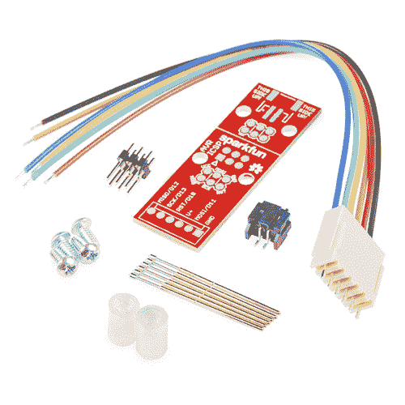

# 安装 Arduino 引导程序

> 原文：<https://learn.sparkfun.com/tutorials/installing-an-arduino-bootloader>

## 介绍

**Heads up!** This tutorial was written for AVR microcontrollers with an Arduino bootloader using ICSP pins. If you are using an ARM microcontroller with SWD pins, you will need a dedicated programmer (i.e. Atmel JTAG ICE 3 or Atmel-ICE) to connect to the SWD port. For more information, check out our [ARM programming](https://learn.sparkfun.com/tutorials/arm-programming) tutorial.

你有不再接受代码的砖砌 Arduino 吗？或者，也许你写了自己的固件，想上传到你的 Arduino？或者，也许你只是想了解更多关于 Arduino、AVR 和微控制器的内部工作原理。嗯，你很幸运！本教程将教你什么是引导加载程序，为什么你需要安装/重新安装它，并回顾这样做的过程。

[](https://cdn.sparkfun.com/assets/learn_tutorials/2/2/Arduino_Install_Bootloader__AVR_Programmers_MKII.jpg)

### 推荐阅读

在继续引导加载程序之前，您可能需要查看这些教程。

[](https://learn.sparkfun.com/tutorials/pcb-basics) [### PCB 基础知识](https://learn.sparkfun.com/tutorials/pcb-basics) What exactly IS a PCB? This tutorial will breakdown what makes up a PCB and some of the common terms used in the PCB world.[Favorited Favorite](# "Add to favorites") 50[](https://learn.sparkfun.com/tutorials/serial-peripheral-interface-spi) [### 串行外设接口(SPI)](https://learn.sparkfun.com/tutorials/serial-peripheral-interface-spi) SPI is commonly used to connect microcontrollers to peripherals such as sensors, shift registers, and SD cards.[Favorited Favorite](# "Add to favorites") 91[](https://learn.sparkfun.com/tutorials/what-is-an-arduino) [### 什么是 Arduino？](https://learn.sparkfun.com/tutorials/what-is-an-arduino) What is this 'Arduino' thing anyway? This tutorials dives into what an Arduino is and along with Arduino projects and widgets.[Favorited Favorite](# "Add to favorites") 50[](https://learn.sparkfun.com/tutorials/installing-arduino-ide) [### 安装 Arduino IDE](https://learn.sparkfun.com/tutorials/installing-arduino-ide) A step-by-step guide to installing and testing the Arduino software on Windows, Mac, and Linux.[Favorited Favorite](# "Add to favorites") 16[](https://learn.sparkfun.com/tutorials/integrated-circuits) [### 集成电路](https://learn.sparkfun.com/tutorials/integrated-circuits) An introduction to integrated circuits (ICs). Electronics' ubiquitous black chips. Includes a focus on the variety of IC packages.[Favorited Favorite](# "Add to favorites") 46[](https://learn.sparkfun.com/tutorials/pocket-avr-programmer-hookup-guide) [### 袖珍 AVR 编程器连接指南](https://learn.sparkfun.com/tutorials/pocket-avr-programmer-hookup-guide) Skip the bootloader and load your program directly onto an AVR with the AVR Pocket Programmer.[Favorited Favorite](# "Add to favorites") 10

## 什么是引导加载程序？

Atmel AVRs 是很棒的小 IC，但是编程起来有点棘手。你需要一个特殊的程序员和一些花哨的**。hex** 文件，对初学者来说不太友好。Arduino 已经很大程度上解决了这些问题。他们已经放了一个**。十六进制**文件，允许你通过[串行端口](https://learn.sparkfun.com/tutorials/serial-communication)对电路板进行编程，这意味着你只需要一根 USB 电缆就可以对你的 Arduino 进行编程。

bootloader 基本上就是一个**。打开电路板时运行的十六进制**文件。它非常类似于在你的个人电脑上运行的 [BIOS](http://en.wikipedia.org/wiki/BIOS) 。它做两件事。首先，它环顾四周，看看计算机是否试图给它编程。如果是，它从计算机中抓取程序并上传到 ICs 存储器中(在一个特定的位置以免覆盖引导装载程序)。这就是为什么当你试图上传代码时，Arduino IDE 会重置芯片。这基本上是关闭 IC，然后再次打开，这样引导装载程序就可以再次开始运行。如果计算机没有试图上传代码，它会告诉芯片运行已经存储在内存中的代码。一旦它找到并运行你的程序，Arduino 就不断地循环程序，只要主板有电就这样做。

### 为什么要安装引导程序？

如果您正在构建自己的 Arduino，或者需要更换 IC，您将需要安装引导程序。您也可能有一个坏的引导程序(虽然这是非常罕见的)，需要重新安装引导程序。也有这样的情况，你把你的主板放在一个奇怪的设置中，重新安装引导程序并恢复出厂设置是解决这个问题最简单的方法。我们已经看到有人关闭了串行端口的主板，这意味着无法将代码上传到主板，虽然可能有其他方法可以解决这个问题，但重新安装引导程序可能是最快最简单的方法。像我说的，有一个坏的引导程序实际上是非常非常罕见的。如果你有一个不接受代码的新主板，99.9%的时间都不是引导程序。其余 1%的时间，本指南将帮助你解决这个问题。

## 选择程序员

我们将讨论两种不同类型的程序员，你可以用它们来安装或重新安装引导程序。

### 选项 1:专职程序员

对于一个快速简单的程序员，我们建议看看 [AVR 袖珍编程器](https://www.sparkfun.com/products/9825)(仅 Windows)。

[](https://www.sparkfun.com/products/9825) 

将**添加到您的[购物车](https://www.sparkfun.com/cart)中！**

 **### [袖珍 AVR 编程器](https://www.sparkfun.com/products/9825)

[In stock](https://learn.sparkfun.com/static/bubbles/ "in stock") PGM-09825

这个新版本使用 SMD 5x2 标题。这是一个简单易用的 USB AVR 编程器。它成本低，易于使用，工程大…

$18.5053[Favorited Favorite](# "Add to favorites") 31[Wish List](# "Add to wish list")** **或者，您可以使用 ARM、SAM 和 AVR 的官方 Atmel-ICE 编程器。

 

### Atmel-ICE 编程器和调试器

[Retired](https://learn.sparkfun.com/static/bubbles/ "Retired") PGM-14950

Atmel-ICE 是一个强大的开发工具，用于 ARM 设备的调试和编程。

**Retired****Note:** The following programmers that have been retired also can be used.

| [](https://cdn.sparkfun.com/assets/f/d/c/2/9/523b5a4d757b7f91208b456a.jpg) | [](https://cdn.sparkfun.com/assets/learn_tutorials/2/2/AVR_ICE3_1.jpg) |
| *[AVR MKII](https://www.microchip.com/developmenttools/ProductDetails/atavrisp2)* | *[JTAG 冰 3](http://www.microchip.com/developmenttools/ProductDetails/atjtagice3)* |

AVR 袖珍编程器或大多数更便宜的选项对于大多数应用程序来说都很好，但它们可能会对某些板有问题，特别是那些具有大量内存的板，如基于 ATMega2560 的板。

### 选项 2:将 Arduino 用作程序员

另一个选择是拿一个 Arduino Uno(或 Duemilanove)。如果你进入 Arduino IDE，你会看到一个名为**‘Arduino 作为 ISP’的示例草图。**如果你把这段代码上传到你的 Arduino 上，它基本上就充当了 AVR 程序员的角色。对于生产主板或大容量内存的主板来说，这并不值得推荐，但是，在紧要关头，它工作得相当好。此外，截至本文撰写之时，该代码仅适用于 ATmega328 电路板。也许有一天它会在达芬奇或 Due 上工作，但现在还不是时候。

## 硬件连接

### 在线串行编程(ICSP)

在 IC 焊接到 PCB 上之前对其进行编程是非常罕见的。相反，大多数微控制器都有所谓的系统内编程( [ISP](http://en.wikipedia.org/wiki/In-System_Programming) )头。特别是，一些 IC 制造商，如 Atmel 和 Microchip，有专门的 ISP 方法对其 IC 进行编程。这被称为在线串行编程()。大多数 Arduino 和 Arduino 兼容的主板上都有一个 2x3 针 ICSP 接头。根据 PCB 上的 IC 数量，有些甚至可能不止一个。它断开三个 [SPI](https://learn.sparkfun.com/tutorials/serial-peripheral-interface-spi) 引脚(MISO、MOSI、SCK)、电源、接地和复位。这些是你需要连接你的编程器的管脚，以便刷新你的板上的固件。

[](https://cdn.sparkfun.com/assets/c/a/f/b/7/529e2d18757b7f196b8b4567.jpg)*Here we have the Arduino Uno R3\. It has two ICSP headers: one for the ATmega16U2 and one for the ATmega328\. To reflash the bootloader on this board, you would use just the ICSP header for the ATmega328.*

在一些较小的电路板上，你可能看不到这个连接器，但引脚应该在其他地方断开。无论您使用的是 [SMD IC 还是 DIP IC](https://learn.sparkfun.com/tutorials/integrated-circuits/ic-packages) ，ISP 引脚都应该以某种形式可用。有些电路板可能只有 ISP 接头的测试点。如果是这种情况，你可能要考虑得到一个 [ISP Pogo 适配器](https://www.sparkfun.com/products/11591)。该套件允许您暂时与测试点建立良好的连接，以便对您的 IC 进行重新编程。

[](https://www.sparkfun.com/products/11591) 

将**添加到您的[购物车](https://www.sparkfun.com/cart)中！**

 **### [SparkFun ISP Pogo 适配器](https://www.sparkfun.com/products/11591)

[In stock](https://learn.sparkfun.com/static/bubbles/ "in stock") KIT-11591

Pogo 引脚使生活变得更加容易，当你试图编程，而不必焊接一个东西，当你连接到…

$13.954[Favorited Favorite](# "Add to favorites") 12[Wish List](# "Add to wish list")******Note:** If you are having trouble finding the ICSP pins on your particular Arduino board, simply check out the Eagle board files or graphical datasheet for the development board. At SparkFun, we have generated a [few graphical datasheets for select boards that we manufacture](https://github.com/sparkfun/Graphical_Datasheets/tree/master/Datasheets).

一旦你在你的板上找到了**六个 ICSP 针**，就该把你的程序员接到板上了。你可以用一根[编程线](https://www.sparkfun.com/products/9215)连接两者，或者，如果你没有线，你可以只用一些[公母跳线](https://www.sparkfun.com/products/9140)。

[](https://www.sparkfun.com/products/9140) 

将**添加到您的[购物车](https://www.sparkfun.com/cart)中！**

 **### [跳线高级 6" M/F 装 10 根](https://www.sparkfun.com/products/9140)

[In stock](https://learn.sparkfun.com/static/bubbles/ "in stock") PRT-09140

这是一个 SparkFun 独家！这些都是 155 毫米长，26 美国线规跳线终止作为男性到女性。用这些来跳离…

$4.501[Favorited Favorite](# "Add to favorites") 16[Wish List](# "Add to wish list")****[](https://www.sparkfun.com/products/9215) 

将**添加到您的[购物车](https://www.sparkfun.com/cart)中！**

 **### [AVR 编程电缆](https://www.sparkfun.com/products/9215)

[In stock](https://learn.sparkfun.com/static/bubbles/ "in stock") CAB-09215

这是一种方便的 AVR 编程电缆，集成了 10 引脚和 6 引脚 ISP 编程接口。电缆是一种…

$2.103[Favorited Favorite](# "Add to favorites") 5[Wish List](# "Add to wish list")**** ****### 将袖珍 AVR 编程器连接到目标

如果您使用的是诸如 pocket AVR 编程器之类的编程器，您的设置应该类似于下面的连接，AVR 编程电缆的**箭头(▽)**连接到 **MISO** 。如果您仔细观察 2x3 连接器的成型，您应该能够注意到**箭头(▽)**指向相对于标准 ICSP 接头位置的引脚 1。

[](https://cdn.sparkfun.com/assets/learn_tutorials/2/2/Pocket_AVR_Programmer_to_Target_AVR_Arduino_with_Pinouts.jpg)*Click for larger image.***Heads up!** There is a subtle difference in the orientation of the [2x5 to 2x3 AVR programming cable](https://www.sparkfun.com/products/9215) compared to other 2x3 cables that are attached to official Atmel programmers. As shown in the image below with MISO highlighted by a white dot, the pocket AVR programmer's cable has MISO connected closer toward the inside of the cable. The AVR MKII's cable has MISO connected closer toward the outside of the cable.

[](https://cdn.sparkfun.com/assets/learn_tutorials/2/2/Arduino_Install_Bootloader__AVR_Programmers_MKII.jpg)
*Click for larger image.*
You also might notice that there is **not a USB cable connected to one of the RedBoards**. Since the pocket AVR programmer can provide 5V power to the target AVR with the switch flipped to the *Power Target* position, a USB cable is not needed for the RedBoard. However, the official Atmel AVR MKII is not able to provide power to the target board. Thus, a cable is required to connect to the target AVR.

The same goes for newer Atmel programmers. The image below shows the Atmel JTAG ICE3 connected to a RedBoard. As you can see, the position of the AVR cable is connected to the RedBoard similar to the image with the AVR MKII. Since the programmer is not able to provide power to the target, you would need an additional cable connected to the target AVR.

[](https://cdn.sparkfun.com/assets/learn_tutorials/2/2/Arduino_Install_Bootloader_AVR_Programmer_Atmel__JTAG_ICE.jpg)
*Click for larger image.*

### 将 Arduino 作为 ISP 连接到目标

或者，如果你使用 Arduino 作为你的程序员，它应该看起来像下面的图片。请确保将 Arduino 连接到您的电脑，以 ISP 身份为其供电。

[](https://cdn.sparkfun.com/assets/learn_tutorials/2/2/Fritzing_ArduinoasISP_AVR_Programmer_bb.png)*Click for larger image.***Tip** Looking for more examples besides connnecting two Arduino Unos together? Try checking out Arduino.cc's ArduinoISP page for more information.

[Arduino.cc - ArduinoISP](https://www.arduino.cc/en/Tutorial/ArduinoISP#toc3)

### 连接表

⚡ **Power Your Target Arduino!** Make sure to power your target Arduino. Otherwise, you will not be able to flash the **.hex** file to your target.

下面的表格有助于明确哪些连接通向哪里。根据 Arduino，您可能只能使用 2x3 ICSP 接头上的 ICSP 引脚。有关 [Arduino 的 SPI 连接](https://www.arduino.cc/en/reference/SPI)的更多信息，请务必参考电路板布局。

| AVR Programmer | Arduino 作为 ISP | 2x3 ICSP 割台 | ATmega328 | ATmega2560 | ATmega32U4 |
| 5V | Vcc/5V | 引脚 2 | Vcc | Vcc | Vcc |
| GND | GND | 针脚 6 | GND | GND | GND |
| MOSI | MOSI/D11 | 引脚 4 | D11 | D51 | D16 |
| 军事情报部门组织(Military Intelligence Service Organization) | MISO/D12 | 引脚 1 | D12 | D50 | D14 |
| 血清肌酸激酶 | SCK/D13 | 引脚 3 | D13 | D52 | D15 |
| 重置 | D10 | 引脚 5 | 重置 | 重置 | 重置 |

**Warning!** The connection is for a 5V Arduino. If you are connecting to a Arduino that is using a lower voltage, make sure to safely convert the logic levels using a converter between the programmer and target Arduino.

[](https://www.sparkfun.com/products/12009) 

将**添加到您的[购物车](https://www.sparkfun.com/cart)中！**

 **### [SparkFun 逻辑电平转换器-双向](https://www.sparkfun.com/products/12009)

[In stock](https://learn.sparkfun.com/static/bubbles/ "in stock") BOB-12009

SparkFun 双向逻辑电平转换器是一个小型设备，可以安全地将 5V 信号降压至 3.3V，并升压 3。…

$3.50116[Favorited Favorite](# "Add to favorites") 146[Wish List](# "Add to wish list")****[](https://www.sparkfun.com/products/15439) 

将**添加到您的[购物车](https://www.sparkfun.com/cart)中！**

 **### [SparkFun 关卡翻译器分会场- PCA9306](https://www.sparkfun.com/products/15439)

[In stock](https://learn.sparkfun.com/static/bubbles/ "in stock") BOB-15439

不同的部分有时使用不同的电压电平进行通信。这款 PCA9306 电平转换器是制作…

$4.951[Favorited Favorite](# "Add to favorites") 22[Wish List](# "Add to wish list")****[](https://www.sparkfun.com/products/11771) 

将**添加到您的[购物车](https://www.sparkfun.com/cart)中！**

 **### [SparkFun 电压电平转换器分线点- TXB0104](https://www.sparkfun.com/products/11771)

[In stock](https://learn.sparkfun.com/static/bubbles/ "in stock") BOB-11771

这是德州仪器 TXB0104 模块的分线板。TXB0104 是一款 4 位双向电压电平转换器

$4.957[Favorited Favorite](# "Add to favorites") 28[Wish List](# "Add to wish list")************For more information, check out our tutorial about logic levels.

[](https://learn.sparkfun.com/tutorials/logic-levels) [### 逻辑电平](https://learn.sparkfun.com/tutorials/logic-levels) Learn the difference between 3.3V and 5V devices and logic levels.[Favorited Favorite](# "Add to favorites") 82

## 上传代码-简单的方法

**注意:**此示例假设您在桌面上使用的是最新版本的 Arduino IDE。如果这是你第一次使用 Arduino，请回顾我们关于[安装 Arduino IDE 的教程。](https://learn.sparkfun.com/tutorials/installing-arduino-ide)

上传引导程序的简单方法是使用 Arduino IDE。

### 作为 ISP 上传 Arduino

**Warning!** You will need to upload the *ArduinoISP.ino* to your known good Arduino (i.e. your programming board) before being able to use it as a programmer.

拿一个已知良好的 RedBoard 或 Arduino Uno。打开你的 Arduino IDE。在你的菜单中，选择**文件>示例> 11。ArduinoISP > ArduinoISP** 打开 Arduino 作为 ISP 草图

[](https://cdn.sparkfun.com/assets/learn_tutorials/2/2/InstallingArduinoBootloader_ArduinoasISP_Sketch.jpg)

为您的 Arduino 选择 COM 端口作为 ISP。COM 端口可能会有所不同，这取决于它在您的计算机上的枚举方式。

[](https://cdn.sparkfun.com/assets/learn_tutorials/2/2/InstallingArduinoBootloader_Arduino_IDE_ArduinoasISP_COM_Port_Select.jpg)

把代码上传到你的 Arduino，把它变成 AVRISP。

[](https://cdn.sparkfun.com/assets/learn_tutorials/2/2/InstallingArduinoBootloader_ArduinoasISP_Sketch_Upload_2.jpg)

### 向您的目标刻录引导程序

让 Arduino 作为 ISP(即您的程序员)与您的电脑保持连接。如果您尚未连接，请连接您的目标 Arduino。然后在**工具>板卡**下为你的目标 Arduino 选择板卡定义。

[](https://cdn.sparkfun.com/assets/learn_tutorials/2/2/InstallingArduinoBootloader_ArduinoasISP_Target_Board_Selection.jpg)

在**工具>编程器**下选择你正在使用的编程器。在这种情况下，我们的程序员是作为 ISP 的 Arduino，因此选择 **Arduino 作为 ISP** 。如果您尚未选择 COM 端口，您还需要选择 Arduino as ISP 连接的 COM 端口。

[](https://cdn.sparkfun.com/assets/learn_tutorials/2/2/Installing_ArduinoBootloader_ArduinoIDE_ArduinoasISP_Programmer.jpg)**Heads up!** You may encounter more than one selection for "Arduino as ISP" in the list of programmers. Either one will work. However, "ArduinoISP" will not work if it is selected.

最后选择**刻录引导程序**。这将获取你在 Arduino IDE 中选择的主板，并在 *board.txt* 文件中查找相关的引导程序。然后，它会在 Arduino IDE 的程序文件夹中找到引导程序(特别是“**...\ Arduino \ hardware \ Arduino \ AVR \ boot loaders**")并安装。只有当主板正确安装在 IDE 中并且您有正确的引导程序时，这种方法才有效。

[](https://cdn.sparkfun.com/assets/learn_tutorials/2/2/InstallingArduinoBootloader_Burn_Bootloader_Arduino_IDE_ArduinoasISP.jpg)

如果出于某种原因，您想使用 Arduino IDE 中没有安装的引导程序，请访问下一节。然而，从 Arduino IDE 安装引导程序可能更容易。对于那些对保险丝等设置感到好奇的人，不要害怕。当你通过 Arduino 烧录 bootloaders 时，它会为你处理所有杂乱的细节。

* * *

## 上传代码-困难的方式

最难的是那些想要使用[命令行](https://learn.sparkfun.com/tutorials/terminal-basics/command-line-windows-mac-linux)的人。如果您正在修改和重新编译，并且不想一直更新 IDE，那么这种方法可能更可取，但是在其他情况下，这是非常不必要的。同样，你需要得到程序员和挂钩一切。在本例中，我们在 Windows 上使用 avrdude。

这个过程有三个步骤:

*   设置熔丝位(即低、高和扩展)
*   闪光**。十六进制**文件
*   设置锁定位

第一步涉及设置熔丝位。Fusebits 是 AVR 芯片的一部分，它决定您是否使用外部晶振或是否需要掉电检测。下面列出的命令专门用于使用 ATMega328 的 Arduino Uno，它们可能也适用于其他类似的电路板，如 Duemilanove，但在使用 fusebits 之前，请确保您知道自己在做什么。所有需要的熔丝位都列在不同板卡的 *boards.txt* 文件中。同样，如果你已经安装了一个 *boards.txt* 文件，那么就使用简单的方法。第二步其实就是上传程序。最后一步是设置锁定位。

**Note:** These fusebits will **not** work on a 3.3V/8MHz board. If you are using a different microcontroller, you will also need adjust the [partno parameter](http://www.nongnu.org/avrdude/user-manual/avrdude_4.html#Option-Descriptions).

### 袖珍 AVR 编程器

#### 熔丝位

如果您正在使用 AVR 袖珍编程器对您的目标 Arduino Uno 进行编程，请在命令行中键入以下命令来设置熔丝位。

```
language:bash
avrdude -b 19200 -c usbtiny -p m328p -v -e -U efuse:w:0x05:m -U hfuse:w:0xD6:m -U lfuse:w:0xFF:m 
```

#### 十六进制文件和锁定位

一旦熔丝位被置位，我们就可以刷新一个编译过的**。十六进制**文件到目标板并设置锁定位。在命令行中输入以下内容。确保你和你的**在同一个目录下。十六进制**文件和调整`...hexfilename.hex`，你是用来为你的目标闪光。要刷新 Arduino Uno 引导程序，请转到 Arduino 程序文件夹。在 Windows 操作系统上，它看起来类似于这个路径**...\ arduino-1 . 8 . 5 \ hardware \ arduino \ AVR \ boot loaders \ optiboot**。文件夹中有几个文件，但我们感兴趣的是 **optiboot_atmega328.hex** 文件。

```
language:bash
avrdude -b 19200 -c usbtiny -p m328p -v -e -U flash:w:hexfilename.hex -U lock:w:0x0F:m 
```

* * *

### Arduino 作为 ISP

#### 熔丝位

如果您使用 Arduino 作为 ISP 对您的目标 Arduino Uno 进行编程，请在命令行中键入以下命令来设置 fuse 位。

```
language:bash
avrdude -P comport -b 19200 -c avrisp -p m328p -v -e -U efuse:w:0x05:m -U hfuse:w:0xD6:m -U lfuse:w:0xFF:m 
```

#### 十六进制文件和锁定位

一旦熔丝位被置位，我们就可以刷新一个编译过的**。十六进制**文件到目标板并设置锁定位。在命令行中输入以下内容。确保你和你的**在同一个目录下。十六进制**文件和调整`...hexfilename.hex`，你是用来为你的目标闪光。要刷新 Arduino Uno 引导程序，请转到 Arduino 程序文件夹。在 Windows 操作系统上，它看起来类似于这个路径**...\ arduino-1 . 8 . 5 \ hardware \ arduino \ AVR \ boot loaders \ optiboot**。文件夹中有几个文件，但我们感兴趣的是 **optiboot_atmega328.hex** 文件。

```
language:bash
avrdude -P comport -b 19200 -c avrisp -p m328p -v -e -U flash:w:hexfilename.hex -U lock:w:0x0F:m 
```

最后一点信息。如前所述，引导加载程序本质上是一个**。十六进制**文件。因此，您可以使用这种方法来上传和编码您想要的 ICs。

## 资源和更进一步

## 寻找合适的 Arduino？

查看我们的 **[Arduino 对比指南](https://www.sparkfun.com/standard_arduino_comparison_guide)** ！我们已经编译了我们携带的每个 Arduino 开发板，因此您可以快速比较它们，找到最适合您需求的开发板。

带我去那里！


要了解更多关于 AVR，bootloaders，和闪存固件到其他主板的信息，请查看这些其他伟大的教程。

*   Arduino.cc
    *   [来自 Arduino 的引导程序信息](http://arduino.cc/en/Hacking/Bootloader?from=Main.Bootloader)
    *   [Arduino 作为 ISP](http://arduino.cc/en/Tutorial/ArduinoISP)
*   [AVRDUDE](http://www.nongnu.org/avrdude/)
*   [各种 IC 和开发板的引脚排列](http://pighixxx.tumblr.com/archive)
*   [SparkFun 图形数据表](https://github.com/sparkfun/Graphical_Datasheets/tree/master/Datasheets)
*   [袖珍程序员入门](https://learn.sparkfun.com/tutorials/pocket-avr-programmer-hookup-guide/introduction)

你也可以查看这些相关教程，了解更多关于上传代码到 AVR 芯片或修改固件的信息。

[](https://learn.sparkfun.com/tutorials/tiny-avr-programmer-hookup-guide) [### 微型 AVR 编程器连接指南](https://learn.sparkfun.com/tutorials/tiny-avr-programmer-hookup-guide) A how-to on the Tiny AVR Programmer. How to install drivers, hook it up, and program your favorite Tiny AVRs using AVRDUDE 11[](https://learn.sparkfun.com/tutorials/installing-a-bootloader-on-the-microview) [### 在微视图上安装引导程序](https://learn.sparkfun.com/tutorials/installing-a-bootloader-on-the-microview) Fix your bootloader-less MicroView! This tutorial covers how to: disassemble the MicroView, wire it up to an assortment of programmers, program the bootloader, and test it out.[Favorited Favorite](# "Add to favorites") 5[](https://learn.sparkfun.com/tutorials/servo-trigger-programming-guide) [### 伺服触发器编程指南](https://learn.sparkfun.com/tutorials/servo-trigger-programming-guide) Looking under the hood of the Servo Trigger -- using the development environment and some finer details of the firmware.[Favorited Favorite](# "Add to favorites") 4[](https://learn.sparkfun.com/tutorials/how-to-install-an-attiny-bootloader-with-virtual-usb) [### 如何用虚拟 USB 安装 ATtiny 引导程序](https://learn.sparkfun.com/tutorials/how-to-install-an-attiny-bootloader-with-virtual-usb) With this, you will be able to upload Arduino sketches directly to the ATtiny84 over USB without needing to use a programming device (such as another Arduino or FTDI chip).[Favorited Favorite](# "Add to favorites") 13[](https://learn.sparkfun.com/tutorials/pi-avr-programmer-hat-hookup-guide) [### Pi AVR 程序员帽连接指南](https://learn.sparkfun.com/tutorials/pi-avr-programmer-hat-hookup-guide) In this tutorial, we will use a Raspberry Pi 3 and the Pi AVR Programmer HAT to program an ATMega328P target. We are going to first program the Arduino bootloader over SPI, and then upload an Arduino sketch over a USB serial COM port.[Favorited Favorite](# "Add to favorites") 3

或者查看我们的 ARM 芯片的 ARM 编程教程。

[](https://learn.sparkfun.com/tutorials/arm-programming) [### ARM 编程](https://learn.sparkfun.com/tutorials/arm-programming) How to program SAMD21 or SAMD51 boards (or other ARM processors).[Favorited Favorite](# "Add to favorites") 10**************