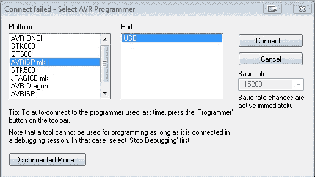
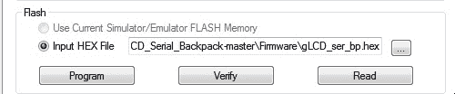

# 串行图形 LCD 连接

> 原文：<https://learn.sparkfun.com/tutorials/serial-graphic-lcd-hookup>

## 介绍

欢迎阅读[系列图形液晶背包](https://www.sparkfun.com/products/9352)的连接指南。在本教程中，你将学习如何充分发挥背包的潜力。我们将从基本的硬件概述开始，然后继续将背包连接到微控制器。最后，您应该知道背包的所有功能，以及如何在任何主机设备上实现它们。

[](https://cdn.sparkfun.com/assets/9/6/f/8/a/525d982f757b7ff37b8b4567.jpg)

### 推荐阅读

在阅读本连接指南之前，您应该熟悉以下主题，以便从本教程中获得最大收益。如果这些概念中有你不熟悉的，请看看。

*   [什么是 Arduino](https://learn.sparkfun.com/tutorials/what-is-an-arduino)
*   [串行通信](https://learn.sparkfun.com/tutorials/serial-communication)
*   [串行终端基础知识](https://learn.sparkfun.com/tutorials/terminal-basics)
*   [二进制](https://learn.sparkfun.com/tutorials/binary)
*   [Hexadecimal](https://learn.sparkfun.com/tutorials/hexadecimal)
*   [ASCII 码](http://en.wikipedia.org/wiki/ASCII)

## 背包概述

串行图形 LCD 背包旨在为大型图形液晶显示器(LCD)提供简单的串行接口。除了书写文本，背包还允许用户绘制线条、圆圈和方框，设置或重置单个像素，擦除显示器的特定块，以及控制背光。还有一种反转模式，可以交换像素和背景的颜色。

虽然 SparkFun 单独出售背包，但同时出售的还有 [128x64 像素图形 LCD](https://www.sparkfun.com/products/9351) 和 [160x128 像素图形 LCD](https://www.sparkfun.com/products/8884) 。出于本教程的目的，我们将使用这两个液晶显示器来展示背包的功能。

[](https://cdn.sparkfun.com/assets/4/1/d/9/5/525d982f757b7f977c8b4567.jpg)

背包由运行在 5V/16MHz 的 ATmega168 微控制器控制。该产品主要用于嵌入式应用，但它可以很容易地连接到计算机，并用终端仿真器写入。这两种方法都将在本教程中介绍。

### 电源要求

高达 7V 的**电压可用于为背包供电，但是，在这种情况下，应注意降低背光占空比，以减少背包上的电压调节器过载的机会。为了避免电压调节器的复杂性，最好以 6V 为背包供电。你也可以用另一个 5V 电源给背包供电。请记住，任何低于 5V 的电压都会导致背光和/或显示器出现问题。如果你用电脑 USB 接口或微控制器给背包供电，确保输出电压实际上是 5V，而不是 4.5V。**

### 其他硬件功能

[](https://cdn.sparkfun.com/assets/6/f/d/c/7/525db402757b7f1b7c8b456b.jpg)*Here the contrast potentiometer (left) and the solder jumper (right) are highlighted.*

#### 对比电位计

背包上有一个小[电位计](https://learn.sparkfun.com/tutorials/resistors/types-of-resistors)，可以进行对比度调整。这应该已经为您进行了调整，但是如果文本不是很明显或者不符合您的需要，请随意调整以符合您的喜好。如果液晶显示器上的文字变得不可读，请首先检查对比度电位计。它非常敏感，如果受到撞击，即使只是轻微的撞击，也会影响液晶显示器的对比度，使其不可读。

#### 焊接跳线

背包上有一个跳线，决定使用哪个显示器。当焊接跳线闭合时，128x64 显示屏的代码将运行。如果跳线打开，将运行 160x128 显示器的代码。这个跳线是在生产过程中根据背包所连接的 LCD 焊接的。但是，如果您希望使用自带 LCD 的背包，您可能需要相应地处理这个跳线。

#### TX 线路

背包中的 TX 线已经留在最终设计中，供将来的代码修改、调试和用户开发使用，但在撰写本文时，它还没有被使用。

## LCD 概述

让我们简单地讨论一下这些 LCD 是如何工作的，以便更好地理解我们将在本教程后面使用的固件是如何工作的。首先，让我们谈谈液晶显示器上的像素是如何映射出来的。

图形 LCD 在笛卡尔坐标中映射，如下图所示:

[](https://cdn.sparkfun.com/assets/b/b/a/3/1/529e1b18757b7f910b8b4567.jpg)

或者，如果您使用的是 64x128 像素的 LCD，它更像这样:

[](https://cdn.sparkfun.com/assets/9/0/0/9/e/529e1b18757b7fc3558b4567.jpg)

ASCII 字符根据两个用户可更改的设置打印到屏幕上，即 x_offset 和 y_offset。这两个设置定义了一个字符空间的左上角位，是 **6x8 位**。通过改变 x_offset 和 y_offset，用户可以将测试放在屏幕上的任何地方。

[](https://cdn.sparkfun.com/assets/4/e/2/6/7/525dcd15757b7fee738b4567.jpg)*Here is a capital letter 'B' as created in the character space.*

将字符从左到右、从上到下打印到屏幕上，无需调整 x_offset 和 y_offset。此外，改变偏移量将改变整个文本帧，这意味着写到一行的末尾和写到下一行将无缝地发生，因为文本没有可以或不可以写的预定义位置(除了靠近显示器的左边缘和下边缘的位置)。

退格键也是功能性的，它试图保持用户设置的参考框架。

## ASCII 命令

图形串行 LCD 背包设计为通过多种方式控制。其中一个是通过一个[串行端子](https://learn.sparkfun.com/tutorials/terminal-basics)。如果您想将个人电脑用作控制设备，这可能会很有用。您还可以使用 ASCII 命令实时向背包发送命令。这有助于在将 LCD 嵌入到项目中之前对其进行测试。这里是 ASCII 命令的完整列表。

**注意:**在一些情况下，您需要发送 ASCII 值，这些值需要特定的、不寻常的按键。任何你看到<控制某个值>的地方，这意味着你必须同时按下控制键和键盘上的那个字符**。如果您使用的是 Mac，其中一些命令需要以稍微不同的方式发出。对于任何不使用 control 的命令，尝试使用该字符的 [unicode 版本](http://en.wikipedia.org/wiki/Basic_Latin_%28Unicode_block%29)。**

 **所有命令都以“|”或 ASCII 十进制 124 (0x7C)开头。这告诉显示器命令序列跟随其后。在给出以下任何命令之前，它们必须以“|”开头。实际的字符“|”不会(也不能)打印到屏幕上。

#### 清除屏幕

发送“\ <control>@ (0x00)”会清除屏幕上所有写入的像素。如果您在正常模式下操作，所有像素都会被重置。如果您在反转模式下操作，所有像素都会被设定。“清除屏幕”命令的一个例子是发送 0x7C 0x00，或者从键盘发送“|”和\ <control>@。</control></control>

#### 演示模式

发送“\ <control>d (0x04)”运行演示代码。这在固件中只是作为显示器能做什么的一个例子。要观看演示，请发送 0x7C 0x04，或从键盘发送“|”和\<control>d .</control></control>

#### 反向模式

发送“\ <control>r (0x12)”在 160x128 像素显示器上的蓝底白字和蓝底白字之间切换，在 128x64 像素显示器上的绿底黑字和绿底黑字之间切换。设置反转模式会使屏幕立即清除新背景。要设置反转模式，发送 0x7C 0x12，或从键盘发送“|”和\ <control>r。该设置会在电源循环之间保存。如果显示器在反转模式下关闭，它将在下一次反转模式下通电。</control></control>

#### 闪屏

发送“\ <control>s (0x13)”允许或禁止在通电时显示 SparkFun 徽标。闪屏有两个用途。一个是在产品上打上我们的标记，另一个是允许在通电时有一小段时间显示可以从错误的波特率变化中恢复(更多信息见波特率)。禁用闪屏会抑制徽标，但延迟仍然有效。要禁用闪屏，发送 0x7C、0x13，或从键盘发送“|”和\<control>s .</control></control>

#### 设置背光占空比

发送“\ <control>b (0x02)”后跟随一个从 0 到 100 的数字将改变背光强度(并因此改变电流消耗)。将该值设置为零会关闭背光，设置为 100 或以上会完全打开背光，中间值会将其设置为介于两者之间。命令序列中的数字设置是一个 8 位 ASCII 值。例如，要将背光占空比设置为 50，发送 0x7C 0x02 0x32，或者从键盘发送“|”、\ <control>b 和“2”。</control></control>

#### 更改波特率

发送“\ <control>g (0x07)”后跟一个从“1”到“6”的 ASCII 字符会改变波特率。默认波特率为 115,200bps，但背包可以设置多种通信速度:</control>

| 性格；角色；字母 | 波特率 |
| "1" | Four thousand eight hundred |
| "2" | Nine thousand six hundred |
| "3" | Nineteen thousand two hundred |
| "4" | Thirty-eight thousand four hundred |
| "5" | Fifty-seven thousand six hundred |
| "6" | One hundred and fifteen thousand two hundred |

例如，要将波特率设置为 19，200bps，发送 0x7C 0x07 0x33，或者从键盘发送“|”、\ <control>g 和“3”。波特率设置在电源周期内保持不变，因此如果它以 19，200bps 的速率关断，下一次将使用该设置上电。</control>

必要时，波特率可以重置为 115，200。在加电的一秒钟延迟期间，以 115，200bps 的速率向显示器发送任何字符。

#### 设置 X 或 Y 坐标

发送“\ <control>x (0x18)”或“\ <control>y (0x19)”后跟随一个表示新参考坐标的数字会更改 X 或 Y 坐标。文本生成器使用 X 和 Y 参考坐标(源代码中的 x_offset 和 y_offset)在屏幕上的特定位置放置文本。如前所述，坐标指的是字符空间中左上角的像素。如果偏移量在屏幕右边缘的 6 个像素或底部的 8 个像素内，文本生成器将返回到文本的下一个逻辑行，以便打印整个字符而不是部分字符。例如，要将 x_offset 设置为 80(160×128 像素显示器水平轴的中间)，请发送 0x7C 0x18 0x50，或者从键盘发送“|”、\ <control>x 和“P”。试图设置大于每个轴长度的值会使各自的偏移最大化。</control></control></control>

#### 设置/重置像素

发送“\ <control>p (0x10)”，后跟 x 和 y 坐标以及 0 或 1，以确定该像素的设置或重置。显示器上的任何像素都可以通过该命令独立设置或复位。例如，要将像素设置为(80，64)发送 0x7C 0x10 0x50 0x40 0x01，或者从键盘发送“|”、\ <control>p、“P”、“@”和\ <control>a。请记住，设置像素并不一定意味着将 1 写入该位置，它意味着写入背景的相反部分。因此，如果你在反转模式下操作，设置像素实际上会清除像素，并将其从白色背景中分离出来。重置该像素会使其像背景一样变成白色。</control></control></control>

#### 画线

发送“\ <control>l (0x0C)”，后跟两组定义直线起点和终点的(x，y)坐标，后跟 0 或 1，以确定是绘制还是擦除直线。例如，要绘制一条从(0，10)到(50，60)的线，请发送 0x7C 0x0C 0x 00(x1)0x0A(y1)0x 32(x2)0x3C(y2)0x 01，或者从键盘发送“|”、\ <control>l、\ <control>@、\ <control>j、“2”、“<”和\ <control>a。要删除该线(并保持周围的文本和图形不变)，请提交相同的命令，但将最后的\ <control>a 改为\ <control>@。【T7</control></control></control></control></control></control></control>

#### 画圆

发送“\ <control>c (0x03)”，后跟定义圆心的 x 和 y 坐标，再跟一个表示圆半径的数字，再跟一个 0 或 1，确定是绘制还是擦除圆。例如，要在中心(80，64)画一个半径为 10 的圆，发送 0x7C 0x03 0x50 0x40 0x0A 0x01，或从键盘发送“|”、\ <control>c、“P”、“@”、\ <control>j 和\ <control>a。要擦除圆(并保持周围的文本和图形不变)，提交相同的命令，但将最后的\ <control>a 改为\ <control>@。圆可以画在网格之外，但是只有那些在显示边界内的像素才会被写入。</control></control></control></control></control></control>

#### 绘图框

发送“\ <control>o (0x0F)”后跟两组(x，y)坐标(定义框的对角)，后跟 0 或 1，确定是绘制还是擦除框。该命令与“画线”命令完全一样，但不是画一条线，而是得到一个框，该框正好包含给定坐标之间的线。例如，要在从(0，10)到(50，60)的直线周围绘制一个矩形框，请发送 0x7C 0x0F 0x 00(x1)0x0A(y1)0x 32(x2)0x3C(y2)0x 01，或者从键盘发送“|”、\ <control>o、\ <control>@、\ <control>j、“2”、“<”和\ <control>a。要擦除该框(并保持周围的文本和图形不变)，请提交相同的命令，但将最后一个\ <control>a 改为\【T7</control></control></control></control></control></control>

#### 擦除块

发送“\ <control>e (0x05)”后跟两组(x，y)坐标定义了要擦除的块的对角。这就像“绘制框”命令一样，只是框中的内容被擦除为背景色。例如，要擦除从(0，10)到(50，60)的直线周围的矩形块，发送“0x7C 0x 05 0x 00(x1)0x0A(y1)0x 32(x2)0x3C(y2)”，或者从键盘发送“|”、\ <control>e、\ <control>@、\ <control>j、“2”和“<”。</control></control></control></control>

## 示例 1 -基本 FTDI

既然我们知道了用来控制 LCD 的命令，为什么不试一试呢？在本例中，您将使用 FTDI Basic 与 LCD 通信并控制它。

#### 你需要什么

*   [128x64 像素图形 LCD](https://www.sparkfun.com/products/9351) 或 [160x128 像素图形 LCD](https://www.sparkfun.com/products/8884)
*   [FTDI 基本- 5V](https://www.sparkfun.com/products/9716) 或 [FTDI 电缆](https://www.sparkfun.com/products/9718)
*   [迷你 USB 线](https://www.sparkfun.com/products/11301)
*   [公母跳线](https://www.sparkfun.com/products/9194)

#### 五金器具

连接和打印到 LCD 的最简单快捷的方式是使用  或 。使用跳线将 FTDI 连接到 LCD，如下所示...

| **ftd** | **图形液晶显示器** |
| 5V | 酒 |
| GND | GND |
| TXO | 药方(prescription 的缩写) |

一旦你的液晶显示器连接正确，将 FTDI 设备插入你的电脑。[打开终端窗口](https://learn.sparkfun.com/tutorials/terminal-basics/connecting-to-your-device)。确保您有正确的设置:波特:115200，8-N-1-无。连接后，开始输入。您输入的所有内容现在都应该显示在 LCD 上了！回头参考 ASCII 命令部分，查看需要按哪些键来执行特定命令，如清除屏幕、画圆或打印文本到特定的 x、y 坐标。

[](https://cdn.sparkfun.com/assets/7/c/e/6/3/529d1c04757b7f830f8b4567.jpg)

从电脑上对着液晶显示器说话很有趣，但真正有趣的是当你可以从嵌入式设备上把信息打印到液晶显示器上。在下一个例子中，我们将使用 Arduino 将信息打印到 LCD 上。

## 固件概述

在我们开始将 LCD 连接到 Arduino 之前，让我们先讨论一下固件。固件是存储在背包上的代码。它充当 LCD 和用于与之通信的微控制器之间的桥梁或转换器。在固件之上，我们编写了一个 Arduino 库，让背包的使用变得更加简单。

### 背包固件

我们修改了背包附带的固件。它比以往任何时候都运行流畅，给任何项目一个可怕的图形显示。待定你不需要任何太花哨的东西，你应该可以使用默认固件来满足你所有的 LCD 需求。但这并不意味着不值得理解。要查看固件，请前往[串行图形 LCD 背包 GitHub 库](https://github.com/sparkfun/GraphicLCD_Serial_Backpack/)。您可以下载 zip 文件，将 repo 克隆到您的计算机上，或者使用 GitHub 的默认编辑器导航。

在固件文件夹里你会看到很多。c 和。h 文件。这些文件告诉背包如何根据接收到的输入与 LCD 交互。由于修改源代码超出了本教程的范围，我们将把它留在这里。请记住，如果您想添加、删除或修改某些内部功能，这里是您的最佳选择。

请注意，你需要一个程序员来改变背包上的固件。它与 Arduino 不兼容，尽管板上的 [IC](https://learn.sparkfun.com/tutorials/integrated-circuits) 是 ATmega328，与许多 Arduino 板上的 IC 相同。查看故障排除部分，了解如何将固件刷新到背包中的更多信息。

### Arduino 图书馆

为了尽可能简单地使用串行图形 LCD 背包，我们编写了一个 Arduino 库。这个库可以在 [GitHub 库](https://github.com/sparkfun/GraphicLCD_Serial_Backpack/tree/V_1.0.1/Libraries/Arduino)上找到。这个库基本上为前面的 ASCII 命令页面上列出的每个命令创建了函数。该库附带的示例草图演示了每个功能，并向您展示了如何在 LCD 上实现这些功能以满足各种用途。如果你需要安装 Arduino 库的复习，请访问我们的[安装库教程](https://learn.sparkfun.com/tutorials/installing-an-arduino-library)。

这里将列出每个功能并给出简短描述。然而，这些函数是建立在 ASCII 命令一节中列出的命令之上的。有关每个函数的更多详细信息，请参考该部分或阅读库文件中提供的注释。

#### 打印命令

*   `printStr(char Str[78])` -将字符串打印到 LCD 上。默认情况下，缓冲区设置为 78，但可以在头文件中更改。
*   `printNum(int num)` -在 LCD 上打印一个数字。
*   `nextLine()` -作为文本的换行符。

这三个函数之所以存在，是因为软件串行库的实例是在库文件中声明的，以便与背包通信。因此，在使用该库时，使用典型的`serial.print()`命令无法将文本发送到 LCD。

#### LCD 功能

*   `clearScreen()` -清除 LCD 上的任何和所有像素。
*   `toggleReverseMode()` -切换反转模式 160x128 显示器为白底蓝字，128x64 显示器为黑底绿字。
*   `toggleSplash()` -打开或关闭 SparkFun 闪屏。请注意，无论是否启用闪屏，启动时都会有一秒钟的延迟。
*   `setBacklight(byte duty)` -设置背光的亮度。将单个 int 作为参数。范围是 0-100，其中 0 表示关闭，100 表示全亮度。高于 100 的任何值仍会导致最大值为 100。
*   `setBaud(byte baud)` -设置背包的波特率。将单个 int 作为范围为 49-54 的参数。
*   `restoreDefaultBaud()` -将 LCD 恢复到默认波特率 115200bps。

#### 光标定位

*   `setX()` -设置文本在屏幕上出现的 x 位置。
*   `setY()` -设置文本在屏幕上出现的 y 位置。
*   `setHome()` -将 poth x 和 y 设置回位置 0，0。

#### 图画

*   `setPixel(byte x, byte y, byte set)` -设置或重置(恢复背景颜色)LCD 上的任何像素。
*   `drawLine(byte x1, byte y1, byte x2, byte y2, byte set)` -在两个 x，y 坐标之间画一条线。
*   `drawBox(byte x1, byte y1, byte x2, byte y2, byte set)` -在两个 x，y 坐标之间画一个方框。
*   `drawCircle(byte x, byte y, byte rad, byte set)` -以给定的 x，y 坐标为中心点画一个圆，然后延伸到给定的半径。
*   `eraseBlock(byte x1, byte y1, byte x2, byte y2)` -删除从两个给定的 x，y 坐标延伸的块。
*   启动内置于固件中的内部演示。

## 示例 2 - Arduino

我们将首先介绍从 Arduino 打印到 LCD 的快速简单的方法，然后介绍一种更强大的方法，该方法利用了 LCD 固件中内置的特殊字符。

#### 你需要什么

*   任何 Arduino 兼容板——我们推荐 [RedBoard](https://www.sparkfun.com/products/11575) 或 [Arduino Uno](https://www.sparkfun.com/products/11021) 。
*   [128x64 像素图形 LCD](https://www.sparkfun.com/products/9351) 或 [160x128 像素图形 LCD](https://www.sparkfun.com/products/8884)
*   适合您的 Arduino 的 USB 电缆
*   [公母跳线](https://www.sparkfun.com/products/9194)

### 串行传递

第一个例子利用了 Arduino 上内置的 [UART](https://learn.sparkfun.com/tutorials/serial-communication/uarts) 。通过这样做，我们在 LCD 连接时上传代码到 Arduino 时必须小心，因为它们将共享相同的线路。我们将稍微向后做一些事情，首先上传代码，然后连接 LCD。

只需几行代码，您就可以通过 Arduino 将文本传递到终端窗口。将此代码复制到一个新的草图中，并上传到 Arduino。

```
language:c
void setup() {
  Serial.begin(115200);
}
void loop() {
  if(Serial.available() > 0){
    Serial.write(Serial.read());
  }
} 
```

该代码接收 Arduino 在其 RX 线上接收到的任何内容，并将其从 TX 线发送回串行图形 LCD。如果您希望在 LCD 上看到字符而不是 ASCII 数字，您必须使用`Serial.write()`而不是`Serial.print`。

#### 五金器具

现在，像这样将 LCD 连接到 Arduino..

确保您的连接如下:

| Arduino | **图形液晶显示器** |
| 5V | 酒 |
| GND | GND |
| 谢谢 | 药方(prescription 的缩写) |

你不需要连接到 LCD 的 TX 线，因为你只是发送数据**到**LCD。

现在，打开一个终端窗口(还是在 115200)，开始输入。液晶屏上应再次出现文本。退格键仍然有效！

### Arduino 库示例

在最后一个例子中，我们将使用串行图形 LCD 库来完成所有的工作。该库的一个重要特性是，它使用[软件串行](http://arduino.cc/en/Reference/SoftwareSerial)库为 Arduino 创建另一个串行端口，以便与 LCD 通信。前一个例子的问题是，我们使用内部 UART，因此每次想要上传代码时都必须断开 LCD。当你正在开发代码并且需要多次上传时，这可能是一件痛苦的事情。

#### 五金器具

我们可以使用前面的例子设置这个例子，你只需要改变一个跳线。将连接到 Arduino TX 引脚的跳线移至 Arduino 上的数字引脚 3。这是串行图形 LCD 库在初始化软件串行库时使用的引脚。

您的连接现在应该是这样的:

| Arduino | **图形液晶显示器** |
| 5V | 酒 |
| GND | GND |
| 引脚 3 | 药方(prescription 的缩写) |

或者，对于有视觉倾向的人来说，这里有一张你的联系应该是什么样子的图片。

[](https://cdn.sparkfun.com/assets/c/f/7/c/a/525d982f757b7fd67b8b4567.jpg)

#### 固件

如果您还没有这样做，请下载并安装 [Arduino 库](https://github.com/sparkfun/GraphicLCD_Serial_Backpack/tree/master/Arduino_Library)，或者将其克隆到您的计算机上。回到固件细节部分，了解更多关于安装库的信息。安装完成后，打开 Arduino，导航到库示例。

[](https://cdn.sparkfun.com/assets/f/e/c/c/d/529d2328757b7f7c268b4567.jpg)

选择合适的串行端口和板，并将示例上传到您的 Arduino。上传完成后，库演示应该开始。它将贯穿使用库中几乎每一个函数的例子。剩下的就是坐下来欣赏表演了！

## 解决纷争

### 显示问题

*   如果您没有看到任何字母，请确保背包上的对比电位计已相应调整。你需要一把尖头螺丝刀来调整它。调整该微调按钮时要小心，因为转动过猛或过猛都会导致微调按钮断裂。
*   确保你给背包**至少 5V** 。再低一点，你的对比度就有问题了。一些 USB 端口运行在 4.7-4.8V 左右，可能没有足够的电压为 LCD 和背包完全供电。我们建议用 6-7V 给液晶显示器供电。
*   如果您看不到任何字母，即使相应地调整了对比度，也可能存在波特率问题。如果您更改了波特率，但忘记了更改的内容，您可以使用 Arduino 库中的`restoreDefaultBaud()`命令将波特率恢复为默认值 115200bps。只需创建一个草图，导入图形串行 LCD 库，然后在设置中调用恢复功能。

将此代码复制并粘贴到 Arduino 中，确保 LCD 的 RX 引脚连接到 Arduino 上的数字引脚 3，然后上传。您应该看到屏幕打印“波特恢复到 115200！”

```
language:c
#include <SparkFunSerialGraphicLCD.h>//inculde the Serial Graphic LCD library
#include <SoftwareSerial.h>
LCD LCD;
void setup()
{
delay(1200);///wait for the one second splash screen
LCD.restoreDefaultBaud();
}
void loop()
{
//nothing in loop 
} 
```

### 刷新固件

如果你的背包出现奇怪的行为，可能是固件的问题。如果发生这种情况，我们建议用最新的固件更新背包。如果您有合适的工具，我们将简要描述如何自己完成这项工作。

最新版本的固件可以在 [GitHub](https://github.com/sparkfun/GraphicLCD_Serial_Backpack) 上找到。访问知识库的链接。克隆存储库，或者下载 zip 文件。记住这个文件的位置。

[](https://cdn.sparkfun.com/assets/e/0/b/c/b/528674a8757b7fb50f8b456a.jpg)

你需要一些方法把固件上传到背包里。我们建议使用 Atmel AVR MKII 编程器。如果你没有 MKII，你可以使用类似的东西，如[袖珍 AVR 编程器](https://www.sparkfun.com/products/9825)。把你的编程器插入你的计算机。你也可以使用 Arduino 板作为程序员。关于这个和一般刷新固件信息的更多信息，请参见我们的[安装 Arduino 引导程序教程](https://learn.sparkfun.com/tutorials/installing-an-arduino-bootloader)。

在这个例子中，我将使用 Atmel AVR Studio (v4.18)来上传。背包里的十六进制文件。您也可以在命令行中使用 AVRDude 来完成相同的任务。如果你运行的是 Mac 或 Linux，你要么需要考虑在你的特定操作系统上上传 AVR 代码，要么使用 Wine 或 VMWare 等虚拟机在 Windows 上运行 AVR Studio。

一旦你知道如何让 AVR studio 启动并运行，就开始运行这个程序吧。您应该会看到一个提示，要求您选择正在使用的程序员。选择 AVR MKII，或者你正在使用的任何一个编程器。

[](https://cdn.sparkfun.com/assets/9/9/e/7/a/528674a7757b7f830f8b4567.jpg)

现在，您需要选择要上传到哪个芯片。选择 ATmega168P。

[](https://cdn.sparkfun.com/assets/c/7/2/5/f/528674a6757b7fdf0f8b456a.jpg)

单击程序选项卡。在“Flash”部分，点击上面有三个点的按钮，浏览你从 GitHub 下载的十六进制文件。

[](https://cdn.sparkfun.com/assets/3/2/b/2/1/529d2584757b7fb0268b456a.jpg)

浏览。GitHub 下载附带的十六进制文件。

[](https://cdn.sparkfun.com/assets/d/6/f/2/6/528674a6757b7f7c0f8b456a.jpg)

一旦你将 AVR Studio 指向十六进制文件，将编程器连接到背包上的 ISP 头，然后点击“编程”

[](https://cdn.sparkfun.com/assets/a/8/1/0/5/528674a7757b7f2d0e8b4568.jpg)

您应该会在程序底部看到一条成功消息。如果是，新固件应该在背包上，随时可以出发！

## 资源和更进一步

差不多结束了。现在，您应该对串行图形 LCD 的工作原理以及如何使用各种方法来控制 LCD 有了很好的理解。现在，走出去，用一个漂亮的用户界面做一些令人敬畏的项目。想了解更多关于 S-G-LCD 背包的信息，请点击下面的链接。

*   [串行图形 LCD 背包 GitHub 库](https://github.com/sparkfun/GraphicLCD_Serial_Backpack)
*   [系列图形液晶背包产品页面](https://www.sparkfun.com/products/9352)
*   [数据表(160x128 LCD)](https://www.sparkfun.com/datasheets/LCD/DS-G160128STBWW.pdf)
*   [T6963C 手册](https://www.sparkfun.com/datasheets/LCD/Monochrome/Datasheet-T6963C.pdf)
*   [T6963 应用说明](https://www.sparkfun.com/datasheets/LCD/Monochrome/T6963C-AppNote.pdf)
*   [图形液晶 VU 米](https://www.sparkfun.com/tutorials/120)**