# Simon 倾斜组件导轨

> 原文：<https://learn.sparkfun.com/tutorials/simon-tilts-assembly-guide>

## 介绍

[西蒙倾斜](https://www.sparkfun.com/products/12634)是一款与[西蒙说](https://www.sparkfun.com/products/10547)非常相似的记忆游戏，但玩家不是按下按钮，而是以特定的模式旋转设备。它以 PTH 焊接套件的形式提供，由您来将它们焊接在一起！你可以在 SparkFun 买到全套工具！

[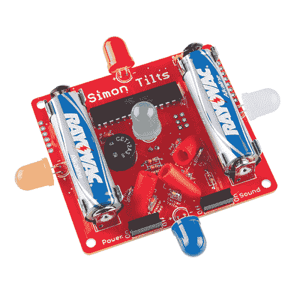](https://www.sparkfun.com/products/retired/12634) 

### [斯帕克芬西蒙斜通孔焊接套件](https://www.sparkfun.com/products/retired/12634)

[Retired](https://learn.sparkfun.com/static/bubbles/ "Retired") KIT-12634

这个通孔焊接套件和我们的 Simon Says 很像；首先，这是学习如何焊接的好方法；第二，它…

**Retired**[Favorited Favorite](# "Add to favorites") 5[Wish List](# "Add to wish list")

如果你是焊接新手，Simon Tilts PTH 套件是一个很好的起点。本组装指南将带您浏览套件中的每个组件，并向您展示如何将其焊接到位。

### 推荐阅读

如果您想了解更多关于 PTH 焊接的一般知识，我们建议您查看以下其他教程:

*   [如何进行通孔焊接](https://learn.sparkfun.com/tutorials/how-to-solder---through-hole-soldering)
*   [解码电阻标记](https://learn.sparkfun.com/tutorials/resistors/decoding-resistor-markings)
*   [二极管和 LED 极性](https://learn.sparkfun.com/tutorials/polarity/diode-and-led-polarity)
*   [电子组件-清洗](https://learn.sparkfun.com/tutorials/electronics-assembly/washing)
*   视频- [SparkFun 红外传感器概述](http://youtu.be/5_I5eIQsHq8)

### 必要的工具和用品

*   [烙铁](https://www.sparkfun.com/products/9507)
*   [焊接](https://www.sparkfun.com/products/10241)
*   [切刀](https://www.sparkfun.com/products/8794)

### 建议的额外工具和用品

*   [安全眼镜](https://www.sparkfun.com/products/11046)
*   [助焊剂笔](https://www.sparkfun.com/products/8967)
*   [焊芯](https://www.sparkfun.com/products/9327)
*   刷子(旧牙刷也可以)
*   去离子水清洗(或者你可以用自来水)

## 快速入门-您的第一个组件

找到 10K &ohm;电阻器。它上面有特定的条纹图案:棕色、黑色、橙色、金色。

看起来是这样的:

[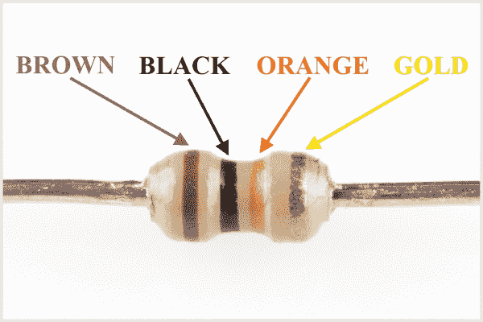](https://cdn.sparkfun.com/assets/c/c/f/5/0/52af4f4f757b7fc4528b4567.jpg)

注意，图案可以是相反的顺序；这仍然是正确的电阻。

要进一步了解电阻标记，请查看以下教程:[解码电阻标记](https://learn.sparkfun.com/tutorials/resistors/decoding-resistor-markings)

向下弯曲双腿。

找到电路板上 10K &ohm;电阻的位置。

[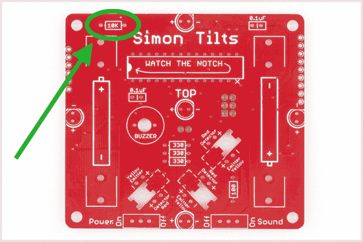](https://cdn.sparkfun.com/assets/2/f/c/f/c/52af80be757b7f120a8b4568.jpg)

将电阻插入 PCB。注意，这个分量没有被极化，所以哪条腿进入每个孔并不重要。此套件上的一些组件是极性的，我们在接触它们时会格外小心，以确保它们正确插入。要了解更多关于极化的含义，请查看本教程:[极性](https://learn.sparkfun.com/tutorials/polarity)

[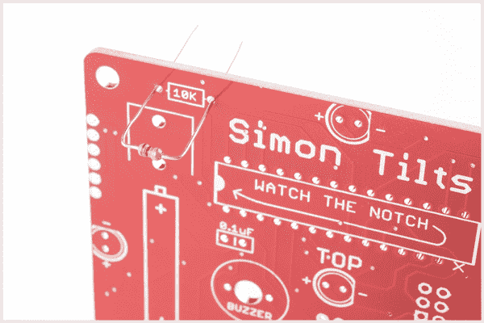](https://cdn.sparkfun.com/assets/1/f/b/9/5/52af8ded757b7f36738b456b.jpg)

将电阻器推入，使其几乎与电路板齐平。

[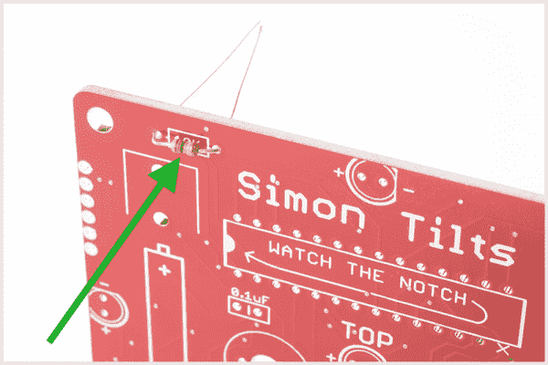](https://cdn.sparkfun.com/assets/9/3/2/c/4/52af8ded757b7f5c7b8b456a.jpg)

稍微向外弯曲双腿以保持其位置。

[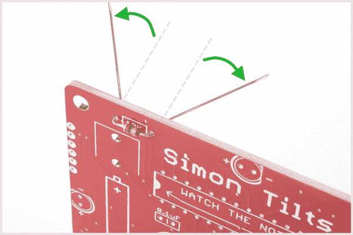](https://cdn.sparkfun.com/assets/4/d/2/f/c/52af8ded757b7fec718b4567.jpg)

把板子翻过来。握住烙铁的“最佳位置”,使其接触到烙铁腿和金属环。保持 2 秒钟。

[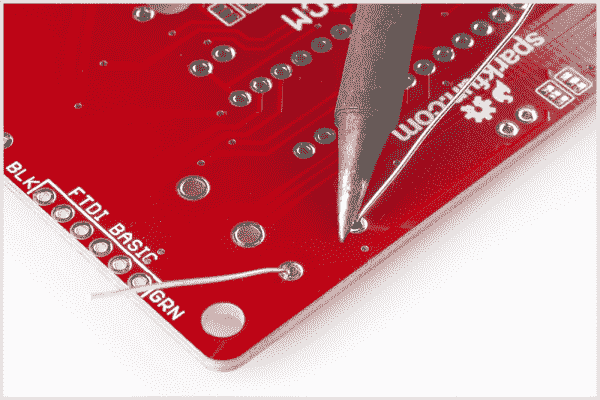](https://cdn.sparkfun.com/assets/6/d/6/2/d/52af8ded757b7faf728b4567.jpg)

将焊料注入接缝处。

首先，拉开焊料。

[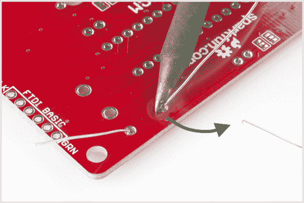](https://cdn.sparkfun.com/assets/3/d/4/2/7/52af8ded757b7f32768b4567.jpg)

第二，拉开铁棍。

[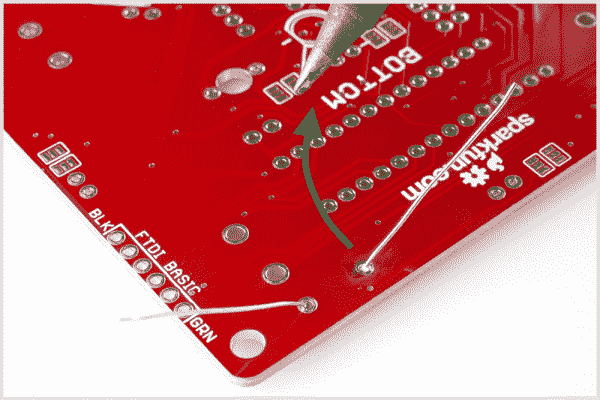](https://cdn.sparkfun.com/assets/6/a/2/5/e/52af8ded757b7f056e8b4567.jpg)

你的焊点应该像这样——一个小火山。

[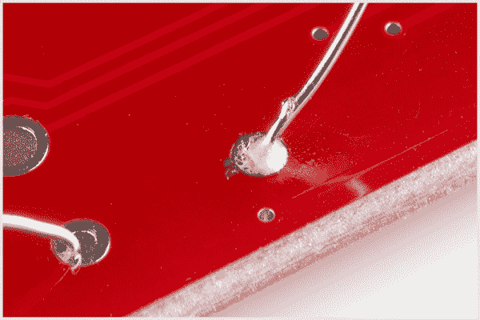](https://cdn.sparkfun.com/assets/d/9/c/6/e/52af8ded757b7f4e738b4567.jpg)

剪掉多余的腿。

[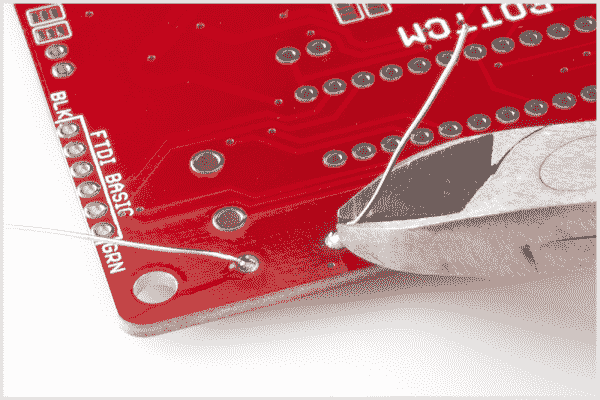](https://cdn.sparkfun.com/assets/c/8/0/d/3/52af8dee757b7fd2678b4568.jpg)

## 其他电阻器

现在你已经成功地焊接了 10K 电阻，你准备好开始焊接其余的电阻。

请注意，在焊接每个电阻之前，请确保颜色标记正确，以此来再次检查电阻值是否正确。

找到 100 &ohm;电阻器。上面有这样的条纹图案:棕色，黑色，棕色，金色。

一个 100 &ohm;的电阻看起来像这样:

[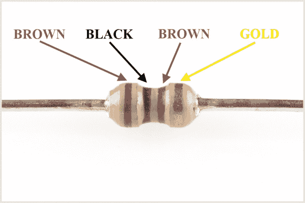](https://cdn.sparkfun.com/assets/8/5/1/0/c/52af95ad757b7f66278b4568.jpg)

找到 PCB 上的位置:

[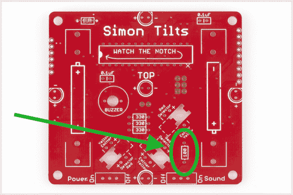](https://cdn.sparkfun.com/assets/8/6/a/6/9/52af95ae757b7fdd748b4568.jpg)

使用您在第一个组件(10K &ohm;电阻器)中学到的相同方法，焊接到位，并修剪额外的引线长度。

接下来，定位 330 &ohm;电阻器(x3)。它们身上都有这样的条纹图案:橙色、橙色、棕色、金色。

一个 330 &ohm;电阻看起来像这样:

[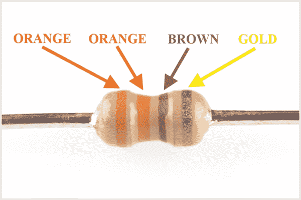](https://cdn.sparkfun.com/assets/c/1/9/3/7/52af95ad757b7fd2678b456a.jpg)

应该有三个:

[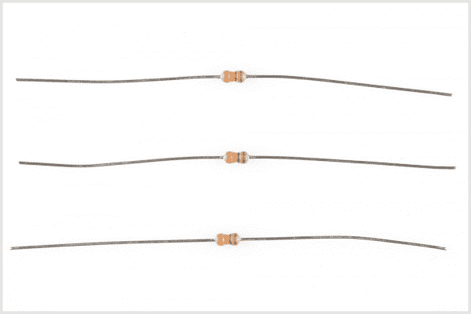](https://cdn.sparkfun.com/assets/7/c/a/4/f/52af95c2757b7ff22c8b456a.jpg)

找到 PCB 上的位置:

[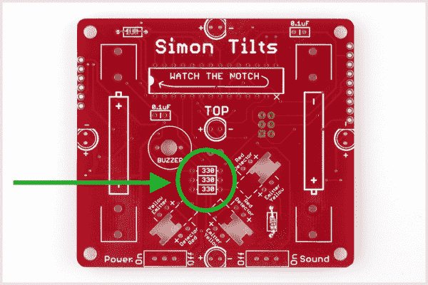](https://cdn.sparkfun.com/assets/7/b/5/5/b/52af95ae757b7f35758b4568.jpg)

使用与之前相同的方法，焊接到位并修剪多余的引线长度。

焊接完这些剩余电阻后，电路板应如下所示:

顶部:

[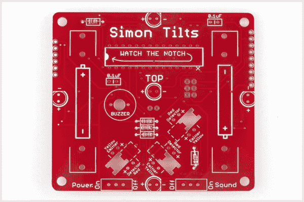](https://cdn.sparkfun.com/assets/c/a/8/a/8/52af95ae757b7f4e738b456b.jpg)

底部:

[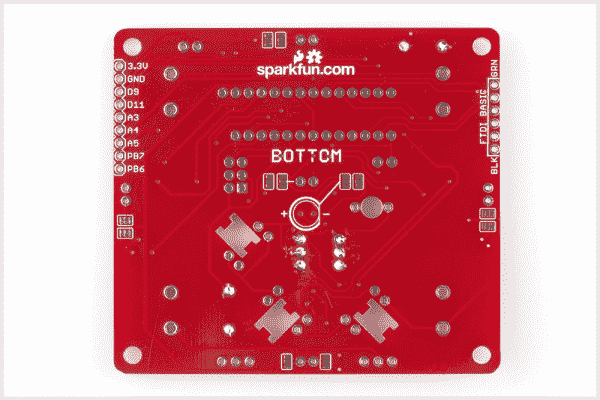](https://cdn.sparkfun.com/assets/8/8/1/e/2/52af95ae757b7f545b8b456b.jpg)

## 电容器

找到两个 0.1uF 电容。这些看起来和电阻有点不同。它们有两条引线，从元件底部引出，上面有标记“104”。(另请注意，底部可能有其他字母，如“K5M”)

它们看起来像这样:

[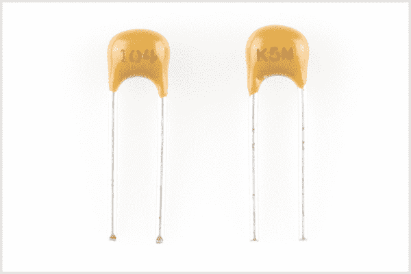](https://cdn.sparkfun.com/assets/2/2/4/b/e/52af9857757b7ff22c8b456c.jpg)

找到它们在 PCB 上的位置:

[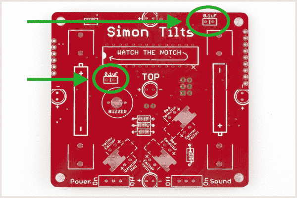](https://cdn.sparkfun.com/assets/9/2/5/3/a/52af98a0757b7ff77a8b4567.jpg)

确保它们与 PCB 表面齐平并直立。将它们焊接到位，并修剪接入导线长度。当你把这些焊接到位后，你的电路板应该是这样的:

[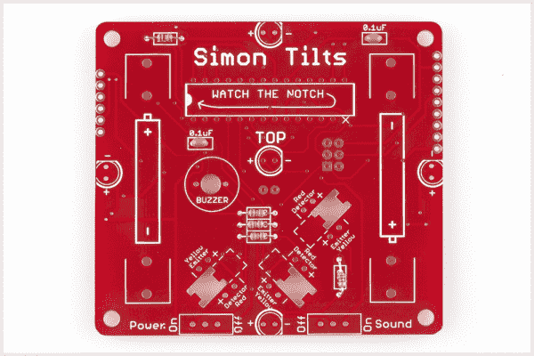](https://cdn.sparkfun.com/assets/e/6/7/e/8/52af9857757b7f03798b4567.jpg)

## 微控制器

找到微控制器。该元件是极化的，这意味着我们需要格外小心，将其正确放置在电路板上。注意缺口:

[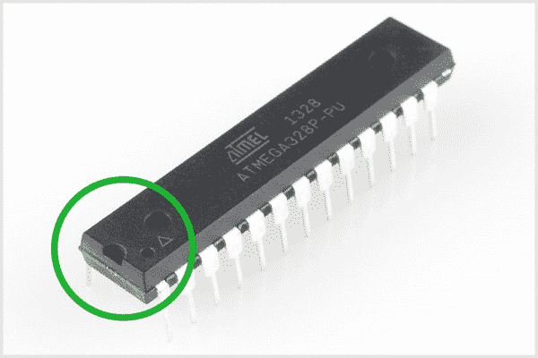](https://cdn.sparkfun.com/assets/8/d/1/1/9/52b05503757b7f7c608b4567.jpg)

现在找到 PCB 上的位置。同样，请注意 PCB 白色油墨中的类似凹口符号:

[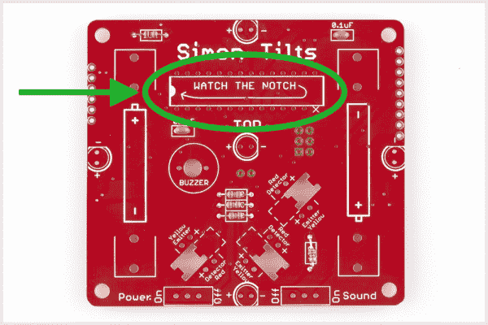](https://cdn.sparkfun.com/assets/b/d/6/4/3/52b05503757b7f016f8b4567.jpg)

小心对齐槽口，将 ATmega328 放入 PCB。焊接第一个引脚(可以是你选择的任何引脚)时，确保元件与 PCB 齐平。

当你焊接完这个组件后，电路板的底部应该是这样的——一排整齐的火山:

[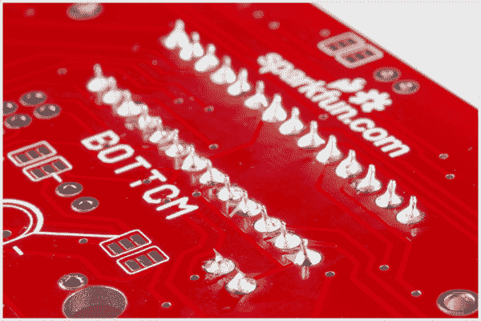](https://cdn.sparkfun.com/assets/a/d/1/f/7/52b05504757b7f10638b456c.jpg)

## 红外发射器和探测器

小心，接下来的 6 个器件是极化的，需要正确放入 PCB。要了解更多关于极化的知识，请查看另一个教程:[二极管和 LED 极性](https://learn.sparkfun.com/tutorials/polarity/diode-and-led-polarity)

找到[红外发射器和探测器对](https://www.sparkfun.com/products/241):

[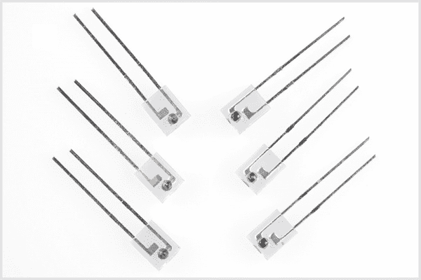](https://cdn.sparkfun.com/assets/a/6/0/1/8/52b0627d757b7f7b198b456c.jpg)

总共应该有 6 件。三个带红点，三个带黄点:

[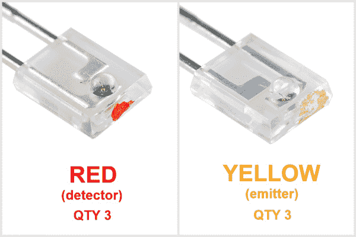](https://cdn.sparkfun.com/assets/c/f/3/6/0/52b0627d757b7ff67d8b4567.jpg)

这些是极化部件，所以这意味着它们有一个“-”和一个“+”腿。

[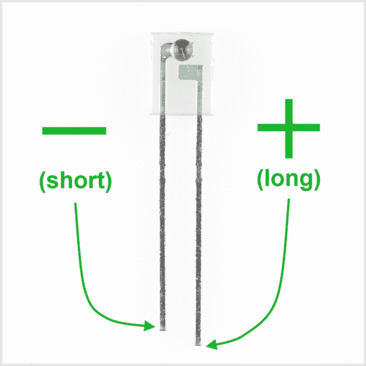](https://cdn.sparkfun.com/assets/3/a/9/5/7/52b0627d757b7f4d748b4567.jpg)

找到黑板上的位置。请注意，PCB 上印有“黄色发射器”和“红色探测器”标签。还要注意，每条腿都有“-”和“+”标记。注意确保正确的位置和极性。

[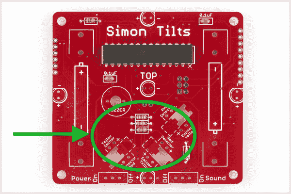](https://cdn.sparkfun.com/assets/b/f/8/5/6/52b0627e757b7f5f7f8b4569.jpg)

将它们焊接到位时，确保它们垂直向上。检查您的腿是否与 PCB 形成 90 度角，如下所示:

[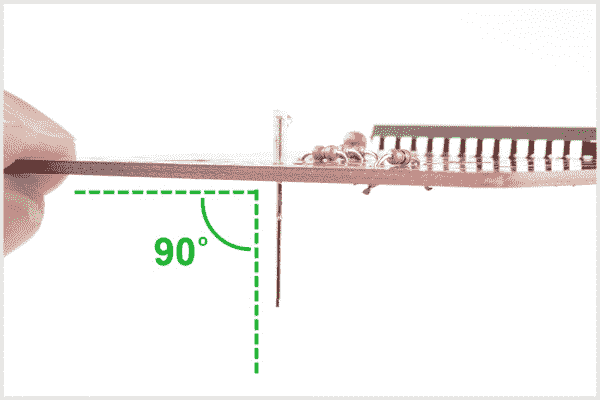](https://cdn.sparkfun.com/assets/7/4/c/a/e/52b0627b757b7fab1e8b456a.jpg)

还要确保它们与 PCB 齐平:

[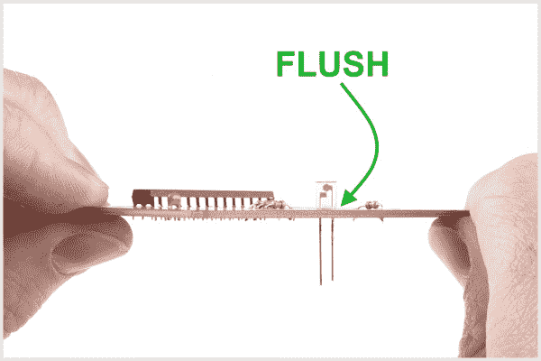](https://cdn.sparkfun.com/assets/0/3/7/8/9/52b0627b757b7f773e8b456b.jpg)

当你把 6 个都焊接到位后，你的 PCB 应该是这样的:

[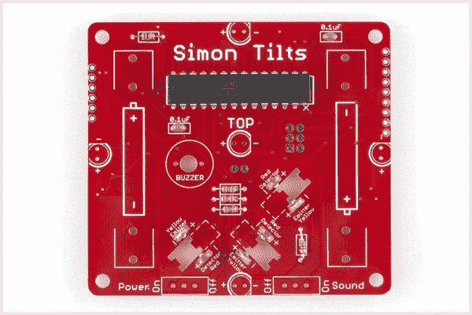](https://cdn.sparkfun.com/assets/6/b/1/7/c/52b0627e757b7f776a8b4567.jpg)

要了解更多关于红外发射器和探测器的工作原理，请观看此视频: [SparkFun 红外传感器概述](http://youtu.be/5_I5eIQsHq8)

## 蜂鸣器和开关

找到[蜂鸣器](https://www.sparkfun.com/products/7950)和[滑动开关](https://www.sparkfun.com/products/102):

[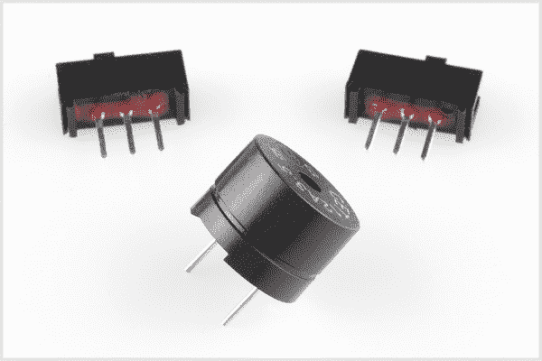](https://cdn.sparkfun.com/assets/1/9/3/d/5/52b064d1757b7f8a788b456a.jpg)

找到 PCB 上的位置:

[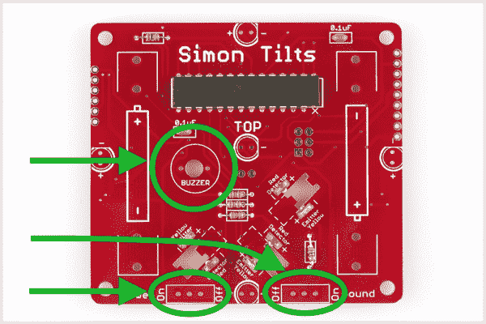](https://cdn.sparkfun.com/assets/3/8/0/b/9/52b065ca757b7f82098b4567.jpg)

将您的元件放置在 PCB 中。翻转过来，焊接到位。完成后，您的 PCB 看起来应该是这样的:

[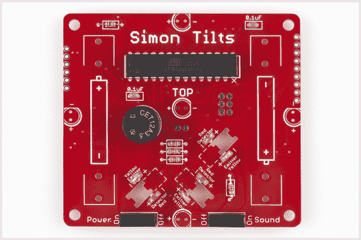](https://cdn.sparkfun.com/assets/1/d/4/2/6/52b064d3757b7f7b198b456d.jpg)

## 电池夹

找到 4 个[电池夹](https://www.sparkfun.com/products/7949):

找到 PCB 上的 4 个位置:

[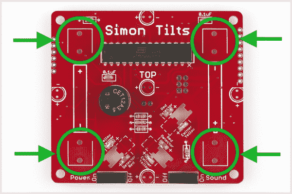](https://cdn.sparkfun.com/assets/8/e/0/8/a/52b08751757b7fb3398b4567.jpg)

注意，这些部件必须焊接在一起，使背面朝外。如果放置不当，电池就不合适。确保它们齐平，并且背面朝外:

[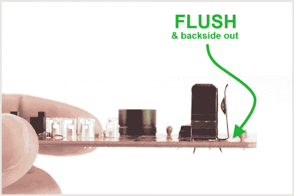](https://cdn.sparkfun.com/assets/3/5/4/1/a/52b08750757b7f7f268b4569.jpg)

焊接到位。完成后，您的板应该看起来像这样:

[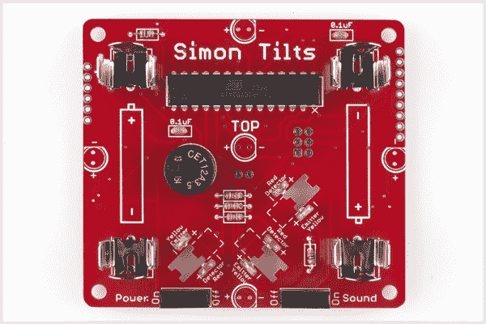](https://cdn.sparkfun.com/assets/e/a/c/2/e/52b08751757b7f9e3a8b4567.jpg)

## 6 个发光二极管

小心，接下来的 6 个器件是极化的，需要正确放入 PCB。要了解更多关于极化的知识，请查看另一个教程:[二极管和 LED 极性](https://learn.sparkfun.com/tutorials/polarity/diode-and-led-polarity)

找到 6 个指示灯。每种颜色都应该有一个:

[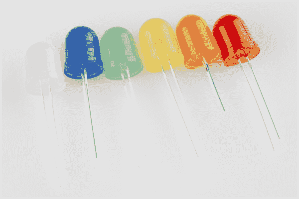](https://cdn.sparkfun.com/assets/b/d/1/e/2/52b08de4757b7f73778b456b.jpg)

发光二极管是偏振的。这意味着有“-”和“+”腿。与红外发射器和探测器类似，发光二极管具有不同长度的引脚来显示极性:

[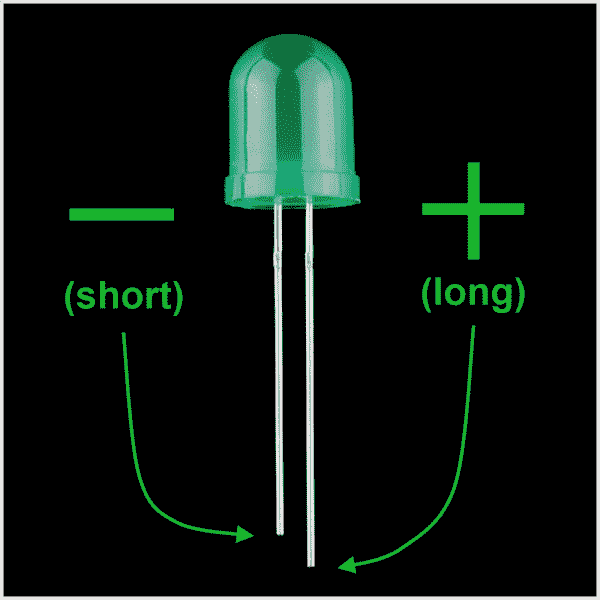](https://cdn.sparkfun.com/assets/6/a/5/4/6/52b47f77ce395f55798b4569.jpg)

找到 PCB 上 6 个 LED 的位置。

[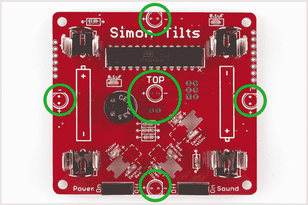](https://cdn.sparkfun.com/assets/1/8/1/6/2/52b08de4757b7f2b5a8b456c.jpg)*Note: There are two LED positions in the middle of the PCB.*

焊接外部 led 时，不要将其与电路板齐平焊接。留出 1/4 英寸的间隙:

[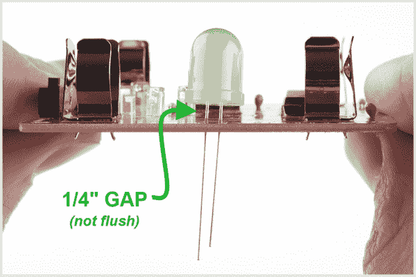](https://cdn.sparkfun.com/assets/8/d/d/9/c/52b08de4757b7f50718b4567.jpg)

这将使您能够像这样向外弯曲 led:

[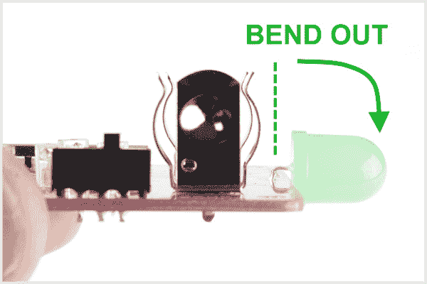](https://cdn.sparkfun.com/assets/f/5/f/2/b/52b08de4757b7fe67d8b4567.jpg)

当您焊接两个中央 led 时，请确保一个向上，一个向下:

[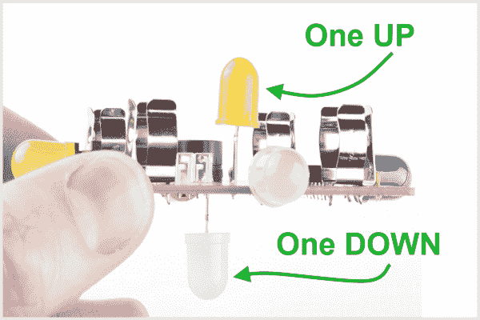](https://cdn.sparkfun.com/assets/2/8/1/c/8/52b08de4757b7fc6048b4567.jpg)

如果你不小心把 LED 焊反了，不用担心。请访问[故障排除 led](https://learn.sparkfun.com/tutorials/simon-tilts-assembly-guide/troubleshooting-leds)部分，了解如何轻松纠正故障。

恭喜你！你已经完成了装配的焊接部分。你快完成了！

## 清洁

在我们进入最后的组装步骤之前，这是清洁您的电路板的好时机。注意，这不是绝对必要的；你的 Simon Tilts 即使不清洗也很有可能工作。我们建议清洁它，以避免在玩游戏时手指沾上助焊剂。

要清洁 Simon Tilts，首先确保您没有安装电池。

你可以用旧牙刷和一些去离子水或酒精来清洁你的板。

如果你有压缩空气，这是一个快速吹掉任何液体的方法。如果没有，那么纸巾或薄纸可以做到这一点。

如果你想了解更多关于清洁的知识，请查看本教程:[电子组装-清洗](https://learn.sparkfun.com/tutorials/electronics-assembly/washing)

## 倾斜臂

最后一步是组装和安装三个倾斜臂。

首先，找到三个红色倾斜臂:

[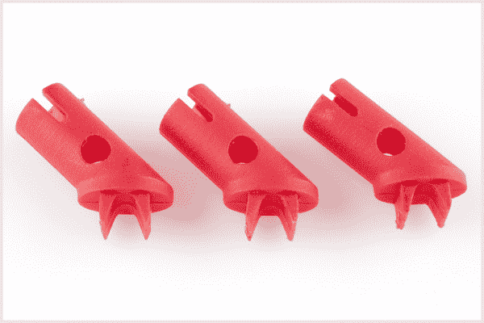](https://cdn.sparkfun.com/assets/9/8/5/e/4/52b0955d757b7f1c488b456c.jpg)

接下来，在每张纸上“弹出”一个 BB:

[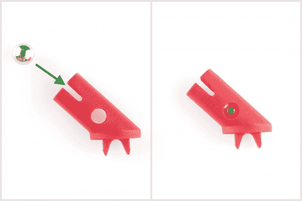](https://cdn.sparkfun.com/assets/6/5/1/c/d/52b0955d757b7f374d8b4567.jpg)

找到 PCB 上的倾斜臂位置。注意，虚线表示倾斜臂的轮廓。这显示了倾斜臂应该朝向哪个方向:

[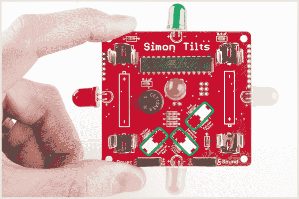](https://cdn.sparkfun.com/assets/9/b/e/e/3/52b0955e757b7f26438b456a.jpg)

当您将它们卡入到位时，请确保它们与 PCB 齐平:

[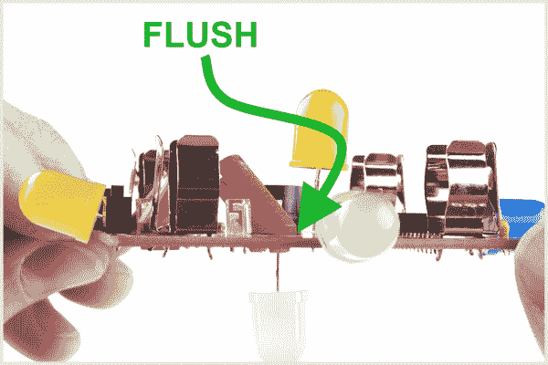](https://cdn.sparkfun.com/assets/9/b/b/2/6/52b0955d757b7fdf4f8b4567.jpg)

这三个都准备好了，它应该是这样的:

[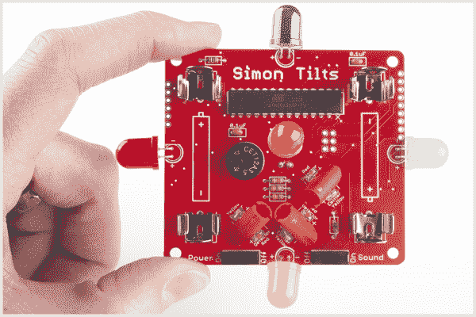](https://cdn.sparkfun.com/assets/9/0/b/5/e/52b0961c757b7f1e448b4568.jpg)

你已经很接近了！把电池放进去，然后开机！确保正确对齐每个电池的“+”和“-”侧:

[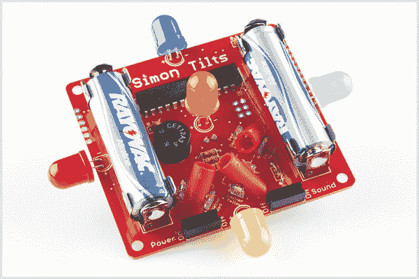](https://cdn.sparkfun.com/assets/4/4/7/c/7/52b0971a757b7f07458b4569.jpg)

## 游戏怎么玩

在您开始玩 Simon Tilts 之前，了解以下主要概念非常重要:

Simon Tilts 本质上和 Simon 说的游戏是一样的，除了一个主要的区别:每次你向上旋转一个特定的 LED，就相当于按下 Simon 说经典上的彩色按钮。

#### 怎么玩

打开它，观察发光二极管闪烁的图案。当它开始以快速模式循环通过每个 LED 时，它处于“等待模式”。它现在正等着你把游戏往任何方向倾斜。这类似于西蒙所说的，游戏会等你按下按钮才开始。

要开始新游戏，请向任何方向倾斜棋盘。然后将它直立起来，等待游戏开始。

Simon Tilts 会闪烁一个 LED。

您现在必须旋转电路板，使特定的 LED 朝上。正确旋转第一步后，LED 会闪烁，然后您必须回到直立位置。

Simon Tilts 会重复第一个 LED，但也会闪烁第二个 LED。

此时，您必须按照正确的顺序向上旋转这两个 led。(注意，如果你太慢，那么你就输了，它会回到“等待模式”)。

在你完成每个最近的模式后，你的 Simon Tilts 将再次闪烁相同的模式-再加上一个。图案越来越长，直到你赢得每一关！

*   级别 1: 5 步，慢速播放
*   第二级:10 步，快速回放
*   3 级及以上:每升一级增加 5 步，所以本质上是无限的！！

所有六个位置都是可能的——甚至是颠倒的。当你进入几个完整的旋转时，它会变得非常棘手:)除了 led 闪烁模式，蜂鸣器为每个位置发出独特的声音，以帮助你记住模式。

玩得开心，祝你好运！

## 夜灯模式

西蒙倾斜不仅仅是一个模式游戏。微控制器可以重新编程，用于许多其他项目。

作为一个例子，我们已经包括了一个“秘密”模式，称为“夜灯模式”。在这种模式下，Simon Tilts 根本不玩游戏。它只是慢慢地在每个 LED 中淡入淡出。柔和照亮任何房间的好方法。

要进入夜灯模式，请遵循以下三个步骤:

1)关机。

2)倒着拿。

3)继续倒立的同时，重新开机。

快乐发光和甜蜜的梦想！

[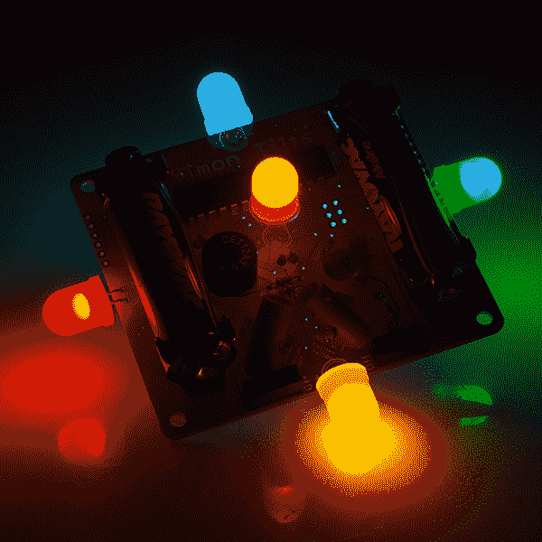](https://cdn.sparkfun.com/assets/learn_tutorials/1/6/5/Simon_Tilts_Action.jpg)

## 故障排除指示灯

故障指示灯？不要烦恼，有一个简单的方法来解决它！LED 故障最常见的原因是极性不正确。我们在 Simon Tilts PCB 中设计了一个特殊的技巧。您可以简单地切断两条走线并闭合两条跳线。这将交换极性，而不必移除 LED。

首先，找到您正在排除故障的 LED 旁边的焊接跳线。每个 LED 有两个跳线。它们位于 PCB 的底部，靠近每个 LED。

[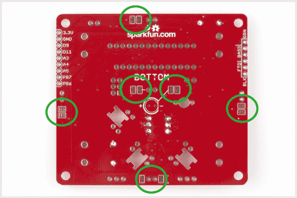](https://cdn.sparkfun.com/assets/0/5/d/0/8/52c1e51bce395f84338b456b.jpg)

每个跳线都有一条小走线将中间焊盘连接到默认极性设置。微小的痕迹有时很难看到，但它是一条细金属带，应该显示为较浅的红色。使用[业余爱好刀](https://www.sparkfun.com/products/9200)(又名 x-acto 刀)，切割默认痕迹:

[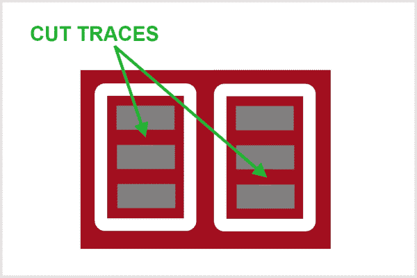](https://cdn.sparkfun.com/assets/7/9/6/3/e/52c1e52ece395faf088b4567.jpg)

使用烙铁，在中间焊盘和另一个外部焊盘之间连接一根跳线:

现在，连接到该 LED 的走线极性应该交换，您的 LED 应该亮起。

## 倾斜臂传感器原型制作

下图是 Simon Tilts 设计的早期原型之一。正如你所看到的所有手工布线，有时需要多次尝试才能找到最佳解决方案。

[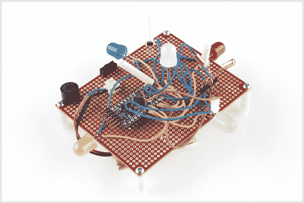](https://cdn.sparkfun.com/assets/2/9/5/0/4/52b09e4f757b7f9d168b4569.jpg)

您可以看到我们检测倾斜位置的两种初始方法。您可能注意到的第一个是三个倾斜传感器:

在这种方法中，我们使用我们的[倾斜传感器](https://www.sparkfun.com/products/10289)。

[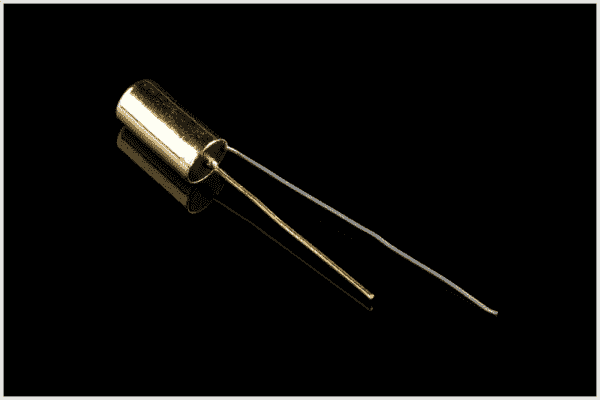](https://www.sparkfun.com/products/10289)

每个里面都有一个小金属球，可以关闭或打开两根导线之间的开关。以这种方式使用圆柱体内的落球，这非常类似于我们的最终倾斜臂方法。唯一的区别是标准倾斜传感器对于我们的应用来说不够可靠。我们从每个传感器得到的读数都非常不一致。另外，这些倾斜传感器的腿是非常细的导线，所以在稍微摸索一下后，它们会弯曲变形。

你可以在上面的原型中看到的第二种方法是使用霍尔效应传感器、磁铁和白色塑料管。这种方法实际上被证明是非常可靠和一致的。唯一的缺点是它要贵得多，而且需要采购管道和/或定制成型气缸部件。

这两种方法都有一个缺点:它们要求用户精确地将传感器弯曲到 45 度角。我们发现，如果这个角度稍微偏离，那么传感器就会开始出现故障。因此，我们继续集思广益，寻找避免这个问题的解决方案。

对于另一个原型，我们使用了[Tilt-a-Whirl Breakout-RPI-1031](https://www.sparkfun.com/products/12011)。

[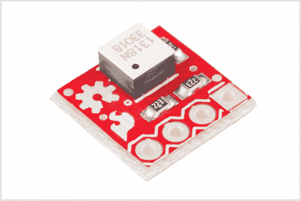](https://www.sparkfun.com/products/12011)

它工作得很好，但我们想保持这个设计 100% PTH 部分。此外，它需要两个，这将增加成本。此外，(就像其他倾斜解决方案一样，它们必须以 45 度角放置，这意味着弯曲接头或棘手的焊接。

在我们所有的原型制作过程中，加速度计 BOB 实际上是我们脑海中的一个选项。我们的[三轴加速度计 Breakout - MMA8452Q](https://www.sparkfun.com/products/10955) 将很适合这种应用。

[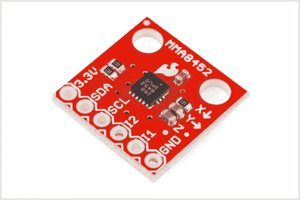](https://www.sparkfun.com/products/10955)

使用分线板有一个问题:传感器本身不是 PTH 部件。虽然我们可以在 PCB 上包括一个与加速度计引脚匹配的封装，但我们对使用这种方法犹豫不决。在项目中增加一个“黑箱”会增加新手理解技术的障碍。

最终，我们选择制造自己独特的定制模制零件:

[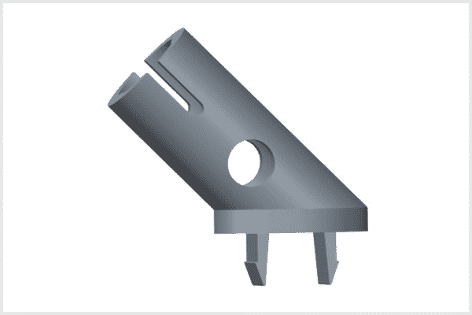](https://cdn.sparkfun.com/assets/8/0/9/b/e/52b4906cce395fc74f8b4567.jpg)

它使用一个红外发射器和探测器，以了解气缸内 BB 球的位置。红外发射器和检测器的位置应使红外光束能够穿过圆柱体底部的孔。当 BB 停在圆柱体底部时，它会阻挡红外光束。当 BB 位于倾斜臂的上端时，则“透视”孔畅通无阻，红外探测器可以感应到发射器。

为了使使用这部分更容易，我们在我们的 [Eagle 库](https://github.com/sparkfun/SparkFun-Eagle-Libraries)中创建了一个设备:

[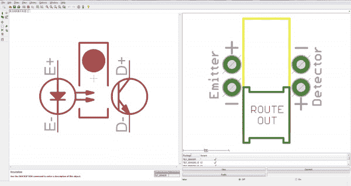](https://cdn.sparkfun.com/assets/e/4/9/3/b/52b4927cce395fb8338b456a.jpg)

包装包括发射器、检测器的正确定位，以及与倾斜臂部分匹配的尺寸布线区域。需要注意的一点是，为检波器线路选择上拉电阻时，我们发现 330 欧姆是最佳值。该值用于套件中。我们首先尝试在 ATmega328 上使用内部上拉电阻，但检波器的电压摆幅非常小，很难获得准确的读数。

我们要向 [Modrobotics](http://www.modrobotics.com/) 致以深深的感谢，因为他们为我们打印了三轮原型！

我们还要感谢 [Mountain Molding](http://www.mountainmolding.com/) 在设计、加工和制造零件方面给予的所有帮助！

## 资源和更进一步

如果您想进一步了解 Simon Tilts 设计的工作原理，查看设计文件是一个不错的起点。

有关更多信息，请查看以下资源:

*   [示意图(PDF)](https://cdn.sparkfun.com/datasheets/Kits/Simon_Tilts.pdf)
*   [老鹰文件(ZIP)](http://cdn.sparkfun.com/datasheets/Kits/Simon_Tilts.zip)
*   [SparkFun 博客文章:创建自定义倾斜传感器](https://www.sparkfun.com/news/1410)
*   [西蒙倾斜 GitHub 储存库](https://github.com/sparkfun/Simon_Tilts)
*   [产品演示视频](https://www.sparkfun.com/videos#all/MaGUkhwFHnk/107)

### 重新编程西蒙倾斜

你的 Simon Tilts 游戏可以用 Arduino 重新编程。这意味着你可以改变游戏规则，增加更多的功能，或者把它变成一个完全不同的项目。有关如何使用 Arduino 重新编程的更多信息，请查看这些教程教程:

 [### 什么是 Arduino？](https://learn.sparkfun.com/tutorials/what-is-an-arduino) What is this 'Arduino' thing anyway? This tutorials dives into what an Arduino is and along with Arduino projects and widgets.[Favorited Favorite](# "Add to favorites") 50 [### 安装 Arduino IDE](https://learn.sparkfun.com/tutorials/installing-arduino-ide) A step-by-step guide to installing and testing the Arduino software on Windows, Mac, and Linux.[Favorited Favorite](# "Add to favorites") 16

如果你有兴趣了解更多关于编写代码的知识，一个好的起点是完成 [SparkFun Inventors Kit](https://www.sparkfun.com/products/13969) 中的示例电路。

[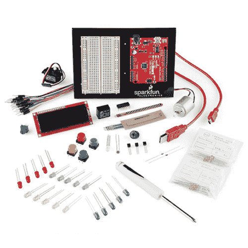](https://www.sparkfun.com/products/retired/13969) 

### [SparkFun 发明家工具包- V3.3](https://www.sparkfun.com/products/retired/13969)

[Retired](https://learn.sparkfun.com/static/bubbles/ "Retired") KIT-13969

* *您可能已经从[我们的博客帖子](https://www . spark fun . com/news/2241)中看到，我们最近为 SIK 移动了注塑模具…

4 **Retired**[Favorited Favorite](# "Add to favorites") 14[Wish List](# "Add to wish list")

Simon Tilts 附带的微控制器实际上可以用 Arduino 重新编程。这是相同的微控制器是用在红板 SIK。这意味着，如果你想，你可以使用在 SIK 学到的技能来修改你的西蒙倾斜。例如，你可以改变游戏的玩法，或者将它用于一个完全不同的项目！

### 更多套件！！！

如果你想要更多的焊接，这里有一些其他有趣的 PTH 焊接套件的建议:

 

将**添加到您的[购物车](https://www.sparkfun.com/cart)中！**

### [斯帕克芬西蒙说——通孔焊接套件](https://www.sparkfun.com/products/10547)

[Only 14 left!](https://learn.sparkfun.com/static/bubbles/ "only 14 left!") KIT-10547

这是我们广受欢迎的通孔西蒙说套件的最新版本。我们已经对董事会做了一些更改，应该会使…

$28.9542[Favorited Favorite](# "Add to favorites") 19[Wish List](# "Add to wish list")****[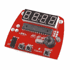](https://www.sparkfun.com/products/retired/10930) [Retired](https://learn.sparkfun.com/static/bubbles/ "Retired") KIT-10930

这是一个学习焊接基础知识的好工具。SparkFun ClockIt 是一个基本的带蜂鸣器的闹钟，基于 ev…

4 **Retired**[Favorited Favorite](# "Add to favorites") 12[Wish List](# "Add to wish list") 

### [SparkFun BigTime 手表套装](https://www.sparkfun.com/products/retired/11734)

[Retired](https://learn.sparkfun.com/static/bubbles/ "Retired") KIT-11734

SparkFun BigTime 手表套件是一款极客时尚的数字手表，配有北约风格的表带和光滑的丙烯酸外壳…

6 **Retired**[Favorited Favorite](# "Add to favorites") 27[Wish List](# "Add to wish list")** **要查看我们网站上提供的所有套件，请在 SparkFun 网站上查看我们的[套件类别](https://www.sparkfun.com/categories/157)。**