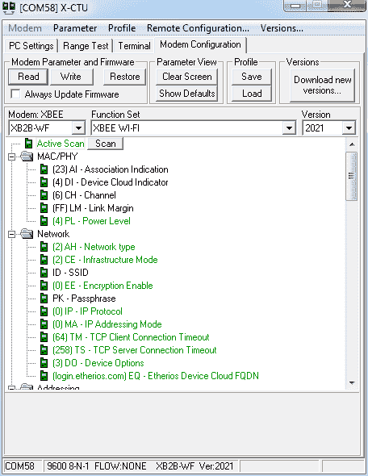
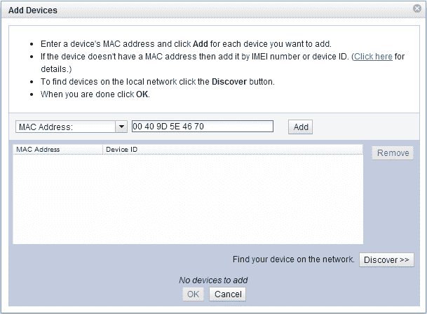
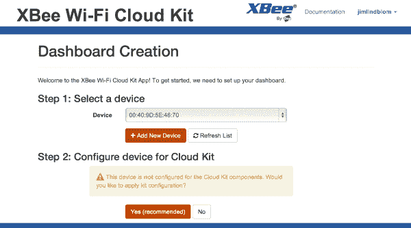

# XBee WiFi 连接指南

> 原文：<https://learn.sparkfun.com/tutorials/xbee-wifi-hookup-guide>

## 介绍

Digi 的 XBee WiFi 模块是一个漂亮的一体化解决方案，可以让您的项目连接到无线网络，并进入`<wavy hands>`云。这些模块可能看起来就像“普通的”XBee 一样——它们甚至具有相同的大小和引脚排列——但它们被构建为无缝连接到 802.11b/g/n 网络。

*An [XBee WiFi Module with Whip Antenna](https://www.sparkfun.com/products/12571). They're also offered with [PCB antennas](https://www.sparkfun.com/products/12568) and [RPSMA](https://www.sparkfun.com/products/12569) and [U.FL](https://www.sparkfun.com/products/12570) connector options.*

除了通过不同的无线标准交谈，这些模块的工作方式与任何 XBee 一样。您可以使用 XCTU 设置它们(这也有助于将其连接到网络)。您可以切换 I/O 引脚，读取模拟和数字输入，并将模块设置为睡眠。它们可以完全独立工作，不需要外部控制微控制器。也就是说，如果你想连接一个 Arduino 或另一个处理器，通过串行端口很容易做到。

您可以像使用任何其他 XBee 一样使用这些模块——设置一个**本地无线串行网关**。一个 XBee WiFi 模块可以轻松地与另一个模块通话，只要它拥有另一个模块的本地 IP 地址。

但是这些模块还有另一个更独特的应用:让物联网项目变得超级简单。使用 [Etherios(TM)设备云](http://www.etherios.com/products/devicecloud/)服务，您可以快速将他们连接到云，他们可以在那里发布数据和接收命令。

### 本教程涵盖的内容

在本教程中，我们将提供 XBee WiFi 模块的[快速概述](https://learn.sparkfun.com/tutorials/xbee-wifi-hookup-guide/an-overview)。然后我们会看一些例子。我们将向您展示[如何使用 XCTU](https://learn.sparkfun.com/tutorials/xbee-wifi-hookup-guide/using-x-ctu) 将它们连接到附近的无线网络——包括设置 SSID 和加密协议。

在最后一个例子中，我们将向您展示如何[将 XBee WiFi 连接到设备云](https://learn.sparkfun.com/tutorials/xbee-wifi-hookup-guide/to-the-cloud)。这允许你通过网页浏览器中加载的网页应用程序来控制 XBee。你可以在海的另一边(或者在你房间对面的桌子上)控制你的 XBee。

#### 所需材料

要跟随本教程，您需要以下物品:

*   XBee WiFi 模块
    *   如果您想要设置一个本地无线串行网关，您将需要多个网关。
*   一个 [USB 浏览器](https://www.sparkfun.com/products/8687)、[浏览器加密狗](https://www.sparkfun.com/products/9819)，或者一个[串行浏览器](https://www.sparkfun.com/products/9111)。
    *   这些板作为您计算机上的 XCTU 软件和 XBee WiFi 模块之间的“翻译器”而存在。
*   为了遵循最后一个示例，我们推荐(所有这些都是可选的，或者您可能有一些类似的组件):
    *   一块[试验板](https://www.sparkfun.com/products/12002)
    *   [XBee 分线板](https://www.sparkfun.com/products/8276)上附有[接头](https://www.sparkfun.com/products/8272)
    *   [LED](https://www.sparkfun.com/categories/172) (我们喜欢[蓝色](https://www.sparkfun.com/products/529))
    *   [电位器](https://www.sparkfun.com/products/9806)
    *   [SPDT 开关](https://www.sparkfun.com/products/102)
    *   [瞬时按钮](https://www.sparkfun.com/products/97)

### 推荐阅读

*   [探索 XBee 和 XCTU](https://learn.sparkfun.com/tutorials/retired---exploring-xbees-and-xctu)——这是一本很好的 XBee 和 XBee explorer 初级读本。如果有的话，请查看本教程中的浏览器概述。
*   [串行通信](https://learn.sparkfun.com/tutorials/serial-communication) - XBees 使用串行进行通信和接收数据。对串行(波特率、RX、TX 等)有一定的了解。)大有帮助。
*   [如何使用试验板](https://learn.sparkfun.com/tutorials/how-to-use-a-breadboard)——在本教程的最后一页，我们将在试验板上构建一个电路，从云端控制 XBee WiFi。
*   [逻辑电平](https://learn.sparkfun.com/tutorials/logic-levels)-XBee WiFi 的最大工作电压为 3.3V。不要给它连接 5V 控制器和传感器！

## 概述

XBee WiFi 模块与大多数“普通”XBee 具有相同的占地面积和引脚排列。他们有 20 个通孔销，每个间隔 2 毫米。引脚功能包括电源输入、GPIO、模拟输入和 SPI。这里，来自[数据表](http://ftp1.digi.com/support/documentation/90002180_G.pdf)的是引脚及其功能表:

*XBee WiFi Pinout table. Click to embiggen.*

XBee WiFi 模块*可以通过串行端口*连接到另一个微控制器，但它们的特别之处在于它们拥有自己的一整套 I/O 引脚。XBee 可以单独切换 led、电机或继电器，也可以读取数字或模拟输入。我们将利用云的[中的 XBee I/O 功能！](https://learn.sparkfun.com/tutorials/xbee-wifi-hookup-guide/to-the-cloud)页面，将 led 和按钮直接连接到小 WiFi 模块。

### 选择天线

有各种 XBee WiFi 模块，每个模块都有自己的天线终端。其中两个模块有**集成天线**:[PCB 天线](https://www.sparkfun.com/products/12568)和[线(鞭)天线](https://www.sparkfun.com/products/12571)。如果你想买便宜的，这些是最好的选择，但是它们的范围也比较小。

*XBee WiFi modules with PCB antenna (left) and whip antenna (right). No external antenna needed!*

如果您需要更大的范围，请考虑使用带有 [U.FL 连接器](https://www.sparkfun.com/products/12570)或 [RPSMA 连接器](https://www.sparkfun.com/products/12569)的模块。这些都需要一个**兼容的外部 2.4GHz 天线**。

*XBee WiFi modules with a U.FL (left) and SMA (right) antenna connector.*

对于 U.FL 版本，[粘合 2.4GHz 天线](https://www.sparkfun.com/products/11320)是一个不错的低调选择。对于 SMA 版本，鸭式天线([大](https://www.sparkfun.com/products/558)和[普通](https://www.sparkfun.com/products/145))是一个不错的时尚选择。

### 选择分线板

使用这些模块最简单的方法是将它们插入配套的分线板。对于本教程的下一页，我们建议你买一个 **XBee Explorer** ，它可以让你从你的电脑与 XBee 通信。探险者有 [mini-B USB](https://www.sparkfun.com/products/8687) 、 [USB 加密狗](https://www.sparkfun.com/products/9819)和 [RS-232 串行](https://www.sparkfun.com/products/9111)(如果你有一台带串行端口的老式电脑的话)版本。三者任意一个都可以！

作为 USB 和串行浏览器的替代品，还有更简单的 XBee 分线板。还有*[XBee 分线板](https://www.sparkfun.com/products/8276)，它只是将间距为 2 毫米的 XBee 分成一个更适合试验板的 0.1 英寸间距。然后是 [XBee Explorer Regulated](https://www.sparkfun.com/products/11373) ，它打破了引脚，并具有板载电压调节，以帮助与 3.3V XBee 配合。这两种方式都非常适合嵌入到项目中，但是与您的计算机交互可能会有点困难。*

 ** * *

在接下来的几页中，我们将向您展示如何将 XBee WiFi 与 XCTU 和 Digi 的云服务配合使用。这不是使用这些模块的唯一方法，但却是让它们快速启动并运行的最简单的方法。如果你跟着做，你可以很容易地让 XBee 与“云”通信。

## 使用 XCTU

XCTU 是 Digi 的 XBee 配置软件。它使得与 XBees 的通信变得非常容易，并提供了一个很好的界面来修改所有模块的设置。当它与 XBee WiFi 一起使用时，它甚至提供了 WiFi 网络扫描和连接接口，使连接网络变得轻而易举。

XCTU 的当前版本可以在 Digi 的网站上获得，不幸的是它只适用于 Windows。对于 Mac OS X 用户，有一个 XCTU 6.0.0 的[测试版](http://www.digi.com/blog/community/xctu-sneak-peek-sign-up/)，我们已经测试过，发现它可以完美地与 XBee WiFi 配合使用。(Windows 用户也可以查看，它非常灵活。)继续吧，**下载 XCTU** 跟随。

在本节中，我们还假设您有一个 XBee 通过 [USB Explorer](https://www.sparkfun.com/products/8687) 或类似的东西连接到您的计算机。浏览器应该已经在您的计算机上枚举了一个 COM 端口。这是我们将用来与 XBee 通信的端口。

### 使用 XCTU 连接到 WiFi 网络

在开始使用 XBee WiFi 之前，我们需要设置它以连接到我们的 WiFi 网络。XCTU 简化了这个过程。请遵循以下步骤:

1.  将 XBee 插入 XBee 浏览器，并将浏览器插入电脑。
    *   如果您还没有为您的浏览器安装驱动程序，您可能需要这样做。查看我们的[如何安装 FTDI 驱动教程](https://learn.sparkfun.com/tutorials/how-to-install-ftdi-drivers)获得帮助。
2.  **打开 XCTU** 。它应该在“电脑设置”选项卡上打开。在那里，选择你的 XBee 浏览器的 **COM 端口**，并确保端口设置如下(9600 8-N-1)。

    *First, setup your COM port and make sure the settings are correct.*
3.  点击**测试/查询**以确保您可以与 XBee WiFi 通信。您应该会得到这样的回应:

    *This is a good sign! Means we're communicating with the XBee.*
4.  点击进入**“调制解调器配置”**选项卡。并点击**“读取”**显示您的 XBee WiFi 存储设置。

    *A view of the XBee WiFi's default parameters.*
5.  选择滚动窗口顶部附近的**“主动扫描”**。然后点击出现的**【扫描】**按钮**。这将打开网络扫描实用程序。

6.  点击扫描窗口底部的**“扫描”**按钮。如果一切顺利，你的网络应该出现在上面。“链接余量”值代表信号的强度(越大越好)。“安全”值表示网络的加密模式。

    *Select your network's SSID, enter a passkey if necessary, and click "Select AP".*
7.  **选择您的网络**。如果是加密的，**输入你的安全密钥**。然后点击**“选择 AP”**(不是“完成”！).XCTU 将配置您的 XBee，如果您的网络已为其设置，它将尝试租借 DHCP 地址。

    *   这一步可能需要一段时间。耐心点。希望一旦连接，你会看到一个窗口告诉你 XBee 在“x 毫秒”内连接到你的网络。
8.  连接成功后，再次点击窗口顶部的**“读取”**。这将更新 XBee 的所有设置，包括 GW(网关 IP)、MK(子网掩码)和 **MY(模块分配的 IP)** 。如果这些值都有意义，那么恭喜你，你的 XBee 已经连接到你的 WiFi 网络了！

    *Our XBee WiFi module's IP address is 192.168.0.101.*

耶！现在怎么办？有几个方向可以选择:

### 与其他 XBees 通信

如果你以前用过 XBees，你可能会认为它们是易于安装的无线收发器。正确配置的两个 XBees 可以无缝地**将数据从一个串口传递到另一个**。XBee WiFi 也没什么不同！

按照同样的步骤，你可以**设置第二个 XBee WiFi 模块**来连接到你的无线网络。它将获得一个唯一的 IP 地址(通常通过 DHCP 分配)。请注意这一点。

要设置两个 XBee 相互通信，您需要修改每个 XBee 到另一个 XBee 的 DL - **目的 IP 地址**。您可以打开第二个 XCTU 窗口，或者一次配置一个窗口。

*Imagine two XBees connected to a computer, each with it's own USB explorer and XCTU window open. If you want to configure them to talk with each other, set the "DL" property of each, to the other's IP address.*

然后，你可以点击**终端标签**来输入字符，并让它们从你的计算机通过一个 XBee 发送到另一个 XBee，然后发送到第二个终端。

* * *

这些模块的另一个可选应用是在云上使用它们。Digi 的设备云服务让这变得非常容易。点击进入下一页，查看设置示例。

## 向云！

XBee WiFi 旨在通过 Etherios (TM) 实现与[设备云的简单通信。设备云服务允许您将 XBee WiFi 连接到网络，您可以控制 I/O 引脚，并从舒适的网络浏览器中读取其状态(在世界任何地方！).](http://www.etherios.com/products/devicecloud/)

现在，设备云*是*的付费服务，但它的价格非常合理(每个设备每月 0.50 美元)。他们还提供了一个**免费 30 天试用**，如果你只是想尝试一下，这就是我们在这里要做的。

### 设置设备云

首先，我们需要设置设备云来与 XBee WiFi 通信。按照以下步骤进行设置:

1.  进入[设备云登录页面](https://login.etherios.com/login.do)。如果您还没有帐户，请登录或创建帐户。如果你只是想免费试用，不要担心，你不必输入任何支付信息。
2.  在设备云**中，点击设备管理选项卡**。
3.  在设备管理部分，点击顶部附近的**添加设备**按钮。这是我们将 XBee WiFi 模块指向设备云 ID 的地方。
4.  添加 XBee 有两种方法。我们推荐手动方法:
    *   确保您位于“添加设备”窗口的“手动”部分。
    *   找到你的 **XBee WiFi 的 MAC 地址**。这在 XCTU 中的 SL 和 SH(序列号上限和下限)条目下列出。您需要将这两个值连接起来以获得您的 MAC 地址。 *在 XCTU 中，这是你会找到 MAC 地址的地方。*
    *   将**下拉菜单设置为 MAC 地址**。然后在旁边的文本框中输入 XBee 的地址。您可能需要添加几个前导的 *0* ，使其长度为 6 个字节。然后**点击添加**。
    *   经过一些拇指拨弄你的 XBee 和它的 MAC 地址应该出现在下面的列表中。**点击确定**。
5.  现在，您应该在设备云中有一个 XBee 条目了。**右键点击 XBee 并选择属性**(或选择 XBee 并点击上面的“属性”按钮)。

在这里，您可以查看和控制与您的 XBee 相关的所有内容。您可以在**输入输出设置选项卡**中设置管脚的方向和值。尝试将一个引脚设置为“输出高”，然后点击`Save`。引脚应该被驱动到 3.3V，但是你怎么知道呢？是时候组成一个电路了！

### 休息一下电路装配！

这里是我们将用来充分利用 XBee 的示例云仪表板的电路。您不必连接每个部分，但我们建议至少尝试连接到引脚 13 的 LED。

*The schematic and breadboard diagram for the cloud example. Click to embiggen!*

你仍然需要给 XBee WiFi 模块供电。它可以保留在 XBee Explorer 中，或者您可以将其插入单独的 [XBee 分线板](https://www.sparkfun.com/products/8276)。这是我们连接使用的图像:

*   [半块试验板](https://www.sparkfun.com/products/12002)
*   [10k 带旋钮的微调按钮](https://www.sparkfun.com/products/9806)
*   [迷你按钮](https://www.sparkfun.com/products/97)
*   [迷你电源开关](https://www.sparkfun.com/products/102)
*   [5 毫米超高亮蓝色 LED](https://www.sparkfun.com/products/529)
*   [5V/3.3V 试验板电源](https://www.sparkfun.com/products/10804)(设置为 3.3V！)

现在我们已经附加了一些按钮和 led，是时候把它带到云上了！

### 设置 XBee 仪表板

你可以使用 Digi 的[示例应用](https://xbeewifi.herokuapp.com/)来测试你的设备云设置。按照以下步骤启动并运行:

1.  登录 [XBee WiFi 云套件](https://xbeewifi.herokuapp.com/#/login)。使用与之前的设备云相同的登录。
2.  在下一页的“选择设备”标题下，您应该会看到一个下拉菜单，其中已经选择了您的 XBee 地址。然后只需点击“是(推荐)”来为这个例子配置您的 XBee。
3.  选择一个布局预设，然后**创建仪表板！**您应该会在下一个屏幕上看到类似这样的内容。T3T5

玩弄它！尝试远程打开 LED。然后读一些按钮和电位器。相当酷！现在请大洋彼岸的朋友来做。更酷！

如果你想构建自己的应用程序，点击小部件上的`</>`按钮就可以看到所有需要的代码。看起来一切都托管在 [Digi 的 GitHub 页面](https://github.com/digidotcom/xbeewificloudkit)上，我们是这个页面的*超级*粉丝。

## 资源和更进一步

现在你已经把你的 XBee 带到了云端，你打算开发什么样的物联网应用呢？如果您需要任何帮助，或者本教程没有回答您的所有问题，也可以考虑查看以下资源:

*   [XBee WiFi 模块数据表](http://www.digi.com/pdf/ds_xbeewifis6b.pdf)
*   [XBee WiFi 用户手册](http://ftp1.digi.com/support/documentation/90002180_H.pdf)
*   [XBee WiFi 开发套件入门指南](http://ftp1.digi.com/support/documentation/90002184_B.pdf)
*   [云套件入门指南](http://ftp1.digi.com/support/documentation/html/90002195_A/index.html)
*   [云套件示例](http://examples.digi.com/wifi/)
*   Mac 和 Windows 用户都应该看看 XCTU 6.0 的[测试版(即将正式发布？)](http://www.digi.com/blog/community/xctu-sneak-peek-sign-up/)
*   [Digi 的 XBee WiFi 云套件 GitHub 页面](https://github.com/digidotcom/xbeewificloudkit)

### 更进一步

如果你需要一些灵感，或者只是想继续阅读教程，请查看以下相关指南:

*   [使用 XBee WiFi 进行互联网数据记录](https://learn.sparkfun.com/tutorials/internet-datalogging-with-arduino-and-xbee-wifi)-XBee WiFi 不必被归入与设备云对话。看看这个教程，我们将 XBee WiFi 与 XBee Shield 和 Arduino 结合起来，将传感器读数贴在互联网上。

*   [ATmega128RFA1 开发板连接指南](https://learn.sparkfun.com/tutorials/atmega128rfa1-dev-board-hookup-guide) - ATmega128RFA1 开发板就像完全可定制的 XBees。它们的运行标准与 Zigbee 相同(所以没有 WiFi)，但它们为你提供了大量的 I/O，甚至 Arduino 功能。
*   [蓝牙基础知识](https://learn.sparkfun.com/tutorials/bluetooth-basics) -如果 WiFi 不太适合你的项目，另一个无线选项是蓝牙。在本技术教程中了解所有关于蓝牙的知识。
*   [RN-52 连接指南](https://learn.sparkfun.com/tutorials/rn-52-bluetooth-hookup-guide) -如果你喜欢蓝牙，我们推荐 RN-52 用于音频或...
*   [BlueSMiRF 连接指南](https://learn.sparkfun.com/tutorials/using-the-bluesmirf)-BlueSMiRF 是一个非常简单的蓝牙模块，非常适合通过无线传输低数据速率串行数据。*