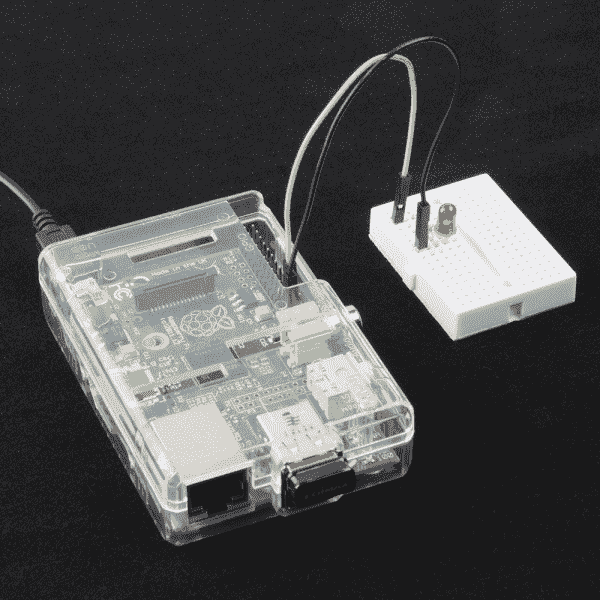

# Raspberry Pi Twitter 监视器

> 原文：<https://learn.sparkfun.com/tutorials/raspberry-pi-twitter-monitor>

## 推特世界

不管你喜不喜欢，Twitter 是一股不可忽视的力量。数百万人使用 Twitter 来谈论世界上发生的事情和他们的生活。像大会、选举和起义这样的大型活动有一个习惯[让 Twitter 服务器](http://computer.howstuffworks.com/internet/social-networking/information/5-events-to-crash-twitter.htm#page=0)崩溃。

你，一个狂热的 DIY 黑客，想知道如何使用大量的数字社交媒体。有很多有趣的项目围绕着[在推特上发布发生的事情](https://www.sparkfun.com/tutorials/144)。今天，我们给你提供一个选择:当一个特定的 Tweet 发生时，让一些事情发生。

这是一个基本的项目，当 Twitter 流中出现一个特定的标签时，它会引导你完成一个 LED 闪烁的步骤。虽然闪烁的 LED 可能不是最令人兴奋的结果，但将 Twitter 连接到物理世界将使你开始创建 Twitter 控制的机器人。

*Blink an LED whenever specific hashtag appears in a Tweet*

### 推荐阅读

我们需要构建一个相当简单的 LED 电路来连接到 Raspberry Pi 的 GPIO 头。请务必熟悉发光二极管和电阻。

*   [发光二极管](https://learn.sparkfun.com/tutorials/light-emitting-diodes-leds)
*   [电阻器](https://learn.sparkfun.com/tutorials/resistors)
*   [如何使用试验板](https://learn.sparkfun.com/tutorials/how-to-use-a-breadboard)

## 必需的组件

你需要一个运行某种 Linux 的 Raspberry Pi。我们推荐 Raspbian 的最新版本[，因为它预装了 Python 和 GPIO 库。此外，Pi 需要连接到互联网，以便您可以监控 Twitter 流。这可以通过使用以太网电缆或 USB WiFi 加密狗来实现。如果你喜欢清单，这是给你的:](http://www.raspberrypi.org/downloads)