# 图形 LCD 连接指南

> 原文：<https://learn.sparkfun.com/tutorials/graphic-lcd-hookup-guide>

## 介绍

还记得手机还很“笨”的日子吗？那时手机只有物理键盘和一个小小的单色 LCD 显示屏。现在，iPhones、Galaxies 等产品已经彻底改变了这个市场，这些小 LCD 必须找到新的生活目标:为项目添加定制的图形显示！

[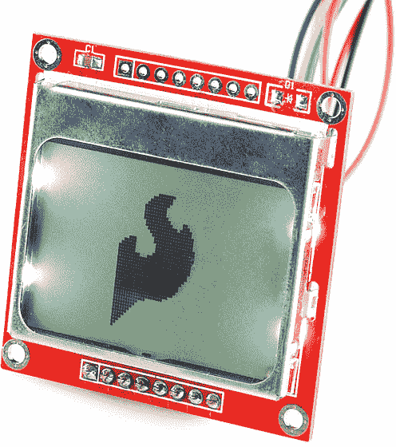](https://www.sparkfun.com/products/10168)

这些 84x48 像素的黑白液晶显示器可能是你在旧的 T2 诺基亚 3310 T3 中发现的。它们并不华丽，也没有太多的展示空间。但是，它们很容易控制*。如果您希望从简单的显示器或 led 开始提升项目的用户界面(UI)游戏，这款图形 LCD 是一个不错的起点。*

[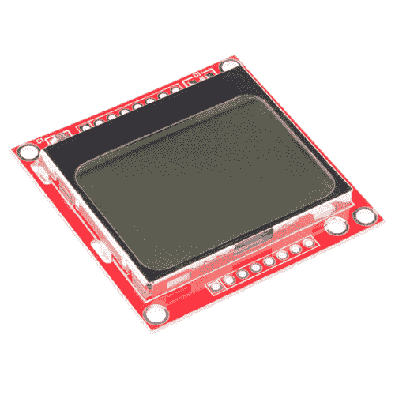](https://www.sparkfun.com/products/10168) 

将**添加到您的[购物车](https://www.sparkfun.com/cart)中！**

 **### [图形液晶 84x48 -诺基亚 5110](https://www.sparkfun.com/products/10168)

[In stock](https://learn.sparkfun.com/static/bubbles/ "in stock") LCD-10168

诺基亚 5110 是一款适用于许多应用程序的基本图形液晶屏。它原本是打算用作手机的…

$8.9518[Favorited Favorite](# "Add to favorites") 57[Wish List](# "Add to wish list")** **在本教程中，我们将展示如何控制这些图形液晶显示器只有一个 Arduino 和一些电线之间。我们将涵盖从硬件组装到示例代码等所有内容。

### 所需材料

*   [Arduino](https://www.sparkfun.com/products/11021) 、 [RedBoard](https://www.sparkfun.com/products/11575) 或任何 [Arduino 兼容](https://www.sparkfun.com/categories/242)板卡。
*   [公接头](https://www.sparkfun.com/products/116)(包含在[零售套件](https://www.sparkfun.com/products/10773)中)焊接到显示器上，使其与试验板兼容。
*   [跳线](https://www.sparkfun.com/products/11026)从试验板连接到 Arduino。
*   将所有东西连接在一起的试验板。

### 推荐阅读

*   什么是 Arduino？ -我们将使用 Arduino 向 LCD 发送命令和显示数据。
*   [串行外设接口(SPI)](https://learn.sparkfun.com/tutorials/serial-peripheral-interface-spi) -一个类似 SPI 的接口用于控制 LCD。
*   [如何使用试验板](https://learn.sparkfun.com/tutorials/how-to-use-a-breadboard) -试验板将 Arduino 连接到 LCD。

## 显示概述

在深入研究连接和示例代码之前，让我们先来看看 LCD 及其分线板。在这一页中，我们将介绍从电路板引脚排列到用于控制显示器的接口的所有内容。

### 引脚排列

为了与图形 LCD 接口并为其供电，在其上方和下方有两个平行的 8 针接头。把板子翻过来，你会发现每个针脚的标签。

[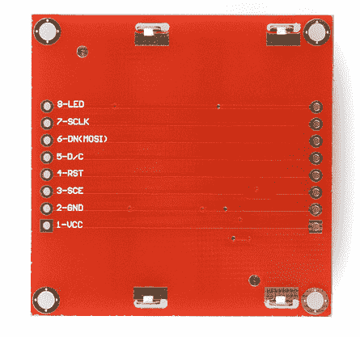](https://cdn.sparkfun.com/assets/6/c/f/8/b/524dc9ea757b7f616e8b4569.png)

从连接它们的微弱轨迹可以看出，一个接头上的每个引脚都连接到另一端的平行引脚。以下是八种独特的引脚及其用途概述:

| 插脚数 | Pin Label | 引脚功能 | 输入/输出？ | 笔记 |
| one | VCC | 正电源 | 投入 | 电源电压范围在 2.7V 和 3.3V 之间 |
| Two | GND | 地面 | 投入 |  |
| three | 苏格兰教育证书 | 芯片选择 | 投入 | 低电平有效 |
| four | 英特尔的快速储存技术 | 重置 | 投入 | 低电平有效 |
| five | 信用证 | 方式选择 | 投入 | 在命令模式(低)和数据模式(高)之间选择。 |
| six | DN(MOSI) | 串行数据输入 | 投入 |  |
| seven | SCLK | 串行时钟 | 投入 |  |
| eight | 发光二极管 | LED 背光电源 | 投入 | 最大电源电压为 3.3V。 |

### 电力供应

LCD 上有两种不同的电源电压。最重要的电源电压 **VCC** 为 LCD 内部的逻辑电路供电。[数据表](http://cdn.sparkfun.com/tutorialimages/GraphicLCDNokia3310/goldentek.pdf)指出这应该是在 2.7 和 3.3V 之间的**。在正常状态下，LCD 将消耗大约 6 或 7mA。**

电路板上的 LED 背光需要第二个电压源。如果你要从 PCB 上拆下 LCD(并不是说你应该或者需要)，你会看到这些是最简单形式的背光——四个白色的 led 灯分布在电路板的边缘。你可能还注意到，没有任何限流电阻。

[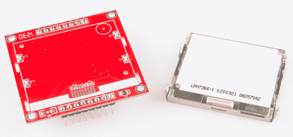](https://cdn.sparkfun.com/assets/b/4/1/0/0/52717f87757b7f9b758b4567.png)

这意味着你必须*小心*这个电压供应。要么在“LED”引脚上串联一个限流电阻，要么将电源限制在**最大 3.3V】。发光二极管可以拉很多电流！如果没有任何限制，它们在 3.3V 时可以输出大约 100mA 的电流**

### 控制界面

这个 LCD 内置了一个飞利浦 PCD8544 显示控制器，它可以将原始 LCD 的大规模并行接口转换为更方便的串行接口。PCD8544 通过类似于 [SPI](https://learn.sparkfun.com/tutorials/serial-peripheral-interface-spi) 的同步串行接口进行控制。有时钟(**)和数据( **DN** )输入线，以及低电平有效芯片选择( **SCE** )输入。**

 **在这三条串行线之上，还有另一个输入- **D/C** -它告诉显示器它正在接收的数据是命令还是可显示的数据。

有关命令列表，请查看 PCD8544 数据手册的“说明”部分(第 11 页)。有指示，使清除显示，反转像素，关机，等等。

## 硬件装配和连接

在我们开始上传代码和发送数据到显示器之前，让我们先处理一下硬件。这包括组装显示器，并将其连接到 Arduino 上。

### 装配

为了“组装”液晶显示器，你需要[焊接](https://learn.sparkfun.com/tutorials/how-to-solder-through-hole-soldering)一些东西到一个(或两个)8 针接头上。这里有很多选择。为了使 LCD 试验板兼容，可以焊接[直头](https://www.sparkfun.com/products/116)或[直角公接头](https://www.sparkfun.com/products/553)。

[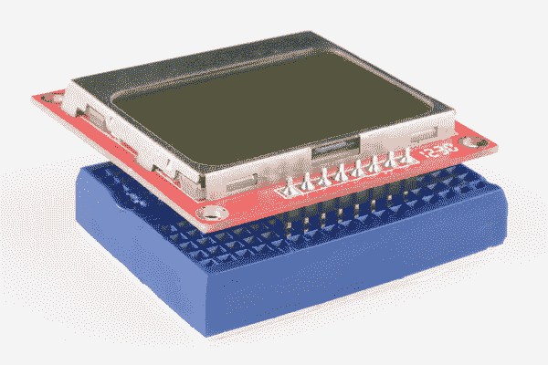](https://cdn.sparkfun.com/assets/7/3/6/5/5/52718001757b7f4c758b4567.png)*LCD with strait male headers soldered in, plugged into a [mini blue breadboard](https://www.sparkfun.com/products/11660).*

否则，[线](https://www.sparkfun.com/products/11375)或其他[连接器](https://learn.sparkfun.com/tutorials/connector-basics)可以焊接到显示引脚上。

### 连接

在本例中，我们将把 LCD 连接到 Arduino，但这种连接应该很容易适应其他开发平台。对于数据传输引脚——SCLK 和 DN(MOSI)——我们将使用 Arduino 的**硬件 SPI 引脚**，这将有助于实现更快的数据传输。芯片选择(SCE)、复位(RST)和数据/命令(D/C)引脚可以连接到**任何数字 I/O 引脚**。最后，LED 引脚应该连接到一个支持 PWM 的 Arduino 引脚，这样我们就可以随意调暗背光。

不幸的是，LCD 的最大输入电压为 3.6V，所以我们不能直接连接标准的 5V Arduino。我们需要改变等级。这让我们想到了几种连接方式:

#### 直接接合

最简单的连接方式是将 Arduino 引脚直接连接到 LCD。为了实现这种简单的连接，你需要一个 3.3V 操作的 Arduino，如 [3.3V/8MHz Pro](https://www.sparkfun.com/products/10914) 或 [3.3V Pro Mini](https://www.sparkfun.com/products/11114) 。

这种设置*可以*为 5V Arduino 工作，忽略 V [CC] 和数据线上的 3.6V 限制。我们已经做到了。它工作了。但它可能会减少你的液晶显示器的寿命。

[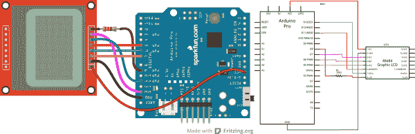](https://cdn.sparkfun.com/assets/4/3/0/8/2/52570af8757b7f550c8b456b.png)

数据引脚的连接方式如下:

| LCD 引脚 | Arduino 引脚 | 笔记 |
| 1 - VCC | 3.3V (VCC) | 仅 3.3V(不是 5V！) |
| 2 - GND | GND |  |
| 3 - SCE | seven | 可以是任何数字引脚。 |
| 4 - RST | six | 可以是任何数字引脚。 |
| 五维数模转换器 | five | 可以是任何数字引脚。 |
| 6 - DN(MOSI) | Eleven | 不能动。 |
| SCLK | Thirteen | 不能动。 |
| 发光二极管 | nine | 可以是任何 PWM 引脚。引脚之间的 330ω电阻。 |

#### 限流电阻器

将电阻与数据信号串联是为 3.3V 线路增加保护的一种廉价而简单的方法。如果你有一个 Arduino Uno(或类似的 5V 'duino)和一些 10kΩ和 1kω电阻，试试这个:

[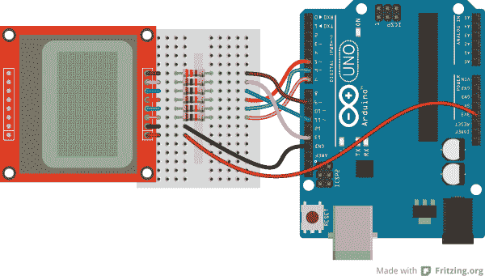](https://cdn.sparkfun.com/assets/3/e/9/5/3/52570cf9757b7fa70c8b4567.png)

引脚连接与上例相同，但每个信号都有一个串联电阻。SCLK、DN、D/C 和 RST 引脚之间有**10kω**电阻。SCE 和引脚 7 之间的**1kω**电阻。330ω电阻仍位于引脚 9 和 LED 引脚之间。

#### 电平转换器

最后，连接的第三种选择是使用实际的电平转换器在 5V 和 3.3V 之间切换。像[双向逻辑电平转换器](https://learn.sparkfun.com/tutorials/bi-directional-logic-level-converter-hookup-guide)和 [TXB0104](https://learn.sparkfun.com/tutorials/txb0104-level-shifter-hookup-guide) 这样的电路板非常适合这种情况。

[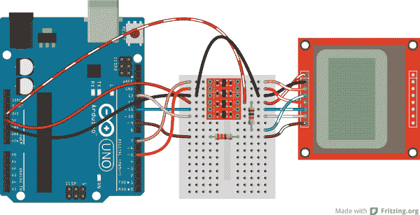](https://cdn.sparkfun.com/assets/6/4/d/c/0/526ec17e757b7f69088b456c.png)

不幸的是，LCD 有五个 3.3V 信号输入，而电平转换器只有四个通道。如果你想保持电路到一个移位器，你可以**永久连接 RST 高**(通过一个 10kΩ电阻)，并通过移位器运行其他信号。您失去了远程复位功能，但其余的控制仍然存在。

查看这些主板的连接指南，以获得更多在 Arduino 和 LCD 之间转换信号的帮助。

## 示例代码 1: LCD 演示

硬件连接好后，我们就可以上传草图并开始在 LCD 上画画了！

### 素描

**注意:**此示例假设您在桌面上使用的是最新版本的 Arduino IDE。如果这是你第一次使用 Arduino，请回顾我们关于[安装 Arduino IDE 的教程。](https://learn.sparkfun.com/tutorials/installing-arduino-ide)

从 [GitHub 库](https://github.com/sparkfun/GraphicLCD_Nokia_5110)下载、解压、打开草图。

[Nokia 5100 LCD Example Example Sketch (ZIP)](https://github.com/sparkfun/GraphicLCD_Nokia_5110/archive/master.zip)

下面是示例 LCD 控制代码的一个片段。这个小的草图展示了一系列的图形驱动函数、字符绘制工具和其他有用的函数，帮助你开始使用 LCD。您需要将 *LCD_Functions.h* 头文件包含在与下载的草图文件夹相同的目录中。否则，您的代码在上传到 Arduino 时将无法编译。

```
language:c
/* Nokia 5100 LCD Example Code
   Graphics driver and PCD8544 interface code for SparkFun's
   84x48 Graphic LCD.
   https://www.sparkfun.com/products/10168

  by: Jim Lindblom
    adapted from code by Nathan Seidle and mish-mashed with
    code from the ColorLCDShield.
  date: October 10, 2013
  license: Officially, the MIT License. Review the included License.md file
  Unofficially, Beerware. Feel free to use, reuse, and modify this
  code as you see fit. If you find it useful, and we meet someday,
  you can buy me a beer.

  This all-inclusive sketch will show off a series of graphics
  functions, like drawing lines, circles, squares, and text. Then
  it'll go into serial monitor echo mode, where you can type
  text into the serial monitor, and it'll be displayed on the
  LCD.

  This stuff could all be put into a library, but we wanted to
  leave it all in one sketch to keep it as transparent as possible.

  Hardware: (Note most of these pins can be swapped)
    Graphic LCD Pin ---------- Arduino Pin
       1-VCC       ----------------  5V
       2-GND       ----------------  GND
       3-SCE       ----------------  7
       4-RST       ----------------  6
       5-D/C       ----------------  5
       6-DN(MOSI)  ----------------  11
       7-SCLK      ----------------  13
       8-LED       - 330 Ohm res --  9
   The SCLK, DN(MOSI), must remain where they are, but the other 
   pins can be swapped. The LED pin should remain a PWM-capable
   pin. Don't forget to stick a current-limiting resistor in line
   between the LCD's LED pin and Arduino pin 9!
*/
#include <SPI.h>
#include "LCD_Functions.h"

/* This array is the same size as the displayMap. We'll use it
as an example of how to draw a bitmap. xkcd comic transposing
makes for an excellent display application.
For reference, see: http://xkcd.com/149/ */
static const char xkcdSandwich[504] PROGMEM = {
0xFF, 0x8D, 0x9F, 0x13, 0x13, 0xF3, 0x01, 0x01, 0xF9, 0xF9, 0x01, 0x81, 0xF9, 0xF9, 0x01, 0xF1,
0xF9, 0x09, 0x09, 0xFF, 0xFF, 0xF1, 0xF9, 0x09, 0x09, 0xF9, 0xF1, 0x01, 0x01, 0x01, 0x01, 0x01,
0xF9, 0xF9, 0x09, 0xF9, 0x09, 0xF9, 0xF1, 0x01, 0xC1, 0xE9, 0x29, 0x29, 0xF9, 0xF1, 0x01, 0xFF,
0xFF, 0x71, 0xD9, 0x01, 0x01, 0xF1, 0xF9, 0x29, 0x29, 0xB9, 0xB1, 0x01, 0x01, 0x01, 0xF1, 0xF1,
0x11, 0xF1, 0xF1, 0xF1, 0xE1, 0x01, 0xE1, 0xF1, 0x51, 0x51, 0x71, 0x61, 0x01, 0x01, 0xC1, 0xF1,
0x31, 0x31, 0xF1, 0xFF, 0xFF, 0x00, 0x01, 0x01, 0x01, 0x01, 0x60, 0xE0, 0xA0, 0x01, 0x01, 0x81,
0xE1, 0x61, 0x60, 0xC0, 0x01, 0xE1, 0xE1, 0x21, 0x21, 0xE0, 0xC1, 0x01, 0xC1, 0xE1, 0x20, 0x20,
0xFC, 0xFC, 0xE0, 0xE0, 0xC1, 0xE1, 0xE0, 0xC1, 0xE0, 0xE1, 0x01, 0xFC, 0xFC, 0x21, 0x21, 0xE1,
0xC1, 0xE5, 0xE4, 0x01, 0xC1, 0xE0, 0x20, 0x21, 0x20, 0x00, 0x01, 0xFD, 0xFD, 0x21, 0x20, 0xE0,
0x00, 0x00, 0x01, 0x01, 0xC0, 0x61, 0x31, 0x31, 0x21, 0x20, 0xC0, 0x81, 0x01, 0x01, 0x01, 0x00,
0x00, 0x00, 0x00, 0x01, 0x01, 0x01, 0x01, 0xFF, 0xFF, 0x00, 0x00, 0x00, 0x00, 0x01, 0x03, 0x02,
0x03, 0x01, 0x00, 0x01, 0x03, 0xF2, 0x1A, 0x0B, 0x08, 0x0B, 0x1B, 0x10, 0x60, 0xE3, 0x03, 0x00,
0x01, 0x03, 0x02, 0x02, 0x03, 0x03, 0x00, 0x03, 0x03, 0x00, 0x00, 0x03, 0x03, 0x00, 0x00, 0x03,
0x03, 0x00, 0x00, 0x03, 0x03, 0x03, 0x03, 0x00, 0x01, 0x03, 0x02, 0x02, 0x03, 0x01, 0x00, 0x03,
0x03, 0x00, 0x00, 0x03, 0x00, 0x00, 0x00, 0x3E, 0x63, 0x80, 0x80, 0x80, 0x80, 0x60, 0x3F, 0x07,
0x00, 0x00, 0x00, 0x00, 0x00, 0x00, 0x00, 0x00, 0x00, 0x00, 0x00, 0xFF, 0xFF, 0x00, 0x00, 0x00,
0x00, 0x00, 0x00, 0x00, 0xFE, 0x01, 0x01, 0x01, 0x02, 0x03, 0x3E, 0xE8, 0xF8, 0xF0, 0xD0, 0x90,
0x18, 0x0F, 0x00, 0x00, 0x00, 0x00, 0x00, 0x00, 0x00, 0x00, 0x00, 0x00, 0x00, 0x00, 0x00, 0x00,
0x00, 0x00, 0x00, 0x00, 0x00, 0x00, 0x00, 0x00, 0x00, 0x00, 0x00, 0x00, 0x00, 0x00, 0x00, 0x00,
0x00, 0x00, 0x00, 0x00, 0x00, 0x00, 0x00, 0x00, 0x00, 0x00, 0x00, 0x00, 0x00, 0xC0, 0x38, 0xFF,
0x0C, 0x38, 0xE0, 0x80, 0x00, 0x00, 0x00, 0x00, 0x00, 0x00, 0x00, 0x00, 0x00, 0x00, 0x00, 0xFF,
0xFF, 0x00, 0x00, 0x00, 0x00, 0x00, 0x00, 0x00, 0x1F, 0xF0, 0x00, 0x00, 0x00, 0x00, 0x00, 0x33,
0x5F, 0x8F, 0x84, 0x05, 0x07, 0x06, 0x0C, 0x0E, 0x0E, 0x0C, 0x14, 0x34, 0x68, 0x88, 0xD8, 0x70,
0x00, 0x00, 0x00, 0x00, 0x00, 0xE0, 0x10, 0x10, 0x10, 0xF0, 0xE0, 0x00, 0xF0, 0xF0, 0x00, 0x80,
0x80, 0x00, 0x00, 0x80, 0x80, 0x80, 0x80, 0x00, 0x80, 0x80, 0x00, 0x80, 0x00, 0x00, 0x20, 0x38,
0x0E, 0x01, 0xC0, 0x3F, 0xE0, 0x00, 0x00, 0x03, 0x0E, 0x08, 0x00, 0x00, 0x00, 0x00, 0x00, 0x00,
0x00, 0x00, 0x00, 0xFF, 0xFF, 0x80, 0x80, 0x80, 0x80, 0x80, 0x80, 0x80, 0xB6, 0xED, 0xC0, 0xC0,
0xC0, 0xE0, 0xA0, 0xA0, 0xA0, 0xA0, 0xA1, 0xA1, 0xA1, 0xA1, 0xA1, 0xA1, 0xA1, 0xE1, 0xE1, 0xC1,
0xEF, 0xBB, 0x83, 0x86, 0x88, 0xB0, 0x80, 0x80, 0x80, 0x8F, 0x90, 0x90, 0x90, 0x9F, 0x8F, 0x80,
0x9F, 0x9F, 0x87, 0x8D, 0x98, 0x80, 0x8C, 0x9E, 0x92, 0x92, 0x9F, 0xC0, 0xC7, 0xFF, 0xB8, 0x8F,
0x80, 0x90, 0x90, 0xC0, 0xF0, 0x8E, 0x81, 0x80, 0x81, 0x8F, 0xB8, 0xE0, 0x80, 0x80, 0x80, 0x80,
0x80, 0x80, 0x80, 0x80, 0x80, 0x80, 0x80, 0xFF, 
};

void setup()
{
  Serial.begin(9600);

  lcdBegin(); // This will setup our pins, and initialize the LCD
  updateDisplay(); // with displayMap untouched, SFE logo
  setContrast(40); // Good values range from 40-60
  delay(2000);

  lcdFunTime(); // Runs a 30-second demo of graphics functions

  // Wait for serial to come in, then clear display and go to echo
  while (!Serial.available())
    ;
  clearDisplay(WHITE);
  updateDisplay();
}

// Loop turns the display into a local serial monitor echo.
// Type to the Arduino from the serial monitor, and it'll echo
// what you type on the display. Type ~ to clear the display.
void loop()
{
  static int cursorX = 0;
  static int cursorY = 0;

  if (Serial.available())
  {
    char c = Serial.read();

    switch (c)
    {
    case '\n': // New line
      cursorY += 8;
      break;
    case '\r': // Return feed
      cursorX = 0;
      break;
    case '~': // Use ~ to clear the screen.
      clearDisplay(WHITE);
      updateDisplay();
      cursorX = 0; // reset the cursor
      cursorY = 0;
      break;
    default:
      setChar(c, cursorX, cursorY, BLACK);
      updateDisplay();
      cursorX += 6; // Increment cursor
      break;
    }
    // Manage cursor
    if (cursorX >= (LCD_WIDTH - 4)) 
    { // If the next char will be off screen...
      cursorX = 0; // ... reset x to 0...
      cursorY += 8; // ...and increment to next line.
      if (cursorY >= (LCD_HEIGHT - 7))
      { // If the next line takes us off screen...
        cursorY = 0; // ...go back to the top.
      }
    }
  }
}

/* This function serves as a fun demo of the graphics driver
functions below. */
void lcdFunTime()
{
  clearDisplay(WHITE); // Begin by clearing the display
  randomSeed(analogRead(A0));

  /* setPixel Example */
  const int pixelCount = 100;
  for (int i=0; i<pixelCount; i++)
  {
    // setPixel takes 2 to 3 parameters. The first two params
    // are x and y variables. The third optional variable is
    // a "color" boolean. 1 for black, 0 for white.
    // setPixel() with two variables will set the pixel with
    // the color set to black.
    // clearPixel() will call setPixel with with color set to
    // white.
    setPixel(random(0, LCD_WIDTH), random(0, LCD_HEIGHT));
    // After drawing something, we must call updateDisplay()
    // to actually make the display draw something new.
    updateDisplay();
    delay(10);
  }
  setStr("full of stars", 0, LCD_HEIGHT-8, BLACK);
  updateDisplay();
  delay(1000);
  // Seizure time!!! Err...demoing invertDisplay()
  for (int i=0; i<5; i++)
  {
    invertDisplay(); // This will swap all bits in our display
    delay(200);
    invertDisplay(); // This will get us back to where we started
    delay(200);
  }
  delay(2000);

  /* setLine Example */
  clearDisplay(WHITE); // Start fresh
  int x0 = LCD_WIDTH/2;
  int y0 = LCD_HEIGHT/2;
  for (float i=0; i<2*PI; i+=PI/8)
  {
    // Time to whip out some maths:
    const int lineLength = 24;
    int x1 = x0 + lineLength * sin(i);
    int y1 = y0 + lineLength * cos(i);

    // setLine(x0, y0, x1, y1, bw) takes five variables. The
    // first four are coordinates for the start and end of the 
    // line. The last variable is the color (1=black, 0=white).
    setLine(x0, y0, x1, y1, BLACK);
    updateDisplay();
    delay(100);
  }
  // Demo some backlight tuning
  for (int j=0; j<2; j++)
  {
    for (int i=255; i>=0; i-=5)
    {
      analogWrite(blPin, i); // blPin is ocnnected to BL LED
      delay(20);
    }
    for (int i=0; i<256; i+=5)
    {
      analogWrite(blPin, i);
      delay(20);
    }
  }

  /* setRect Example */
  clearDisplay(WHITE); // Start fresh

  // setRect takes six parameters (x0, y0, x1, y0, fill, bw)
  // x0, y0, x1, and y0 are the two diagonal corner coordinates
  // fill is a boolean, which determines if the rectangle is
  // filled in. bw determines the color 0=white, 1=black.
  for (int x=0; x<LCD_WIDTH; x+=8)
  { // Swipe right black
    setRect(0, 0, x, LCD_HEIGHT, 1, BLACK);
    updateDisplay();
    delay(10);
  }
  for (int x=0; x<LCD_WIDTH; x+=8)
  { // Swipe right white
    setRect(0, 0, x, LCD_HEIGHT, 1, WHITE);
    updateDisplay();
    delay(10);
  }
  for (int x=0; x<12; x++)
  { // Shutter swipe
    setRect(0, 0, x, LCD_HEIGHT, 1, 1);
    setRect(11, 0, x+12, LCD_HEIGHT, 1, BLACK);
    setRect(23, 0, x+24, LCD_HEIGHT, 1, BLACK);
    setRect(35, 0, x+36, LCD_HEIGHT, 1, BLACK);
    setRect(47, 0, x+48, LCD_HEIGHT, 1, BLACK);
    setRect(59, 0, x+60, LCD_HEIGHT, 1, BLACK);
    setRect(71, 0, x+72, LCD_HEIGHT, 1, BLACK);
    updateDisplay();
    delay(10);
  }
  // 3 Dee!
  setRect(25, 10, 45, 30, 0, WHITE);
  setRect(35, 20, 55, 40, 0, WHITE);
  setLine(25, 10, 35, 20, WHITE);
  setLine(45, 30, 55, 40, WHITE);
  setLine(25, 30, 35, 40, WHITE);
  setLine(45, 10, 55, 20, WHITE);
  updateDisplay();
  delay(2000);

  /* setCircle Example */
  clearDisplay(WHITE);
  // setCircle takes 5 parameters -- x0, y0, radius, bw, and
  // lineThickness. x0 and y0 are the center coords of the circ.
  // radius is the...radius. bw is the color (0=white, 1=black)
  // lineThickness is the line width of the circle, 1 = smallest
  // thickness moves in towards center.
  for (int i=0; i<20; i++)
  {
    int x = random(0, LCD_WIDTH);
    int y = random(0, LCD_HEIGHT);

    setCircle(x, y, i, BLACK, 1);
    updateDisplay();
    delay(100);
  }
  delay(2000);

  /* setChar & setStr Example */
  // setStr takes 4 parameters: an array of characters to print,
  // x and y coordinates for the top-left corner. And a color
  setStr("Modern Art", 0, 10, WHITE);
  updateDisplay();
  delay(2000);

  /* setBitmap Example */
  // setBitmap takes one parameter, an array of the same size
  // as our screen.
  setBitmap(xkcdSandwich);
  updateDisplay();
} 
```

要帮助理解草图，请查看代码中的注释。大多数动作发生在`lcdFunTime()`函数中。

**Heads up!** If the display is not showing pixels even with the correct logic levels and example code, it may just have slight variances in the way that they were manufactured. You can see the pixels faintly on the screen at an angle or pushing down on the LCD. You will need to try and set the contrast where it says `setContrast(40)` on line 87 to a value of `60`. There is probably some variances in the LCD’s contrast which might explain why certain LCDs have issues displaying defined pixels on the screen.

### 行动中的素描

一旦上传到你的 Arduino，草图将开始运行演示-一组基本的动画和图形功能。首先，我们将在屏幕上画一些随机的**像素**(“到处都是星星……”).然后我们将继续绘制**线**、**矩形**和**圆形**的例子。通篇都有画**字符**和**字符串**的例子。最后，演示以向一部单色漫画[致敬而结束，这部漫画看起来非常适合这个小小的单色 LCD。](http://xkcd.com/)

[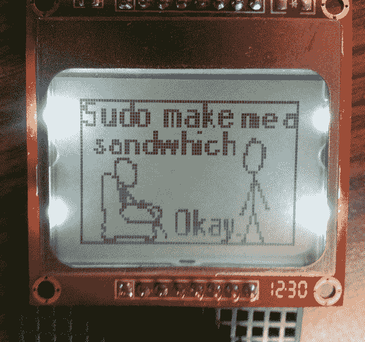](https://cdn.sparkfun.com/assets/4/a/2/8/1/52571475757b7f9b798b4567.png)

这是一个在屏幕上绘制位图的演示，这是我们可以用 duino/LCD 组合完成的更有价值的任务之一。

在演示完成后，草图将进入连续回显模式。打开串行监视器(将波特率设置为 9600 bps)，将东西输入到 Arduino。它应该开始打印你发送到 LCD 上的所有内容。

* * *

如果你对在屏幕上绘制位图的可能性感兴趣，请看下一页！我们将向您展示如何导入您自己的 84x48 位图并将其绘制在屏幕上。

## 示例代码 2:绘制位图

如果上一个演示让您迫不及待地设计自己的 84x48 位图并显示它们，请继续阅读这个示例。我们将向您展示如何缩放和导入位图，然后将它编译到您的 Arduino 代码中，并将其发送到 LCD，这样您就可以拥有自己的傻傻的图形。

[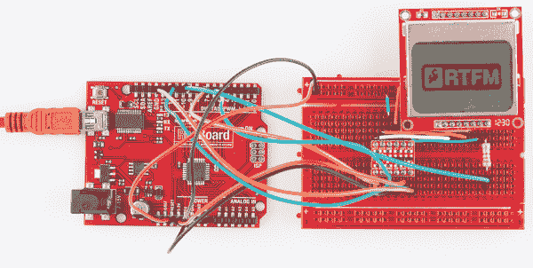](https://cdn.sparkfun.com/assets/e/8/7/8/b/527185d2757b7ff8748b4567.png)

### 查找/制作/修改位图

首先，找到您想要打印到 LCD 上的位图图像。84x48 的单色像素不会给你太多的空间，但是你仍然可以在上面找到一些有趣的东西。这里有几个例子:

[](https://cdn.sparkfun.com/assets/f/3/c/e/8/526ed200757b7f5d768b456e.bmp) [](https://cdn.sparkfun.com/assets/a/3/6/3/5/526ed200757b7f41708b456b.bmp) [](https://cdn.sparkfun.com/assets/2/3/f/2/7/526ed201757b7f73468b4567.bmp) [](https://cdn.sparkfun.com/assets/2/9/1/1/b/526ed200757b7f30658b456a.bmp) [](https://cdn.sparkfun.com/assets/d/f/2/3/d/526ed201757b7f12698b456a.bmp)

在你选择了一幅图像后，你需要对它进行处理，使它变成单色(2 位颜色)和 84×48 像素的 T2(T3)。大多数标准的图像编辑器可以在这方面提供帮助。对于 Windows 用户来说，[画图](http://windows.microsoft.com/en-us/windows7/products/features/paint)就是你缩放图像所需要的一切。然后将其保存为单色位图。

### 将位图转换为数组

下一步是将常规的图像文件转换成一个 504 字节的`char`数组。网络上有很多程序可以帮助完成这项工作。我们推荐[液晶助手](http://en.radzio.dxp.pl/bitmap_converter/)。

要在 LCD 助手中加载图像，请转到*文件* > *加载图像*。图像的预览应该打开，确保它是正确的大小- 84 像素宽，48 像素高。还要确保*字节方向*设置为**垂直**并且*大小字符顺序*设置为**小**。其余的默认设置(8 像素/字节等。)应该已经正确设置:

[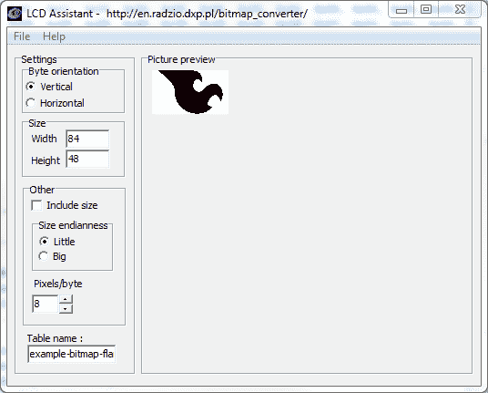](https://cdn.sparkfun.com/assets/7/2/a/4/1/526ecc78757b7fb36b8b456c.png)

然后进入*文件* > *保存输出*生成一个临时文本文件。打开文本文件，看看你闪亮的新数组。您需要将数组的**类型**修改为仅仅是一个`char`(没有`unsigned`或`const`)。还要确保阵列具有正确的命名约定(没有破折号，不要以数字开头，等等)。).

### 导入到素描里画！

创建好数组后，将整个表复制到 Arduino 草图中。使用来自[示例 1](https://learn.sparkfun.com/tutorials/graphic-lcd-hookup-guide/example-code-1-lcd-demo) 的相同草图。将数组粘贴到您喜欢的任何地方。现在，为了测试你的图，用下面的图替换最后一个草图中的`setup()`和`loop()`(确保其余的函数和变量保留在草图中):

```
language:c

// ...LCD definitions, variables, and bitmap array defined above.

void setup()
{
  lcdBegin(); // This will setup our pins, and initialize the LCD
  setContrast(60); // Good values range from 40-60
  setBitmap(flameBitmap); // flameBitmap should be replaced with the name of your BMP array
  updateDisplay();  // Update the display to make the array show up.
}

void loop()
{
}

// LCD control and graphics functions defined below... 
```

有趣的东西！现在你可以覆盖文字，或者在你的位图上画画。您甚至可以尝试导入多个图形来创建动画！

## 资源和更进一步

感谢您查看我们的单色 84 x 48 图形 LCD 连接指南！如果您需要更多资源来启动和运行您的 LCD，这里有一些方便的地方可供您参考:

*   **LCD 和驱动程序资源**
    *   [PCD8544 液晶控制器数据表](http://cdn.sparkfun.com/tutorialimages/GraphicLCDNokia3310/pcd8544.pdf)
    *   LCD 数据表 -不完全是 SparkFun 的 LCD，但非常接近。
    *   GitHub 库 -本教程中使用的诺基亚图形 LCD 的示例代码。
*   **Arduino 库和代码**
    *   PCD8544 Arduino 库-PCD 8544 LCD 驱动程序的可靠 Arduino 库。
    *   [AdaFruit LCD 库](https://github.com/adafruit/Adafruit-PCD8544-Nokia-5110-LCD-library) - Adafruit 有一个*惊人的* Arduino 库来帮助连接这个 LCD。也需要他们的图形库。
*   **位图工具**
    *   [液晶显示器助手](http://en.radzio.dxp.pl/bitmap_converter/)
    *   [位图 2LCD](http://bitmap2lcd.com/)
    *   这是一个为自定义字体创建数组定义的漂亮工具。

### 更进一步

现在你已经控制了你的图形液晶显示器，你可以把它嵌入到各种各样的酷项目中。如果你需要一些灵感，这里有一些相关的教程可以帮助你:

*   [有机发光二极管显示连接指南](https://learn.sparkfun.com/tutorials/oled-display-hookup-guide) -虽然不完全是液晶显示器，这款有机发光二极管为你的项目提供了一个漂亮、清晰的文本显示。
*   [MP3 播放器保护音乐盒](https://learn.sparkfun.com/tutorials/mp3-player-shield-music-box) -这款 MP3 播放器音乐盒可以通过甜美的图形显示得到很好的服务。嗯（表示踌躇等）...
*   [ITG-3200 连接指南](https://learn.sparkfun.com/tutorials/itg-3200-hookup-guide)-ITG-3200 是一款全功能三轴陀螺仪传感器。这个显示器可以用来制作一个可视的角速度计。****