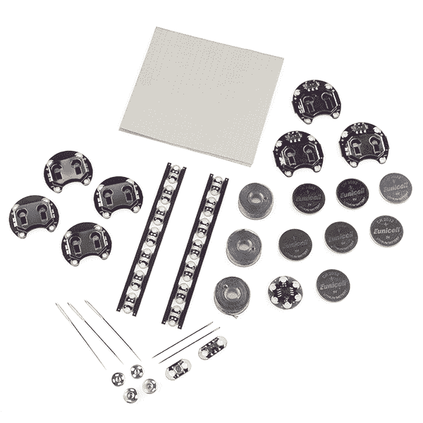

# 介绍 LilyPad 设计套件！

> 原文：<https://learn.sparkfun.com/tutorials/introducing-the-lilypad-design-kit>

## 开始使用您的 LDK

祝贺您获得 LilyPad 设计套件！

LDK 经过精心设计，帮助您跨越电子纺织品入门的障碍。如果你不知道如何缝纫，当你完成这 6 个实验时，你应该有一个坚实的基础。如果你对电子学一无所知，我们会让你立刻构建微控制器电路！也不知道？系好安全带，让我们开始吧！

该工具包分为六个实验，所以你将在六个简单的步骤中学习，有很多链接来解释缝纫和电子术语和基本概念。这很容易分成一口大小的课程，或者你可以通过整个事情的权利！

*   [LDK 实验一:点亮一个基本电路](https://learn.sparkfun.com/tutorials/ldk-experiment-1-lighting-up-a-basic-circuit)
*   [LDK 实验二:多个 LED 电路](https://learn.sparkfun.com/tutorials/ldk-experiment-2-multiple-led-circuits)
*   [LDK 实验三:按钮和开关](https://learn.sparkfun.com/tutorials/ldk-experiment-3-buttons-and-switches)
*   [LDK 实验四:自己做按钮](https://learn.sparkfun.com/tutorials/ldk-experiment-4-make-your-own-button)
*   [LDK 实验 5:制作自己的开关](https://learn.sparkfun.com/tutorials/ldk-experiment-5-make-your-own-switch)
*   [LDK 实验六:微控制器电路](https://learn.sparkfun.com/tutorials/ldk-experiment-6-microcontroller-circuits)

电路单独显示，没有任何项目模糊电路或限制你的创造力，但每个电路显示有无限的潜力，有趣的项目！如果你把你的电路放入一个很酷的项目或可穿戴设备中，拍张照片发过来吧！我们将更新本页，展示使用您正在学习的器件和电路的启发性项目照片。