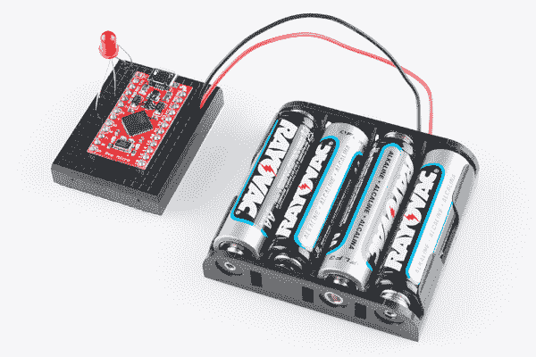
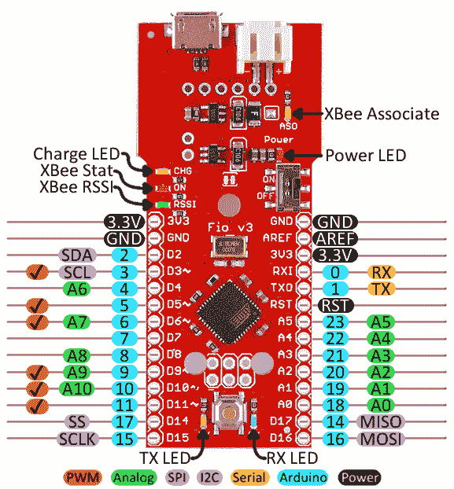
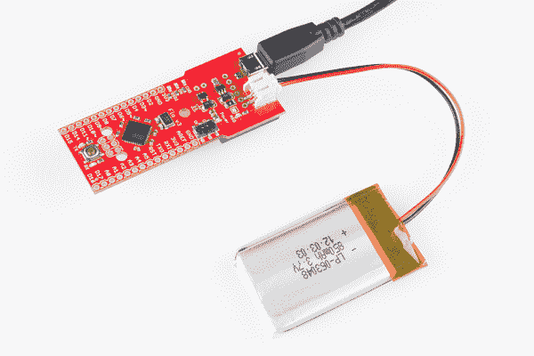
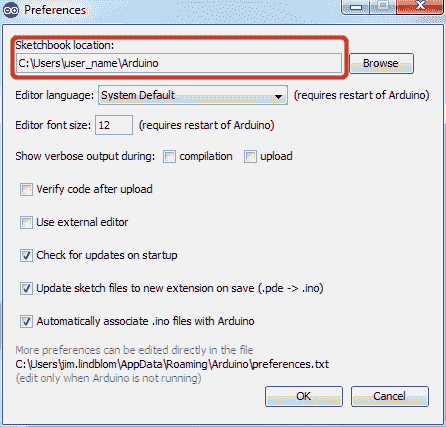
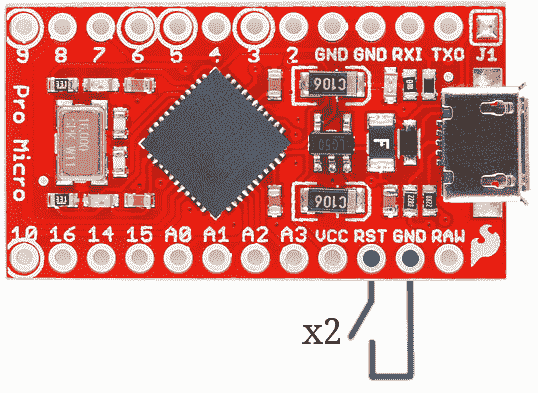

# Pro Micro 和 Fio V3 连接指南

> 原文：<https://learn.sparkfun.com/tutorials/pro-micro--fio-v3-hookup-guide>

## 介绍

**Heads up!** This is for the **Pro Micro (ATmega32U4) 5V and 3.3V** versions. If you are looking for information about hardware on the *Qwiic Pro Micro with the USB-C connector*, make sure to check out the newer [Qwiic Pro Micro USB-C (ATmega32U4) Hookup Guide](https://learn.sparkfun.com/tutorials/qwiic-pro-micro-usb-c-atmega32u4-hookup-guide).

欢迎来到 Arduino 兼容板的新领域，这是由 ATmega32U4 实现的。你的 Arduino 不再需要被 FTDI 电缆、ATmega8U2 或任何芯片控制，这些芯片的唯一目的是充当你的 Arduino 和你的电脑之间的中介。

### Pro Micro

spark fun Pro Micro[[3.3V/8 MHz](https://www.sparkfun.com/products/12587)和 [5V/16MHz](https://www.sparkfun.com/products/12640) 是一款非常酷的小型开发板。这是一个兼容 Arduino 的微型微控制器，它在一个芯片上实现了老 [Arduino Unos](https://www.sparkfun.com/products/11021) 、 [Duemilanoves](https://www.sparkfun.com/products/retired/666) 和 Diecimeillas 做梦也想不到的功能:真正的 USB 功能。

[](https://www.sparkfun.com/products/12587) 

将**添加到您的[购物车](https://www.sparkfun.com/cart)中！**

### [Pro 微- 3.3V/8MHz](https://www.sparkfun.com/products/12587)

[Out of stock](https://learn.sparkfun.com/static/bubbles/ "out of stock") DEV-12587

在 SparkFun，我们拒绝放弃“足够好”。这就是我们增加 Arduino 兼容微控制器产品线的原因…

$19.5021[Favorited Favorite](# "Add to favorites") 39[Wish List](# "Add to wish list")****[](https://www.sparkfun.com/products/12640) 

将**添加到您的[购物车](https://www.sparkfun.com/cart)中！**

### [Pro 微 5V/16MHz](https://www.sparkfun.com/products/12640)

[Out of stock](https://learn.sparkfun.com/static/bubbles/ "out of stock") DEV-12640

在 SparkFun，我们拒绝放弃“足够好”。这就是我们增加 Arduino 兼容微控制器产品线的原因…

$19.5080[Favorited Favorite](# "Add to favorites") 87[Wish List](# "Add to wish list")**** ****### FioV3

本教程还涵盖了 [Fio v3](https://www.sparkfun.com/products/11520) ，它的工作方式很像 Pro Micro，但增加了一些功能，如轻松的 XBee 接口和 LiPo 充电。

[](https://www.sparkfun.com/products/11520) 

将**添加到您的[购物车](https://www.sparkfun.com/cart)中！**

### [Fio v3 - ATmega32U4](https://www.sparkfun.com/products/11520)

[34 available](https://learn.sparkfun.com/static/bubbles/ "34 available") DEV-11520

Fio v3 是由 ATmega32U4 驱动的 Arduino Fio 硬件的新版本。它不仅体积小，易于吸脂，而且是一款…

$36.95 $14.787[Favorited Favorite](# "Add to favorites") 13[Wish List](# "Add to wish list")** **### 本教程涵盖的内容

本教程旨在向您介绍 Pro Micro(和 Fio v3)的硬件和固件。我们还将专门用几页来帮助在 Windows 和 Mac 上安装主板。以下是将涵盖内容的摘要:

*   [硬件概述:Pro Micro](https://learn.sparkfun.com/tutorials/pro-micro--fio-v3-hookup-guide/hardware-overview-pro-micro)-Pro Micro 的引脚排列和硬件特性概述。
*   [硬件概述:Fio v3](https://learn.sparkfun.com/tutorials/pro-micro--fio-v3-hookup-guide/hardware-overview-fio-v3)-Fio v3 引脚排列和硬件特性概述。
*   [在 Windows 上安装](https://learn.sparkfun.com/tutorials/pro-micro--fio-v3-hookup-guide/installing-windows) -如何在 Windows 上安装驱动程序和 Arduino 插件。
*   [在 Mac/Linux 上安装](https://learn.sparkfun.com/tutorials/pro-micro--fio-v3-hookup-guide/installing-mac--linux) -如何在 Mac 上安装驱动程序和 Arduino 插件。
*   [示例 1: Blinkies](https://learn.sparkfun.com/tutorials/pro-micro--fio-v3-hookup-guide/example-1-blinkies) -一个简单的“Hello，world”草图，特别适合 Pro Micro 和 Fio v3。
*   [示例 2: HID 鼠标和键盘](https://learn.sparkfun.com/tutorials/pro-micro--fio-v3-hookup-guide/example-2-hid-mouse-and-keyboard) -介绍 Pro Micro 的 HID USB 功能。如何仿真 USB 键盘和鼠标！
*   [故障排除和常见问题解答](https://learn.sparkfun.com/tutorials/pro-micro--fio-v3-hookup-guide/troubleshooting-and-faq) -有助于充分利用 Pro Micro 的故障排除提示和技巧。

### 推荐阅读

在深入本教程之前，这里有一些您应该熟悉的概念。如果你不是，考虑先看看相关的教程。

*   [Arduino 是什么？](https://learn.sparkfun.com/tutorials/what-is-an-arduino)-Arduino 平台和 IDE 介绍。
*   [如何安装 Arduino](https://learn.sparkfun.com/tutorials/installing-arduino-ide)-Arduino 通用安装指南。
*   串行通信 -串行是一个伟大的、易于使用的通信协议。

[](https://learn.sparkfun.com/tutorials/serial-communication) [### 串行通信](https://learn.sparkfun.com/tutorials/serial-communication) Asynchronous serial communication concepts: packets, signal levels, baud rates, UARTs and more 100[](https://learn.sparkfun.com/tutorials/what-is-an-arduino) [### 什么是 Arduino？](https://learn.sparkfun.com/tutorials/what-is-an-arduino) What is this 'Arduino' thing anyway? This tutorials dives into what an Arduino is and along with Arduino projects and widgets.[Favorited Favorite](# "Add to favorites") 50[](https://learn.sparkfun.com/tutorials/installing-arduino-ide) [### 安装 Arduino IDE](https://learn.sparkfun.com/tutorials/installing-arduino-ide) A step-by-step guide to installing and testing the Arduino software on Windows, Mac, and Linux.[Favorited Favorite](# "Add to favorites") 16

## 硬件概述:Pro Micro

在我们开始安装和使用 Pro Micro 之前，让我们快速看一下电路板——检查它的输入、输出和其他硬件特性。

### 引脚排列

Pro Micro 的所有 I/O 和电源引脚都被分成两个平行的接头。一些引脚用于电源输入或输出，其他引脚是专用的 I/O 引脚。此外，I/O 引脚可以具有特殊功能，如模拟输入。这是一张地图，显示了哪个引脚在哪里，以及它可能具有哪些特殊的硬件功能:

[](https://cdn.sparkfun.com/assets/9/c/3/c/4/523a1765757b7f5c6e8b4567.png)

深入研究一下哪些引脚有什么作用...

#### 电源引脚

有各种各样的权力和权力相关的网络爆发出来:

*   **RAW** 是 Pro Micro 的未调节电压输入。如果电路板通过 USB 供电，此引脚的电压约为 4.8V (USB 的 5V 减去肖特基二极管压降)。另一方面，如果电路板由外部供电，则通过此引脚施加的电压最高可达 12V。
*   **VCC** 是提供给车载 ATmega32U4 的电压。这个电压将取决于你使用的是 [3.3V/8MHz Pro Micro](https://www.sparkfun.com/products/10999) 还是 [5V/16MHz](https://www.sparkfun.com/products/11098) 版本，它将分别是 3.3V 或 5V。该电压由施加在原始引脚上的电压**调节**。如果电路板通过“RAW”引脚(或 USB)供电，此引脚可用作**输出**为其他器件供电。
*   **RST** 可用于**重启**Pro 微。此引脚被一个 10k &欧姆拉高；电路板上的电阻器，并且是**低电平有效**，因此它必须连接到地以启动复位。Pro Micro 将保持“关闭”,直到 reset 线被拉回到高电平。
*   **GND** 当然是系统的公共地电压(0V 基准电压)。

#### I/O 引脚

Pro Micro 的 I/O 引脚共有 18 个，具有多种功能。每个引脚都可以用作**数字输入或输出**，用于闪烁 led 或读取按钮按压。Arduino IDE 通过 0 到 21 之间的整数值引用这些引脚。(A0-A3 引脚可以使用其模拟或数字引脚编号进行数字参考)。

九个引脚以[模数转换器(ADC)](https://learn.sparkfun.com/tutorials/analog-to-digital-conversion)为特色，可用作**模拟输入**。这些对于使用`analogRead([pin])`功能读取电位计或其他模拟设备非常有用。

有五个引脚具有[脉冲宽度调制(PWM)](https://learn.sparkfun.com/tutorials/pulse-width-modulation) 功能，这允许使用`analogWrite([pin], [value])`功能的**模拟输出**的形式。这些引脚在板上用一个模糊的白色圆圈表示。

还有硬件 [UART(串行)](https://learn.sparkfun.com/tutorials/serial-communication)、 [I ² C](https://learn.sparkfun.com/tutorials/i2c) 和 [SPI](https://learn.sparkfun.com/tutorials/serial-peripheral-interface-spi) 引脚可用。这些器件可用于与数字器件接口，如串行 LCD、XBees、IMU 和其它串行传感器。

Pro Micro 有五个[外部中断](http://arduino.cc/en/Reference/attachInterrupt)，允许您在引脚变高或变低(或同时变高和变低)时立即触发一个功能。如果将一个中断附加到一个使能中断的引脚，需要知道该引脚触发的具体中断:引脚 3 映射到中断 0 (INT0)，引脚 2 是中断 1 (INT1)，引脚 0 是中断 2 (INT2)，引脚 1 是中断 3 (INT3)，引脚 7 是中断 4 (INT6)。

#### 板载 led

Pro Micro 上有三个 led。一个红色 LED 指示**电源**是否存在。

另外两个 led 有助于指示数据何时通过 USB 传输。黄色 LED 表示 USB 数据进入 Pro Micro 的 (RX ),绿色 LED 表示 USB 数据输出(TX)。

### 3.3V 还是 5V？8MHz 还是 16MHz？

Pro Micros 有两种口味，根据系统**电压**和工作**频率**而不同。标准的 5V Pro Micro 运行速度为 16MHz，与 [Arduino Leonardo](https://www.sparkfun.com/products/11286) 非常接近，而 3.3V 版本的 Pro Micro 运行速度只有一半(以保持在较低电压下的安全工作区)- 8MHz。

Pro Micro 的工作电压决定了任何 I/O 引脚上的最大允许电压。例如，如果你有一个 3.3V 的 Pro Micro，不要将其与输出 5V 的东西接口。

[](https://cdn.sparkfun.com/assets/8/3/e/6/a/523a1b43757b7f55788b4567.png)

别忘了你有哪个版本！当我们在 Arduino 中上传代码时，我们需要区分这两者。如果你不确定你用的是哪一个版本，检查一下电路板的背面。应选中两个框中的一个，以指示工作电压。

### 电路板尺寸

Pro Micro 为 1.30“x 0.70”。请注意，USB 连接器增加了电路板的长度，因此总长度约为 1.37 英寸。

[](https://cdn.sparkfun.com/assets/learn_tutorials/1/2/1/SparkFun_Pro_Micro_Board_Dimensions.png)

### 如何为 Pro Micro 供电

由于 Pro Micro 的主要特点是其固有的 USB 功能，最常见的供电方式是通过 **USB** 。在这种设置中，5V Pro Micro 将直接由 USB 总线供电，3.3V Pro Micro 将调节来自 USB down 的 5V 电源。USB 电缆的另一端可以连接到计算机、USB 集线器或 [USB 墙壁适配器](https://www.sparkfun.com/products/11456)，这可以(在大多数情况下)提供更多的电力。

或者，如果你的 Pro Micro 生活在野外，USB 电缆够不着，它可以通过' **RAW** 或' **VCC** '引脚供电。进入**‘RAW’**引脚的电源将被**调节**至正确的工作电压(5V 或 3.3V)。为了安全起见，它不应高于 12V，并且应至少比 Pro Micro 的工作电压高 1V(例如，>5V Pro Micro 为 6V)。

[](https://cdn.sparkfun.com/assets/f/6/a/2/0/524f02de757b7f20648b4567.png)*Pro Micro powered through the RAW pin by a set of four, series AA batteries.*

如果你通过**‘VCC’**引脚给 Pro Micro 供电，记住这个信号是**未调节的**。只有在有干净的稳压 3.3V 或 5V 电源连接的情况下，才能使用此电源。

确切地说，你如何[为你的项目](https://learn.sparkfun.com/tutorials/how-to-power-a-project)提供动力取决于你和你项目的需求。如果你正在制作电池供电的东西，你可能会选择 3.3V 的 Pro Micro，它可以由一个 [LiPo 电池](https://learn.sparkfun.com/tutorials/battery-technologies/lithium-polymer)或几个[碱性电池](https://learn.sparkfun.com/tutorials/battery-technologies/alkaline)供电。请务必查看以下教程以获取更多信息。

[](https://learn.sparkfun.com/tutorials/battery-technologies) [### 电池技术

#### 2013 年 2 月 6 日](https://learn.sparkfun.com/tutorials/battery-technologies) The basics behind the batteries used in portable electronic devices: LiPo, NiMH, coin cells, and alkaline.[Favorited Favorite](# "Add to favorites") 50[](https://learn.sparkfun.com/tutorials/how-to-power-a-project) [### 如何为项目提供动力

#### 2013 年 2 月 7 日](https://learn.sparkfun.com/tutorials/how-to-power-a-project) A tutorial to help figure out the power requirements of your project.[Favorited Favorite](# "Add to favorites") 67

## 硬件概述:Fio v3

在这一页，我们将检查 [Fio v3](https://www.sparkfun.com/products/11520) 的硬件部分，查看引脚排列、布局和电路板原理图。

Fio v3 就像一个加长的 Pro Micro。在一端，它的形状和引脚类似于它的 ATmega32U4 兄弟。Fio v3 的另一端是它的独特之处:底部有一个 [XBee](https://www.sparkfun.com/categories/111) 的足迹，顶部有一个 LiPo 充电电路。

### 引脚排列

Fio v3 的所有引脚都连接到电路板的任意一侧。一些引脚用于电源输入或输出，其他引脚是专用的 I/O 引脚。此外，I/O 引脚可以具有特殊功能，如模拟输入或串行输入/输出。这是一张地图，显示了哪个引脚在哪里，以及它可能具有哪些特殊功能:

[](https://cdn.sparkfun.com/assets/5/0/f/c/a/52409152757b7f7b188b4569.png)**Heads up!** The pins labeled in the image are correct. However, the labels printed with the silkscreen on the physical board are incorrect. "D17" labeled on the board is Arduino pin 14/MISO. "D14" labeled on the board is Arduino pin 17/SS/ RXLED.

#### 电源引脚

标有“ **3.3V** 的引脚断开 ATmega32U4 的工作电压源。只要板通过白色 JST 连接器或 USB 供电，该电压就被**调节**到 3.3V。这些引脚可以用作**输出**以向其他设备提供 3.3V。

“ **RST** 引脚可用于**重启**Fio。该引脚由电路板上的 10kΩ电阻拉高，并且为**低电平有效**，因此必须接地才能启动复位。Fio 将保持关闭，直到复位线被拉回到高电平。

#### I/O 引脚

许多 Fio 的 I/O 引脚是多才多艺的。每个引脚都可以用作**数字输入或输出**，用于闪烁 led 或读取按钮按压。这些引脚在 Arduino IDE 中通过 0 到 23 之间的整数值引用。(A0-A10 引脚可以通过其模拟引脚号或数字引脚号进行数字参考)。

11 个引脚以[模数转换器(ADC)](https://learn.sparkfun.com/tutorials/analog-to-digital-conversion)为特色，可用作**模拟输入**。这些对于使用`analogRead([pin])`功能读取电位计或其他模拟设备非常有用。

有六个引脚具有[脉冲宽度调制(PWM)](https://learn.sparkfun.com/tutorials/pulse-width-modulation) 功能，允许使用`analogWrite([pin], [value])`功能的**模拟输出**形式。这些引脚在板上显示，引脚周围有一个模糊的白色圆圈。

还有硬件 [UART(串行)](https://learn.sparkfun.com/tutorials/serial-communication)、 [I ² C](https://learn.sparkfun.com/tutorials/i2c) 、 [SPI](https://learn.sparkfun.com/tutorials/serial-peripheral-interface-spi) 引脚可用。这些器件可以用来与串行 LCD、IMU 和其它串行传感器等数字器件接口。

Fio v3 有五个[外部中断](http://arduino.cc/en/Reference/attachInterrupt)，允许您在引脚变为高电平或低电平(或同时变为高电平和低电平)时立即触发功能。如果将一个中断附加到一个使能中断的引脚，需要知道该引脚触发的具体中断:引脚 3 映射到中断 0 (INT0)，引脚 2 是中断 1 (INT1)，引脚 0 是中断 2 (INT2)，引脚 1 是中断 3 (INT3)，引脚 7 是中断 4 (INT6)。

#### 板载 led

Fio 上有各种 led，其中最简单的是红色的**电源**指示灯。底部标有 RX 和 TX - help 的两个 led 指示数据何时通过 USB 传输到 Fio 或从 Fio 传输。蓝色 LED 表示 USB 数据进入 Pro Micro 的(‘RX’)，黄色 LED 表示 USB 数据输出(“TX”)。

XBee 接口上有三个指示灯:stat、RSSI 和 associate。上标有**的红色 LED 连接到 XBee 的引脚 13 - DIO9，该引脚默认设置为指示 XBee 模块的开/关状态。一个“**”LED 连接到 XBee 引脚 6 (PWM0)，默认指示 RSSI(接收信号强度)——更亮的 LED 意味着更强的接收信号。最后，‘**ASO**LED 连接 XBee 引脚 15，如果模块关联，该引脚将闪烁。****

 **最后，还有一个标有“ **CHG** 的黄色 LED，它指示连接的锂聚合物电池是否正在充电。如果电池*没有*连接到 Fio，LED 将处于不确定状态，很可能会亮起。

### 如何为 Fio v3 供电

Fio v3 的建议电源是任何**单节锂聚合物(LiPo)电池**。这些电池的标称电压为 3.7V，非常适合为 3.3V 运行的 Fio 供电。LiPos 非常棒，因为它们可以充电，而且仍然可以在一个小空间里储存大量能量。我们的任何带有 JST 终端的[单细胞 LiPos】都可以直接连接到 Fio 的板载 JST 连接器。](https://www.sparkfun.com/search/results?term=lithium+polymer)

作为电池的(固定)替代品，Fio 可以通过 **USB 连接器**直接供电。

#### 使用脂肪充电器

Fio v3 内置了一个 **LiPo 充电管理**电路(基于 [MCP73831](http://cdn.sparkfun.com/datasheets/Components/General%20IC/33244_SPCN.pdf) )，用于处理安全为单节 LiPo 电池充电所需的信号调节。

要使用充电电路，你显然需要一个插入 Fio 的单节锂电池。然后通过 USB 将电路板连接起来，这样充电电路就有一个主电压源为电池充电。

[](https://cdn.sparkfun.com/assets/e/f/8/5/6/524f02de757b7fe4638b4567.png)

“CHG”LED 将指示电池充电的状态。如果开着，电池还在充电。一旦“CHG”指示灯熄灭，电池就充满电了。

充电电路被编程为以 500 毫安对电池充电，因此，为了安全起见，电池的容量应不小于 500 毫安。

### 连接 XBee

**Heads up!** Originally, this tutorial was written to configure an XBee Series 1 to communicate in transparency mode. However, this can apply to the XBee Series 3 module as long as you configure the firmware to the legacy 802.15.4 protocol. For more information, check out the [Exploring XBees and XCTU](https://learn.sparkfun.com/tutorials/exploring-xbees-and-xctu) tutorial.

Fio v3 底部的 XBee-footprint 连接器使其如此独特。该产品旨在提供 Arduino 和 [XBee](https://www.sparkfun.com/categories/111) 之间的简单接口，因为这样一些 XBee 引脚连接到 ATmega32U4。最重要的是，两个设备的[串行接口](https://learn.sparkfun.com/tutorials/serial-communication)都是有线的 XBee 的‘DOUT’引脚连接到 ATmega32U4 的‘RX’，而‘DIN’连接到‘TX’。

[](https://cdn.sparkfun.com/assets/5/1/4/2/1/524f02de757b7f01648b4567.png)

XBee 通过串行接口进行控制和配置。要了解更多关于使用 XBee 的信息，请查看他们的[数据表](https://www.sparkfun.com/datasheets/Wireless/Zigbee/XBee-Datasheet.pdf)和[各种](http://bildr.org/2011/04/arduino-xbee-wireless/) [教程](https://www.sparkfun.com/tutorials/194)，帮助他们开始使用这些非常简单的无线收发器。

## 安装:Windows

在您的计算机和 Arduino 环境中设置 Pro Micro 或 Fio v3 可能会很困难。按照本页提供的指导，逐步完成驱动程序安装和 Arduino 启用过程。

### [Windows 驱动安装](#windows_driver)

**Note:** On a Windows 10 OS, the driver should automatically install. You may not need to download the driver for the Atmega-32U4-based Arduino. If that is the case, you can move to [installing the board add-on](https://learn.sparkfun.com/tutorials/pro-micro--fio-v3-hookup-guide#windows_boardaddon) for the Arduino IDE.

#### 步骤 1:下载驱动程序

在插入您的主板之前，先下载驱动程序。检查 [GitHub 库](https://github.com/sparkfun/Arduino_Boards)中的最新文件。相同的驱动程序文件适用于 Pro Micro 和 Fio v3。Fio 和 Pro Micro 的驱动程序都是为 Windows 用户签名的。您可以使用下面的链接直接下载它们。

[Fio and Pro Micro Drivers](https://github.com/sparkfun/Arduino_Boards/archive/refs/heads/main.zip)

解压缩那个压缩文件，不要忘记你把它的内容放在哪里了。在这个 zip 文件中，您应该可以找到**。inf** 和**。cat** 文件，其中包含 Windows 安装 Pro Micro 的驱动程序所需的所有信息。 *sparkfun.inf* 驱动程序和 *sparkfun.cat* 数字签名目录文件将在**中找到...arduino _ Boards-master/spark fun/AVR/signed _ driver**。

#### 步骤 2:插入 Pro Micro / Fio v3

当您最初将**插入**时，任务栏右下角会弹出一个“正在安装设备驱动软件”的气泡通知。当绿点绕着灰框转了几圈后，你可能会看到一个悲伤的泡泡，就像这样:

[](https://cdn.sparkfun.com/assets/a/c/2/9/0/523a2153757b7f407d8b4571.PNG)

不要害怕！Windows 只是不知道在哪里找到我们的驱动程序。

**Note:** Some users have experienced issues when plugging the Pro Micro into a USB 3.0 port. If you experience issues on USB 3.0 ports, try switching to use a USB 2.0 port.

#### 步骤 3:打开设备管理器

从这里开始，安装驱动程序最直接的方法是通过设备管理器。要进入设备管理器，点击**开始**按钮，然后打开**控制面板**。在控制面板中，点击**系统和维护**，然后打开**设备管理器**。

或者，你可以打开**运行提示符** (Windows 键+R)并输入‘devmgmt . MSC’然后点击 OK。

[](https://cdn.sparkfun.com/assets/3/3/7/7/e/523b1c4f757b7f64208b4567.PNG)

在设备管理器中，展开“其他设备”树，您会发现一个图标上带有黄色警告标志的**“USB IO 板”**。右击“USB IO 板”并选择**更新驱动软件...**。

[](https://cdn.sparkfun.com/assets/b/e/f/1/d/523b1e59757b7f10218b4567.PNG)

这将产生一个“更新驱动软件- USB IO 板”窗口。

#### 步骤 4:查找驱动程序

在弹出的第一个窗口中，点击**‘浏览我的电脑上的驱动软件’**。在下一个窗口中，点击**‘浏览...’**搜索您刚刚下载的驱动程序。它应该是一个名为“Arduino_Boards-master”的文件夹，位于步骤 1 中记录的子目录中。选择“驱动”文件夹后，点击**确定**，然后选择**下一步**。

[](https://cdn.sparkfun.com/assets/3/d/9/4/9/523b286b757b7fed218b4568.PNG)

Windows 将尝试安装驱动程序，但在此之前会抱怨驱动程序未签名。在警告对话框中选择**“仍然安装该驱动程序软件”**是安全的。

看了几次进度条后，你应该会看到一个快乐的“Windows 已经成功更新了你的驱动软件”窗口。“设备管理器”应该在“端口”树下有一个新条目，用于“SparkFun Pro Micro (COM ##)”(或“SparkFun Fio V3 (COM##)”,如果您有这些条目的话)。

[](https://cdn.sparkfun.com/assets/6/4/e/5/5/523b286b757b7f03218b4568.PNG)

记下您的 Pro Micro 分配了哪个 COM 端口。我们很快就会需要它。

### [安装 Arduino 插件](#windows_boardaddon)

我们仍然没有完全准备好 Arduino，但这是最后的挑战。在 Arduino IDE 中使用 ProMicro 之前，您需要安装电路板(。brd)文件，以便 Arduino IDE 知道如何与您的主板通信。

#### 使用纸板管理器

随着 Arduino 1.6.4 的发布，向 Arduino IDE 添加第三方电路板可以通过电路板管理器轻松实现。如果您运行的是旧版本的 Arduino (1.6.3 或更早版本)，我们建议您现在升级。和往常一样，你可以从 [arduino.cc](http://www.arduino.cc/en/Main/Software) 下载 Arduino 的最新版本。

首先，您需要将 Arduino IDE 板管理器指向一个自定义 URL。打开 Arduino，然后进入首选项(**文件** > **首选项**)。然后，将此 URL 粘贴到窗口底部的“其他 Board Manager URLs”文本框中:

```
https://raw.githubusercontent.com/sparkfun/Arduino_Boards/master/IDE_Board_Manager/package_sparkfun_index.json 
```

您可以通过单击窗口图标添加多个 URL，并在每行粘贴一个 URL。

[](https://cdn.sparkfun.com/assets/learn_tutorials/3/6/5/arduino-board-manager-link.png)

单击确定。然后单击工具打开纸板管理器，将鼠标悬停在纸板选择选项卡上，然后单击纸板管理器。

[](https://cdn.sparkfun.com/assets/learn_tutorials/1/2/1/boardManager.png)

在董事会管理器中搜索“sparkfun”。你应该看到 SparkFun AVR 板包出现。单击 install，稍等片刻，所有的。应该已经安装了您需要的 brd 文件，由打印在软件包旁边的蓝色“installed”表示。

[](https://cdn.sparkfun.com/assets/learn_tutorials/1/2/1/SFEAVR.png)

你现在应该能够上传代码到一些兼容 SparkFun Arduino 的产品，包括 Fio 和 Pro Micro。

[](https://cdn.sparkfun.com/assets/learn_tutorials/1/2/1/SFEBoards.png)

#### 安装。手动 brd 文件

如果您使用的是旧版本的 Arduino IDE，并且没有访问板管理器的权限，那么您需要安装。brd 以传统方式归档。

首先， [**下载这个 zip 文件夹**](https://cdn.sparkfun.com/assets/learn_tutorials/1/2/1/SparkFunBoard_Addons_Jan_16.zip) ，并将其内容解压到 Arduino sketchbook 中的**【硬件】目录**。

**Note:** These Arduino addon files only work with **Arduino 1.5** and up. If you're using an earlier version of Arduino, either update (and get some cool new features), or download [the older version of the Addon](https://cdn.sparkfun.com/assets/learn_tutorials/1/2/1/SF32u4_boards-pre-1.6.zip).

你的 Arduino 速写本呢？嗯，默认情况下，它应该是你的**主目录**中的一个“Arduino”文件夹，但要仔细检查，你可以在 Arduino 中进入“文件”>“首选项”并检查“Sketchbook 位置”文本框。完成后，请务必关闭所有 Arduino 窗口。

[](https://cdn.sparkfun.com/assets/9/8/7/9/3/523b2e28757b7f77208b4567.png)

一旦你把这个文件夹解压到 Arduino sketchbook 的“hardware”文件夹中(你可能需要创建一个硬件文件夹)，你的目录结构应该是这样的:

[](https://cdn.sparkfun.com/assets/learn_tutorials/1/2/1/32u4_windows_directory.png)

这个目录的结构很关键——它应该看起来像“Arduino/hardware/[manufacturer]/[architecture]”，在这个例子中`[manufacturer]`是“sparkfun”，而`[architecture]`是“avr”。

这个插件有很多功能，但其中一个最重要的文件是' **boards.txt** '，它将为您的'**工具** > **板**'菜单添加一些新条目。

为了再次检查板卡定义是否已经添加到 Arduino 中，**打开 Arduino** ，在“**工具** > **板卡**菜单下检查。“SparkFun Pro Micro”、“SparkFun FioV3”、“Qduino Mini”和其他基于 32U4 的主板应该有一些新的条目。

[](https://cdn.sparkfun.com/assets/learn_tutorials/1/2/1/SparkFun_Atmega32u4__Arduino_Board_Selection.jpg)

请注意，Pro Micro 有两个选项:8MHz 和 16MHz。非常重要的是，你要**选择与你的主板的电压和速度**相匹配的 Pro Micro 选项。这个应该列在**工具** > **处理器**下面。不知道你有哪块板？检查电路板的底部，您会发现“5V”或“3.3V”复选框已被选中。

[](https://cdn.sparkfun.com/assets/learn_tutorials/1/2/1/SparkFun_Atmega32u4__Arduino_Processor_Selection.jpg)

你还应该在“**>**串口**”菜单下看到你的 Pro Micro 的 **COM 口**。选择它，并前往[示例 1](https://learn.sparkfun.com/tutorials/pro-micro--fio-v3-hookup-guide/example-1-blinkies) 页面，在那里我们将上传我们的第一段代码。**

## 安装:Mac 和 Linux

如果您使用的是 Mac 或 Linux，请按照下面的步骤让您的 Pro Micro(或 Fio v3)准备好在您的电脑上运行。我们不会在这里指名道姓，但是在 Mac OS X 和 Linux 上安装 Pro Micro 要比在其他操作系统上容易得多...

遵循这些指示对于在 Arduino 环境中支持 Pro Micro 至关重要！

### 电路板安装

#### 使用纸板管理器

随着 Arduino 1.6.4 的发布，向 Arduino IDE 添加第三方电路板可以通过电路板管理器轻松实现。如果您运行的是旧版本的 Arduino (1.6.3 或更早版本)，我们建议您现在升级。和往常一样，你可以从 [arduino.cc](http://www.arduino.cc/en/Main/Software) 下载 Arduino 的最新版本。

首先，您需要将 Arduino IDE 板管理器指向一个自定义 URL。打开 Arduino，然后进入首选项(**文件** > **首选项**)。然后，将此 URL 粘贴到窗口底部的“其他 Board Manager URLs”文本框中:

```
https://raw.githubusercontent.com/sparkfun/Arduino_Boards/master/IDE_Board_Manager/package_sparkfun_index.json 
```

您可以通过单击窗口图标添加多个 URL，并在每行粘贴一个 URL。

[](https://cdn.sparkfun.com/assets/learn_tutorials/3/6/5/arduino-board-manager-link.png)

单击确定。然后单击工具打开纸板管理器，将鼠标悬停在纸板选择选项卡上，然后单击纸板管理器。

[](https://cdn.sparkfun.com/assets/learn_tutorials/1/2/1/boardManager.png)

在董事会管理器中搜索“sparkfun”。你应该看到 SparkFun AVR 板包出现。单击 install，稍等片刻，所有的。应该已经安装了您需要的 brd 文件，由打印在软件包旁边的蓝色“installed”表示。

[](https://cdn.sparkfun.com/assets/learn_tutorials/1/2/1/SFEAVR.png)

你现在应该能够上传代码到一些兼容 SparkFun Arduino 的产品，包括 Fio 和 Pro Micro。

[](https://cdn.sparkfun.com/assets/learn_tutorials/1/2/1/SFEBoards.png)

#### 安装。手动 brd 文件

如果您使用的是旧版本的 Arduino IDE，并且没有访问板管理器的权限，那么您需要安装。brd 以传统方式归档。

当你最初将 Pro Micro 插入 Mac 电脑时，它会弹出一个“键盘设置助理”窗口。这源于 Pro Micro 模拟 HID USB 设备(例如键盘和鼠标)的能力 Mac 认为你的 Pro Micro 是一个人类输入设备(它可能是！但还不是)。

[](https://cdn.sparkfun.com/assets/e/8/0/f/2/5240ada8757b7f09578b4567.png)

在这个窗口中没有什么需要配置的，所以只需点击红色的大“X”来关闭它。

这就是全部了！Pro Micro 的 CDC(通信设备类)部分(处理 USB 到串行转换的部分)应该会自动安装在您的计算机上。

### 安装 Arduino 插件

为了在 Arduino IDE 中使用 Pro Micro 或 Fio v3，您需要向其中添加一些板定义文件。这就是我们在这一部分要做的事情。从 [**开始下载 Pro 微插件文件**](https://cdn.sparkfun.com/assets/learn_tutorials/1/2/1/SparkFunBoard_Addons_Jan_16.zip) 。

**Note:** These Arduino addon files only work with **Arduino 1.5** and up. If you're using an earlier version of Arduino, either update (and get some cool new features), or download [the older version of the Addon](https://cdn.sparkfun.com/assets/learn_tutorials/1/2/1/SF32u4_boards-pre-1.6.zip).

下载后，按照以下步骤在 Arduino 环境中启用 Pro Micro:

1.  附加文件是在一个 zip 文件夹中提供的，所以你需要先把文件解压出来。
2.  找到你的 **Arduino sketchbook 文件夹**。如果您不知道它在哪里，您可以通过查看 Arduino IDE 中的首选项对话框来找到您的 sketchbook。
3.  如果还没有，在你的 sketchbook 中创建一个名为“ **hardware** ”的文件夹。
4.  将在第一步中解压缩的“sparkfun”文件夹复制到“ **hardware** ”文件夹中。
    *   您的目录结构应该类似于"**.../Arduino/hardware/spark fun/AVR**。”
5.  重启 Arduino，在**工具** > **板**菜单下查看。您应该会看到一些新的选项，包括 SparkFun Pro Micro、SparkFun Fio V3 和 Qduino Mini。

如果主板可见，请选择与您的主板匹配的选项。如果你有 Pro Micro，**确保你在**工具** > **处理器**下选择了正确的运行速度和电压**！此时，选择 Pro Micro/FioV3/Qduino 枚举的 COM 端口。然后前往下一页，我们将上传我们的第一张草图！

## 例 1: Blinkies！

Arduino 标准闪烁草图在 Pro Micro 上不会有任何可见的效果-在引脚 13 上没有 LED。事实上，板上仅有的指示灯是电源指示灯和 RX/TX 指示灯。不过，与其他 Arduino 板不同，我们可以在草图中控制 RX/TX led。所以让我们开始眨眼吧！

### 上传 RX/TX Blinky，Hello World 草图

将下面的代码复制并粘贴到 Arduino IDE 中。确保选择正确的板和 COM 端口，您各自的板枚举到。最后把 ^([ [1](#footnote1) ]) 上传到你的亲微

```
language:c
/* Pro Micro Test Code
   by: Nathan Seidle
   modified by: Jim Lindblom
   SparkFun Electronics
   date: September 16, 2013
   license: Public Domain - please use this code however you'd like.
   It's provided as a learning tool.

   This code is provided to show how to control the SparkFun
   ProMicro's TX and RX LEDs within a sketch. It also serves
   to explain the difference between Serial.print() and
   Serial1.print().
*/

int RXLED = 17;  // The RX LED has a defined Arduino pin
// Note: The TX LED was not so lucky, we'll need to use pre-defined
// macros (TXLED1, TXLED0) to control that.
// (We could use the same macros for the RX LED too -- RXLED1,
//  and RXLED0.)

void setup()
{
  pinMode(RXLED, OUTPUT);  // Set RX LED as an output
  // TX LED is set as an output behind the scenes

  Serial.begin(9600); //This pipes to the serial monitor
  Serial.println("Initialize Serial Monitor");

  Serial1.begin(9600); //This is the UART, pipes to sensors attached to board
  Serial1.println("Initialize Serial Hardware UART Pins");
}

void loop()
{
  Serial.println("Hello world!");  // Print "Hello World" to the Serial Monitor
  Serial1.println("Hello! Can anybody hear me?");  // Print "Hello!" over hardware UART

  digitalWrite(RXLED, LOW);   // set the RX LED ON
  TXLED0; //TX LED is not tied to a normally controlled pin so a macro is needed, turn LED OFF
  delay(1000);              // wait for a second

  digitalWrite(RXLED, HIGH);    // set the RX LED OFF
  TXLED1; //TX LED macro to turn LED ON
  delay(1000);              // wait for a second
} 
```

上传代码后，您应该看到 RX 和 TX LEDs 每秒轮流闪烁。你还可以打开 [Arduino IDE 的串行监视器](https://learn.sparkfun.com/tutorials/terminal-basics/arduino-serial-monitor-windows-mac-linux)(设置为 9600 bps)，看到每个程序员[最喜欢的两个单词短语](http://en.wikipedia.org/wiki/Hello_world_program)。

[](https://cdn.sparkfun.com/assets/learn_tutorials/1/2/1/Arduino_Serial_Monitor_Hello_World_ATmega32U4_Pro_Micro.jpg)

#### 理解草图

**RX LED**

RX LED 与 Arduino 的引脚 17 相连。您可以像控制任何其他数字 pin 一样控制它。设置为`OUTPUT`，`digitalWrite([pin], [level])`为`HIGH`关闭 LED 或`LOW`打开 LED。下面是突出显示的部分代码。

```
language:c
int RXLED = 17;  // The RX LED has a defined Arduino pin
void setup(){
  pinMode(RXLED, OUTPUT);  // Set RX LED as an output
}
.
.
.
  digitalWrite(RXLED, LOW);   // set the RX LED ON
  digitalWrite(RXLED, HIGH);    // set the RX LED OFF 
```

**TX LED**

不幸的是，TX LED 没有作为 Arduino 定义的引脚提供，所以您必须使用一对宏来控制它。`TXLED1`打开 LED，`TXLED0`关闭 LED。下面是突出显示的部分代码。

```
language:c
TXLED0; //TX LED is not tied to a normally controlled pin so a macro is needed, turn LED OFF
TXLED1; //TX LED macro to turn LED ON 
```

**串行监视器(`Serial`)和硬件串行 UART ( `Serial1` )**

在该草图中，您还会注意到一对**序列**初始化语句:

```
language:c
  Serial.begin(9600); //This pipes to the serial monitor
  Serial.println("Initialize Serial Monitor");

  Serial1.begin(9600); //This is the UART, pipes to sensors attached to board
  Serial1.println("Initialize Serial Hardware UART Pins"); 
```

那个“`1`”造成了巨大的差异。想象一下 Pro Micro 有两个独立的串行端口。不带的*`1`用于通过 USB 与电脑进行通信；这是串行监视器中可见的内容。`Serial1`端口是一个名副其实的**硬件 UART** ，在这里你的 Pro Micro 可以与任何支持串行的硬件进行对话。*

如果你打开**串行监视器**，你应该只看到`Hello world!`打印。`Hello! Can anybody hear me?`'正在通过硬件 UART 发送出去，这里大概没有什么在监听。这回避了一个古老的问题:“如果一个 Pro Micro 在说‘你好！’通过硬件串口，没有任何东西可以听到，Pro Micro 真的什么都没说吗？"

### 为什么我的主板会重新枚举每次上传？

为了进行串行通信，Pro Micro 模拟了一个**虚拟串口**。实际上，它模拟了两个不同的串行端口——一个用于引导程序，一个用于草图。因为引导加载程序和 sketch 是单独运行的。任何时候都只能看到其中一个串行端口。

当你点击 Arduino IDE 中的“上传”时，Pro Micro 会自动重置并启动其**引导程序**。(bootloader 是 Pro Micro 上的一个低级程序，可以通过串行接口进行自我编程。)对于我们的操作系统来说，bootloader 看起来就像一个完全不同的设备，所以它有自己的串行端口号。在对 Pro Micro 进行编程时，引导加载程序串行端口将会打开。当草图上传完成后，引导加载程序将退出，该串口将关闭，而常规的 Pro Micro 串口将打开。

归根结底，你必须对 Pro Micros 有耐心。每次你上传一个新的草图，你的操作系统都需要在你打开 COM 端口之前运行它的驱动程序。代码完成上传后，这可能需要几秒钟的时间。

* * *

[【1】](#footnote1)**Windows 用户注意事项**:第一次上传草图，可能会失败，给你一个错误。除此之外，Windows 将弹出熟悉的“设备驱动程序软件未成功安装”通知。不要让这件事太让你担心。如果出现错误，请等待大约一分钟，然后再次尝试上传。

希望第二次上传会成功，但是如果继续失败，请查看常见问题的[如何进入引导加载程序](https://learn.sparkfun.com/tutorials/pro-micro--fio-v3-hookup-guide/troubleshooting-and-faq#ts-reset)部分。Windows 需要安装我们已经为 Pro Micro 的引导加载程序安装的相同驱动程序，但它无法在引导加载程序退出之前完成所有设置。

## 示例 2: HID 鼠标和键盘

到目前为止，Pro Micro 最具革命性的功能(就 Arduinos 而言)是其真正的 USB 功能。Pro Micro 可以被编程来模拟你能想象到的任何 USB 设备。你甚至可以对它进行编程，让它像鼠标、键盘或其他 HID 类 USB 设备一样工作。

### 什么是 **HID** ？

它是众多已定义的 USB [设备类别](http://en.wikipedia.org/wiki/USB#Device_classes)中的一种。每个 USB 设备都被分配了一个类，这个类定义了它的一般用途。这里有很多类——打印机、集线器、扬声器和网络摄像头等等，但是在这个例子中，我们将模拟 HID - **人机界面设备**。ATmega32U4 解决了 USB 硬件障碍，但我们仍然需要清除固件障碍。是时候使用一些示例代码了！我们将 HID 示例分成两部分。

*   [示例 2a:简单的 USB 键盘](https://learn.sparkfun.com/tutorials/pro-micro--fio-v3-hookup-guide#keyboard)
*   [示例 2b: USB 鼠标功能](https://learn.sparkfun.com/tutorials/pro-micro--fio-v3-hookup-guide#mouse)

### [例 2a:简易 USB 键盘](#keyboard)

为了模拟 USB 键盘，我们将使用`Keyboard`类。下面是这个类提供给我们的一些函数:

*   **`Keyboard.write(char)`** -该功能将通过 USB 发送单个字符。传递的字符可以是任何标准的、可打印的、ASCII 定义的字符:0-9、a-z、A-Z、空格、符号等。下面是一行示例代码:

    ```
    Keyboard.write('z') // This will send a single 'z' character to your computer.
    ```

*   **`Keyboard.print(string)`**——如果你需要执行一系列的`Keyboard.write()`，考虑只使用一个`Keyboard.print()`。这类似于`Serial.print()`——给它一串字符，它将通过 USB 发送字符流。 **`Keyboard.println(string)`** 也有定义，如果你想换行符/换行来结束你的字符串。一个例子:

    ```
    Keyboard.print("Hello, world"); // This'll send your computer an 'H', followed by 'e', followed by...
    ```

*   **`Keyboard.press(byte)`** 和 **`Keyboard.release(byte)`** 让您更精确地控制按键。他们做的正是你所期望的。一个按下按钮，另一个松开按钮。确保你释放了所有你按下的按钮，否则你会在你的电脑上遇到一些 wiggyness。

就是这样。您不需要包含任何库或任何东西，只需调用这些函数中的任何一个。这里有一个**示例草图**来尝试一下:

```
language:c
/* HID KeyBoard Example
   by: Jim Lindblom
   date: 1/12/2012
   license: MIT License - Feel free to use this code for any purpose.
   No restrictions. Just keep this license if you go on to use this
   code in your future endeavors! Reuse and share.

   This is very simplistic code that allows you to send a 'z' with
   a momentary pushbutton.
*/

#include <Keyboard.h>
int buttonPin = 9;  // Set a button to any pin

void setup()
{
  pinMode(buttonPin, INPUT);  // Set the button as an input
  digitalWrite(buttonPin, HIGH);  // Pull the button high

  Keyboard.begin(); //Init keyboard emulation
}

void loop()
{
  if (digitalRead(buttonPin) == 0)  // if the button goes low
  {
    Keyboard.write('z');  // send a 'z' to the computer via Keyboard HID
    delay(1000);  // delay so there aren't a kajillion z's
  }
} 
```

在这张草图中，**将 9 号针接地**会让亲微吐出一个“`z`字。如果你手边有一个简单的**瞬时按钮**，将一端系在 9 号针上，另一端接地。否则，就用电线把 9 短接到 GND。

Pro Micro 执行完`Keyboard.write()`或`Keyboard.print()`功能后，您的电脑将决定如何处理它。你的计算机如何处理这个字符或字符串，完全取决于它当时运行的程序。如果你有一个打开的文本编辑器，它会打印出来。或者您可以尝试使用下面的文本框进行测试。

 <textarea class="form-control" rows="5" id="comment">SparkFun Electronics Start Something! SparkFun Pro Micro Testing Area</textarea> **Warning!** Any text written in this textbox will be erased when you refresh this webpage!

### [例 2b: USB 鼠标功能](#mouse)

这涵盖了大约一半的 USB HID 库。我们现在加一个鼠标怎么样？实现一个 USB HID 鼠标需要更多的功能，但是仍然非常简单。Arduino 的 HID 类提供了五个可用于实现鼠标的函数:

*   **`Mouse.move(x, y, wheel)`** 告诉计算机沿 x、y 和/或轮轴移动鼠标一定数量的像素。每个变量可以是-128 到+127 之间的任何值，负数表示向下/向左移动光标，正数表示向右/向上移动光标。
*   **`Mouse.press(b)`** 发送一个或多个按钮的向下点击。按钮将保持“按下”状态，直到您调用 **`Mouse.release(b)`** 。`b`变量是一个字节，它的每一位代表一个不同的按钮。您可以将其设置为等于以下任意一项，或者将它们或(|)在一起，以同时单击多个按钮:

    *   `MOUSE_LEFT` -鼠标左键

    *   `MOUSE_RIGHT` -鼠标右键

    *   `MOUSE_MIDDLE` -鼠标中键

    *   `MOUSE_ALL` -全部三个鼠标键

*   **`Mouse.click(b)`** 在按钮`b`上发送向下点击(按下)然后立即向上点击(释放)。例如，要同时单击左右按钮，可以试试这个:

    ```
    Mouse.click(MOUSE_LEFT | MOUSE_RIGHT); // Press and release the left and right mouse buttons
    ```

这里有一些**示例代码**来展示这些功能:

```
language:c
/* HID Joystick Mouse Example
   by: Jim Lindblom
   date: 1/12/2012
   license: MIT License - Feel free to use this code for any purpose.
   No restrictions. Just keep this license if you go on to use this
   code in your future endeavors! Reuse and share.

   This is very simplistic code that allows you to turn the
   SparkFun Thumb Joystick (http://www.sparkfun.com/products/9032)
   into an HID Mouse. The select button on the joystick is set up
   as the mouse left click.
*/
#include <Mouse.h>
int horzPin = A0;  // Analog output of horizontal joystick pin
int vertPin = A1;  // Analog output of vertical joystick pin
int selPin = 9;  // select button pin of joystick

int vertZero, horzZero;  // Stores the initial value of each axis, usually around 512
int vertValue, horzValue;  // Stores current analog output of each axis
const int sensitivity = 200;  // Higher sensitivity value = slower mouse, should be <= about 500
int mouseClickFlag = 0;

//int invertMouse = 1;        //Invert joystick based on orientation
int invertMouse = -1;         //Noninverted joystick based on orientation

void setup()
{
  pinMode(horzPin, INPUT);  // Set both analog pins as inputs
  pinMode(vertPin, INPUT);
  pinMode(selPin, INPUT);  // set button select pin as input
  digitalWrite(selPin, HIGH);  // Pull button select pin high
  delay(1000);  // short delay to let outputs settle
  vertZero = analogRead(vertPin);  // get the initial values
  horzZero = analogRead(horzPin);  // Joystick should be in neutral position when reading these

  Mouse.begin(); //Init mouse emulation
}

void loop()
{
  vertValue = analogRead(vertPin) - vertZero;  // read vertical offset
  horzValue = analogRead(horzPin) - horzZero;  // read horizontal offset

  if (vertValue != 0)
    Mouse.move(0, (invertMouse * (vertValue / sensitivity)), 0); // move mouse on y axis
  if (horzValue != 0)
    Mouse.move((invertMouse * (horzValue / sensitivity)), 0, 0); // move mouse on x axis

  if ((digitalRead(selPin) == 0) && (!mouseClickFlag))  // if the joystick button is pressed
  {
    mouseClickFlag = 1;
    Mouse.press(MOUSE_LEFT);  // click the left button down
  }
  else if ((digitalRead(selPin)) && (mouseClickFlag)) // if the joystick button is not pressed
  {
    mouseClickFlag = 0;
    Mouse.release(MOUSE_LEFT);  // release the left button
  }
} 
```

这个草图是这样设置的，一个连接到模拟引脚 A0 和 A1 的[模拟操纵杆](http://www.sparkfun.com/products/9032)可以用来移动鼠标光标。

该代码的`loop()`持续监控操纵杆的水平和垂直模拟值，并根据其读数发送`Mouse.move()`命令。它会根据灵敏度变量的设置逐步移动鼠标。灵敏度设置为 2 时，光标将以 1 或 2 个像素步长移动。根据操纵杆的方向，还可以通过调整`invertMouse`来根据“V”的指向反转鼠标。

操纵杆上的选择开关用于控制鼠标左键点击。注意这段代码使用了`Mouse.press()`和`Mouse.release()`，而不是仅仅调用一个`Mouse.click()`。这需要更多的编码，但是它允许你做像拖放、双击等事情。

* * *

如需更多 HID 示例代码，请查看 Arduino 提供的示例，位于**文件下** > **示例** > **09。USB** 菜单。或者查看 USB 下 Arduino 的参考语言了解更多信息。

[Arduino Language Reference > USB](https://www.arduino.cc/reference/en/#functions)

## 故障排除和常见问题

在本页上，您可以找到故障排除提示和常见问题。这里有一个涵盖主题的目录:

*   **故障排除**
    *   [串口没有出现在“工具>板”菜单](#ts-serial)
    *   [如何重置引导程序](#ts-reset)
    *   [如何让一个被“封杀”的专业微](#ts-revive)
    *   [代码在上传时运行，但在电源循环后无法启动](#ts-brownout)
*   **常见问题解答**
    *   什么是 vid 和 PID？
    *   如何更改 ATmega32U4 上的 VID 和 PID？
    *   [为什么我的 ATmega32U4 板在设备管理器中出现了两次？](#faq-twice)
    *   [IDE 如何知道使用哪个 COM 端口？](#faq-which)
    *   如何重新安装引导程序？

* * *

### [“工具>板”菜单中没有显示串口](#ts-serial)

Pro Micro 可能是一个很挑剔的小东西。有一些事件会导致其串行端口从 Arduino IDE 的串行端口选择菜单中删除。如果您看不到 Pro Micro 的串行端口，请尝试以下步骤:

1.  关闭所有的 Arduino 窗口。(别忘了保存！)
2.  从计算机上拔下 Pro Micro。
3.  等待几秒钟，等待设备被分离。
4.  插回 Pro Micro。
5.  打开 Arduino back up，再次检查串行端口菜单。

### [重置为引导程序](#ts-reset)

我们为 Pro Micro 配备了一个经过修改的版本的 Arduino Leonardo 引导程序，有一个主要的改进。当 Leonardo(或任何使用“stock”引导程序的设备)从外部复位时，它会回到引导程序中...并在开始运行草图之前等待 8 秒钟。对于一些嵌入式项目，在程序运行前等待 8 秒是不可接受的，所以我们修改了引导装载程序的运行时间。

| [](https://cdn.sparkfun.com/assets/learn_tutorials/1/1/1/4/11286-04a_Arduino_Leonardo_ATmega32U4.jpg) | [](https://cdn.sparkfun.com/assets/a/c/5/3/f/523b7868757b7fbc468b4567.png) |
| Arduino Leonardo | *Leonardo bootloader 开启
重置功能。* |

当 Pro Micro 从外部复位时(通过拉低 RST 引脚)，它只会短暂地(<750ms) start the bootloader before continuing on to the sketch. If you need the bootloader to run longer, **快速复位两次**将使 Pro Micro 进入引导加载程序模式八秒钟。

| [](https://cdn.sparkfun.com/r/assets/4/6/1/a/b/523895e6757b7f314c8b4567.png) | [](https://cdn.sparkfun.com/assets/9/d/0/d/3/523b7867757b7f7b468b4569.png) |
| *Pro Micro 和 Fio v3* | *Pro Micro、Fio v3 和任何基于 SparkFun Atmega32U4 的板复位功能。快速按下 reset 两次，进入引导模式。* |

尤其是重置 Pro Micro 可能会很棘手，因为它没有重置按钮。“RST”引脚需要接地才能启动复位。这可以用一小段电线或外部连接的按钮来完成。

[](https://cdn.sparkfun.com/assets/6/d/3/4/a/523c8e23757b7fbe5f8b4584.png)

为什么你首先需要进入引导模式。很高兴你问了...

### [如何起死回生一个“被砖砸”的亲微](#ts-revive)

将所有 USB 任务集成在一个芯片上是一个了不起的功能，使 Pro Micro 和类似的主板真正独一无二。但这也给单个芯片带来了更大的压力，如果芯片出现任何问题，电路板就几乎无法使用。Pro Micro 的变得“砖头”和不可编程并不罕见。但是，在大多数情况下，砌砖是可逆的！

*Pro Micro 最常见的“阻塞”来源是使用**错误设置的板**向其上传代码(例如，使用设置为 8MHz/3.3V 的板对 16MHz/5V Pro Micro 编程)。此外，确保您的草图不会与 ATmega32U4 的 PLLCSR 寄存器或任何其他在 ATmega32U4 上设置 USB 功能的寄存器混淆。Pro Micro 实际上会接受为错误的运行速度编译的代码，但当它试图重新枚举时，您会收到如下通知:*

*[](https://cdn.sparkfun.com/assets/a/7/2/d/3/523b7a11757b7fd5468b4567.png)

要恢复 Pro Micro，您需要找到一种方法来上传草图，并正确设置纸板选项。我们可以在引导装载程序的帮助下做到这一点。

首先，你需要**设置引导程序**的串口。但是该端口仅在板处于引导加载器模式时可见，因此快速将 reset 线拉低两次以调用上面讨论的引导加载器复位功能。在 Pro Micro 或其他没有重置按钮的设备上，你可以使用导线快速将“RST”和“GND”短接两次，或者连接一个临时重置按钮。**当 Pro Micro 在 bootloader** 中时，将“**工具** > **串口**”菜单更改为 bootloader COM 端口。快！你只有八秒钟。在 Windows 上，引导加载程序的 COM 端口号通常比 Pro Micro 的常规端口号高一个数字。

设置好串口后，我们就可以重新上传草图了。但是首先，**再次检查板子是否正确设置**。然后**再次复位到 bootloader】，快速上传你的草图。再说一次，你必须要快...你只有八秒钟。重置后立即按下上传键绑定- `CTRL` + `U` / `CMD` + `U` -可能会有所帮助。**

可能需要几次尝试才能掌握好时机。因为代码必须首先编译，所以先点击上传然后重置可能会有所帮助。

还没找到合适的时间吗？

我们的一个客户(大声喊到 ***RichardDL*** )提出了一个漂亮的解决方案(仅适用于 Windows)，通过创建一个批处理文件来自动化引导加载程序过程和对主板进行编程。详情请看[的论坛帖子](https://forum.sparkfun.com/viewtopic.php?f=96&t=53770)！

### [代码上传后运行，但重启后无法启动](#ts-brownout)

我们发现，当[向升压转换器](https://learn.sparkfun.com/tutorials/single-supply-logic-level-converter-hookup-guide#example-code)输出功率时，ATmega32U4(像 Pro Micro 3.3V/8MHz)可能会掉电。虽然代码可以在上传后运行，但从初始电流汲取到升压转换器的电源周期足以导致 Pro Micro 掉电。从而导致草图无法运行。这要求用户在上电周期后切换复位按钮。

* * *

### 常见问题

如果您在使用 Pro Micro 或 Fio v3 时遇到技术困难，请查看这些常见问题的答案是否有所帮助。如果没有，请联系我们的[技术支持团队](https://www.sparkfun.com/static/technical_assistance)。

#### [VID 和 PID 是什么？](#faq-vid)

VID 是“供应商标识”的缩写，PID 是“零件标识”的缩写。换句话说，这对 id 定义了设备。这就是你的计算机如何知道你插入了什么，使用什么驱动程序，分配给它什么 COM 端口，等等。所有本机 USB 设备都有一个 VID/PID。

所有 SparkFun ATmega32U4 板卡共用同一个 VID - 0x1B4F，并且都有唯一的 PID。5V Pro Micros lay 声明 PIDs 0x9205 和 0x9206(一个用于 bootloader，一个用于 sketch)。对于 bootloader 和 sketch，3.3V Pro Micros 将分别显示为 0x9203 和 0x9204。Fio v3 有 0xF100 和 0xF101。

#### [如何更改 ATMega32U4 板上的 VID 和 PID？](#faq-change-pid)

每次上传代码时，VID 和 PID 都会上传到设备。这些值位于' **boards.txt** '文件中，因此将由您选择的电路板决定。请记住，如果您选择了错误的板，您将得到错误的 VID/PID 上传，这意味着计算机无法识别，并编程板。引导加载程序的 VID/PID 是引导加载程序文件的一部分。要改变这一点，你需要用新的 VID/PID 重新编译引导程序，并上传它。

#### [为什么我的 ATMega32U4 板卡在设备管理器中出现两次？](#faq-twice)

引导程序和草图都有自己的 VID/PID。当你插入一个板，引导程序开始运行几秒钟，你会看到板显示在设备管理器基于这些 VID/PID。几秒钟后，草图将开始运行，您将看到设备管理器断开与引导加载程序的连接，并连接到草图。

#### [IDE 如何知道使用哪个 COM 口？](#faq-which)

当 IDE 重置主板时，COM 端口将与计算机断开连接。然后，IDE 会寻找新的 COM 端口。这是它使用的端口。这是 Arduino 为了让芯片工作而做的奇怪的事情之一。

#### [如何重装 Bootloader？](#faq-reinstall)

检查或[重新安装引导程序教程](https://www.sparkfun.com/tutorials/247)，它应该对 ATMega32U4 和 ATMega328 板都有效。如果你有[工具](https://www.sparkfun.com/categories/7)这样做，重新安装引导程序通常比试图留在引导程序中更容易。由于重新安装引导程序会将主板恢复到出厂设置，这将重置 VID/PID 号，使您的主板再次工作。

## 资源和更进一步

感谢您查看我们的 Pro Micro 和 Fio v3 连接指南！如果您正在寻找与这些主板相关的更多资源，以下是一些链接:

*   SparkFun Pro Micro
    *   [Pro 微示意图(PDF)](http://cdn.sparkfun.com/datasheets/Dev/Arduino/Boards/Pro-Micro-v11-5V_B.pdf)
    *   [Pro 微鹰文件(ZIP)](http://cdn.sparkfun.com/datasheets/Dev/Arduino/Boards/Pro-Micro-v11.zip)
    *   [板尺寸(PNG)](https://cdn.sparkfun.com/assets/learn_tutorials/1/2/1/SparkFun_Pro_Micro_Board_Dimensions.png)
    *   [产品 GitHub 回购](https://github.com/sparkfun/Pro_Micro)
    *   [5V/16MHz 图形数据手册(PDF)](https://cdn.sparkfun.com/assets/f/d/8/0/d/ProMicro16MHzv2.pdf)
    *   [3.3V/8MHz 图形数据手册(PDF)](https://cdn.sparkfun.com/assets/7/6/c/a/c/ProMicro8MHzv2.pdf)
*   SparkFun FioV3
    *   [示意图(PDF)](https://cdn.sparkfun.com/assets/9/7/7/1/6/Arduino-Fio_v31a.pdf)
    *   [老鹰文件(ZIP)](https://cdn.sparkfun.com/assets/a/0/e/4/a/Arduino-Fio_v31a.zip)
    *   [MCP73831 充电 IC 数据表(PDF)](https://cdn.sparkfun.com/datasheets/Components/General%20IC/33244_SPCN.pdf)
    *   [产品 GitHub 回购](https://github.com/sparkfun/Fio_v3)
*   [ATmega32u4 固件说明(PDF)](https://cdn.sparkfun.com/datasheets/Dev/Arduino/Boards/32U4Note.pdf)
*   [ATmega32U4 数据表(PDF)](http://cdn.sparkfun.com/datasheets/Dev/Arduino/Boards/ATMega32U4.pdf)
*   *[【atmega 32 u 4 Arduino Addon GitHub Repository】](https://github.com/sparkfun/SF32u4_boards)*
*   [SparkFun Arduino 插件 GitHub 库](https://github.com/sparkfun/Arduino_Boards)

感谢您阅读我们的专业微型连接指南！希望现在你已经完全准备好在自己的项目中使用 Pro Micro。当你继续深入兔子洞的时候，这里有一些值得一试的教程:

[](https://learn.sparkfun.com/tutorials/connecting-arduino-to-processing) [### 将 Arduino 连接到处理](https://learn.sparkfun.com/tutorials/connecting-arduino-to-processing) Send serial data from Arduino to Processing and back - even at the same time 35[](https://learn.sparkfun.com/tutorials/cherry-mx-switch-breakout-hookup-guide) [### Cherry MX 交换机转接连接指南](https://learn.sparkfun.com/tutorials/cherry-mx-switch-breakout-hookup-guide) How to assemble and use the Cherry MX Switch Breakout, allowing you to turn a matrix of mechanical switches into a full-size keyboard 18[](https://learn.sparkfun.com/tutorials/lilypad-protosnap-plus-hookup-guide) [### LilyPad ProtoSnap Plus 连接指南](https://learn.sparkfun.com/tutorials/lilypad-protosnap-plus-hookup-guide) The LilyPad ProtoSnap Plus is a sewable electronics prototyping board that you can use to learn circuits and programming with Arduino, then break apart to make an interactive fabric or wearable project.[Favorited Favorite](# "Add to favorites") 2[](https://learn.sparkfun.com/tutorials/tech-prank-hardware-mouse-jiggler) [### 技术恶作剧:硬件鼠标抖动器](https://learn.sparkfun.com/tutorials/tech-prank-hardware-mouse-jiggler) Create an innocuous-looking USB stick with an Arduino Pro Micro and a 3D printed case that moves your mouse pointer randomly every few seconds. Sure to anger your coworkers and friends 8

感觉野心勃勃？尝试制作您自己的定制键盘！使用 Pro Micros 和 Cherry MX 开关查看来自 Martin Knobel 的自定义键盘构建:

*   [没有像家一样的空间](https://noties.space/)

或者看看这些博客文章，寻找灵感。

[](https://www.sparkfun.com/news/804 "February 13, 2012: Check out this tutorial about turning your Pro Micro into a USB Keyboard or Mouse!") [### 将 Pro Micro 变成键盘

February 13, 2012](https://www.sparkfun.com/news/804 "February 13, 2012: Check out this tutorial about turning your Pro Micro into a USB Keyboard or Mouse!")[Favorited Favorite](# "Add to favorites") 0[](https://www.sparkfun.com/news/2412 "June 15, 2017: A Cherry MX keyboard for Eagle shortcut keys") [### 按下我们的按钮

June 15, 2017](https://www.sparkfun.com/news/2412 "June 15, 2017: A Cherry MX keyboard for Eagle shortcut keys")[Favorited Favorite](# "Add to favorites") 3[](https://www.sparkfun.com/news/3191 "February 11, 2020: Revising and upgrading my split keyboard project with the new Qwiic Pro Micro C.") [### DIY 键盘的 Qwiic 升级

February 11, 2020](https://www.sparkfun.com/news/3191 "February 11, 2020: Revising and upgrading my split keyboard project with the new Qwiic Pro Micro C.")[Favorited Favorite](# "Add to favorites") 2***********