# Arduino 中的数据类型

> 原文：<https://learn.sparkfun.com/tutorials/data-types-in-arduino>

## 介绍

包括 Arduino 在内的计算机往往是高度数据不可知的。在它们的核心，设备的心脏是一个[算术逻辑单元(ALU)](http://en.wikipedia.org/wiki/Arithmetic_logic_unit) ，它对内存中的位置执行(相当)简单的操作:R1+R2，R3*R7，R4 & R5，等等。ALU 不关心数据对用户代表什么，是文本、整数值、浮点值，甚至是程序代码的一部分。

这些操作的所有上下文都来自于[编译器](http://en.wikipedia.org/wiki/Compiler)，并且上下文的方向从用户那里到达编译器。你，程序员，告诉编译器*这个*值是一个[整数](http://en.wikipedia.org/wiki/Integer_%28computer_science%29)而*那个*值是一个[浮点数](http://en.wikipedia.org/wiki/Floating_point)。然后，编译器就要努力弄清楚我说的“把这个整数加到那个浮点上”是什么意思。有时这很容易，但有时并不容易。有时候*看起来*喜欢*应该*容易，但是结果却产生了你可能没有预料到的结果。

本教程将涵盖 Arduino 中可用的基本数据类型，它们通常的用途，并将强调使用不同数据类型对程序大小和执行速度的影响。

### 推荐阅读

在我们开始之前，您可能需要熟悉一些概念:

*   [Arduino 是什么？](https://learn.sparkfun.com/tutorials/what-is-an-arduino)
*   [安装 Arduino](https://learn.sparkfun.com/tutorials/installing-arduino)
*   [二进制](https://learn.sparkfun.com/tutorials/binary)
*   [串行通信](https://learn.sparkfun.com/tutorials/serial-communication)

## 定义数据类型

Arduino 环境实际上只是带有库支持的 [C++](http://en.wikipedia.org/wiki/C%2B%2B) 和关于目标环境的内置假设，以简化编码过程。C++定义了许多不同的数据类型；这里我们将只讨论那些在 Arduino 中使用的，重点是等待粗心的 Arduino 程序员的陷阱。

下面是 Arduino 中常见的数据类型列表，类型名称后面的括号中列出了每种类型的内存大小。注意:**有符号**变量允许正数和负数，而**无符号**变量只允许正值。

*   **布尔型** (8 位)-简单逻辑真/假
*   **字节** (8 位)-0-255 之间的无符号数
*   **char** (8 位)-有符号数从-128 到 127。在某些情况下，编译器会尝试将此数据类型解释为字符，这可能会产生意外的结果
*   **无符号字符** (8 位)——同‘字节’；如果这就是你想要的，为了清楚起见，你应该用“字节”来代替
*   **字** (16 位)-0-65535 之间的无符号数
*   **unsigned int** (16 位)——与‘word’相同。为了清晰和简洁，请使用“word”
*   **int** (16 位)-从-32768 到 32767 的有符号数。这是 IDE 提供的 Arduino 示例代码中最常见的通用变量
*   **无符号长型** (32 位)——0-4，294，967，295 的无符号数。最常见的用法是存储`millis()`函数的结果，该函数返回当前代码运行的毫秒数
*   **long** (32 bit) -有符号数从-2147483648 到 2147483647
*   **浮点** (32 位)-有符号数从-3.4028235E38 到 3.4028235 e38 . Arduino 上的浮点不是本机的；编译器必须经历重重困难才能让它工作。如果能避免，就应该避免。我们稍后会谈到这一点。

本教程将**而不是**涵盖数组、指针或字符串；这些是更专门化的数据类型，涉及的概念更多，将在其他地方介绍。

## 时间与空间

Arduino 板的核心处理器 [Atmel ATmega328P](http://www.atmel.com/dyn/products/product_card.asp?part_id=4198) 是一个本地 8 位处理器，没有对浮点数的内置支持。为了使用大于 8 位的数据类型，编译器需要编写一个代码序列，能够处理更大的数据块，一次处理一点，然后将结果放在它应该在的地方。

这意味着它在处理 8 位值时表现最好，在处理浮点值时表现最差。为了证明这一事实，[我写了一个简单的 Arduino 草图](https://cdn.sparkfun.com/tutorialimages/datatypes/DataTypes.pde)，它做了一些非常简单的数学运算，并且可以很容易地修改以使用不同的数据类型来执行相同的计算。

首先，让我们将代码原样转储到 Arduino Uno 中，看看我们在串行控制台上会得到什么结果。

[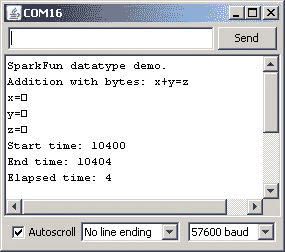](https://cdn.sparkfun.com/r/600-600/tutorialimages/datatypes/add_bytes.jpg)

好吧，这里有很多东西。让我们一步一步来。

首先，如果您正在跟进，请检查代码的编译大小。对于有**字节**的加法，我们最终得到 2458 字节的代码。不是很多，坦白地说，大部分都是串行输出。然而，这个数据点以后会变得很重要。

接下来，我们来看看串口输出。打印的变量值用正方形代替数字是怎么回事？这是因为`Serial.print()`函数根据传递给它的数据类型改变了它的操作方式。对于一个 8 位值(无论是一个`char`还是`byte`，它将简单地用管道把那个值以[二进制](https://learn.sparkfun.com/tutorials/binary)输出。然后，串行控制台将尝试将该数据解释为一个 [ASCII](http://en.wikipedia.org/wiki/Ascii) 字符，1、2 和 3 的 ASCII 字符是“标题开始”、“文本开始”和“文本结束”。嗯。不是特别有用，是吗，也不容易用一个字符显示出来？因此出现了正方形:串行控制台举起双手说，“我不知道如何打印这个，所以我为你做了一个正方形”。因此，Arduino 数据类型技巧的第一课是:要从`Serial.print()`中获得 8 位值的十进制表示，您必须将`DEC`开关添加到函数调用中，就像这样:

`Serial.print(x, DEC);`

最后，观察“运行时间”测量值。如果不考虑使用`micros()`函数来测量运行时间的不准确性，我们将在所有这些测试中进行测量，因此我们应该可以很好地测量操作所需的时间，如果不是很好的绝对测量，您可以看到将两个 8 位值相加需要大约 4 微秒的处理器时间来实现。

## 测试数据类型(添加)

好了，让我们继续测试更多的数据类型。如果你在家跟着做，你会想要改变你的代码，如下所示:

[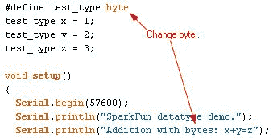](https://cdn.sparkfun.com/tutorialimages/datatypes/code_byte.jpg) [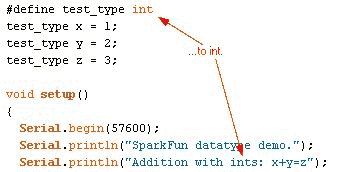](https://cdn.sparkfun.com/tutorialimages/datatypes/code_int.jpg)

现在，将代码加载到 Arduino 板上。检查编译大小:`int`为 2488 字节，而`byte`为 2458 字节。大不了多少，但确实大了。同样，这是因为使用需要 8 位以上存储的数据类型(如`int`、`long`或`float`)也需要编译器生成更多的实际机器码来实现加法——处理器本身根本不具备支持更大数据的能力。现在，打开串行控制台，您应该会看到类似这样的内容:

[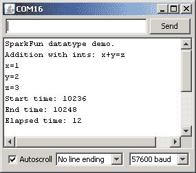](https://cdn.sparkfun.com/tutorialimages/datatypes/add_ints.jpg)

下一次观察:这一次正确地打印了值。这是因为我们引入的新数据类型`int`被编译器正确地解释为数字数据类型，并且`Serial.print()`正确地格式化输出数据以在控制台中反映出来。所以，Arduino 数据类型技巧的第二课是:如果你想发送数值数据类型的二进制等价物，比方说，作为与另一个计算设备而不是用户查看控制台共享数据的一种方式，使用`Serial.write()`函数。

接下来，让我们再次检查“运行时间”。我们现在达到了 12 微秒——大约是原来的 3 倍！仍然很短，但这是由于前面提到的事实，即这是一个 8 位处理器，所以它需要跳过一些环节来进行 16 位数学运算，这是将`int`变量相加在一起时所需要的。

向前向上！现在让我们来看看`long`数据类型。重复最后一次代码更改，只是这次用`long`替换`int`的两个事件。加载代码并打开串行控制台，看看发生了什么。

[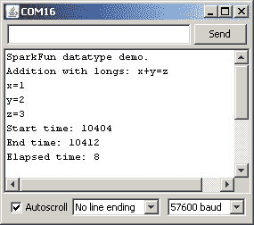](https://cdn.sparkfun.com/tutorialimages/datatypes/add_longs.jpg)

在我们深入串行捕获之前，让我们回顾一下编译大小。我得到了 2516 字节，这次比使用`int`多了 28 字节，比使用`byte`多了 58 字节。这仍然是一个很小的差别，但不管怎样，这是一个差别，如果你用`long`而不是`int`或`byte`做大量的数学运算，这种差别会累加起来。

好了，现在来看看系列结果。同样，请注意运行时间发生了变化。然而这一次，它从 12 微秒减少到了 8 微秒！这是怎么回事？这是你在 Arduino datatype finesse 上的第三课:你认为正在发生的可能不是实际发生的。我不确定为什么会出现这种情况——这可能是由于一些编译器优化，或者由于一些运行时优化，节省了在 int 代码中不存在的小值加法上的时间。不管怎样，`long`比`int`快在这里并不一定是安全的，当我们学习乘法和除法时，我们会看到这一点。

好了，最后一站，浮点数学。Arduino 上的浮点数学很棘手，因为 Arduino 缺少浮点单元，这是处理器专用部分的花哨说法，用于处理小数点后任意位数的数学。浮点数学也是一个棘手的概念，因为虽然人类可以很好地处理小数点后任意数量的零，但计算机却不行。这就是一些早期奔腾处理器遭受的臭名昭著的 [1 不是 1 bug](http://en.wikipedia.org/wiki/Pentium_FDIV_bug) 的由来。

再次修改上述代码，但在两个相关位置用`float`替换`long`。加载代码并检查编译大小:3864 字节！实际情况是，通过包含浮点数据类型，您迫使编译器包含浮点处理代码。显然，这是相当大的一段代码——它相当大地增加了代码的大小。数据类型技巧第四课:除非非常非常必要，否则不要使用浮点数学。大多数情况下，这将仅限于向用户提供关于某个毫无意义的任意整数值的反馈:ADC 将返回一个类似 536 的值，这是一个神秘的值，但转换为浮点值后，它将是类似 2.62V 这样更有用的值。

[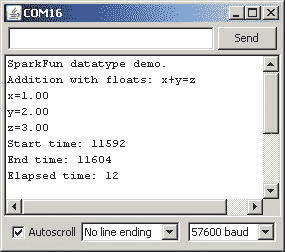](https://cdn.sparkfun.com/tutorialimages/datatypes/add_floats.jpg)

现在看看这段代码的运行时间——回溯到 12 微秒。另外，请注意，打印的值现在在小数点后包含两个零。如果需要小数点后有更多(或更少)位数，可以在打印命令中添加一些位数:

`Serial.print(x, 3); // print floating point number x with three digits after the decimal.`

## 测试数据类型(乘法/除法)

现在让我们看看“更难”的数学——乘法和除法会发生什么。

以下是乘法运算的一些屏幕截图:

[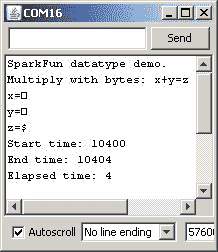](https://cdn.sparkfun.com/tutorialimages/datatypes/mult_byte.jpg)[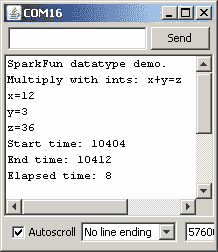[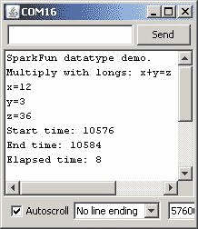](https://cdn.sparkfun.com/tutorialimages/datatypes/mult_long.jpg)[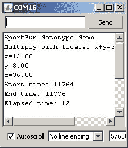

检查运行时间:`byte`用时 4 秒，`int`或`long`用时 8 秒，`float`用时 12 秒——对于更大的数据类型来说时间更长，我们也期待看到“更难”的数学用时更长。乘法仍然是硬件支持的，但是——处理器中有一个本机乘法指令，使得乘法操作相对容易。但是组织呢？

[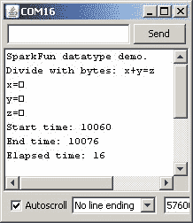](https://cdn.sparkfun.com/tutorialimages/datatypes/div_byte.jpg)[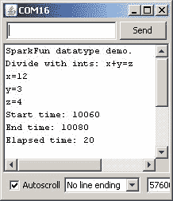](https://cdn.sparkfun.com/tutorialimages/datatypes/div_int.jpg)[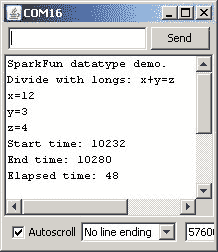](https://cdn.sparkfun.com/tutorialimages/datatypes/div_long.jpg)[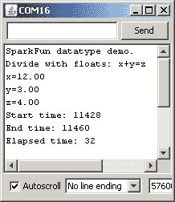](https://cdn.sparkfun.com/tutorialimages/datatypes/div_float.jpg)

哦，我的天。`byte`除法 16 s 不算太差，但是 48 对于`long`？哎哟。这里的问题是，division 在 Atmega 指令集中没有本机指令，所以编译器必须做一些反向操作来创建一个。所以，最后一课:不是所有的数学运算都是平等的。除法比乘法或加法(或减法，但那实际上只是带负号的加法)需要更长的时间，而像求平方根或正弦这样的事情需要更长的时间。事实上，维护一个平方根或正弦/余弦/正切值的列表，查找你想要的值比计算它更容易。

## 资源和更进一步

我打算暂时把它放在这里。我希望我已经清楚地展示了为变量使用合适的数据类型的好处。下一篇教程将探讨一些隐藏在混合数据类型和使用不适当的数据类型中的真正丑陋的陷阱——例如，对于您可能遇到的最大数量来说太小的数据类型。

这些操作的所有上下文都来自于[编译器](http://en.wikipedia.org/wiki/Compiler)，并且上下文的方向从用户那里到达编译器。你，程序员，告诉编译器这个值是一个[整数](http://en.wikipedia.org/wiki/Integer_%28computer_science%29)，那个值是一个[浮点数](http://en.wikipedia.org/wiki/Floating_point)。这样，编译器就要努力弄清楚我说的“把这个整数加到那个浮点上”是什么意思。有时这很容易，但有时并不容易。有时看起来应该很容易，但结果却出乎你的意料。

下面是一些您可能想用您对数据类型的新知识来探索的进一步阅读材料:

*   [数字逻辑](https://learn.sparkfun.com/tutorials/digital-logic)
*   [如何阅读原理图](https://learn.sparkfun.com/tutorials/how-to-read-a-schematic)
*   [逻辑电平](https://learn.sparkfun.com/tutorials/logic-levels)
*   [二进制](https://learn.sparkfun.com/tutorials/binary)

## 有兴趣学习更多基础主题吗？

查看我们的 **[工程要点](https://www.sparkfun.com/engineering_essentials)** 页面，了解电气工程相关基础主题的完整列表。

带我去那里！

