# 微型 AVR 编程器连接指南

> 原文：<https://learn.sparkfun.com/tutorials/tiny-avr-programmer-hookup-guide>

## 介绍

Arduino 很牛逼。板子很结实，编程语言和 IDE 很容易，社区也很棒。但是对于许多电子项目来说，Arduino 是多余的。如果你只是闪烁几个发光二极管，并读取单个传感器，你可以用一个简单的 [IC](https://learn.sparkfun.com/tutorials/integrated-circuits) 来完成**更小更便宜的**，就像 ATtiny85 的[。](https://www.sparkfun.com/products/9378)

[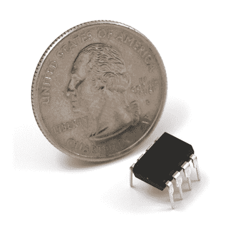](https://www.sparkfun.com/products/9378) 

将**添加到您的[购物车](https://www.sparkfun.com/cart)中！**

 **### [AVR 8 引脚 20MHz 8K 4A/D - ATtiny85](https://www.sparkfun.com/products/9378)

[In stock](https://learn.sparkfun.com/static/bubbles/ "in stock") COM-09378

Atmel 的 itty-bitty ATtiny85 8 位处理器。8K 程序空间、6 条 I/O 线和 4 通道 10 位 ADC。运行速度高达 20MHz

$3.508[Favorited Favorite](# "Add to favorites") 47[Wish List](# "Add to wish list")*****Our hero! The ATtiny85.*

不幸的是，ATtiny85 没有像 Arduino 的 Uno 或 Leonardo 那样众所周知、无处不在的开发平台。而且 8kB 的程序空间没有给引导装载程序留下多少空间，所以通常需要一个额外的程序员。最重要的是，标准的 Arduino 不支持该芯片。但是，这并不意味着在 Arduino 中对 ATtiny85 编程是不可能的！进入[微型 AVR 编程器](https://www.sparkfun.com/products/11460)...

[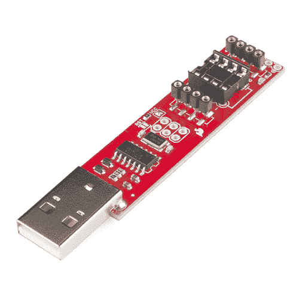](https://www.sparkfun.com/products/11801) 

将**添加到您的[购物车](https://www.sparkfun.com/cart)中！**

 **### [微型 AVR 编程器](https://www.sparkfun.com/products/11801)

[26 available](https://learn.sparkfun.com/static/bubbles/ "26 available") PGM-11801

ATtiny45 和 85 是一对非常酷的小 MCU，但是您知道您可以在 Arduino 中对它们进行编程吗？没错，n…

$17.50102[Favorited Favorite](# "Add to favorites") 76[Wish List](# "Add to wish list")** **微型 AVR 编程器是一个普通的 AVR 编程器，但与[袖珍 AVR 编程器](https://learn.sparkfun.com/tutorials/pocket-avr-programmer-hookup-guide?)相比，它是专门设计来允许**at Tiny 85(以及 45)快速简单的编程**。它有一个板上插座，可以插入 8 引脚的小 IC 并直接编程。不需要杂乱的电线或焊接！一旦你编写了 ATtiny85，只要把它从编程器中取出来，并把它插到[试验板](https://learn.sparkfun.com/tutorials/how-to-use-a-breadboard)或原型板上。

微型 AVR 编程器也可以用作通用 AVR 编程器。它可以直接编程几乎所有的 AVR(包括 ATmega328 和 ATmega32U4 ),无论它们是在 Arduino 板上还是在试验板上。

### 本教程涵盖的内容

在这个连接指南中，我们将展示如何使用微型 AVR 编程器和 Arduino 进行编程。我们将涵盖从驱动程序安装到 Arduino 编程技巧的所有内容。

#### 所需材料

除了[微型 AVR 编程器](https://www.sparkfun.com/products/11801)之外，你还需要以下物品来跟随本教程:

*   [ATtiny85](https://www.sparkfun.com/products/9378) -由程序员编程。*记住，你也可以用它来刷新其他 AVR 芯片，比如 ATtiny84！*
*   具有以下功能的计算机或笔记本电脑:
    *   一个免费的 **USB 端口**。USB 集线器应该也可以。
    *   [**Arduino IDE** 安装完毕](https://learn.sparkfun.com/tutorials/installing-arduino-ide)。
*   *Optional* :
    *   [USB 延长线](https://www.sparkfun.com/products/518) -如果你的 USB 端口够不着，这可能有助于程序员更容易接触到。
    *   IC 测试夹- SOIC 8 针 -如果你正在使用表面贴装，这个方便漂亮的小夹子可以让微控制器编程变得很容易！
    *   [跳线高级 M/F](https://www.sparkfun.com/products/9385) -如果您将微型 AVR 编程器连接到另一个非 ATtiny85 或 IC 测试夹的 AVR 微控制器，则非常有用。

### 推荐阅读

*   [安装 Arduino](https://learn.sparkfun.com/tutorials/installing-arduino-ide) -你需要安装 [Arduino](https://learn.sparkfun.com/tutorials/what-is-an-arduino) 用于本教程 Arduino 部分的[编程。有一个用于 Arduino 的 ATtiny85 插件，它使你能够在熟悉的 Arduino 界面中对微型 AVR 进行编程。](https://learn.sparkfun.com/tutorials/tiny-avr-programmer-hookup-guide/programming-in-arduino)
*   [集成电路](https://learn.sparkfun.com/tutorials/integrated-circuits) -本教程讲述了集成电路的基本概念。微型 AVR 编程器设计用来编程的小黑芯片。
*   [极性](https://learn.sparkfun.com/tutorials/polarity) -特别是[集成电路部分](https://learn.sparkfun.com/tutorials/polarity/integrated-circuit-polarity)。你应该知道所有关于集成电路的缺口和点。

[](https://learn.sparkfun.com/tutorials/installing-arduino-ide) [### 安装 Arduino IDE](https://learn.sparkfun.com/tutorials/installing-arduino-ide) A step-by-step guide to installing and testing the Arduino software on Windows, Mac, and Linux.[Favorited Favorite](# "Add to favorites") 16[](https://learn.sparkfun.com/tutorials/polarity) [### 极性](https://learn.sparkfun.com/tutorials/polarity) An introduction to polarity in electronic components. Discover what polarity is, which parts have it, and how to identify it.[Favorited Favorite](# "Add to favorites") 52[](https://learn.sparkfun.com/tutorials/integrated-circuits) [### 集成电路](https://learn.sparkfun.com/tutorials/integrated-circuits) An introduction to integrated circuits (ICs). Electronics' ubiquitous black chips. Includes a focus on the variety of IC packages.[Favorited Favorite](# "Add to favorites") 46

## 主板概述

下图提供了微型 AVR 编程器组件的快速概览:

[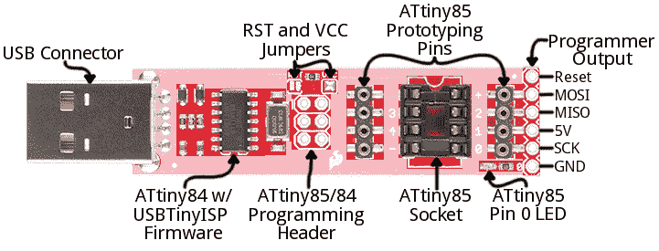](https://cdn.sparkfun.com/assets/c/c/3/1/8/52715ae8757b7f30048b4567.png)

微型 AVR 编程器的“大脑”是一个 **ATtiny84** (不要与 85 混淆)，16 引脚表面贴装芯片，预编程有一些固件，使其看起来像 AVR 编程器。除非你正在编写定制的 AVR ISP 固件，否则你不应该去摆弄这个芯片。它是一个黑盒子。程序数据通过 USB 从你的计算机进入它，它吐出正确的字节序列，把程序装入你的电脑。

在本教程中，我们将主要关注电路板右半部分的元件。ATtiny85 编程插座、引脚 0 LED 和原型引脚。

### ATtiny85 插座和原型引脚

插座和引脚打破了双方是什么使微型 AVR 编程器的独特性。8 引脚插座适合 ATtiny85 和 ATtiny45 DIP 封装。只要把你的 IC-to-program 插在这个插座上，你就可以开始编程了！

[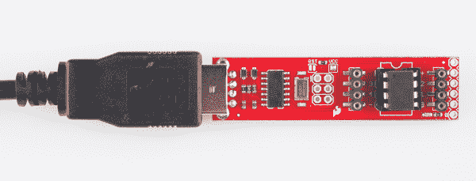](https://cdn.sparkfun.com/assets/1/5/f/9/9/527132e1757b7f632a8b4567.png)*A Tiny AVR Programmer with an ATtiny85 inserted.*

将 ATtiny 插入插座时，注意插座上的**槽口**和 PCB 上的白色丝网。这应该与 ATtiny85 的**极性**相匹配。通常 ATtiny85 在 IC 的引脚 1 旁边有一个**点**，这个点应该朝向槽口放置**。**

插座侧面的 *+* 、 *-* 和数字**标签**表示 ATtiny85 的管脚号和电源电压输入。这些 pin 码可以在 Arduino IDE 中调用，我们将在本教程的后面展示。

插座两侧的 4 引脚接头有助于将 ATtiny85 输出到外部电路。您可以轻松地将[公跳线](https://www.sparkfun.com/products/11026)插入这些引脚，这些引脚可以连接到试验板或其他原型电路。

[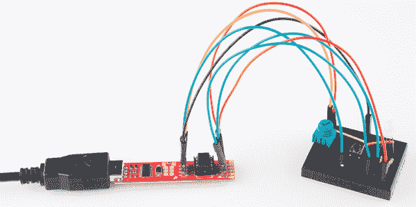](https://cdn.sparkfun.com/assets/2/4/1/d/2/52713322757b7fc8678b456a.png)*An ATtiny85 being prototyped out to a [potentiometer](https://www.sparkfun.com/products/9806) (analog input), [button](https://www.sparkfun.com/products/97) (digital input), and [RGB LED](https://www.sparkfun.com/products/105) (analog/digital output).***Note:** The ATtiny85's I²C and SPI functionality cannot be used in this method because the pins are still tied to the SPI pins of the ATtiny84 used to program the chip. The IC needs to be removed from the programmer first.

4 针接头也可用于连接表面贴装 ATtiny85 或试验板上的其他 AVR 微控制器。

[](https://cdn.sparkfun.com/assets/learn_tutorials/2/7/2/Reprogramming_the_Lily_Tiny-01.jpg)*Tiny AVR Programmer connected to an surface mount ATtiny85 that was sewn on fabric to [reprogram a LilyTiny](https://learn.sparkfun.com/tutorials/re-programming-the-lilytiny--lilytwinkle).*

最后，有一个板载**琥珀色 LED 连接到 ATtiny85 的引脚 0** 。当你把“你好，世界”的眨眼草图上传到 ATtiny85 时，这是非常有用的。

* * *

这涵盖了微型 AVR 编程器的基本内容。如果你计划在板上做更高级的东西，或者只是想知道更多，请继续阅读。否则，向前跳到下一页[。](https://learn.sparkfun.com/tutorials/tiny-avr-programmer-hookup-guide/driver-installation)

* * *

### 输出编程引脚

这个小小的 ISP 程序员不局限于 85 年代，而是一个成熟的 AVR 程序员。这一排六个引脚可以通过标准的 2x3 或 2x5 引脚 ISP 接头连接到其它 AVR。例如，您可以将这些引脚连接到您的 Arduino Uno、Leonardo 等。刷新引导加载程序，或使用编程器上传代码。

如果你要将微型 AVR 编程器连接到另一个 AVR 芯片，请参考上图中的引脚标签。大多数 AVR 开发板都有一个 2x3 或 2x5 编程接口，具有以下引脚排列:

[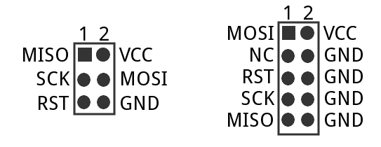](https://cdn.sparkfun.com/assets/d/8/9/c/9/527158c7757b7f17048b4567.png)

只要将微型编程器上的标签与 AVR 板/芯片上的引脚匹配，就可以开始编程了！

### 跳楼者

微型 AVR 编程器的顶部有两个跳线:一个标有 *RST* ，另一个标有 *VCC* 。这两种跳线都会影响电路板中间未安装的 2x3 ICSP(在线系统编程器)接头。除非你打算重新编程板上的 [ATtiny84](https://www.sparkfun.com/products/11232) ，这些跳线和引脚通常可以忽略。

***VCC* 跳线**为**常闭**。它控制着流向 ICSP 接头上的 VCC 引脚的功率。关闭时，来自 USB 的电力将流向 ICSP 接头。打开时，您需要从外部向该引脚供电。

***RST* 跳线**为**常开**。闭合时，此跳线将 ATtiny84 的 reset 引脚连接到 2x3 编程接头。如果您需要对 ATtiny84 进行重新编程(在标准使用情况下，您不应该这样做)，您必须关闭此跳线才能对其进行编程。

* * *

说够了。让我们开始使用编程器。在接下来的几页中，我们将介绍驱动程序安装(针对 Windows 用户),并展示如何使用微型 AVR 编程器在 Arduino 中编写 ATtiny85。

## 驱动程序安装

在你开始使用微型 AVR 编程器之前，你可能需要在你的电脑上安装它。如果你使用的是 Mac 或 Linux 机器，你不需要安装驱动程序。只要插上电路板，跳到 Arduino 页面的[编程。](https://learn.sparkfun.com/tutorials/tiny-avr-programmer-hookup-guide/programming-in-arduino)

[Tiny AVR Programmer Hookup Guide - Programming in Arduino](https://learn.sparkfun.com/tutorials/tiny-avr-programmer-hookup-guide/programming-in-arduino)

如果你正在使用任何版本的 **Windows** ，在加入你的 Mac/Linux 伙伴之前，你需要遵循一些步骤。本页有两套驱动程序安装说明。 [first 是最简单、最快捷的方法，](#automatic-install)，应该适用于大多数人。只有在第一次安装失败的情况下才需要[第二次安装过程](#manual-driver)——这需要更多的手动方法来安装驱动程序。

* * *

### [用 Zadig](#automatic-install) 自动安装驱动程序

首先，**将微型 AVR 编程器插入你的电脑**。最初连接主板时，Windows 会尝试自动安装驱动程序。有些计算机可能很幸运，但大多数会出现一条消息，通知您驱动程序安装失败。

单击以下链接下载 Zadig 软件和驱动程序:

[Download the Zadig USBtiny Drivers (ZIP)](https://cdn.sparkfun.com/assets/learn_tutorials/2/1/4/zadig_v2.0.1.160.zip)

使用您最喜欢的解压缩程序解压缩 ZIP 文件。不要忘记你把解压的文件夹放在哪里！

在你将微型 AVR 编程器插入你的计算机，并且你的机器已经运行了检查和安装驱动程序失败的过程之后，继续到你刚刚解压的" **zadig_v2.0.1.160** "文件夹。然后运行 zadig.exe 软件**。**

Zadig 是一个很棒的工具，可以在任何 Windows 平台上安装驱动程序。打开程序时，您应该会看到一个类似这样的窗口:

[](https://cdn.sparkfun.com/assets/learn_tutorials/2/1/4/zadig-01.png)

安装驱动程序之前，有几个选项需要验证:

*   **选择设备** -顶部的下拉框控制你想为哪个设备安装驱动程序。希望你只有一个选择，比如“**未知设备#1** ”。如果您有多个选项，请检查您的设备管理器，看看您是否能弄清楚哪个是哪个(插拔设备通常会有所帮助)。
*   **选择驱动**——点击这个框中的箭头，直到你碰到**libusb-win32(VX . x . x)**，这就是我们要安装的驱动。

确认这两个选择后，**点击“安装驱动程序”**。安装过程可能需要几分钟，但是在你看到滚动条放大无数倍后，你应该会看到一条“**驱动程序安装成功**”的消息。

[](https://cdn.sparkfun.com/assets/learn_tutorials/2/1/4/AVR_Programmer_Zadig_usbtiny_Drivers_Installed.jpg)

### Zadig 驱动程序安装问题

After installing the drivers, your computer may respond by indicating that the device was not installed correctly. Here are two methods of troubleshooting driver issues when installing with Zadig.

📌 **Troubleshooting Tip:** In this case, the *WinUSB* drivers were selected instead of the *libusb-win32* drivers. To remedy the issue, simply go through the [guide again to reinstall the correct *libusb-win32* drivers](https://learn.sparkfun.com/tutorials/tiny-avr-programmer-hookup-guide#automatic-install).

[](https://cdn.sparkfun.com/assets/learn_tutorials/2/1/4/Zadig_AVR_Programmer__Drivers_Not_Installed_Correctly_2.jpg)
📌 **Troubleshooting Tip:** In other cases, it may also initialize somewhere in your device manager as an **Unknown USB Device (Device Descriptor Request Failed)** even if you installed the correct drivers:

[](https://cdn.sparkfun.com/assets/learn_tutorials/2/1/4/Zadig_AVR_Programmer_Drivers_Not_Installed_Correctly.jpg)
Try unplugging and replugging the Tiny AVR Programmer back into your USB port. Or switch out your USB extension cable for a known good. In some cases, your Tiny AVR Programmer may shows up under the **libusb-win32 devices** as an **Unknown Device #1**. If that is the case you should be good to go!

[](https://cdn.sparkfun.com/assets/learn_tutorials/2/1/4/Driver_Recognized_under_libusb-win32_devices.jpg)**Well done!** You've successfully installed the drivers on your computer. However, the driver still shows up as an **Unknown Device #1** (in some cases like the image below, the Tiny AVR Programmer may show up as **libusb-win32 devices** > **FabISP**). But you know what it is! You can use the Zadig software to rename the USB port if you desire. With your programmer connected to your computer and the software open, navigate to the programmer's port. Select the checkbox next to **Edit**.

[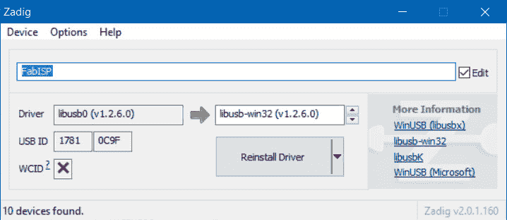](https://cdn.sparkfun.com/assets/learn_tutorials/1/5/0/Zadig_Rename_and_Reinstall_Device_Driver.jpg)
Type in the name for your port. It can be "**USBtiny**" or in this case. Make sure that the correct driver is selected.

[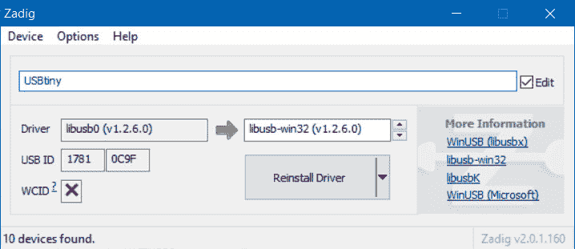](https://cdn.sparkfun.com/assets/learn_tutorials/1/5/0/Zadig_USBtiny_Rename_Reinstall_Device_Driver.jpg)
Click **Reinstall Driver**. The driver will reinstall and you should see the same message that indicates that the drivers were successfully installed. You may need to unplug and replug the programmer to your computer to give it a second to refresh again.

[](https://cdn.sparkfun.com/assets/learn_tutorials/1/5/0/Zadig_Success_Rename_Reinstall_Device_Driver.jpg)
Open up your device manager and you should see the device renamed!

[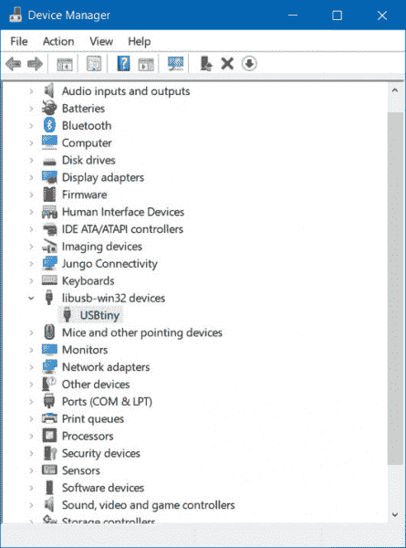](https://cdn.sparkfun.com/assets/learn_tutorials/1/5/0/Tiny_AVR_Programmer_Device_Manager.jpg)

如果成功，关闭 Zadig 程序并[进入下一部分](https://learn.sparkfun.com/tutorials/tiny-avr-programmer-hookup-guide/programming-in-arduino)！

[Tiny AVR Programmer Hookup Guide - Programming in Arduino](https://learn.sparkfun.com/tutorials/tiny-avr-programmer-hookup-guide/programming-in-arduino)

如果 Zadig 对你不起作用，检查下面的指导来帮助手动安装驱动程序。

* * *

### [手动安装 libUSB 驱动](#manual-driver)

### 第一步:插上编程器

首先，在你的电脑上找到一个空的 USB 端口，将微型 AVR 编程器插入其中。你可能想让程序员在附近。如果你使用的是 PC，或者你的 USB 端口不在附近，一根 [USB 延长线](https://www.sparkfun.com/products/518)可能有助于程序员在你的桌子上找到一个更方便的位置。

### 步骤 2:等待 Windows 自动失败/成功

插入微型 AVR 编程器后，Windows 会尝试寻找与之匹配的驱动程序。请注意右下角的通知区域。等待 Windows 尝试自行安装驱动程序。搜索后，Windows 可能会找到驱动程序。如果你得到一个*设备驱动软件安装成功的*通知(你真幸运！)，可以忽略接下来的几个步骤。但是，如果你有这样的东西:

[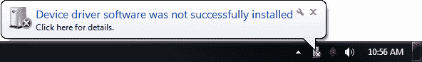](https://cdn.sparkfun.com/assets/b/6/3/f/b/5270287b757b7f64668b4568.png)

继续执行步骤 3...

### 步骤 3:下载驱动程序

如果 Windows 找不到该驱动程序，您需要下载它。你可以前往 [Tiny AVR 程序员 GitHub 仓库](https://github.com/sparkfun/Tiny-AVR-Programmer/tree/master/Drivers)获取你需要的东西，或者你可以点击下面的链接直接下载 zip 文件。

[Tiny AVR Programmer Drivers (ZIP)](https://cdn.sparkfun.com/datasheets/Dev/AVR/usbtinyisp_libusb_1.2.6.0.zip)

下载驱动程序后，将其从 zip 文件夹中解压缩。别忘了你把它放在哪里了！

#### 步骤 4:打开设备管理器

要安装驱动程序，你需要首先[打开*设备管理器*T3。从**控制面板**，进入**系统和安全**部分，点击**系统**，点击**设备管理器**。(或者您可以**运行*****devmgmt . MSC***)。](https://learn.sparkfun.com/tutorials/terminal-basics/connecting-to-your-device#devmgmt)

在*设备管理器*中，打开 *LibUSB-Win32 设备*树，你应该会发现一个 *USBTinyProgrammer* ，图标上有一个黄色的警告三角形。这也可能是位于**的其他设备** > **的未知设备**。

**在 *USBTinyProgrammer* 设备上右击**，选择 ***更新驱动软件...***

[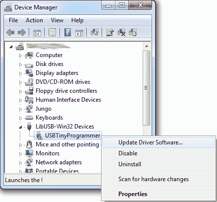](https://cdn.sparkfun.com/assets/b/a/3/d/2/5270287b757b7f88668b4567.png)

### 第五步:驱动程序指向

在出现的*更新驱动软件*窗口中，**选择*在我的电脑上浏览驱动软件*T5。**

在下一个窗口*中，浏览您计算机上的驱动程序软件*，将驱动程序搜索位置设置为您在步骤 3 中下载并解压缩的文件夹。

[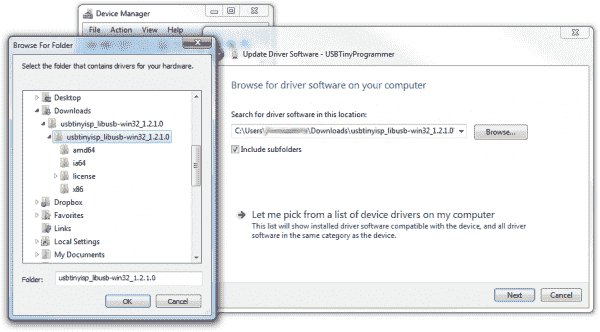](https://cdn.sparkfun.com/assets/e/3/8/a/e/5270287c757b7fb5668b4567.png)

然后**点击*下一个*T3，驱动开始更新。然而，在那之后不久，一个*视窗安全*窗口应该会弹出来，让你知道驱动程序没有“签名”。**点击*仍然安装该驱动软件*** 。我们保证它不会损坏您的计算机！**

[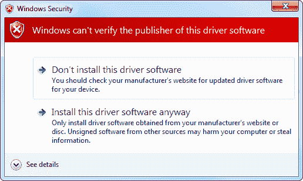](https://cdn.sparkfun.com/assets/learn_tutorials/2/1/4/driver-08.png)

然后玩一会等待游戏，等待一个快乐的 *Windows 已经成功更新了你的驱动软件*窗口。

关闭成功窗口后，您的*设备管理器*应该在 *LibUSB-Win32 设备*下有一个 ***USBtiny*** 的条目。

[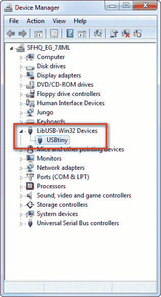](https://cdn.sparkfun.com/assets/learn_tutorials/2/1/4/driver-10.png)

恭喜你！[继续下一节](https://learn.sparkfun.com/tutorials/tiny-avr-programmer-hookup-guide/programming-in-arduino)，我们将开始使用编程器！

📌 **Drivers Still Not Installing?** If you are **still** having issues installing the drivers, try looking at this troubleshooting tip and driver from our technical support. The drivers work for both the Tiny AVR Programmer and Pocket AVR Programmer.

[GitHub SparkFunTechSupport: ...\PGM-11801](https://github.com/SparkfunTechSupport/Additional-files/tree/master/PGM-11801)

* * *

放松呼吸。一旦你在你的电脑上安装了 USBtiny 驱动程序，你就不需要再做了。现在是时候编程了！

## Arduino 编程

人人都爱 Arduino！这种简化语言使得 AVR 和更复杂的微控制器的编程变得异常简单。不幸的是，Arduino 没有任何内置功能来编程微小的 AVR，但这并不意味着我们不能添加它！

在这一页中，我们将使用微型 AVR 编程器，浏览在 Arduino 中启用 ATtiny45/85 编程的所有必要步骤。

### 步骤 0:安装 Arduino

如果你之前没用过 Arduino(你去过哪里？！)，请务必遵循我们的[什么是 Arduino？继续之前的](https://learn.sparkfun.com/tutorials/what-is-an-arduino)和[安装 Arduino](https://learn.sparkfun.com/tutorials/installing-arduino-ide) 教程。

[](https://learn.sparkfun.com/tutorials/what-is-an-arduino) [### 什么是 Arduino？](https://learn.sparkfun.com/tutorials/what-is-an-arduino) What is this 'Arduino' thing anyway? This tutorials dives into what an Arduino is and along with Arduino projects and widgets.[Favorited Favorite](# "Add to favorites") 50[](https://learn.sparkfun.com/tutorials/installing-arduino-ide) [### 安装 Arduino IDE](https://learn.sparkfun.com/tutorials/installing-arduino-ide) A step-by-step guide to installing and testing the Arduino software on Windows, Mac, and Linux.[Favorited Favorite](# "Add to favorites") 16

### 步骤 1:安装 ATtiny 附加组件

下一步是安装 Attiny 插件。1a 和 1b 中的以下步骤将解释如何为 Arduino 手动安装 ATtiny 板文件。

📌 **Tip:** For beginners, you can **automatically** install using the Arduino boards manager by following the directions in "Installing the ATtiny Support in Arduino v1.6.4+."

[High-Low Tech: Programming an ATtiny w/ Arduino 1.6 (or 1.0) - Installing ATtiny Support in Arduino 1.6.4](http://highlowtech.org/?p=1695)

#### 步骤 1a:下载 ATtiny 插件

要手动将 ATtiny 添加到标准 Arduino IDE *Board* 菜单，您需要添加一些文件来帮助定义硬件。最新的 ATtiny 硬件定义保存在 GitHub 的[库中。](https://github.com/damellis/attiny)

[GitHub ATtiny Boards](https://github.com/damellis/attiny)

您可以从那里下载它们，或者只需点击下面的存档链接(注意:根据您使用的 Arduino 版本，会有不同的文件):

*   [用于 Arduino 1.0.x 的 at tiny](https://cdn.sparkfun.com/assets/learn_tutorials/1/5/0/attiny-ide-1.0.x.zip)
*   【Arduino 1.6.x 的最新版本

解压 ZIP 文件夹，不要忘记放在哪里！

#### 步骤 1b:将*移动到任意的*文件夹中

你下载的 *attiny-ide-1.x.x.zip* 文件里面应该有一个 *attiny* 文件夹。**复制**那个文件夹**粘贴**到你 **Arduino Sketchbook 目录**下一个名为 ***hardware*** 的文件夹。

如果你不确定你的 Arduino sketchbook 在哪里，**打开 Arduino** ，进入 ***文件*** > ***首选项*** 。 *Sketchbook 位置*应该是*首选项*对话框中最顶端的条目。默认情况下，sketchbook 通常是您的 home 文件夹中的一个 *Arduino* 文件夹(例如 Windows 上的*C:\ Users \ userName \ Arduino*，或者 Mac 上的*/Users/userName/Documents/Arduino*)。

如果你的素描本**里还没有*硬件*文件夹，那就做一个**。将 *attiny* 文件夹放在那里后，你的目录结构应该看起来有点像这样:

[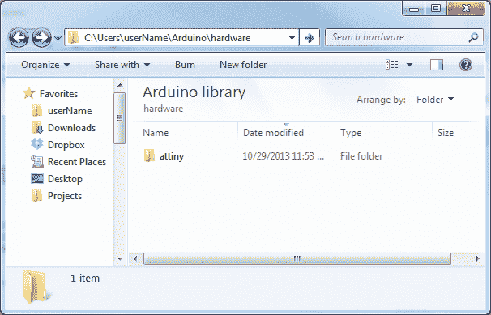](https://cdn.sparkfun.com/assets/a/7/e/9/4/5270287c757b7fc5658b456b.png)

### 步骤 2:打开并配置 Arduino

差不多到好玩的部分了！**打开 Arduino** 。如果您在上一个步骤中打开了 Arduino，请将其关闭并重新启动。

在 ***工具* > *面板*** 菜单下，你会找到*效果的 attiny* 文件夹。电路板列表中应该有 12 个新条目，允许您在 45、85、44 和 84 上编程。每个微控制器都可以设置为各种时钟速度-内部 1MHz 或 8MHz 或外部 20MHz。

如果你使用的是一个裸露的，之前没有接触过的 [ATtiny85](https://www.sparkfun.com/products/9378) 选择 ***ATtiny85(内部 1 MHz 时钟)*** 。在这里选择时要小心，选择 *8 MHZ* 选项只会让你的草图运行缓慢，但是选择 *20 MHz* 选项可以“砌砖”你的 ATtiny。**除非您连接了外部时钟，否则不要选择 *20 MHz* 选项！**

[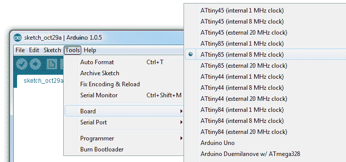](https://cdn.sparkfun.com/assets/0/9/e/5/7/5270287b757b7fbb658b4569.png)**Note:** Depending on your Arduino IDE version, you may need to individually select the **attiny's** **Processor** (i.e. **ATtiny85**) and **Clock** (i.e. **8MHz (internal)**).

[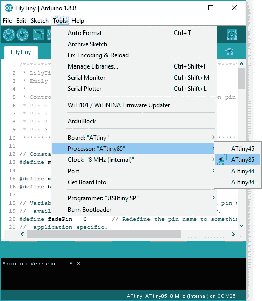](https://cdn.sparkfun.com/assets/learn_tutorials/1/5/0/Arduino_Select_ATtiny_Processor_and_Clock.jpg)

与其他 Arduino 板不同，在使用微型 AVR 编程器时，您不必选择一个*串行端口*。但是你确实需要选择一个 ***程序员*** 。在*工具* > *程序员*菜单下，选择 ***USBtinyISP*** 。

[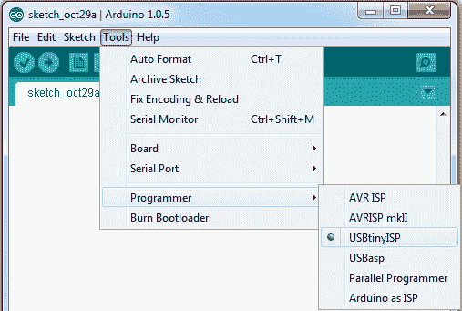](https://cdn.sparkfun.com/assets/5/0/5/c/1/5270287c757b7f40668b4567.png)

### 第三步:插上电源

快要眨眼了！当你将 ATtiny 插入你的编程器时，确保你的[极性](https://learn.sparkfun.com/tutorials/polarity)正确。IC 上蚀刻的小圆圈应与编程器插座和丝网印刷上的“凹口”对齐。

[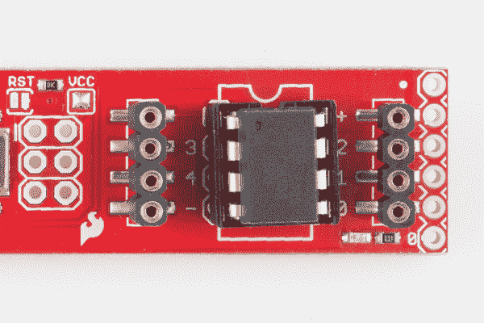](https://cdn.sparkfun.com/assets/3/f/5/f/4/52713369757b7ff7668b4567.png)

要将 IC 插入插座，您可能需要将两侧的腿向内弯曲一点。

### 第四步:上传代码！

眨眼小品的时间到了！微型 AVR 编程器有一个板载 LED，连接到 ATtiny，我们可以用它来验证 IC 上的代码正在运行。在 Arduino 环境中，LED 连接到引脚 0。将此代码复制/粘贴到您的 Arduino 窗口中:

```
language:c
int blinkPin = 0;

void setup()
{
  pinMode(blinkPin, OUTPUT);
}

void loop()
{
  digitalWrite(blinkPin, HIGH);
  delay(500);
  digitalWrite(blinkPin, LOW);
  delay(500);
} 
```

然后点击 ***上传*** 按钮，就像你使用任何 Arduino 板一样。代码将会编译，然后它将会以惊人的速度上传。这就是直接系统内编程的奇妙之处。如果成功，机载**琥珀色 LED 应开始闪烁**。

**Note:** You can also upload using the Arduino IDE menu. Depending on your Arduino IDE version, you can select either **Sketch** > **Upload Using Programmer** or **Sketch** > **Upload Using Programmer**.📌 **Troubleshooting Tip:** If you receive the following Arduino error, this might be due to the connection or an issue with the drivers.

```
avrdude: Error: Could not find USBtiny device (0x1781&sol;0xc9f)
```

You should see this at the bottom of the Arduino IDE in the text console.

[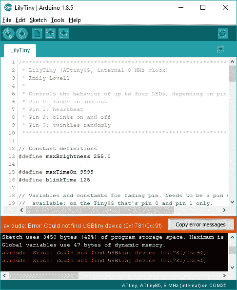](https://cdn.sparkfun.com/assets/learn_tutorials/1/5/0/Arduino_Error_Uploading_to_ATtiny85_Driver_Issue.jpg)
If the issue is related to the connection, try unplugging/replugging the AVR programmer back into your USB cable or USB port. You also want to try a different USB cable.

[](https://cdn.sparkfun.com/assets/1/5/f/9/9/527132e1757b7f632a8b4567.png)
Otherwise, the issue may be due to the drivers. This may be caused by the driver not being installed correctly, or there is a driver conflict. Open up your device manager to view the device. The image on the left shows the device showing up as the **libusb-win32 devices** > **FabISP**. The image on the right shows the device showing up as **Other devices** > **FabISP**.

| [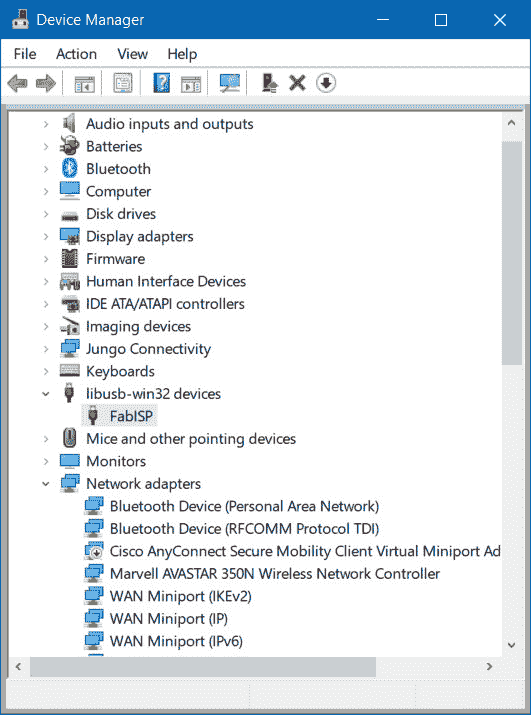](https://cdn.sparkfun.com/assets/learn_tutorials/1/5/0/Renaming_Device_Driver.jpg) | [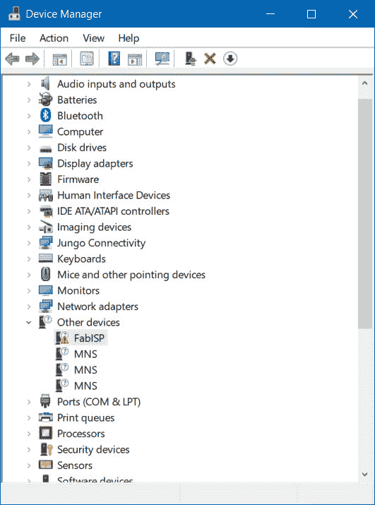](https://cdn.sparkfun.com/assets/learn_tutorials/1/5/0/AVR_Programmer_FabISP_Driver_Conflict.jpg) |
| *冲突驾驶员* | *驱动程序未安装* |

In either case, right click on the device and select **Uninstall device**.

[](https://cdn.sparkfun.com/assets/learn_tutorials/1/5/0/Uninstall_Conflicting_Programmer_Driver.jpg)
You may see a window pop up similar to the image below. Click on the button labeled **Uninstall**. In some cases, Windows may provide an option to **"Delete the driver software for this device."** if the option is provided, simply mark the checkbox before clicking on the button to uninstall.

[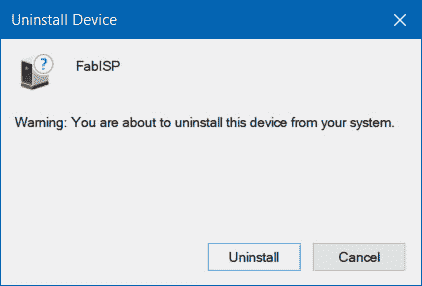](https://cdn.sparkfun.com/assets/learn_tutorials/1/5/0/Uninstall_Conflicting_Device_Driver.jpg)
Unplug and replug the AVR programmer back to your computer's USB port. Head back to the Driver Installation section and follow the instructions to [Automatically Install the Drivers using Zadig](https://learn.sparkfun.com/tutorials/tiny-avr-programmer-hookup-guide#automatic-install).

[Driver Installation: Automatically Install the Drivers with Zadig](https://learn.sparkfun.com/tutorials/tiny-avr-programmer-hookup-guide#automatic-install)

### 艰难地上传代码

如果你正在寻找对你的小型 AVR 编程器和它所连接的 AVR 的更多控制，请跟随袖珍 AVR 编程器的教程。虽然本教程是为袖珍 AVR 程序员编写的，但对微型 AVR 程序员来说功能上是一样的。只要确保连接到目标 AVR 芯片上相应的 ICSP 引脚。

[](https://learn.sparkfun.com/tutorials/pocket-avr-programmer-hookup-guide#using-avrdude-via-command-line)*Using [AVRDUDE via Command Line](https://learn.sparkfun.com/tutorials/pocket-avr-programmer-hookup-guide#using-avrdude-via-command-line)*

## ATtiny85 使用提示

ATtiny85 不是你日常使用的 Arduino IC。它体积小，但有很多功能，但有些事情它做不了。

在这一页上，我们将简要介绍 ATtiny85，因为它与 Arduino 和微型 AVR 编程器有关。

### 插脚引线图

就像任何 Arduino 板一样，ATtiny85 上的每个 I/O 引脚都分配有一个数字标识符。这些引脚也记录在电路板上，但如果您忘记了，也可以参考下图。

[](https://cdn.sparkfun.com/assets/f/8/f/d/9/52713d5b757b7fc0658b4567.png)

ATtiny85 上的每个 I/O 引脚都能够进行数字输入和输出。除此之外，一些引脚具有特殊功能。

#### 模拟输入和输出

有**两个模拟输出**和**三个模拟输入**。就像使用任何 Arduino 板一样使用它们。用`analogWrite([pin], [0-255])`做 [PWM](https://learn.sparkfun.com/tutorials/pulse-width-modulation) 输出。此功能在引脚 0 和 1 上可用。例如:

```
language:c
int pwmPin = 0;

pinMode(pwmPin, OUTPUT);

for (int i=0; i<=255; i+=5)
{
  analogWrite(pwmPin, i);
  delay(5);
} 
```

并使用`analogRead([pin])`读取 0 到 5V 之间的模拟电压，并将其转换为该电压的 10 位表示。引脚 2、3 和 4 能够进行模拟输入，但是，当这样使用时，它们应分别被称为 **A1、A3 或 A2** 。例如:

```
language:c
int pwmPin = 0;
int analogInPin = A1;

pinMode(pwmPin, OUTPUT);
pinMode(analogInPin, INPUT);

int analogIn = analogRead(analogInPin); // Read analog voltage on pin 2 (A1)

analogWrite(pwmPin, analogIn / 4); // Output analog reading to dimmable LED 
```

**Note:** For advanced users, you can modify the ATtiny85's timer/counter registers to increase the number of PWM channels available! You can get up to four PWM channels by following this tutorial here: [Technoblogy - Four PWM Outputs from the ATtiny85](http://www.technoblogy.com/show?LE0). The example just runs PWM on the ATtiny85\. If you are trying to add more features outside of the PWM example, there might be some unexpected behaviors since it is modifying the timing registers.

If you need to reset the chip, simply use the erase command with the Tiny AVR or Pocket AVR Programmer via command line to get it back to its previous state. Uploading code with the Arduino IDE will not be enough. Here is an example using the fuse bit settings for the LilyTwinkle's ATtiny85:

```
avrdude -c usbtiny -b 19200 -p t85 -v -e -U lfuse:w:0xe2:m -U hfuse:w:0xdf:m -U efuse:w:0xff:m -U lock:w:0xCF:m
```

After resetting the chip, you can proceed to upload code to the chip through the Arduino IDE as explained earlier.

#### 无串行(UART)。是 SPI 和 I ² C。

您可能会注意到，在特殊引脚功能列表中，没有 UART RX 或 TX。那是因为 ATtiny85 没有内置的[硬件 UART](https://learn.sparkfun.com/tutorials/serial-communication/uarts) 。如果你试图编译任何带有`Serial.begin(9600)`或`Serial.print()`的 Arduino 代码，你会得到一个错误。

所以你就失去了一个更有用的 Arduino 调试工具。您不能打印到串行监视器。但是 ATtiny85 仍然有 [I ² C](https://learn.sparkfun.com/tutorials/i2c) 和 [SPI](https://learn.sparkfun.com/tutorials/serial-peripheral-interface-spi) ，这两个接口现在更常用于传感器通信。不幸的是，这些接口的 Arduino 库还没有为 ATtiny85 编写，但是网上有一些用户贡献的库。[usi2c](http://playground.arduino.cc/Code/USIi2c)是一个 Arduino 库，可以在 ATtiny85 上启用 I ² C。

那里也有其他以 ATtiny85 为中心的图书馆。像一个 [Servo8Bit](https://github.com/fri000/Servo8Bit) ，一个伺服库。

**Tip:** Looking for a quick reference guide for the ATtiny85? Click on the link below to download an image or PDF version from our resources!

[](https://learn.sparkfun.com/resources/96)

### 用微型 AVR 编程器制作原型

调暗一个黄色的 LED 灯只会让你兴奋不已。你最终会想拓展业务，开始将 tiny85 连接到其他电子元件。有几种方法可以做到这一点。

最简单、最不持久的原型路线是在插座的任一侧使用**原型头**。您可以将标准[公跳线](https://www.sparkfun.com/products/11026)连接到这些引脚，这些引脚可以依次连接到试验板或其他组件。

[](https://cdn.sparkfun.com/assets/2/4/1/d/2/52713322757b7fc8678b456a.png)

对于更持久的项目，很容易轻轻从插座中取出集成电路，并将其插入 PCB 或试验板。最终，一旦你对你的草图进行了足够的迭代，这可能就是你想要去的地方。最终你会得到像 [H2OhNo 这样的设计成品！](https://www.sparkfun.com/products/12069)或[电子蜡烛](https://www.sparkfun.com/products/9563)。

### 85 SOIC 封装表面贴装

试图用 SOIC 软件包重新编程 ATtiny85？有几种连接方式。最简单的方法是使用 IC 测试夹和 M/F 跳线。

[](https://www.sparkfun.com/products/9140) 

将**添加到您的[购物车](https://www.sparkfun.com/cart)中！**

 **### [跳线高级 6" M/F 装 10 根](https://www.sparkfun.com/products/9140)

[In stock](https://learn.sparkfun.com/static/bubbles/ "in stock") PRT-09140

这是一个 SparkFun 独家！这些都是 155 毫米长，26 美国线规跳线终止作为男性到女性。用这些来跳离…

$4.501[Favorited Favorite](# "Add to favorites") 16[Wish List](# "Add to wish list")****[](https://www.sparkfun.com/products/13153) 

将**添加到您的[购物车](https://www.sparkfun.com/cart)中！**

 **### [IC 测试夹- SOIC 8 针](https://www.sparkfun.com/products/13153)

[Out of stock](https://learn.sparkfun.com/static/bubbles/ "out of stock") COM-13153

这是用于 8 针小型集成电路(SOIC)的 IC 测试夹。此测试夹确保安全连接到所有…

$19.504[Favorited Favorite](# "Add to favorites") 24[Wish List](# "Add to wish list")**** ****欲了解更多信息，请查看我们关于在 LilyTiny 和 LilyTwinkle 上重新编程 ATtiny85 的教程。

[](https://learn.sparkfun.com/tutorials/re-programming-the-lilytiny--lilytwinkle) [### 对 LilyTiny / LilyTwinkle 重新编程

#### 2014 年 9 月 11 日](https://learn.sparkfun.com/tutorials/re-programming-the-lilytiny--lilytwinkle) A quick tutorial showing how to reprogram the ATtiny85 IC found on the LilyTiny or LilyTwinkle boards.[Favorited Favorite](# "Add to favorites") 4

如果编程引脚在标准 2x3 ICSP 接头上断开，您也可以将 ISP pogo 适配器焊接在一起，以临时连接到芯片。或者你可以抓住几个鳄鱼测试引线或 IC 钩，分别连接每个编程引脚到微型 AVR 编程器的机器头。

[](https://www.sparkfun.com/products/14303) 

将**添加到您的[购物车](https://www.sparkfun.com/cart)中！**

 **### [【带辫子的鳄鱼夹(10 个装)](https://www.sparkfun.com/products/14303)

[In stock](https://learn.sparkfun.com/static/bubbles/ "in stock") CAB-14303

这是一种 10 条装的电线，一端带有鳄鱼夹，另一端带有插头。

$7.504[Favorited Favorite](# "Add to favorites") 13[Wish List](# "Add to wish list")****[](https://www.sparkfun.com/products/9741) 

将**添加到您的[购物车](https://www.sparkfun.com/cart)中！**

 **### [带猪尾的 IC 钩](https://www.sparkfun.com/products/9741)

[In stock](https://learn.sparkfun.com/static/bubbles/ "in stock") CAB-09741

这些是高质量的 IC 测试钩，带有一根公连接线。这些有两个挂钩，而不是一个挂钩…

$5.5010[Favorited Favorite](# "Add to favorites") 30[Wish List](# "Add to wish list")****[](https://www.sparkfun.com/products/11591) 

将**添加到您的[购物车](https://www.sparkfun.com/cart)中！**

 **### [SparkFun ISP Pogo 适配器](https://www.sparkfun.com/products/11591)

[In stock](https://learn.sparkfun.com/static/bubbles/ "in stock") KIT-11591

Pogo 引脚使生活变得更加容易，当你试图编程，而不必焊接一个东西，当你连接到…

$13.954[Favorited Favorite](# "Add to favorites") 12[Wish List](# "Add to wish list")****** ******## 资源和更进一步

既然您已经成功地启动并运行了小型 AVR 编程器，是时候将它整合到您自己的项目中了！

有关更多信息，请查看以下资源:

*   **微型 AVR 编程器设计文件**

    *   [原理图](http://cdn.sparkfun.com/datasheets/Dev/AVR/Tiny_Programmer.pdf) -微型 AVR 编程器原理图的 PDF。
    *   [Eagle 文件](cdn.sparkfun.com/datasheets/Dev/AVR/Tiny_Programmer.zip) -如果你想看看 PCB 设计，或者修改它以制作你自己的版本，请查看这些文件。
    *   微型 AVR 编程器固件 -如果你想深入了解编程器本身的代码，看看这个。
    *   [GitHub 库](https://github.com/sparkfun/Tiny-AVR-Programmer) -在这里找到最新最好版本的微型 AVR 编程器的硬件和固件。或者修改它并反馈您的更改！
*   **司机等。**

    *   [Arduino 板定义](https://github.com/damellis/attiny/tree/master/attiny)—*attini*文件夹应该位于 Arduino sketchbook 的*硬件*文件夹中。
    *   [Zadig v2.0.1.160 软件和 USBtiny (ZIP)](https://cdn.sparkfun.com/assets/learn_tutorials/2/1/4/zadig_v2.0.1.160.zip) -用于自动安装
    *   [32 位 USBTinyISP 驱动程序](http://cdn.sparkfun.com/datasheets/Dev/AVR/usbtinyisp%20w32%20driver%20v1.12.zip) -用于在 32 位系统上手动安装的 Windows 驱动程序
    *   [64 位 USBTinyISP 驱动程序](http://cdn.sparkfun.com/datasheets/Dev/AVR/usbtinyisp_libusb-win32_1.2.1.0.zip) -用于在 64 位系统上手动安装的 Windows 驱动程序
    *   [GitHub:签名 USBTiny 驱动](https://github.com/SparkfunTechSupport/Additional-files/tree/master/PGM-11801) -如果教程中列出的前 3 个选项安装失败
*   **ATtiny85 资源**
    *   [Atmel 文档页面](http://www.atmel.com/devices/ATTINY85.aspx?tab=documents)-at tiny 85 的最新数据手册和应用笔记。
    *   [高低技术教程](http://hlt.media.mit.edu/?p=1801) -使用 Arduino 对 ATtiny85 进行编程的概述。
    *   [attin y85](https://learn.sparkfun.com/resources/96)快速参考指南

你的下一个项目需要一些灵感吗？查看一些相关教程:

*   [H2OhNo！](https://learn.sparkfun.com/tutorials/h2ohno)-H2OhNo！水报警和开发板使用 ATtiny85 来感应水的存在。本教程深入到如何让 ATtiny85 进入一个非常**低功耗**模式。
*   [移位寄存器](https://learn.sparkfun.com/tutorials/shift-registers) -如果你感觉受到 ATtiny 缺少管脚的限制，你可以使用移位寄存器来扩展 I/O 计数。
*   [使用 Arduino Pro Mini 3.3V](https://learn.sparkfun.com/tutorials/using-the-arduino-pro-mini-33v) -如果您正在寻找小尺寸，但需要更多引脚和功能，请查看 Arduino Pro Mini。
*   安装 Arduino 引导程序 -你可以使用微型 AVR 编程器来编写各种 AVR，包括大多数 Arduino 兼容板上的 AVR。如果你发现自己需要重新编程你的 Arduino 引导程序，微型 AVR 编程器应该是你所需要的。
*   [袖珍 AVR 编程器连接指南](https://learn.sparkfun.com/tutorials/pocket-avr-programmer-hookup-guide#using-avrdude-via-command-line) -如果你有兴趣使用微型 AVR 编程器通过命令行用 AVRDUDE 编程其他 AVR，本教程将提供一些例子和故障排除技巧。只要确保连接到各自的 ICSP 引脚。

[](https://learn.sparkfun.com/tutorials/installing-an-arduino-bootloader) [### 安装 Arduino 引导程序](https://learn.sparkfun.com/tutorials/installing-an-arduino-bootloader) This tutorial will teach you what a bootloader is and why you would need to install or reinstall it. We will also go over the process of burning a bootloader by flashing a hex file to an Arduino microcontroller.[Favorited Favorite](# "Add to favorites") 25[](https://learn.sparkfun.com/tutorials/shift-registers) [### 移位寄存器](https://learn.sparkfun.com/tutorials/shift-registers) An introduction to shift registers and potential uses.[Favorited Favorite](# "Add to favorites") 45[](https://learn.sparkfun.com/tutorials/using-the-arduino-pro-mini-33v) [### 使用 Arduino Pro Mini 3.3V](https://learn.sparkfun.com/tutorials/using-the-arduino-pro-mini-33v) This tutorial is your guide to all things Arduino Pro Mini. It explains what it is, what it's not, and how to get started using it.[Favorited Favorite](# "Add to favorites") 16[](https://learn.sparkfun.com/tutorials/pocket-avr-programmer-hookup-guide) [### 袖珍 AVR 编程器连接指南](https://learn.sparkfun.com/tutorials/pocket-avr-programmer-hookup-guide) Skip the bootloader and load your program directly onto an AVR with the AVR Pocket Programmer.[Favorited Favorite](# "Add to favorites") 10

或者使用 Attiny 查看这些教程。

[](https://learn.sparkfun.com/tutorials/twinkling-trick-or-treat-bag) [### 闪光的不给糖就捣蛋包](https://learn.sparkfun.com/tutorials/twinkling-trick-or-treat-bag) Make a light up goodie bag with conductive thread, LEDs, and the LilyTwinkle 7[](https://learn.sparkfun.com/tutorials/lilytiny-plush-monster) [### LilyTiny 毛绒怪物](https://learn.sparkfun.com/tutorials/lilytiny-plush-monster) Craft a stuffed monster while exploring the LilyTiny preprogrammed microcontroller. This is a project based on the Plush Monster Activity created at MIT's High-Low Tech Lab by Emily Lovell, Jie Qi, and Natalie Freed.[Favorited Favorite](# "Add to favorites") 12[](https://learn.sparkfun.com/tutorials/how-to-install-an-attiny-bootloader-with-virtual-usb) [### 如何用虚拟 USB 安装 ATtiny 引导程序](https://learn.sparkfun.com/tutorials/how-to-install-an-attiny-bootloader-with-virtual-usb) With this, you will be able to upload Arduino sketches directly to the ATtiny84 over USB without needing to use a programming device (such as another Arduino or FTDI chip).[Favorited Favorite](# "Add to favorites") 13[](https://learn.sparkfun.com/tutorials/qwiic-single-relay-hookup-guide) [### Qwiic 单继电器连接指南](https://learn.sparkfun.com/tutorials/qwiic-single-relay-hookup-guide) Get started switching those higher power loads around with the Qwiic Single Relay.[Favorited Favorite](# "Add to favorites") 3

您是否希望使用 Pi 将更大的文件闪存到 AVR 微控制器中？试试看看 Pi AVR 程序员帽！

[](https://learn.sparkfun.com/tutorials/pi-avr-programmer-hat-hookup-guide) [### Pi AVR 程序员帽连接指南

#### 2018 年 7 月 26 日](https://learn.sparkfun.com/tutorials/pi-avr-programmer-hat-hookup-guide) In this tutorial, we will use a Raspberry Pi 3 and the Pi AVR Programmer HAT to program an ATMega328P target. We are going to first program the Arduino bootloader over SPI, and then upload an Arduino sketch over a USB serial COM port.[Favorited Favorite](# "Add to favorites") 3**************