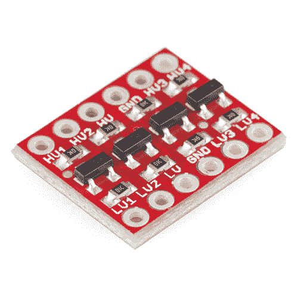
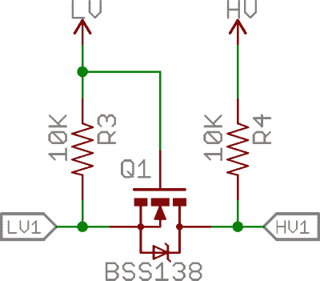
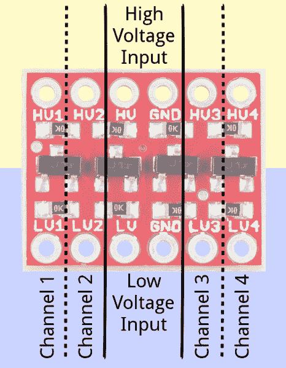
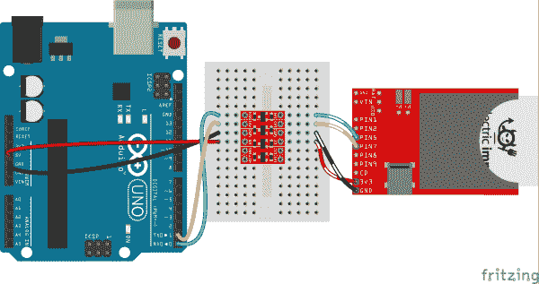
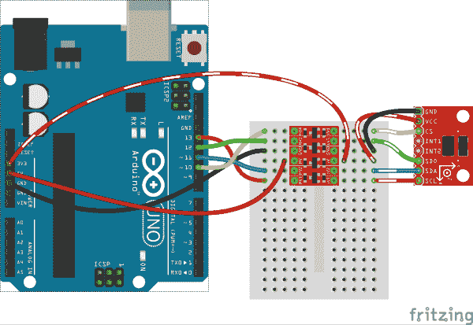

# 双向逻辑电平转换器连接指南

> 原文：<https://learn.sparkfun.com/tutorials/bi-directional-logic-level-converter-hookup-guide>

## 介绍

你有没有一个 3.3V 的 I ² C 或 SPI 传感器，如果连接到 5V 的 Arduino 上可能会化为乌有？或者一个 5V 的设备，需要一个变通办法来兼容你的 3.3V [树莓 Pi 4](https://www.sparkfun.com/products/15447) 、[树莓 Pi Zero](https://www.sparkfun.com/products/15470) 、 [RedBoard Turbo](https://www.sparkfun.com/products/14812) 、 [RedBoard Turbo](https://www.sparkfun.com/products/14812) 或 [Arduino Due](https://www.sparkfun.com/products/11589) ？

为了克服这一障碍，你需要一个可以将 3.3V 转换到 5V 或 5V 转换到 3.3V 的器件。这称为逻辑电平转换。电平转换是一个如此常见的难题，我们设计了一个简单的 PCB 组件来使接口设备变得更简单:双向逻辑电平转换器。

 

将**添加到您的[购物车](https://www.sparkfun.com/cart)中！**

 **### [SparkFun 逻辑电平转换器-双向](https://www.sparkfun.com/products/12009)

[In stock](https://learn.sparkfun.com/static/bubbles/ "in stock") BOB-12009

SparkFun 双向逻辑电平转换器是一个小型设备，可以安全地将 5V 信号降压至 3.3V，并升压 3。…

$3.50116[Favorited Favorite](# "Add to favorites") 146[Wish List](# "Add to wish list")** **[https://www.youtube.com/embed/K3SPijvXtew/?autohide=1&border=0&wmode=opaque&enablejsapi=1](https://www.youtube.com/embed/K3SPijvXtew/?autohide=1&border=0&wmode=opaque&enablejsapi=1)

尽管它们具有相同的形状和尺寸，但这种双向逻辑电平转换器不应与更“单向”的版本相混淆。该转换器可以在**所有通道**上从高到低*和/或从低到高*传递数据。它非常适合共享数据线的器件之间的电平转换，如 [I ² C](https://learn.sparkfun.com/tutorials/i2c) 或单线接口。

### 本教程涵盖的内容

在本教程中，我们将深入了解双向逻辑电平转换器。我们将研究原理图和电路板布局，解释电路板上每个引脚的作用。最后，我们将讨论一些连接示例，展示如何为各种接口连接电路板。

### 推荐阅读

如果您不熟悉以下概念，我们建议您在继续之前查看这些教程。

 [### 如何焊接:通孔焊接](https://learn.sparkfun.com/tutorials/how-to-solder-through-hole-soldering) This tutorial covers everything you need to know about through-hole soldering.[Favorited Favorite](# "Add to favorites") 70 [### 使用导线](https://learn.sparkfun.com/tutorials/working-with-wire) How to strip, crimp, and work with wire.[Favorited Favorite](# "Add to favorites") 50 [### 如何使用试验板](https://learn.sparkfun.com/tutorials/how-to-use-a-breadboard) Welcome to the wonderful world of breadboards. Here we will learn what a breadboard is and how to use one to build your very first circuit.[Favorited Favorite](# "Add to favorites") 79 [### 什么是 Arduino？](https://learn.sparkfun.com/tutorials/what-is-an-arduino) What is this 'Arduino' thing anyway? This tutorials dives into what an Arduino is and along with Arduino projects and widgets.[Favorited Favorite](# "Add to favorites") 50 [### 逻辑电平](https://learn.sparkfun.com/tutorials/logic-levels) Learn the difference between 3.3V and 5V devices and logic levels.[Favorited Favorite](# "Add to favorites") 82

## 主板概述

如果你看一下电路板的[原理图](https://cdn.sparkfun.com/datasheets/BreakoutBoards/Logic_Level_Bidirectional.pdf)，你会发现双向逻辑电平转换器(让我们简称为 BD-LLC)实际上是一个非常简单的器件。板上基本上有一个电平转换电路，重复四次以创建四个电平转换通道。该电路使用一个 N 沟道 MOSFET 和一对上拉电阻来实现双向电平转换。

*The bi-directional level-shifting circuit used on all four channels of the BD-LLC.*

通过一些半导体魔法，该电路可以将低电压信号转换为高电压信号*和/或将高电压信号转换为低电压信号*。一端的 0V 信号在另一端保持 0V 信号。欲了解该电路的完整分析，请查看这篇出色的[飞利浦应用笔记 AN97055](http://cdn.sparkfun.com/tutorialimages/BD-LogicLevelConverter/an97055.pdf) 。

### 引脚排列

BD-LLC 上总共有 12 个引脚——两排平行的六个接头。一行包含所有高电压(例如 5V)输入和输出，另一行包含所有低电压(例如 3.3V)。

这些引脚在电路板的底部和顶部都有标签，并被组织成组。让我们仔细看看一些引脚组:

#### 电压输入

标有***HV******LV***和两个 ***GND*** 的引脚为电路板提供高低**电压参考**。向这两个输入端提供稳定的调节电压是**所要求的**。

提供给*高压*和 *GND* 输入的电压应该高于提供给*低压*侧的电压。例如，如果您连接 5V 至 3.3V，则 *HV* 引脚上的电压应为 5V，而 *LV* 引脚上的电压应为 3.3V。

#### 数据通道

BD-LLC 上有四个独立的数据通道，每个通道都能够在高电压和低电压之间来回转换数据。这些引脚分别标有 ***HV1*** 、 ***LV1*** 、 ***HV2*** 、 ***LV2*** 、 ***HV3*** 、 ***LV3*** 、 ***HV4*** 和***LV4*每个标签末尾的数字表示引脚的通道，前缀 *HV* 或 *LV* 决定它是在通道的高端还是低端。****

例如，送入 *LV1* 的低电压信号将被提升到更高的电压并送出 *HV1* 。 *HV3* 送来的东西会降档送出 *LV3* 。根据项目需要，尽可能多地使用这些通道。你不必用每一个。

请记住，这些电平转换器是纯数字的。他们不能将模拟电压从一个最大电压映射到另一个最大电压。

## 连接示例

### 装配

在你把转换器插入你的系统之前，你需要[焊接](https://learn.sparkfun.com/tutorials/how-to-solder-through-hole-soldering)一些东西进去。这里有很多选择。你可以焊接[直插头](https://www.sparkfun.com/products/116)，并将其直接插入试验板。或者你可能想把[线](https://www.sparkfun.com/products/11375)直接焊接进去。选择一种与您打算如何使用电路板相融合的组装方法。

一旦你的 BD-LLC 焊接好了，是时候把它连接起来了。根据您使用的通信接口，您的连接可能会有所不同。下面我们将展示如何为三种最常见的通信协议挂接电平转换器。

### 将 BD-LLC 用于串行

虽然你不会利用 BD-LCC 的双向能力，但使用该板来转换[串行通信](https://learn.sparkfun.com/tutorials/serial-communication)是完全可以的。串行通常需要两条信号线- *RX* (接收)和 *TX* (发送)——它们都有一个确定的方向。这些信号可以通过 BD-LLC 上四个通道中的任何一个。

比方说，你想通过 UARTs 将一个[电动分线板](https://www.sparkfun.com/products/11400)(最大输入电压为 3.6V)连接到一个 [Arduino Uno](https://www.sparkfun.com/products/11021) 。这里有一个可能的连接:

*Please note that the Arduino and the Electric both have their own power supplies in this example.*

确保*低压*的供电电压为 3.3V，*高压*的供电电压为 5V。仔细检查通道是否匹配，然后你就可以换档了！你甚至可以随心所欲地转换两个额外的频道。

### 将 BD-LLC 用于 SPI

BD-LLC 的四个通道是大多数 [SPI 通信](https://learn.sparkfun.com/tutorials/serial-peripheral-interface-spi)的完美匹配。SPI 通常需要四根线:MOSI(主机输出、从机输入)、MISO(主机输入、从机输出)、SCLK(串行时钟)和 CS(片选)。这四条线都可以通过 BD-LLC 上的通道布线。

例如，如果您想将 Arduino 连接到工作范围为 2.0-3.6V 的 [ADXL345 分线板](https://www.sparkfun.com/products/9836)，BD-LLC 的拼接方法如下:

由于 BD-LLC 上的每个通道都是双向的，因此四条 SPI 线路中的任何一条都可以通过 BD-LLC 的四个通道中的任何一个。

### 将 BD-LLC 用于 I ² C

BD-LLC 真正出彩的地方是通信标准，因为它要求数据和时钟信号——SDA 和 SCL——都是双向的。每条线路都可以通过 BD-LLC 的电平转换通道。

对于本例，我们继续使用 ADXL345 分线点，但改用 I ² C 接口。我们甚至可以添加另一个 I ² C 装置... [L3G4200D 陀螺仪突围](https://www.sparkfun.com/products/10612)怎么样？由于 I ² C 只是一个双线接口，我们在 BD-LLC 上有空间来容纳几个额外的信号，比如来自每个板的中断输出

两个 3.3V I ² C 器件可以共享相同的电平转换 SDA 和 SCL 线。甚至可以添加更多的 I ² C 设备，只要它们有唯一的地址。

## 资源和更进一步

以下是一些与 LLC 和电平转换相关的资源:

*   [示意图(PDF)](https://cdn.sparkfun.com/datasheets/BreakoutBoards/Logic_Level_Bidirectional.pdf)
*   [老鹰文件(ZIP)](https://cdn.sparkfun.com/datasheets/BreakoutBoards/Logic_Level_Bidirectional.zip)

*   [GitHub 回购](https://github.com/sparkfun/Logic_Level_Bidirectional)
*   [SFE 产品展示区](https://www.youtube.com/watch?v=K3SPijvXtew)

如果您正在寻找使用 LLC 的地方，这些教程可能会激发一些想法:

*   [使用 Arduino Pro Mini 3.3V](https://learn.sparkfun.com/tutorials/using-the-arduino-pro-mini-33v) -如果你想坚持使用 Arduino，并想使用 3.3V 传感器，考虑使用运行在 3.3V 的 Arduino。这样你甚至不需要麻烦 LLC！**