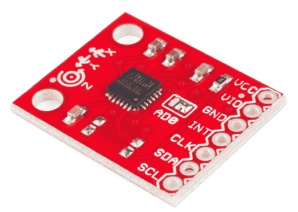
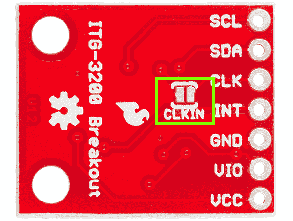
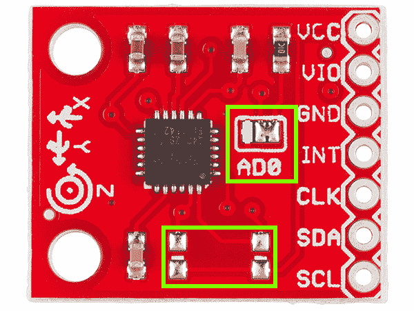
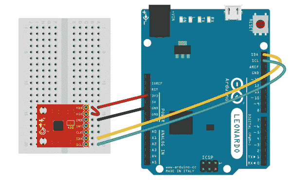

# ITG-3200 连接指南

> 原文：<https://learn.sparkfun.com/tutorials/itg-3200-hookup-guide>

## 介绍

这是一款突破性的三轴数字输出陀螺仪 [InvenSense 的 ITG-3200](https://www.sparkfun.com/products/11977) 的分线板。ITG-3200 具有三个用于数字化陀螺仪输出的 16 位模数转换器(ADC)、一个用户可选的内部低通滤波器带宽和一个快速模式 I ² C (400kHz)接口。其他特性包括嵌入式温度传感器和 2%精度的内部振荡器。

[](https://www.sparkfun.com/products/11977)

本教程将帮助您在下一个项目中开始使用 ITG-3200。我们将介绍硬件，简要讨论代码，然后向您展示如何将其连接到微控制器。

### 推荐阅读

本教程建立在一些基本概念之上。如果你对下面的任何话题都不熟悉，那就去看看吧。我们会在这里等着。

*   [Arduino 是什么？](https://learn.sparkfun.com/tutorials/what-is-an-arduino)
*   [陀螺仪基础知识](https://learn.sparkfun.com/tutorials/gyroscope)
*   [I ² C 通信](https://learn.sparkfun.com/tutorials/i2c)
*   [串行终端基础知识](https://learn.sparkfun.com/tutorials/terminal-basics)
*   [如何焊接](https://learn.sparkfun.com/tutorials/how-to-solder-through-hole-soldering)
*   [试验板基础知识](https://learn.sparkfun.com/tutorials/how-to-use-a-breadboard)

## 硬件概述

### 力量

ITG-3200 可以在 **2.1 到 3.6V** 之间的任何电压供电。为了电源的灵活性，ITG-3200 有一个单独的 VLOGIC 参考引脚(标为 **VIO** )，除了它的模拟电源引脚( **VDD** )，它设置其串行接口的逻辑电平。VLOGIC 电压可以是 1.71V 最小值到 VDD 最大值之间的任何值。对于一般用途，VLOGIC 可以绑定到 VCC。该传感器的正常工作电流仅为 6.5 毫安

### 沟通

通过双线(I ² C)接口实现与 ITG-3200 的通信。该传感器还具有中断输出和可选的时钟输入。

### 时钟源跳线

在下一张图片中，你可以看到一个小跳线旁边的引脚标记为“CLK”ITG-3200 具有允许您连接外部时钟的功能。除非您计划使用外部时钟，否则您需要通过用焊料连接两个焊盘来**‘关闭’**该跳线。如果您遵循本教程并使用提供的示例代码，请继续并关闭跳线。

[](https://cdn.sparkfun.com/assets/8/c/a/7/c/525f1999757b7f05508b4567.jpg)***Make sure you close this jumper with solder if you're NOT using an external clock source.***

### I ² C 地址跳线

电路板顶部的跳线允许您通过将 AD0 引脚拉至 VCC 或 GND，轻松选择 I ² C 地址；该板与连接到 VCC 的跳线一起装运。

### I ² C 上拉电阻

注意，在 I ² C 线上有两个未组装的[上拉电阻](https://learn.sparkfun.com/tutorials/pull-up-resistors)。如果需要，这些可以由用户稍后添加。

[](https://cdn.sparkfun.com/assets/c/b/f/f/5/525f1999757b7fbd508b4568.png)*Here the I²C address jumper (top) and the unpopulated I²C pull-up resistors (bottom) are highlighted.*

## 连接起来

组装 ITG-3200 分线点只有两个考虑因素:如何处理接头，以及是否要为 ITG-3200 使用外部时钟源。

对于接头，您有两种选择，您可以焊接公或母 0.1 英寸接头，或者您可以直接将电线焊接到分线板的孔中。在这个例子中，[公接头](https://www.sparkfun.com/products/116)被焊接到分线板上，以便于连接到[试验板](https://learn.sparkfun.com/tutorials/how-to-use-a-breadboard)。然后，我们将使用一些[凸对凸跳线](https://www.sparkfun.com/products/8431)将 ITG-3200 连接到 [Arduino Leonardo](https://www.sparkfun.com/products/11286) 。

其次，由于我们在此设置中不会使用外部时钟源，请确保 ITG-3200 底部的 CLKIN 跳线用一滴焊料封闭。

[](https://cdn.sparkfun.com/assets/6/5/b/a/e/52602800757b7fb8518b4568.jpg)*Here's everything all hooked up. Make sure you add the small jumper from VDD to VIO to ensure they are both connected to 3.3V.*

SDA 和 SCL 引脚应该出现在大多数 Arduinos 上。较旧的 rev3 之前的 Arduinos 可能没有 SCL 和 SDA 引脚。在这种情况下，将 SDA 连接到 **A4** ，将 SCL 连接到 **A5** 。

ITG3200 传感器是一个 3.3V 器件。这意味着传感器应该由 3.3V 供电，通信信号应该在 0V 和 3.3V 之间。Arduino Leonardo(和其他类似的板)是 5V 设备。即使我们使用 Arduino 的 3.3V 输出为电路板供电，通信信号仍然是 5V。从技术上讲，应该避免这种情况，因为从长远来看，这可能会损坏传感器。当在最终项目中实现这种陀螺仪时，使用类似于[逻辑电平转换器](https://learn.sparkfun.com/tutorials/using-the-logic-level-converter)的东西来改变通信信号的电压对您最有利。你也可以使用一个 [Arduino Pro (3.3V/8 MHz)](https://www.sparkfun.com/products/10914) 。然而，为了测试你的陀螺仪，使用一个 5V 的设备应该工作良好。

这就是全部了！现在，让我们看一些代码来启动和运行这个陀螺仪。

## 固件

我们终于准备好开始查看固件了。我们已经写了一个示例 Arduino 草图来帮助你开始。你可以从 [ITG-3200 GitHub 页面](https://github.com/sparkfun/ITG-3200_Breakout)下载固件。

示例草图读取 X、Y 和 Z 轴的陀螺仪数据，并将其打印到串行端口。这是原始陀螺仪数据，还没有转换成每秒度数。数字越大意味着设备旋转越快。正数表示一个旋转方向，负数表示相反的旋转方向。由于这是一个三轴陀螺仪，因此无论电路板朝哪个方向旋转，我们都可以测量电路板的转速。旋转通常以每秒度数来衡量。如果板子在一秒钟内围绕一个轴恰好旋转一周，陀螺仪测量的角度就是每秒 360 度。

现在，让我们将代码分成几个部分，更深入地了解一下发生了什么。

```
language:c
//The Wire library is used for I2C communication
#include <Wire.h>

//This is a list of registers in the ITG-3200\. Registers are parameters that determine how the sensor will behave, or they can hold data that represent the
//sensors current status.
//To learn more about the registers on the ITG-3200, download and read the datasheet.
char WHO_AM_I = 0x00;
char SMPLRT_DIV= 0x15;
char DLPF_FS = 0x16;
char GYRO_XOUT_H = 0x1D;
char GYRO_XOUT_L = 0x1E;
char GYRO_YOUT_H = 0x1F;
char GYRO_YOUT_L = 0x20;
char GYRO_ZOUT_H = 0x21;
char GYRO_ZOUT_L = 0x22;

//This is a list of settings that can be loaded into the registers.
//DLPF, Full Scale Register Bits
//FS_SEL must be set to 3 for proper operation
//Set DLPF_CFG to 3 for 1kHz Fint and 42 Hz Low Pass Filter
char DLPF_CFG_0 = 1<<0;
char DLPF_CFG_1 = 1<<1;
char DLPF_CFG_2 = 1<<2;
char DLPF_FS_SEL_0 = 1<<3;
char DLPF_FS_SEL_1 = 1<<4;

//I2C devices each have an address. The address is defined in the datasheet for the device. The ITG-3200 breakout board can have different address depending on how
//the jumper on top of the board is configured. By default, the jumper is connected to the VDD pin. When the jumper is connected to the VDD pin the I2C address
//is 0x69.
char itgAddress = 0x69; 
```

这是草图的配置部分。看起来比实际复杂！首先，我们包含了 Arduino IDE 的标准库 **"Wire.h"** 。这个库用于 I ² C 通信，这是 ITG-3200 使用的通信协议。

接下来，是分配给 ITG-3200 不同寄存器的变量列表。寄存器主要用于做两件事:为传感器配置参数，或者保存传感器收集的数据。当我们想要与传感器的寄存器交互时，我们必须告诉传感器我们想要使用哪个寄存器地址。寄存器列表之后是寄存器参数的简短列表。这只是该草图使用的参数列表。ITG-3200 数据手册中列出了许多本例中没有用到的参数。

最后，在参数列表之后，是`itgAddress`变量。这是 ITG-3200 的 I ² C 地址。数据表中还列出了传感器的 I ² C 地址。请记住，该地址直接受 PCB 顶部跳线配置的影响。

```
language:c
//In the setup section of the sketch the serial port will be configured, the i2c communication will be initialized, and the itg-3200 will be configured.
void setup()
{
  //Create a serial connection using a 9600bps baud rate.
  Serial.begin(9600);

  //Initialize the I2C communication. This will set the Arduino up as the 'Master' device.
  Wire.begin();

  //Read the WHO_AM_I register and print the result
  char id=0; 
  id = itgRead(itgAddress, 0x00);  
  Serial.print("ID: ");
  Serial.println(id, HEX);

  //Configure the gyroscope
  //Set the gyroscope scale for the outputs to +/-2000 degrees per second
  itgWrite(itgAddress, DLPF_FS, (DLPF_FS_SEL_0|DLPF_FS_SEL_1|DLPF_CFG_0));
  //Set the sample rate to 100 hz
  itgWrite(itgAddress, SMPLRT_DIV, 9);
} 
```

代码的设置部分非常短。首先，我们创建一个串行连接，以便将数据打印到终端窗口。然后我们初始化 I ² C 通信协议。现在 Arduino 已经准备好开始与 ITG-3200 交互。大多数传感器都有某种识别寄存器。验证通信工作正常的一个好方法是读取识别寄存器，并确保结果有效。读取识别寄存器后，将几个值写入 ITG-3200 上的一些寄存器，以配置陀螺仪以 100hz 读取数据，并测量高达 2000 度/秒的转速。稍后将解释 itgRead 和 itgWrite 函数。一旦器件完成配置，就可以读取实际的陀螺仪数据。

```
language:c
//The loop section of the sketch will read the X,Y and Z output rates from the gyroscope and output them in the Serial Terminal
void loop()
{
  //Create variables to hold the output rates.
  int xRate, yRate, zRate;
  //Read the x,y and z output rates from the gyroscope.
  xRate = readX();
  yRate = readY();
  zRate = readZ();
  //Print the output rates to the terminal, seperated by a TAB character.
  Serial.print(xRate);
  Serial.print('\t');
  Serial.print(yRate);
  Serial.print('\t');
  Serial.println(zRate);  

  //Wait 10ms before reading the values again. (Remember, the output rate was set to 100hz and 1reading per 10ms = 100hz.)
  delay(10);
} 
```

代码的循环部分通常是草图的“肉”,在这种情况下，循环非常简单。该草图使用 readX()、readY()和 readZ()函数读取 X、Y 和 Z 陀螺仪值。存储这些值后，它们被打印到串行终端。我们在循环结束时延迟 10 ms，这样我们就不会试图以超过传感器提供的速度读取信息。为了使代码的设置和循环部分看起来简单，我们必须使用几个函数，让我们看看这些函数是如何工作的。

```
language:c
//This function will write a value to a register on the itg-3200.
//Parameters:
// char address: The I2C address of the sensor. For the ITG-3200 breakout the address is 0x69.
// char registerAddress: The address of the register on the sensor that should be written to.
// char data: The value to be written to the specified register.
void itgWrite(char address, char registerAddress, char data)
{
  //Initiate a communication sequence with the desired i2c device
  Wire.beginTransmission(address);
  //Tell the I2C address which register we are writing to
  Wire.write(registerAddress);
  //Send the value to write to the specified register
  Wire.write(data);
  //End the communication sequence
  Wire.endTransmission();
}

//This function will read the data from a specified register on the ITG-3200 and return the value.
//Parameters:
// char address: The I2C address of the sensor. For the ITG-3200 breakout the address is 0x69.
// char registerAddress: The address of the register on the sensor that should be read
//Return:
// unsigned char: The value currently residing in the specified register
unsigned char itgRead(char address, char registerAddress)
{
  //This variable will hold the contents read from the i2c device.
  unsigned char data=0;

  //Send the register address to be read.
  Wire.beginTransmission(address);
  //Send the Register Address
  Wire.write(registerAddress);
  //End the communication sequence.
  Wire.endTransmission();

  //Ask the I2C device for data
  Wire.beginTransmission(address);
  Wire.requestFrom(address, 1);

  //Wait for a response from the I2C device
  if(Wire.available()){
    //Save the data sent from the I2C device
    data = Wire.read();
  }

  //End the communication sequence.
  Wire.endTransmission();

  //Return the data read during the operation
  return data;
}

//This function is used to read the X-Axis rate of the gyroscope. The function returns the ADC value from the Gyroscope
//NOTE: This value is NOT in degrees per second.
//Usage: int xRate = readX();
int readX(void)
{
  int data=0;
  data = itgRead(itgAddress, GYRO_XOUT_H)<<8;
  data |= itgRead(itgAddress, GYRO_XOUT_L);

  return data;
}

//This function is used to read the Y-Axis rate of the gyroscope. The function returns the ADC value from the Gyroscope
//NOTE: This value is NOT in degrees per second.
//Usage: int yRate = readY();
int readY(void)
{
  int data=0;
  data = itgRead(itgAddress, GYRO_YOUT_H)<<8;
  data |= itgRead(itgAddress, GYRO_YOUT_L);

  return data;
}

//This function is used to read the Z-Axis rate of the gyroscope. The function returns the ADC value from the Gyroscope
//NOTE: This value is NOT in degrees per second.
//Usage: int zRate = readZ();
int readZ(void)
{
  int data=0;
  data = itgRead(itgAddress, GYRO_ZOUT_H)<<8;
  data |= itgRead(itgAddress, GYRO_ZOUT_L);

  return data;
} 
```

这张草图中有五个功能，但其中三个非常相似。第一个函数`itgWrite()`，用于将数值写入 ITG-3200 上的寄存器。要使用这个函数，必须提供三个参数:地址、注册地址和数据。该地址是传感器的 I ² C 地址。事实证明，不止一个传感器可以同时连接到 I ² C 引脚。为了让传感器知道谁应该得到数据，它们每个都有一个唯一的地址。这就是我们提供的“地址”参数。第二个参数是 registerAddress。正如我们之前讨论的，大多数传感器都有一组寄存器，每个寄存器都有自己的地址。最后一个参数是要写入地址的数据。我们可以通过向寄存器地址写入数据来配置传感器的参数。

下一个函数是`itgRead()`函数。该功能允许我们读取存储在传感器寄存器中的数据。itgRead 函数需要两个参数，它返回一个字符值。参数类似于`itgWrite()`功能中的参数；地址是我们要读取的传感器的 I ² C 地址，寄存器地址是我们要读取的寄存器的地址。该函数将寄存器的内容发送回来。

### 运行草图

将 ITG-3200 分线板连接到 Arduino 后，您可以上传 ITG3200 基本 Arduino 草图。要查看陀螺仪的数据，只需[打开波特率设置为 9600 的串行端子](https://learn.sparkfun.com/tutorials/terminal-basics)。您将看到值几乎立即开始流过终端窗口。在端子的每一行上，有三个值:x、y 和 z 旋转值。请记住，我们没有将该数据转换为每秒度数，因此正在传输的值是来自 ITG-3200 的 [ADC 值](https://learn.sparkfun.com/tutorials/analog-to-digital-conversion)。您可能还会注意到，即使陀螺仪静止不动(不朝任何方向旋转)，这些值也不会报告为 0。这是因为陀螺仪存在固有偏差。为了获得准确的测量结果，你需要校准读数。您可以在草图中通过读取传感器静止时的输出值，并将它们存储到一些变量中来实现这一点。然后，当读取传感器值时，只需用校准值抵消读数。

## 资源和更进一步

您现在应该对 ITG-3200 的工作原理有了很好的理解。现在出去做一些很酷的项目吧！如果你需要更多关于 ITG-3200 的信息，请务必查看[数据表](https://www.sparkfun.com/datasheets/Sensors/Gyro/PS-ITG-3200-00-01.4.pdf)。

想了解更多关于陀螺仪的信息吗？查看我们的[购买指南](https://www.sparkfun.com/pages/accel_gyro_guide),了解 SparkFun 提供的各种产品。