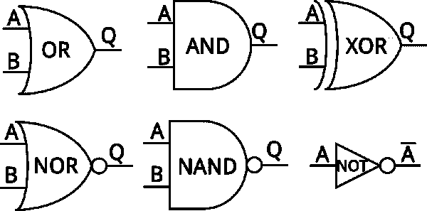
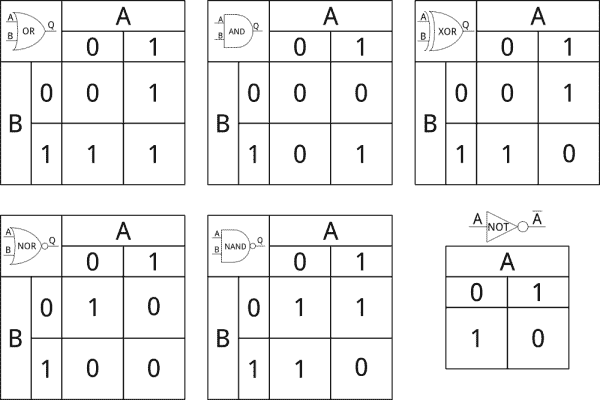
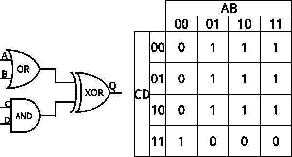
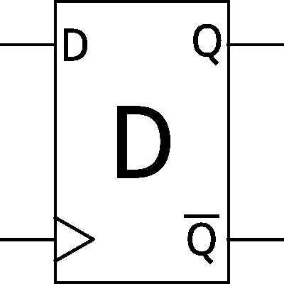
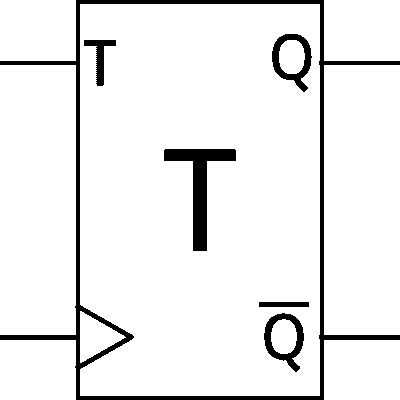
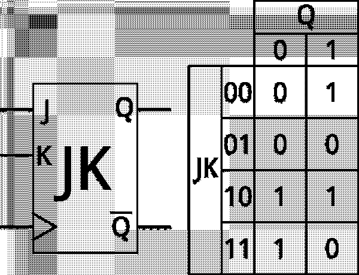
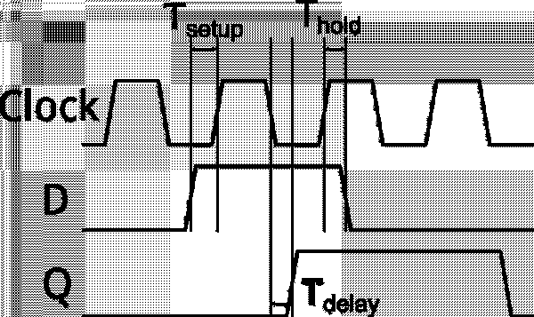
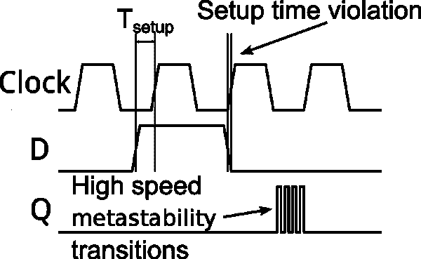

# 数字逻辑

> 原文：<https://learn.sparkfun.com/tutorials/digital-logic>

## 介绍

数字逻辑或布尔逻辑是支撑所有现代计算机系统的基本概念。简而言之，它是一个规则系统，允许我们基于相对简单的“是/否”问题做出极其复杂的决定。

在本教程中，您将了解...

### 数字电路

数字逻辑电路可以分为两个子类别- **组合**和**时序**。组合逻辑“立即”改变——输入一改变，电路的输出就立即响应(当然有一些延迟，因为信号通过电路元件的传播需要一点时间)。时序电路具有时钟信号，并且变化在时钟的边沿通过电路的级传播。

典型地，时序电路将由被时钟信号激活的存储元件分隔的组合逻辑块构成。

### 编程；编排

数字逻辑在编程中也很重要。理解数字逻辑使得在程序中做出复杂的决策成为可能。

编程中也有一些微妙之处，理解起来很重要；一旦我们学完了基础知识，我们就会进入那个领域。

### 推荐阅读

在开始之前，如果你还没有看过我们的关于二进制数的[教程，这可能是个好主意。那里有少量关于布尔逻辑的讨论，但是我们将在这里更深入地讨论这个主题。在开始之前，这里有一些您应该熟悉的其他主题。](https://learn.sparkfun.com/tutorials/binary)

*   [什么是电？](https://learn.sparkfun.com/tutorials/what-is-electricity)
*   [二进制](https://learn.sparkfun.com/tutorials/binary)
*   [模拟 vs 数字](https://learn.sparkfun.com/tutorials/analog-vs-digital)
*   [逻辑电平](https://learn.sparkfun.com/tutorials/logic-levels)

## 组合逻辑

[](https://cdn.sparkfun.com/assets/3/4/7/5/e/51e5c089ce395f8d16000000.png)

组合电路由五个基本逻辑门组成:

*   如果两个输入都为 1，则与门输出为 1
*   如果至少一个输入为 1，则 OR 门输出为 1
*   异或门-如果只有一个输入为 1，则输出为 1
*   与非门-如果至少一个输入为 0，则输出为 1
*   如果两个输入都为 0，或非门输出为 1

数字逻辑中还有第六个元素，即反相器(有时称为非门)。反相器不是真正的门，因为它们不做任何决定。如果输入为 0，反相器的输出为 1，反之亦然。

关于上图，有几点需要注意:

*   通常大门的名字是*不是*印出来的；假设该符号足以识别。
*   A-B-Q 型端子符号是标准的，尽管逻辑图通常会省略掉那些不是系统整体输入或输出的信号。
*   两个输入设备是标准的，但你偶尔会看到设备有两个以上的输入。然而，它们只有一个输出。

数字逻辑电路通常用这六个符号来表示；输入在左边，输出在右边。虽然输入可以连接在一起，但输出不应相互连接，只能连接到其他输入。然而，一个输出可以连接到多个输入。

### 真值表

上面的描述足以描述单个块的功能，但是还有一个更有用的工具:真值表。真值表是简单的图表，它根据电路的可能输入来解释电路的输出。以下是描述六个主要元素的真值表:

[](https://cdn.sparkfun.com/assets/9/e/4/5/b/524f44a3757b7fc74a8b4567.png)

真值表可以扩展到任意的规模，在你的大脑融化之前，你可以处理尽可能多的输入和输出。四输入电路和真值表如下所示:

[](https://cdn.sparkfun.com/assets/d/4/f/8/f/51e5c089ce395f6916000000.png)

### 书面布尔逻辑

当然，能够用简单的数学格式写出一个表示逻辑运算的方程是很有用的。为此，独特的运算有数学符号:与、或、异或和非。

*   A 和 B 应该写成 AB(有时也可以写成 AB)
*   A 或 B 应该写成 A + B
*   XOR B 应该写成⊕ B
*   不是 A 应该写成 A '或者 A

你会注意到列表中缺少两个元素:NAND 和 NOR。通常，这些只是通过补充适当的表示来表示:

*   A NAND B 写为(AB)'、(AB)'或 (AB)
*   A NOR B 写作(A + B)'或 (A + B)

## 时序逻辑

组合逻辑是伟大的，但没有增加时序电路，现代计算是不可能的。

时序电路给我们的逻辑系统增加了记忆。如前所述，组合逻辑在延迟后产生结果。这种延迟因很多很多因素而异:相关部件的制造工艺、硅的温度、电路的复杂性。如果一个电路的输出依赖于来自两个其他组合电路的结果，并且这些结果在不同的时间到达(在现实世界中它们会到达)，则组合电路将短暂地“失灵”，输出可能与期望的操作不一致的结果。

然而，时序电路仅在特定时间采样和传播输出。如果输入在这两个时间之间发生变化，它将被忽略。采样时间通常在整个电路中保持同步，被称为“时钟”。当引用计算机的“速度”时，这就是所讨论的值。有可能设计出不依赖于同步全局时钟的“异步”时序电路。然而，这些系统带来了很大的困难，我们不会在这里讨论它们。

顺便提一下，数字逻辑的任何部分都有两个特征延迟值:最小延迟时间和最大延迟时间。如果电路在最小延迟时间(即，比它应该的时间更快)失败，电路将失败，不可挽回地失败。如果该电路是更大设备的一部分，如计算机 CPU，整个设备就是垃圾，不能使用。如果最大延迟时间失效(即，电路比它应该的要慢)，可以降低时钟速度以适应系统中最慢的电路。随着构成电路的硅变热，最大延迟时间往往会增加，这就是为什么当计算机过热或时钟速度增加时会变得不稳定(超频就是这种情况)。

### 时序电路元件

如同组合逻辑的情况一样，有几个基本的电路元件形成了时序电路的构建块。这些模块由基本的组合元件构成，使用来自输出的反馈来稳定输入。它们有两种“口味”:锁存器和触发器。虽然这两个术语经常互换使用，但锁存器通常用处不大，因为它们没有时钟控制；我们将集中讨论人字拖。

#### d 型触发器

[](https://cdn.sparkfun.com/assets/3/3/c/0/9/51e5c089ce395fc915000000.png)

最简单的触发器是 D 型触发器。d 触发器很简单——在时钟沿(通常为上升沿，但也可以通过内置反相器在下降沿输入)时，输入锁存到输出。

通常，时钟输入由符号上的小三角形表示。大多数触发器提供两个输出:“正常”输出和互补输出。

#### t 型触发器

[](https://cdn.sparkfun.com/assets/3/0/e/e/b/51e5c089ce395f8416000000.png)

只是稍微复杂一点的是 T 型。“T”代表“切换”当时钟边沿出现时，如果输入 T 为 1，则输出改变状态。如果输入为 0，输出保持不变。与 D 型一样，通常提供输出的补码。

T 触发器的一个有用功能是作为时钟分频电路。如果 T 保持高电平，输出将是时钟频率除以 2。因此，T 触发器链可以用来从器件的主时钟产生较慢的时钟。

#### JK 型触发器

[](https://cdn.sparkfun.com/assets/d/a/3/2/c/51e5c089ce395f8b16000000.png)

最后，我们有 JK 型。JK 型是三种类型中唯一真正需要真值表来解释的类型；它有两个输入(J 和 K)，输出可以保持不变、置位、清零或切换，具体取决于存在的输入信号组合。当然，与所有触发器一样，时钟时刻的输入是唯一重要的事情。

### 建立、保持和传播时间

所有时序电路都有所谓的“**设置**”和“**保持**时间，以及一个**传播延迟**。理解这三点对于设计按预期工作的时序电路至关重要。

建立时间是在时钟上升沿出现之前信号必须到达触发器输入端以使触发器正确锁存数据的最短时间。同样，保持时间是信号在时钟上升沿出现后允许改变之前必须保持稳定的最短时间。

虽然建立和保持时间是最小值，但传播延迟是最大值。简而言之，传播延迟是指时钟下降沿之后，在输出端看到信号之前的最长时间。以下是解释它们的图表:

[](https://cdn.sparkfun.com/assets/7/c/8/9/f/51e5c089ce395f8a16000000.png)

请注意，在上面的图像中，过渡被绘制为略微倾斜。这有两个目的:它提醒我们时钟和数据边沿*永远不会*真正成直角，并且总是有一些非零的上升或下降时间，并且它使得更容易看到标记各种时间的垂直线与信号相交的位置。

这三个值的组合决定了器件可以使用的最高时钟速度。如果电路中一个器件的传播延迟加上下一个器件的建立时间超过一个时钟脉冲的下降沿与下一个时钟脉冲的上升沿之间的时间，则第二个器件的输入端上的数据将不稳定，导致其以意外的方式运行。

### 亚稳定性

不遵守建立和保持时间可能会导致“亚稳态”问题。当电路处于亚稳态时，触发器的输出可以在两个正常状态之间快速振荡，其频率通常远高于电路的时钟频率。

[](https://cdn.sparkfun.com/assets/learn_tutorials/9/7/51e5c088ce395f7016000000_2.png)

亚稳态问题的范围可以从寄生操作到芯片损坏，因为它们会增加电流消耗。虽然亚稳态通常会自行解决，但当它解决时，系统可能处于完全未知的状态，需要完全复位才能恢复正常运行。

亚稳态问题产生的一个常见原因是信号跨越时钟域，换句话说，信号在由不同时钟源提供时钟的器件之间传递。由于时钟不同步(即使时钟处于相同的标称频率，实际情况表明它们会*稍微*不同)，最终时钟边沿和数据边沿必然会过于接近，导致建立时间冲突。解决这个问题的一个简单方法是通过一对级联的 D 触发器将所有输入送入系统。即使第一个触发器进入亚稳态，它也将(希望)在下一个时钟脉冲之前稳定到稳态，从而允许第二个触发器读取正确的数据。这会导致输入数据边沿出现一个周期的延迟，与亚稳态的风险相比，这几乎总是微不足道的。

## 程序设计中的布尔逻辑

所有这些也可以应用于编程领域。大多数程序只是简单的决策树:“如果这是真的，那么就这样做”。为了解释这一点，我们将在 Arduino 环境中使用 C 代码。

### 逐位逻辑

当我们谈论“按位”逻辑时，我们真正的意思是返回一个值的逻辑运算。以这段代码为例:

```
language:cpp
byte a = b01010101;
byte b = b10101010;
byte c; 
```

我们可以使用“a”和“b”进行位运算，并将结果放入“c”中。看起来是这样的:

```
c = a & b;  // bitwise AND-ing of a and b; the result is b00000000
c = a | b;  // bitwise OR-ing of a and b; the result is b11111111
c = a ^ b; // bitwise XOR-ing of a and b; the result is b11111111
c = ~a;  // bitwise complement of a; the result is b10101010 
```

换句话说，结果中的每个位等于应用于操作数中两个对应位的运算:

好吧，那很好，但那又怎么样呢？事实证明，通过使用按位运算符来操作寄存器，我们可以做一些非常有用的事情:我们可以选择性地清除、设置或切换单个位，检查一个位是否被设置或清除，或者几个位是否被设置或清除。以下是使用这些操作的一些示例:

```
c = b00001111 & a; // clear the high nibble of a, but leave the low nibble alone.
                                // the result is b00000101.
c = b11110000 | a; // set the high nibble of a, but leave the low nibble alone.
                                // the result is b11110101.
c = b11110000 ^ a; // toggle all the bits in the high nibble of a.
                                // the result is b10100101. 
```

任何按位运算都可以通过与等号组合来自行应用:

```
a ^= b11110000; // XOR a with b11110000 and store the result back in a
b |= b00111100; // OR b with b00111100 and store the result back in b 
```

### 比特移位

另一个有用的可以在数据上执行的位运算是位移。这只是将数据向左或向右滑动一定数量的位置；移出的数据消失，取而代之的是从另一端移入的 0。

```
byte d = b11010110;
byte e = d>>2;  // right-shift d by two positions; e = b00110101
e = e<<3; // left-shift e by three positions; e = b10101000 
```

稍后我们将演示位移的一些用途。移位的一个非常有用的应用是乘法和除法:每次右移相当于除以 2(尽管余数信息丢失了)，每次左移相当于乘以 2。这很有用，因为乘法和除法在小处理器(如 Arduino)上通常是非常耗时的操作，但位移法通常非常有效。

### 比较和关系运算符

我们需要某种方法来比较两个值:有一个操作符家族就是这样做的，并根据比较的结果返回“真”或“假”。

*   `==`“等于”(如果值相等则为真，否则为假)
*   `!=`“不等于”(如果值不同，则为真)
*   `>`“大于”(如果左操作数大于右操作数，则为真)
*   `<`“小于”(如果左操作数小于右操作数，则为真)
*   `>=`“大于或等于”(如果左操作数大于或完全等于右操作数，则为真)
*   `<=`“小于或等于”(如果左操作数小于或完全等于右操作数，则为真)

通常比较的值必须是相同的数据类型，这一点非常重要；例如，如果你比较一个“字节”和一个“整数”，会发生意想不到的事情。

### 逻辑运算符

逻辑运算符是产生“真”或“假”的运算符，而不是产生相同类型的新值。它们更像是我们倾向于认为的连词:“如果没有下雨，有风，去放风筝”。翻译成 C 语言，这句话可能是这样的:

```
if ( (raining != true) && (windy == true) ) flyKite(); 
```

注意两个子子句周围的括号。虽然不是绝对必要的，但是通过将子条款组合在一起尽可能保持代码的可读性是一个好习惯。

还要注意，逻辑 AND 运算符(&&)根据子子句是否产生真/假答案来产生真/假答案。我们可以很容易地在其中一个子子句中有一个数值:

```
if ( (raining != true) && ( (windSpeed >= 5) || (reallyBusy != true) ) ) flyKite(); 
```

这个条款会让我出去放风筝，只要不下雨，但前提是有风或者我不忙(我*会*尝试在没有风的情况下放风筝)。

同样，请注意括号。如果我们去掉“(风速> = 5) ||(真忙！= true)" -用||表示 OR 运算符-我们创建了一个不明确的语句，它可能会也可能不会执行我们希望它执行的操作。

### 流控制

既然我们可以创建复杂的逻辑陈述，让我们看看我们可以用这些问题的答案做些什么。

#### if/else if/else 语句

最简单的决策就是“if/else”。If/else if/else 允许您设置一系列测试，其中任何时候都只能执行一个测试:

```
if ( reallyBusy == true ) workHarder();
else if ( (raining != true) && (windy == true) ) flyKite();
else work(); 
```

有了这三个声明，如果我真的很忙，我就永远不会去放风筝，如果我真的不忙，今天又不是放风筝的好日子，我就继续工作。让我们把 else if()改成 if()，就像这样:

```
if ( reallyBusy == true ) workHarder();
if ( (raining != true) && (windy == true) ) flyKite();
else work(); 
```

现在，如果我们有一个美好的放风筝日，即使我真的很忙，我也只会在非常非常短的时间内更加努力地工作——基本上，直到我注意到天气很好。此外，如果是*而不是*美好的一天，在我开始更加努力工作后，我的更加努力工作状态将立即降级为普通的旧工作！

你可以想象一下，如果我们把“workHarder()”换成“turnLEDOn()”，把“work()”换成“turnLEDOff()”，会发生什么。在第一种情况下，LED 可以打开一段时间，或者关闭一段时间。然而，在第二种情况下，不管“reallyBusy”标志的状态如何，在第一个 if()语句打开 LED 之后，它几乎会立即关闭，并且您会发现自己坐在那里想知道为什么“reallyBusy”灯从不打开！

#### switch/case/默认语句

与一长串 if/else 语句相比，switch/case/default 功能较弱，但可读性更好，它允许您根据变量的值做出决定:

```
switch(menuSelection) {
  case '1':
    doMenuOne();
    break;
  case '2':
    doMenuTwo();
    break;
  case '3':
    doMenuThree();
    break;
  default:
    flyKite();
    break;
} 
```

switch()语句 *only* 允许我们检查等价性，但是因为这是一件很常见的事情，所以非常方便。关于这一点，有两件非常重要的事情需要注意:中断；语句和“默认:”情况。

“default:”是在其他都不匹配的情况下执行的内容。这不是绝对必要的；如果没有默认情况，那么如果所有匹配都失败，什么都不会发生。当然，你通常*希望*有事情发生，最好不要假设不可能所有匹配都失败。

“打破；”跳出当前条件。它可以在任何类型的条件中使用(后面会详细介绍)，在这种情况下，如果在每个案例的结尾没有包含一个 break，那么即使后续的案例匹配失败了，也会导致代码在案例执行后出现*。*

#### while/do...while 循环

到目前为止，我们已经看了一次做决定的代码。如果你想一遍又一遍地重复一个动作，只要条件成立，该怎么办？这就是 while()和 do...而()开始发挥作用。

```
while (windy == true) flyKite(); 
```

当您的代码到达 while()语句时，程序会计算条件语句(“有风吗？”)并且，如果计算结果为“真”，则执行代码。代码执行完成后，将再次计算条件。如果条件仍然为“真”，代码将再次执行。这一过程不断重复，直到条件计算结果为“FALSE”或遇到 break 语句。

您可以在 while()循环中嵌套 if()语句(或者 switch()，或者另一个 while()，或者实际上是您想要的任何语句):

```
while (windy == true) {
  flyKite();
  if (bossIsMad == true) break;
} 
```

所以，有了这个环，我就可以放风筝，直到风停了或者老板对我发火。

while()循环的一个变体是 do...while()循环。

```
do {
  flyKite();
} while (windy == true); 
```

在这种情况下，括号内的代码运行一次，*，即使条件为假*。换句话说，不管风的状态如何，我都会出去拖着风筝到处跑，但如果风不在，我就放弃。

最后，通过在条件语句中加入“TRUE ”,可以创建永久执行的代码:

```
while(true) {
  flyKite();
} 
```

有了那一大块代码，我就可以永远拖着我的风筝到处跑，不管风有多大，老板是否满意，饥饿，美洲狮等等。当然，仍然可以使用 break 语句来中断代码；它永远不会自行停止执行。

#### for()循环

我们需要考虑的最后一种条件执行是 for()循环。for()循环允许我们执行一段代码特定的次数。for 循环的语法如下所示:

```
for (byte i = 0; i < 10; i++) {
  Serial.print("Hello, world!");
} 
```

for()循环括号内是三个分号分隔的语句。第一个是迭代器:每次遍历都要改变的变量。它也是迭代器初始值设置的地方。中间的一个是我们每次通过后要做的比较。一旦比较失败，我们就跳出这个循环。最后一条语句是我们在每次循环之后想要做的。在这种情况下，我们希望迭代器加 1。

for()循环中最常见的错误是差一个错误:您的*意味着代码执行 10 次*,但它最终执行了 9 次，或者 11 次。这通常是使用“< =”而不是“<”的结果，反之亦然。

## 资源和更进一步

理解数字逻辑是电子学中的一项重要技能。有关该主题的更多信息，请参见以下来源:

*   数字逻辑(Digital Logic)-一个涵盖了这里介绍的大部分内容的好网站
*   布尔代数(Boolean algebra)-维基百科关于布尔代数的页面，这是支撑这个主题的学科。
*   [奎因-麦克劳斯基方法](http://en.wikipedia.org/wiki/Quine%E2%80%93McCluskey_algorithm) - Q-M 是一种在给定多个输入和一个期望的输出图的情况下，将数字电路简化为一组最少的必要门的方法。
*   [逻辑模块和数字逻辑简介](https://learn.sparkfun.com/tutorials/logicblocks--digital-logic-introduction)

或者看看这篇相关的博文。

[](https://www.sparkfun.com/news/2789 "October 1, 2018: Let's look at some basic digital concepts and circuit structures to help bridge the gap between the land of the continuous and the land of the discrete.") [### 据皮特说:数字电路

October 1, 2018](https://www.sparkfun.com/news/2789 "October 1, 2018: Let's look at some basic digital concepts and circuit structures to help bridge the gap between the land of the continuous and the land of the discrete.")[Favorited Favorite](# "Add to favorites") 1