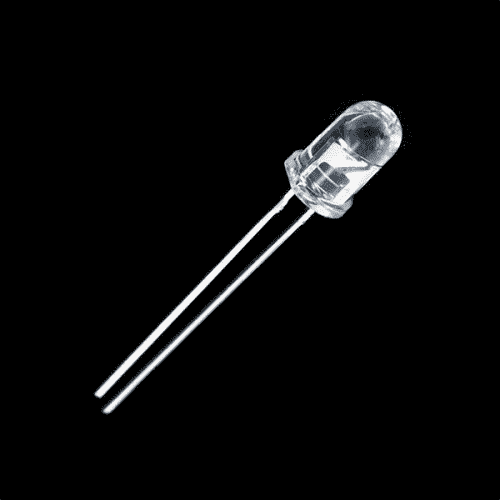
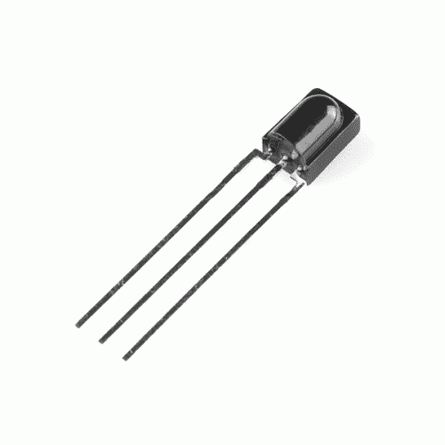
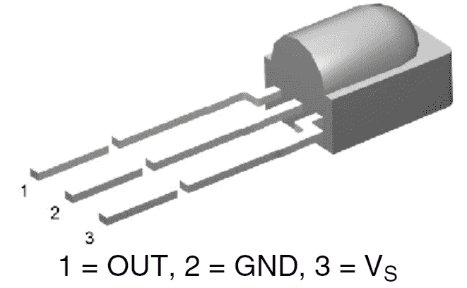

# 红外控制套件连接指南

> 原文：<https://learn.sparkfun.com/tutorials/ir-control-kit-hookup-guide>

## 介绍

红外(IR)是一种廉价且(你很快就会发现)简单的方式来为你的项目添加无线控制。[红外控制套件](https://www.sparkfun.com/products/13235)给了你控制可见光波所需的一切(或者它们是粒子？)，这样你就可以远程控制你定制的[音乐盒](https://learn.sparkfun.com/tutorials/mp3-player-shield-music-box)或者为你的电视或音响制作一个控制器。

[](https://www.sparkfun.com/products/11761)

[https://www.youtube.com/embed/1WVl12CAzkY?t=2m10s/?autohide=1&border=0&wmode=opaque&enablejsapi=1](https://www.youtube.com/embed/1WVl12CAzkY?t=2m10s/?autohide=1&border=0&wmode=opaque&enablejsapi=1)

在本教程中，我们将向您展示如何连接红外控制套件中的所有组件，包括:

[](https://cdn.sparkfun.com/assets/5/2/5/4/e/524c5cf4757b7fe9068b4568.png)

*   SparkFun 定制的[红外遥控器](https://www.sparkfun.com/products/11759)
*   一个 [CR2025 纽扣电池](https://www.sparkfun.com/products/11928)用于遥控器。
*   两个 38kHz 解调[红外接收模块](https://www.sparkfun.com/products/10266)
*   两个发射 950 纳米光的[红外发光二极管](https://www.sparkfun.com/products/9349)
*   一把[330ω电阻](https://www.sparkfun.com/products/14490)。限流电阻越多越好。

### 所需材料

在本教程中，我们将使用 Arduino 来传输和解释接收到的红外数据。除了 IR Control Kit 附带的组件之外，您还需要这些组件来完成本教程:

*   一个 [Arduino](https://www.sparkfun.com/products/13975) (或 Arduino 兼容板)和一种对其编程的方法。
*   一个[试验板](https://www.sparkfun.com/categories/149)是可选的，但建议用来帮助硬件连接。
*   与试验板一样，[跳线](https://www.sparkfun.com/products/11026)是可选的，但推荐在试验板和 Arduino 之间布线。
*   第二个例子使用一个[公共阴极 RGB LED](https://www.sparkfun.com/products/9264) 来创建一个有趣的红外控制 RGB LED 项目。这是可选的。
*   第三个例子使用一个简单的[瞬时按钮](https://www.sparkfun.com/products/97)来触发 IR 代码传输。再次可选。

[](https://www.sparkfun.com/products/13975) 

将**添加到您的[购物车](https://www.sparkfun.com/cart)中！**

 **### [spark fun red board——用 Arduino 编程 T3](https://www.sparkfun.com/products/13975)

[In stock](https://learn.sparkfun.com/static/bubbles/ "in stock") DEV-13975

SparkFun RedBoard 结合了 UNO 的 Optiboot 引导程序的简单性、FTDI 的稳定性和 shield com…

$21.5049[Favorited Favorite](# "Add to favorites") 89[Wish List](# "Add to wish list")****[](https://www.sparkfun.com/products/9264) 

将**添加到您的[购物车](https://www.sparkfun.com/cart)中！**

 **### [LED - RGB 扩散共阴极](https://www.sparkfun.com/products/9264)

[33 available](https://learn.sparkfun.com/static/bubbles/ "33 available") COM-09264

听说过一个叫 RGB 的东西吗？红色，绿色，蓝色？RGB LED 怎么样？这些 5 毫米单位有四个引脚-阴极是长…

$2.252[Favorited Favorite](# "Add to favorites") 19[Wish List](# "Add to wish list")****[](https://www.sparkfun.com/products/11026) 

将**添加到您的[购物车](https://www.sparkfun.com/cart)中！**

 **### [跳线标准 7" M/M - 30 AWG (30 个装)](https://www.sparkfun.com/products/11026)

[In stock](https://learn.sparkfun.com/static/bubbles/ "in stock") PRT-11026

如果你需要快速完成一个原型，没有什么比一堆跳线更能加快速度的了，让我们来看看

$2.4520[Favorited Favorite](# "Add to favorites") 43[Wish List](# "Add to wish list")****[](https://www.sparkfun.com/products/11301) 

将**添加到您的[购物车](https://www.sparkfun.com/cart)中！**

 **### [SparkFun USB 迷你-B 线- 6 脚](https://www.sparkfun.com/products/11301)

[In stock](https://learn.sparkfun.com/static/bubbles/ "in stock") CAB-11301

这是一条 USB 2.0 型到 Mini-B 型 5 针电缆。你知道，通常带有 USB 集线器、相机、MP3 的迷你 B 连接器…

$4.503[Favorited Favorite](# "Add to favorites") 20[Wish List](# "Add to wish list")****[](https://www.sparkfun.com/products/12043) 

将**添加到您的[购物车](https://www.sparkfun.com/cart)中！**

 **### [【试验板-迷你模块化(白色)](https://www.sparkfun.com/products/12043)

[In stock](https://learn.sparkfun.com/static/bubbles/ "in stock") PRT-12043

这个白色迷你试验板是你的小项目原型的好方法！有了 170 个并列点，就有足够的空间…

$4.50[Favorited Favorite](# "Add to favorites") 27[Wish List](# "Add to wish list")****[](https://www.sparkfun.com/products/97) 

将**添加到您的[购物车](https://www.sparkfun.com/cart)中！**

 **### [迷你按钮开关](https://www.sparkfun.com/products/97)

[In stock](https://learn.sparkfun.com/static/bubbles/ "in stock") COM-00097

我们在所有东西上都用这些小按钮！这些微型单刀单掷开关有一个很好的点击他们和 ar…

$0.453[Favorited Favorite](# "Add to favorites") 65[Wish List](# "Add to wish list")************ ************### 推荐阅读

如果您不熟悉以下概念，我们建议您在继续之前查看这些教程。

[](https://learn.sparkfun.com/tutorials/light) [### 光](https://learn.sparkfun.com/tutorials/light) Light is a useful tool for the electrical engineer. Understanding how light relates to electronics is a fundamental skill for many projects.[Favorited Favorite](# "Add to favorites") 24[](https://learn.sparkfun.com/tutorials/ir-communication) [### 红外通信](https://learn.sparkfun.com/tutorials/ir-communication) This tutorial explains how common infrared (IR) communication works, as well as shows you how to set up a simple IR transmitter and receiver with an Arduino.[Favorited Favorite](# "Add to favorites") 42[](https://learn.sparkfun.com/tutorials/what-is-an-arduino) [### 什么是 Arduino？](https://learn.sparkfun.com/tutorials/what-is-an-arduino) What is this 'Arduino' thing anyway? This tutorials dives into what an Arduino is and along with Arduino projects and widgets.[Favorited Favorite](# "Add to favorites") 50[](https://learn.sparkfun.com/tutorials/pulse-width-modulation) [### 脉宽灯](https://learn.sparkfun.com/tutorials/pulse-width-modulation) An introduction to the concept of Pulse Width Modulation.[Favorited Favorite](# "Add to favorites") 46[](https://learn.sparkfun.com/tutorials/button-and-switch-basics) [### 按钮和开关基础知识](https://learn.sparkfun.com/tutorials/button-and-switch-basics) A tutorial on electronics' most overlooked and underappreciated component: the switch! Here we explain the difference between momentary and maintained switches and what all those acronyms (NO, NC, SPDT, SPST, ...) stand for.[Favorited Favorite](# "Add to favorites") 53[](https://learn.sparkfun.com/tutorials/light-emitting-diodes-leds) [### 发光二极管](https://learn.sparkfun.com/tutorials/light-emitting-diodes-leds) Learn the basics about LEDs as well as some more advanced topics to help you calculate requirements for projects containing many LEDs.[Favorited Favorite](# "Add to favorites") 67[](https://learn.sparkfun.com/tutorials/terminal-basics) [### 串行终端基础知识](https://learn.sparkfun.com/tutorials/terminal-basics) This tutorial will show you how to communicate with your serial devices using a variety of terminal emulator applications.[Favorited Favorite](# "Add to favorites") 46

## 硬件概述

在我们深入研究布线和上传草图之前，让我们快速概述一下 IR 控制套件中的每个组件。

### 红外发光二极管

让我们先从最简单的组件开始——红外 LED 。任何曾经与电子产品打交道的人都曾眨过 [LED](https://learn.sparkfun.com/tutorials/light-emitting-diodes-leds) ，但那些闪烁的 LED 通常在我们的可见光谱范围内。这些红外发光二极管就像你以前眨过的任何发光二极管一样，但它们发出的光波长约为**950 纳米**——这种辐射远在我们的视觉范围之外(约 390 至 700 纳米)。

[](https://www.sparkfun.com/products/9349) 

将**添加到您的[购物车](https://www.sparkfun.com/cart)中！**

 **### [LED -红外 950nm](https://www.sparkfun.com/products/9349)

[In stock](https://learn.sparkfun.com/static/bubbles/ "in stock") COM-09349

这是一个非常简单、清晰的红外 LED。这些器件工作在 940-950 纳米之间，适用于通用红外系统，包括

$1.052[Favorited Favorite](# "Add to favorites") 17[Wish List](# "Add to wish list")** **你看不到这些 LED 亮起，但你仍然可以像使用任何 LED 一样使用它们。它们仍然有两个极化的腿:一个阳极(正极，长腿)和一个阴极。它们的典型正向电压约为 **1.5V** ，最大正向电流为 50mA。更多规格，你可以查看 LED 的[数据表](http://cdn.sparkfun.com/datasheets/Components/LED/YSL-R531FR1C-F1.pdf)。

#### 330ω限流电阻

与任何 LED 一样，IR LED 需要一个串联电阻来限制电流。这就是内置的[330ω](https://www.sparkfun.com/products/8377)电阻的用途。

[](https://www.sparkfun.com/products/14490) 

将**添加到您的[购物车](https://www.sparkfun.com/cart)中！**

 **### [电阻器 330 欧姆 1/4 瓦 PTH - 20 包(粗引线)](https://www.sparkfun.com/products/14490)

[In stock](https://learn.sparkfun.com/static/bubbles/ "in stock") PRT-14490

这些是普通的 1/4 瓦、+/- 5%容差 PTH 电阻。通常用于试验板和其他原型制作…

$1.05[Favorited Favorite](# "Add to favorites") 10[Wish List](# "Add to wish list")** **当 5V 电源连接到电阻/LED 串联组合时，通过 LED 的电流应限制在 10mA 左右，这正好在其安全工作范围内。

### TSOP38238 红外接收器模块

虽然看起来像一个简单的晶体管， [TSOP38238 红外接收器模块](https://www.sparkfun.com/products/10266)实际上是一个独特的光解调[集成电路](https://learn.sparkfun.com/tutorials/integrated-circuits)。

[](https://www.sparkfun.com/products/10266) 

将**添加到您的[购物车](https://www.sparkfun.com/cart)中！**

 **### [红外接收二极管- TSOP38238](https://www.sparkfun.com/products/10266)

[In stock](https://learn.sparkfun.com/static/bubbles/ "in stock") SEN-10266

使用这个简单的红外接收器对你的下一个项目进行红外遥控。具有低功耗和易于使用的 p…

$2.10[Favorited Favorite](# "Add to favorites") 19[Wish List](# "Add to wish list")** **有了三个引脚，这是 IC 所能做到的最简单的了。中间有两个用于电源接地的引脚，一侧有 V [S] 和一个单一的数据输出引脚。

[](https://cdn.sparkfun.com/assets/6/a/f/b/f/524b36e8757b7f3d6c8b4567.png)

IR 接收器可以在从 **2.5V 到 5.5V** 的任何地方供电，因此它非常适合各种开发板。

这个模块被调谐到**解调 38kHz 信号**，这是红外信号世界中非常常见的信号。它将一个尖锐的调制信号(如左图所示)转变为更易于读取的信号(如右图所示):

| [](https://cdn.sparkfun.com/assets/2/3/0/5/0/524b38c3757b7fbf6c8b4567.png) | [](https://cdn.sparkfun.com/assets/d/d/6/b/5/524b38c3757b7fd26c8b4567.png) |

因此，要读取该器件的输出，我们只需计算高低脉冲，并测量它们的持续时间。有关 TSOP38238 的更多信息，请查看其[数据手册](https://www.sparkfun.com/datasheets/Sensors/Infrared/tsop382.pdf)。

### 红外遥控器

**Note:** You will need to press the button multiple times in order to send more than one button press to the IR receiver. If you hold the button down, the example code may read 0xFFFFFFFF.

最后，我们来到了套件中华而不实的部分:SparkFun 定制的[红外遥控器](https://www.sparkfun.com/products/11759)。

[](https://www.sparkfun.com/products/14865) 

将**添加到您的[购物车](https://www.sparkfun.com/cart)中！**

 **### [红外线遥控](https://www.sparkfun.com/products/14865)

[In stock](https://learn.sparkfun.com/static/bubbles/ "in stock") COM-14865

我们的红外遥控器提供四个方向的按钮，电源，选择，和三个可选的使用按钮(标有“A”，“B…

$4.501[Favorited Favorite](# "Add to favorites") 9[Wish List](# "Add to wish list")** ****九按钮**遥控器为每次按钮按压发出独特的 32 位代码。代码映射如下图所示(这在我们的第一个例子中会很方便)。根据您使用的红外遥控器，这些值可能会有所不同。

| [](https://cdn.sparkfun.com/assets/learn_tutorials/1/3/6/11759-Infrared_Remote_Control_Codes.png) | [](https://cdn.sparkfun.com/assets/learn_tutorials/1/3/6/14865-Infrared_Remote_Control_Codes.png) |
| [COM-11759](https://www.sparkfun.com/products/retired/11759) 的十六进制代码 | [COM-14865](https://www.sparkfun.com/products/14865) 的十六进制代码 |

遥控器的红外输出信号被调制为 38kHz，因此它可以与红外接收器模块完美配合。

#### 如何电池？

**Note:** If you are buying the IR remote control seperate from the kit, the unit does **NOT** come with a CR2025 coin cell battery. You can use a CR2032 battery, but we found they get stuck easily because they’re slightly too thick. It’s recommended that you use the CR2025, it fits well.

[](https://www.sparkfun.com/products/11928) 

将**添加到您的[购物车](https://www.sparkfun.com/cart)中！**

 **### [纽扣电池- 20mm (CR2025)](https://www.sparkfun.com/products/11928)

[In stock](https://learn.sparkfun.com/static/bubbles/ "in stock") PRT-11928

这是 CR2025 20mm 毫米纽扣电池。你可能想知道是什么让这个家伙与更常见的 CR2032 硬币电池有所不同…

$2.10[Favorited Favorite](# "Add to favorites") 4[Wish List](# "Add to wish list")** **红外遥控器没有安装电池，但红外控制套件包括一个电池。电池盒位于遥控器的底部边缘。为了**打开电池盒**，用你的拇指指甲捏住插销，同时用另一只指甲将抽屉推出。

[](https://cdn.sparkfun.com/assets/4/e/b/9/5/524c4a87757b7fd56c8b456b.png)

插入电池，使正极(+)面朝遥控器的**底部**。然后滑回电池盒。

## 库概述

**Note:** This example assumes you are using the latest version of the Arduino IDE on your desktop. If this is your first time using Arduino, please review our tutorial on [installing the Arduino IDE.](https://learn.sparkfun.com/tutorials/installing-arduino-ide) If you have not previously installed an Arduino library, please check out our [installation guide.](https://learn.sparkfun.com/tutorials/installing-an-arduino-library)

### 下载并安装 Ken Shirriff 的远程库

要快速轻松地将红外控制添加到您的 Arduino，我们建议您下载 Ken Shirriff 的非远程库。Shirriff 为 IR remote 编写了一个库。您可以通过 Arduino 库管理器获得该库。通过 shirriff 搜索**不远程，应该可以安装最新版本。如果你喜欢手动下载这些库，你可以从 [GitHub 库](https://github.com/shirriff/Arduino-IRremote)中获取它们:**

[Download Ken Shirriff's IRremote Library (ZIP)](https://github.com/z3t0/Arduino-IRremote/archive/master.zip)**Warning:** Make sure the folder name that you copy into your "libraries" folder is named "IRremote". Use of the ` - ` in the directory name can lead to errors in compiling the code.

IRremote 库是一个强大的工具，可以将 IR 添加到您的项目中。无论您是要将红外代码发送到设备，还是要将红外代码从遥控器传输到 Arduino(或者两者都要！).我们将讨论一些你可以在图书馆里做的简单的事情。要获得更多使用帮助，请查看肯·希尔里夫的博客。

## 示例 1:红外遥控值

### 电路图

准备好把一切都连接起来了吗？查看下面的电路图，将组件连接在一起。

[](https://cdn.sparkfun.com/assets/learn_tutorials/1/3/6/IR_Receiver_bb_Fritzing_Diagram.jpg)

### 读取红外遥控值

将以下代码复制并粘贴到您的 Arduino IDE 中。然后将其上传到 Arduino，查看与每个按钮相关的值。

```
language:c
/*
  SparkFun Electronics 2013
  Modified by: Ho Yun "Bobby" Chan on 8/6/2018
  Playing with Infrared Remote Control
  Description: By pressing on one of the SparkFun infrared remote
  control's buttons, the serial monitor will output the associated
  hex value when a signal is received by an IR receiver.

  If using with the IR Receiver Breakout (SEN-8554):
  Supply voltage of 2.5V to 5.5V
    Attach
    OUT: To pin 11 on Arduino
    GND: GND
    VCC: 5V

  If using with the IR Receiver Diode (SEN-10266):
  Supply voltage of 2.5V to 5.5V
    Attach
    OUT: To pin 11 on Arduino
    GND: GND
    VS: 5V

  Note: This is based on Ken Shirriff's code found on GitHub.
  Make sure to install the library:
  https://github.com/shirriff/Arduino-IRremote/

  Note: This code also works with cheap remotes. If you want to look
  at the individual timing of the bits, use this code:
  http://www.arduino.cc/playground/Code/InfraredReceivers
*/

#include <IRremote.h>

int RECV_PIN = 11;
IRrecv irrecv(RECV_PIN);
decode_results results;

//------------------------------------------------------------
//Codes for Infrared Remote Control
//COM-11759 https://www.sparkfun.com/products/retired/11759
//Note: Uncomment out this section if you are using this w/ the older remote.

/*
#define POWER 0x10EFD827
#define A 0x10EFF807
#define B 0x10EF7887
#define C 0x10EF58A7
#define UP 0x10EFA05F
#define DOWN 0x10EF00FF
#define LEFT 0x10EF10EF
#define RIGHT 0x10EF807F
#define SELECT 0x10EF20DF
*/
//------------------------------------------------------------
//Codes for Infrared Remote Control
//COM-14865 https://www.sparkfun.com/products/14865
//Note: Comment out this section if you are using this w/ the older remote.

#define POWER 0x00FF629D
#define A 0x00FF22DD
#define B 0x00FF02FD
#define C 0x00FFC23D
#define UP 0x00FF9867
#define DOWN 0x00FF38C7
#define LEFT 0x00FF30CF
#define RIGHT 0x00FF7A85
#define SELECT 0x00FF18E7

//------------------------------------------------------------

void setup()
{
  Serial.begin(9600);
  irrecv.enableIRIn(); // Start the receiver
}

void loop()
{
  if (irrecv.decode(&results))
  {
    if (results.value == POWER)
    {
      Serial.println("POWER");
    }
    else if (results.value == A)
    {
      Serial.println("A");
    }
    else if (results.value == B)
    {
      Serial.println("B");
    }
    else if (results.value == C)
    {
      Serial.println("C");
    }
    else if (results.value == UP)
    {
      Serial.println("UP");
    }
    else if (results.value == DOWN)
    {
      Serial.println("DOWN");
    }
    else if (results.value == LEFT)
    {
      Serial.println("LEFT");
    }
    else if (results.value == RIGHT)
    {
      Serial.println("RIGHT");
    }
    else if (results.value == SELECT)
    {
      Serial.println("SELECT");
    }
    else {
      Serial.println("IR RECV Code Value Not Defined or Button was Held Down");
    }

    Serial.print("IR RECV Code = 0x ");
    Serial.println(results.value, HEX);
    irrecv.resume();
  }
} 
```

以 **9600 波特**打开一个[串行监视器](https://learn.sparkfun.com/tutorials/terminal-basics/arduino-serial-monitor-windows-mac-linux)。按红外遥控器上的按钮查看相关的按钮值。如果您有旧版本的 IR 遥控器，或者收到了我们目录之外的遥控器，请确保更新代码以反映相应的按钮按压。只需注释/取消注释遥控器的代码，或者更新您正在使用的遥控器的值。现在，我们可以读取按钮，我们可以用红外控制你的项目！

## 示例 2:使用遥控器

在第一个示例中，我们将展示如何将红外接收器连接到 Arduino，并使用红外遥控器控制它。

### 电路图

在第一个例子中，我们将使用 IRremote 库的 IR 接收功能来使用 SparkFun IR 遥控器控制公共阴极 RGB LED。RGB LED 不包含在 [IR 控制套件](https://www.sparkfun.com/products/11761)中，但它可能是你的零件箱中已经有的东西。如果没有，任何三个一组都可以。或者你甚至可以使用[串行监视器](https://learn.sparkfun.com/tutorials/terminal-basics/arduino-serial-monitor-windows-mac-linux)作为你的输出监视器。

这是我们将红外接收器和 RGB LED 连接到 Arduino 的方式:

[](https://cdn.sparkfun.com/assets/f/1/7/6/7/524b4959757b7f456d8b4568.png)

IR 接收器的输出连接到 D11，但也可以连接到任何数字输入引脚。如果您交换 pin，请确保您在代码中反映了这些更改！

我们还没有使用红外 LED，所以，现在，把它安全地放在一边。

### RGB 遥控器

将以下代码复制并粘贴到您的 Arduino IDE 中。然后将它上传到您的 Arduino，创建您自己的遥控 RGB LED。

```
language:c
/* RGB Remote Control
   by: Jim Lindblom
   SparkFun Electronics
   date: October 1, 2013

   This sketch uses Ken Shirriff's *awesome* IRremote library:
       https://github.com/shirriff/Arduino-IRremote

   RGB Remote Control uses a combination of SparkFun's
   IR Remote (https://www.sparkfun.com/products/11759) and an
   IR receiver diode (https://www.sparkfun.com/products/10266) to
   control an RGB LED.

   The IR Remote's power button turns the LED on or off. The A, B,
   and C buttons select a channel (red, green, or blue). The up
   and down arrows increment or decrement the LED brightness on that channel.
   The left and right arrows turn a channel to min or max, and
   circle set it to the middle.

   Hardware setup:
     * The output of an IR Receiver Diode (38 kHz demodulating
       version) should be connected to the Arduino's pin 11.
       * The IR Receiver diode should also be powered off the
         Arduino's 5V and GND rails.
     * A common cathode RGB LED is connected to Arduino's pins
       5, 9, and 6 (red, green, and blue pins).
 */

#include <IRremote.h> // Include the IRremote library

/* Setup constants for SparkFun's IR Remote: */
#define NUM_BUTTONS 9 // The remote has 9 buttons
/* Define the IR remote button codes. We're only using the
   least signinficant two bytes of these codes. Each one
   should actually have 0x10EF in front of it. Find these codes
   by running the IRrecvDump example sketch included with
   the IRremote library.*/

//------------------------------------------------------------
//Codes for Infrared Remote Control
//COM-11759 https://www.sparkfun.com/products/retired/11759
//Note: Uncomment out this section if you are using this w/ the older remote.

/*
const uint16_t BUTTON_POWER = 0xD827; // i.e. 0x10EFD827
const uint16_t BUTTON_A = 0xF807;
const uint16_t BUTTON_B = 0x7887;
const uint16_t BUTTON_C = 0x58A7;
const uint16_t BUTTON_UP = 0xA05F;
const uint16_t BUTTON_DOWN = 0x00FF;
const uint16_t BUTTON_LEFT = 0x10EF;
const uint16_t BUTTON_RIGHT = 0x807F;
const uint16_t BUTTON_CIRCLE = 0x20DF;
*/
//------------------------------------------------------------
//Codes for Infrared Remote Control
//COM-14865 https://www.sparkfun.com/products/14865
//Note: Comment out this section if you are using this w/ the older remote.

const uint16_t BUTTON_POWER = 0x629D;
const uint16_t BUTTON_A = 0x22DD;
const uint16_t BUTTON_B = 0x02FD;
const uint16_t BUTTON_C = 0xC23D;
const uint16_t BUTTON_UP = 0x9867;
const uint16_t BUTTON_DOWN = 0x38C7;
const uint16_t BUTTON_LEFT = 0x30CF;
const uint16_t BUTTON_RIGHT = 0x7A85;
const uint16_t BUTTON_CIRCLE = 0x18E7;

//------------------------------------------------------------

/* Connect the output of the IR receiver diode to pin 11\. */
int RECV_PIN = 11;
/* Initialize the irrecv part of the IRremote  library */
IRrecv irrecv(RECV_PIN);
decode_results results; // This will store our IR received codes
uint16_t lastCode = 0; // This keeps track of the last code RX'd

/* Setup RGB LED pins: */
enum ledOrder // Make an enum to add some clarity in the code
{
  RED,   // 0
  GREEN, // 1
  BLUE   // 2
};
const int rgbPins[3] = {5, 9, 6}; // Red, green, blue pins respectively
byte rgbValues[3] = {55, 23, 200}; // This keeps track of channel brightness
byte activeChannel = RED; // Start with RED as the active channel
boolean ledEnable = 1; // Start with the LED on.

void setup()
{
  Serial.begin(9600); // Use serial to debug.
  irrecv.enableIRIn(); // Start the receiver

  /* Set up the RGB LED pins: */
  for (int i=0; i<3; i++)
  {
    pinMode(rgbPins[i], OUTPUT);
    analogWrite(rgbPins[i], rgbValues[i]);
  }
}

// loop() constantly checks for any received IR codes. At the
// end it updates the RGB LED.
void loop()
{
  if (irrecv.decode(&results))
  {
    /* read the RX'd IR into a 16-bit variable: */
    uint16_t resultCode = (results.value & 0xFFFF);

    /* The remote will continue to spit out 0xFFFFFFFF if a
     button is held down. If we get 0xFFFFFFF, let's just
     assume the previously pressed button is being held down */
    if (resultCode == 0xFFFF)
      resultCode = lastCode;
    else
      lastCode = resultCode;

    // This switch statement checks the received IR code against
    // all of the known codes. Each button press produces a
    // serial output, and has an effect on the LED output.
    switch (resultCode)
    {
      case BUTTON_POWER:
        Serial.println("Power, Turn LED ON/OFF");
        if (ledEnable) ledEnable = 0;
        else ledEnable = 1; // Flip ledEnable
        break;
      case BUTTON_A:
        Serial.println("A, Red");
        activeChannel = RED;
        break;
      case BUTTON_B:
        Serial.println("B, Green");
        activeChannel = GREEN;
        break;
      case BUTTON_C:
        Serial.println("C, Blue");
        activeChannel = BLUE;
        break;
      case BUTTON_UP:
        Serial.println("Up, Increment brightness by 1");
        rgbValues[activeChannel]++; // Increment brightness
        break;
      case BUTTON_DOWN:
        Serial.println("Down, Decrement brightness by 1");
        rgbValues[activeChannel]--; // Decrement brightness
        break;
      case BUTTON_LEFT:
        Serial.println("Left, Min brightness (off)");
        rgbValues[activeChannel] = 0; // Min brightness (off)
        break;
      case BUTTON_RIGHT:
        Serial.println("Right, Max brightness");
        rgbValues[activeChannel] =  255; // Max brightness
        break;
      case BUTTON_CIRCLE:
        Serial.println("Circle, Medium Brightness");
        rgbValues[activeChannel] = 127; // Medium brightness
        break;
      default:
        Serial.print("Unrecognized code received: 0x");
        Serial.println(results.value, HEX);
        break;
    }
    irrecv.resume(); // Receive the next value
  }

  // Every time through the loop, update the RGB LEDs:
  if (ledEnable)
  {
    for (int i=0; i<3; i++)
    {
      analogWrite(rgbPins[i], rgbValues[i]);
    }
  }
  else
  {
    for (int i=0; i<3; i++)
    {
      analogWrite(rgbPins[i], 0);
    }
  }
} 
```

当代码初始化时，RGB LED 将被设置为某一亮度。然后，我们基本上是循环和检查，看看红外接收器二极管是否已收到来自红外遥控器的已知代码。如果是这样，它会对 LED 产生一些影响——打开/关闭，调高或调低红/绿/蓝等等。按下按钮 A、B 或 C 将允许您调整相应的颜色。一旦按下一个字母，您就可以使用方向键来调整亮度。检查代码中的注释，帮助理解发生了什么。

您还可以检查串行监视器的输出，以确保接收到代码。当收到一个已知代码时，它会打印出相应的按钮。当收到一个未知代码时(如果你只使用 SparkFun IR 遥控器，这种情况应该不会经常发生)，它会以十六进制打印出该代码。

**Heads up!** When the red LED is fully turned on, it may dominate over the other colors. Try turning it down by using a smaller value. For ideas on making your own custom colors, try looking at the [LilyPad protoSnap Plus Activity Guide: 3\. Custom Color Mixing](https://learn.sparkfun.com/tutorials/lilypad-protosnap-plus-activity-guide/3-custom-color-mixing) for ideas.

### 玩吧！

这就是全部了！尝试探索代码，并用您可以控制的其他设备替换 RGB LED。伺服电机怎么样？还是一个接力！有这么多的可能性！

你周围有其他红外遥控器吗？试试吧！当你按下一个按钮时，检查串行监视器(在 **9600 bps** )看它吐出什么代码。然后在 switch 语句中添加一个 case。

## 示例 3:传输

当你让遥控器和接收器工作后，是时候给系统增加一些红外传输了。

对于这个例子，我们将设置一个红外数据中继，使用接收器和红外 LED 来传输数据。Arduino 接收到的红外代码可以通过按一个按钮从 LED 发送出去。

### 设置硬件

在硬件层面，使用远程库，只有**一个引脚**可以用来传输 IR 数据:**引脚 3** 。这里没有任何让步；引脚 3 的 [PWM](https://learn.sparkfun.com/tutorials/pulse-width-modulation) 功能使其成为传输 38kHz 调制红外数据的最佳选择之一。

我们还将在这个电路中添加一个按钮。如果你没有一个按钮，你可以简单地拉低引脚 12 来模拟一个按钮按下。这是整个电路:

[](https://cdn.sparkfun.com/assets/3/5/4/0/3/525e55ec757b7fce268b456a.png)

### 添加代码

一旦你把硬件连接好，复制并粘贴下面的代码。然后上传到你的 Arduino。

```
language:c
/* IRrecord (Redux)
   by: Jim Lindblom
   SparkFun Electronics
   date: October 1, 2013

   This sketch uses Ken Shirriff's *awesome* IRremote library:
       https://github.com/shirriff/Arduino-IRremote
   It's a slightly modified version of the IRrecord example that
   comes with that library.

   This sketch uses the IR receiver diode to "record" an IR code.
   Then, when triggered via a button on pin 12, it will transmit
   that IR code out of an attached IR LED on pin 3.

   Hardware setup:
     * The output of an IR Receiver Diode (38 kHz demodulating
       version) should be connected to the Arduino's pin 11.
       * The IR Receiver diode should also be powered off the
         Arduino's 5V and GND rails.
     * The anode (+, longer leg) of an IR LED should be connected to pin 3 of 
       the Arduino. The cathode (-) should be connected to a 330
       Ohm resistor, which connects to ground.
     * A button should be connected to ground on one end, and pin
       12 of the Arduino on the other.

*/
#include <IRremote.h> // Include the IRremote library

/* Connect the output of the IR receiver diode to pin 11\. */
int RECV_PIN = 11;
/* Initialize the irrecv part of the IRremote  library */
IRrecv irrecv(RECV_PIN);
decode_results results; // This will store our IR received codes

IRsend irsend; // Enables IR transmit on pin 3

/* Storage variables for the received IR code: */
unsigned int irLen = 0; // The length of the code
unsigned int irBuffer[RAWBUF]; // Storage for raw (UNKNOWN) codes
int codeType; // The type of code (NEC, SONY, UNKNOWN, etc.)
unsigned int codeValue; // The value of a known code
boolean codeReceived = false; // A boolean to keep track of if a code was received

const int buttonPin = 12; // Button pin. Pulled up. Triggered when connected to ground.

// setup() initializes serial and the Infrared receiver.
void setup()
{
  Serial.begin(9600);
  irrecv.enableIRIn(); // Start the receiver

  pinMode(buttonPin, INPUT_PULLUP);
}

// loop() checks for either a button press or a received IR code.
void loop()
{
  if (irrecv.decode(&results)) 
  {
    updateIRReceive(); // Sort out the received code
    codeReceived = true; // Enables code transmit on button press
    irrecv.resume(); // re-enable receive
  }

  // If the button is pressed, and we've received a code...
  if ((digitalRead(buttonPin) == LOW) && (codeReceived == true))
  {
    sendCode(); // Sends out our code. (See bottom of sketch).
    irrecv.enableIRIn(); // Re-enable receiver
    // We only want to be able to send the code once. Re-set
    // codeReceived to false:
    codeReceived = false;
  }
}

/* This function reads in the received IR data, and updates the
   following variables:
    * codeType -- How was the IR signal encoded? SONY, NEC, 
      UNKNOWN, etc.
    * irLen -- The length (number of marks and ticks) of an IR code.
    * Depending on the codeType, one of these two variables will
      be updated as well:
      * codeValue -- IF the codeType is a known type, this variable
        will contain the received code.
      * irBuffer -- If the codeType is UNKNOWN, this buffer will
        contain the format of the received code.

    This function borrows heavily from the IRrecord example code.
*/
void updateIRReceive()
{
  codeType = results.decode_type;
  irLen = results.rawlen;
  if (codeType == UNKNOWN)
  {
    irLen--;
    // We need to convert from ticks to microseconds
    for (int i = 1; i <= irLen; i++) 
    {
      if (i % 2) 
      {
        // Mark
        irBuffer[i-1] = results.rawbuf[i]*USECPERTICK - MARK_EXCESS;
        Serial.print(" m");
      } 
      else 
      {
        // Space
        irBuffer[i-1] = results.rawbuf[i]*USECPERTICK + MARK_EXCESS;
        Serial.print(" s");
      }
      Serial.print(irBuffer[i-1], DEC);
    }
    Serial.println();
  }
  else 
  {
    if (codeType == NEC) 
    {
      Serial.print("Received NEC: ");
      if (results.value == REPEAT) 
      {
        // Don't record a NEC repeat value as that's useless.
        Serial.println("repeat; ignoring.");
        return;
      }
    } 
    else if (codeType == SONY) 
    {
      Serial.print("Received SONY: ");
    } 
    else if (codeType == RC5) 
    {
      Serial.print("Received RC5: ");
    } 
    else if (codeType == RC6) 
    {
      Serial.print("Received RC6: ");
    } 
    else 
    {
      Serial.print("Unexpected codeType ");
      Serial.print(codeType, DEC);
      Serial.println("");
    }
    Serial.println(results.value, HEX);
    codeValue = results.value;
    irLen = results.bits;
  }
}

void sendCode()
{
  if (codeType == NEC) 
  {
    irsend.sendNEC(codeValue, irLen);
    Serial.print("Sent NEC ");
    Serial.println(codeValue, HEX);
  } 
  else if (codeType == SONY)
  {
    irsend.sendSony(codeValue, irLen);
    Serial.print("Sent Sony ");
    Serial.println(codeValue, HEX);
  } 
  else if (codeType == RC5 || codeType == RC6) 
  {
    // Put the toggle bit into the code to send
    codeValue = codeValue & ~(1 << (irLen - 1));
    if (codeType == RC5) 
    {
      Serial.print("Sent RC5 ");
      Serial.println(codeValue, HEX);
      irsend.sendRC5(codeValue, irLen);
    } 
    else 
    {
      irsend.sendRC6(codeValue, irLen);
      Serial.print("Sent RC6 ");
      Serial.println(codeValue, HEX);
    }
  } 
  else if (codeType == UNKNOWN /* i.e. raw */) 
  {
    // Assume 38 KHz
    irsend.sendRaw(irBuffer, irLen, 38);
    Serial.println("Sent raw");
  }
} 
```

要使用草图，您仍然需要一个红外遥控器。从**打开串行监视器**开始(9600 bps)。然后**按下遥控器上的**按钮。串行监视器应该通知您收到了一个 IR 代码。Arduino 现在已经全部加载完毕，可以输出自己的红外代码了。

要发送 IR 代码，**按下连接到 12 号针的按钮**(或短接 12 号针到 GND 的跳线)。按照示例代码的编写方式，红外 LED 将发送一次红外代码，直到 Arduino 接收到另一个红外代码进行记录。除非你有一个设备正在寻找特定的红外代码，你可能看不到任何事情发生。用你家周围的一些红外遥控器和电器来试着画出草图。你的 Arduino 可以触发你的电视静音吗？

#### 深入研究 IR 发送

如果使用非远程库传输数据，只需要添加几行代码。首先，您需要在代码顶部声明一个`IRsend`的实例:

```
language:c
IRsend irsend; 
```

图书馆提供了多种传输选择。它们因编码方案而异，这通常取决于制造商。您可以使用以下任何功能发送红外数据:

```
language:c
void sendNEC(unsigned long data, int nbits);
void sendSony(unsigned long data, int nbits);
void sendRC5(unsigned long data, int nbits);
void sendRC6(unsigned long data, int nbits);
void sendDISH(unsigned long data, int nbits);
void sendSharp(unsigned long data, int nbits);
void sendPanasonic(unsigned int address, unsigned long data);
void sendJVC(unsigned long data, int nbits, int repeat);

void sendRaw(unsigned int buf[], int len, int hz); 
```

如果你没有与这些制造商(NEC、索尼、DISH、夏普、松下、JVC 等)相匹配的设备。)，您必须使用`sendRaw`功能来传输您的红外代码。

**Looking for more power?** Infrared LEDs are awesome. Along with an IR receiver they can be used for remote control and even basic remote data communication. The only problem is that your Arduino won’t drive them to their full potential. The transmission range of the LED might not be optimal. Output pins on the Arduino can only source up to about 30mA of current. This means the LED cannot be driven to its full power of 50mA. This will result in a loss of transmission distance.

If you want to drive an IR LED properly, consider using the IR LED with a transistor and resistor that was used in the design of the old [SparkFun Max Power IR LED kit](https://www.sparkfun.com/products/retired/10732). To control, simply provide it with voltage (5V), ground, and connect the CTL pin to a digital pin on your Arduino, and you can drive this kit just like a normal LED. However, a 330Ω attached to your IR LED should give about 10 feet of range.

[](https://www.sparkfun.com/products/retired/10732) 

### [SparkFun 马克斯·鲍威尔红外 LED 套件](https://www.sparkfun.com/products/retired/10732)

[Retired](https://learn.sparkfun.com/static/bubbles/ "Retired") KIT-10732

红外 led 棒极了。与红外接收器一起，它们可以用于远程控制，甚至基本的远程数据通信…

1 **Retired**[Favorited Favorite](# "Add to favorites") 1[Wish List](# "Add to wish list")

## 资源和更进一步

感谢您查看我们的红外控制套件连接指南！如果您正在寻找与该工具包相关的更多文档和资源，请查看以下链接:

*   数据表
    *   [950 纳米红外 LED (PDF)](http://cdn.sparkfun.com/datasheets/Components/LED/YSL-R531FR1C-F1.pdf)
    *   [TSOP38238 红外接收器模块(PDF)](http://www.sparkfun.com/datasheets/Sensors/Infrared/tsop382.pdf)
*   远程图书馆
    *   [Arduino 库 GitHub 库](https://github.com/z3t0/Arduino-IRremote)
    *   [Arduino 库帮助页面](http://arcfn.com/2009/08/multi-protocol-infrared-remote-library.html)
*   [GitHub Repo: SparkFun IR 控制套件](https://github.com/sparkfun/IR-Control-Kit)
*   [SFE 产品展示区](https://youtu.be/1WVl12CAzkY?t=2m10s)

如果您正在寻找红外通信的一般信息，请查看我们的[红外通信教程](https://learn.sparkfun.com/tutorials/ir-communication)，以及 SparkFun 工程师 Chris Taylor 的红外项目视频:

替换打开

[https://www.youtube.com/embed/V4nM8qd07fE](https://www.youtube.com/embed/V4nM8qd07fE)

替换关闭

还有杰夫·布兰森，他在使用我们的[红外发射器/探测器对](https://www.sparkfun.com/products/241)的红外通信视频教程中担任主角:

[](https://www.sparkfun.com/products/retired/241) 

### [红外线发射器和探测器](https://www.sparkfun.com/products/retired/241)

[Retired](https://learn.sparkfun.com/static/bubbles/ "Retired") SEN-00241

侧视红外发射器和红外探测器。这些简单的器件工作在 940 纳米，适用于一般的红外系统

6 **Retired**[Favorited Favorite](# "Add to favorites") 39[Wish List](# "Add to wish list")

[https://www.youtube.com/embed/5_I5eIQsHq8](https://www.youtube.com/embed/5_I5eIQsHq8)

* * *

现在你已经发现在你的项目中添加红外输出或输入是多么容易，你打算用这个可视的调制光源来控制什么呢？需要一些灵感吗？查看这些教程:

*   [LED 灯条连接](https://learn.sparkfun.com/tutorials/led-light-bar-hookup) -如果你在生活中需要一些*可见的*光，这些 LED 灯条是一种特别明亮的方式
*   [使用 OpenSegment](https://learn.sparkfun.com/tutorials/using-opensegment) -沿着可视显示的线条，OpenSegment 4 位 7 段显示是一种将数据显示添加到项目中的简单工具。
*   重建 Illumitune -了解我们如何将 IR 整合到我们帮助重建的 Illumitune 项目中。
*   激光监狱 -使用红外发光二极管和红外接收器建造一个“激光”监狱！

[](https://learn.sparkfun.com/tutorials/boss-alarm) [### Boss 警报](https://learn.sparkfun.com/tutorials/boss-alarm) Build a Boss Alarm that alerts you of anyone walking into your office and automatically changes your computer screen.[Favorited Favorite](# "Add to favorites") 19[](https://learn.sparkfun.com/tutorials/roshamglo-hookup-guide) [### Roshamglo 连接指南](https://learn.sparkfun.com/tutorials/roshamglo-hookup-guide) This tutorial provides everything you need to know to get started with the Roshamglo badge.[Favorited Favorite](# "Add to favorites") 1[](https://learn.sparkfun.com/tutorials/roshamglo-project-tv-b-gone) [### 罗沙姆格洛项目:电视-B-没了](https://learn.sparkfun.com/tutorials/roshamglo-project-tv-b-gone) Turn your Roshamglo board into a (nearly) universal TV power button.[Favorited Favorite](# "Add to favorites") 4**********************