# 在 EAGLE 中制作定制脚印

> 原文：<https://learn.sparkfun.com/tutorials/making-custom-footprints-in-eagle>

## 介绍

这是 Eagle cad 程序的教程，为中级用户设计。这个想法是导入部件的图像来创建一个定制的足迹，该足迹与组件上的足迹相匹配，并且可以简单地使用 Eagle 提供的工具来完成。

一如既往，需求是发明之母，也是在 SparkFun 使用这款 Eagle 工具的原因。太多时候，我们遇到了足迹比例不正确、测量不正确的问题，而且经常是太忙了(太多的东西彼此靠得太近)。这导致了我们烤箱中的回流问题，造成了移位的器件、墓碑和许多许多对地跳线，特别是在我们的 [QFN 封装 IC](https://learn.sparkfun.com/tutorials/integrated-circuits/ic-packages)上。

我们的测试和质量控制经理 Pete Lewis 设计了一个很好的系统来利用 Eagle 的内置图像导入器，这样我们就可以获得为问题零件创建的精确足迹。

### 推荐阅读

如前所述，本教程需要一些中级技能与鹰。如果你想复习如何使用 Eagle 以及一些其他技能，请访问这些其他教程。

*   [PCB 基础知识](https://learn.sparkfun.com/tutorials/pcb-basics)
*   [如何阅读原理图](https://learn.sparkfun.com/tutorials/how-to-read-a-schematic)
*   [如何安装和设置 Eagle PCB 软件](https://learn.sparkfun.com/tutorials/how-to-install-and-setup-eagle)
*   [如何布局 PTH PCBs:原理图](https://learn.sparkfun.com/tutorials/using-eagle-schematic)
*   [如何布局 PTH PCBs:板布局](https://learn.sparkfun.com/tutorials/using-eagle-board-layout)
*   [创建 SMD 封装](https://learn.sparkfun.com/tutorials/designing-pcbs-smd-footprints)
*   [如何布局 SMD PCB](http://learn.sparkfun.com/tutorials/designing-pcbs-advanced-smd)

## 创建示意图的位图图像

第一步是创建单色位图(*。bmp)您正在定制的零件的图像。Eagle 真的只喜欢导入纯色的图像，黑白很好用。在本教程中，我将使用 28 QFN 封装的微步电机驱动器(IC A4983SETTR-T)。该 IC 可在[四步进电机驱动板](https://www.sparkfun.com/products/10507)上找到。

使用数码相机(我推荐 800 万像素或更高)上的微距设置，拍摄你的部件的底面(腿或垫将接触你的电路板的地方)。

[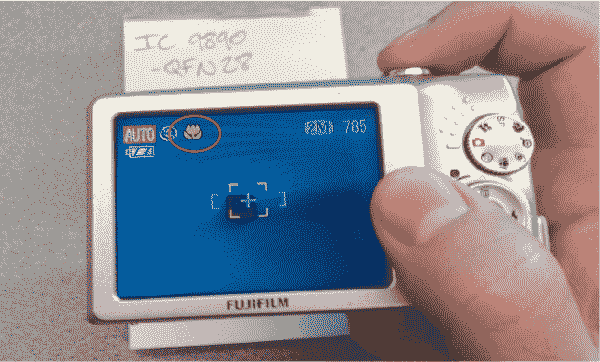](https://cdn.sparkfun.com/assets/e/4/5/d/b/51edc25cce395f9565000003.jpg)*Notice that Macro is enabled.*

试着把零件放直，尽可能放在相机镜头的中心，这样以后需要的校正就少了。必要时使用闪光灯，但要尽可能减少阴影。

[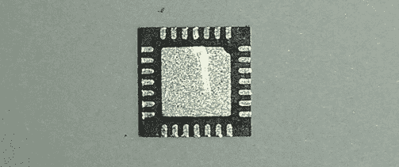](https://cdn.sparkfun.com/assets/5/7/d/d/4/51edc25cce395f8765000007.jpg)*As straight as possible with minimal shadows.*

一旦拍摄了您喜欢的照片，就应该对其进行校正，将其转换为位图，并准备将其导入 Eagle。我使用了一个名为 [Digital Photo Professional](http://en.wikipedia.org/wiki/Digital_Photo_Professional) 的程序，因为我喜欢它具有网格功能，但任何具有增量旋转功能以及饱和度和对比度调整的程序都可以工作。

目标是确保零件在框架中绝对是直的/方的，以便它在 Eagle 的网格上。

[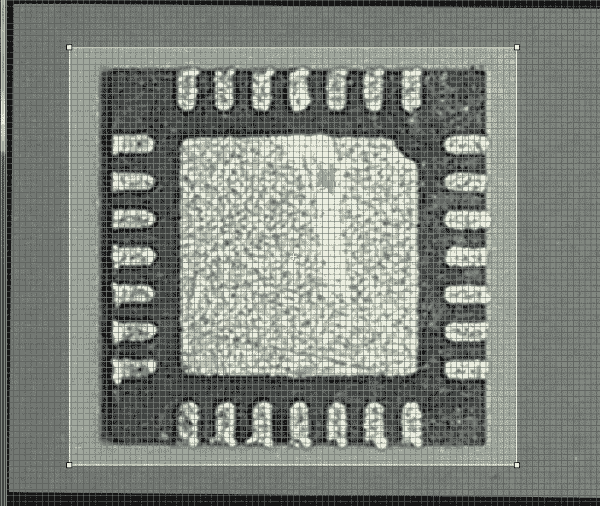](https://cdn.sparkfun.com/assets/1/3/9/d/e/51edc25cce395f5f65000003.jpg)

接下来，调整对比度(通常更高)和饱和度(总是尽可能低)，以使图片尽可能接近黑白。

此时，保存图片的新版本是个好主意，用 Windows 默认的 MS Paint 或 Mac OS 中类似的东西打开它。

[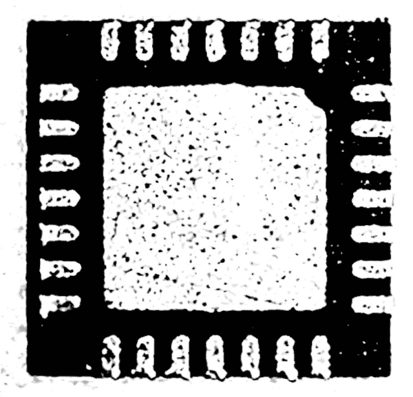](https://cdn.sparkfun.com/assets/6/9/4/2/2/51edc25cce395feb65000003.jpg)*Contrast: 75%, Saturation: 0%.*

要清理阴影，使用剪切功能(ctrl + X)。请注意右侧，黑色主体与白色衬垫齐平。这就是你希望左手边也是这样的。简单地突出垫的边缘，并切断阴影。

[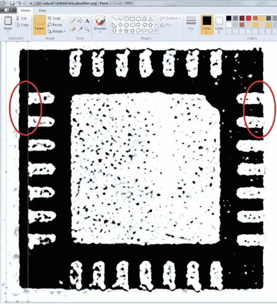](https://cdn.sparkfun.com/assets/e/c/5/e/7/51edc25ece395ffd65000002.jpg)*Image before shadow removal.*

之后用橡皮擦工具尽可能的清理掉黑色的杂散位。我们希望图片中的白色是金属垫，我们希望它们尽可能清晰。当导入到 Eagle 中时，这非常有帮助，并且防止了以后的许多混乱。现在固定的像素越多，花在找出 Eagle 中填充开始或结束位置的时间就越少。

[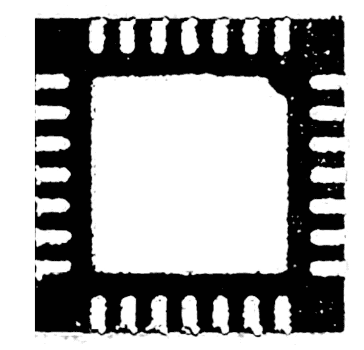](https://cdn.sparkfun.com/assets/1/a/f/6/0/51edc25cce395f5465000002.jpg)*Image after shadow removal and clean-up.*

将图像保存为单色 BMP 是将图片转换为 Eagle 可用形式的最简单方法。点击文件→另存为→选择单色位图。有些程序有一个下拉菜单，可以在“类型”下选择。

[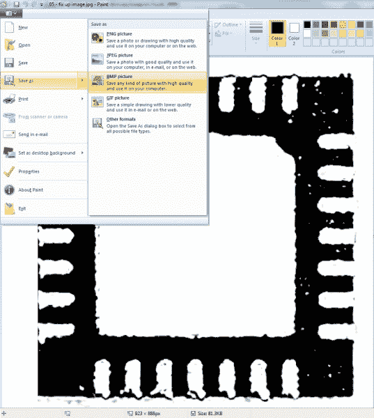](https://cdn.sparkfun.com/assets/9/8/6/e/7/51edc25cce395fe365000005.jpg)[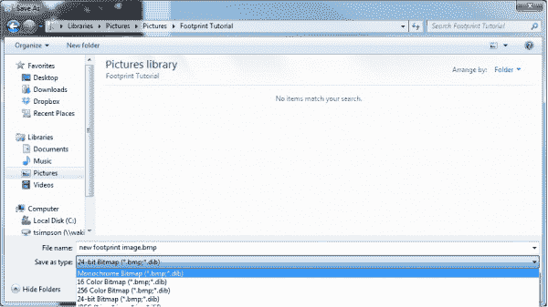](https://cdn.sparkfun.com/assets/7/6/d/9/8/51edc25cce395f4765000003.jpg)

现在你有一个单层(单色)，黑白位图图像或你的部分，准备插入到鹰。

## 将位图图像导入 Eagle

继续打开 Eagle，导航到你的角色所在的库。如标题所述，本教程不是为了从头构建一个足迹([尽管你可以很容易地](https://learn.sparkfun.com/tutorials/designing-pcbs-smd-footprints))，而是为了定制一个现有的足迹，使其大小和形状完全正确。

[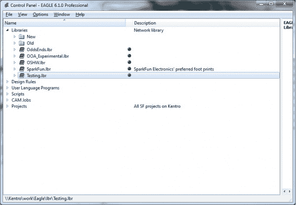](https://cdn.sparkfun.com/assets/e/4/7/1/6/51edc25cce395f5a65000002.jpg)

打开后，使用菜单栏中的小 IC 图标选择您的包。

[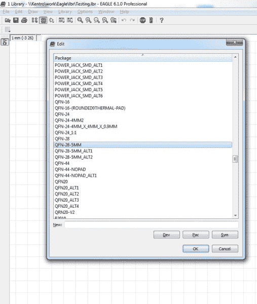](https://cdn.sparkfun.com/assets/a/9/4/7/2/51edc25cce395fb365000007.jpg)

它会打开这样的东西。

[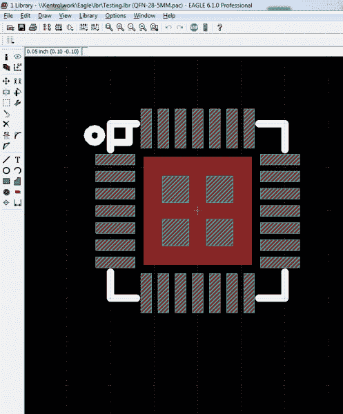](https://cdn.sparkfun.com/assets/9/0/9/6/c/51edc25dce395fba65000000.jpg)

这里有几层可用:**红色**是铜层，代表将暴露在电路板上的金属，**白色条纹**代表如果您决定使用回流炉作为焊接方法，锡膏将进入的模板层(我们对所有的 SMD 元件都使用这种方法)，而**纯白**代表将印刷在电路板上的顶层丝绸层。

我们想把重点放在铜层:大中心垫和周围较小的脚垫。

在您做任何事情之前，创建一个新的包是一个好主意，从您刚刚打开的包中复制现有的封装。使用组选择工具(alt + F7)高亮显示所有内容，使用复制工具复制所有内容。

[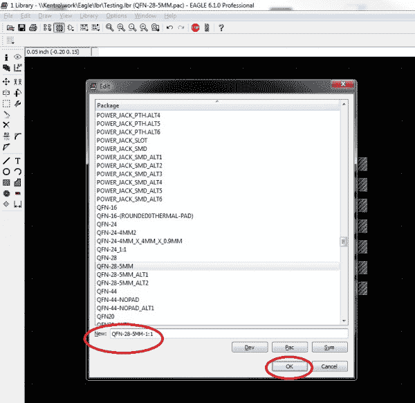](https://cdn.sparkfun.com/assets/9/4/4/3/f/51edc25dce395f2865000006.jpg)

再次打开包列表，在“新建”栏中，键入包的新名称。我总是使用旧名称，然后加上“1:1”，这样我就知道这是一对一的测量足迹。

一旦创建了这个新包，使用粘贴工具来放置旧包中的所有内容。

接下来，用一对数字卡尺测量你的零件。选择您在 Eagle 包装中测量的那块物品的位置，并精确地画出该长度的线。

[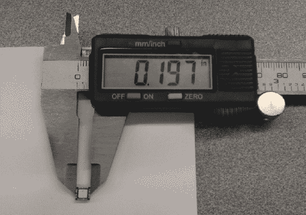](https://cdn.sparkfun.com/assets/4/b/e/2/0/51edc25dce395f6365000007.jpg)

这是为参考目的(我使用的参考层-紫色)，以便我们可以缩放我们的进口。bmp 图像。

[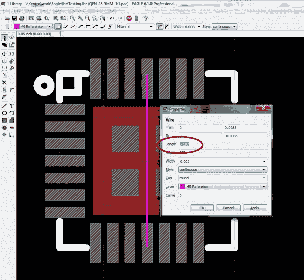](https://cdn.sparkfun.com/assets/2/e/d/b/e/51edc25dce395f6565000001.jpg)

当你设置好你的参考线后，点击工具栏上的 ULP 按钮，选择“导入-bmp”。这使您可以设置参数并运行脚本，以根据位图图像在 Eagle 中绘制像素。

[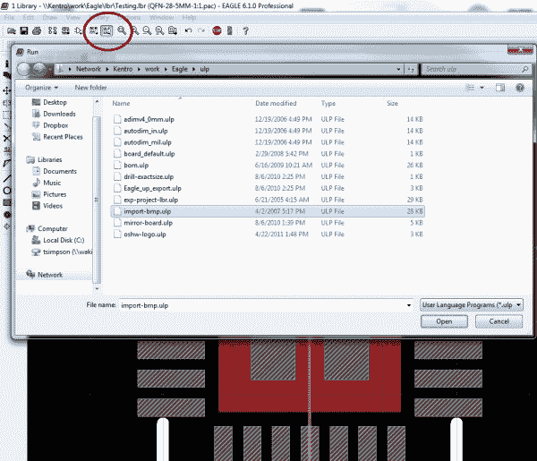](https://cdn.sparkfun.com/assets/6/b/0/c/6/51edc25dce395f7565000006.jpg)[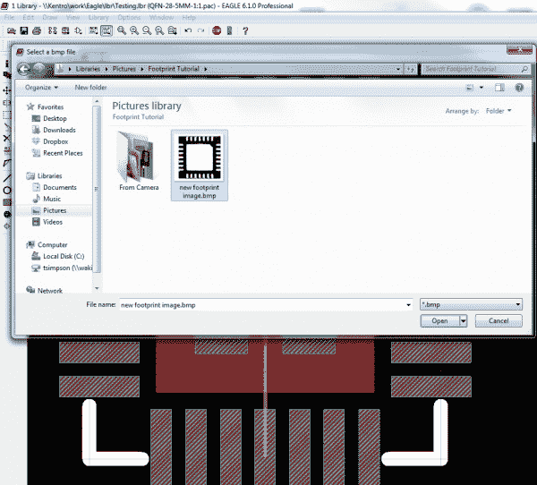](https://cdn.sparkfun.com/assets/c/1/5/3/6/51edc25dce395fc465000007.jpg)

选择您的位图图像，然后选择您希望包含的颜色。

[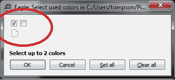](https://cdn.sparkfun.com/assets/5/0/d/3/b/51edc25dce395f9065000003.jpg)

我总是只选择第一个框，这样我就只有一个图层来处理导入的图像。

接下来，您必须选择您的秤。

[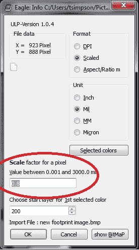](https://cdn.sparkfun.com/assets/f/b/b/c/c/51edc25dce395f3565000007.jpg)

这就是参考线发挥作用的地方。我总是要估算比例，运行脚本，然后对照参考线测量图像。如果图像太小，我选择它全部(alt + F7)，删除它(F3)，并使用更大的比例重新导入图像来运行脚本。如果图像太大，我使用较小的比例。

有时需要 5 或 6 次导入才能使尺寸完全正确，但这是值得的。一旦你有了图像，剩下的就是把铜层安装到图像中的焊盘上。

[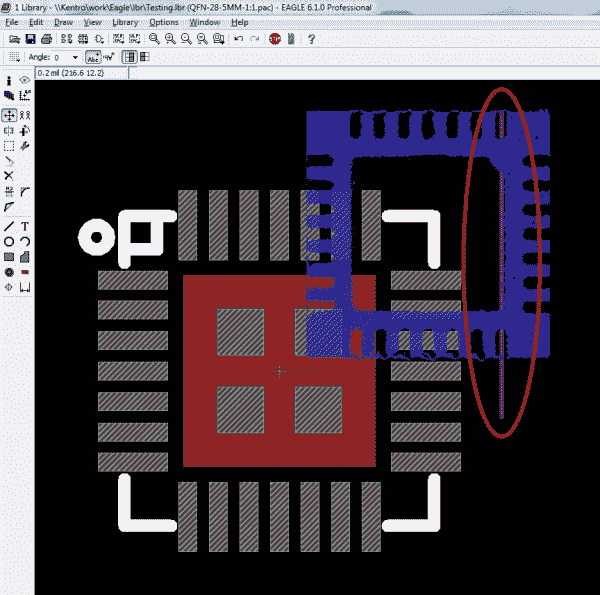](https://cdn.sparkfun.com/assets/0/a/b/2/c/51edc25dce395f8a65000004.jpg)*Imported image too small.*[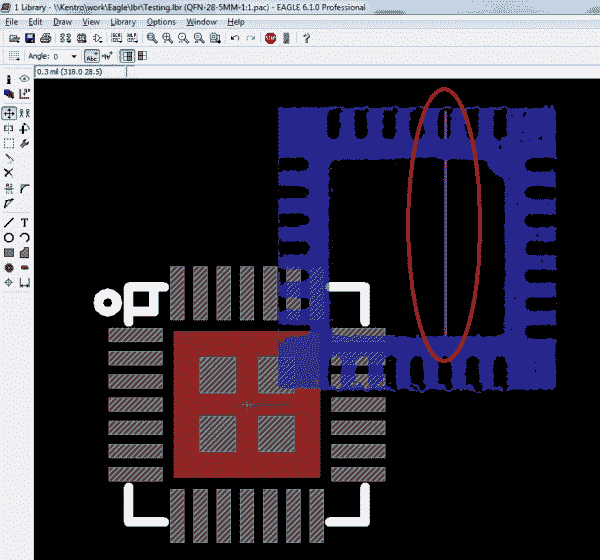](https://cdn.sparkfun.com/assets/e/2/a/3/0/51edc25dce395fb865000004.jpg)*Imported image too large.*[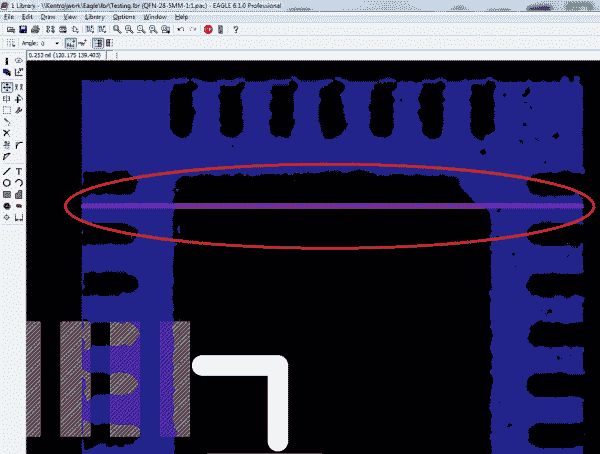](https://cdn.sparkfun.com/assets/8/4/3/d/2/51edc25dce395fdb65000001.jpg)*Imported image correct size -- flipped it horizontally for better visibility.*

如您所见，参考线与 IC 图像的外部边缘相匹配。还要注意，导入的图像的颜色是它被导入到的 Eagle 层的颜色(200 是默认值),并且通过只选择第一个颜色框，我们得到的组件是正空间(蓝色),凸台是负空间。

将导入的图像移动到足迹的中心似乎有点棘手。首先，请注意，图像被分解成单独的像素，每个像素都是自己的对象。这意味着您不能简单地选择一个并移动整个图像。这意味着你必须隔离层 200，选择整个图像(alt + F7)，然后将它移动到其余的足迹(F7)。我使用大的中心垫作为我的参考点，确保它与我导入的图像上的中心负空间对齐。

[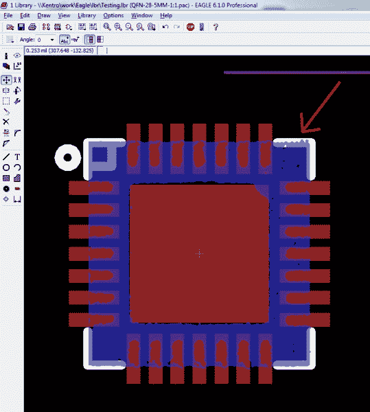](https://cdn.sparkfun.com/assets/d/3/f/e/0/51edc25dce395f0466000001.jpg)

这样，您现在应该有了正确的足迹大小和尺寸的图像。现在让我们来看看如何编辑我们的部分，以符合这个 1:1 的形象。

## 编辑现有示意图

机会是现有的足迹将相当接近正确的大小和间距，但总是有更好的方法来设置东西。例如，在本例中，封装外形上的焊盘是方形的，而器件上的焊盘是圆形的。

尽可能使金属与金属匹配。这意味着封装外形上的所有焊盘的大小和形状都应该与您正在处理的零件上的焊盘的大小和形状相同。

使用左边工具栏上的更改工具，选择圆度并键入 100(表示 100%)。然后选择每个垫，它们将从方形变为圆形。

[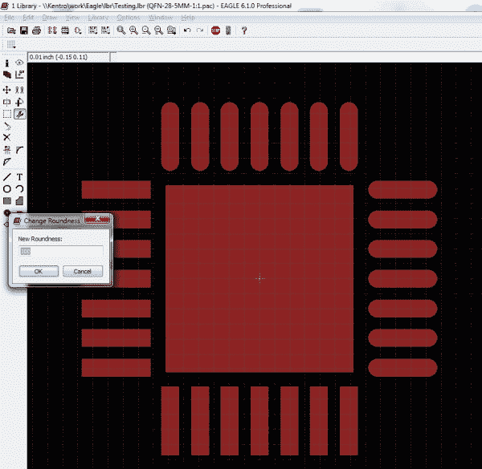](https://cdn.sparkfun.com/assets/b/5/5/8/6/51edc25dce395f0d65000004.jpg)

在所有焊盘都变圆后，使用导入的图像作为参考，将每个单独的焊盘移动到位。请注意，右手垫已正确对齐，而上下垫尚未移动。

[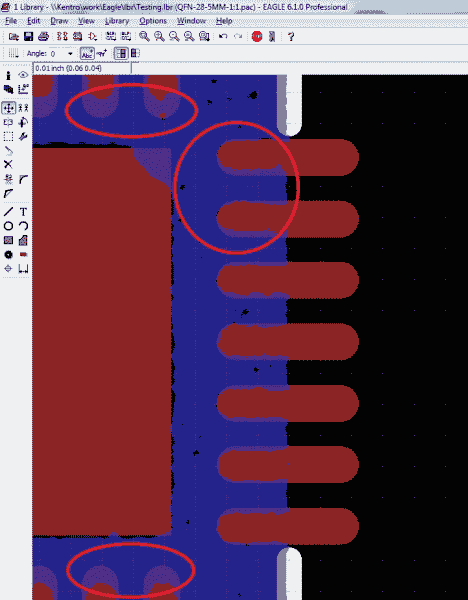](https://cdn.sparkfun.com/assets/5/c/0/4/a/51edc25ece395f0a65000006.jpg)

请记住，在大多数情况下，足迹是非常小的，所以在 Eagle 中的小移动在现实世界中甚至更小。尽你所能让事情接近就可以了。不一定要完全正确。当处理对称部分时，我总是做出对称的移动(我对一个侧面做的事情对所有四个侧面都做)，所以我最终不得不将垫移动到整体看起来最好的位置，而每个垫可能不是最好的。

*Footprint before changes.*[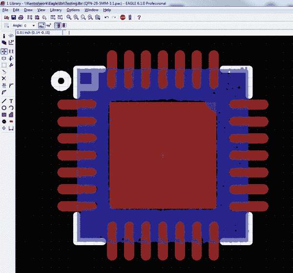](https://cdn.sparkfun.com/assets/4/9/3/7/3/51edc25ece395f9666000002.jpg)*Finsihed footprint after changes.*

## 将新包连接到设备

为了使您能够在 Eagle 中使用新的软件包，它必须连接到一个设备。因为我们只是定制一个现有的部件，所以这是一件非常简单的事情。

打开设备列表(在工具栏上的包旁边)，并选择您的设备。

[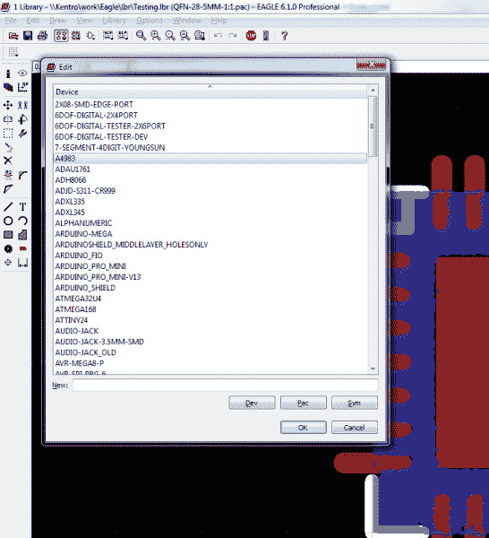](https://cdn.sparkfun.com/assets/4/7/c/2/9/51edc25ece395f1666000003.jpg)

这将打开您的设备的示意图，以及与之连接的所有软件包。

在右侧，选择“新建”。

[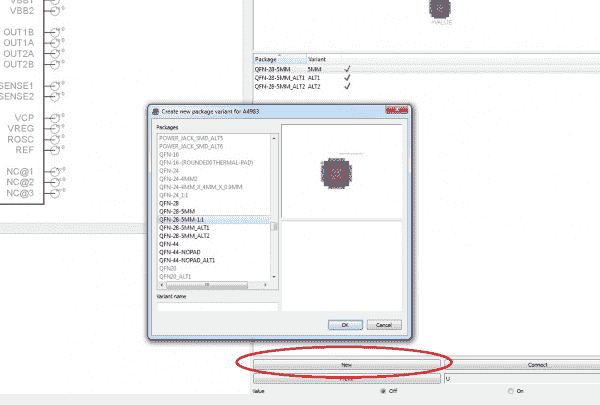](https://cdn.sparkfun.com/assets/d/5/7/3/c/51edc25ece395f2165000006.jpg)

这将打开包列表，您可以选择刚刚创建的包。

你刚刚创造了老鹰所说的变种。它是一个与设备相关联的替代包。右键单击它并点击重命名。

[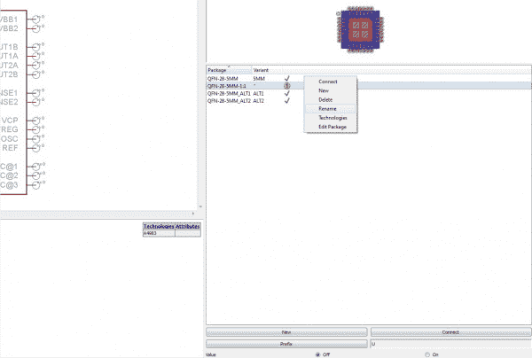](https://cdn.sparkfun.com/assets/f/4/0/7/f/51edc25ece395f3e65000003.jpg)

我总是把这个新的变体重命名为“1:1”，这样所有的库文件都是一致的，但是你可以随便叫它什么。

请注意，变体旁边有一个带感叹号的黄色小圆圈。这意味着封装已被添加到设备中，但 Eagle 不确定如何连接与焊盘相关的引脚。

选择您的变体后，点击连接按钮。

这将显示器件上所有引脚以及封装上所有引脚的列表。

从小下拉菜单中，滚动到原始包名称(如果有多个包已经与该设备相关联-在我的例子中有两个以上)。

这将连接您的变体，就像原始包一样，这是您想要的。

[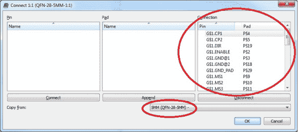](https://cdn.sparkfun.com/assets/7/2/9/4/8/51edc25ece395f1f65000007.jpg)

单击 OK 后，您就完成了连接，您的变体应该会有一个复选标记。

[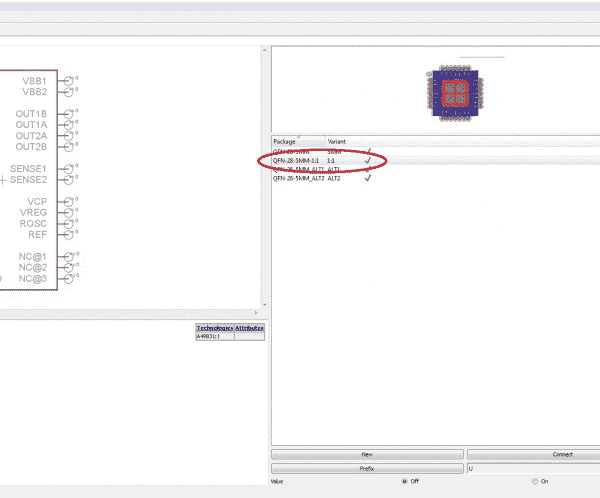](https://cdn.sparkfun.com/assets/2/7/2/b/7/51edc25ece395f1466000006.jpg)

现在剩下的就是在电路板上使用这个新的包，或者替换电路板上的现有包，如果你已经在设计中的某个地方使用了库部件。

## 资源和更进一步

我们希望你喜欢这个鹰教程。使用这种方法，我们在 SparkFun 重新设计了许多电路板，并解决了许多回流和返工问题。我们希望这些工具也能为您所用！

查看其他 SparkFun 教程，了解更多信息:

*   [连接器基础知识](https://learn.sparkfun.com/tutorials/connector-basics)
*   [电子组件](https://learn.sparkfun.com/tutorials/electronics-assembly)
*   使用我们的 [Simon -表面贴装印刷套件](https://www.sparkfun.com/products/10861)学习如何印刷和回流