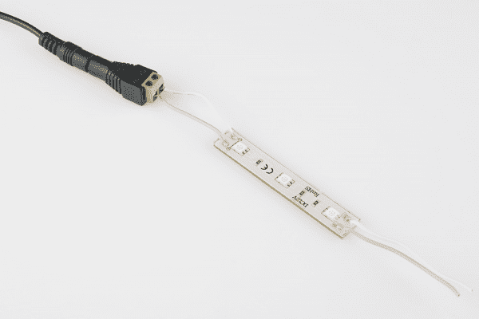
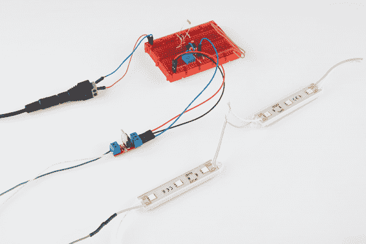

# LED 灯条连接

> 原文：<https://learn.sparkfun.com/tutorials/led-light-bar-hookup>

## 介绍

LED 灯条是为你的项目增加一些额外的*明亮*和多彩照明的超级简单的方法。每个灯条本质上是一组三个超高亮度 5050 尺寸的发光二极管。它们有多种颜色，包括[白色](https://www.sparkfun.com/products/12014)、[红色](https://www.sparkfun.com/products/12015)、[蓝色](https://www.sparkfun.com/products/678)和[绿色](https://www.sparkfun.com/products/679)(注意:蓝色和绿色灯条是旧版本，它们看起来不同，但仍然可以以相同的方式连接)。

[](https://cdn.sparkfun.com/assets/2/7/4/d/9/524476b7757b7fd53d8b4567.png)

虽然这些酒吧是非常简单的设备，但当使用它们时，它们确实有一些怪癖。比如它们的额定工作电压是 12V。在本教程中，我们将回顾这些 LED 灯条的一些重要规格。然后，我们将深入一些示例电路，帮助您充分利用这些漂亮的小 LED 组件。

### 推荐阅读

在开始学习本教程之前，您应该熟悉以下一些概念和教程:

*   发光二极管(LED)-本教程将帮助你熟悉 LED 词汇。
*   [极性](https://learn.sparkfun.com/tutorials/polarity) -这些 LED 灯条*是*偏振的。不要混淆+和-！
*   [使用电线](https://learn.sparkfun.com/tutorials/working-with-wire) -知道如何剥线、镀锡和拼接电线会很有帮助。
*   [脉宽调制(PWM)](https://learn.sparkfun.com/tutorials/pulse-width-modulation) - PWM 是一种用数字信号调光 led 的流行方法。
*   什么是 Arduino？我们的一个例子是 Arduino，一个初学者友好的可编程微控制器，帮助调暗灯条。

## 硬件概述

看一眼 LED 条就会发现，与它们连接并不需要太多东西。有两对电线引出线，分别标有“+”和“-”。深灰色导线连接到“+”引脚，白色导线连接到两侧的“-”。

[](https://cdn.sparkfun.com/assets/5/9/4/1/1/52430b2d757b7f65438b4569.png)

这些电线直接向发光二极管供电。12V 的标称电压应施加在这些电线上。较低的电压可以工作(在一定程度上),但会导致 led 变暗。任何一个线对都可以用来给 LED 供电，不用的线对可以被修整或者连接到**另一个 LED 条**。

钢条本身大约 3 英寸宽，半英寸宽。每个都有三个超亮的 SMD LEDs，间距约为 1.07 英寸。

为了便于安装，电路板的两边都有钻孔，背面有可剥离的粘性泡沫。

### LED 特性

这些 LED 条的“标称”电压为 **12V** 。“名义上”是指制造商建议的。它们将在较低的电压下工作，尽管这意味着牺牲一些亮度。

下表显示了每种 LED 条颜色的一些特征。这些是我们在测试条形时发现的值。最小电压是 led 被可识别地点亮时的最低电压，尽管非常暗。我们建议您至少给 led 提供 7V 左右的电压。电压越高，你的 LED 就越亮。

| 颜色 | 最低电压 | 7V 时的电流 | 9V 时的电流 | 电流@ 12V |
| 怀特（姓氏） | 4.84 伏 | 8.35 毫安 | 25.8 毫安 | 55.2 毫安 |
| 红色 | 2.8 伏 | 13 毫安 | 29.8 毫安 | 54.0 毫安 |

就电流牵引而言，当从 9 到 12V 供电时，两种 LED 颜色的功耗大致相同，当以标称电压供电时，最高约为 55mA。

#### 逆向工程灯条电路

看着条形上的可见组件，很明显它们并不多。三个六引脚 SMD LEDs 和相同数量的电阻。我们可以很容易地对这个电路进行逆向工程，找出这些东西是如何工作的。

每个 SMD LED 实际上是三个相同 LED 的集合。LED 灯条的 PCB 设置为将这些 LED 串联起来，串联电阻以限制电流。电阻值取决于条形的颜色。例如，红色条使用 330ω电阻，白色条使用 150ω电阻。

[](https://cdn.sparkfun.com/assets/9/6/e/7/0/52430b2d757b7f0a438b456d.png)

并联三个这样的电路，你就有了你的 LED 条！

## 组装技巧

在大多数情况下，灯条装配从[剥去一些电线](https://learn.sparkfun.com/tutorials/working-with-wire/how-to-strip-a-wire)开始。棒上的引线是 20 AWG，应该很容易用任何旧的[剥线器](https://www.sparkfun.com/products/8696)剥线。

如果需要的话，可以通过一点拼接来延长电线长度。不要忘记用热缩塑料覆盖你的拼接处！

或者，剥离的尾纤可以镀锡、压接或直接插入配套连接器。

### 串线棒

一根杆的“+”和“-”线可以连接到另一根杆上，将它们串在一起。越来越多的条可以被串起来，直到你开始接近 20 AWG 线的电流限制-大约 1.5A。通过一些背面的餐巾纸计算-每条 55mA，最大 1.5A-那将是 25 条左右的条。

[](https://cdn.sparkfun.com/assets/0/b/6/b/2/524476f5757b7f0f3b8b456c.png)

### 安装杆

有两种可能的方法来安装 LED 条。杆的两端都有安装孔，钻孔直径为 0.15 英寸，可以拧紧杆。每个酒吧还包括一个剥离粘性泡沫背衬，坚持以及你可以预期的。

轻轻一撬，LED 灯条的 PCB 组件部分就可以从塑料安装背衬上拆下来。如果您的主板可能需要更紧的配合，这可能是有用的。

[](https://cdn.sparkfun.com/assets/f/a/5/3/c/52447722757b7f983e8b456a.png)

## 示例电路

有多种方法可以控制和照亮这些 LED 条。让我们看几个电路示例:

### 直接权力

如果你不介意调光 led，最简单的方法是直接将它们连接到 12V 电源。把它们放在你的围栏或项目里，插上电源，然后忘掉它们。如果你正在寻找一个可以提供 12V 电源的电源，一个[壁式电源](https://www.sparkfun.com/products/9442)或者一个更[的通用电源](https://www.sparkfun.com/products/11296)应该可以完成这项工作。

[](https://cdn.sparkfun.com/assets/c/6/b/5/9/52447759757b7f553d8b4567.png)*The [DC Barrel Jack Screw Terminal Adapter](https://www.sparkfun.com/products/10288) makes connecting the 12V wall wart to the LED bar way easy.*

为了获得对 LED 的一点控制，您可以在电源和第一个 LED 条的'+'或'-'线之间添加一个[开关](https://learn.sparkfun.com/tutorials/button-and-switch-basics)。只要确保你选择的开关能够承受可能流过它的大电流就行了。

### 用 MOSFETs 调光

如果你想对你的 LED 灯条增加一些调光控制，结合[脉宽调制](https://learn.sparkfun.com/tutorials/pulse-width-modulation)的[MOSFET](https://www.sparkfun.com/products/10213)是你需要的工具。有几种方法可以用来产生 PWM 信号来控制 MOSFET 和 LED 条。这里有几个选项:

#### 使用 Arduino

如果你身边有一个 Arduino(现在哪个崭露头角的电气工程师没有呢？)，这可能是通过 PWM 控制 LED 灯条的最简单方法。使用如下所示的电路，一个 [n 沟道 MOSFET](https://www.sparkfun.com/products/10256) 和 Arduino 通过筒形插孔连接器由 [12V 壁式电源](https://www.sparkfun.com/products/9442)供电:

[](https://cdn.sparkfun.com/assets/a/f/5/0/9/52433cdc757b7f6c7a8b456a.png)

确保正极 LED 线(灰色的)连接到 Arduino 的“VIN ”,它应该是 12V(但也可能是 9V)。我们的 [MOSFET 功率控制套件](https://www.sparkfun.com/products/10256)非常适合这样的电路:

[](https://cdn.sparkfun.com/assets/1/7/e/2/3/524477d3757b7f182a8b4567.png)

其中，连接到 MOSFET 栅极的引脚可以是任何支持 PWM 的 Arduino 引脚(大多数 duinos 上为 3、5、6、9、10 或 11)。然后只需写一个简单的草图，将针固定在想要的水平上。例如，您可以用这样的草图慢慢调暗 LED 灯条:

```
language:c
/* MOSFET LED Bar Dimmer
    Example Arduino Sketch
*/

// Define the pin connected to our MOSFET gate:
int ledControlPin = 3; // Must be a PWM pin -- 3, 5, 6, 9, 10, 11

void setup()
{
  // Setup the LED control pin as output, start low
  pinMode(ledControlPin, OUTPUT);
  digitalWrite(ledControlPin, LOW);
}

void loop()
{
  for (int i=0; i<=255; i+=5) // Sweep LED on 
  {
    analogWrite(ledControlPin, i);
    delay(25);
  }
  delay(1000); // Hold at full brightness
  for (int i=255; i>=0; i-=5) // Sweep LED off
  {
    analogWrite(ledControlPin, i);
    delay(25);
  }
  delay(1000); // Hold at off
} 
```

或者想出其他俏皮的草图。如何连接一个电位计，用它来控制 LED 的亮度？

#### 使用 555 定时器

如果你身边没有 Arduion，或者正在寻找一个更模拟/优雅/便宜的解决方案，你可以使用一个 [555 定时器](https://www.sparkfun.com/products/9273)和一些常见的组件来产生 PWM 信号。这是一个电路示例:

[](https://cdn.sparkfun.com/assets/7/d/0/2/4/52433239757b7fb7798b4567.png)

大多数 555 定时器可以在高达 16V 的电压下工作，所以你可以直接使用 12V 电源。然后转动电位计来调节亮度。Woo 555 定时器！

[](https://cdn.sparkfun.com/assets/1/4/5/3/5/524477d3757b7fbb068b4569.png)

## 资源和更进一步

现在你知道给这些 LED 灯条接线有多简单了，你打算用它们做什么项目呢？需要一些灵感，看看这些教程:

*   [GPS 挂钟](https://www.sparkfun.com/tutorials/47) -这是我们使用 LED 棒的老例子项目。它们的超高亮度使得一些时髦的巨型 7 段显示器成为可能。

[](https://cdn.sparkfun.com/assets/8/8/3/9/c/52433e67757b7fe17a8b4569.png)

或者(在较小的范围内)这里有一些其他教程可能会引起你的兴趣:

*   [软电路:LED 感觉披萨](https://learn.sparkfun.com/tutorials/soft-circuits-led-feelings-pizza)和[萤火虫罐](https://learn.sparkfun.com/tutorials/firefly-jar-assembly-guide)教程展示了如何给衣服和其他布料增加照明。这些都是电子纺织品项目的好例子。
*   PicoBuck 连接指南-pico buck 是一款非常强大的 LED 驱动器，能够控制比 LED 灯条更亮的 LED。
*   如果你想知道更多关于光背后的物理原理，以及它是如何被操纵的，读一下这篇教程。