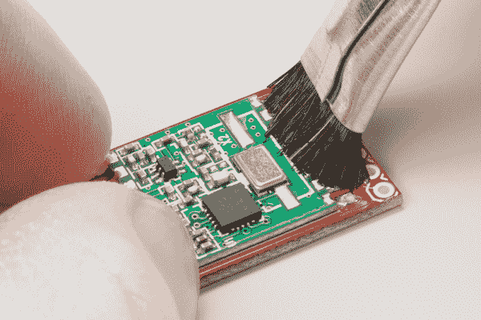
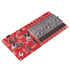

# 如何焊接:通孔焊接

> 原文：<https://learn.sparkfun.com/tutorials/how-to-solder-through-hole-soldering>

## 介绍

焊接是涉足电子世界所需的最基本技能之一。这两者形影不离。尽管不需要拿起烙铁就可以学习和制造电子产品，但你很快就会发现，这一简单的技能开启了一个全新的世界。我们 SparkFun 相信焊接应该是每个人的一项技能。在一个技术环境日益发展的世界中，我们相信，世界各地的人们不仅能够理解他们日常使用的技术，而且能够构建、改变和修复这些技术，这一点非常重要。焊接是众多能让你做到这一点的技能之一。

在本教程中，我们将复习**通孔焊接**的基础知识，也称为电镀通孔焊接(PTH)，讨论所需的工具，复习正确焊接的技术，并向您展示您可以从那里开始。我们还将讨论返工，因为它与通孔焊接有关，并给你一些提示和技巧，让修复任何电子产品都变得轻而易举。这本指南对初学者和专家都适用。无论你以前从未摸过熨斗，还是正在寻找一点复习，本教程都有一点适合每个人的东西。

### 推荐阅读

如前所述，你可以在不接触烙铁的情况下学习和制造电子学。如果您想在学习焊接之前了解更多关于电子理论的知识，我们建议您从以下教程开始:

 [### 什么是电路？](https://learn.sparkfun.com/tutorials/what-is-a-circuit) Every electrical project starts with a circuit. Don't know what a circuit is? We're here to help.[Favorited Favorite](# "Add to favorites") 82 [### 电压、电流、电阻和欧姆定律](https://learn.sparkfun.com/tutorials/voltage-current-resistance-and-ohms-law) Learn about Ohm's Law, one of the most fundamental equations in all electrical engineering.[Favorited Favorite](# "Add to favorites") 132 [### 什么是电？](https://learn.sparkfun.com/tutorials/what-is-electricity) We can see electricity in action on our computers, lighting our houses, as lightning strikes in thunderstorms, but what is it? This is not an easy question, but this tutorial will shed some light on it 83

如果您想了解更多关于无需拿起烙铁即可构建电路的知识，请查看我们的无焊试验板教程:

 [### 如何使用试验板](https://learn.sparkfun.com/tutorials/how-to-use-a-breadboard) Welcome to the wonderful world of breadboards. Here we will learn what a breadboard is and how to use one to build your very first circuit.[Favorited Favorite](# "Add to favorites") 79

最后，我们将建立在一些以前的教程之上，因此建议您在继续本教程之前阅读并理解这些主题:

 [### PCB 基础知识](https://learn.sparkfun.com/tutorials/pcb-basics) What exactly IS a PCB? This tutorial will breakdown what makes up a PCB and some of the common terms used in the PCB world.[Favorited Favorite](# "Add to favorites") 50 [### 使用导线](https://learn.sparkfun.com/tutorials/working-with-wire) How to strip, crimp, and work with wire.[Favorited Favorite](# "Add to favorites") 50 [### 极性](https://learn.sparkfun.com/tutorials/polarity) An introduction to polarity in electronic components. Discover what polarity is, which parts have it, and how to identify it.[Favorited Favorite](# "Add to favorites") 52

* * *

如果你们都被上面的阅读所吸引，让我们开始吧！

* * *

## 什么是焊料？

在学习如何焊接之前，明智的做法是学习一点关于焊接的知识，它的历史，以及讨论时将会用到的术语。

**[焊料](https://www.sparkfun.com/categories/49)** ，作为一个词，可以有两种不同的用法。*焊料，名词*，指的是合金(一种由两种或两种以上金属组成的物质)，通常是线轴或管中的细长金属丝。*是动词*，意思是将两块金属连接在一起，称为**焊点**。所以，我们用焊料焊接！

*Solder wire sold as a [spool](https://www.sparkfun.com/products/10243) (left) and in a [tube](https://www.sparkfun.com/products/9163) (right). These come in both leaded and lead-free varieties.*

### 含铅与无铅焊料——简史

谈到焊料，需要注意的最重要的一点是，传统上，焊料主要由铅(Pb)、锡(Sn)和一些其他微量金属组成。这种焊料被称为**含铅焊料**。众所周知，[铅对人体有害](http://chemistry.about.com/od/howthingsworkfaqs/f/leadpoisoning.htm)，大量接触会导致铅中毒。不幸的是，铅也是一种非常有用的金属，它被选为焊接的首选金属，因为它的熔点低，能够产生良好的焊点。

随着含铅焊接的不利影响众所周知，一些关键的个人和国家决定最好不再使用含铅焊接。2006 年，欧盟通过了[有害物质限制指令](http://en.wikipedia.org/wiki/Restriction_of_Hazardous_Substances_Directive) ( **RoHS** )。简单地说，该指令限制含铅焊料(以及其他材料)在电子和电气设备中的使用。于是，使用**无铅焊料**成为电子制造业的标准。

无铅焊料与含铅焊料非常相似，除了，如其名称所述，它不含铅。相反，它主要由锡和其他微量金属组成，如银和铜。这种焊料通常标有 RoHS 符号，让潜在买家知道它符合标准。

### 为工作选择合适的焊料

在制造电子产品时，最好使用无铅焊料，以确保产品的安全性。然而，当涉及到您和您的电子产品时，焊料的选择由您自己决定。许多人仍然喜欢使用含铅焊料，因为它具有极好的连接能力。然而，其他人更喜欢安全性而不是功能性，选择无铅的。SparkFun [出售这两种品种](https://www.sparkfun.com/search/results?term=solder+lead+&what=products),让个人自己做出选择。

无铅焊料并非没有缺点。如上所述，选择铅是因为它在焊接等情况下表现最佳。当你拿走了铅，你也就拿走了焊料的一些特性，这些特性使它成为连接两片金属的理想材料。一个这样的属性是熔点。锡的熔点比铅高，因此需要更多的热量来实现流动。而且，虽然 tin 完成了工作，但它有时需要一点帮助。许多无铅焊料都有所谓的**焊剂芯。**现在，我们只知道助焊剂是一种化学试剂，有助于无铅焊料的流动。虽然可以使用不含助焊剂的无铅焊料，但它更容易达到与含铅焊料相同的效果。此外，由于制造无铅焊料的额外成本，它有时会比含铅焊料更贵。

除了选择含铅或无铅焊料，挑选焊料时还有许多其他因素需要考虑。首先，除了铅和锡，还有成吨的其他焊料成分。查看[维基百科焊接页面](http://en.wikipedia.org/wiki/Solder)获取不同类型的详细列表。第二，焊料有多种规格或宽度。当处理小元件时，通常最好使用非常薄的焊料片-数字越大，规格越小。对于大型元件，建议使用较粗的电线。最后，除了金属丝，焊料还有其他形式。当进入表面贴装焊接时，你会发现锡膏是首选形式。不过由于这是通孔焊接教程，锡膏就不详细讨论了。

### 购买焊料

SparkFun 提供多种尺寸的有铅和无铅焊料线轴。无论你只是需要一个项目，还是为即将到来的冬天储备，SparkFun 都有你需要的。你也可以访问 SparkFun 目录的[焊接类别](https://www.sparkfun.com/categories/49)来获得更多的焊接选项。

#### 无铅

 

将**添加到您的[购物车](https://www.sparkfun.com/cart)中！**

 **### [Solder-1/4 磅短管(0.020”)特殊混合](https://www.sparkfun.com/products/10242)

[In stock](https://learn.sparkfun.com/static/bubbles/ "in stock") TOL-10242

我们不想炒作这种焊料太多，但这可能是世界上最好的焊料。好了，我们已经说过了。这…

$32.5014[Favorited Favorite](# "Add to favorites") 17[Wish List](# "Add to wish list")**** 

将**添加到您的[购物车](https://www.sparkfun.com/cart)中！**

 **### [Solder - 1/4lb Spool (0.032”)特殊混合](https://www.sparkfun.com/products/10243)

[In stock](https://learn.sparkfun.com/static/bubbles/ "in stock") TOL-10243

我们不想炒作这种焊料太多，但这可能是世界上最好的焊料。好了，我们已经说过了。这…

$26.956[Favorited Favorite](# "Add to favorites") 16[Wish List](# "Add to wish list")**** 

将**添加到您的[购物车](https://www.sparkfun.com/cart)中！**

 **### [无铅焊料- 100 克线轴](https://www.sparkfun.com/products/9325)

[In stock](https://learn.sparkfun.com/static/bubbles/ "in stock") TOL-09325

这是带有水溶性树脂芯的无铅焊料的基本线轴。0.031 英寸规格，100 克。这是一个好主意…

$9.957[Favorited Favorite](# "Add to favorites") 33[Wish List](# "Add to wish list")**** 

将**添加到您的[购物车](https://www.sparkfun.com/cart)中！**

 **### [无铅焊料- 15 克管](https://www.sparkfun.com/products/9163)

[In stock](https://learn.sparkfun.com/static/bubbles/ "in stock") TOL-09163

这是你的无铅焊料的基本管，带有不干净的水溶性树脂芯。0.031 英寸规格，15 克

$3.954[Favorited Favorite](# "Add to favorites") 14[Wish List](# "Add to wish list")******** ********#### 加铅框的

 

将**添加到您的[购物车](https://www.sparkfun.com/cart)中！**

 **### [焊锡含铅 100 克线轴](https://www.sparkfun.com/products/9161)

[In stock](https://learn.sparkfun.com/static/bubbles/ "in stock") TOL-09161

这是你的含铅焊料的基本线轴，带有 63/37 水溶性树脂芯。0.031 英寸规格，100 克。这是一个很好的例子…

$6.503[Favorited Favorite](# "Add to favorites") 25[Wish List](# "Add to wish list")**** 

将**添加到您的[购物车](https://www.sparkfun.com/cart)中！**

 **### [焊锡含铅 15 克管](https://www.sparkfun.com/products/9162)

[27 available](https://learn.sparkfun.com/static/bubbles/ "27 available") TOL-09162

这是你的基本铅管焊料与 63/37 水溶性树脂核心。0.031 英寸规格，15 克(约 5 英尺)。简单…

$2.25[Favorited Favorite](# "Add to favorites") 7[Wish List](# "Add to wish list")**** ****现在你知道了如何选择最佳的焊料，让我们继续学习工具和更多的术语。

* * *

## 烙铁

有很多工具可以帮助焊接，但是没有一个比烙铁更重要。如果没有别的，你至少需要一个熨斗和一些焊料来完成手头的任务。烙铁有多种形式，从简单到复杂，但它们的功能大致相同。在这里，我们将讨论熨斗的部件和不同类型的熨斗。

### 烙铁解剖

以下是组成烙铁的基本部件。

*   **[烙铁尖](https://www.sparkfun.com/search/results?term=solder+tip)**——没有烙铁尖的烙铁是不完整的。烙铁头是烙铁的一部分，它可以加热并允许焊料在两个被连接的部件之间流动。虽然应用时焊料会粘在尖端，但一个常见的误解是尖端转移焊料。尖端实际上传递热量，将金属部件的温度升高到焊料的熔点，焊料相应地熔化。如果你需要更换旧的烙铁头，或者你需要换一种不同样式的烙铁头，大多数烙铁都会给你更换烙铁头的选项。吸头有各种尺寸和形状，可容纳任何部件。

*Several types of tips. From left to right, the bevel tip (aka hoof tip), two conical tips with varying widths, and the chisel tip.*

更换吸头是一个简单的过程，只需拧开棒或简单地推入和拉出吸头

**Tip:** The efficiency of the heat transferred from the tip to the joint is dependent on the the size of the soldering iron tip that you are using. Usually, you want to have a soldering tip that is about the same width as the soldering pad you are soldering to. For more information, check out [this article by Hakko](http://www.hakko.com/english/tip_selection/selection_1.html).

*   魔杖 -魔杖是熨斗的一部分，用来握住笔尖。这也是由用户处理的部分。棒通常由各种绝缘材料(如橡胶)制成，以防止尖端的热量传递到棒的外部，但它们也容纳将热量从底座或出口传递到尖端的电线和金属触点。这种加热和防止烧伤的双重作用使得高质量的魔杖备受青睐。

*Two varieties of wands. Notice how the tips screw into the wand allowing for interchangeability. Some wands have tips that simply push in and pull out without any attaching mechanism.*

有些熨斗只由一根插入墙上插座的棒组成。这些熨斗就像它们来的时候一样简单，它们没有任何控制来改变温度。在这些熨斗中，加热元件直接内置在棒中。

*A [simple soldering iron](https://www.sparkfun.com/products/9507) that consists of just the wand. Some of these irons do not offer interchangeable tips.*

*   **底座** -烙铁的底座是控制盒，可以调节温度。棒附着在底座上，从里面的电子设备接收热量。有模拟底座，有控制温度的刻度盘，还有数字底座，有设置温度的按钮和告诉你当前温度的显示器。一些基座甚至有额外的功能，如热分布，允许您快速改变提供给焊头的热量，以焊接各种组件。

*Two variations of a soldering iron base. On the left, a digital base, complete with control buttons and a digital display. On the right, an analog base that uses a dial to control the temperature.*

底座通常由一个大型变压器和几个其他控制电子设备组成，这些电子设备可以安全地让您改变尖端的温度。

*The insides of a soldering iron base*

*   支架(摇篮) -熨斗支架(通常被称为摇篮)是在熨斗不用时存放熨斗的地方。支架可能看起来微不足道，但将无人看管的熨斗放在你的桌子或工作台上是一个潜在的危险:它可能会烧伤你，或者更糟的是，它可能会烧伤你的桌子并引发火灾。同样，它们可以像[金属支架](https://www.sparkfun.com/products/9477)一样简单，也可以很复杂，提供自动关闭功能，当棒放在支架上时降低尖端的温度。这有助于防止齿尖长期磨损。

*Different types of iron cradles. Notice some allow for a regular sponge while others hold a brass sponge.*

*   **[黄铜海绵](https://www.sparkfun.com/products/8964)**——当你焊接时，你的尖端会倾向于**氧化**，这意味着它会变黑，不想接受焊料。尤其是使用无铅焊料时，焊料中的杂质会聚集在熨斗尖端，从而导致氧化。这就是海绵的用武之地。你应该经常擦拭你的鼻尖，让它干净一点。传统上，一个真正的湿海绵是用来完成这一点。然而，使用湿海绵会大大减少您的提示的寿命。通过在凉爽、潮湿的海绵上擦拭指尖，指尖会随着温度的变化而膨胀和收缩。这种膨胀和收缩会磨损你的鼻尖，有时会在鼻尖侧面形成一个洞。一旦尖端有孔，就不利于焊接。因此，黄铜海绵已成为尖端清洁的标准。黄铜海绵从尖端吸走多余的焊料，同时允许尖端保持其当前的热度。如果你没有黄铜海绵，一块普通的海绵总比没有好。

*A [brass sponge](https://www.sparkfun.com/products/8964). If your iron stand doesn't have a spot for a brass sponge, you can get [one](https://www.sparkfun.com/products/8965) with its own base.*

* * *

## 购买烙铁

无论您是新手还是经验丰富的专业人士，我们都有适合您的烙铁！

### 我们的建议:

 

将**添加到您的[购物车](https://www.sparkfun.com/cart)中！**

 **### [威勒 WE1010 焊台](https://www.sparkfun.com/products/14734)

[Only 1 left!](https://learn.sparkfun.com/static/bubbles/ "only 1 left!") TOL-14734

韦勒的 WE1010 是一个强大的 70 瓦焊接站，是热情的爱好者，DIY 者和任何人的完美选择。

$138.504[Favorited Favorite](# "Add to favorites") 26[Wish List](# "Add to wish list")**** 

### [威勒 WLC100 焊台](https://www.sparkfun.com/products/14228)

[Out of stock](https://learn.sparkfun.com/static/bubbles/ "out of stock") TOL-14228

Weller 的 WLC100 是一款多功能的 5 瓦至 40 瓦焊台，非常适合业余爱好者、DIY 爱好者和学生。…

2[Favorited Favorite](# "Add to favorites") 17[Wish List](# "Add to wish list") 

将**添加到您的[购物车](https://www.sparkfun.com/cart)中！**

 **### [【烙铁- 60W(可调温度)](https://www.sparkfun.com/products/14456)

[In stock](https://learn.sparkfun.com/static/bubbles/ "in stock") TOL-14456

当你不想倾家荡产，但又需要一个可靠的烙铁时，这个可调节温度的烙铁是一个很好的工具…

$16.5016[Favorited Favorite](# "Add to favorites") 43[Wish List](# "Add to wish list")**** 

将**添加到您的[购物车](https://www.sparkfun.com/cart)中！**

 **### [烙铁- 30W(美国，110V)](https://www.sparkfun.com/products/9507)

[33 available](https://learn.sparkfun.com/static/bubbles/ "33 available") TOL-09507

这是一个非常简单的固定温度，快速加热，30W 110/120 VAC 烙铁。我们真的很喜欢使用更贵的 iro…

$10.957[Favorited Favorite](# "Add to favorites") 21[Wish List](# "Add to wish list")****** ******寻找更多烙铁选项？点击下面的按钮查看目录中的其他选项！

[Click to Here for More Soldering Iron & Stations](https://www.sparkfun.com/categories/49)

* * *

## 焊接附件

现在你已经知道了烙铁的来龙去脉，是时候讨论其他工具来帮助你进行焊接冒险了。

### 焊料芯

*   **[焊芯](https://www.sparkfun.com/products/8775)**——橡皮擦用来焊接铅笔。当处理诸如跳线或移除部件(脱焊)等问题时，焊芯非常方便。焊料芯-又名脱焊编织物-由细铜线编织而成。焊料被铜吸收，允许你[“擦除”多余的焊料滴](https://learn.sparkfun.com/tutorials/simon-says-assembly-guide#solder_wick)。

 

将**添加到您的[购物车](https://www.sparkfun.com/cart)中！**

 **### 2 号焊芯 25 英尺。——TechSpray

[In stock](https://learn.sparkfun.com/static/bubbles/ "in stock") TOL-08775

焊芯、咖啡和纸巾让 SparkFun 保持运转。你可以偷别人的斜切刀一分钟，但你会…

$32.504[Favorited Favorite](# "Add to favorites") 18[Wish List](# "Add to wish list")** **### 尖头罐头盒

*   **[烙铁头](https://www.sparkfun.com/products/13246)**——一种用来清洁烙铁尖端的化学糊状物。它由一种温和的酸组成，有助于去除烘烤残留物(如当你不小心熔化了元件上的尖端时)，并有助于防止氧化(令人讨厌的黑色物质)在不使用时积累在你的焊接尖端上。

 

将**添加到您的[购物车](https://www.sparkfun.com/cart)中！**

 **### 

[34 available](https://learn.sparkfun.com/static/bubbles/ "34 available") TOL-13246

在你的焊接供应品中，尖罐是一个好东西。由一种温和的酸组成，它有助于去除烘烤的残留物。

$10.956[Favorited Favorite](# "Add to favorites") 53[Wish List](# "Add to wish list")** **### 焊料真空(焊料吸盘)

*   **(吸锡器)** -拆焊元件时清除通孔中残留焊料的绝佳工具。我们将在教程的稍后部分讨论如何使用这个工具。

 

将**添加到您的[购物车](https://www.sparkfun.com/cart)中！**

 **### [焊料真空](https://www.sparkfun.com/products/13203)

[In stock](https://learn.sparkfun.com/static/bubbles/ "in stock") TOL-13203

焊料真空，一个伟大的(有时被低估的)小工具，用于焊料返工。它可以让你把熔化的…

$5.507[Favorited Favorite](# "Add to favorites") 47[Wish List](# "Add to wish list")** **### 流量

*   **[水溶性助焊剂笔](https://www.sparkfun.com/products/retired/8967)**——助焊剂是一种帮助无铅焊料流动的化学试剂。助焊剂笔允许你用液态助焊剂轻拍顽固的元件，以创造更好看的焊点。建议[清洁并去除](https://learn.sparkfun.com/tutorials/electronics-assembly#washing)电路板上任何残留的水溶性助焊剂残留物。

*   **[无清洁助焊剂笔](https://www.sparkfun.com/products/14579)**——助焊剂是另一种帮助无铅焊料流动的化学试剂。助焊剂笔允许你用液态助焊剂轻拍顽固的元件，以创造更好看的焊点。不需要清洁和清除焊剂。对于那些有兴趣去除焊剂残渣的人，需要异丙醇(IPA)。

 

将**添加到您的[购物车](https://www.sparkfun.com/cart)中！**

 **### [芯片快克免清洗助焊剂笔- 10mL](https://www.sparkfun.com/products/14579)

[In stock](https://learn.sparkfun.com/static/bubbles/ "in stock") TOL-14579

这款来自 Chip Quik 的 10 毫升免清洗助焊剂笔非常适合您的所有焊接、脱焊、返工和回流目的！

$8.954[Favorited Favorite](# "Add to favorites") 36[Wish List](# "Add to wish list")** **### 硅胶焊接垫

*   **[绝缘硅胶焊垫](https://www.sparkfun.com/products/14672)**——用硅胶焊垫保护你的桌面，让它保持干净。

 

将**添加到您的[购物车](https://www.sparkfun.com/cart)中！**

 **### [绝缘硅胶焊垫](https://www.sparkfun.com/products/14672)

[In stock](https://learn.sparkfun.com/static/bubbles/ "in stock") TOL-14672

有了这种绝缘硅胶焊接垫，您将能够保护您的桌面、焊接站或…

$10.959[Favorited Favorite](# "Add to favorites") 93[Wish List](# "Add to wish list")** **### 焊料分配器

*   -防止你的线轴滚动并分发你的焊料。

 

将**添加到您的[购物车](https://www.sparkfun.com/cart)中！**

 **### 

[Out of stock](https://learn.sparkfun.com/static/bubbles/ "out of stock") TOL-14232

Solder-Mate 焊锡分配器为您提供了一种简单的方法...分发焊料！这个方便的工具提供了一个 cont…

$12.952[Favorited Favorite](# "Add to favorites") 18[Wish List](# "Add to wish list")** **### 其他建议的工具

下面的工具不是必须的，但它们确实有时会使焊接变得更容易。

### 第三只手(第三只手臂)

*   **[第三只手](https://www.sparkfun.com/search/results?term=third)(第三只手)** -当你焊接时，第三只手非常适合固定 PCB、电线和元件。铰接取决于第三个臂的制造方式。一些第三臂比其他第三臂具有更大的运动范围来支撑 PCB。

 

将**添加到您的[购物车](https://www.sparkfun.com/cart)中！**

 **### [第三只手](https://www.sparkfun.com/products/9317)

[In stock](https://learn.sparkfun.com/static/bubbles/ "in stock") TOL-09317

这是焊接工最好的帮手，第三只手。带有一个沉重的基础，两个鳄鱼夹，一个烙铁架，和…

$10.9511[Favorited Favorite](# "Add to favorites") 57[Wish List](# "Add to wish list")**** 

将**添加到您的[购物车](https://www.sparkfun.com/cart)中！**

 **### [SparkFun 第三手工具包](https://www.sparkfun.com/products/11784)

[17 available](https://learn.sparkfun.com/static/bubbles/ "17 available") TOL-11784

你对大多数第三只手不够灵活感到沮丧吗？SparkFun 第三只手让你有能力握住…

$37.5060[Favorited Favorite](# "Add to favorites") 86[Wish List](# "Add to wish list")**** 

将**添加到您的[购物车](https://www.sparkfun.com/cart)中！**

 **### [磁性二手套件](https://www.sparkfun.com/products/19944)

[Out of stock](https://learn.sparkfun.com/static/bubbles/ "out of stock") TOL-19944

如果你需要多一双手(或者三只手！)以帮助微妙的，细致的工作，你会欣赏这种磁性的…

$49.99[Favorited Favorite](# "Add to favorites") 4[Wish List](# "Add to wish list")****** ******### 小帕纳维斯

*   **[pana vise Jr .——真空底座](https://www.sparkfun.com/products/10410)**——焊接和返工电路板时，将 PCB、电线和元件固定到位的另一个伟大工具。

 

### [小帕纳维斯-真空底座](https://www.sparkfun.com/products/retired/10410)

[Retired](https://learn.sparkfun.com/static/bubbles/ "Retired") TOL-10410

Panavise Jr .是一个真空底座的大虎钳。它的钳口可张开约 3 英寸，并有用于印刷电路板的凹槽。非常适合…

2 **Retired**[Favorited Favorite](# "Add to favorites") 23[Wish List](# "Add to wish list")

### 印刷电路板虎钳

*   **它们也很容易放在显微镜下，使 PCB 始终保持焦点对准。担心不小心用老虎钳融化了你的标准尼龙下巴？你可能想通过拿起一对[高温聚四氟乙烯爪](https://www.sparkfun.com/products/17594)来升级。它们不会因偶然接触烙铁而熔化或损坏。**

 

将**添加到您的[购物车](https://www.sparkfun.com/cart)中！**

 **### [粘着 PCB 瞄准](https://www.sparkfun.com/products/17235)

[In stock](https://learn.sparkfun.com/static/bubbles/ "in stock") TOL-17235

这些扁平的 PCB 支架非常棒，因为您的手可以直接放在桌子上进行精细焊接和探测。

$35.50[Favorited Favorite](# "Add to favorites") 9[Wish List](# "Add to wish list")**** 

### [粘住高温聚四氟乙烯钳口](https://www.sparkfun.com/products/retired/17594)

[Retired](https://learn.sparkfun.com/static/bubbles/ "Retired") TOL-17594

担心意外熔化老虎钳上的标准尼龙钳夹？不要担心，这些高温聚四氟乙烯颚…

**Retired**[Favorited Favorite](# "Add to favorites") 0[Wish List](# "Add to wish list")** **### PC bite kit(PC bite 套件)

*   **PCBite 套件([小型](https://www.sparkfun.com/products/19720)和[大型基板](https://www.sparkfun.com/products/19721))**-PC bite 套件包括带不锈钢弹簧夹的 PCB 支架，可夹住不同尺寸和形状的 PCB 边缘。黄色绝缘垫圈用于保护电路板。在每个 PCB 支架的底部是一个强大的磁铁，允许支架粘在不锈钢基板上。虽然这种“第三只手”没有灵活的手臂，但它是在平板上安全夹持 PCB 进行焊接、脱焊或返工的理想选择。PCBite 套件也是便携式的，并且不像某些第三只手那样笨拙地成形。此外，还有[配件可轻松探测](https://www.sparkfun.com/categories/tags/pcbite)电路板。

 

将**添加到您的[购物车](https://www.sparkfun.com/cart)中！**

 **### [【PC bite 套件(小基板)](https://www.sparkfun.com/products/19720)

[Only 13 left!](https://learn.sparkfun.com/static/bubbles/ "only 13 left!") TOL-19720

非常适合放置 PCB 进行焊接或检查。

$62.50[Favorited Favorite](# "Add to favorites") 1[Wish List](# "Add to wish list")**** 

将**添加到您的[购物车](https://www.sparkfun.com/cart)中！**

 **### [PCBite 套件(大底板)](https://www.sparkfun.com/products/19721)

[Only 4 left!](https://learn.sparkfun.com/static/bubbles/ "only 4 left!") TOL-19721

非常适合放置 PCB 进行焊接或检查。

$72.95[Favorited Favorite](# "Add to favorites") 3[Wish List](# "Add to wish list")**** ****### 尖嘴钳

*   **[尖嘴钳](https://www.sparkfun.com/products/8793)**——迷你钳是任何爱好者或电气工程师的必备之物。对于将设备插入试验板和弯曲引脚至关重要。

 

将**添加到您的[购物车](https://www.sparkfun.com/cart)中！**

 **### [尖嘴钳](https://www.sparkfun.com/products/8793)

[In stock](https://learn.sparkfun.com/static/bubbles/ "in stock") TOL-08793

迷你钳子。这些是很棒的小钳子！任何爱好者或电气工程师的必备。对于插入设备至关重要…

$3.501[Favorited Favorite](# "Add to favorites") 22[Wish List](# "Add to wish list")** **### 对角切割器

*   **[对角切割器](https://www.sparkfun.com/products/08794)** -切割器允许你修剪你焊接到 PCB 上的元件的腿。它们还可以用来抓、抓和撬连接器或其他各种电缆，如 [LiPo 电池的 2 针 JST 连接器](https://www.sparkfun.com/tutorials/241)。

 

将**添加到您的[购物车](https://www.sparkfun.com/cart)中！**

 **### [电子剪](https://www.sparkfun.com/products/10447)

[In stock](https://learn.sparkfun.com/static/bubbles/ "in stock") TOL-10447

虽然我们的小斜切刀非常适合业余爱好，但有时你需要更有咬合力的东西。这些电子…

$16.50 $14.036[Favorited Favorite](# "Add to favorites") 9[Wish List](# "Add to wish list")**** 

将**添加到您的[购物车](https://www.sparkfun.com/cart)中！**

 **### [斜切刀](https://www.sparkfun.com/products/8794)

[In stock](https://learn.sparkfun.com/static/bubbles/ "in stock") TOL-08794

迷你斜切刀。这些是很棒的小刀具！这是夹住引线和额外焊尾的必备工具。4 英寸长。

$2.753[Favorited Favorite](# "Add to favorites") 15[Wish List](# "Add to wish list")**** ****### 平切刀具

*   ——给你一种非常干净利落地切割引线并靠近焊点的方法。斜切刀不错，但如果你真的需要近距离接触，平切刀是不错的选择。

 

将**添加到您的[购物车](https://www.sparkfun.com/cart)中！**

 **### [平齐刀具- Xcelite](https://www.sparkfun.com/products/14782)

[Out of stock](https://learn.sparkfun.com/static/bubbles/ "out of stock") TOL-14782

这些是来自 Excelite 的简单平切刀具，让您可以非常干净地切割引线并靠近焊点。

$8.952[Favorited Favorite](# "Add to favorites") 18[Wish List](# "Add to wish list")** **### 安全眼镜

*   **[安全眼镜](https://www.sparkfun.com/products/11046)**——以防被夹住的引线或熔化的焊料飞向你的眼睛。我们在 SparkFun 总部的生产线上用这些来保护眼睛！

 

将**添加到您的[购物车](https://www.sparkfun.com/cart)中！**

 **### [SparkFun 安全眼镜](https://www.sparkfun.com/products/11046)

[In stock](https://learn.sparkfun.com/static/bubbles/ "in stock") SWG-11046

有了这些 SparkFun 安全眼镜，你将拥有一副轻便、经济、时尚的镜片来保护你珍贵的…

$4.953[Favorited Favorite](# "Add to favorites") 16[Wish List](# "Add to wish list")** **### 单片眼镜

*   -用于检查 PCB 上的焊点和 SMD 元件。LED 在工作距离内提供充足的光线。

 

将**添加到您的[购物车](https://www.sparkfun.com/cart)中！**

 **### [单片放大镜](https://www.sparkfun.com/products/9316)

[In stock](https://learn.sparkfun.com/static/bubbles/ "in stock") TOL-09316

当处理小零件时，有时你需要放大和一些额外的光线。这是我们经常在电影院使用的单片眼镜

$10.952[Favorited Favorite](# "Add to favorites") 23[Wish List](# "Add to wish list")******Bundled Kits!** Check out the following tool kits with some of the soldering irons and accessories listed earlier!

 

将**添加到您的[购物车](https://www.sparkfun.com/cart)中！**

 **### [SparkFun 豪华工具包](https://www.sparkfun.com/products/11805)

[Only 4 left!](https://learn.sparkfun.com/static/bubbles/ "only 4 left!") TOL-11805

这些工具非常适合那些有工具使用经验但需要一套新零件的人…

$246.50[Favorited Favorite](# "Add to favorites") 21[Wish List](# "Add to wish list")**** 

将**添加到您的[购物车](https://www.sparkfun.com/cart)中！**

 **### [SparkFun 初学者工具包](https://www.sparkfun.com/products/14681)

[Out of stock](https://learn.sparkfun.com/static/bubbles/ "out of stock") TOL-14681

这些工具非常适合那些需要一套坚实的工具来启动工作台的人！

$62.50[Favorited Favorite](# "Add to favorites") 14[Wish List](# "Add to wish list")**** ***** * *

## 焊接您的第一个元件

让我们将所有这些工具付诸行动。第一个视频将介绍焊接第一个组件的基础知识——接头！

[//www.youtube.com/embed/f95i88OSWB4](//www.youtube.com/embed/f95i88OSWB4)

点击查看 Vimeo 版本[。](http://vimeo.com/51538354)

### 概述

真的就那么简单！遵循戴夫的简单规则，使每一个焊接连接良好。

*   处理热熨斗时要小心
*   焊接时，用第三只手或老虎钳握住电路板
*   把你的熨斗调到中火(325-375 摄氏度)
*   如果你看到焊料冒烟，关小火
*   在每次连接之前，用焊料在你的尖端上锡，以帮助准备连接
*   使用尖端的一侧(也叫甜蜜点)，而不是熨斗的尖端
*   同时均匀加热焊盘和要焊接的部分
*   拉开焊料，然后是烙铁
*   一个好的焊点应该看起来像火山或赫西吻，而不是一个球或一团

我们还整理了这张图表，以帮助您更好地理解什么是良好的焊点。

*Click for a larger image.*

完成后，在关掉烙铁之前，给烙铁头上锡以延长其寿命。

* * *

## 提示和技巧

除了使用第三个焊臂，还有其他方法将元件焊接到电路板上。你还会遇到需要不同技术来获得完美焊点的问题。看看下面的一些额外的提示和技巧！

### 用胶带或粘性图钉压住组件

有胶带或粘性图钉吗？试着用它来压住电路板上的电线或接头！

|  |  |
| *用于 [MAX30105 粒子传感器分线板](https://learn.sparkfun.com/tutorials/max30105-particle-and-pulse-ox-sensor-hookup-guide#hardware-hookup)的粘性压紧线。* | *粘性图钉压住 [GPS LS20031 模块](https://learn.sparkfun.com/tutorials/ls20031-5hz-66-channel-gps-receiver-hookup-guide#sticky-tack)的直角接头。* |

### 硅树脂或纸板作为绝缘材料

需要按住一个元件，但温度太高，无法用手指按住电路板？你总是可以抓住一块硅胶或切下一块纸板来压住组件几秒钟。下面是一个例子，一个[电阻在一块纸板的帮助下被压在一个屏蔽](https://learn.sparkfun.com/tutorials/sparkfun-arduino-protoshield-hookup-guide#hardware-assembly)上。

|  |  |

### 旧盾牌、开发板和试验板作为帮手

如果你没有一个稳定的手，你可以使用旧的盾牌和开发板，以调整前焊接头。这里有两个来自 [Arduino Shield](https://learn.sparkfun.com/tutorials/arduino-shields-v2) 教程的例子，说明如何安装阴性可堆叠接头或阳性接头。

|  |  |
| *安装带有旧护罩的可堆叠集管* | *用开发板安装公接头* |

如果你有一个屏蔽板或分线板可以安装在试验板上，你也可以在焊接时使用试验板来固定引脚。我们建议对有两排接头的电路板使用这种方法。你会想避免应用大量的热量，因为这可能会融化试验板。

|  |  |
| *为带试验板的青少年在[青少年观察罩](https://learn.sparkfun.com/tutorials/teensyview-hookup-guide#hardware-overview-and-assembly)上安装公接头。* | *在带迷你试验板的 Pro Mini 的 [MiniGen 护罩](https://learn.sparkfun.com/tutorials/minigen-hookup-guide)上安装长的公接头。* |

### 接地层和大型通孔

根据设计，电镀通孔焊盘尺寸可能连接到接地层，或者比通常情况下更大。这些需要更多的热量。你可能会注意到焊料有点“粘”，但实际上，它只是一滴一滴的。您可能需要:

*   更大的烙铁头
*   将焊接站调整到更高的温度(720°F)
*   添加助焊剂
*   让烙铁在接头上多呆一会儿

|  |  |
| *焊接到牛肉继电器上的接地引脚* | *粗电线和厚外壳继电器上的大电镀通孔之间的焊点* |

通常情况下，不断添加一些助焊剂，并保持烙铁在接头上的时间长一点会有所帮助。拥有更高功率的可调节焊接站通常有助于尖端在接触冷的东西后恢复。如果身边有朋友或者有多余的烙铁，也可以尝试用两个烙铁加热接头。

## 高级技术和故障排除

### 高级甲状旁腺激素

一旦你掌握了创建良好焊点的基础知识，是时候学习一些你可以利用的更高级的 PTH 技术了。这段视频讲述了使用助焊剂、移除焊接跳线、拆焊元件以及其他一些技巧和诀窍。

[https://www.youtube.com/embed/t9LOtOBOTb0/?autohide=1&border=0&wmode=opaque&enablejsapi=1](https://www.youtube.com/embed/t9LOtOBOTb0/?autohide=1&border=0&wmode=opaque&enablejsapi=1)

以下是 PTH 焊接的一些其他技巧:

*   脱焊通常是学习如何焊接的最好方法。有许多原因导致零件脱焊:维修、升级、回收等。视频中使用的许多技术有助于脱焊过程。

*   还有另一种从通孔中去除焊料的方法，我们称之为 [slap 法](https://www.sparkfun.com/tutorials/339)。

*   如果你不确定你制作的焊点是否形成了电连接，你可以用万用表测试[的导通性](https://learn.sparkfun.com/tutorials/how-to-use-a-multimeter/continuity)。

### 将接头固定在板上

对于那些有技巧的人来说，你可以通过将针固定在板上来安装一排割台！你可以尝试使用前面提到的胶带和粘性大头钉。下面是[在 ProtoShield](https://learn.sparkfun.com/tutorials/sparkfun-arduino-protoshield-hookup-guide#hardware-assembly) 上安装母接头的例子。但是，您可以使用公接头，或者使用这种技术在任何板上焊接接头。

抓住一个凹形可堆叠接头，将其从护罩的顶部滑动。用焊接手，用食指和拇指将接头拉向电路板边缘。用另一只手，用食指推压收割台，用拇指抓住板子。用中指按住头部。确保避免接触烙铁会接触到的任何接头引脚。

|  |  |

用你的焊接手抓住烙铁，钉上一个针。对每个标题重复上述步骤。在为每个割台钉上一个针后，你需要确保这些针是直的并且垂直于你的板子。如果没有，您可以尝试重新加热割台销并调整割台的对齐。

如果接头对齐，您可以在板上焊接其余的接头引脚，以完成在板上安装接头！

### [高级贴片](#advanced_smd)

寻找更多使用烙铁的技巧和窍门？根据 Pete 的说法，看看这些返工 SMD 元件的先进技术。

[https://www.youtube.com/embed/It2eLGzGm_I/?autohide=1&border=0&wmode=opaque&enablejsapi=1](https://www.youtube.com/embed/It2eLGzGm_I/?autohide=1&border=0&wmode=opaque&enablejsapi=1)

### 清洗助焊剂残留物

使用无铅焊料时，无论是焊料中的助焊剂还是用户使用的外部助焊剂，助焊剂往往会无处不在。随着时间的推移，某些类型的助焊剂会腐蚀 PCB 和元件，因此知道如何清洁 PCB 是很好的，这样它们就不会有任何助焊剂残留。由于空气中的水分和微小树枝状结晶的形成，这也可能导致引脚之间的高电阻短路。常见问题包括使用串行转 USB 转换器将代码上传到 Arduino，以及通过 I ² C 发送数据时出错。

他们看起来怎么样？好吧，让我们看看下面的图片。左图显示了焊点上的水溶性助焊剂残留物。这些会在焊点上或焊点周围出现黄色或棕色的涂层。右边的图像显示没有干净的助焊剂用于火花边缘。这些会在黑板上呈现出黏糊糊的白色。它不导电，所以可以留在板上。

|  |  |
| *水溶性助焊剂残留在 [8 针 SOIC 蘸适配器](https://learn.sparkfun.com/tutorials/8-pin-soic-to-dip-adapter-hookup-guide)T3 上* | *在[火花边缘的垫](https://learn.sparkfun.com/tutorials/sparkfun-edge-hookup-guide/all#hardware-hookup)上没有干净的焊剂，T3* |

如果电路板上有水溶性助焊剂残留物，您会希望将其从电路板上清除。没有干净的助焊剂，你应该不需要清除它。从电路板上清除水溶性助焊剂的最简单的方法是使用硬毛的小刷子(牙刷很好用)或棉签。然后用热的去离子水擦洗焊点，去除水溶性助焊剂。异丙醇可以用作水的替代品。如果必须清除电路板上的免清洗助焊剂，最好的方法是使用异丙醇，而不是水。请记住，你必须检查你的焊料的文件，以获得正确的清洗方法，因为其他类型的助焊剂可能需要丙酮。

|  |  |  |
| *用刷子清除水溶性焊剂* | *用棉签清除水溶性焊剂* | *用棉签清除干净的焊剂* |

如果你要焊接多块电路板，可能需要分批清洗。为此，我们推荐一个装满蒸馏水的瓦罐。蒸馏水保持其他杂质和污染物远离你的电路。下图显示了正在清洁的电池座。不是所有的板子都能像这样泡在水里。因此，您可能需要手动清洁焊点。有一个装满热去离子水的瓦罐会让这个过程更快。

|  |  |
| *把木板泡在瓦罐里* | *手动清洁 LED 灯条的焊点* |

请确保避免使用水传感器或可能积水的部件。某些组件对水很敏感，因此您应该避免将这些主板浸泡在水中，并小心不要弄湿这些组件。这里列出了一些应该避免与水接触的成分。如果水被截留在其中，并且您为主板供电，可能会损坏组件。

*   字符液晶显示器
*   7 段 LED 显示屏
*   电池
*   GPS 模块
*   无线模块
*   大气压力传感器
*   滑动电位计
*   麦克风
*   扬声器
*   心率监护仪 IC

当你完成清洁董事会，你会想消除任何多余的水从董事会。压缩空气能创造奇迹，因此你不必等待它蒸发。你也可以用纸巾擦干板子，但可能会留下棉绒。因此，用低绒抹布来擦干电路板会更好。如果你有热风枪，你也可以用它来加热板。确保不要熔化板上的任何东西。

|  |  |
| *压缩空气干燥纸板* | *低棉绒抹布烘干板* |

清洁电路板并不是 100%必要的，但是，这将极大地延长电路的寿命。此外，当电路板干净时，通过串行发送的数据将是可靠的。有关 PCB 清洗的更多信息，请单击下面的。

[Electronics Assembly: Washing](https://learn.sparkfun.com/tutorials/electronics-assembly/washing)

### 测试和排除焊点故障

一旦你完成清洁，如前所述，用设置为导通模式的[万用表检查你的焊点。如果遇到问题，需要检查引脚是否正确焊接到电路板上，这非常有用。要了解更多信息，请查看我们关于如何使用万用表的教程。](https://learn.sparkfun.com/tutorials/how-to-use-a-multimeter#continuity)

 [### 如何使用万用表

#### 2015 年 1 月 9 日](https://learn.sparkfun.com/tutorials/how-to-use-a-multimeter) Learn the basics of using a multimeter to measure continuity, voltage, resistance and current.[Favorited Favorite](# "Add to favorites") 67

寻找故障排除技巧？查看我们教程中的[硬件清单](https://learn.sparkfun.com/tutorials/sparkfun-troubleshooting-tips#hardware-checks)了解更多信息！

 [### SparkFun 故障排除提示

#### 2017 年 10 月 19 日](https://learn.sparkfun.com/tutorials/sparkfun-troubleshooting-tips) Not working as expected? In this tutorial, we will be exploring a few general troubleshooting tips and possible solutions that frequently come up with SparkFun's Technical Support.[Favorited Favorite](# "Add to favorites") 6

## 有兴趣学习更多基础主题吗？

查看我们的 **[工程要点](https://www.sparkfun.com/engineering_essentials)** 页面，了解电气工程相关基础主题的完整列表。

带我去那里！

## 资源和更进一步

我们才刚刚开始进入焊接兔子洞。一旦你掌握了 PTH 焊接，你可以尝试这些其他的技巧和教程。

*   [电子故障排除](https://learn.sparkfun.com/tutorials/sparkfun-troubleshooting-tips)
*   [电子组件](https://learn.sparkfun.com/tutorials/electronics-assembly)
*   [SMD 如何焊接系列](https://www.sparkfun.com/tutorials/36)
*   [制作自己的锡膏模版](https://www.sparkfun.com/tutorials/383)
*   [锡膏和模版](https://www.sparkfun.com/tutorials/58)并用[煎锅](https://www.sparkfun.com/tutorials/59)或[烤面包机](https://www.sparkfun.com/tutorials/60)回流焊
*   [SparkFun Simon SMD 教程 w/ Tony](https://www.youtube.com/watch?v=wE4BoCNXRXA)

有关将城堡形安装孔焊接到焊盘的更多信息，请查看我们的城堡形孔焊接指南。

 [### 如何焊接:堞形安装孔

#### 2015 年 5 月 12 日](https://learn.sparkfun.com/tutorials/how-to-solder-castellated-mounting-holes) Tutorial showing how to solder castellated holes (or castellations). This might come in handy if you need to solder a module or PCB to another PCB. These castellations are becoming popular with integrated WiFi and Bluetooth modules.[Favorited Favorite](# "Add to favorites") 19

或者查看以下教程，将表面贴装元件(SMD)焊接到分线板上。

 [### SSOP-16 至 DIP 适配器连接指南

#### 2017 年 1 月 5 日](https://learn.sparkfun.com/tutorials/ssop-16-to-dip-adapter-hookup-guide) Using the SSOP-16 to DIP adapter board.[Favorited Favorite](# "Add to favorites") 1 [### 8 针 SOIC 至 DIP 适配器连接指南

#### 2015 年 8 月 13 日](https://learn.sparkfun.com/tutorials/8-pin-soic-to-dip-adapter-hookup-guide) Assembly and application of the 8-pin SOIC-to-DIP adapter.[Favorited Favorite](# "Add to favorites") 1

寻找更多关于焊接的教程？试试看任何标有[焊接](https://learn.sparkfun.com/tutorials/tags/soldering)的教程！

 [### 电子飞船玻璃容器](https://learn.sparkfun.com/tutorials/electronic-e-craft-terrarium) A guest tutorial on an Electronic Terrarium from the Performative Sculpture class of Parsons DT.[Favorited Favorite](# "Add to favorites") 3 [### Cherry MX 交换机转接连接指南](https://learn.sparkfun.com/tutorials/cherry-mx-switch-breakout-hookup-guide) How to assemble and use the Cherry MX Switch Breakout, allowing you to turn a matrix of mechanical switches into a full-size keyboard 18 [### LuMini 环连接指南](https://learn.sparkfun.com/tutorials/lumini-ring-hookup-guide) The LuMini Rings (APA102-2020) are the highest resolution LED rings available.[Favorited Favorite](# "Add to favorites") 6 [### 拇指操纵杆连接指南](https://learn.sparkfun.com/tutorials/thumb-joystick-hookup-guide) Whether you're blasting aliens, driving a robot, or write your awesome classic Arcade Game for your Arduino, you'll find the analog thumb joystick a very useful addition to your projects 4

当然还有，没有东西可以焊的焊接教程是什么。SparkFun 出售各种各样的[套件](https://www.sparkfun.com/categories/157)，这对磨练你的焊接技能非常有用。甚至还有一个[学习焊接](https://www.sparkfun.com/search/results?term=learn+to+solder&what=products)系列工具包，里面有开始学习所需的所有工具。

 

将**添加到您的[购物车](https://www.sparkfun.com/cart)中！**

 **### [斯帕克芬西蒙说——通孔焊接套件](https://www.sparkfun.com/products/10547)

[Only 14 left!](https://learn.sparkfun.com/static/bubbles/ "only 14 left!") KIT-10547

这是我们广受欢迎的通孔西蒙说套件的最新版本。我们已经对董事会做了一些更改，应该会使…

$28.9542[Favorited Favorite](# "Add to favorites") 19[Wish List](# "Add to wish list")**** 

将**添加到您的[购物车](https://www.sparkfun.com/cart)中！**

 **### [灯塔初学者焊接工具包](https://www.sparkfun.com/products/14635)

[Out of stock](https://learn.sparkfun.com/static/bubbles/ "out of stock") KIT-14635

有了这个 Lighthouse 工具包，你将能够通过组装来学习焊接的基础和中级技能…

$9.953[Favorited Favorite](# "Add to favorites") 20[Wish List](# "Add to wish list")**** 

将**添加到您的[购物车](https://www.sparkfun.com/cart)中！**

 **### [SparkFun 象鼻虫-初学者焊接工具包](https://www.sparkfun.com/products/10723)

[In stock](https://learn.sparkfun.com/static/bubbles/ "in stock") KIT-10723

你见过一只【Weevil】(https://en . Wikipedia . org/wiki/Weevil)吗？这是一只被低估的甲虫，所以我们认为它…

$10.9514[Favorited Favorite](# "Add to favorites") 33[Wish List](# "Add to wish list")**** 

将**添加到您的[购物车](https://www.sparkfun.com/cart)中！**

 **### [SparkFun 基础手电筒焊接套件](https://www.sparkfun.com/products/14877)

[In stock](https://learn.sparkfun.com/static/bubbles/ "in stock") KIT-14877

这款手电筒焊接套件是一款易于组装的焊接套件，旨在帮助教授通孔焊接的基础知识

$5.508[Favorited Favorite](# "Add to favorites") 23[Wish List](# "Add to wish list")**** 

将**添加到您的[购物车](https://www.sparkfun.com/cart)中！**

 **### [【极客之日——焊接徽章套装(黑色)](https://www.sparkfun.com/products/14637)

[Out of stock](https://learn.sparkfun.com/static/bubbles/ "out of stock") KIT-14637

这一天的极客焊接工具包的黑色版本，你将能够学习焊接的基础知识，能够作为…

$7.503[Favorited Favorite](# "Add to favorites") 18[Wish List](# "Add to wish list")**** 

将**添加到您的[购物车](https://www.sparkfun.com/cart)中！**

 **### [【极客之日——焊接徽章套装(白色)](https://www.sparkfun.com/products/14636)

[Out of stock](https://learn.sparkfun.com/static/bubbles/ "out of stock") KIT-14636

这一天的极客焊接工具包的白色版本，你将能够学习焊接的基础知识，能够作为…

$7.502[Favorited Favorite](# "Add to favorites") 6[Wish List](# "Add to wish list")**** 

将**添加到您的[购物车](https://www.sparkfun.com/cart)中！**

 **### [SparkFun 无线操纵杆套件](https://www.sparkfun.com/products/14051)

[Only 10 left!](https://learn.sparkfun.com/static/bubbles/ "only 10 left!") KIT-14051

SparkFun 无线操纵杆套件提供了一种简单的方法来控制您的下一个 XBee 项目。在无线操纵杆之前，radi…

$43.952[Favorited Favorite](# "Add to favorites") 30[Wish List](# "Add to wish list")**** 

将**添加到您的[购物车](https://www.sparkfun.com/cart)中！**

 **### [SparkFun 十年阻力盒](https://www.sparkfun.com/products/13006)

[In stock](https://learn.sparkfun.com/static/bubbles/ "in stock") KIT-13006

这是 SparkFun 十进制电阻盒，一个复杂的 PTH 焊接套件，可以让您快速准确地拨入一个…

$36.5014[Favorited Favorite](# "Add to favorites") 36[Wish List](# "Add to wish list")**** 

将**添加到您的[购物车](https://www.sparkfun.com/cart)中！**

 **### [SparkFun 二进制爆能套装](https://www.sparkfun.com/products/12037)

[21 available](https://learn.sparkfun.com/static/bubbles/ "21 available") KIT-12037

二进制冲击波是一个游戏，旨在帮助教学什么是二进制数字，以及如何从十进制(和十六进制)转换成…

$29.505[Favorited Favorite](# "Add to favorites") 10[Wish List](# "Add to wish list")**** 

将**添加到您的[购物车](https://www.sparkfun.com/cart)中！**

 **### [SparkFun 原盾套装](https://www.sparkfun.com/products/13820)

[19 available](https://learn.sparkfun.com/static/bubbles/ "19 available") DEV-13820

SparkFun ProtoShield 套件让你使用你能想到的任何电路定制你自己的 Arduino 盾牌，然后…

$12.503[Favorited Favorite](# "Add to favorites") 17[Wish List](# "Add to wish list")**** 

将**添加到您的[购物车](https://www.sparkfun.com/cart)中！**

 **### [Unigeek - Unicorn 焊接徽章套件](https://www.sparkfun.com/products/14639)

[Only 12 left!](https://learn.sparkfun.com/static/bubbles/ "only 12 left!") KIT-14639

Unigeek 是一个焊接工具包，教你 PTH 和 SMD 焊接的基础知识，同时组装一个 light up unicorn 徽章…

$11.951[Favorited Favorite](# "Add to favorites") 12[Wish List](# "Add to wish list")**** 

将**添加到您的[购物车](https://www.sparkfun.com/cart)中！**

 **### [SparkFun ISP Pogo 适配器](https://www.sparkfun.com/products/11591)

[In stock](https://learn.sparkfun.com/static/bubbles/ "in stock") KIT-11591

Pogo 引脚使生活变得更加容易，当你试图编程，而不必焊接一个东西，当你连接到…

$13.954[Favorited Favorite](# "Add to favorites") 12[Wish List](# "Add to wish list")**** 

将**添加到您的[购物车](https://www.sparkfun.com/cart)中！**

 **### 

[29 available](https://learn.sparkfun.com/static/bubbles/ "29 available") KIT-14640

与心脏表面贴装焊接套件，您将能够学习 SMD 焊接的基础知识，能够组装一个…

$18.50[Favorited Favorite](# "Add to favorites") 15[Wish List](# "Add to wish list")**** [Retired](https://learn.sparkfun.com/static/bubbles/ "Retired") KIT-11177

SparkFun SparkPunk 套件是一款以雅达利朋克游戏机为精神的声音发生器。而不是简单地重建…

6 **Retired**[Favorited Favorite](# "Add to favorites") 39[Wish List](# "Add to wish list") 

### [SparkFun SparkPunk 音序器套装](https://www.sparkfun.com/products/retired/12707)

[Retired](https://learn.sparkfun.com/static/bubbles/ "Retired") KIT-12707

SparkFun SparkPunk 音序器是一款音乐控制电压音序器，用于控制 SparkPunk 声音套件。与……

3 **Retired**[Favorited Favorite](# "Add to favorites") 36[Wish List](# "Add to wish list") 

### [夜灯焊接套件](https://www.sparkfun.com/products/retired/14638)

[Retired](https://learn.sparkfun.com/static/bubbles/ "Retired") KIT-14638

夜灯是一个中级套件，为寻求扩展焊接专业知识的个人提供了很好的课程…

2 **Retired**[Favorited Favorite](# "Add to favorites") 21[Wish List](# "Add to wish list") 

### [SparkFun BigTime 手表套装](https://www.sparkfun.com/products/retired/11734)

[Retired](https://learn.sparkfun.com/static/bubbles/ "Retired") KIT-11734

SparkFun BigTime 手表套件是一款极客时尚的数字手表，配有北约风格的表带和光滑的丙烯酸外壳…

6 **Retired**[Favorited Favorite](# "Add to favorites") 27[Wish List](# "Add to wish list")************************** **********或者看看这些关于焊接和工具的博文！

 [### 根据皮特的说法:点对点焊接

February 27, 2017](https://www.sparkfun.com/news/2322 "February 27, 2017: Practice makes perfect...ly acceptable, folks. ")[Favorited Favorite](# "Add to favorites") 3 [### 2017 落基山邀请赛脱焊

December 20, 2017](https://www.sparkfun.com/news/2564 "December 20, 2017: OK, it’s not a thing. But if it were, it might look like this.")[Favorited Favorite](# "Add to favorites") 0 [### 周五产品贴:焊在哪里？在那里焊接！

March 30, 2018](https://www.sparkfun.com/news/2651 "March 30, 2018: Plenty of soldering kits are now available for you to learn or practice on!")[Favorited Favorite](# "Add to favorites") 0 [### 3D 打印焊接辅助手

April 16, 2018](https://www.sparkfun.com/news/2661 "April 16, 2018: A review of an extremely useful device to help you with soldering.")[Favorited Favorite](# "Add to favorites") 0 [### Enginursday:供应商聚焦威勒工具

October 4, 2018](https://www.sparkfun.com/news/2791 "October 4, 2018: Let's take a look one of our principal suppliers of soldering tools -- Weller!")[Favorited Favorite](# "Add to favorites") 1 [### 技术和艺术

January 15, 2019](https://www.sparkfun.com/news/2854 "January 15, 2019: Which came first, the function or the form? Regardless of the course your build takes from start to finish, there's no reason it can't be seen as both technology and art.")[Favorited Favorite](# "Add to favorites") 2 [### 埋入式焊盘 PCB 固定

November 18, 2019](https://www.sparkfun.com/news/3127 "November 18, 2019: Checkout how we drilled through the back of a PCB in order to solder to the hidden pads under a cellular module.")[Favorited Favorite](# "Add to favorites") 3 [### 在家从事电子工程

April 1, 2020](https://www.sparkfun.com/news/3269 "April 1, 2020: Like most of us here at SparkFun, many of you are navigating working from home. Here's a snapshot of how it's going from our perspective.")[Favorited Favorite](# "Add to favorites") 0 [### 回流多士炉烤箱 Qwiic 黑客！

June 25, 2020](https://www.sparkfun.com/news/3319 "June 25, 2020: Grab some parts, strap a servo on it, and you'll be reflowing solder in no time!")[Favorited Favorite](# "Add to favorites") 2 [### 作为新爱好的电路雕塑

August 11, 2020](https://www.sparkfun.com/news/3351 "August 11, 2020: Learn what circuit sculptures are and the few that we've made since quarantine started.")[Favorited Favorite](# "Add to favorites") 1********************************************************************