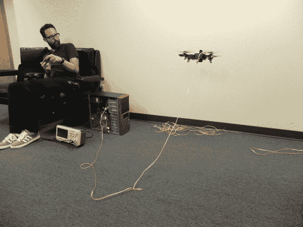
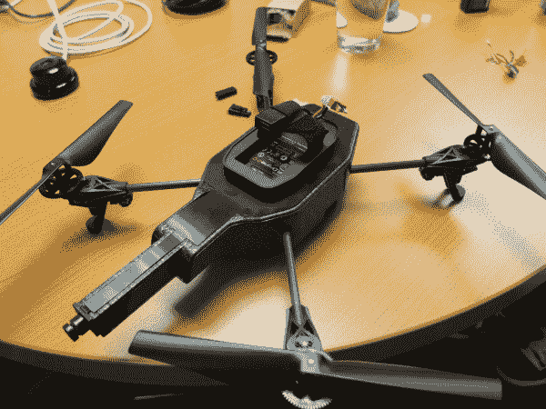
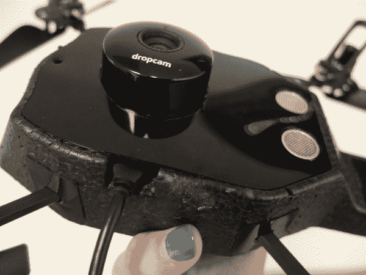
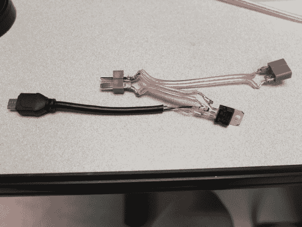
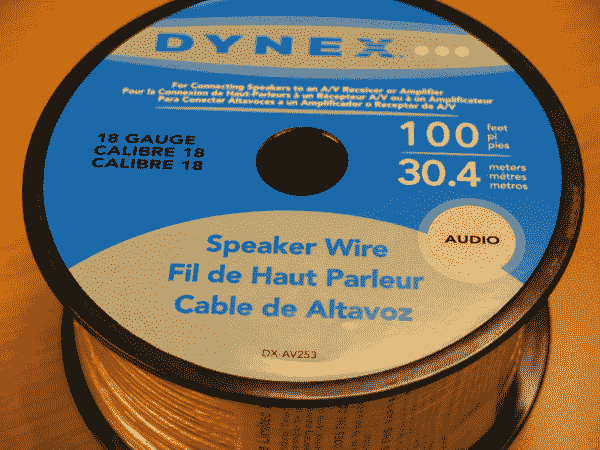
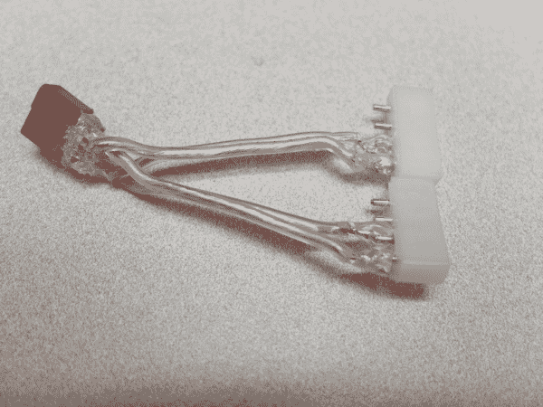
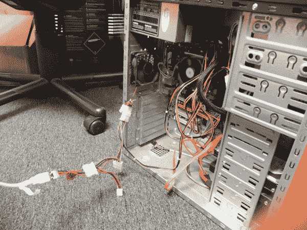
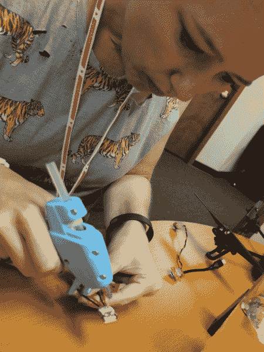

# 黑客在住宅-拴在四

> 原文：<https://learn.sparkfun.com/tutorials/hackers-in-residence---the-tethered-quad>

## 入门指南

作者:[塔拉·泰格·布朗](http://taratigerbrown.com/)和[肖恩·邦纳](http://seanbonner.com/) SparkFun 常驻黑客

**重要提示:保证无效**

这应该不用说，但通过黑客这些现成的设备，你是无效的所有保修。这很重要，因为如果你通过切割你的无人机来杀死它，你必须提前知道，你将无法打电话给公司的任何人来帮助你排除故障。Dropcam 也是如此——它旨在可控环境下的室内使用，而不是绑在无人机上到处飞。所以要知道，进入这个世界，你只能靠自己。

**你需要什么**

*   无人驾驶飞行器 2.0 四轴飞行器@ 299 美元
*   Dropcam WiFi 高清摄像头@ $149(将此选项用于 WiFi/网络直播)或 HackHD 摄像头@ $160(使用此选项录制到 SD 卡，稍后查看)
*   单价 50 英尺 14AWG 增强型高声无氧铜扬声器线缆@ $21
*   4 个迪恩斯连接器，每个 0.95 美元
*   几条小拉链
*   电源(我们使用的是 PC 电源，需要两个 4 针 Molex 连接器，每个 0.95 美元，但任何能提供 12v、8A 左右电压的电源都可以。)
*   5v 电源调节器@ $1.25 或 3.3v 电源调节器(如果使用 HackHD 而不是 Dropcam)
*   热同步加安装零件(螺钉、螺母、锁紧螺母)@ $0.95 个
*   热敏带@ $3.95
*   你愿意切断的微型 USB 电缆(为 Dropcam 供电)

**工具**

*   烙铁/焊台——我们更喜欢可变温度，但也有很多可行的选择。
*   铅焊料(如果需要，更容易脱焊)
*   剪刀
*   小刀(xacto 或类似产品)
*   剥皮钳
*   热胶枪和胶水

**参考文献**

*   所有项目照片都在[这里](http://www.flickr.com/photos/tarabrown/sets/72157635189456634)
*   项目视频#1 是[这里是](http://www.youtube.com/watch?v=9ez9qUD6pzc)
*   项目视频#2 在这里是

## 第一部分-准备鹦鹉

**准备工作**

*   在这里设置 Dropcam 账户[。确保它可以正确连接，并且您可以访问它。决定您希望订阅源是私有的还是公共的。](http://support.dropcam.com/entries/21661697)

*   在您选择的智能手机上安装一个 Parrot AR 无人机应用程序。确保你的无人机工作，你可以带着它到处飞。告别所有的移动性和花式处理

**第一部分——鹦鹉**

([iFixit 上的拆卸参考](http://www.ifixit.com/Teardown/Parrot+AR.Drone+Teardown/3984/1)

取下顶部外壳(有蓝色和橙色贴纸的那块)。你不需要它，摆脱它会给你更多的提升。

*Parrot without the hull and battery*

从背面剥掉无人机底部的塑料板，但不是全部。

*   你会看到无人机里有一个很大的空腔，你可以把你的相机放进去。

*   在塑料盖上切一个足够大的圆洞，让你的相机镜头弹出来，但也要足够小，让相机的其余部分留在里面。请注意，我们没有将 dropcam 粘在船体上，它只是在那里。

*Parrot with the Dropcam inside the hull and a piece cut out for the cable.*

在船身侧面切一个半英寸的缺口，让电缆可以连接到你的相机。

修改电源连接器使用迪恩斯连接器-这样你就可以使用电池或电源系绳。

焊接到 Deans 连接器可能需要一些时间和大量的热量，所以要有耐心和毅力。我们在无人机上使用了公(M)连接器，然而这是非常危险的。如果公引线接触到任何导电的东西，您可能会使电池短路并引起火灾。不要做唐尼不做的事情，并且始终将 famle 端连接到任何电池或其他电源！此外，确保不要在相同的两端焊接。最糟糕的事情莫过于结束后发现你试图连接的电线两端都是母的。

*Parrot power connector modded with the Dean’s connector*

## 第 2 部分-系留电源连接器

*Connectors, voltage regulator and speaker wire ready to be soldered**Connectors soldered*

这是将你的鹦鹉和小卡连接到绳索上的单线电源的部件。

记住我们之前说的关于 Deans 连接器的内容，确保您在这里记住这一点。

**确保你已经:**

*   Deans 连接器用于连接 Parrot 上的电源连接器(F)
*   Deans 连接器，用于连接扬声器电线/电源线(M)
*   功率调节器
*   散热器
*   扬声器电线切割两个长度- 6”和 4”应该是好的
*   约 5 英寸的迷你 USB 接口

参见照片 4a/b 以获得清晰的解释，但是这里的电流将从电源线到 split(从 M Deans 连接器)A 侧(6 "线)到 Parrot (F Deans 连接器)，B 侧(4 "线)到电源调节器，然后迷你 USB 到 cam。

焊接时记得注意极性！ProTip:扬声器线通常有一个标记/指示器来显示+线。

焊接迷你 USB 时，你只需要焊接红色(电源线)和黑色(地线)线，因为由于 Dropcam 上的内置 wifi 或 HackHD 上的 SD 卡，没有数据通过该电缆传输。

## 第 3 部分-电力线(系绳)

用 18 AWG 扬声器线，我们能够得到 10 '的系绳，无限期飞行。我们用 14 AWG 测试了 30 英尺，能够在飞行中停留大约 10 分钟。更多测试要做！

*18-gauge speaker wire*

创建第二个短连接器，一端有一个(F) Deans 连接器，另一端有一个适配器可连接任何电源。出于我们的目的，这意味着 2 个 Molex 连接器可以连接到电脑电源的 2 条电源线上。只要有足够的电压，你可以使用任何你想要的东西。这样做的价值在于，您可以不断改变系绳的长度，而不必每次都焊接新电缆。

*Speaker wire, Molex and Dean’s connectors**Soldered connector with hot glue*

测量 14 AWG 扬声器系绳线的长度，将(F) Deans 连接器焊接到一端(连接到 Parrot ),将(M) Deans 连接器焊接到另一端(连接到电源)。

*Computer power source with the new connector*

焊接时记得注意极性！

*Sean soldering a Dean’s connector and very frustrated!*

## 第 4 部分-点燃它！

**连接一切**

我们发现，热粘合焊接连接使它们更坚固，粘合电线到船体确保没有东西卡在螺旋桨上，但 YMMV

*Tara hot glue gunning solder connections*

发动它！

*Sean piloting the tethered drone!*