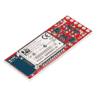
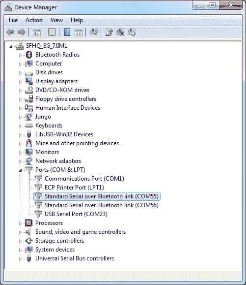

# 使用 BlueSMiRF

> 原文：<https://learn.sparkfun.com/tutorials/using-the-bluesmirf>

## 介绍

你准备好播放电视节目并将蓝牙加入你的项目了吗？有了 [BlueSMiRF 和 Bluetooth Mate](https://www.sparkfun.com/categories/115) 系列产品，你比想象中更接近于用 2.4GHz 无线通信取代那些讨厌、纠结的 RX 和 TX 线。

[](https://www.sparkfun.com/products/retired/12576) 

### [SparkFun 蓝牙伴侣银色](https://www.sparkfun.com/products/retired/12576)

[Retired](https://learn.sparkfun.com/static/bubbles/ "Retired") WRL-12576

Bluetooth Mate 与我们的 BlueSMiRF 调制解调器非常相似，但它是专门设计用于我们的[Arduino Pros]…

13 **Retired**[Favorited Favorite](# "Add to favorites") 21[Wish List](# "Add to wish list")[](https://www.sparkfun.com/products/retired/12577) 

### [SparkFun 蓝牙调制解调器- BlueSMiRF 银色](https://www.sparkfun.com/products/retired/12577)

[Retired](https://learn.sparkfun.com/static/bubbles/ "Retired") WRL-12577

BlueSMiRF Silver 是 SparkFun Electronics 的最新蓝牙无线串行电缆替代品！这个版本的…

15 **Retired**[Favorited Favorite](# "Add to favorites") 26[Wish List](# "Add to wish list")[](https://www.sparkfun.com/products/retired/12580) 

### [SparkFun 蓝牙 Mate 金](https://www.sparkfun.com/products/retired/12580)

[Retired](https://learn.sparkfun.com/static/bubbles/ "Retired") WRL-12580

Bluetooth Mate Gold 与我们的 BlueSMiRF 调制解调器非常相似，但它是专门设计用于我们的[Arduino …

5 **Retired**[Favorited Favorite](# "Add to favorites") 20[Wish List](# "Add to wish list")[](https://www.sparkfun.com/products/retired/12582) 

### [SparkFun 蓝牙调制解调器- BlueSMiRF 金色](https://www.sparkfun.com/products/retired/12582)

[Retired](https://learn.sparkfun.com/static/bubbles/ "Retired") WRL-12582

BlueSMiRF 是 SparkFun Electronics 的最新蓝牙* * * *无线串行电缆替代品！这些调制解调器作为…

10 **Retired**[Favorited Favorite](# "Add to favorites") 15[Wish List](# "Add to wish list")

每个模块上都有一个蓝牙收发器，这意味着它们能够发送和接收数据。它们非常适合直接取代有线[异步串行接口](https://learn.sparkfun.com/tutorials/serial-communication)。由于没有电线，您的设备之间的距离最远可达 100 米。除了这些好处之外，这些模块也非常易于使用。没有弄乱蓝牙协议或堆栈，只需通过串行接口发送数据，它就会通过管道传输到它所连接的任何蓝牙模块。

在本教程中，我们将涵盖你需要知道的关于这些蓝牙模块的一切。我们将从硬件概述以及每种设备之间的差异开始。然后，我们将进入硬件连接和例子 Arduino 代码。

### 材料和工具

首先，你需要我们将在本教程中讨论的四种蓝牙调制解调器中的一种:蓝牙 Mate 银、[蓝牙 Mate 银](https://www.sparkfun.com/products/10269)、[蓝牙 Mate 金](https://www.sparkfun.com/products/9358)或[蓝牙 Mate 金](https://www.sparkfun.com/products/10268)。这些模块都以相同的方式运行，因此本教程适用于所有四个模块。

[](https://www.sparkfun.com/products/retired/12576) 

### [SparkFun 蓝牙伴侣银色](https://www.sparkfun.com/products/retired/12576)

[Retired](https://learn.sparkfun.com/static/bubbles/ "Retired") WRL-12576

Bluetooth Mate 与我们的 BlueSMiRF 调制解调器非常相似，但它是专门设计用于我们的[Arduino Pros]…

13 **Retired**[Favorited Favorite](# "Add to favorites") 21[Wish List](# "Add to wish list")[](https://www.sparkfun.com/products/retired/12577) 

### [SparkFun 蓝牙调制解调器- BlueSMiRF 银色](https://www.sparkfun.com/products/retired/12577)

[Retired](https://learn.sparkfun.com/static/bubbles/ "Retired") WRL-12577

BlueSMiRF Silver 是 SparkFun Electronics 的最新蓝牙无线串行电缆替代品！这个版本的…

15 **Retired**[Favorited Favorite](# "Add to favorites") 26[Wish List](# "Add to wish list")[](https://www.sparkfun.com/products/retired/12580) 

### [SparkFun 蓝牙 Mate 金](https://www.sparkfun.com/products/retired/12580)

[Retired](https://learn.sparkfun.com/static/bubbles/ "Retired") WRL-12580

Bluetooth Mate Gold 与我们的 BlueSMiRF 调制解调器非常相似，但它是专门设计用于我们的[Arduino …

5 **Retired**[Favorited Favorite](# "Add to favorites") 20[Wish List](# "Add to wish list")[](https://www.sparkfun.com/products/retired/12582) 

### [SparkFun 蓝牙调制解调器- BlueSMiRF 金色](https://www.sparkfun.com/products/retired/12582)

[Retired](https://learn.sparkfun.com/static/bubbles/ "Retired") WRL-12582

BlueSMiRF 是 SparkFun Electronics 的最新蓝牙* * * *无线串行电缆替代品！这些调制解调器作为…

10 **Retired**[Favorited Favorite](# "Add to favorites") 15[Wish List](# "Add to wish list")

除非你有两台可以互相通话的设备，否则无线通信对你没有任何好处！这些蓝牙调制解调器可以与任何其他支持 SPP 的蓝牙设备对话。这个(长长的)列表包括其他 BlueSMiRFs 或蓝牙伴侣，或者嵌入到你的计算机甚至智能手机中的蓝牙模块。如果你的电脑还没有蓝牙模块，你可以将一个[蓝牙 USB 模块](https://www.sparkfun.com/products/9434)插入一个可用的 USB 插槽。

[](https://www.sparkfun.com/products/9434) 

将**添加到您的[购物车](https://www.sparkfun.com/cart)中！**

### [蓝牙 USB 模块迷你](https://www.sparkfun.com/products/9434)

[In stock](https://learn.sparkfun.com/static/bubbles/ "in stock") WRL-09434

这是一个方便的小蓝牙 USB 迷你适配器。此适配器支持蓝牙 2.0 1 级，最大距离为…

$10.95 $2.743[Favorited Favorite](# "Add to favorites") 18[Wish List](# "Add to wish list")** **我们还需要一些东西来与串行端的蓝牙调制解调器通信。这通常是某种微控制器。在本教程中，我们将使用一个 [Arduino](https://learn.sparkfun.com/tutorials/what-is-an-arduino) 。

[](https://www.sparkfun.com/products/13975) 

将**添加到您的[购物车](https://www.sparkfun.com/cart)中！**

### [spark fun red board——用 Arduino 编程 T3](https://www.sparkfun.com/products/13975)

[In stock](https://learn.sparkfun.com/static/bubbles/ "in stock") DEV-13975

SparkFun RedBoard 结合了 UNO 的 Optiboot 引导程序的简单性、FTDI 的稳定性和 shield com…

$21.5049[Favorited Favorite](# "Add to favorites") 89[Wish List](# "Add to wish list")** **最后，为了连接到蓝牙调制解调器，你需要**焊接接头或电线**到上面。你需要一个烙铁、焊料和[通用焊接配件](https://www.sparkfun.com/categories/49)。该主题将在[硬件连接](https://learn.sparkfun.com/tutorials/using-the-bluesmirf/all#hardware-hookup)章节中进一步讨论。

[](https://www.sparkfun.com/products/14228) 

### [威勒 WLC100 焊台](https://www.sparkfun.com/products/14228)

[Out of stock](https://learn.sparkfun.com/static/bubbles/ "out of stock") TOL-14228

Weller 的 WLC100 是一款多功能的 5 瓦至 40 瓦焊台，非常适合业余爱好者、DIY 爱好者和学生。…

2[Favorited Favorite](# "Add to favorites") 17[Wish List](# "Add to wish list")[](https://www.sparkfun.com/products/9325) 

将**添加到您的[购物车](https://www.sparkfun.com/cart)中！**

### [无铅焊料- 100 克线轴](https://www.sparkfun.com/products/9325)

[In stock](https://learn.sparkfun.com/static/bubbles/ "in stock") TOL-09325

这是带有水溶性树脂芯的无铅焊料的基本线轴。0.031 英寸规格，100 克。这是一个好主意…

$9.957[Favorited Favorite](# "Add to favorites") 33[Wish List](# "Add to wish list")** **### 推荐阅读

首先也是最重要的，如果你想了解这个漂亮的无线标准背后的一些一般概念，请查看蓝牙技术教程。

[](https://learn.sparkfun.com/tutorials/bluetooth-basics) [### 蓝牙基础知识

#### 2013 年 8 月 26 日](https://learn.sparkfun.com/tutorials/bluetooth-basics) An overview of the Bluetooth wireless technology.[Favorited Favorite](# "Add to favorites") 42

如果你熟悉这些概念也很好:

[](https://learn.sparkfun.com/tutorials/how-to-solder-through-hole-soldering) [### 如何焊接:通孔焊接](https://learn.sparkfun.com/tutorials/how-to-solder-through-hole-soldering) This tutorial covers everything you need to know about through-hole soldering.[Favorited Favorite](# "Add to favorites") 70[](https://learn.sparkfun.com/tutorials/serial-communication) [### 串行通信](https://learn.sparkfun.com/tutorials/serial-communication) Asynchronous serial communication concepts: packets, signal levels, baud rates, UARTs and more 100[](https://learn.sparkfun.com/tutorials/what-is-an-arduino) [### 什么是 Arduino？](https://learn.sparkfun.com/tutorials/what-is-an-arduino) What is this 'Arduino' thing anyway? This tutorials dives into what an Arduino is and along with Arduino projects and widgets.[Favorited Favorite](# "Add to favorites") 50[](https://learn.sparkfun.com/tutorials/terminal-basics) [### 串行终端基础知识](https://learn.sparkfun.com/tutorials/terminal-basics) This tutorial will show you how to communicate with your serial devices using a variety of terminal emulator applications.[Favorited Favorite](# "Add to favorites") 46

## 硬件概述

### 斯米尔夫？伙计？白银？黄金？有什么区别？

这些模块的“银色”和“金色”标志表明它们使用的是 [RN-42 蓝牙模块](https://www.sparkfun.com/products/10253)还是 [RN-41](https://www.sparkfun.com/products/11786) 。银的用 RN-42，金的用 RN-41。这两个模块的区别？**射程和发射功率。**RN-41 是 1 级蓝牙模块，因此它可以在最远 100 米的距离内进行通信，但它也以更高的功率进行传输(意味着电池寿命更短)。RN-42 是 2 类，它将发射范围限制在 10 米左右。

Mate 和 SMiRF 之间的差异都归结于六引脚接头的引脚排列。如果您将每块电路板翻转过来，查看引脚标签，您将会看到以下内容:

[](https://cdn.sparkfun.com/assets/9/9/a/3/0/5217910c757b7ffb748b4567.png)

Mate 的引脚排列与 [FTDI 基本](https://www.sparkfun.com/products/9716)和 [FTDI 电缆](https://www.sparkfun.com/products/9718)等产品的引脚排列相匹配。这是串行接口和电源组合的“标准化”引脚排列。这种引脚排列允许 Mate 直接插入 [Arduino Pro 的](https://www.sparkfun.com/products/10915)和[Pro mini](https://www.sparkfun.com/products/11113)的串行接口。

[](https://cdn.sparkfun.com/assets/4/7/4/7/d/5217c985757b7fc5038b4569.png)*A Bluetooth Mate can be plugged directly into the serial header of an Arduino Pro.*

这就是整个 Mate/SMiRF/Silver/Gold 崩溃的全部:传输范围和引脚排列。除此之外，这些板上的其他东西都是*完全相同的* -原理图、命令接口、尺寸，你能想到的。

### 设计概述

RN-42 和 RN-41 引脚兼容，因此每个电路板的原理图都是相同的。唯一的区别在于 Mate 和 SMiRF 的连接器引脚排列。点击下图查看原理图的大图(或点击[此处](https://www.sparkfun.com/datasheets/Wireless/Bluetooth/ArduinoBluetoothMatev13.pdf)查看 PDF 格式)。

[](https://cdn.sparkfun.com/assets/3/f/d/1/0/52179618757b7ff3748b4568.png)

设计的关键是 RN-41/42 串行引脚和输出头之间的**电平转换电路**。漫游网络模块的最大工作电压为 3.3V，因此这些模块使 5V 工作电压下的设备(如 Arduino)能够安全地与蓝牙调制解调器通信。板上还有一个线性 3.3V 调节器，因此可以使用 3.3V 至 6V 的电压为模块供电。

这些板还包括两个 led。有一个红色的“Stat”LED 和一个绿色的“Connect”LED。这些可以用来确定蓝牙模块处于什么状态。

[](https://cdn.sparkfun.com/assets/c/a/a/2/d/52179a8f757b7f09758b4567.png)

最后，要意识到天线在哪里——给它一些呼吸的空间。不要把它放在任何大块金属附近，也不要把它放在法拉第笼中，这样你就没事了。

### 引脚排列

四块蓝牙板中的每一块都有六个针脚。四个引脚专用于串行接口，另外两个引脚用于电源。

| Pin Label | 引脚功能 | 输入，输出，功率？ | 描述 |
| RTS-O | 请求发送 | 输出 | RTS 用于某些串行接口中的硬件流控制。该输出对于简单的串行通信并不重要。 |
| RX-I | 串行接收 | 投入 | 此引脚接收来自另一个器件的串行数据。它**应该连接到另一个设备的 TX** 。 |
| TX-O | 串行传输 | 输出 | 此引脚向另一个器件发送串行数据。它**应该连接到另一个设备的 RX** 。 |
| VCC | 电压供应 | 动力输入 | 该电源电压信号通过一个 3.3V 调节器发送，然后发送至蓝牙模块。它的范围应该从 **3.3V 到 6V。** |
| CTS-I | 清除发送 | 投入 | CTS 是另一种串行流控制信号。像 RTS 一样，大多数简单的串行接口不需要它。 |
| GND | 地面 | 动力输入 | 0V 参考电压，与连接到蓝牙调制解调器的任何其他设备相同。 |

### 给模块供电

这些蓝牙设备设计用于在 3.3V 和 5V 系统中无缝工作。提供给 VCC/GND 引脚的**电压**可以是 3.3V 到 6V 之间的任何电压**。输入串行和控制信号(RX-I 和 CTS-I)上的电压可以是 3.3V 到 5V 之间的任何值。输出信号(TX-O 和 RTS-O)的范围从 0V 为低逻辑电平，VCC 为高逻辑电平。这意味着如果以 6V 供电，TX 和 RTS 信号将输出高达 6V 的电压。**

调制解调器的**电流消耗**取决于它当时在做什么。当器件休眠时，它可以低至 0.026mA 当数据正在传输时，它可以高达 50mA。数据手册中的这张表提供了一些不错的估计:

[](https://cdn.sparkfun.com/assets/2/5/c/9/5/5217c866757b7f767d8b456b.PNG)

* * *

将设备连接到蓝牙调制解调器非常简单，只需接通电源并连接串行 RX 和 TX 引脚。但是，我们通过串行接口发送什么呢？这就是我们需要查看固件和蓝牙模块操作模式的地方。

## 硬件连接

### 装配

令人高兴的是，这些模块上的大部分组装已经为您完成；你还不需要学习如何焊接 SMD 元件。然而，在你开始使用这些蓝牙模块之前，你需要将*某种东西*焊接到六个电镀通孔中，以形成牢固的电连接。

你在孔里焊接什么主要取决于你要连接的设备。如果你有一个蓝牙伴侣，并想直接将其连接到 Arduino Pro，你可能想在那里扔一个[直角母头](http://www.sparkfun.com/products/9429)。另一个使电路板兼容试验板的好选择是[公头](http://www.sparkfun.com/products/116)。第三个可靠的选择是将[线](https://www.sparkfun.com/products/11375)直接焊接到孔上。

[](https://cdn.sparkfun.com/assets/3/b/8/c/a/521cf29d757b7fad0c8b4568.png)*Right-angle male or female headers are good options for assembly. They make the modules breadboard or [jumper-wire](https://www.sparkfun.com/products/11026) compatible.*

### 将一切联系在一起

我们需要将蓝牙调制解调器连接到能够发送和接收串行信号的设备上。这些是 [TTL 电平](https://www.sparkfun.com/tutorials/215)串行信号，请确保不要将其与 RS-232 混淆！电压应该在 3.3 伏和 5 伏之间。这里有很多选项，在本教程中，我们将使用 Arduino。

我们将使用[软件串行](http://arduino.cc/en/Reference/SoftwareSerial)并将调制解调器的 RX 和 TX 引脚连接到 Arduino 的任何空闲数字引脚，而不是将蓝牙调制解调器连接到 Arduino 的唯一硬件 UART。这将有助于避免总线争用，并确保蓝牙调制解调器在草图上传期间不会接收到任何虚假数据。下面是我们将在本教程后面的示例代码中建立的连接:

[](https://cdn.sparkfun.com/assets/0/c/d/3/a/521bceb9757b7f63278b4567.png)*Note that this is a Bluetooth Mate shown in the Fritzing diagram, the BlueSMiRF will have a different pinout.*

TX-O 连接到 Arduino 的 D2，RX-I 连接到 D3，GND 连接到 GND，VCC 连接到 5V。CTS-I 和 RTS-O 引脚悬空。TX-O 和 RX-I 引脚实际上可以连接到任何数字引脚(除了 0 和 1)，因此如果您需要 2 和 3 用于其他用途，请随意移动这些引脚。

* * *

硬件连接完成了一半。我们仍然需要创建到另一个蓝牙设备的无线连接。不过，在我们深入研究之前，我们需要了解更多关于蓝牙调制解调器的固件。

## 固件概述

一个[串行接口](https://learn.sparkfun.com/tutorials/serial-communication)就可以控制这些蓝牙模块并通过它们发送数据。本质上，它们就像一个数据管道。进入模块的串行数据(从 RX-I 引脚)通过蓝牙连接传出。来自蓝牙端的数据从串行端传出(从 TX-O 引脚输出)。

[](https://cdn.sparkfun.com/assets/e/c/b/1/d/521b9da7757b7fe4338b4567.png)

建立这个数据管道是一个两步的过程。首先，我们需要将能够发送和接收串行数据的东西连接到蓝牙调制解调器的头部。我们在[硬件连接](hardware-hookup)阶段通过将 Arduino 连接到串行接口实现了这一点，但任何带 UART 的微控制器都可以工作。连接设备后，我们需要[配置串行端口](https://learn.sparkfun.com/tutorials/terminal-basics/connecting-to-your-device)以与调制解调器相同的波特率工作——它们默认为 **115200 bps** (8-N-1)。

其次，在蓝牙方面，我们需要在调制解调器和另一个蓝牙设备之间建立无线连接。这里唯一的规定是其他蓝牙设备必须支持 SPP(大多数都支持 SPP)。这种连接涉及配对过程，类似于将任何其他蓝牙设备连接在一起。稍后会详细介绍。让我们再多谈谈串行接口。

### 数据和命令模式

控制蓝牙模块和通过它发送数据是两个非常独立的操作，但它们都是通过串行接口完成的。为了区分这两种形式的数据，蓝牙模块实现了两种不同的通信模式。

**命令模式**用于配置蓝牙模块。可以在命令模式下调整器件名称、波特率、引脚代码和数据速率等特性。这也是动作命令被发送到模块的地方，模块可以告诉它连接到设备或扫描其他模块。

在**数据模式**下，蓝牙模块充当透明数据网关。通过蓝牙连接接收的任何数据都会从模块的 TX 引脚发送出去。发送到模块 RX 引脚的数据通过蓝牙连接输出。

[](https://cdn.sparkfun.com/assets/9/c/3/d/1/5217b00f757b7f58758b4569.png)

**从数据模式进入命令模式**，主机控制器需要发送一串三个 *$* 符号(`$$$`)。

#### 配置定时器

进入命令模式时，配置定时器是需要注意的一个障碍。蓝牙调制解调器一打开，配置定时器就开始计数，一旦计数完毕，除非重启电源，否则您将无法进入配置模式。默认情况下，配置定时器被设置为 60 秒，然而这是可以调整的，甚至可以关闭(这是门票！).

### 破译发光二极管

蓝牙调制解调器上有两个 led:一个红色的标有“Stat”，一个绿色的标有“Connect”。这些有助于指示模块的状态。永远不要忘记 blinkies 的重要性！形成无线连接时，绿色 LED 将会亮起。“Stat”LED 可以指示模块处于三种状态之一，具体取决于它闪烁的速度:

| 方式 | 统计闪烁率 | 笔记 |
| 配置 | 每秒 10 次 | 模块*处于*配置模式。 |
| 启动/配置定时器 | 每秒 2 次 | 模块未处于配置模式，但配置定时器仍在计数。 |
| 可发现的/询问的/空闲的 | 每秒 1 次 | 不在配置模式下，并且配置定时器已经超时。 |

如果您在让模块进入配置模式时遇到问题，请通过检查非常慢的闪烁速率来确保计时器没有超时。

### 命令蓝牙调制解调器

蓝牙调制解调器的控制是通过一系列 AT 命令实现的，所有这些命令都记录在[高级用户指南](https://cdn.sparkfun.com/assets/1/e/e/5/d/5217b297757b7fd3748b4567.pdf)中。如果您想从这些模块中获得最大收益，请务必通读这些内容。命令分为五类:set、get、change、action 和 GPIO 命令。《用户指南》的第 2 章详细介绍了每个命令。附录 B 是一个快速参考指南——一个极好的资源。

在[示例代码](example-code-using-command-mode)部分，我们将讨论一些更常用的命令——命名设备，搜索可用模块，并连接到它们。

## 示例代码:使用命令模式

稍加巧妙，我们可以使用 Arduino 作为我们和蓝牙 Mate/BlueSMiRF 之间的媒介来发送和接收命令。[这里有一个小草图](https://cdn.sparkfun.com/assets/e/5/1/5/2/521bd2e5757b7ff9278b456b.zip)，它在 Arduino 串行监视器和蓝牙调制解调器之间传递数据。

```
language:c
/*
  Example Bluetooth Serial Passthrough Sketch
 by: Jim Lindblom
 SparkFun Electronics
 date: February 26, 2013
 license: Public domain

 This example sketch converts an RN-42 bluetooth module to
 communicate at 9600 bps (from 115200), and passes any serial
 data between Serial Monitor and bluetooth module.
 */
#include <SoftwareSerial.h>  

int bluetoothTx = 2;  // TX-O pin of bluetooth mate, Arduino D2
int bluetoothRx = 3;  // RX-I pin of bluetooth mate, Arduino D3

SoftwareSerial bluetooth(bluetoothTx, bluetoothRx);

void setup()
{
  Serial.begin(9600);  // Begin the serial monitor at 9600bps

  bluetooth.begin(115200);  // The Bluetooth Mate defaults to 115200bps
  bluetooth.print("$");  // Print three times individually
  bluetooth.print("$");
  bluetooth.print("$");  // Enter command mode
  delay(100);  // Short delay, wait for the Mate to send back CMD
  bluetooth.println("U,9600,N");  // Temporarily Change the baudrate to 9600, no parity
  // 115200 can be too fast at times for NewSoftSerial to relay the data reliably
  bluetooth.begin(9600);  // Start bluetooth serial at 9600
}

void loop()
{
  if(bluetooth.available())  // If the bluetooth sent any characters
  {
    // Send any characters the bluetooth prints to the serial monitor
    Serial.print((char)bluetooth.read());  
  }
  if(Serial.available())  // If stuff was typed in the serial monitor
  {
    // Send any characters the Serial monitor prints to the bluetooth
    bluetooth.print((char)Serial.read());
  }
  // and loop forever and ever!
} 
```

这个草图使用了 [SoftwareSerial](http://arduino.cc/en/Reference/SoftwareSerial) 库，它应该包含在 Arduino 的大多数最新版本中。

在草图开始时，Arduino 输入命令模式字符串，并临时将蓝牙调制解调器的波特率更改为 9600 bps(使用`U,9600,N`命令)。请记住，这是暂时的，所以当电源循环，调制解调器将默认回到 115200 bps。

草图的循环只是检查蓝牙调制解调器或串行监视器是否向 Arduino 发送了任何数据。如果是这样，它会把数据从一个设备传送到另一个设备。

### 使用直通草图

随着代码的上传，所有东西都相应地连接起来，打开[串行监视器](https://learn.sparkfun.com/tutorials/terminal-basics/arduino-serial-monitor-windows-mac-linux)。确保波特率设置为 9600。在整个过程中，你必须在波特率选项左侧的下拉菜单中动手脚。最初应设置为**“无行尾”**。

首先，我们通过输入`$$$`进入**命令模式**，点击“发送”。你应该看到蓝牙调制解调器以`CMD`响应，你会注意到红色的状态 LED 闪烁得更快，这都表明设备处于命令模式。

一旦进入命令模式，您需要将行尾下拉列表更改为**“Newline”**。所有这一切的基础是 RN-42 模块期望每个命令后面都有一个换行符，除了命令模式字符串。很烦人，但我们会处理的。

#### 使用 GET 命令

**GET 命令**是开始使用命令模式的好地方，它们会显示设置、状态或其他可能有用的信息。尝试通过键入“D”，并按下“发送”，发送**“显示基本设置”命令。这将触发来自蓝牙调制解调器的响应，其中详细说明了设备的波特率设置、名称和地址(BTA)。这个地址是你应该注意的，它可以通过这个命令来识别，或者看一下模块的标签，在“MAC 号”旁边。每个蓝牙模块都有一个唯一的地址，不能改变。尝试发送其他 get 命令，看看可以从调制解调器中检索到什么信息。**

[](https://cdn.sparkfun.com/assets/6/5/a/f/4/521bd5e9757b7f25278b4568.gif)

#### 使用 SET 命令

发送“D”命令后，您可能已经注意到您的蓝牙调制解调器除了地址之外还有自己的名称。与地址不同，这个名称可以随意更改。默认情况下，它将是 RN42-XXXX，其中 XXXX 是地址的最后四位数。让我们试一试集合指令。`SN,<name>`命令用于设置名称，其中\ <名称>是最多 20 个字符的任意集合。想出一个独特的名字，并分配给你的设备。发送 SN 命令后，调制解调器应该以“AOK”作为响应。现在，如果您发送 D 命令，您应该会看到您的新名称列在“BTName”设置的旁边。

[](https://cdn.sparkfun.com/assets/0/7/f/5/d/521cce15757b7f432b8b456a.png)

使用 SET 命令时要小心，只有在确定不会对调制解调器或与它通信的能力产生负面影响的情况下才进行更改。如果您更改了您认为不应该更改的内容，发送`SF, 1`命令将*的所有内容*重置回出厂默认值。如果你像我一样懒，另一个方便的命令是`ST,255`，它关闭配置定时器。这将永远支持远程配置。请记住，您修改的任何设置都将保存到蓝牙调制解调器的内存中，并在断电时保留。

#### 动作命令

最后，是时候采取一些行动了。除了别的以外，蓝牙调制解调器的动作命令可以用来寻找其他蓝牙设备，连接到它们，和从它们断开连接。

首先发送**查询扫描命令** - `I,<value>` -搜索范围内的其他蓝牙模块。\ <值>参数定义了调制解调器寻找其他模块所需的秒数。如果没有定义，它将默认为 10。如果你只是键入“I”并点击发送，设备应该以“查询，COD=0”作出响应，然后十秒钟后，它会用它找到的任何蓝牙模块作出响应。它会将它们的信息打印为“BT 地址、BT 名称、COD”(COD 是设备的类别)。

[](https://cdn.sparkfun.com/assets/6/a/f/b/a/521cd0c3757b7f1b288b456e.png)

如果调制解调器发现任何模块，你可以尝试发送**连接命令** - `C,<address>` -来连接其中一个模块。上例中的调制解调器在范围内发现了两个设备，通过发送`C,000666421B01`命令，我们可以尝试连接到其中一个。

发送 connect 命令后，设备会以“正在尝试”作为响应，然后是“连接失败”(其含义应该很明显)或连接成功！成功连接后，我们立即进入数据模式，调制解调器成为一个管道。从一个蓝牙设备发送的任何字符都将被发送到另一个设备，反之亦然。要断开连接，您需要重新进入命令模式(不要忘记设置为“无新行”)，并发送“K，”命令(*选择了*换行符，bleh)。

* * *

还有很多其他的命令可以探索！翻阅[用户手册](https://cdn.sparkfun.com/assets/1/e/e/5/d/5217b297757b7fd3748b4567.pdf)，熟悉蓝牙调制解调器的所有功能！

## 从另一台设备连接

在示例代码部分，我们试图从蓝牙调制解调器连接到一个设备，但是如果您想从另一个蓝牙设备启动连接呢？该过程因操作系统和设备而异，但涉及的大多数步骤都非常相似。

如果您的设备(电脑、电话等)。)还没有蓝牙调制解调器，您需要将外部模块连接到它。[蓝牙 USB 模块](https://www.sparkfun.com/products/9434)适用于任何带有可用 USB 插槽的电脑。

### 连接到 Windows 中的调制解调器

转到**控制面板**并导航到**设备和打印机**窗口。在该窗口的左上方，应该有一个**添加设备**按钮。点击那个。

[](https://cdn.sparkfun.com/assets/a/b/7/5/0/521cdb2e757b7f20538b4567.png)

当*添加设备*窗口打开时，您电脑的蓝牙模块应该会自动搜索范围内任何可用的蓝牙设备。它找到的应该会显示在窗口中(给窗口几秒钟时间搜索)。

如果在此窗口中看到您的设备，请双击它以启动连接。然后会出现**选择配对选项**窗口。由于调制解调器没有附属键盘，选择**输入设备的配对代码**选项。

[](https://cdn.sparkfun.com/assets/2/c/c/1/a/521cdad2757b7fe2518b4567.png)

在下一个窗口中，输入 **1234** 作为 PIN 码。这是每个 RN-42 和 RN-41 的默认 PIN 值。

[](https://cdn.sparkfun.com/assets/3/0/b/c/1/521cdb9f757b7f1c538b4567.png)

Windows 将需要一些时间来为您的设备安装驱动程序。一旦完成，它会弹出一个通知，让你知道你的设备可以使用了！

但是你实际上如何使用它呢？你需要打开一个终端模拟器(查看我们的[串行终端基础教程](https://learn.sparkfun.com/tutorials/terminal-basics)寻求帮助！).当 Windows 为您的新蓝牙设备安装驱动程序时，它为它创建了一个新的 COM 端口。打开你的**设备管理器**，查看“端口(COM & LPT)”树，你会发现一个名为“标准蓝牙串行链接(COM##)”的新端口(可能有两个)。

[](https://cdn.sparkfun.com/assets/5/9/3/5/3/521cdf28757b7f88528b4567.png)

要打开蓝牙设备之间的连接，以 9600 bps (8-N-1)的速率打开一个终端到该 COM 端口。(如果您看到两个端口，请先尝试较小的数字)。当终端打开时，蓝牙调制解调器的绿色连接 LED 应该会亮起。连接成功！

如果您的 Arduino 上仍然加载了上一个示例(串行直通)的草图，您可以打开第二个终端窗口在设备之间进行通信。

[](https://cdn.sparkfun.com/assets/f/b/c/5/3/521ce113757b7f21538b4567.gif)

如果您在配置定时器窗口内(如果您不在，请重新打开调制解调器电源)，您甚至可以通过发送“$$$”字符串来*远程*进入命令模式。现在，您可以远程更改蓝牙调制解调器的设置。俏皮！

* * *

如果你使用的是 Mac、Linux，甚至是智能手机，配对和连接应该包括类似的过程。如果需要身份验证，您需要使用 PIN 码选项，并输入默认的 PIN 码“1234”。打开一个串行终端模拟器- *终端*或 *CoolTerm* 在 Mac OSX 上，有各种各样的应用程序可供智能手机使用-以启动连接并开始传递数据。

## 资源和更进一步

希望这篇教程已经为你进入无线通信世界做好了准备。既然您已经很好地了解了如何控制这些蓝牙调制解调器，并将它们连接到其他设备，剩下的就看您的了。你将如何利用你愉快的无电线生活？去广播吧！

*   [RN-42 和 RN-41 命令参考和用户指南(PDF)](https://cdn.sparkfun.com/assets/1/e/e/5/d/5217b297757b7fd3748b4567.pdf)
*   数据表
    *   [RN-42 (PDF)](http://www.sparkfun.com/datasheets/Wireless/Bluetooth/rn-42-ds.pdf) -适用于“银色”版本。
    *   [RN-41 (PDF)](http://cdn.sparkfun.com/datasheets/Wireless/Bluetooth/rn-41-ds-v3.41r.pdf) -用于“黄金”版本。
*   蓝牙伴侣
    *   [示意图(PDF)](http://www.sparkfun.com/datasheets/Wireless/Bluetooth/ArduinoBluetoothMatev13.pdf)
    *   [GitHub 回购](https://github.com/sparkfun/Bluetooth_Mate)
*   BlueSMiRF
    *   [示意图(PDF)](http://cdn.sparkfun.com/datasheets/Wireless/Bluetooth/BlueSMiRF-Gold-ChipAnt-v1_rotat2.pdf)
    *   [GitHub 回购](https://github.com/sparkfun/BlueSMiRF)

如果您有兴趣查看其他与蓝牙相关的教程，请查看以下链接:

*   [RN-52 连接指南](https://learn.sparkfun.com/tutorials/rn-52-bluetooth-hookup-guide)–RN-52 是一个蓝牙 3.0 版模块，它(在 SPP 之上)支持蓝牙音频模式 A2DP。使用这个模块，你可以制作一个无线音箱，或者一个蓝牙 MP3 播放器！
*   [MetaWatch 拆卸和连接](https://learn.sparkfun.com/tutorials/metawatch-teardown-and-arduino-hookup)-meta watch 是一款内置蓝牙模块的智能手表。在本教程中，我们使用蓝牙伴侣在手表和 Arduino 之间进行通信。
*   [常驻黑客-入侵 MindWave Mobile](https://learn.sparkfun.com/tutorials/hackers-in-residence---hacking-mindwave-mobile) -使用 RN-42 的蓝牙经典模式连接到 MindWave Mobile，与您的电脑进行项目无线通信！

[](https://learn.sparkfun.com/tutorials/hackers-in-residence---hacking-mindwave-mobile) [### 黑客在住宅-黑客思维波移动](https://learn.sparkfun.com/tutorials/hackers-in-residence---hacking-mindwave-mobile) Review, teardown, and hacking tutorial for the MindWave Mobile, a $99 commercial grade EEG sensor.[Favorited Favorite](# "Add to favorites") 8[](https://learn.sparkfun.com/tutorials/rn-52-bluetooth-hookup-guide) [### RN-52 蓝牙连接指南](https://learn.sparkfun.com/tutorials/rn-52-bluetooth-hookup-guide) A hookup guide to get you started with the RN-52 Audio Bluetooth Module Breakout Board.[Favorited Favorite](# "Add to favorites") 16[](https://learn.sparkfun.com/tutorials/metawatch-teardown-and-arduino-hookup) [### MetaWatch 拆卸和 Arduino 连接](https://learn.sparkfun.com/tutorials/metawatch-teardown-and-arduino-hookup) Tearing down the nifty Bluetooth-enabled MetaWatch. Then building an Arduino sketch to control it.[Favorited Favorite](# "Add to favorites") 4

以下是其他一些以无线通信为特色的教程:

*   红外通信 -如果你真的只想短距离传输无线数据，红外可能是个不错的选择(便宜！)选项。
*   [电动 Imp 连接指南](https://learn.sparkfun.com/tutorials/retired---electric-imp-breakout-hookup-guide) -电动 Imp 让连接 WiFi 变得异常简单。遵循本教程，您将拥有一个能够与网页交互的嵌入式模块！
*   [hackster . io:Windows Remote Arduino](https://www.hackster.io/windowsiot/basic-windows-remote-arduino-47eeb9)——在这个项目中，我们将使用 Windows Remote Arduino 来打开和关闭 LED。这是一个简单的例子，但是它揭示了这个库可以给你创建更多高级项目的能力。我们开始吧！

或者看看下面的一些博客帖子来寻找灵感:

[](https://www.sparkfun.com/news/2452 "August 10, 2017: In this week's Enginursday, Alex meets with a local Speech-Language Pathologist to talk about how makers can help make devices for people with special needs") [### Enginursday:制造商提供技术支持

August 10, 2017](https://www.sparkfun.com/news/2452 "August 10, 2017: In this week's Enginursday, Alex meets with a local Speech-Language Pathologist to talk about how makers can help make devices for people with special needs")[Favorited Favorite](# "Add to favorites") 1******