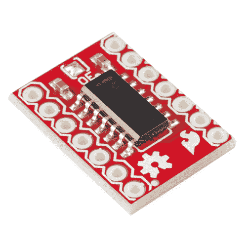
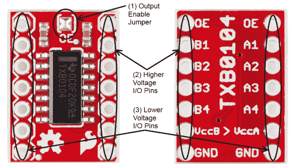
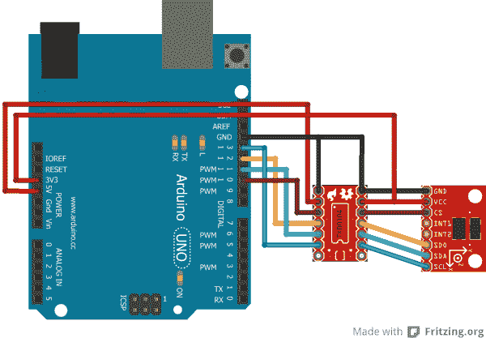

# TXB0104 换档杆连接指南

> 原文：<https://learn.sparkfun.com/tutorials/txb0104-level-shifter-hookup-guide>

## 介绍

TXB0104 是德州仪器公司生产的双向信号电平转换器。它具有四个输入/输出信号通道和一条输出使能线，允许在不需要时将信号线置于高阻抗模式。

 

将**添加到您的[购物车](https://www.sparkfun.com/cart)中！**

 **### [SparkFun 电压电平转换器分线点- TXB0104](https://www.sparkfun.com/products/11771)

[In stock](https://learn.sparkfun.com/static/bubbles/ "in stock") BOB-11771

这是德州仪器 TXB0104 模块的分线板。TXB0104 是一款 4 位双向电压电平转换器

$4.957[Favorited Favorite](# "Add to favorites") 28[Wish List](# "Add to wish list")** **根据高端和低端电压的不同，各信号通道的带宽可以从 20Mbps 到 100Mbps 不等，因此 TXB0104 适合 SPI 等高速信号。

SparkFun 的 [TXB0104 分线板](https://www.sparkfun.com/products/11771)使得在您的项目中使用这款强大的芯片变得非常容易。

#### 推荐阅读

在继续阅读本指南之前，您应该熟悉这些教程中涵盖的主题:

 [### 串行外设接口(SPI)](https://learn.sparkfun.com/tutorials/serial-peripheral-interface-spi) SPI is commonly used to connect microcontrollers to peripherals such as sensors, shift registers, and SD cards.[Favorited Favorite](# "Add to favorites") 91 [### 逻辑电平](https://learn.sparkfun.com/tutorials/logic-levels) Learn the difference between 3.3V and 5V devices and logic levels.[Favorited Favorite](# "Add to favorites") 82

## TXB0104 BOB 概述

TXB0104 分线板非常简单。有两排引脚接头，电路板两侧各一排；一侧用于高压信号，一侧用于低压信号。

*   默认情况下，**输出使能跳线** (1)是闭合的，导致两边的信号一直被驱动。用户有责任确保(通常情况下)系统避免总线争用状态，即同一信号的高端和低端被驱动至相反电平。
*   **B 侧信号** (2)为高电压信号。VccB *必须*处于比 VccA 更高的电压，以避免全部质子反转(或者至少避免对芯片可能的损坏)。VccB 的电压范围为 1.65 至 5.5V。如果从高压器件驱动 OE 引脚，请插入一个 1k 电阻与驱动信号串联。
*   **A 侧信号** (3)为低电压信号。VccA *必须*处于比 VccB 低的电压。VccA 的电压范围为 1.2V 至 3.6V。

## 示例:将 ADXL345 连接到 Arduino

上图显示了如何使用 TXB01014 BOB 将 Arduino Uno 连接到 SparkFun 的 [ADXL345 分线板](https://www.sparkfun.com/products/9836)。ADXL345 板是 3.3V 系统，Arduino Uno 是 5V 系统，因此需要一些电平转换。

在这种情况下，我们让 OE 引脚保持高电平，因为它默认；对于这种应用，实际上没有必要将引脚设为高阻抗。

不需要改变软件来支持 TXB0104 芯片将自动检测信号方向，并相应地传递数据。

## 资源和更进一步

这就是了。TXB0104 是一款非常简单的电路板。现在，出去转换一些逻辑电平。如果你需要更多信息，请查看 [TXB0104 GitHub 库](https://github.com/sparkfun/TXB0104_breakout)。

如果您想了解更多关于逻辑电平转换器的信息，请查看以下其它优秀的连接指南:

*   [逻辑电平转换器连接指南](https://learn.sparkfun.com/tutorials/using-the-logic-level-converter)
*   [双向逻辑电平转换器连接指南](https://learn.sparkfun.com/tutorials/bi-directional-logic-level-converter-hookup-guide)
*   [PCA9306 电平转换器连接指南](https://learn.sparkfun.com/tutorials/pca9306-level-translator-hookup-guide)**