# 使用 EAGLE:纸板布局

> 原文：<https://learn.sparkfun.com/tutorials/using-eagle-board-layout>

## 《使用鹰》前情提要

EAGLE 的 board designer 是一个神奇的地方。正是在这里，电路板的尺寸汇集在一起，器件排列整齐，并通过铜走线连接。在电路板编辑器中，您设计的概念性理想化原理图会变成尺寸和布线精确的 PCB。

在本教程中，我们将涵盖 EAGLE PCB 设计的每一个步骤:从放置器件，到布线，再到生成 gerber 文件发送到工厂。我们还将介绍 EAGLE 电路板编辑器的基础知识，首先解释 EAGLE 中的层如何匹配 PCB 的层。

### 从原理图创建电路板

在开始本教程之前，通读并跟随[使用 EAGLE:原理图](https://learn.sparkfun.com/tutorials/using-eagle-schematic)教程(更不用说之前的[设置 EAGLE](https://learn.sparkfun.com/tutorials/how-to-install-and-setup-eagle) 教程)。该教程中设计的原理图将用作这里设计的 PCB 的基础。

*The schematic from previous tutorial, complete with an ATmega328P, barrel jack connector, LEDs, resistors, capacitors, and connectors.*

要从**原理图编辑器切换到相关的板卡**，只需点击*生成/切换到板卡*命令- (在顶部工具栏上，或在*文件*菜单下)-这将提示打开一个新的板卡编辑器窗口。从原理图中添加的所有零件都应该在那里，堆叠在彼此的顶部，准备放置和布线。

[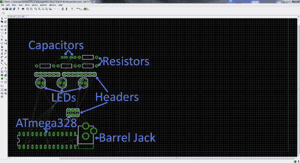](https://cdn.sparkfun.com/assets/7/4/5/6/2/52051a15757b7f5114a22142.png)

电路板和原理图编辑器有一些相似之处，但是，在很大程度上，它们是完全不同的动物。在下一页，我们将看看电路板编辑器的彩色层，看看它们与 PCB 的实际层相比如何。

## 图层概述

[PCB 构成](../pcb-basics/composition)就是将一种材料层叠在另一种材料上。电路板最厚的中间部分是绝缘基板(通常是 **FR4** )。在它的两边是一层薄薄的**铜**，我们的电信号通过这里。为了绝缘和保护铜层，我们用一层薄薄的类似漆的**阻焊膜**覆盖它们，这就是 PCB 的颜色(绿色、红色、蓝色等)。).最后，最重要的是，我们添加了一层油墨般的丝印**，它可以在 PCB 上添加文本和标志。**

***The layers of a double-sided PCB (image from the [PCB Basics](https://learn.sparkfun.com/tutorials/pcb-basics) tutorial).*

### 鹰的层次

EAGLE board designer 具有与实际 PCB 一样的层，它们也有重叠。我们用调色板来代表不同的层。以下是您将在 board designer 中使用的层:

| 颜色 | 图层名称 | 层数 | 图层目的 |
|  | 顶端 | one | 顶层**铜** |
|  | 底部 | Sixteen | 底层**铜** |
|  | 衬垫 | Seventeen | 通孔焊盘。绿色圆圈的任何部分都暴露在电路板的*顶部和底部的**铜**上。* |
|  | 过孔 | Eighteen | 过孔。较小的填铜钻孔，用于将信号从顶部传送到底部。这些通常被阻焊膜覆盖。也表示两层上的铜。 |
|  | 未布线 | Nineteen | 无线电报。显示需要连接哪些焊盘的橡皮筋状线条。 |
|  | 尺寸 | Twenty | 电路板的轮廓。 |
|  | 地方 | Twenty-one | **丝网印刷**印刷在电路板的顶部。 |
|  | 地方 | Twenty-two | **丝网印刷**印刷在电路板的底部。 |
|  | 起源 | Twenty-three | 顶部原点，单击它可以移动和操纵单个零件。 |
|  | 起源 | Twenty-four | 电路板底部零件的原点。 |
| / /影线 | tStop | Twenty-nine | 顶部挡板。这些定义了**阻焊膜**应该*而不是*应用的位置。 |
| \ \ Hatch | 停止 | Thirty | 电路板底部没有**阻焊膜**。 |
|  | 洞 | Forty-five | 非导电(非过孔或焊盘)孔。这些通常是用于支座或特殊零件要求的钻孔。 |
|  | tDocu | Fifty-one | 顶层文档层。仅供参考。这可能会显示零件的轮廓或其他有用的信息。 |

要关闭或打开任何图层，请单击“图层设置...”按钮-  -然后点击一个层的编号来选择或取消选择它。开始布线之前，确保上面的层(除了 tStop 和 bStop)可见。

### 从重叠对象中选择

在我们开始铺板之前，还有最后一个提示。这是一个让很多人犯错的界面技巧。由于棋盘视图完全是二维的，不同的层必然会重叠，有时你必须做一些欺骗来选择一个对象，当其他对象在它上面的时候。

通常，你用鼠标左键选择一个对象(无论是轨迹、过孔、零件等。)，但是当你点击的地方有两个部分重叠*恰好*的时候，EAGLE 不知道你想拿起哪一个。在这种情况下，EAGLE 会选择两个重叠对象中的一个，并询问这是否是您想要的。如果是，你必须再次左键点击**来确认**。如果你试图抓取其他重叠对象中的一个，**右键点击**循环到下一个部分。EAGLE 的状态栏位于窗口的左下方，当您试图选择零件时，它会提供一些有用的信息。

[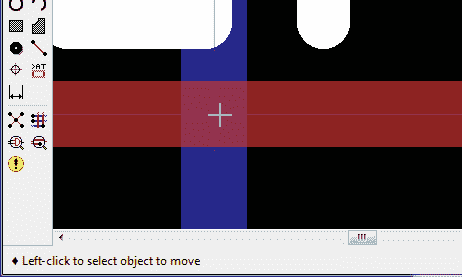](https://cdn.sparkfun.com/assets/2/9/d/4/f/520e7f0c757b7f16708b4579.gif)

例如:在上面的 GIF 中，一个 *VCC* 网与另一个名为*重置*网重叠。我们在它们重叠的地方直接左键单击一次，EAGLE 问我们是否打算选择 *VCC* 。我们右击循环，它反而问我们是否要选择*复位*。再次右键单击循环回到 *VCC* ，最后一次*左键单击*选择该网络作为我们想要移动的网络。

* * *

咻！指针够多了，我们来布局一个 PCB 吧！

## 安排董事会

### 从原理图创建电路板

如果您还没有，点击原理图编辑器中的*生成/切换到电路板*图标- ，根据您的原理图创建一个新的 PCB 设计:

[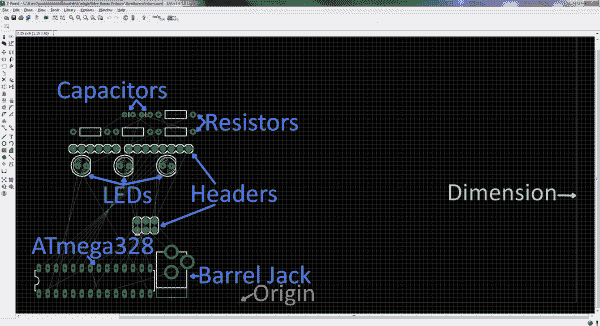](https://cdn.sparkfun.com/assets/2/4/4/c/7/520e8531757b7f0d708b4568.png)

新电路板文件应显示原理图中的所有器件。被称为 **airwires** 的金线连接在引脚之间，反映了您在原理图上所做的网络连接。在所有器件的右侧还应该有一个微弱的浅灰色电路板轮廓。

在 PCB 布局中，我们的第一项工作是排列器件，然后最小化 PCB 尺寸轮廓的面积。PCB 成本通常与电路板尺寸有关，因此**较小的电路板就是较便宜的电路板**。

### 了解网格

在原理图编辑器中，我们甚至从来不看网格，但在电路板编辑器中，它变得重要得多。在纸板编辑器中应该可以看到网格。您可以通过点击网格图标- 来调整网格的粒度。0.05 英寸的网格和 0.005 英寸的交替网格是这种板的合适尺寸。

EAGLE 强制您的零件、轨迹和其他对象“吸附”到在*大小*框中定义的网格。如果你需要更精细的控制，按住键盘上的 ALT 进入**替换网格**，它在 *Alt* 框中定义。

### 移动部件

使用移动工具-  -你可以开始在尺寸框内移动零件。当你移动部件时，你可以通过右击或者改变顶部下拉框中的角度来旋转。

你安排零件的方式对下一步的难易程度有很大的影响。当您移动、旋转和放置零件时，有一些因素需要考虑:

*   **不要重叠部件**:你所有的部件都需要一些空间来呼吸。绿色过孔之间也需要足够的间隙。记住那些绿色的环是电路板两侧暴露的铜，如果铜重叠，[流将穿过](https://www.youtube.com/watch?v=jyaLZHiJJnE)并发生短路。
*   **尽量减少交叉的气线**:当你移动零件时，注意气线是如何随之移动的。从长远来看，尽可能多地限制交叉的空中线路将使 T2 的布线变得更加容易。当你重新定位部件时，点击鼠标的最新按钮-  -让无线重新计算。
*   **零件放置要求**:一些零件在放置时可能需要特别考虑。例如，您可能希望筒式插孔连接器的插入点面向电路板的边缘。并确保[去耦电容](../capacitors/application-examples#decoupling)良好并靠近 IC。
*   更紧密的布局意味着电路板更小、更便宜，但也增加了布线的难度。

下面是一个例子，说明在考虑这些因素时，你可能会如何布置你的董事会。我们通过巧妙放置 led 及其限流电阻，最大限度地减少了 airwire 交叉点。一些部件被放置在它们刚刚*有*要去的地方(桶形插孔和去耦电容)。而且布局比较紧凑。

[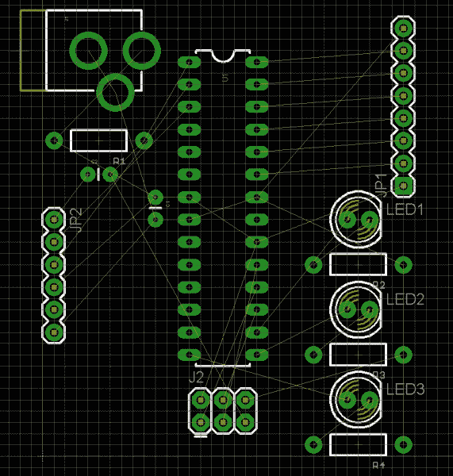](https://cdn.sparkfun.com/assets/d/b/8/b/4/520527cc757b7f7b14884e0f.png)*Note: The tNames layer (which isn't visible by default) was turned on to help identify which part is which.*

### 调整尺寸层

现在零件已经放置好了，我们开始对电路板的外观有了更好的了解。现在我们只需要确定我们的维度轮廓。您可以移动已经存在的尺寸线，也可以从头开始。使用删除工具-  -删除所有四条尺寸线。

然后使用线工具- (  -绘制一个新的轮廓。在你画任何东西之前，去选项栏**设置图层为 *20 维度*T4。同样在上面，你可能想把宽度调低一点(我们通常把它设置为 0.008”)。**

然后，从原点开始，在你的零件周围画一个方框。不要用任何孔与维度层相交，否则它们会被切断！确保你在开始的地方结束。

[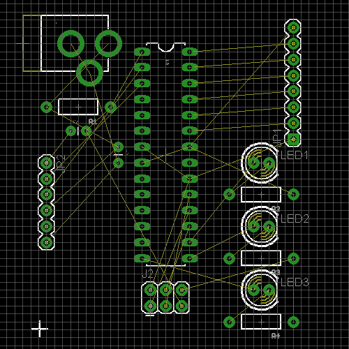](https://cdn.sparkfun.com/assets/3/9/8/2/3/52052b67757b7fd014094f67.gif)

这是一个好的开始。布局好零件，调整好尺寸后，我们就可以开始布线了！

## 电路板布线

路由是整个过程中最有趣的部分。就像解谜一样！我们的工作将是把这些金线变成顶部或底部的铜迹线。与此同时，你还必须确保不要重叠两个不同的信号。

### 使用路径工具

为了绘制我们所有的铜轨迹，我们将使用布线工具-  -(不是线工具！).选择工具后，上面的工具栏上有几个选项可供考虑:

[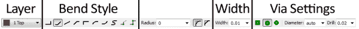](https://cdn.sparkfun.com/assets/9/0/2/6/2/52053bcd757b7f434a43b1f2.png)

*   **层**:在这样的两层板上，你必须选择是从顶层(1)还是底层(16)开始走线。
*   **弯曲样式**:通常你会想要使用 45 度角的路线(电线弯曲样式 1 和 3)，但是制作多圈的轨迹也会很有趣。
*   **宽度**:这定义了铜的宽度。通常 0.01 英寸是一个很好的默认尺寸。你不应该比 0.007 更小”(否则你可能会付出额外的代价)。更宽的走线可以让更多电流安全通过。如果你需要通过走线提供 1A，那就需要更宽(要想知道到底有多宽，使用[走线宽度计算器](http://www.4pcb.com/trace-width-calculator.html))。
*   **过孔选项**:您也可以在这里设置一些过孔特性。可以设置形状、直径和钻孔，但通常缺省值(分别为圆形、自动和 0.02 英寸)是完美的。

完成所有设置后，您可以通过左键单击 airwire 终止处的大头针来开始布线。airwire 和连接的针脚将会“发光”,针脚上将会出现一条红色或蓝色的线。您可以通过再次左键单击 airwire 连接的另一个引脚的顶部来完成跟踪。在引脚之间，您可以根据需要左键单击，向下“粘贴”一条轨迹。

[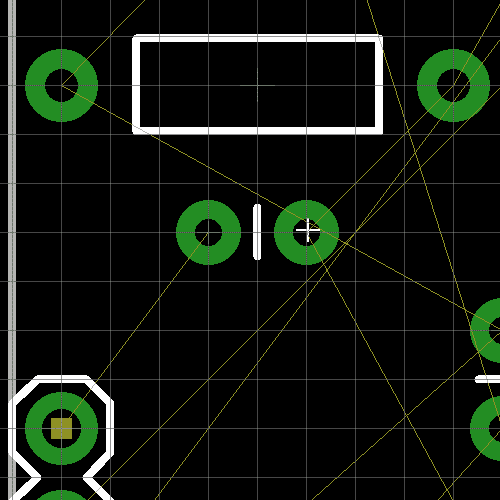](https://cdn.sparkfun.com/assets/0/9/2/1/7/52053f90757b7f0412ebdaaf.gif)

布线时，重要的是要避免两种重叠情况:过孔上的铜和铜上的铜。请记住，所有这些铜走线基本上都是裸线。如果两个信号重叠，它们就会短路，两个信号都不会发挥应有的作用。

[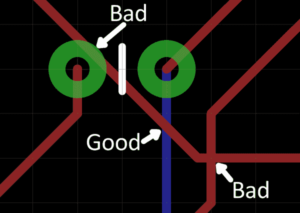](https://cdn.sparkfun.com/assets/e/f/b/7/6/52053df5757b7f594b9d0ae5.png)

如果走线确实相互交叉，请确保它们位于电路板的相对两侧。顶部的迹线与底部的迹线相交是完全可以接受的。这就是为什么有两层！

如果需要更精确地控制路线，可以按住键盘上的 ALT 键来访问备用网格。默认情况下，该值被设置为更小的 0.005 英寸。

#### 放置过孔

过孔实际上是填有铜的微小钻孔。我们在中途使用它们将轨迹从棋盘的一边移动到另一边。

要在路线中间放置一个过孔，首先在引脚之间的黑色以太网中左键单击，将迹线“粘合”下来。然后你可以在顶部的选项栏中手动改变图层，或者**点击鼠标中键**来交换边。继续前往你的目的地。EAGLE 会自动为您添加一个 via。

[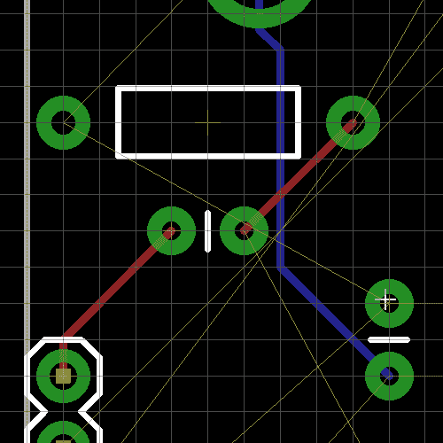](https://cdn.sparkfun.com/assets/c/a/3/e/3/520541ce757b7f861122d291.gif)

#### 路线许可

确保两条不同的信号走线之间留有足够的空间。PCB 制造商应该明确定义走线之间允许的最小宽度——对于标准电路板，可能约为 0.006 英寸。一个很好的经验法则是，如果两条走线之间没有足够的空间来容纳另一条走线(不是说你应该这样做)，那么它们就靠得太近了。

#### 撕掉痕迹

就像线工具实际上并不用于制作线一样，删除工具实际上也不能用于删除追踪。如果你需要回去重新工作一条路线，使用 **RIPUP** 工具- 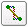 -去除痕迹。此工具将已布线的迹线转换回无线线路。

您还可以使用撤消和重做来后退/前进。

### 走开。

这就是所有的简单规则。去有你的生活时间解决路由难题！您可能想先从最近、最容易的痕迹开始。或者，你可能想先布线重要的信号，比如电源和地。这是一个全布线板的示例:

[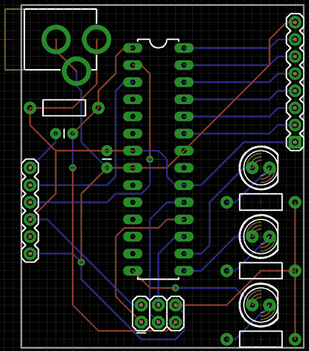](https://cdn.sparkfun.com/assets/4/b/2/f/f/52054a53757b7fcd11078219.png)

看看你是否能做得比那更好！让你的冲浪板变小。或者尽量避免使用任何过孔。

当你觉得路由完成后，我们可以做一些检查来确保它 100%完成。我们将在下一页讨论这些内容。

### 或者使用自动路由器(骗子！)

如果你时间不够，或者在解决路线问题上有困难，你可以试着加载 EAGLE 的 Autorouter - 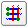 -看看它是否能完成这项工作。打开自动路由器，现在不用担心其他标签，只需点击*确定*。

[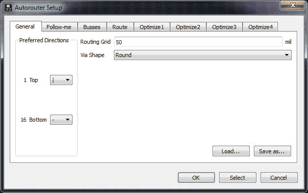](https://cdn.sparkfun.com/assets/3/9/e/2/4/5213a45b757b7f76578b4567.png)

如果你不喜欢自动路由器做的工作，你可以快速点击*撤销*回到你原来的位置。

自动布线器并不总是能够完成工作，所以理解如何手动布线焊盘仍然很重要(另外手动布线看起来*更好*)。运行自动路由器后，检查左下角的状态框，看看它是如何做的。如果它说的不是“OptimizeN: 100%完成”，那么你还有一些工作要做。如果你的自动布线器不能完成这项工作，**试着把*布线网格*从 50 密耳调小**。

在自动路由器中有大量的优化和设置要做。如果你想更深入地研究这个主题，可以考虑查阅 EAGLE 的手册，其中有整整一章专门讨论这个问题。

## 检查错误

在我们将设计打包并送到制造厂之前，有一些工具可以用来检查我们的设计是否有错误。

### Ratsnest -无事可做！

第一项检查是确保您实际布线了原理图中的所有网络。为此，点击鼠标最新图标-  -然后立即检查左下角的状态框。如果您已经路由了所有内容，它应该显示“Ratsnest:无所事事！”

正如感叹号所表示的，“无事可做”是非常令人兴奋的。意思是你已经完成了所有要求的路线。

如果 ratsnest 说你还有“N 根电线”要走，仔细检查你的棋盘上有没有漂浮的金线，然后把它们走上来。如果你已经找遍了，找不到可疑的 airwire，尝试关闭除了 *19 未布线*之外的每一层。

### 设计规则检查

一旦你完成了布线，还有一个检查要做:设计规则检查(DRC)。对于这一步，我们建议您使用 SparkFun 设计规则，您可以在这里下载。要加载 DRC，点击 DRC 图标-  -打开此对话框:

[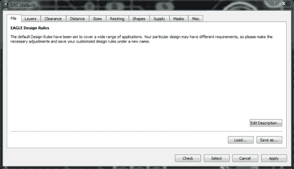](https://cdn.sparkfun.com/assets/1/f/2/7/2/52054f04757b7f1d12530335.png)

该视图中的选项卡(层、间隙、距离等。)帮助定义您的布局需要通过的大量设计规则。这些规则定义了最小间隙距离、走线宽度或钻孔尺寸等内容...各种有趣的东西。您可以使用 DRU 文件加载一组设计规则，而不是手动设置这些规则。为此，**点击*载入...*** 并选择您刚刚下载的 **SparkFun.dru** 文件。窗口的标题将更改为“DRC (SparkFun)”，其他选项卡上的一些值也将更改。然后**点击*止回*按钮**。

同样，向下看编辑器的左下方。如果你的设计是完美的，你应该看到“DRC:没有错误。”但是如果事情不顺利，迎接你的将是可怕的“DRC 错误”窗口。错误窗口列出了所有打开的错误，并且还突出显示了错误所在的位置。点击列出的任何一个错误，EAGLE 就会指出违规者。

[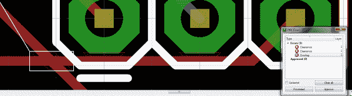](https://cdn.sparkfun.com/assets/7/f/0/e/8/520551c9757b7f7811185fa6.png)

DRC 可以发现各种各样的错误，但以下是一些最常见的错误:

*   **间隙**:一条迹线离另一条迹线或过孔太近。您可能需要使用移动工具来挪动追踪。
*   **重叠**:两条不同的信号轨迹相互重叠。如果不固定，会造成短路。你可能不得不撕掉一条走线，试着在电路板的另一边走线。或者找到一条新的路让它到达目的地。
*   **尺寸**:迹线、焊盘或过孔与尺寸线相交(或过于接近)。如果不解决这个问题，那部分电路板就会被切掉。

* * *

一旦你看到这两个“没有无线了！”和“DRC:没有错误。”，您的电路板已准备好发送到 fab house，这意味着是时候生成一些 gerber 文件了。在我们这样做之前，让我们给设计添加一些收尾工作。

## 收尾

### 添加铜浇注

倒铜通常是一个很好的补充板。他们看起来很专业，实际上他们有很好的存在理由。更不用说它们让路由变得更加容易。通常，当你添加一个铜倒是为了接地信号。因此，让我们添加一些地面浇注设计。

首先选择多边形工具- 。然后(像往常一样)，您需要调整选项栏中的一些设置。选择顶部的铜(1)层。同时调整**隔离**设置，该设置定义地面倾倒给其他信号多大的间隙，0.012”通常是好的。

接下来，绘制一组直线，就像绘制尺寸框一样。事实上，只需在尺寸线的顶部绘制即可。从原点开始画，一路画完，回到同一个点。在电路板的尺寸周围应该会出现一个红色的虚线框。

在你画完多边形后，你必须使用工具名称- 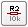将它连接到一个网上。这就像在原理图上命名网络一样。在你刚刚创建的红色虚线上使用这个工具，在弹出的对话框中输入“GND”。(点击[此处](https://cdn.sparkfun.com/assets/b/9/c/1/1/52055a6c757b7f76115b941a.gif)查看整个过程的动画 GIF。)

最后一步是**点击 ratsnest** ，看着光荣的红色几乎填满了你的棋盘的整个区域。你可能会恨我现在告诉你这个*，但是在一开始(放置零件之后，布线之前)在你的设计中增加接地浇注使得手动布线*更加容易。**

 *你可以(或许应该)在木板的两面都进行地面浇注，所以在底层也要遵循同样的步骤。

[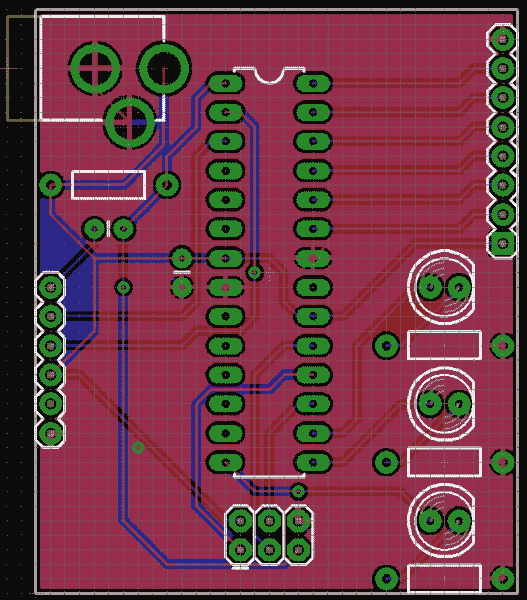](https://cdn.sparkfun.com/assets/8/4/6/0/4/52055b0c757b7f3b11dc0ded.png)

很难判断什么和地面倾倒有关，什么和地面倾倒无关。如果你看到一个黑色的缝隙把垫子和倒酒分开，那就没有联系。如果你看到一些走线在焊盘上形成了一个“目标”，那么从灌注到该焊盘就有一个连接。

如果你想隐藏多边形(很难看到其他的东西)，在你刚刚画的多边形边界上使用 RIPUP 工具。别担心，多边形还在，只要按 ratsnest 就能把它拿回来。

### 添加丝网印刷

虽然丝网印刷对电路设计没有实际影响，但它可能是 PCB 设计的关键部分。你希望它看起来不错，对吗？一些丝网印刷的零件轮廓会自动放在板上，因为它是零件的一部分。我们可以手动添加其他信息，如标签、徽标和名称。各种绘图工具-线()、文本()、圆()、弧()、矩形()和多边形( ) -可用于在丝印层上绘图(顶部用**t 放置**，底部用**b 放置**)。

使用这些工具享受乐趣和探索。您可以为标题添加标签，或者为电阻值添加值，甚至创建一个漂亮的徽标。

[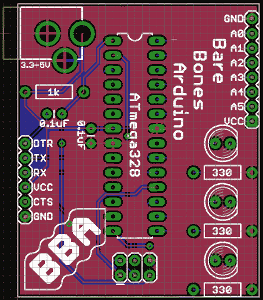](https://cdn.sparkfun.com/assets/8/e/3/f/d/52e7e469ce395f6e4e8b4568.png)

绘图工具有点有限，但这并不意味着你不能让它看起来很好！

## 生成 Gerbers

当你完成设计后，发送到工厂前的最后一步是生成 gerber 文件。Gerber 文件是 PCB 设计的一种“通用语言”。EAGLE 远不是唯一的 PCB CAD 软件，它的设计文件与 Orcad 或 Altium 完全不同。Fab houses 不可能支持所有的软件，所以我们把 gerber 文件发给他们。

Gerber 文件——注意多个——每个文件描述 PCB 的单个层。一个 gerber 可能描述丝网印刷，而另一个定义顶部铜在哪里。总之，我们将生成七个 gerber 文件发送到 fab house。

### CAM 处理器

在我们深入了解之前，您需要下载另一个定义文件: [SparkFun 的 CAM 文件](https://cdn.sparkfun.com/assets/c/1/9/8/2/52056b19757b7f795b2a561c.zip)。

然后，点击 CAM 图标- ，加载 CAM 处理器，这将打开以下窗口:

[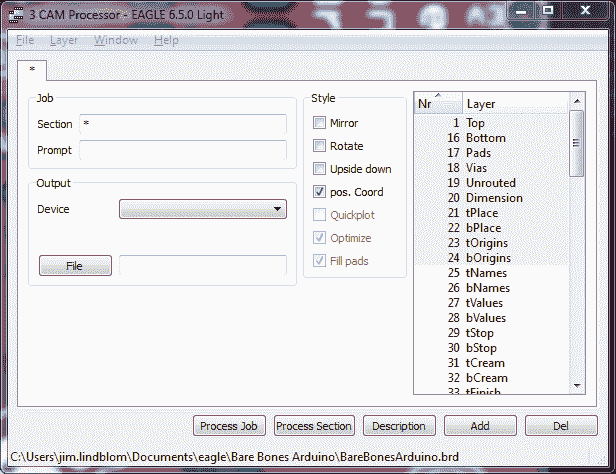](https://cdn.sparkfun.com/assets/0/1/c/e/c/52056d67757b7fd95bba0f0f.png)

从这里，转到 ***文件*菜单**，然后转到**打开 > *作业...*** 。在打开的文件浏览器中，选择刚刚下载的 **sfe-gerb274x.cam** 文件。现在 CAM 处理器窗口应该有一系列标签:“顶部铜”、“底部铜”、“顶部丝印”等。每个选项卡都定义了如何创建一个 gerber 文件。现在你所要做的就是点击 ***处理工单*** 。如果你最近没有保存，它会提示你。

gerber 生成过程应该非常快。一旦它运行完毕，查看一下您的项目目录，其中应该有很多新文件。除了电路板(BRD)和原理图(SCH)文件之外，现在还应该有一个. dri 文件。GBL。GBO。GBS。GML。gpi，。GTO，。GTP。GTS 和 a .TXT .认识一下格伯一家！

| Gerber 文件 | 延长 |
| 底部铜 | GBL |
| 底部丝网印刷 | 货物损坏 |
| 底部阻焊膜 | GBS |
| 顶级铜 | GTL |
| 顶级丝网印刷 | 矩形脉冲断开 |
| 最高焊接等级 | 全球电信系统(Global Telecommunication System) |
| 圆边锉 | 文本文件（textfile） |
| 钻井站信息文件 | 数据简化翻译程序 |
| 光电绘图仪信息文件 | 糖基磷脂酰肌醇 |
| 碾磨层 | 生长调节血清三肽 |
| 顶部粘贴 | GTP |

### 选择 PCB 制造商

世界各地都有 PCB 制造商，所以你应该不难找到一个。 [OSH Park](http://oshpark.com/) 非常适合低容量、高质量的 PCB(另外，它们是紫色的！).[高级赛道](http://www.4pcb.com/)速度惊人。[金凤凰](http://www.goldphoenixpcb.biz/)便宜。我们可以继续下去，但是 Ladyada 在她的网站上有一个很棒的列表。

在他们制造电路板之前，工厂通常会进行快速的可制造性设计(DFM)检查，并让你知道你的设计是否会引起问题。

### 运送嘉宝

发送 gerber 文件的流程因 fab house 而异。大多数人会要求你给他们发送一个精选文件的压缩文件夹。哪些嘉宝文件？再次与你的 fab house 核对(例如 [Advanced Circuits](https://www.my4pcb.com/net35/FreeDFMNet/SoftwareNamingDefaults.aspx) 和 [OSH Park 的](http://oshpark.com/guidelines)指南)，但是通常你想给他们发送 GTL、GBL、GTS、GBS、GTO、GBO 和 TXT 文件。GTP 文件对于 PCB 制作不是必需的，但是(如果你的设计有 SMD 部件)它可以用来创建一个[模板](../electronics-assembly/stenciling)。

[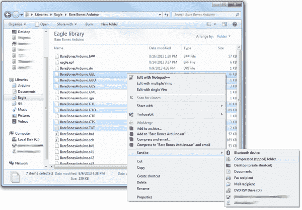](https://cdn.sparkfun.com/assets/d/d/3/7/c/520e9363757b7fa96f8b4573.png)

所以把格柏的拉链拉上。玩[等待游戏](https://www.youtube.com/watch?v=t4Oh7U_L6hs)。准备好组装你自己的 PCB 吧！

## 资源和更进一步

如果你想看看我们在本教程中做的参考设计，你可以在这里下载它们。这也包括 gerber 文件，以及本教程中使用的所有 EAGLE 脚本。

### 更进一步

你已经迈出了成为 PCB 设计师的第一步，但是还有很多东西需要学习。如果你需要在阅读之余休息一下，看看 Pete 的视频*，视频中这位博士讲述了 PCB 布局的一些更一般的概念:*

<param name="movie" value="//www.youtube.com/v/NJKZZArjdg8?version=3&amp;hl=en_US&amp;rel=0"><param name="allowFullScreen" value="true"><param name="allowscriptaccess" value="always"><embed src="//www.youtube.com/v/NJKZZArjdg8?version=3&amp;hl=en_US&amp;rel=0" type="application/x-shockwave-flash" width="480" height="360" allowscriptaccess="always" allowfullscreen="true">

如果您想将 PCB 布局更上一层楼，不妨试试这些教程:

*   [如何创建 SMD 封装](https://learn.sparkfun.com/tutorials/designing-pcbs-smd-footprints) -如果您想在库中创建独特的零件，请查看本教程。
*   [如何制作 SMD PCB](https://learn.sparkfun.com/tutorials/designing-pcbs-advanced-smd)——这是一个更高级、更快节奏的 EAGLE 教程。在这一部分中，我们重点讨论更复杂的表面贴装(SMD)设计。
*   [在 EAGLE](https://learn.sparkfun.com/tutorials/making-custom-footprints-in-eagle) 中制作定制脚印——另一个脚印制作教程。这张幻灯片详细介绍了定制 1:1 示意图的独特流程。
*   [PCB 面板化](http://diy.viktak.com/2013/02/tutorial-panelizing-pcbs-in-eagle.html)

如果你想与世界分享你的 PCB 作品，看看这些教程:

*   [使用 GitHub](https://learn.sparkfun.com/tutorials/using-github)
*   [使用 GitHub 与 SparkFun 分享](https://learn.sparkfun.com/tutorials/using-github-to-share-with-sparkfun)***