# 如何安装和设置 EAGLE

> 原文：<https://learn.sparkfun.com/tutorials/how-to-install-and-setup-eagle>

## 介绍

印刷电路板(PCB)是所有电子产品的支柱。它们不像微处理器那样华丽，也不像电阻那样丰富，但它们对于电路中所有元件的正确连接至关重要。

我们喜欢在 SparkFun 设计 PCB。这是我们想要传播的爱。这是一项让各种电子爱好者受益的技能。通过本教程和一系列教程，我们将解释如何使用 EAGLE 设计 PCB——我们用来设计所有 PCB 的软件。

[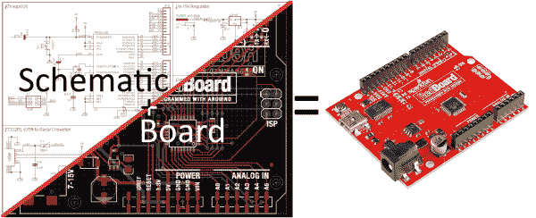](https://cdn.sparkfun.com/assets/2/d/1/2/b/51f829f4757b7fa81c1345d7.png)

这是第一个教程，讲述了如何安装软件，并定制其界面和支持文件。

### 为什么是老鹰？

EAGLE 是众多 PCB CAD 软件之一。所以你可能会问:“是什么让老鹰如此特别？”我们喜欢 EAGLE 有几个特别的原因:

*   跨平台 - EAGLE 可以在任何平台上运行:Windows，Mac，甚至 Linux。这是其他 PCB 设计软件无法比拟的特性。
*   轻量级 - EAGLE 是 PCB 设计软件中最苗条的。它需要 50-200MB 的磁盘空间(相比之下，更高级的工具可能需要 10+GB)。安装程序大约 25MB。因此，您可以在几分钟内从下载到安装再到制作 PCB。
*   免费/低成本-EAGLE 的免费版本提供了足够的实用工具来设计 SparkFun 目录中的几乎任何 PCB。升级到下一个许可等级(如果你想从你的设计中获利)的成本至少比大多数高端工具低两个数量级。
*   **社区支持** -由于这些原因以及其他原因，EAGLE 已经成为 PCB 设计爱好者社区的首选工具之一。无论您是想研究 Arduino 板的设计，还是想在您的设计中引入流行的传感器，可能已经有人在 EAGLE 中制作并分享了它。

当然，老鹰也有它的缺点。更强大的 PCB 设计工具可能有更好的自动布线器，或者像模拟器、程序员和 3D 浏览器这样的漂亮工具。但对我们来说，EAGLE 拥有设计简单到中级 PCB 所需的一切。如果你以前从未设计过 PCB，这是一个很好的起点。

### 推荐阅读

在进入这个兔子洞之前，您可能需要熟悉以下一些教程和概念:

*   [PCB 基础知识](https://learn.sparkfun.com/tutorials/pcb-basics)
*   如何阅读原理图？
*   [电压、电流、电阻和欧姆定律](https://learn.sparkfun.com/tutorials/voltage-current-resistance-and-ohms-law)

## 下载、安装、运行

EAGLE 可以作为 [Fusion 360](https://www.autodesk.com/products/fusion-360/overview) 软件包的一部分从 Autodesk 获得，或者你可以在这里获得免费版本的 just EAGLE [。获取与您的操作系统匹配的版本(该软件适用于 Windows、Mac 和 Linux)。这是一个相对较轻的下载-大约 125MB。](https://www.autodesk.com/products/eagle/free-download)

EAGLE 的安装和大多数程序一样。下载是一个可执行文件；打开它，按照安装说明进行操作。

### 许可鹰

关于 EAGLE 我们最喜欢的一点就是它可以用来**免费**！免费下载是业余爱好者的限量版。免费下载是个人学习许可证，个人可用于*个人*、*非商业*用途。使用免费版本时，需要注意一些限制:

*   你的 PCB 设计被限制在最大 80 厘米²(12.4 英寸 ² )的 PCB 面积，这仍然是相当大的。即使你正在设计一个大的 [Arduino 盾牌](https://learn.sparkfun.com/tutorials/arduino-shields)，你仍然会在最大尺寸之下。
*   只允许两个信号层。如果您需要更多层，请考虑升级到单用户 Fusion 360 许可证。
*   原理图编辑器中只有两张图纸。
*   个人学习许可仅限于*个人*、*非商业性*个人使用。如果你要出去卖你的设计，你会想看看包含在 [Fusion 360 许可证](https://www.autodesk.com/products/eagle/overview)中的单用户 EAGLE 许可证。

这些限制仍然使 EAGLE 成为一款令人惊叹的软件。SparkFun 的工程师可以使用免费软件版本设计我们 99%的电路板，如果不是因为讨厌的非营利规定的话。您仍然可以访问 EAGLE 软件的所有阶段，包括自动路由器。

如果您需要升级许可证，[本页](https://knowledge.autodesk.com/customer-service/download-install/activate/convert-trial-to-subscription)将介绍如何升级。欧特克还为学生和教育工作者提供了一个[教育计划](https://knowledge.autodesk.com/customer-service/account-management/autodesk-for-education)。

### 探索控制面板

第一次打开 EAGLE 时，您应该看到**控制面板**视图。控制面板是 Eagle 的“大本营”,它将软件中的所有其他模块连接在一起。

[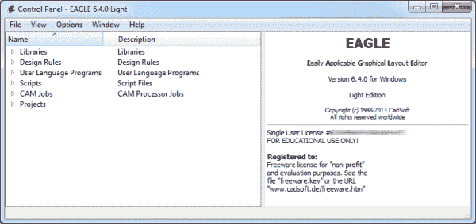](https://cdn.sparkfun.com/assets/7/3/6/0/7/51f6c679ce395f756e000000.png)

您可以在控制面板中浏览六个独立的树，它们突出显示了软件的独立功能:

*   **库** -库存储零件，是原理图符号和 PCB 封装的组合。库通常包含一组相关的部分，例如 *atmel.lbr* 存储了大量的 Atmel AVR 设备，而 *74xx-us.lbr* 库几乎拥有所有的 TTL 74xx 系列 IC。
*   **设计规则(DRU)** -设计规则是您的电路板设计在发送到工厂之前必须满足的一组规则。在这个树中，您会发现 DRU 文件，这是一个预定义的规则集。
*   **用户语言程序(ulp)**-ulp 是用 EAGLE 的[用户语言](ftp://ftp.cadsoftusa.com/eagle/userfiles/doc/ulp570_en.pdf)编写的脚本。它们可用于自动化流程，如生成物料清单(bom.ulp)或导入图形(import-bmp.ulp)。
*   **脚本(SCR)** -脚本文件可用于定制 EAGLE 用户界面。只需一次点击，您就可以设置配色方案和分配按键绑定。
*   **CAM 作业(CAM)** - CAM 处理器可打开 CAM 作业，帮助创建 gerber 文件。
*   **项目** -这是你的每个项目被组织到一个单独的项目文件夹中的地方。项目将包括原理图，电路板设计，可能还有 gerber 文件。

[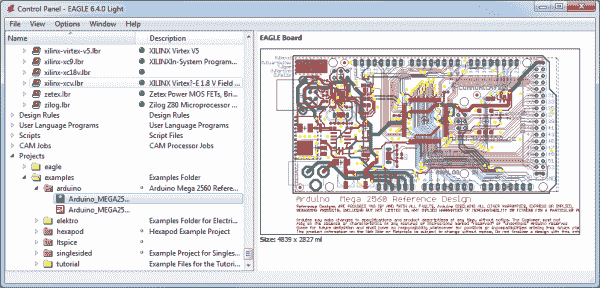](https://cdn.sparkfun.com/assets/7/2/c/b/9/51f6c788ce395fff6e000005.png)

如果您在树中选择一个文件，关于它的信息将出现在窗口的右边部分。这是一个探索库、项目设计(EAGLE 附带了一些有趣的例子)或了解脚本用途的好方法。

## 使用 SparkFun 库

EAGLE 附带了一个令人印象深刻的零件库列表，您可以在控制面板视图中浏览。这里有数百个库，有些专用于电阻或 NPN 晶体管等特定器件，有些专用于特定制造商。这是一个惊人的资源！但也可能有点让人不知所措。就算你只是想加一个简单的通孔电解电容，也有几十个库和零件要整理才能找到合适的。

你可以使用 [SparkFun EAGLE 库](https://github.com/sparkfun/SparkFun-Eagle-Libraries)，而不是使用数百个默认库，这些库被过滤掉，只包括我们自己在设计中使用过的部分。它们会不断更新我们发现的新部件。

以下是如何安装和使用 SparkFun 库来代替(或补充)默认库:

### 步骤 1:下载 SparkFun 库

最新版本的库总是可以在 GitHub 库中找到。要获得使用 GitHub 的帮助，请查看我们的[使用 GitHub](https://learn.sparkfun.com/tutorials/using-github) 教程。基本上，你需要做的就是从主页面**点击“下载 ZIP”。**

[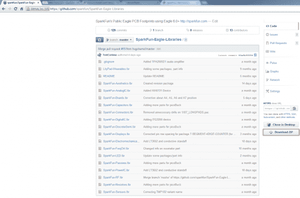](https://cdn.sparkfun.com/assets/5/9/a/9/c/51f6d74fce395f5c67000006.png)

将 ZIP 文件保存在方便的地方。然后解压文件夹-不要忘记它在哪里！

### 步骤 2:更新目录窗口

现在回到 EAGLE 控制面板窗口。进入**“选项”菜单**，然后**选择“目录”**。这是 EAGLE 在树视图中填充所有六个对象时查看的计算机目录列表...包括图书馆。

[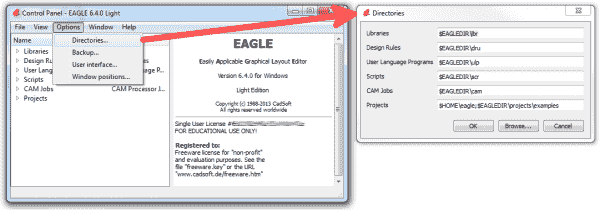](https://cdn.sparkfun.com/assets/7/3/a/7/0/51f6d989ce395fd16d000004.png)

在“Libraries”框中，我们将添加一个指向存储 SparkFun EAGLE 库的目录的链接。这里有几个选择。如果您想保留默认库并添加 SparkFun 库，请添加分号(；)，并在其后粘贴 SparkFun EAGLE Libraries 目录位置。

[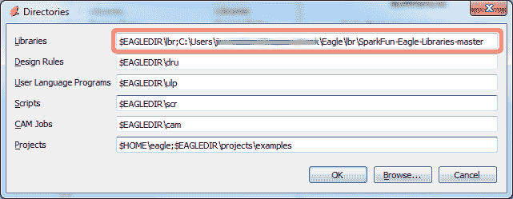](https://cdn.sparkfun.com/assets/f/6/e/3/6/51f6e9f3ce395f526e000002.png)

**注意** : Mac 和 Linux 用户应该在目录之间放置一个**冒号**(:)，而不是分号。

### 步骤 3:“使用”库

现在，当你回头看“库”树时，应该包括两个文件夹，其中一个应该是我们的 SparkFun Eagle 库。最后一步是告诉 EAGLE，至少现在，我们不想使用默认库。为此，右击“lbr”文件夹，选择**“不使用”**。

[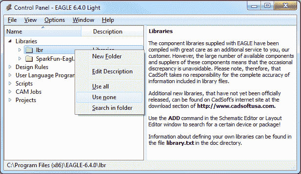](https://cdn.sparkfun.com/assets/3/3/f/4/a/51f6ea91ce395f8269000004.png)

然后右键点击“spark fun-Eagle-Libraries-master”文件夹，选择**“全部使用”**。然后检查两个文件夹中的库。它们旁边应该是一个灰色或绿色的点。库旁边的绿点表示正在使用，灰点表示没有使用。您的库树应该看起来像这样:

[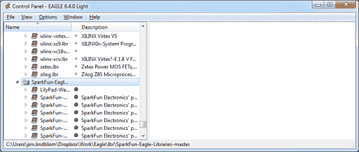](https://cdn.sparkfun.com/assets/6/e/b/b/f/51f6eb55ce395fee66000007.png)

如果您已经创建了想要与 SparkFun 共享的库部件，并将其包含在我们的 Eagle 库中，请访问[本教程](https://learn.sparkfun.com/tutorials/using-github-to-share-with-sparkfun)了解如何操作。

## 打开项目并浏览

EAGLE 封装了一些漂亮的 PCB 设计示例。通过展开“项目”树打开一个。从那里，在“示例”文件夹下，通过双击红色文件夹打开“arduino”项目(或右键单击并选择“打开项目”)。请注意，在此视图中，项目文件夹是红色的，常规文件夹是标准的黄色。

打开项目应该会产生另外两个 EAGLE 窗口:board 和原理图编辑器。这是鹰的阴阳两极。它们应该一起使用，以创建功能性 PCB 设计的成品。

[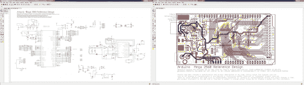](https://cdn.sparkfun.com/assets/b/1/3/0/5/51f80387757b7fcd1cdd54c9.png)*Schematic (left) and board editors both open. Click to embiggen.*

**原理图编辑器**(左上)是一组红色电路符号的集合，这些符号通过绿色网络(或电线)相互连接。项目的原理图就像程序代码中的注释。它有助于讲述电路板设计实际做了什么，但对最终产品没有太大影响。原理图中的器件没有经过精确测量，而是以易于阅读的方式进行布局和连接，以帮助您和他人了解电路板设计的进展。

**板编辑器**是真正神奇的地方。在这里，彩色层重叠和交叉，以创建一个精确测量的 PCB 设计。两层铜层——红色在上面，蓝色在下面——被战略性地布线，以确保不同的信号不会交叉和短路。被称为“过孔”的黄色圆圈(在这个设计中，它们通常是绿色的)将信号从一端传递到另一端。更大的过孔允许通孔器件插入并焊接到电路板上。其他目前隐藏的层露出铜，以便元件可以焊接到它上面。

### 让两个窗户都开着！

这两个窗口携手合作。对原理图所做的任何更改都会自动反映在电路板编辑器中。每当你修改一个设计时，重要的是**保持两个窗口一直打开**。

例如，如果您关闭了设计的电路板窗口，但继续修改原理图。您对原理图所做的更改不会反映在电路板设计中。这很糟糕。原理图和电路板设计应该始终保持一致。为了重新获得一致性而回溯任何变化真的很痛苦。**始终保持两个窗户都打开**！

有几种方法可以判断窗口之间是否不一致。首先，两个窗口的右下角都有一个“点”。如果点是绿色的，一切都很好。如果这个点是洋红色的，那可能是一扇不应该关闭的窗户。其次，更明显的是，如果你关闭两个窗口中的任何一个，另一个窗口会弹出一个巨大的警告:

[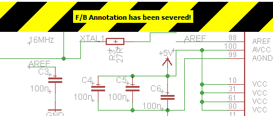](https://cdn.sparkfun.com/assets/2/0/c/0/f/51f7fefb757b7fda1c200df7.png)

如果你看到那个警告，停止做任何事情，让另一个窗口重新打开。重新打开电路板或原理图窗口的简单方法是点击“切换到电路板/原理图”图标-  / (也可在“文件”菜单下找到)。

### 浏览视图

这是一个通常被忽略的主题，但是知道如何在这两个窗口中导航是很重要的。

要在编辑器窗口中移动，带滚轮的鼠标非常方便。您可以通过向前和向后旋转滚轮来放大和缩小。按下滚轮并移动鼠标可以拖动屏幕。

如果你没有三键鼠标，你将不得不求助于视图选项来移动编辑器视图。所有这些工具都位于顶部工具栏的中间，或者在“视图”菜单下。放大-  -和缩小-  -工具显然很方便。“缩放选择”工具- 也是如此，它可以根据你的选择改变视图。但是真的，如果你真的想用 EAGLE...找只老鼠！

## 配置用户界面

EAGLE 的用户界面是高度可定制的。从背景颜色到图层颜色，再到按键绑定，任何东西都可以根据你的喜好进行修改。更好地定制您的接口可以使 PCB 设计更加容易。在这一页上，我们将谈论我们 SparkFun 如何更喜欢定制我们的用户界面。这些步骤都不是必需的。自定义你认为合适的用户界面。这些只是我们已经习惯的环境。

### 设置背景颜色

我们总是对 UI 进行的第一个调整是板编辑器的背景颜色。标准的白色背景并不总是与电路板设计所需的彩色层阵列很好地融合在一起。相反，我们通常选择黑色背景。

要更改背景颜色，请进入“选项”菜单，选择“用户界面”。

在“布局”框中，您可以将背景设置为黑色、白色或特定颜色。

[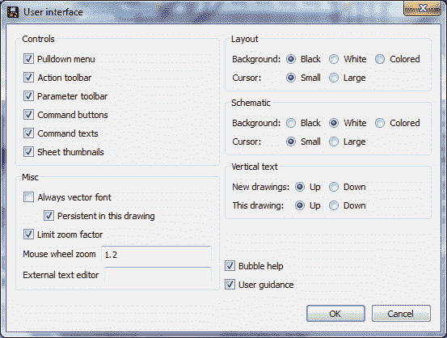](https://cdn.sparkfun.com/assets/4/2/6/b/4/51f7e72f757b7ff124594ec8.PNG)

在这个框中还有其他选项可以探索，但是您可能希望推迟调整，直到您对该软件有了更多的经验。

### 调整网格

我们喜欢在 board editor 中做的另一个 UI 改进是打开网格。尺寸和大小对 PCB 的设计非常重要，一些可见的尺寸提示会非常有帮助。要打开网格视图，单击纸板窗口左上角附近的图标(或转到“视图”菜单并选择“网格”)。

[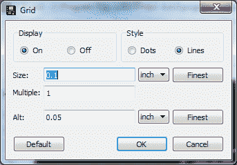](https://cdn.sparkfun.com/assets/f/6/4/1/3/51f7e981757b7f41251f9ac7.png)

将“显示”单选按钮切换到“开”。我们还将通过将“大小”设置为 100 密耳(0.1”)并将“高度”设置为 50 密耳(0.05”)来使网格不那么精细。

### 运行脚本

脚本是快速配置界面的一种更加简化的方式。只需点击一下按钮，您就可以自动设置所有的颜色和按键组合。脚本文件也可以被任何人共享和运行。运行 SparkFun EAGLE 脚本将使您的 UI 与我们的完全匹配。

首先，点击[这里](https://cdn.sparkfun.com/assets/5/2/6/e/e/51f7f30e757b7fc71c666640.zip)下载脚本(在一个 zip 文件夹中)。将“spk.scr”文件解压缩到您记得的位置。

然后，您需要运行脚本。在纸板窗口中点击脚本图标- (或转到“文件”，然后“执行脚本”)。在文件浏览器中，选择刚刚下载并解压的“spk.scr”文件。

这将自动设置你的配色方案，看起来有点像这样:

[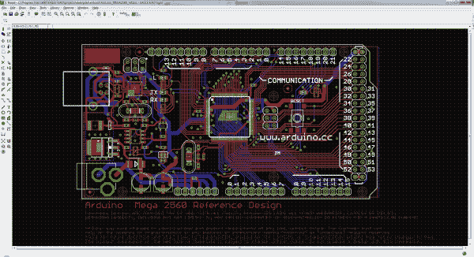](https://cdn.sparkfun.com/assets/a/a/8/1/8/51f7f354757b7f391c9e2b52.png)

这个 UI 设置提供了一个很好的层的逻辑视图。重要的铜层非常明显，但很明显(红色在上，蓝色在下，绿色用于过孔)，并且丝网印刷是白色的，就像大多数 PCB 设计一样。

随着您继续使用和探索 EAGLE，所有这些彩色层将变得更有意义。

* * *

### SparkFun 自定义老鹰设置

要找到 SparkFun 的最新脚本和其他有用的文件，请查看我们托管在 GitHub 上的 [EAGLE 设置库](https://github.com/sparkfun/SparkFun_Eagle_Settings)！

[GitHub Repo: SparkFun Custom Eagle Settings](https://github.com/sparkfun/SparkFun_Eagle_Settings)

## 资源和更进一步

如果你已经设置好 EAGLE，并迫不及待地开始设计 PCB，你的下一步应该是我们的 2 部分使用 EAGLE 教程:[使用 EAGLE:原理图](https://learn.sparkfun.com/tutorials/using-eagle-schematic)和[使用 EAGLE:电路板布局](https://learn.sparkfun.com/tutorials/using-eagle-board-layout)。这两个教程将解释如何从原理图设计，到 PCB 的布局和布线，再到生成 gerber 文件并将其发送到工厂。

或者下面是我们 EAGLE 系列的一些其他教程:

*   [如何创建 SMD PCB](https://learn.sparkfun.com/tutorials/designing-pcbs-advanced-smd)——这在逻辑上应该遵循 PTH EAGLE 教程。有点高级，快节奏。
*   [如何创建 SMD 封装](https://learn.sparkfun.com/tutorials/designing-pcbs-smd-footprints) -如果您想在库中创建独特的零件，请查看本教程。
*   [在 EAGLE](https://learn.sparkfun.com/tutorials/making-custom-footprints-in-eagle) 中制作定制脚印——另一个脚印制作教程。这张幻灯片详细介绍了定制 1:1 示意图的独特流程。