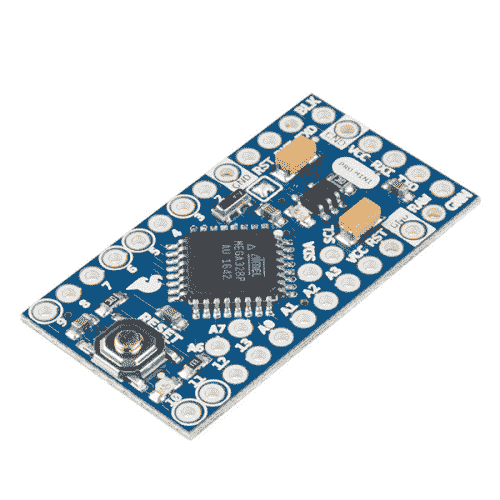
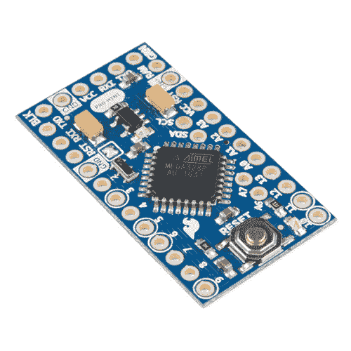

# 使用 Arduino Pro Mini 3.3V

> 原文：<https://learn.sparkfun.com/tutorials/using-the-arduino-pro-mini-33v>

## 介绍

**Heads up!** This tutorial was written originally written for the Arduino Pro Mini 3.3V/8MHz. However, you can still use this as a guide to upload code for Arduino Pro Mini 5V/16MHz. To upload adjust the Processor in the Arduino IDE when uploading code to the 5V version board.

最初的真正蓝色 Arduino 是开源硬件，这意味着任何人都可以免费下载设计文件，并开发自己版本的流行开发板。SparkFun 抓住了这个机会，创造了各种 Arduino 变体，每一种都有自己独特的功能、尺寸和应用。现在其中一个变种已经落到了你的手里；恭喜你！微控制器领域是一个狂野的世界，你即将迈出第一步，远离 Arduino Pro Mini 的美妙(尽管有时令人窒息)简单。有两种型号，5V/16MHz 和 3.3V/8MHz。

 

将**添加到您的[购物车](https://www.sparkfun.com/cart)中！**

### [Arduino Pro Mini 328-5V/16 MHz](https://www.sparkfun.com/products/11113)

[In stock](https://learn.sparkfun.com/static/bubbles/ "in stock") DEV-11113

SparkFun 对 Arduino 的极简设计方法。这是一个 5V Arduino 运行 16MHz 引导加载程序。

$10.95137[Favorited Favorite](# "Add to favorites") 166[Wish List](# "Add to wish list")**** 

将**添加到您的[购物车](https://www.sparkfun.com/cart)中！**

### [Arduino Pro Mini 328-3.3V/8 MHz](https://www.sparkfun.com/products/11114)

[In stock](https://learn.sparkfun.com/static/bubbles/ "in stock") DEV-11114

SparkFun 对 Arduino 的极简设计方法。这是一个 3.3V Arduino 运行 8MHz 引导加载程序。

$10.9552[Favorited Favorite](# "Add to favorites") 91[Wish List](# "Add to wish list")**** ****在本教程中，我们将介绍如何设置和使用 3.3V Arduino Pro Mini，从组装微型 Arduino 到编程。

### 所需材料

接下来，你需要一些额外的物品。你可能不需要所有的东西，这取决于你拥有什么。将它添加到您的购物车，通读指南，并根据需要调整购物车。你至少需要一些接头、USB 电缆和 FTDI。FTDI Basic 将用于对 Pro Mini 进行编程(和供电)。接头是可选的，但它们是我们将其他设备连接到 Pro Mini 的首选方式。****