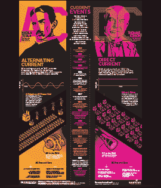
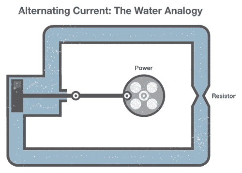
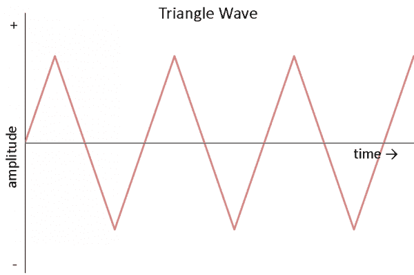
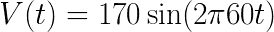
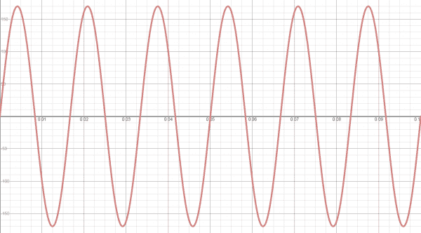
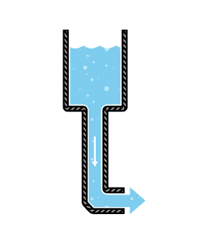
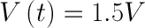
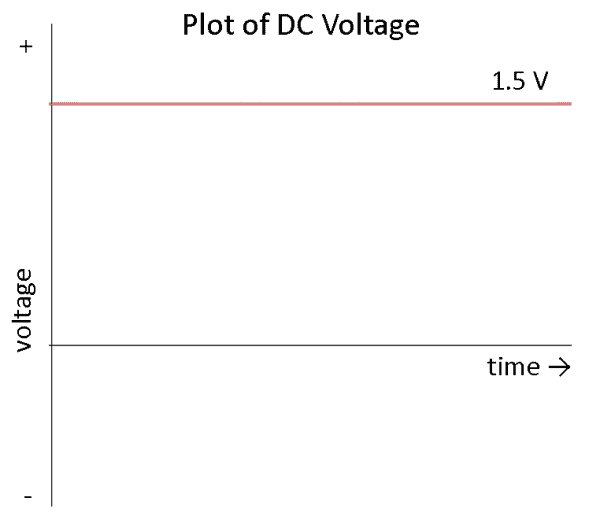
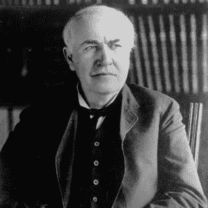
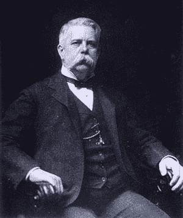

# 交流电与直流电(DC)

> 原文：<https://learn.sparkfun.com/tutorials/alternating-current-ac-vs-direct-current-dc>

## 雷劈！

澳大利亚摇滚乐队 AC/DC 的名字是从哪里来的？为什么，当然是交流电和直流电了！交流电和 DC 都描述了电路中电流的类型。在**直流电** (DC)中，电荷(电流)只向一个方向流动。另一方面，**交流电** (AC)中的电荷周期性地改变方向。由于电流改变方向，交流电路中的电压也会周期性反转。

你制造的大多数数字电子产品都将使用 DC。但是，理解一些 AC 概念是很重要的。大多数家庭都连接了交流电，所以如果你计划将你的 [Tardis 音乐盒项目](https://learn.sparkfun.com/tutorials/mp3-player-shield-music-box)连接到插座，你需要将交流电转换成 DC。交流电还具有一些有用的特性，例如能够用一个元件(变压器)转换电压水平，这就是为什么交流电被选为长距离输电的主要手段。

### 你将学到什么

*   AC 和 DC 背后的历史
*   产生交流和 DC 的不同方式
*   交流和 DC 应用的一些例子

### 推荐阅读

*   [什么是电](https://learn.sparkfun.com/tutorials/what-is-electricity)
*   [什么是电路？](https://learn.sparkfun.com/tutorials/what-is-a-circuit)
*   [电压、电流、电阻和欧姆定律](https://learn.sparkfun.com/tutorials/voltage-current-resistance-and-ohms-law)
*   [电力](https://learn.sparkfun.com/tutorials/electric-power)

&nbsp

&nbsp

## 交流电

交流电描述周期性改变方向的电荷流动。结果，电压电平也随着电流反向。交流电用于向住宅、办公楼等输送电力。

### 产生交流电

交流电可以通过一种叫做交流发电机的装置产生。这个装置是一种特殊类型的发电机，用来产生交流电。

一圈导线在磁场中旋转，磁场会沿着导线感应出电流。金属丝的旋转可以来自任何方式:风力涡轮机、蒸汽涡轮机、流水等等。因为导线周期性地旋转并进入不同的磁极，所以电压和电流在导线上交替变化。下面是展示这一原理的简短动画:

[//www.youtube.com/embed/i-j-1j2gD28](//www.youtube.com/embed/i-j-1j2gD28)

*(Video credit: Khurram Tanvir)*

产生交流电可以比作我们之前的水类比:

为了在一组水管中产生交流电，我们将一个机械曲柄连接到一个活塞上，活塞在水管中来回移动水(我们的“交流”电流)。请注意，无论水流方向如何，管道的收缩部分仍然会对水流产生阻力。

### 波形

只要电压和电流是交变的，交流电就有多种形式。如果我们将一个示波器连接到一个交流电路上，并绘制其电压随时间的变化曲线，我们可能会看到许多不同的波形。最常见的交流电是正弦波。大多数家庭和办公室的交流电都有振荡电压，产生正弦波。

交流的其他常见形式包括方波和三角波:

方波常用于数字和开关电子设备，以测试它们的运行。

三角波存在于声音合成中，对于测试放大器等线性电子设备非常有用。

### 描述正弦波

我们经常想用数学术语来描述交流波形。对于这个例子，我们将使用常见的正弦波。正弦波有三个部分:振幅、频率和相位。

只看电压，我们可以将正弦波描述为数学函数:

***【V(t)***是我们的电压作为时间的函数，也就是说我们的电压随着时间的变化而变化。等号右边的等式描述了电压如何随时间变化。

***V[P]*为*振幅*。这描述了我们的正弦波在两个方向上可以达到的最大电压，这意味着我们的电压可以是+V [P] 伏特，-V [P] 伏特，或者介于两者之间。**

**sin()** 函数表示我们的电压将是周期正弦波的形式，是 0V 左右的平滑振荡。

***2π*** 是将频率从周期(赫兹)转换为[角频率](http://en.wikipedia.org/wiki/Angular_frequency)(弧度每秒)的常数。

***f*** 描述了正弦波的*频率*。这以每秒的*赫兹*或*单位的形式给出。频率告诉我们一个特定的波形(在这种情况下，我们的正弦波的一个周期-一个上升和一个下降)在一秒钟内出现多少次。*

***t*** 是我们的自变量:时间(以秒计)。随着时间的变化，我们的波形也在变化。

*描述了正弦波的*相位*。相位衡量波形相对于时间的偏移程度。它通常是 0 到 360 之间的一个数字，用度数来表示。由于正弦波的周期性，如果波形偏移 360 °,它又会变成相同的波形，就好像偏移了 0°。为了简单起见，在本教程的剩余部分，我们仍然假设 phase 为 0。*

 *我们可以从可靠的插座上找到交流波形如何工作的好例子。在美国，提供给我们家庭的电源是大约 170V 零峰值(振幅)和 60Hz(频率)的交流电。我们可以将这些数字代入公式，得到等式(请记住，我们假设相位为 0):

我们可以用我们方便的绘图计算器来绘制这个方程。如果没有可用的绘图计算器，我们可以使用免费的在线绘图程序，如 [Desmos](https://www.desmos.com/calculator) (请注意，您可能需要在等式中使用“y”而不是“v”来查看图表)。

注意，正如我们预测的那样，电压周期性地上升到 170V，然后下降到-170V。此外，每秒钟出现 60 个周期的正弦波。如果我们用示波器测量插座中的电压，我们会看到这样的情况(**警告:**不要试图用示波器测量插座中的电压！这可能会损坏设备)。

**注:**你可能听说过美国的交流电压是 120V。这也是正确的。怎么会？当谈到交流时(因为电压不断变化)，使用平均值或中间值往往更容易。为了做到这一点，我们使用了一种叫做[“均方根”的方法](http://en.wikipedia.org/wiki/Root_mean_square) (RMS)。当您想要计算[电功率](https://learn.sparkfun.com/tutorials/electric-power)时，使用交流的均方根值通常很有帮助。即使在我们的例子中，电压从-170V 变化到 170V，均方根也是 120V RMS。

### 应用程序

家庭和办公室插座几乎都是交流电。这是因为产生交流电并长距离输送相对容易。在高电压(超过 110 千伏)下，电力传输中损失的能量较少。更高的电压意味着更低的电流，更低的电流意味着电源线中因电阻而产生的热量更少[。使用变压器可以很容易地将交流电转换成高压或从高压转换成交流电。](https://learn.sparkfun.com/tutorials/electric-power/calculating-power)

交流电也能为电动机提供动力。电动机和发电机是完全相同的设备，但电动机将电能转化为机械能(如果电动机的轴旋转，就会在端子上产生电压！).这对许多大型电器很有用，如洗碗机、冰箱等，它们都是用交流电运行的。

## 直流电(DC)

直流电比交流电更容易理解一点。DC 提供恒定的电压或电流，而不是来回振荡。

### 生成 DC

DC 可以通过多种方式产生:

*   装有一种叫做“换向器”的装置的交流发电机可以产生直流电
*   使用一种称为[“整流器”](http://en.wikipedia.org/wiki/Rectifier)的装置，将交流电转换成 DC
*   [电池](https://learn.sparkfun.com/tutorials/battery-technologies)提供 DC，它是由电池内部的化学反应产生的

再次使用我们的水类比，DC 就像一个末端有软管的水箱。

水箱只能向一个方向注水:从软管中流出。类似于我们的 DC 生产的电池，一旦水箱空了，水就不再通过管道流动。

### 描述 DC

DC 被定义为电流的“单向”流动；电流只向一个方向流动。只要流动方向不变，电压和电流可以随时间变化。为了简化，我们假设电压是一个常数。例如，我们假设一节 AA 电池提供 1.5V 电压，可以用数学术语描述为:

如果我们绘制一段时间的曲线图，我们会看到一个恒定的电压:

这是什么意思？这意味着我们可以依靠大多数 DC 源来提供一个恒定的电压。在现实中，电池会慢慢失去电荷，这意味着随着电池的使用，电压会下降。在大多数情况下，我们可以假设电压是恒定的。

### 应用程序

几乎所有在 SparkFun 上出售的电子项目和零件都在 DC 运行。一切用电池供电、用交流适配器插在墙上或者用 USB 线供电的东西都依赖 DC。DC 电子的例子包括:

*   手机
*   基于 LilyPad 的 [D & D 骰子战书](https://learn.sparkfun.com/tutorials/dungeons-and-dragons-dice-gauntlet)
*   平板电视(交流电进入电视，转换成 DC)
*   手电筒
*   混合动力和电动汽车

## 洋流之战

几乎每个家庭和企业都有交流电。然而，这不是一夜之间的决定。19 世纪 80 年代末，美国和欧洲的各种发明导致了交流电和直流电分配的全面战争。

1886 年，位于布达佩斯的 Ganz Works 电力公司用交流电给整个罗马供电。另一方面，到 1887 年，托马斯·爱迪生已经在美国建造了 121 座 DC 发电站。第二年，匹兹堡的著名实业家乔治·威斯汀豪斯购买了尼古拉·特斯拉的交流电机和传动装置专利，这是这场斗争的转折点。

### AC 对 DC

*Thomas Edison (Image courtesy of [biography.com](http://www.biography.com/people/thomas-edison-9284349))*

在 19 世纪晚期，DC 不容易转换成高电压。因此，爱迪生提出了一个由小型地方发电厂组成的系统，为个别社区或城区供电。使用发电厂的三根电线分配电力:+110 伏、0 伏和-110 伏。灯和马达可以连接在+110V 或 110V 插座和 0V(中性)之间。110V 允许工厂和负载(家庭、办公室等)之间有一些电压降。).

即使考虑了输电线上的电压降，发电厂也需要位于终端用户 1 英里以内。这种限制使得农村地区的电力分配极其困难，甚至不可能。

|  |  |
| (图片由[wikipedia.org](http://en.wikipedia.org/wiki/File:Tesla_circa_1890.jpeg)提供) | (图片由[pbs.org](http://www.pbs.org/tesla/ll/wc_west_pop.html)提供) |

凭借特斯拉的专利，西屋公司致力于完善交流配电系统。变压器提供了一种廉价的方法将交流电压升高到几千伏，然后再降低到可用的水平。在更高的电压下，同样的功率可以在更低的电流下传输，这意味着导线电阻引起的功率损耗更少。因此，大型发电厂可能位于数英里之外，为更多的人和建筑服务。

### 爱迪生的诽谤运动

在接下来的几年里，爱迪生发起了一场运动，强烈反对在美国使用交流电，其中包括游说各州立法机关和散布关于交流电的虚假信息。爱迪生还指示几名技术人员公开用交流电电死动物，试图证明交流电比 DC 更危险。为了展示这些危险，爱迪生的雇员哈罗德·布朗和阿瑟·肯涅利为纽约州设计了第一把使用交流电的电椅。

### 交流电的兴起

1891 年，国际电工技术展览会在德国法兰克福举行，并在展览会上展示了第一次三相交流电的长距离传输，它为电灯和电动机提供动力。后来成为通用电气公司的几名代表出席了这次展览，随后他们对这次展览印象深刻。次年，通用电气公司成立并开始投资交流技术。

*Edward Dean Adams Power Plant at Niagara Falls, 1896 (Image courtesy of [teslasociety.com](http://www.teslasociety.com/exhibition.htm))*

西屋电气公司在 1893 年赢得了一份合同，建造一座水电站大坝，利用尼亚加拉瀑布的电力，并将交流电输送到纽约的布法罗。该项目于 1896 年 11 月 16 日竣工，交流电开始为布法罗的工业提供电力。这个里程碑标志着 DC 在美国的衰落。欧洲将采用 50 赫兹 220-240 伏的交流标准，而北美的标准将变成 60 赫兹 120 伏。

### 高压直流输电

19 世纪 80 年代，瑞士工程师 René Thury 使用一系列电动发电机创建了一个高压 DC 系统，该系统可用于远距离传输 DC 电力。然而，由于 Thury 系统的高成本和维护，HVDC 几乎一个世纪都没有被采用。

随着 20 世纪 70 年代半导体电子学的发明，交流和 DC 之间的经济转换成为可能。专用设备可以用来产生高电压 DC 电力(一些达到 800 千伏)。欧洲部分地区已经开始采用高压直流输电线路来电连接各个国家。

在非常长的距离上，高压直流输电线路比同等的交流输电线路损耗小。此外，HVDC 允许连接不同的交流系统(例如 50 Hz 和 60 Hz)。尽管有其优势，高压直流系统比普通的交流系统成本更高，可靠性更差。

最终，爱迪生、特斯拉和西屋电气可能会如愿以偿。AC 和 DC 可以共存，各有所用。

## 资源和更进一步

你现在应该对 AC 和 DC 的区别有了很好的理解。交流更容易在电压等级之间转换，这使得高压传输更可行。另一方面，DC 几乎出现在所有的电子产品中。你应该知道这两者不能很好地混合，如果你想把大多数电子产品插入墙上的插座，你需要把交流电转换成 DC。有了这种理解，你应该准备好处理一些更复杂的电路和概念，即使它们包含交流。

当您准备好深入电子世界时，请阅读以下教程:

*   [串联和并联电路](https://learn.sparkfun.com/tutorials/series-and-parallel-circuits)
*   [逻辑电平](https://learn.sparkfun.com/tutorials/logic-levels)
*   [如何使用万用表](https://learn.sparkfun.com/tutorials/how-to-use-a-multimeter)
*   [如何为项目提供动力](https://learn.sparkfun.com/tutorials/how-to-power-a-project)

## 有兴趣学习更多基础主题吗？

查看我们的 **[工程要点](https://www.sparkfun.com/engineering_essentials)** 页面，了解电气工程相关基础主题的完整列表。

带我去那里！

&nbsp*