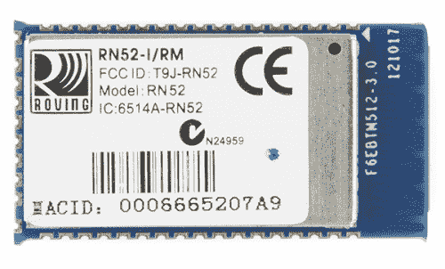
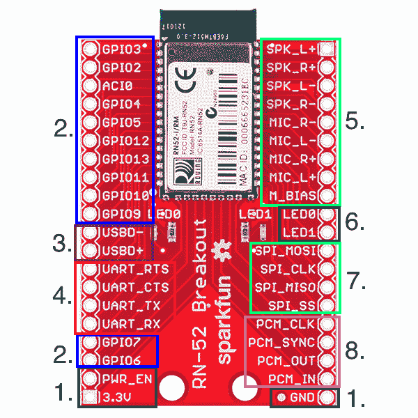
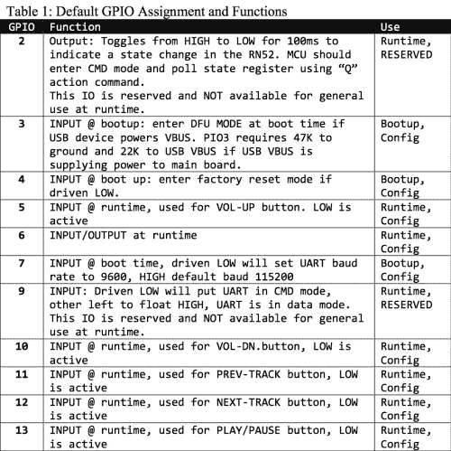

# RN-52 蓝牙连接指南

> 原文：<https://learn.sparkfun.com/tutorials/rn-52-bluetooth-hookup-guide>

## 概观

RN-52 音频蓝牙分线点是一个时尚的蓝牙音频模块，来自于一个易于使用的 PCB 上的移动网络。它允许您通过无线蓝牙连接发送立体声音频。该模块具有嵌入式 DSP，可处理进出该模块的音频流，将数字无线信号转换为音频，反之亦然。该模块很容易用 ASCII 命令和 GPIO 进行配置。它可以作为一个独立的模块，也可以与微处理器相结合，创造出极致的无线音频体验。

### 本教程涵盖的内容

在本教程中，我们将回顾模块的一些功能。我们将向您展示如何配置该模块以满足您的项目需求，如何将其连接起来，并使用 RN-52 查看一个简单的示例项目。

### 推荐阅读

*   [蓝牙基础知识](https://learn.sparkfun.com/tutorials/bluetooth-basics)
*   [串行终端基础知识](https://learn.sparkfun.com/tutorials/terminal-basics)
*   [Arduino 是什么？](https://learn.sparkfun.com/tutorials/what-is-an-arduino)
*   [串行通信](https://learn.sparkfun.com/tutorials/serial-communication)
*   [如何使用试验板](https://learn.sparkfun.com/tutorials/how-to-use-a-breadboard)

## RN-52 模块

在讨论分组讨论之前，我们先来讨论一下该模块及其功能。

与任何产品一样，在将该设备嵌入项目之前，阅读[数据表](https://cdn.sparkfun.com/assets/3/9/1/0/0/5217c61f757b7fd6748b4571.pdf)是明智之举。

### 蓝牙版本

RN-52 是一个蓝牙 3.0 版模块。它兼容所有蓝牙 3.0 版设备，也向后兼容所有蓝牙 2.1 + EDR，1.2 和 1.1 设备。

### 蓝牙模式

这里是 RN-52 支持的所有配置文件的列表。

*   **SPP** -串行端口配置文件允许您通过 [UART 串行连接](https://learn.sparkfun.com/tutorials/serial-communication)配置设备。这也可以用来从微控制器向模块发送命令。
*   **HFP/HSP** -支持免提模式和耳机模式，这意味着该模块可以用作耳机设备。这使得它能够像蓝牙耳机一样来回发送音频。您可以通过麦克风发送音频输入，并通过扬声器或耳机接收音频输出。
*   **A2DP** -高级音频分配模式单向发送音频，但该音频的质量优于 HFP 和 HSP。
*   **AVRCP** - A/V 遥控模式允许您通过模块控制音频的某些功能。播放/暂停、调高音量和调低音量等任务可以通过模块上的输入来控制。
*   iAP -这是 iPod 配件协议，它允许你将模块连接到任何苹果设备，如 iPhones、iPod、Mac 笔记本电脑和电脑。

* **注意:**可以一次实现多个概要文件。默认设置设置为可发现所有配置文件。

### 范围

RN-52 是一种 2 级蓝牙设备，这意味着车载天线的范围约为 **10m** 。因此，您应该能够在户外从大约 32 英尺的地方向模块传输音频。如果你穿过墙壁或窗户，这个范围会缩小。

### 无线音频

RN-52 与其他蓝牙模块不同，它可以传输音频。它通过板载数字信号处理(DSP)芯片来实现这一点。将音频流*传输到 RN-52*时，DSP 会转换从发射机设备(电话、电脑等)发送的无线电波。)转换成电信号，然后发送到放大器，再到您的音频输出(扬声器/耳机)。当从模块流式传输音频*时，它会将来自音频输入设备(mic/line-in)的电信号转换为无线电波，供接收设备(立体声、电脑、电话)使用。*

许多人问为什么不能通过任何一个旧的蓝牙连接发送音频。缺少板载 DSP 是大多数“常规”模块不支持音频流的主要原因。

### 沟通

除了无线蓝牙连接之外，RN-52 还有四条与外部设备通信的路径:UART、USB、SPI 和 PCM。我们将在下一节更深入地讨论这些。

## RN-52 突破

RN-52 分线板发生了很多事情。让我们把它分成几个部分，看看什么目的需要什么样的针。

*Here is the module broken up into sections by color (and numerically for the color-vision impared).*

#### 1.功率

给 RN-52 提供动力非常简单。为电路板供电需要三个引脚:3.3V、GND 和电源使能(PWR_EN)。电源电压应在 3.0 ~ 3.6V 范围内。

#### 2. GPIO 引脚

RN-52 有 11 个通用输入/输出引脚(GPIO)。当模块启动和模块运行时，这些管脚中的许多被保留用于特殊功能。在音频回放过程中，这些引脚还充当特定功能的输入引脚。这些可以配置为控制媒体程序，如 iTunes 或 Windows Media Player(例如，播放、暂停、下一首歌曲等。).

*This table shows each GPIO and its function.*

需要注意的最重要的引脚是 **GPIO9** 。如果您熟悉其他版本的漫游网络蓝牙模块，您可能也熟悉用于进入模块命令模式的`$$$`命令。然而，在该模块上，只有一种方法可以进入命令模式，即拉低 GPIO9。

还有一条[模拟输入/输出](https://learn.sparkfun.com/tutorials/analog-to-digital-conversion)线，AIO0。

#### 3. USB

USB 线严格用于**设备固件更新** (DFU)模式。与 GPIO3 一起使用，USBD+和 USBD-线允许你直接上传新的固件到 RN-52。

#### 4. UART

[UART](https://learn.sparkfun.com/tutorials/serial-communication) 线用于与 RN-52 通信并对其进行配置。与 GPIO9 配合使用，UART 将允许您向模块发送和从模块接收串行命令。

UART 也可用于将模块连接到外部微控制器，该微控制器发出命令并处理状态更新。

#### 5.音频输入/输出

这些引脚保留用于音频输入和输出。RN-52 开箱即可传输音频。您可以将扬声器直接连接到扬声器引脚上，从无线音乐中获得即时满足感。RN-52 有一个内置集成放大器的**，能够驱动两个 16 &欧姆；扬声器或大多数标准耳机。扬声器输出也可以连接到外部放大器，以获得更大的放大效果。**

RN-52 还支持麦克风引脚上的音频输入。

#### 6.状态指示灯

分线板上有两个状态指示灯。但是，如果您希望将主板放在机箱中，这些线会断开以连接外部 led。LED 配置为开漏输出，这意味着必须将其驱动至高电平才能激活 LED。

| **LED0** | **LED1** | **描述** |
| 遮雨板 | 遮雨板 | RN52 模块是可发现的。 |
| 遮雨板 | 离开 | 模块是可连接的。 |
| 离开 | 遮雨板 | 模块已连接。 |

**注:**闪烁是指 led 交替闪烁。如果您看到 led 一致闪烁，则您处于 DFU 模式。如果您不小心进入了 DFU 模式，请检查 pin 3。

#### 7. SPI

外部音频编解码器可以通过 [SPI](https://learn.sparkfun.com/tutorials/serial-peripheral-interface-spi) 线路发送。

#### 8. PCM

与模块通信的另一个选项是[脉冲编码调制(PCM)](http://en.wikipedia.org/wiki/Pulse-code_modulation) 引脚。PCM 是以数字方式表示采样模拟信号的一种方式。这是通过 I ² S 连接完成的。外部音频编解码器也可以通过这些线路发送。

## 硬件设置

在配置模块之前，需要连接一些硬件。本节将介绍使用 RN-52 所需的必要硬件。

### 所需材料

除了一个 [RN-52 分线点](https://www.sparkfun.com/products/11777)之外，你还需要以下物品: