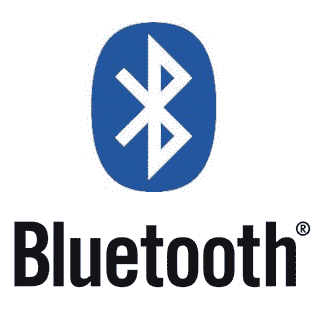
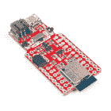
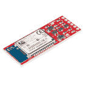
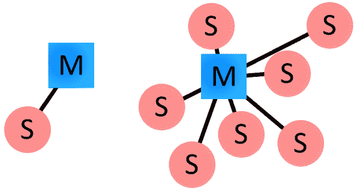
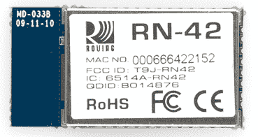
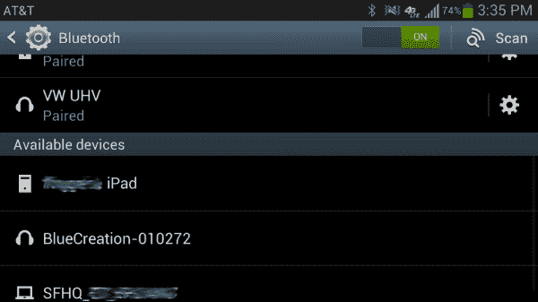
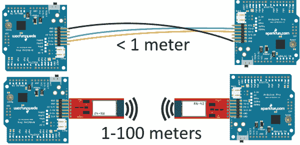
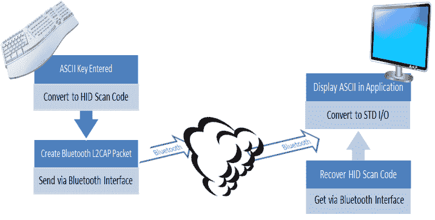
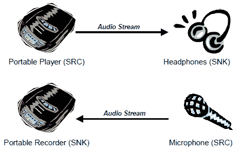
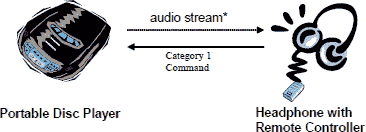

# 蓝牙基础知识

> 原文：<https://learn.sparkfun.com/tutorials/bluetooth-basics>

## 什么是蓝牙？

蓝牙是一种通过 2.4GHz 无线链路发送和接收数据的标准化协议。这是一种安全协议，非常适合电子设备之间的短距离、低功耗、低成本无线传输。

如今，感觉一切都是无线的，蓝牙是无线革命的重要组成部分。你会发现蓝牙嵌入到各种各样的消费产品中，像[耳机](http://en.wikipedia.org/wiki/Handsfree)、[视频游戏控制器](http://en.wikipedia.org/wiki/Wii_Remote)，或者(当然)[牲畜追踪器](http://www.embedded.com/electronics-news/4158444/Bluetooth-aids-livestock-tracking)。

在我们的嵌入式电子黑客世界中，蓝牙是在短距离(<100m). It's perfectly suited as a wireless replacement for [串行通信接口](https://learn.sparkfun.com/tutorials/serial-communication))无线传输相对少量数据的优秀协议。或者你可以用它来制作一个 [DIY HID 电脑键盘](https://www.sparkfun.com/products/11378)。或者，通过[右模块](https://learn.sparkfun.com/tutorials/rn-52-bluetooth-hookup-guide)，它可以用来构建一个自制的无线 MP3 播放器。

本教程旨在提供蓝牙协议的快速概述。我们将研究构成其基础的规范和配置文件，并且我们将回顾蓝牙与其他无线协议的比较。

## 想亲自动手开发蓝牙吗？

我们掩护你！

 

将**添加到您的[购物车](https://www.sparkfun.com/cart)中！**

### [【spark fun Thing Plus-ESP32 WROOM(微-B)](https://www.sparkfun.com/products/15663)

[Out of stock](https://learn.sparkfun.com/static/bubbles/ "out of stock") WRL-15663

SparkFun ESP32 Thing Plus 是开始使用 Espressif 物联网概念的下一步，同时还可以享受所有的便利设施

$22.5010[Favorited Favorite](# "Add to favorites") 48[Wish List](# "Add to wish list")**** 

### [SparkFun Pro nRF52840 迷你蓝牙开发板](https://www.sparkfun.com/products/15025)

[Out of stock](https://learn.sparkfun.com/static/bubbles/ "out of stock") DEV-15025

SparkFun Pro nRF52840 Mini 是 Nordic NRF 52840 的开发板，这是 ARM Cortex-M4 CPU 的强大组合…

1[Favorited Favorite](# "Add to favorites") 30[Wish List](# "Add to wish list") 

### [SparkFun 蓝牙伴侣银色](https://www.sparkfun.com/products/retired/12576)

[Retired](https://learn.sparkfun.com/static/bubbles/ "Retired") WRL-12576

Bluetooth Mate 与我们的 BlueSMiRF 调制解调器非常相似，但它是专门设计用于我们的[Arduino Pros]…

13 **Retired**[Favorited Favorite](# "Add to favorites") 21[Wish List](# "Add to wish list") 

### [SparkFun 蓝牙调制解调器- BlueSMiRF 银色](https://www.sparkfun.com/products/retired/12577)

[Retired](https://learn.sparkfun.com/static/bubbles/ "Retired") WRL-12577

BlueSMiRF Silver 是 SparkFun Electronics 的最新蓝牙无线串行电缆替代品！这个版本的…

15 **Retired**[Favorited Favorite](# "Add to favorites") 26[Wish List](# "Add to wish list")****[See all Bluetooth Products](https://www.sparkfun.com/categories/115)** **### 推荐阅读

*   [串行通信](https://learn.sparkfun.com/tutorials/serial-communication) -蓝牙就像是射频版的串行通信。
*   [十六进制](https://learn.sparkfun.com/tutorials/hexadecimal) -蓝牙设备都有一个唯一的地址，通常以十六进制值表示。

### 建议观看

[https://www.youtube.com/embed/zJqGLWQGyvk/?autohide=1&border=0&wmode=opaque&enablejsapi=1](https://www.youtube.com/embed/zJqGLWQGyvk/?autohide=1&border=0&wmode=opaque&enablejsapi=1)

* * *

**Note:** This tutorial is not about the 10^(th) century .

## 蓝牙的工作原理

蓝牙协议在相同的[免授权 ISM 频段](http://en.wikipedia.org/wiki/ISM_band)中以 2.4GHz 运行，其中还存在 ZigBee 和 WiFi 等 RF 协议。有一套标准化的规则和规范，使其有别于其他协议。如果你有几个小时可以消磨，并且想了解蓝牙的每一个角落，那么查看一下[发布的规范](https://www.bluetooth.org/en-us/specification/adopted-specifications)，否则这里有一个蓝牙特别之处的快速概述。

### 主机、从机和微微网

蓝牙网络(通常称为**微微网**)使用主/从模式来控制设备何时何地可以发送数据。在这种模式下，一个主设备最多可以连接七个不同的从设备。微微网中的任何从设备只能连接到一个主设备。

*Examples of Bluetooth master/slave piconet topologies.*

主节点协调整个微微网的通信。它可以向它的任何从设备发送数据，也可以向它们请求数据。从设备只允许向其主设备发送和从其主设备接收数据。它们不能与微微网中的其他从机通话。

### 蓝牙地址和名称

每一个蓝牙设备都有一个唯一的 48 位地址，通常缩写为 BD_ADDR。这通常以 12 位十六进制值的形式表示。地址的最高半部分(24 位)是组织唯一标识符(OUI ),用于标识制造商。低 24 位是地址中更独特的部分。

这个地址应该在大多数蓝牙设备上可见。比如这个 [RN-42 蓝牙模块](https://www.sparkfun.com/products/10253)上，“MAC 号”旁边印的地址是 000666422152:

该地址的“000666”部分是模块制造商漫游网络的 [OUI。每个 RN 模块将共享这些高 24 位。模块的“422152”部分是设备的唯一 ID。](http://macaddress.es/manufacturers/1536)

蓝牙设备也可以有用户友好的名称。这些通常代替地址呈现给用户，以帮助识别是哪个设备。

设备名称的规则没有那么严格。它们最长可达 248 字节，两个设备可以共享同一个名称。有时，地址的唯一数字可能会包含在名称中，以帮助区分设备。

### 连接过程

在两个设备之间创建蓝牙连接是一个多步骤的过程，包括三个渐进状态:

1.  **查询** -如果两个蓝牙设备完全不了解对方，其中一个必须运行查询来试图**发现**另一个。一个设备发出查询请求，任何侦听此类请求的设备都会用它的地址、可能还有它的名称和其他信息来响应。
2.  **寻呼(连接)** -寻呼是两个蓝牙设备之间形成连接的过程。在启动连接之前，每台设备都需要知道对方的地址(在查询过程中找到)。
3.  **连接** -设备完成寻呼过程后，进入连接状态。连接时，设备可以主动参与，也可以进入低功耗睡眠模式。
    *   **主动模式** -这是常规的连接模式，设备在此模式下主动发送或接收数据。
    *   **嗅探模式** -这是一种省电模式，此时设备不太活跃。它将休眠并只在设定的时间间隔(例如每 100 毫秒)监听传输。
    *   **保持模式** -保持模式是一种临时的省电模式，设备在此模式下会休眠一段时间，然后在这段时间过后返回活动模式。主机可以命令从机保持。
    *   **驻车模式** -驻车是最深度的睡眠模式。主设备可以命令从设备“暂停”，从设备将变为非活动状态，直到主设备告诉它重新唤醒。

### 结合和配对

当两个蓝牙设备对彼此有特殊的亲和力时，它们可以被绑定在一起。结合的设备**在它们足够接近时自动建立连接**。例如，当我启动汽车时，我口袋里的手机会立即连接到汽车的蓝牙系统，因为它们共享一个连接。不需要用户界面交互！

债券是通过一次性的配对过程产生的。当设备配对时，它们共享它们的地址、名称和配置文件，并且通常将它们存储在内存中。他们还共享一个共同的秘密密钥，这使得他们在未来任何时候在一起都能建立联系。

配对通常需要一个**认证过程**，用户必须验证设备之间的连接。认证过程的流程各不相同，通常取决于一台设备或另一台设备的接口能力。有时配对是一个简单的“可行”操作，只需点击一个按钮就可以配对(这对于没有 UI 的设备来说很常见，如耳机)。其他时候配对需要匹配 6 位数字代码。较旧的传统(2.0 版及更早版本)配对流程需要在每台设备上输入一个通用 PIN 码。PIN 码的长度和复杂度可以从四个数字(例如“0000”或“1234”)到 16 个字符的字母数字串不等。

### 电源等级

蓝牙模块的发射功率以及**范围**由其功率等级定义。有三种定义的权力等级:

| 类数 | 最大输出功率(dBm) | 最大输出功率(mW) | 最大范围 |
| 1 类 | 20 dBm | 100 兆瓦 | 100 米 |
| 第二类 | 4 dBm | 2.5 兆瓦 | 10 米 |
| 第三类 | 0 dBm | 1 毫瓦 | 10 厘米 |

一些模块只能在一个功率等级下运行，而其他模块可以改变它们的发射功率。

## 蓝牙模式

蓝牙规范是建立在基本蓝牙标准基础上的附加协议，用于更清楚地定义蓝牙模块传输的数据类型。蓝牙规范定义了技术如何工作，而配置文件定义了技术如何被使用。

蓝牙设备支持的模式决定了它适用于什么应用。例如，免提蓝牙耳机将使用耳机配置文件(HSP)，而任天堂 Wii 控制器将实现人机界面设备(HID)配置文件。要使两个蓝牙设备兼容，它们**必须支持相同的模式**。

让我们来看看一些更常见的蓝牙规范。

### 串行端口配置文件(SPP)

如果你正在用蓝牙替换一个[串行通信接口](https://learn.sparkfun.com/tutorials/serial-communication)(如 RS-232 或 UART)，SPP 是你的选择。SPP 非常适合在两个设备之间发送突发的**数据**。这是更基本的蓝牙规范之一(毕竟蓝牙最初的目的是取代 RS-232 电缆)。

使用 SPP，每个相连的器件都可以发送和接收数据，就像它们之间连接了 RX 和 TX 线路一样。举例来说，两个 Arduinos 可以在不同的房间互相交谈，而不是隔着桌子。

### 人机界面设备(HID)

HID 是支持蓝牙的用户输入设备(如鼠标、键盘和操纵杆)的首选配置文件。它也用于许多现代视频游戏控制器，如 WiiMotes 或 PS3 控制器。

*Example HID interface, from [RN-42-HID](https://www.sparkfun.com/products/10823) [User's Guide](http://cdn.sparkfun.com/datasheets/Wireless/Bluetooth/RN-HID-User-Guide-v1.0r.pdf).*

蓝牙的 HID 配置文件实际上是已经为人类输入 USB 设备定义的 HID 配置文件的重复。正如 SPP 作为 RS-232 电缆的替代品一样，HID 旨在取代 USB 电缆(这是一项更高的任务！).

### 免提模式(HFP)和耳机模式(HSP)

那些让重要的商务人士看起来像自言自语的疯子的蓝牙耳机？这些通常使用耳机模式(HSP)或免提模式(HFP)。

HFP 用于汽车内置的免提音响系统。它在 HSP 的基础上实现了一些功能，允许常见的电话交互(接听/拒绝电话、挂断电话等)。)发生在手机还在口袋里的时候。

### 高级音频分发模式(A2DP)

高级音频分发模式(A2DP)定义了如何将音频从一个蓝牙设备传输到另一个蓝牙设备。HFP 和 HSP 在两个设备之间发送音频，A2DP 是一条单行道，但音频质量可能会高得多。A2DP 非常适合 MP3 播放器和支持蓝牙的立体声系统之间的无线音频传输。

*A2DP example configurations. Image from [A2DP specification](https://www.bluetooth.org/en-us/specification/adopted-specifications) (v1.3).*

大多数 A2DP 模块支持有限的一组音频编解码器。至少他们会支持 SBC(子带编解码器)，他们也可能支持 MPEG-1，MPEG-2，AAC 和 ATRAC。

### A/V 远程控制配置文件(AVRCP)

音频/视频远程控制模式(AVRCP)允许对蓝牙设备进行远程控制。它通常与 A2DP 一起实现，允许远程扬声器告诉音频发送设备快进、倒带等。

*Remote control and audio stream between two devices. Image from [AVRCP specification](https://www.bluetooth.org/en-us/specification/adopted-specifications) (v1.5).*

## 常见版本

自从 1994 年被构思以来，蓝牙一直在不断发展。蓝牙的最新更新，蓝牙 v4.0，刚刚开始在消费电子行业获得牵引力，但以前的一些版本仍然被广泛使用。以下是常见蓝牙版本的概要:

#### 蓝牙 1.2 版

v1.x 版本为未来版本将构建的协议和规范奠定了基础。蓝牙 1.2 版是最新最稳定的 1.x 版本。

与较新版本相比，这些模块相当有限。它们支持高达 1 Mbps(实际上更接近 0.7 Mbps)的数据速率和 10 米的最大范围。

#### 蓝牙 2.1 版+ EDR

蓝牙的 2.x 版本引入了**增强型数据速率(EDR)** ，将数据速率潜力提高到 3 Mbps(实际上更接近 2.1 Mbps)。2007 年发布的蓝牙 v2.1 引入了**安全简单配对(SSP)** ，彻底改革了配对过程。

蓝牙 v2.1 模块还是很常见的。对于低速微控制器来说，2 Mbps 仍然很快，v2.1 给了他们所需要的一切。例如， [RN-42](https://www.sparkfun.com/products/10253) 蓝牙模块在[蓝牙伴侣](https://www.sparkfun.com/products/10393)和 [BlueSMiRF HID](https://www.sparkfun.com/products/10938) 等产品中仍然很受欢迎。

#### 蓝牙 3.0 版+ HS

你认为 3 Mbps 很快？乘以 8，你就有了蓝牙 3.0 版的最佳速度——24 Mbps。不过这个速度可能有点骗人，因为数据实际上是通过 WiFi (802.11)连接传输的。蓝牙仅用于建立和管理连接。

确定 3.0 版设备的最大数据速率可能很棘手。一些设备可能是“蓝牙 3.0+HS”，而其他设备可能被标记为“蓝牙 3.0”。只有那些带有“+HS”后缀的设备才能够通过 WiFi 路由数据并达到 24 Mbps 的速度。“蓝牙 3.0 版”设备仍然被限制在最大 3 Mbps，但它们支持 3.0 标准引入的其他功能，如更好的电源控制和流媒体模式。

#### 蓝牙 4.0 版和蓝牙低能耗

蓝牙 4.0 将蓝牙规范分为三类:经典、高速和低能耗。经典和高速回叫分别为蓝牙版本 2.1+EDR 和 3.0+HS。蓝牙 4.0 真正的佼佼者是**蓝牙低能耗(BLE)** 。

BLE 是蓝牙规范的一次大规模革新，目标是极低功耗应用。它牺牲了范围(50m 而不是 100m)和数据吞吐量(0.27 Mbps 而不是 0.7-2.1 Mbps)来大幅节省功耗。BLE 的目标是依靠电池运行的外围设备，不需要高数据速率或持续的数据传输。智能手表，如 [MetaWatch](https://www.sparkfun.com/search/results?term=metawatch) ，就是这种应用的一个很好的例子。

## 无线比较

蓝牙远不是唯一的无线协议。您可能正在通过 WiFi 网络阅读本教程。或者你甚至玩过 ZigBees 或者 XBees。那么是什么让蓝牙不同于其他无线数据传输协议呢？

我们来对比对比。我们将把 BLE 作为一个独立于传统蓝牙的实体。

| 名字 | 蓝牙经典 | 蓝牙 4.0 低能耗(BLE) | ZigBee | 无线局域网（wireless fidelity 的缩写） |
| IEEE 标准 | 802.15.1 | 802.15.1 | 802.15.4 | 802.11(阿、b、g、n) |
| 频率(千兆赫) | Two point four | Two point four | 0.868, 0.915, 2.4 | 2.4 和 5 |
| 最大原始比特率(Mbps) | 1-3 | one | Zero point two five | 第 11 条(b)款、第 54 条(g)款、第 600 条(n)款 |
| 典型数据吞吐量(Mbps) | 0.7-2.1 | Zero point two seven | Zero point two | 第七条(乙)项、第二十五条(庚)项、第一百五十条(庚)项 |
| 最大(室外)范围(米) | 10(二类)，100(一类) | Fifty | 10-100 | 100-250 |
| 相对功耗 | 中等 | 极低 | 极低 | 高的 |
| 电池寿命示例 | 天 | 几个月到几年 | 几个月到几年 | 小时 |
| 网络规模 | seven | 不明确的 | 64,000+ | Two hundred and fifty-five |

蓝牙并不是所有无线工作的最佳选择，但它确实在短距离**电缆替换**类型的应用中表现出色。它还拥有比竞争对手(特别是 ZigBee)更方便的连接过程。

ZigBee 通常是监控网络(如家庭自动化项目)的好选择。这些网络可能有几十个无线节点，它们只是稀疏地活动着，从不需要发送大量数据。

BLE 结合了传统蓝牙的便利性，并显著降低了功耗。通过这种方式，它可以与 Zigbee 竞争电池寿命。就网络规模而言，BLE 无法与 ZigBee 竞争，但就单个设备到设备的连接而言，它非常具有可比性。

WiFi 可能是这四种无线协议中最熟悉的了。我们都非常熟悉它的最佳用途:互联网(！).它又快又灵活，但也需要很大的能量。对于宽带互联网接入，它将其他协议打得落花流水。

## 资源和更进一步

既然您已经熟悉了蓝牙背后的概念，那么可以考虑查看一些相关教程:

*   RN-52 连接指南-RN-52 是一个蓝牙音频模块，它支持我们在本教程中谈到的所有漂亮的配置文件:HSP/HFP、A2DP、AVRCP 和 SPP。如果您想将无线音频添加到您的项目中，请查看此模块。
*   [BlueSMiRF 连接指南](https://learn.sparkfun.com/tutorials/using-the-bluesmirf)-blues mirf 使用 RN-42 蓝牙模块，简单易用，支持 SPP 模式。如果您想更换串行电缆，请检查此模块。
*   [MetaWatch 拆卸和连接指南](https://learn.sparkfun.com/tutorials/metawatch-teardown-and-arduino-hookup)-[meta watch](https://www.sparkfun.com/search/results?term=metawatch)是一款“智能手表”，它使用蓝牙与智能手机通信并接收来自智能手机的通知。看看这款手表的内部，看看蓝牙模块适合在哪里。或者通过连接到 Arduino 的蓝牙模块来控制手表。

或者，如果您厌倦了蓝牙，但仍对无线技术感兴趣:

*   [ATmega128RFA1 开发板连接指南](https://learn.sparkfun.com/tutorials/atmega128rfa1-dev-board-hookup-guide)-atmega 128 RFA 1 配备了一个射频模块，其工作标准与 ZigBee (802.11.4)相同。如果你想深入了解射频通信领域的细节，请查看这个论坛。
*   [电动 Imp 连接指南](https://learn.sparkfun.com/tutorials/retired---electric-imp-breakout-hookup-guide) -电动 Imp 让连接 WiFi 变得异常简单。遵循本教程，您将拥有一个能够与网页交互的嵌入式模块！

如果你想了解更多关于蓝牙的知识，这里有一些更好的读物:

*[Bluetooth.org 规范](https://www.bluetooth.org/en-us/specification/adopted-specifications)——数千页涵盖了人类已知的每一个蓝牙版本和配置文件的规范。* [Althos 蓝牙教程](http://www.althos.com/tutorial/Bluetooth-tutorial-title-slide.html) -这是一个很好的初学者教程，以幻灯片的形式呈现。

或者看看下面的一些博客帖子来寻找灵感:

 [### 婴儿蓝牙

August 3, 2009](https://www.sparkfun.com/news/282 "August 3, 2009: We found a mini Bluetooth dongle and just had to see what was inside.")[Favorited Favorite](# "Add to favorites") 1 [### 一对牛逼的项目和新品！

February 8, 2010](https://www.sparkfun.com/news/328 "February 8, 2010: It's not about how complex your project is - it's about how clever! Also check out a hacked Kindle and a bunch of new product offerings!")[Favorited Favorite](# "Add to favorites") 0 [### IoTuesday: 3 个简单的 DIY 天线，增加您的 WiFi 和蓝牙范围

February 28, 2017](https://www.sparkfun.com/news/2320 "February 28, 2017: Increase the range on your 2.4GHz IoT devices with these simple antenna hacks.")[Favorited Favorite](# "Add to favorites") 0**