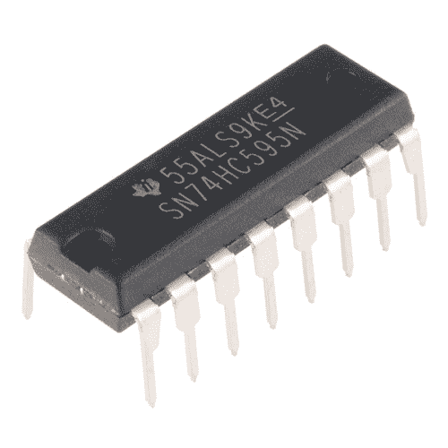
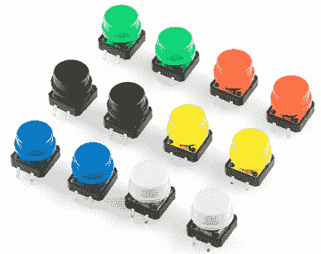
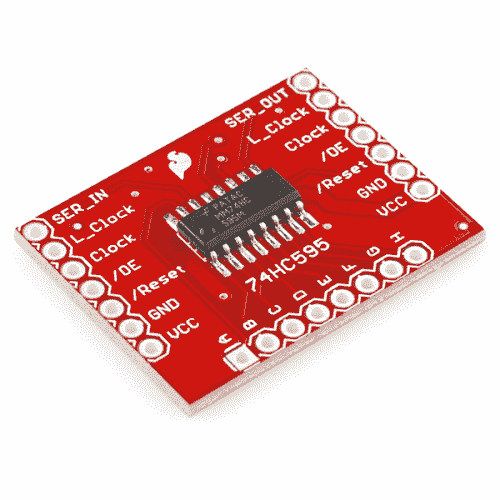
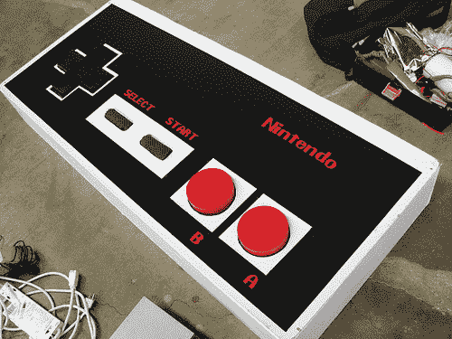
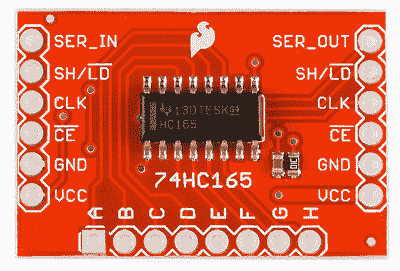
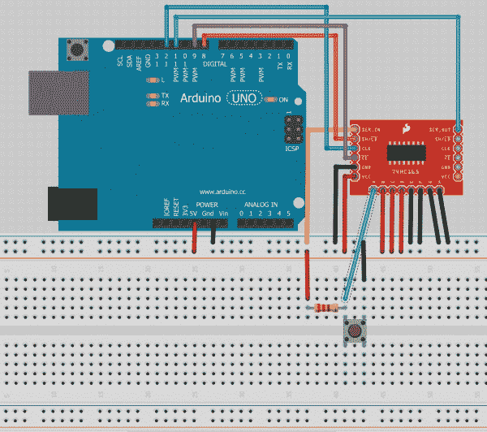
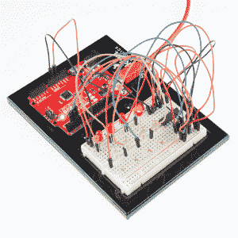

# 移位寄存器

> 原文：<https://learn.sparkfun.com/tutorials/shift-registers>

## 概观

你有没有发现自己想要控制很多 LED 灯？或者只是总体上需要更多的 I/O？那么，本教程将涵盖您需要了解的关于一项技术的基础知识，这项技术将让您做到这一点。它叫做移位寄存器。那到底是什么呢？它们为什么有用？我如何使用它？这些都是我们将在本教程中尝试回答的问题。

[https://www.youtube.com/embed/6BLj9Ak2Djs/?autohide=1&border=0&wmode=opaque&enablejsapi=1](https://www.youtube.com/embed/6BLj9Ak2Djs/?autohide=1&border=0&wmode=opaque&enablejsapi=1)

### 推荐阅读

下面是一些背景材料，你可以考虑在继续之前阅读:

[](https://learn.sparkfun.com/tutorials/serial-communication) [### 串行通信](https://learn.sparkfun.com/tutorials/serial-communication) Asynchronous serial communication concepts: packets, signal levels, baud rates, UARTs and more 100[](https://learn.sparkfun.com/tutorials/binary) [### 二进制的](https://learn.sparkfun.com/tutorials/binary) Binary is the numeral system of electronics and programming...so it must be important to learn. But, what is binary? How does it translate to other numeral systems like decimal?[Favorited Favorite](# "Add to favorites") 51[](https://learn.sparkfun.com/tutorials/how-to-use-a-breadboard) [### 如何使用试验板](https://learn.sparkfun.com/tutorials/how-to-use-a-breadboard) Welcome to the wonderful world of breadboards. Here we will learn what a breadboard is and how to use one to build your very first circuit.[Favorited Favorite](# "Add to favorites") 79[](https://learn.sparkfun.com/tutorials/logic-levels) [### 逻辑电平](https://learn.sparkfun.com/tutorials/logic-levels) Learn the difference between 3.3V and 5V devices and logic levels.[Favorited Favorite](# "Add to favorites") 82[](https://learn.sparkfun.com/tutorials/series-and-parallel-circuits) [### 串联和并联电路](https://learn.sparkfun.com/tutorials/series-and-parallel-circuits) An introduction into series and parallel circuits.[Favorited Favorite](# "Add to favorites") 58

## 什么是移位寄存器？

移位寄存器是一种允许向微控制器添加额外输入或输出的设备。

[](https://www.sparkfun.com/products/13699) 

将**添加到您的[购物车](https://www.sparkfun.com/cart)中！**

 **### [移位寄存器 8 位- SN74HC595](https://www.sparkfun.com/products/13699)

[In stock](https://learn.sparkfun.com/static/bubbles/ "in stock") COM-13699

SN74HC595N 是一款简单的 8 位移位寄存器 IC。

$1.05[Favorited Favorite](# "Add to favorites") 27[Wish List](# "Add to wish list")** **这是通过在并行和串行格式之间转换数据来实现的。微处理器使用串行信息与移位寄存器通信，移位寄存器以并行(多引脚)格式收集或输出信息。

[](https://cdn.sparkfun.com/assets/3/c/d/d/1/518c1d71ce395f5162000000.jpg)*Got a lot of buttons? Consider using a shift register.*

### SIPO 或 PISO 移位寄存器

移位寄存器有两种基本类型，SIPO(串行输入并行输出)或 PISO(并行输入串行输出)。SparkFun 两种类型都有。这里有一辆 SIPO， [74HC595](https://www.sparkfun.com/products/733) ，还有一辆 PISO， [74HC165](https://www.sparkfun.com/products/9519) 。第一种类型，SIPO，适用于控制大量输出，包括 led，而后一种类型，PISO，适用于收集大量输入，如按钮。

SparkFun 也为这两种芯片提供了易于使用的突破版本。如果您需要 8 条以上的额外 I/O 线，您可以通过将分线板的输出端连接到另一块板的右侧，轻松地将多个移位寄存器链接在一起。

[](https://www.sparkfun.com/products/10680) 

将**添加到您的[购物车](https://www.sparkfun.com/cart)中！**

 **### [斯帕克芬移位寄存器分线点- 74HC595](https://www.sparkfun.com/products/10680)

[In stock](https://learn.sparkfun.com/static/bubbles/ "in stock") BOB-10680

这是 74HC595 移位寄存器 IC 的 SOIC 版本的突破。输入数据并锁存，以释放 yo 上的 IO 引脚…

$4.507[Favorited Favorite](# "Add to favorites") 18[Wish List](# "Add to wish list")** **## 为什么要移位？

移位寄存器通常用于节省微控制器上的引脚。每个微控制器的通用输入和输出(GPIO)引脚数量有限。

如果一个项目需要控制 16 个 led，通常需要 16 个微控制器引脚。如果您没有 16 个可用的 I/O 引脚，这就是移位寄存器派上用场的地方。通过两个移位寄存器串联，我们可以只用 4 个 I/O 引脚完成控制 16 个 LED 的任务。这是一个很大的区别，你可以节省更多的引脚更多的移位寄存器链接在一起。

[](https://cdn.sparkfun.com/assets/d/3/6/4/e/518c1f67ce395f4962000003.jpg)*[Sparkfun's large NES controller](https://www.sparkfun.com/tutorials/35).*

使用移位寄存器收集输入的真实例子是最初的任天堂控制器。NES 的主微控制器需要从控制器获取按钮按压，它使用移位寄存器来完成这项任务。

## 例子

### 硬件连接

我们将使用 [74HC165 分线板](https://www.sparkfun.com/products/11512)和 [Arduino Uno](https://www.sparkfun.com/products/11021) 来展示如何在这个例子中实现并行输入到串行输出。

[](https://cdn.sparkfun.com/assets/b/0/1/9/3/518c21dbce395f2962000000.jpg)*74HC165 breakout reference for the pinout.*

一个 8 位移位寄存器需要 4 行微控制器。一个用于为数据传输计时的时钟，一个用于使能时钟，一个用于加载/锁存/移位位，一个用于串行数据传输。

[](https://cdn.sparkfun.com/assets/1/9/2/5/3/5193b6e9ce395f5259000001.jpg)*Fritzing wiring diagram.*

将时钟(CLK)连接到引脚 12，将时钟使能( CE )连接到引脚 9。时钟设置移位的频率，而时钟使能线允许时钟信号传播到移位电路。

将换档/负载(SH/ LD )连接至引脚 8。load 引脚变为低电平时，移位寄存器会获取 8 个输入引脚(A-H)的当前状态。引脚 A-H 可以连接到某种类型的输入，如按钮、开关或数字晶体管电路。如果您正在测试它们，建议直接将它们连接到电源或地，以确保一切正常工作。为了这个例子，我将用一个上拉电阻将一个连接到一个按钮，其余的连接到电源或地。

将串行输出(SER_OUT)连接到引脚 11。此引脚是我们从移位寄存器接收串行信息的地方。此外，将串行输入(SER_IN)连接到地。如果将多个移位寄存器链接在一起，串行输入将连接到最后一个寄存器的串行输出。线中的第一个寄存器仍将其串行输入引脚接地，而链中的最后一个寄存器将其串行输出连接回微处理器，而不是另一个移位寄存器。

不要忘记连接电源( **2V-6V** )和地线。一切就绪后，让我们来看看固件。

### 固件

下面是代码功能的简要概述。它首先初始化我们连接到输出的所有引脚，但接收串行信息的引脚除外。我们将时钟和 shift 引脚设置为数据手册所述的初始状态(高电平)。为了读取引脚 A-H 的状态，我们需要告诉移位寄存器捕捉引脚的状态。为此，我们将 load 引脚暂时拉低(5 微秒)。载入引脚后，我们确保其余引脚处于数据手册所述的起始状态，并使用 Arduino `shiftIn`函数将所有 8 个 A-H 引脚值拉入一个称为 incoming 的字节。这些值清晰地打印在串行终端上。然后它等待并重复。如果你像我们上面那样连接管脚，测试你的硬件是否正常工作应该很容易。

代码如下:

```
language:cpp
// HARDWARE CONNECTIONS
// Connect the following pins between your Arduino and the 74HC165 Breakout Board
// Connect pins A-H to 5V or GND or switches or whatever
const int data_pin = 11; // Connect Pin 11 to SER_OUT (serial data out)
const int shld_pin = 8; // Connect Pin 8 to SH/!LD (shift or active low load)
const int clk_pin = 12; // Connect Pin 12 to CLK (the clock that times the shifting)
const int ce_pin = 9; // Connect Pin 9 to !CE (clock enable, active low)

byte incoming; // Variable to store the 8 values loaded from the shift register

// The part that runs once
void setup() 
{                
  // Initialize serial to gain the power to obtain relevant information, 9600 baud
  Serial.begin(9600);

  // Initialize each digital pin to either output or input
  // We are commanding the shift register with each pin with the exception of the serial
  // data we get back on the data_pin line.
  pinMode(shld_pin, OUTPUT);
  pinMode(ce_pin, OUTPUT);
  pinMode(clk_pin, OUTPUT);
  pinMode(data_pin, INPUT);

  // Required initial states of these two pins according to the datasheet timing diagram
  digitalWrite(clk_pin, HIGH);
  digitalWrite(shld_pin, HIGH);

}

// The part that runs to infinity and beyond
void loop() {

  incoming = read_shift_regs(); // Read the shift register, it likes that

  // Print out the values being read from the shift register
  Serial.println("\nThe incoming values of the shift register are: ");
  Serial.print("ABCDEFGH : ");
  print_byte(incoming); // Print every 1 and 0 that correlates with A through H
  //Serial.println(incoming,BIN); // This way works too but leaves out the leading zeros

  delay(2000); // Wait for some arbitrary amount of time

}

// This code is intended to trigger the shift register to grab values from it's A-H inputs
byte read_shift_regs()
{
  byte the_shifted = 0;  // An 8 bit number to carry each bit value of A-H

  // Trigger loading the state of the A-H data lines into the shift register
  digitalWrite(shld_pin, LOW);
  delayMicroseconds(5); // Requires a delay here according to the datasheet timing diagram
  digitalWrite(shld_pin, HIGH);
  delayMicroseconds(5);

  // Required initial states of these two pins according to the datasheet timing diagram
  pinMode(clk_pin, OUTPUT);
  pinMode(data_pin, INPUT);
  digitalWrite(clk_pin, HIGH);
  digitalWrite(ce_pin, LOW); // Enable the clock

  // Get the A-H values
  the_shifted = shiftIn(data_pin, clk_pin, MSBFIRST);
  digitalWrite(ce_pin, HIGH); // Disable the clock

  return the_shifted;

}

// A function that prints all the 1's and 0's of a byte, so 8 bits +or- 2
void print_byte(byte val)
{
    byte i;
    for(byte i=0; i<=7; i++)
    {
      Serial.print(val >> i & 1, BIN); // Magic bit shift, if you care look up the <<, >>, and & operators
    }
    Serial.print("\n"); // Go to the next line, do not collect $200
} 
```

以下是输出示例:

```
language:text
The incoming values of the shift register are: 
ABCDEFGH : 11110000 
```

现在，尝试将每个输入连接到按钮，或者在组合中添加另一个移位寄存器。如果你把更多的链接在一起，你将不得不稍微修改代码，加载一次，然后在再次加载之前为每个移位寄存器做一次`shiftIn`。

## 资源和更进一步

好了，现在你知道当你的 I/O 线不够用的时候，你需要使用什么样的硬件了。希望本教程已经帮助您将更多的输入连接到您的项目。

再找一个例子？检查这个项目使用的移位寄存器菊花链与 Teensy:

[](https://www.sparkfun.com/news/2125 "June 23, 2016: Demonstrating a Teensy Audio-based drum machine.") [### 今日英语:青少年热潮

June 23, 2016](https://www.sparkfun.com/news/2125 "June 23, 2016: Demonstrating a Teensy Audio-based drum machine.")[Favorited Favorite](# "Add to favorites") 1

在我们的 SparkFun 发明人套件的[电路 13 中也有一个很好的 Arduino 示例:](https://learn.sparkfun.com/tutorials/sik-experiment-guide-for-arduino---v33/experiment-14-using-a-shift-register)

[](https://learn.sparkfun.com/tutorials/sik-experiment-guide-for-arduino---v33/experiment-14-using-a-shift-register)

如果你对这些设备如何工作感到好奇，我建议你学习一些数字逻辑，最终你会学习一种叫做[触发器](http://en.wikipedia.org/wiki/Flip-flop_%28electronics%29)的设备，这是这些设备如何工作的关键。还可以考虑查看数据表中的时序图，以了解轮班期间发生的情况。享受探索！

您还可以探索 SparkFun Electronics 的其他教程:

[](https://learn.sparkfun.com/tutorials/resistors) [### 电阻](https://learn.sparkfun.com/tutorials/resistors) A tutorial on all things resistors. What is a resistor, how do they behave in parallel/series, decoding the resistor color codes, and resistor applications.[Favorited Favorite](# "Add to favorites") 57[](https://learn.sparkfun.com/tutorials/capacitors) [### 电容器](https://learn.sparkfun.com/tutorials/capacitors) Learn about all things capacitors. How they're made. How they work. How they look. Types of capacitors. Series/parallel capacitors. Capacitor applications.[Favorited Favorite](# "Add to favorites") 84[](https://learn.sparkfun.com/tutorials/integrated-circuits) [### 集成电路](https://learn.sparkfun.com/tutorials/integrated-circuits) An introduction to integrated circuits (ICs). Electronics' ubiquitous black chips. Includes a focus on the variety of IC packages.[Favorited Favorite](# "Add to favorites") 46[](https://learn.sparkfun.com/tutorials/how-to-read-a-schematic) [### 如何阅读原理图](https://learn.sparkfun.com/tutorials/how-to-read-a-schematic) An overview of component circuit symbols, and tips and tricks for better schematic reading. Click here, and become schematic-literate today 112****