# 使用 GitHub 与 SparkFun 分享

> 原文：<https://learn.sparkfun.com/tutorials/using-github-to-share-with-sparkfun>

## 介绍

2013 年初，SparkFun 决定通过 GitHub 分享我们产品的所有代码和设计文件。虽然我们一直努力提供尽可能多的产品信息(包括完整的源文件；毕竟，我们**和**都是关于开源的！)，在过去，这是一个非常单向的渠道。我们的客户可以看到源代码，下载它，并随心所欲地使用它，但是他们还没有(容易的)方法与我们(以及，通过扩展，与社区的其他人)共享更改。

通过将我们的产品来源转移到 GitHub，我们希望改变这种情况。显然，我们拥有的产品数量意味着将它们迁移到 GitHub 是一个缓慢的过程；事实上，我们并没有真的想把我们所有的旧产品都搬过来。新产品(无论如何都是我们自己设计的)总是在 GitHub repo 中发布，该 repo 至少包含产品的源文件，很可能包含示例代码、入门信息，以及一个(经过策划但开放的)wiki，该 wiki 可用于与其他用户交换关于产品的信息。

### git 是什么？

Git 是一个源代码控制包，最初由 Linus Torvalds 开发，用于跟踪 Linux 内核开发过程中的变化。它旨在通过允许本地存储的存储库与远程存储的主副本同步来简化项目协作。

通常情况下，选择源代码控制包往往是非常个人化和主观的事情。我们选择 git(和 GitHub)是因为它们以合理的价格为我们使用的所有工具提供了良好的支持，并且我们的客户可以免费使用它们来与我们进行交互。

### 那么 GitHub 是什么呢？

[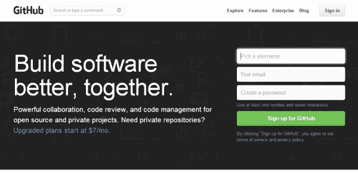](https://cdn.sparkfun.com/assets/0/1/c/3/a/51e6b711ce395fb43c000000.png)

GitHub 最基本的功能是基于 git 源代码控制包的基于 web 的协作工具。它允许多个用户访问 git 项目(称为“存储库”)，跟踪变更，管理修订，以及合并彼此的不同版本。

git 和 GitHub 之间的界限有时会很模糊，直到您习惯了这些工具。一般来说，命令行上发生的事情都是使用 git 工具，GitHub 的交互会通过网页接口来完成。

### 推荐阅读

总的来说，本教程并不是要让你快速掌握如何使用 git——它实际上只是一个循序渐进的指南，向你展示如何在 SparkFun 资源库中做出改变，并与我们分享这些改变。如果你想学习更多关于 git 和 GitHub 的知识，我们有一个很棒的关于 GitHub 的教程。Git 是一个非凡的工具，即使你没有合作。一旦你掌握了它的窍门，它超级容易使用，而且功能极其强大。

## 入门指南

在本教程中，我们将使用 git 的命令行工具。虽然可能感觉有点过时，但是 git 命令行界面有几个重要的优点:

*   命令行界面是真正多平台的。在 Mac、PC 或 Linux 机器上遵循这些指示将会产生相同的结果。
*   命令行界面稳定。现在有很多基于 gui 的界面，并且它们会定期变化。甚至官方的 GitHub gui 也相对频繁地变化。
*   命令行界面是可预测的。它不会像某些图形界面那样做你没有要求它做的事情。

### 安装 GitHub 客户端

访问 [GitHub 网站](https://github.com/)，如果你还没有账户，注册一个，然后[安装客户端](https://help.github.com/articles/set-up-git)。在这里我就不赘述这么做的细节了，因为他们的网站上有更好的说明。去吧，把这个搞定；我会等的。

完成安装后，打开 Git Shell 窗口。同样，我会让您按照他们的指示来做这件事。我使用的是 Windows 7，但是无论你使用的是哪种操作系统，命令行窗口的外观都应该非常相似。不管细节如何(例如，您看到的命令行提示符)，git 命令的行为应该是相同的。

一旦你打开了外壳，继续输入“`git`”并按回车键。结果应该是这样的:

[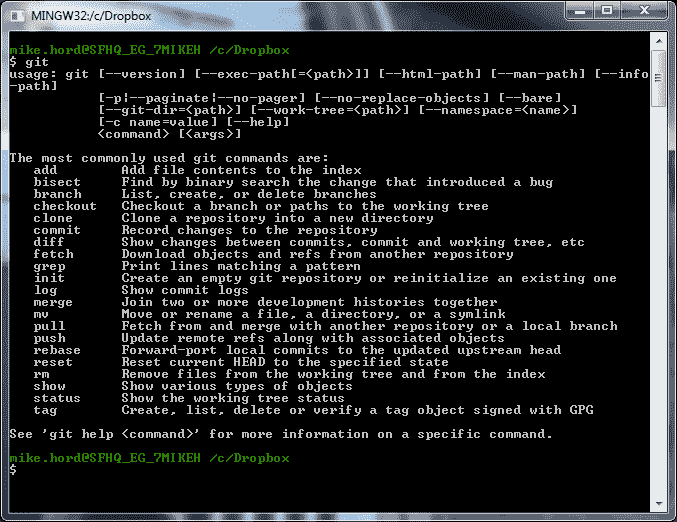](//cdn.sparkfun.com/assets/e/7/2/6/7/512fe383ce395fc331000002.png)

如果您没有看到命令摘要，那么您使用了错误的 shell。确保您启动了一个 Git Shell，它应该与 Git 一起安装。

不要太担心这些命令。我们真的只是关心您是否处于开始使用 git 的正确位置。

## 运行存储库

现在我们已经安装了我们的客户端，我们需要获取我们想要对其进行更改的存储库。在这个例子中，我们将使用另一个 GitHub 教程的[库。](https://github.com/sparkfun/Github_Tutorial)

### 全球分叉...

第一步是将存储库从 SparkFun 的帐户转到您自己的帐户。虽然有其他方法可以获取存储库的副本并使用它，但是 forking 是首选的方法，因为它使得稍后提交 pull 请求(通知原始所有者您有想要包含的变更)更加容易。

[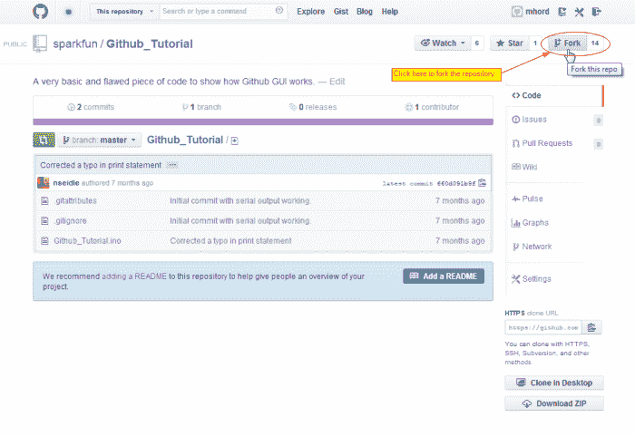](https://cdn.sparkfun.com/assets/1/c/c/5/a/51e6afb0ce395f176a000000.png)

一旦您进入存储库页面，请查找“Fork this repo”按钮。你可以在上图中看到它；分叉是 GitHub 的核心功能，因此，即使界面略有变化，您也应该能够找到它。单击按钮，您会看到类似这样的内容:

[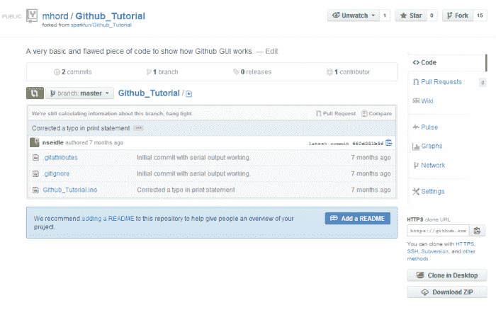](https://cdn.sparkfun.com/assets/8/8/9/d/4/51e6afb0ce395fed6f000000.png)

看起来就像旧版本，不是吗？不过，如果你注意到的话，账户名称是不同的——现在是在我的账户中，而不是在 SparkFun 账户中。

### ...本地编码

现在我们需要制作一个本地副本。虽然你可以直接在 GitHub 上编辑简单的文本文件，但是有理由认为你的大部分工作将在本地终端上完成。选择一个位置来存储您将要使用的文件(我将我的文件存储在我的 DropBox 文件夹中的一个名为“项目”的文件夹中；git 用 DropBox 玩**非常**好！).以下是将这些文件从 GitHub 下载到您的本地计算机并存储在您选择的目录中的一系列命令:

让我们一次处理一个命令:

*   `cd projects` - **c** 焊割 **d** 易地“项目”。这是我保存我的项目的地方。
*   `git clone https://github.com/mhord/Github_Tutorial.git` -告诉 git 您想要**克隆**位于这个地址的存储库。这个地址是区分大小写的，如果不正确的话，git 会窒息。克隆创建了存储库的一个副本，并通过 push 和 pull 链接返回到 GitHub 上的原始存储库。我们一会儿会谈到这意味着什么。
*   `cd Github_Tutorial/` - **c** 汉格**d**I 目录到“Github_Tutorial”。无论何时使用这个存储库，您都需要在这个目录中。
*   `ls` - **l** i **s** t 目录中的文件。
*   `ls -a` - **l** i **s** t *当前目录中的所有*文件。带有“.”前缀的文件和文件夹通常不会在您键入“ls”时显示，因此您需要使用-a 开关来查看它们。

的。git 目录包含 git 发挥其魔力所需的所有“底层”东西。永远不要弄乱它。。gitattributes 包含一些簿记信息，告诉 git 如何处理某些文件类型；你现在真的不需要担心它，因为它不是你要修改的东西，也不是在所有的库中都能找到。。gitignore 是一个文本文件，告诉 git 在提交更改时应该跳过哪些文件。您可能想要排除的文件的一个很好的例子是。o 文件，或者。b#x 和。编辑电路板布局或原理图时，EAGLE 作为备份创建的 s#x 文件。

其他文件应该是不言自明的——它们是“肉”,是您真正感兴趣编辑的东西。

## 承诺、推动和拉动

现在你已经有了一个本地副本和一个 GitHub 帐户副本，为了与 SparkFun 合作，你需要知道四件事:

*   **提交**——提交是在存储库中记录变更的过程。可以把它看作是项目当前状态的快照。提交在本地完成。
*   **Push**——Push 将最近的提交历史从您的本地存储库发送到 GitHub。如果只有您一个人在使用存储库，那么推送就相当简单。如果有其他人正在访问存储库，您可能需要在推送之前进行拉取。
*   **Pull**——Pull 从 GitHub 存储库中抓取任何变更，并将它们合并到您的本地存储库中。
*   同步 -同步就像拉，但是它不是连接到你的 GitHub 副本，而是回到原始存储库并带来任何变化。一旦你同步了你的存储库，你需要把这些改变推回到你的 GitHub 账户。

### 犯罪

将变更返回给我们的第一步是将它提交到您的本地存储库中。看看这个命令序列:

[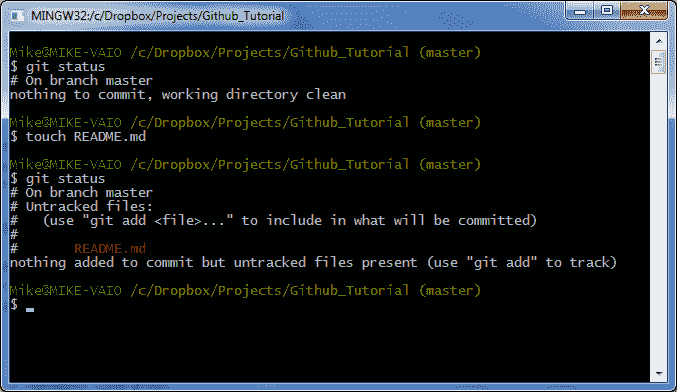](https://cdn.sparkfun.com/assets/9/f/d/5/4/51e6afb0ce395f1071000000.png)

同样，一次一个命令:

*   `git status` -检查存储库的当前状态。这告诉你很多事情；目前，它告诉您在您的存储库中没有任何未提交的变更。
*   `touch README.md` -创建一个自述文件。的。md 后缀表示文件将在 [Markdown](http://en.wikipedia.org/wiki/Markdown) 中格式化，这在 GitHub 网站上被广泛用于格式化。
*   相同的命令，第二次。这一次，您可以看到有一个新文件，但它是“未跟踪的”。这意味着它不会包含在提交中。您需要先添加它。

[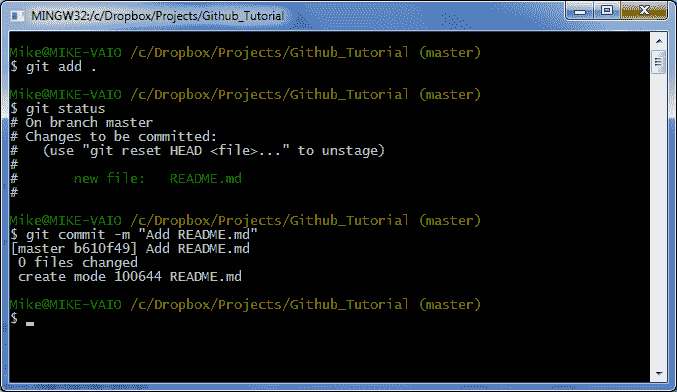](https://cdn.sparkfun.com/assets/8/f/c/6/e/51e6afb0ce395ffd70000000.png)

*   `git add .` -将所有未跟踪的文件添加到存储库中(至少是那些没有被忽略的未跟踪的文件。gitignore 文件)。当然，您可以通过用文件名替换`.`来单独添加文件。
*   `git status` -现在 README.md 文件显示为要提交的新文件。
*   `git commit -m "Add README.md"` -提交最近的更改。`-m`开关允许您输入一个简短的双引号提交消息。省略该开关将导致 git 打开一个文本编辑器，以便您可以输入更长的消息；完成后，保存并关闭文本编辑器。

### 推

推送会将您的更改上传到 GitHub，这样就可以与世界其他地方分享了。它还可以防止数据丢失。

[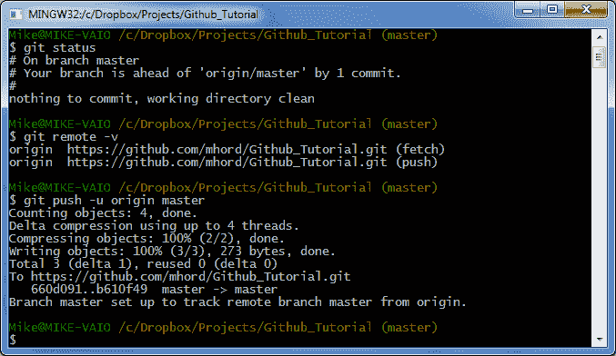](https://cdn.sparkfun.com/assets/b/f/d/a/3/51e6b623ce395f762a000000.png)

*   我们的状态告诉我们没有本地更改挂起，但是远程是一个提交。这实际上并不是对照远程存储库进行检查，只是让我们知道自上次推送以来我们已经提交了多少次。
*   看看我们的远程目标在哪里。当我们开始同步到原始存储库时，我们将稍后再讨论这个问题。
*   `git push -u origin master` -将 branch master 中的更改(为了使本教程简单起见，我们将跳过分支)推送到远程位置原点，并记住设置(`-u`)。

### 拉

“拉”与“推”相反——它从远程位置检索变更，并将它们应用到您的本地存储库中。你大概不会做那么多；这在团队环境中更有用，在团队环境中，不止一个人向一个存储库提交变更。

[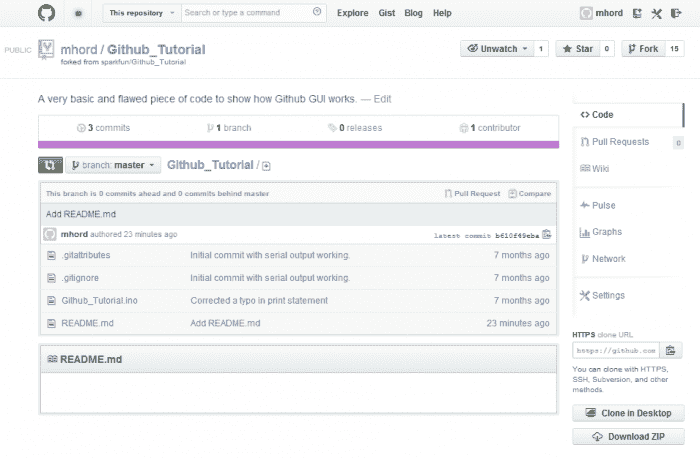](https://cdn.sparkfun.com/assets/a/0/a/c/8/51e6afb0ce395ff36f000000.png)

再次访问存储库页面；你会看到，自从我们把它推回 GitHub 后，README.md 文件现在就在文件列表中了。我们可以在 GitHub 上更改该文件中的文本，然后将更改内容下载到我们的本地存储库中。首先单击文件名链接。这会给你这个页面:

[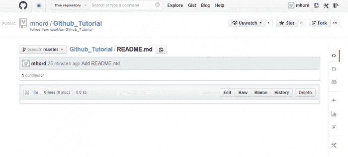](https://cdn.sparkfun.com/assets/b/b/c/3/2/51e6afb0ce395fd46f000001.png)

因为我们在创建文件后没有在文件中放入任何东西，所以页面上什么也没有。您可以通过单击“编辑”按钮向文件中添加内容:

[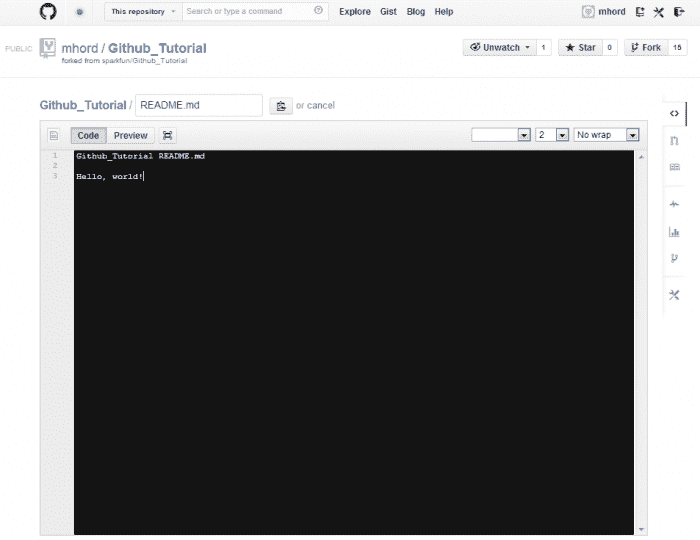](https://cdn.sparkfun.com/assets/7/1/6/6/b/51e6afb0ce395f0971000000.png)

在页面底部，您会发现一个提交窗口，允许您输入描述、扩展描述并提交更改。

[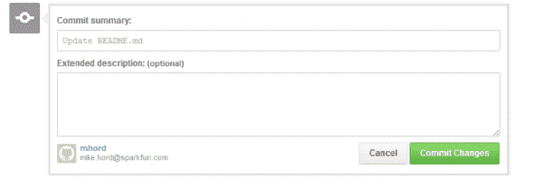](https://cdn.sparkfun.com/assets/0/6/6/0/1/51e6afb0ce395f0771000000.png)

现在，您已经在服务器上做了一个没有反映在本地存储库中的更改，我们需要将其删除。

[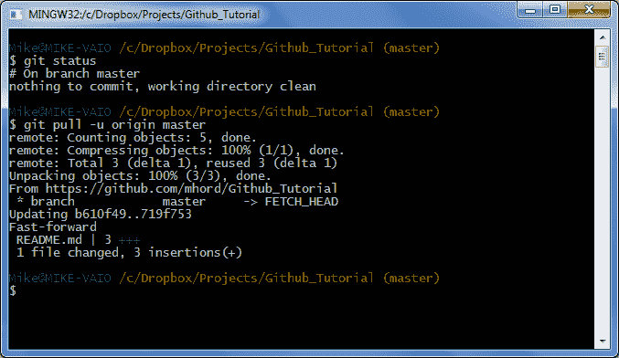](https://cdn.sparkfun.com/assets/0/c/b/8/4/51e6afb0ce395fba6b000000.png)

*   `git status` -注意，即使我们**知道**在服务器上有差异，git 状态也不会反映出来，因为它只给我们本地存储库的状态。
*   语法与 push 相同，但变化方向相反。

此时，我们的本地存储库与 GitHub 存储库是同步的。但是原始存储库呢？如果那里发生了一些变化，我们希望将这些变化带入我们的副本(本地和 GitHub)中，该怎么办？

## 与原始存储库同步

同步是从原始远程存储库中获取更改，并将其引入本地存储库的过程，这样您就可以确保在原始存储库的最新版本上进行更改。因为你不能像我一样在 SparkFun GitHub 页面上更改目录，所以你只能跟着做——不对原始存储库做任何更改，同步是没有意义的。

我对存储库中的一个文件做了一个小小的更改，所以现在我们有了一个相当常见的场景:大多数存储库都匹配，但是我有一个新文件要发送到 SparkFun，SparkFun 有一些我需要包含的更改。

### 添加远程存储库

在将它拖到本地存储库之前，您需要将原始存储库的信息添加到本地存储库中。下面是如何做到这一点:

[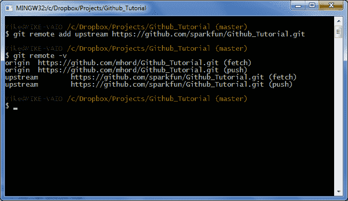](https://cdn.sparkfun.com/assets/2/5/f/1/2/51e6afb0ce395ffd6c000000.png)

*   `git remote add upstream https://github.com/sparkfun/Github_Tutorial.git` -添加一个远程端点来获取代码差异。
*   你可以在这里看到我们现在有两个不同的遥控器接口:我们的个人副本和 SparkFun 的副本。这将允许我们用 SparkFun 的方式保持我们的副本是最新的，就像我们用自己的远程存储库一样。

[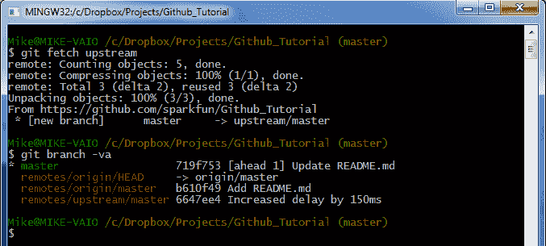](https://cdn.sparkfun.com/assets/a/4/0/9/e/51e6afb1ce395f0071000000.png)

*   `git fetch upstream` - fetch 的工作方式类似于 pull，除了它为输入的数据创建一个新的分支，而不是试图立即合并它。这是一个“安全”的操作；你需要手动合并输入的数据。
*   `git branch -va`-`-va`开关显示所有本地和远程分支。分支就像它听起来的那样——变更日志从原始日志中分支出来，并且对分支的变更独立于对其他分支的变更进行跟踪。

[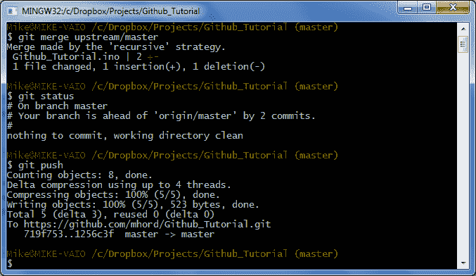](https://cdn.sparkfun.com/assets/d/0/b/3/3/51e6afb0ce395ff56f000001.png)

*   `git merge upstream/master` - merge 试图协调两个分支之间的差异，将名为(在本例中为“上游/主”)的分支中的更改引入当前活动的分支(因为我们没有更改它，“主”)。对于大多数简单的更改，合并将自动完成。如果没有，[这个网站](http://twobitlabs.com/2011/08/install-diffmerge-git-mac-os-x/)有关于将外部合并工具与 git 集成的信息，这可能是一个好主意，因为 git 的内部合并工具还有很多需要改进的地方。
*   我们又领先于我们的遥控器了，因为我们将变更从主存储库拉入了本地存储库。这意味着我们需要...
*   现在，我们的 GitHub 存储库随着 SparkFun 主副本的最新变化而更新。但是我们所做的改变呢？我们怎么把它们带到 SparkFun 仓库？

至此，您已经拥有了派生一个存储库、对其内容进行更改并提交更改、用 SparkFun 的主副本保持更新并将其推送到 GitHub 所需的所有工具和知识。只剩下一件事:提交一个 pull 请求，要求 SparkFun 将您的更改包含在我们的主存储库中。

## 拉取请求

“拉取请求”这个术语对一些人来说有点混乱。毕竟，我不是要求将文件推送到您的存储库吗？事实上，不，您是在请求主存储库的所有者从**您的**存储库中提取文件。虽然这种区别看起来是理论上的，但要记住这一点:你是在主动请求其他人给他们的工作流程添加一些东西，所以不要期望立即得到回应。

### 拉请求礼仪

正如我上面提到的，一个拉取请求，即使是一个非常重要且结构良好的请求，也是要求别人做工作。为了让你的“拉”请求更有可能被接受，你可以做以下事情，让接受请求的人尽可能轻松地完成这项工作:

*   **保持简单**:不要完全重写一个库并期望我们接受拉请求。我们根本没有时间去验证这么大的东西。
*   **保持最新**:如果你的库已经过时，不要提交拉请求。如果我们必须通过几十个由年龄引起的不相关的变更来找出你提交的是哪一个变更，我们可能会拒绝拉取请求。
*   **不要被冒犯**:如果我们不接受你的拉动请求，请不要往心里去。我们会让您知道我们拒绝它的原因，如果手动包含它们比接受拉请求更容易，我们还是会做出建议的更改。

### 提交拉取请求

我们现在处于一个很好的位置，可以遍历一个拉请求:我们的存储库中有一些变化，我们想发送给 SparkFun 存储库。

[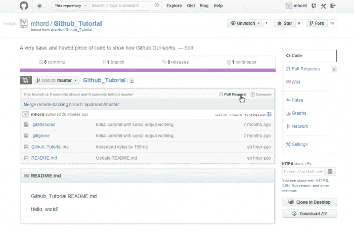](https://cdn.sparkfun.com/assets/b/e/7/3/5/51e6afb0ce395fec6f000000.png)

点击“提取请求”按钮。同样，界面可能已经改变，但按钮仍然会在那里，在某个地方。

[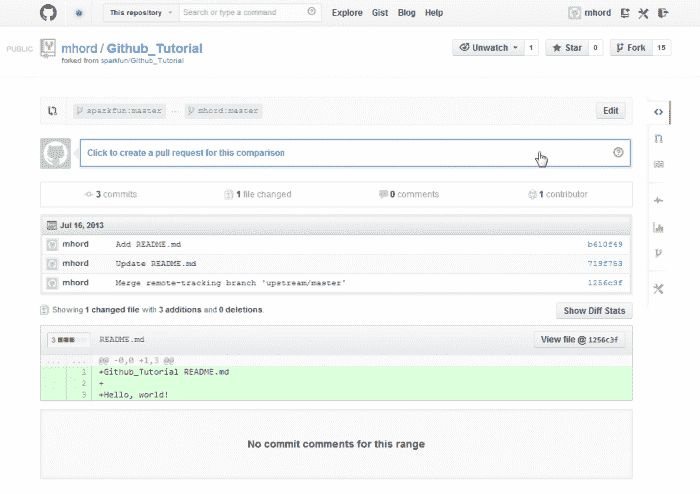](https://cdn.sparkfun.com/assets/7/5/6/8/9/51e6afb0ce395ff870000000.png)

单击“单击以创建此比较的拉式请求”按钮。这将打开这个表单:

[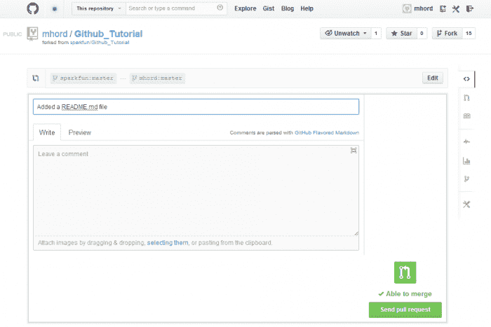](https://cdn.sparkfun.com/assets/b/b/9/4/b/51e6afb0ce395f0b71000001.png)

输入标题和描述。要彻底。如果右下角的图标指示可以自动合并拉取，那么您的拉取请求被接受的几率会大大增加。

点击“发送拉动请求”按钮提交您的拉动请求。你完了！剩下的就是我们接受(或拒绝)拉请求。

感谢您抽出时间来投稿！

## 资源和更进一步

Git 和 GitHub 是非常强大的工具，在开源硬件社区中获得了广泛的支持。如果您有兴趣了解更多，您可以参考以下资源:

*   Code School 的 GitHub 有一个很棒的介绍性的，交互式的教程来学习 git 和 GitHub。
*   GitHub 的帮助页面 -学习它，使用它，喜欢它
*   [GitHub“新兵训练营”](https://help.github.com/categories/54/articles) - GitHub 官方“入门”页面
*   SparkFun 的 GitHub 网站