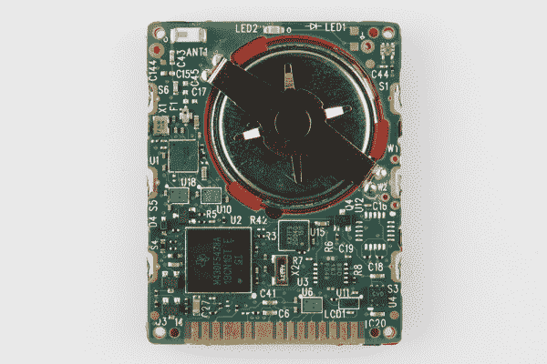
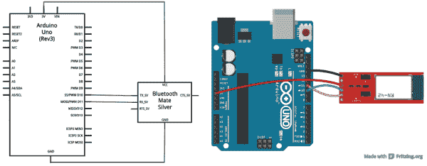

# MetaWatch 拆卸和 Arduino 连接

> 原文：<https://learn.sparkfun.com/tutorials/metawatch-teardown-and-arduino-hookup>

## 介绍

MetaWatch 是最新“智能手表”热潮的一个新的开源入口。这是一块内置微处理器和蓝牙控制器的数字手表。它可以与你的智能手机连接，显示天气预报、电子邮件提醒、会议通知或正在播放的音乐(哦，还有时间和日期)。

SparkFun 有一个黑色[和白色](https://www.sparkfun.com/products/12005)[的元手表开发工具包，其中包括手表、程序员/充电夹和使用 TI 的](https://www.sparkfun.com/products/12004) [Code Composer Studio](http://www.ti.com/tool/ccstudio) 的许可证。

[](https://www.sparkfun.com/products/12005)

MetaWatch 的标准用例当然非常酷。在手腕上显示通知、天气和音乐更新是迈向未来的又一步！但是我们还能用这个可破解的小设备做什么呢？在本教程中，我们将回顾元手表的一些基础知识。那我们就把它拆了，看看它的内脏！然后我们会把它放回一起，试着用...还有什么...一个 Arduino。

[](https://cdn.sparkfun.com/assets/4/1/0/8/6/520be03c757b7f53078f4015.png)

### 所需材料

本教程的 Arduino 部分将结合 Arduino 板和蓝牙模块。

*   **Arduino 板卡**可以是任何兼容 Arduino 的板卡- [RedBoard](https://www.sparkfun.com/products/11575) 、 [Uno](https://www.sparkfun.com/products/11021) 、 [Pro Mini](https://www.sparkfun.com/products/11113) 等。
*   [BlueSMiRF Silver](https://www.sparkfun.com/products/10269) 用于充当 Arduino 和 MetaWatch 之间的蓝牙接口。
*   你还需要**将电线或接头**焊接到 BlueSMiRF，以便将其连接到 Arduino。

当然，你还需要一块你喜欢的风格/颜色的元手表([白框](https://www.sparkfun.com/products/12004)或[黑框](https://www.sparkfun.com/products/12005))。

### 推荐阅读

如果你只是对查看 MetaWatch 的使用技巧或拆卸感兴趣，请继续。如果你想用 Arduino/BlueSMiRF 组合来控制它，请考虑在继续之前阅读一些教程:

*   什么是 Arduino？
*   [串行通信](https://learn.sparkfun.com/tutorials/serial-communication)
*   [BlueSMiRF 连接指南](https://learn.sparkfun.com/tutorials/using-the-bluesmirf)
*   [如何焊接](https://learn.sparkfun.com/tutorials/how-to-solder-through-hole-soldering)

## 使用技巧

在拆下你的手表或连接 Arduino 之前，我们建议你检查一下当它连接到你的手机时能做什么。有适用于[安卓](https://play.google.com/store/apps/details?id=com.metawatch.mwm&hl=en)和 [iOS](https://itunes.apple.com/us/app/metawatch-manager-for-ios/id557219641?mt=8) 手机的**应用**。

玩吧。感受一下它是如何工作的。请注意，有四个“空闲模式”页面可供您循环浏览。全都检查出来！

玩手表可能会产生一个新的项目想法。无论你想编写自己的手机应用程序，定制手表的固件，还是连接不同的蓝牙设备，我们都鼓励每个人发现一种新的、酷的方式来与手表互动。

### 充电，连接显影夹

开发人员剪辑包括两个目的:充电和重新编程。这需要一点瞄准，但夹子很容易附在手表上。

[](https://cdn.sparkfun.com/assets/5/8/4/8/3/520ce27b757b7fc776b3f173.jpg)

该胸针使用一个[间谍双线](http://en.wikipedia.org/wiki/Spy-Bi-Wire) JTAG 接口与手表的 MSP430 微控制器进行通信。如果你真的进入了 MetaWatch 的嵌入式固件开发方面，这将是你用来上传和调试程序。关于使用开发者剪辑作为 JTAG 界面的更多信息，请查看 [JTAG 刷新文档](http://www.metawatch.org/assets/images/developers/MetaWatch_JTAG_Reflash_NoIDE_1.0.pdf)。

### 按钮标签和手势

手表有六个按钮，标记为 A-f。A 是右上角的按钮(在两点钟位置)，它们在手表周围顺时针递增。

[](https://cdn.sparkfun.com/assets/8/9/4/f/8/520d34f2757b7f76708b4567.png)

标准按钮用途包括:

*   答:按此关闭大多数视图。
*   b:循环空闲模式页面
*   c:调出设置视图。打开/关闭蓝牙收音机、背光、秒显示、反转显示等。
*   显示信息显示。显示电量、固件版本、蓝牙地址和其他状态。
*   e:音乐显示 _ 取决于手机)
*   f:背光

最重要的是，你可以通过按住中间的按钮(B 和 E)几秒钟来重置手表。或者，按住 F 做同样的事情。

## 拆卸

元手表的设计者让它非常容易打开。你只需要一把 1.4 毫米的小平头螺丝刀和一把同样小的 0 号左右的十字螺丝刀。这些螺丝刀应该出现在大多数[螺丝刀套件](https://www.sparkfun.com/products/10865)中。第一组螺丝——平头螺丝——位于手表背面的四个角上。

[](https://cdn.sparkfun.com/assets/8/9/9/7/7/520bbac2757b7ffa066e17cc.jpg)

松开这些螺丝，取下后盖，就可以看到手表的电源:一个 20 毫米的 3.7V **锂离子纽扣电池**(这个[的缩小版)。另一个大的可见的圆形部件是一个**振动马达**。您还可以看到 JTAG 接口的四个弹簧连接器。](https://www.sparkfun.com/products/10319)

[](https://cdn.sparkfun.com/assets/2/3/3/4/8/520bbb39757b7f27089ef3fb.jpg)

手表的内部由四个小十字螺丝固定在表框上。松开这些螺丝，您就可以(轻轻地)从框架上取下整个 LCD/PCB 组件(您可能需要用平头撬起它):

[](https://cdn.sparkfun.com/assets/5/d/5/3/2/520bbbe6757b7f7e07cce255.jpg)

### 检查内脏

MetaWatch 的 LCD 是一个 96x96 像素的反射式常亮显示屏。我们没有得到背面的照片，但零件号印在那里。是一款[夏普 LS013B4DN01](http://www.sharpmemorylcd.com/resources/LS013B4DN01_Pre_Spec.pdf) 。看起来它有一个简单的类似 [SPI](https://learn.sparkfun.com/tutorials/serial-peripheral-interface-spi) 的界面。整洁！

[](https://cdn.sparkfun.com/assets/0/4/6/6/b/520bbe68757b7f540aed6918.jpg)

您可以轻轻地将显示器从主印刷电路板上提起。显示器和 PCB 使用[斑马连接器](http://en.wikipedia.org/wiki/Elastomeric_connector)连接在一起，因此它们只需对齐并压在一起即可连接。PCB 很薄——0.6mm。

[](https://cdn.sparkfun.com/assets/b/f/1/7/f/520bc3cb757b7fa4070639df.jpg)

主处理器是 BGA 封装版本的 MSP430F5438A 。超低功耗，256KB 闪存，16KB 内存，87 个 I/O。可爱的芯片！功耗也很低。MSP430 右边标有 KXTF9 的小芯片是一个 [Kionix 加速度计](http://www.kionix.com/sites/default/files/KXTF9%20Product%20Brief.pdf)。MSP430 上方的蓝色反光芯片是一个 [CC2560 蓝牙控制器](http://www.ti.com/product/cc2560)。这些是手表上最笨重的集成电路。还有一个芯片天线(左上)，背光 LED(中上)和光传感器(右上)。我们还注意到一个未普及的 IC 封装——intringing。

让我们把它翻过来:

[](https://cdn.sparkfun.com/assets/b/f/4/9/a/520bd95f757b7f7607f5cd32.jpg)

看起来大多数有趣的东西都在上面。在背面，有一个看起来像微芯片[的串行 EEPROM](http://www.microchip.com/wwwproducts/Devices.aspx?dDocName=en532354) ，可能还有一些电压调节器电路，以及大量的测试点。咩。

大概就是这样。手表真的很容易拆开，再装回去(而且还能用！).它看起来非常容易破解，并且展示了一些可能对其他项目有用的芯片。

[](https://cdn.sparkfun.com/assets/e/7/0/2/6/520bdaf4757b7f20338c9678.jpg)

* * *

接下来，我们将看看通过蓝牙控制手表，使用其公布的 API。

## 连接 Arduino(硬件)

我想带着手表公布的蓝牙 API 进行一次试驾。但我没有为它写一个手机应用程序，而是想用一些更熟悉的东西。Arduino！我不确定从长远来看它会有多大用处(这款手表的魅力之一是它可以连接到手机，而手机又可以连接到互联网)，但用 Arduino 控制一款很酷、看起来像消费产品的设备是一项有趣的练习。

### 连接蓝牙

你需要一个蓝牙模块来连接 Arduino 和 MetaWatch。MetaWatch 的 CC2560 蓝牙模块是双模式的，因此它支持串行端口配置文件(SPP)以及蓝牙 4.0 (BLE)。我们将坚持使用我们的首选 SPP 蓝牙模块，即[BlueSMiRF Silver](https://www.sparkfun.com/products/10269)([Mate](https://www.sparkfun.com/products/10393)也应该可以工作)。

[](https://cdn.sparkfun.com/assets/5/0/d/3/9/520bb9f0757b7f930ca6616a.jpg)

BlueSMiRF 通过一个[串行接口](https://learn.sparkfun.com/tutorials/serial-communication)与一个 Arduino 接口。在下一页的固件部分，我们将使用[软件串行 Arduino 库](http://arduino.cc/en/Reference/SoftwareSerial)来设置我们的串行接口(为串行监视器调试保留硬件接口)。

将 BlueSMiRF 连接到 Arduino 非常简单:四根线。两根电线用于电源- 5V 和 GND -两根电线用于两条串行线。

[](https://cdn.sparkfun.com/assets/3/7/7/5/6/520c0c87757b7ffa67e3ab4d.png)

注意:如果 10 号和 11 号针不适用于您的项目，您可以将这些针换成任何支持软件串行的针。如果这样做，您需要更改库中的几个值。

## 连接 Arduino(固件)

### 下载 SFE _ 元观察库

我们编写了一个简单的库来连接 Arduino、BlueSMiRF 和 MetaWatch。点击[这里](https://cdn.sparkfun.com/assets/f/a/a/9/7/520d38e7757b7f2d708b4568.zip)下载库(或者访问 [GitHub repo](https://github.com/sparkfun/MetaWatch_Library) 帮助投稿！).如果你需要帮助安装，看看我们的[如何安装 Arduino 库教程](https://learn.sparkfun.com/tutorials/installing-an-arduino-library)。

该库包括几段示例代码，我们将在本教程中讨论**SFE _ 元观察 _ 菜单. ino** 示例。你可以去 Arduino 里面的*文件>实例>SFE _ meta watch>SFE _ meta watch _ Menu*打开。

图书馆里的一些东西:

*   假设您有一个 BlueSMiRF Silver(基于 [RN-42 蓝牙模块](https://www.sparkfun.com/products/10253))连接，如本指南的硬件部分所示(Arduino 引脚 10 和 11)。
*   它定义了一个名为`SFE_MetaWatch`的类，该类有一系列成员函数，您可以调用这些函数来与手表进行交互。
*   它尽最大努力自动连接到手表，但有时这需要通过串行监视器手动完成(参见下面的说明)。

### 将 BlueSMiRF 连接到 MetaWatch

最困难的部分是将 BlueSMiRF 连接到 MetaWatch。上传前，确保将草图顶部附近的`btBaudRate`变量设置为 BlueSMiRF 的波特率(115200 是模块的默认值)。然后将`metaWatchAddress`变量设置为你手表的 12 位十六进制地址(按下按钮 D(左下方)，地址是底部的 xxxx-xxxx-xxxx 格式数字)。

上传代码后，**打开串行监视器**(设置为 9600 bps)。当代码第一次启动时，您可以输入 *k* (区分大小写)来尝试连接 BlueSMiRF 和 watch。如果成功，BlueSMiRF 的绿色“连接”LED 应该会亮起。

如果连接失败，您将进入回显模式。在这里，您发送到串行监视器的任何内容都将被转发到 BlueSMiRF。如果您处于回显模式，请按照以下步骤进行连接:

1.  确保**在串行监视器中没有选择行尾**。
2.  通过发送 *$$$* 进入命令模式。BlueSMiRF 的状态 LED 应该快速闪烁，以显示它处于命令模式。如果没有仔细检查`btBaudRate`变量是否设置正确。
3.  将串行监视器中的行尾下拉菜单切换到**换行符**。
4.  输入 *C， <watchbtaddress></watchbtaddress>* ，点击“发送”。<watchbtaddress>应该是匹配手表 BT 地址的 12 位十六进制字符串(0-9，A-F)。</watchbtaddress>
5.  BlueSMiRF 应响应“正在尝试”，几秒钟后，BlueSMiRF 的绿色连接 LED 应亮起。

[](https://cdn.sparkfun.com/assets/d/6/3/e/d/520c0f2b757b7f07601942a5.gif)

如果在你看到“正在尝试”之后仍然没有连接上，请再次检查`metaWatchAddress`变量。还要确保两台设备都在对方的通信范围内。如果所有其他方法都失败了，将出厂默认值恢复到 BlueSMiRF 可能是最后一招。

### 使用图书馆

一旦连接上，你就可以通过菜单选项来调整手表上的东西。你一定要尝试设置时钟部件(发送 *w* )，设置时间(发送 *t* ，然后 HHMMSS)，振动( *v* ，控制背光( *l* 为关， *L* 为开)。有关正在发生的事情的更多信息，请查看代码中的注释。

代码中有几个部分需要强调:

### 包括该库并创建一个观察变量

这两段代码是必需的。包括靠近草图顶部的图书馆。然后，在`setup()`之前的某个时候，创建一个 SFE _ 元观察实例(我们称之为`watch`)，您将在草图的其余部分引用它。这个构造函数的两个参数是手表的 BT 地址和 BlueSMiRF 模块的波特率。

```
language:c

#include <SFE_MetaWatch.h>
...
SFE_MetaWatch watch(metaWatchAddress, btBaudRate); 
```

### 开始并连接

在对手表进行任何其他操作之前，应该调用`begin()`函数。

`connect()`功能将尝试将 BlueSMiRF 连接到 MetaWatch。如果成功，它应该返回 1。如果失败，它将返回一个负数。

```
language:c
watch.begin();
...
if (watch.connect() < 0) // If connect fails, enter echo mode to manually connect
{
  Serial.println("Connect failure. Putting you into echo mode.");
  Serial.println("Type $$$ (no line ending) to get into command mode, should respond CMD");
  Serial.println("Type C,<BT address> (newline) to connect to watch. No dashes in address.");
  Serial.println("Type ~~~ to exit echo mode");
  watch.echoMode();  // echo mode, will loop forever until it receives ~~~
} 
```

如果您在连接时遇到问题，`echoMode()`功能是一个方便的工具，可以尝试在串行监视器和 BlueSMiRF 之间直接通信。

### 有用的手表控制功能

该库可用于控制手表的振动电机、背光和显示屏。你也可以从手表的光传感器，加速度计和电池电量中读取数据。当然，由于它是一个手表，您可以设置实时时钟(RTC)的小时、分钟、秒和日期变量。

以下是一些与手表交互的便捷功能。

#### 设置 RTC

`setTime(year, month, date, day, hours, minutes, seconds)`功能应用于设置手表的时钟。每个参数都是必需的。`year`和`month`非常简单明了，同样的还有`hours`、`minutes`和`seconds`。`Date`是一个月中的日期(例如八月 **15** )。`day`是星期几，应该是 0 到 6 之间的值(星期日是 0，星期六是 6)。

#### 在显示器上绘图

这款手表有四个不同的空闲页面，你可以通过按下 B 按钮(中右)来进行循环播放。最后，我们将在显示器上编写一个精灵绘图函数，但是现在这里有一些函数你可以使用:

使用`clear(x)`功能，显示器可以被**清除**为全黑或全白。如果`x`为 0，它将使屏幕变白，如果为 1，屏幕将变暗。

可以使用`setWidget(msgTotal, msgIndex, widgIDSet[], numWidg)`功能在屏幕上绘制预定义的**小部件**。大多数小部件都与时钟相关。可以画全屏时钟，四分之一屏，半屏。这些小部件在 API 中没有很好的文档记录，所以需要一些猜测和检查来找出哪个小部件 ID 做什么。示例代码将所有四个全屏时钟小部件都显示在屏幕上。查看代码和注释，看看它是如何做到这一点的。

在发送`setWidget()`功能之前，确保发送`watch.fullScreen(0)`命令。这告诉手表 Arduino 将在手表的全屏上绘制。

在执行完`clear()`或`setWidget()`命令后，您需要发送`watch.update()`消息，告诉手表提取我们放入其缓冲区的内容。

```
language:c
watch.fullScreen(1); // Two options here are 0 for 2/3rd screen or 1 for full-screen
watch.setWidget(1, 0, fullClockWidget, 4);
watch.update(0, 0, 96, 0, 1, 0); // Update display to make it happen.
Serial.println("Widgets updated"); 
```

例如，这四行将让您的手表在四个不同的页面上绘制四个时钟整页时钟小部件。

#### 颤动

您可以使用`vibrate(timeOn, timeOff, numCycles)`功能控制手表的振动马达。`timeOn`决定手表振动多少毫秒，`timeOff`决定*不振动多少毫秒，`numCycles`告诉手表重复这个过程多少次。*

例子，`vibrate(100, 100, 5)`会振动 100ms，然后停止 100ms，重复五次。

#### 重置

如果你的手表发疯，或者进入未知状态，`reset()`功能会让你重新开始。发送完`reset()`后，您需要重新连接手表。

* * *

如果你想为 SFE _ 元观察库做贡献，或者添加一些你自己的示例代码，请查看 [GitHub 库](https://github.com/sparkfun/MetaWatch_Library)。

## 资源和更进一步

因为 MetaWatch 是开源的，所以有大量的信息:

*   [开发者网站](http://www.metawatch.org/)
*   [GitHub 上的源代码](https://github.com/MetaWatchOpenProjects/MetaWatch-Gen2)
*   [远程 API](https://github.com/MetaWatchOpenProjects/MetaWatch-Gen2/blob/master/Docs/rmp.md) 或 [PDF](http://www.metawatch.org/assets/images/developers/MetaWatchRemoteMessageProtocol205.pdf)
*   [开发者论坛](http://www.metawatch.org/forums/)
*   [JTAG 刷新文档](http://www.metawatch.org/assets/images/developers/MetaWatch_JTAG_Reflash_NoIDE_1.0.pdf) (PDF)

如果你有一些 MSP430 开发印章，尝试定制手表的固件。我们在这里找到了一个这样的项目[，它看起来非常简洁。](http://labs.kernelconcepts.de/Projects/Oswald/)

### 更进一步

*   如果你仍然热衷于拆卸，看看我们在 Leap Motion 里面发现了什么。
*   [使用 OpenSegment](https://learn.sparkfun.com/tutorials/using-opensegment) -如果这款手表激发了你制作自己的手表的灵感，OpenSegment 可能就是你控制 4 位 7 段显示屏所需的一切。
*   [串行 7 段连接导轨](https://learn.sparkfun.com/tutorials/using-the-serial-7-segment-display)-S7S 是 OpenSegment 的缩小版。
*   [将 Arduino 连接到 Processing](https://learn.sparkfun.com/tutorials/connecting-arduino-to-processing) -除了使用笨重的串行监视器接口，您还可以创建一个漂亮的 GUI 来与您的 Arduino 进行交互！